::: {.callout-note icon=false}
## Mục tiêu bài học
Mục tiêu của bài này không phải là học API TensorRT hay ONNX ngay lập tức. Mục tiêu là xây dựng một mental model đúng về inference system: request đi qua đâu, GPU thực thi thế nào, vì sao batching quan trọng, vì sao một model đã train xong vẫn chưa phải là một production service, và vì sao các công cụ như ONNX, ONNX Runtime, TensorRT, Triton tồn tại.
:::

## Bối cảnh của chuỗi bài học

Bạn đang học ONNX và TensorRT. Hai công nghệ này thường được giới thiệu bằng những câu như:

- Export model từ PyTorch sang ONNX.
- Build TensorRT engine.
- Chạy inference nhanh hơn.
- Deploy bằng Triton.

Cách học đó có thể giúp bạn chạy được demo, nhưng thường không giúp bạn debug khi gặp lỗi thực tế như:

- ONNX export sai shape.
- TensorRT không hỗ trợ một operator.
- Dynamic shape làm engine build fail.
- INT8 quantization làm accuracy giảm.
- GPU utilization cao nhưng latency p99 vẫn tệ.
- Triton dynamic batching tăng throughput nhưng làm tail latency vượt SLO.

Vì vậy, bài đầu tiên này tập trung vào kiến trúc inference hiện đại. Sau bài này, ONNX và TensorRT sẽ không còn là các tool rời rạc, mà trở thành các mảnh ghép rõ ràng trong một pipeline production.


## Learning outcomes

Sau bài này, bạn cần giải thích được:

1. Vì sao một trained model artifact chưa phải là production inference service.
2. Một request inference đi qua những thành phần nào từ client tới GPU rồi trả kết quả.
3. Sự khác nhau giữa latency, throughput, p50, p95, p99, GPU utilization và concurrency.
4. Vì sao GPU phù hợp với deep learning inference.
5. Các khái niệm nền tảng: host, device, CUDA kernel, stream, SM, warp, memory hierarchy, Tensor Core.
6. Vai trò của ONNX, ONNX Runtime, TensorRT và Triton trong inference stack.
7. Vì sao batching có thể tăng throughput nhưng cũng có thể làm latency xấu đi.
8. Cách nhận diện bottleneck ở mức hệ thống trước khi tối ưu model.


## Prerequisites

Bạn không cần biết CUDA programming trước khi học bài này. Tuy nhiên, bạn nên đã quen với:

- Python cơ bản.
- PyTorch hoặc TensorFlow ở mức biết load model và chạy inference.
- Khái niệm tensor, batch size, forward pass.
- Một chút kiến thức về API service như HTTP/gRPC là lợi thế.

Nếu chưa có GPU, bạn vẫn học được bài này. Các phần thực hành trong bài chủ yếu là worksheet và tư duy hệ thống. Ở các bài sau, khi đi vào ONNX Runtime, TensorRT và Triton, GPU NVIDIA sẽ hữu ích hơn.


## Big picture: từ training tới serving

Một pipeline machine learning production thường có hai thế giới khác nhau:

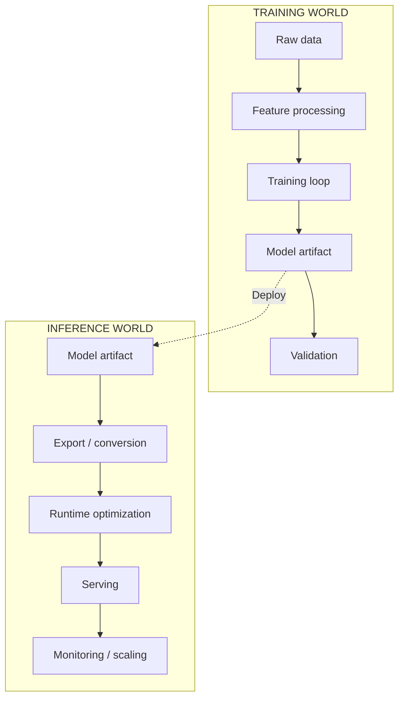


Training thường tối ưu cho throughput dài hạn: xử lý nhiều data, nhiều epoch, nhiều GPU, nhiều giờ hoặc nhiều ngày.

Inference production thường tối ưu cho request-level behavior: mỗi request phải được phản hồi trong một khoảng thời gian có thể chấp nhận được. Ví dụ, service có thể đặt SLO như:

```text
p99 latency < 100 ms
availability >= 99.9%
throughput >= 1000 requests/second
```

Điểm quan trọng: một model train tốt chưa chắc phục vụ tốt. Production inference cần thêm các lớp tối ưu, scheduling, batching, memory management, monitoring và rollout.


## Model artifact khác gì inference service?

### Model artifact

Model artifact là sản phẩm của quá trình training. Nó có thể là:

- File weight.
- Checkpoint.
- Serialized model.
- TorchScript module.
- ONNX model.
- TensorRT engine.

Artifact trả lời câu hỏi:

\important{Model đã học được gì, và computation graph hoặc weights của nó được lưu ở đâu?}

### Inference service

Inference service trả lời câu hỏi khác:

\insight{Làm sao nhận request từ user, xử lý input, chạy model ổn định, trả output đúng format, đạt latency/throughput mục tiêu, quan sát được lỗi, và rollout an toàn?}

Một inference service thường bao gồm:

| Thành phần         | Vai trò                                                               |
|:-------------------|:----------------------------------------------------------------------|
| API layer          | Nhận request qua HTTP/gRPC/message queue                              |
| Input validation   | Kiểm tra schema, size, dtype, range, authentication                   |
| Preprocessing      | Decode ảnh, tokenize text, resize, normalize, pad/truncate            |
| Scheduler          | Queue request, gom batch, điều phối worker/GPU                        |
| Runtime            | ONNX Runtime, TensorRT, PyTorch eager, TensorFlow Serving, vLLM, v.v. |
| GPU execution      | Kernel launch, memory transfer, compute, synchronization              |
| Postprocessing     | Softmax, NMS, decode token, map label, format result                  |
| Observability      | Metrics, logs, traces, profiling, alerting                            |
| Deployment control | Versioning, rollback, canary, A/B testing                             |

Sai lầm phổ biến là chỉ nhìn vào dòng:


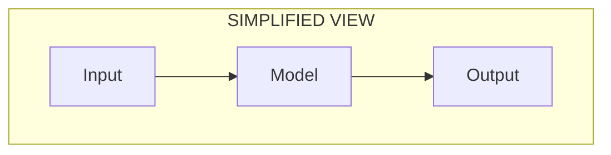

Trong production, dòng đúng hơn là:

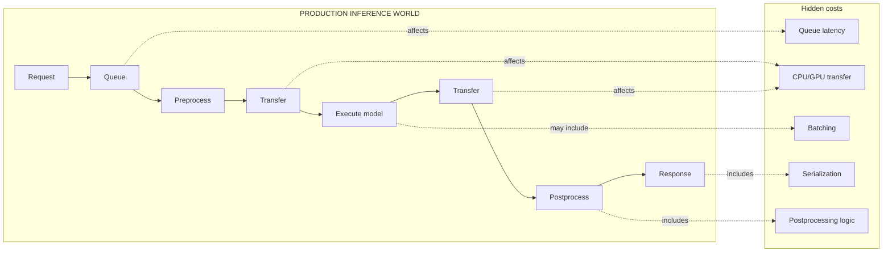

Nếu chỉ tối ưu `execute` mà bottleneck thật nằm ở `queue` hoặc `preprocess`, service vẫn chậm.


## Anatomy of one inference request

Hãy xem một request image classification đi qua service như sau:

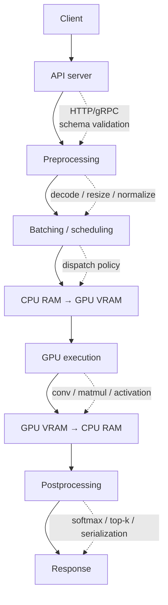

End-to-end latency có thể được tách thành:

```mermaid
%%| echo: false
%%| fig-width: 6
%%| fig-align: center
flowchart LR

REQ["Request latency"]
--> NET["Network"]
--> QUEUE["Queue"]
--> PRE["Preprocess"]
--> H2D["Host → Device"]
--> GPU["GPU execute"]
--> D2H["Device → Host"]
--> POST["Postprocess"]
--> SER["Serialize"]

%% Formula relationship

TOTAL["L_total"]
-. "sum of all stages" .-> REQ

%% Optional annotations

NET -. "L_network" .-> QUEUE
QUEUE -. "L_queue" .-> PRE
PRE -. "L_preprocess" .-> H2D
H2D -. "L_host_to_device" .-> GPU
GPU -. "L_gpu_execute" .-> D2H
D2H -. "L_device_to_host" .-> POST
POST -. "L_postprocess" .-> SER
SER -. "L_serialize" .-> TOTAL
```

Trong nhiều demo, bạn chỉ đo `L_gpu_execute`. Trong production, user cảm nhận `L_total`.

### Ví dụ latency budget

Giả sử SLO của service là:

```text
p99 latency < 100 ms
```

Một budget ban đầu có thể là:

| Thành phần | Budget |
|---|---:|
| Network + API parsing | 5 ms |
| Queueing | 10 ms |
| Preprocessing | 15 ms |
| H2D transfer | 5 ms |
| GPU execution | 40 ms |
| D2H transfer | 5 ms |
| Postprocessing + serialization | 10 ms |
| Safety margin | 10 ms |
| Total | 100 ms |

Nếu preprocessing thực tế là 45 ms, TensorRT có giảm GPU execution từ 40 ms xuống 20 ms thì tổng vẫn có thể vượt SLO. Đây là lý do inference optimization cần nhìn cả hệ thống, không chỉ nhìn model.


## GPU mental model

### GPU không phải là CPU nhanh hơn

CPU và GPU được thiết kế cho hai kiểu workload khác nhau.

CPU mạnh ở:

- Single-thread performance.
- Branching phức tạp.
- Control flow nhiều điều kiện.
- Low-latency task nhỏ.
- Hệ điều hành, networking, orchestration.

GPU mạnh ở:

- Data parallelism.
- Matrix multiplication.
- Tensor operations.
- Throughput cao.
- Memory bandwidth lớn.
- Chạy hàng nghìn thread song song.

Deep learning inference chủ yếu là các phép toán tensor như convolution, matrix multiplication, attention, normalization và elementwise operations. Đây là những workload có tính song song rất cao, nên phù hợp với GPU.

Một mental model đơn giản:

```text
CPU = ít worker, mỗi worker rất linh hoạt và mạnh với logic phức tạp.
GPU = rất nhiều worker, mỗi worker đơn giản hơn, nhưng tổng throughput rất lớn nếu công việc được chia đều.
```

### Host và device

Trong CUDA-style programming, hệ thống thường được nhìn thành:

```text
Host   = CPU + system RAM
Device = GPU + GPU memory / VRAM
```

Thông thường:

- Request được nhận ở host.
- Preprocessing thường bắt đầu ở host.
- Tensor input cần nằm ở device memory để GPU tính toán.
- GPU chạy các CUDA kernels.
- Output có thể được copy về host để postprocess hoặc trả response.

Một source latency hay bị bỏ qua là data transfer:

```text
CPU RAM <-> GPU VRAM
```

Nếu tensor nhỏ, overhead transfer và kernel launch có thể chiếm tỷ lệ lớn. Nếu tensor lớn, bandwidth giữa host và device có thể trở thành bottleneck.

### CUDA kernel

CUDA kernel là một function chạy song song trên GPU. Khi deep learning runtime chạy một layer như convolution, matmul hoặc activation, runtime thường gọi một hoặc nhiều kernel đã được tối ưu.

Ví dụ ở mức khái niệm:

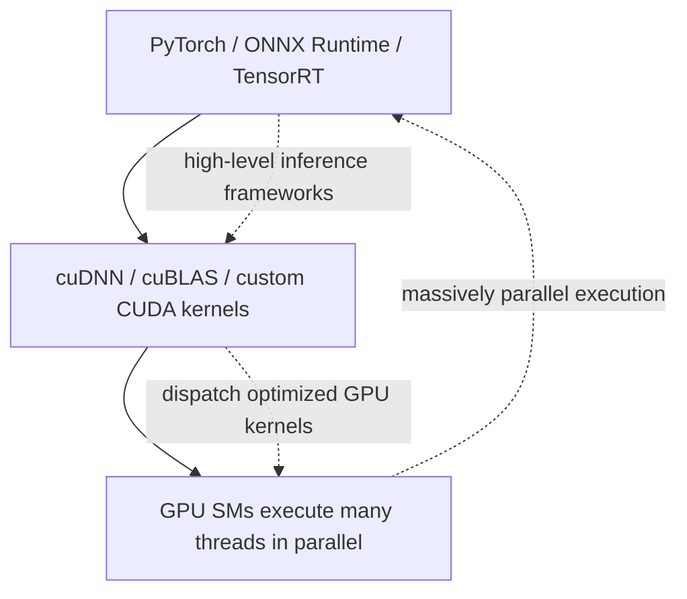

Bạn chưa cần viết CUDA kernel ở giai đoạn này. Nhưng bạn cần hiểu rằng một model inference thực chất là một chuỗi kernel launches và memory operations.

### Streaming Multiprocessor, warp, block

Một GPU NVIDIA gồm nhiều Streaming Multiprocessors, thường gọi tắt là SM. Có thể hình dung:

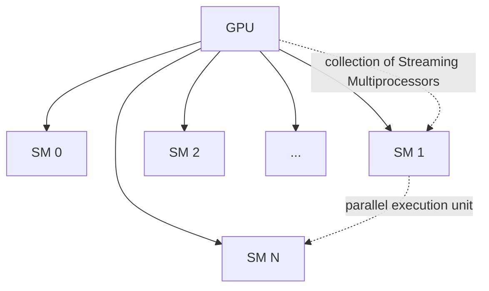

CUDA chia công việc thành các thread. Thread được nhóm thành blocks, và GPU schedule các blocks lên SM. Ở mức thực thi, thread thường được thực thi theo nhóm gọi là warp.


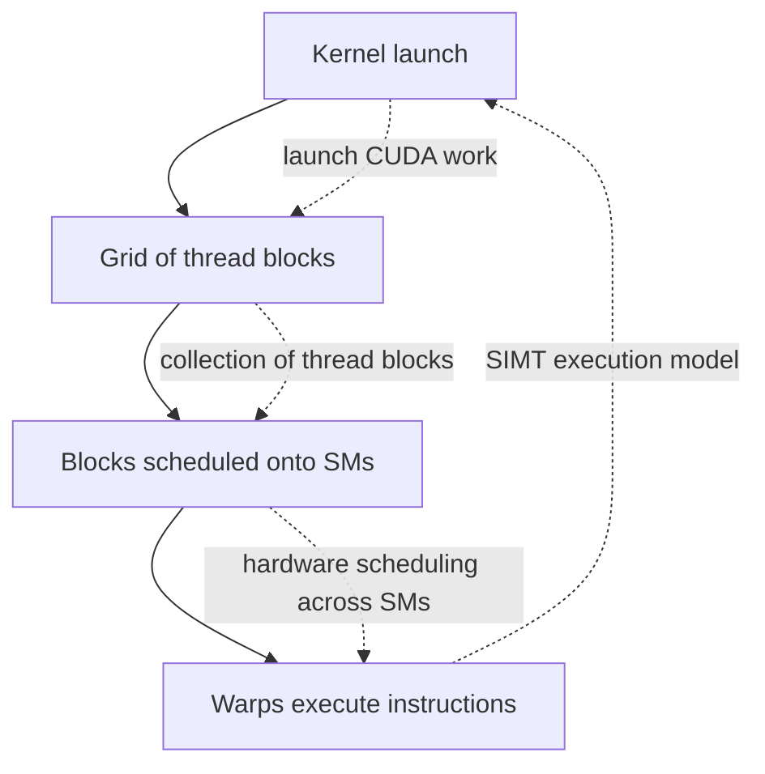

Với deep learning inference, bạn không trực tiếp điều phối thread/block nếu dùng TensorRT hoặc ONNX Runtime. Runtime và các thư viện kernel sẽ làm việc đó. Tuy nhiên, hiểu mô hình này giúp bạn hiểu các khái niệm như occupancy, memory bandwidth, kernel fusion và launch overhead.

### Memory hierarchy

GPU có nhiều tầng bộ nhớ. Tốc độ và dung lượng thường đánh đổi nhau:

| Bộ nhớ               | Đặc điểm                      | Ghi chú                            |
|:---------------------|:------------------------------|:-----------------------------------|
| Registers            | Rất nhanh, rất nhỏ            | Riêng cho thread                   |
| Shared memory        | Nhanh, nhỏ                    | Chia sẻ trong một block            |
| L1/L2 cache          | Trung gian                    | Giúp giảm global memory access     |
| Global memory / VRAM | Lớn, chậm hơn register/shared | Chứa tensors, weights, activations |
| Host memory          | RAM phía CPU                  | Cần transfer nếu GPU cần dữ liệu   |

Nhiều model không bị giới hạn bởi số phép tính, mà bị giới hạn bởi tốc độ đọc/ghi bộ nhớ. Đây gọi là memory-bound workload.

Ví dụ:

- Large matrix multiplication thường có thể tận dụng compute tốt.
- Một chuỗi elementwise operations nhỏ có thể bị memory bandwidth và kernel launch overhead chi phối.
- Attention decode trong LLM thường bị ảnh hưởng nặng bởi memory access tới KV cache.

### Tensor Cores

Tensor Cores là phần cứng chuyên dụng trong GPU NVIDIA để tăng tốc các phép matrix/tensor math ở một số precision nhất định, ví dụ FP16, BF16, TF32, INT8 hoặc FP8 tùy kiến trúc GPU.

Vì deep learning dùng rất nhiều matmul/convolution, Tensor Cores là lý do các precision thấp như FP16, BF16, INT8, FP8 có thể tăng tốc mạnh. Nhưng đổi precision không chỉ là bật một flag. Bạn phải kiểm tra:

- Hardware có hỗ trợ precision đó không.
- Runtime có kernel tối ưu cho operator đó không.
- Accuracy có bị giảm không.
- Shape có phù hợp để kernel chạy hiệu quả không.

### CUDA streams và concurrency

CUDA stream là một hàng đợi công việc trên GPU. Các operation trong cùng một stream thường giữ thứ tự. Các stream khác nhau có thể cho phép overlap một số công việc, tùy hardware, runtime và dependency.

Ví dụ:

```text
Stream A: H2D copy request 1 -> execute request 1 -> D2H copy request 1
Stream B: H2D copy request 2 -> execute request 2 -> D2H copy request 2
```

Nếu được thiết kế tốt, service có thể overlap data transfer, compute và nhiều request. Tuy nhiên, concurrency không tự động tạo performance tốt. Quá nhiều concurrency có thể làm queue dài, tăng memory pressure và làm p99 latency xấu đi.


## Inference as graph execution

Một neural network có thể được nhìn như computation graph:

```mermaid
%%| echo: false
%%| fig-width: 6
%%| fig-align: center
flowchart LR

INPUT["Input"]
--> CONV["Conv"]
--> BN["BatchNorm"]
--> RELU["ReLU"]
--> POOL["MaxPool"]
--> FC["Linear"]
--> SOFTMAX["Softmax"]
--> OUTPUT["Output"]

%% Optional annotations

CONV -. "feature extraction" .-> BN

BN -. "normalize activations" .-> RELU

RELU -. "non-linear activation" .-> POOL

POOL -. "spatial downsampling" .-> FC

FC -. "classification logits" .-> SOFTMAX

SOFTMAX -. "probability distribution" .-> OUTPUT
```

Mỗi node là một operation. Mỗi edge là tensor đi từ operation này sang operation khác.

Khi bạn train bằng PyTorch, bạn thường làm việc với Python objects và dynamic execution. Nhưng khi deploy, runtime thường muốn một graph rõ ràng hơn để tối ưu.

Đây là nơi ONNX, ONNX Runtime và TensorRT xuất hiện.

### ONNX là gì trong stack?

ONNX là một open format để biểu diễn machine learning model. Nó định nghĩa một file format và một tập operator chung để model có thể đi qua nhiều framework, runtime, compiler và hardware backend khác nhau.


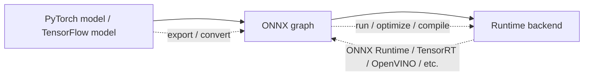

ONNX không phải là GPU runtime. ONNX là representation. Nó trả lời câu hỏi:

> Graph của model gồm những node nào, tensor nào, operator nào, shape nào, dtype nào?

### ONNX Runtime là gì?

ONNX Runtime là một runtime để chạy ONNX model. Nó có thể áp dụng graph optimizations và dùng các Execution Providers để chạy trên hardware khác nhau.

Ví dụ Execution Providers:

- CPU Execution Provider.
- CUDA Execution Provider.
- TensorRT Execution Provider.
- OpenVINO Execution Provider.
- CoreML, DirectML, QNN, v.v.


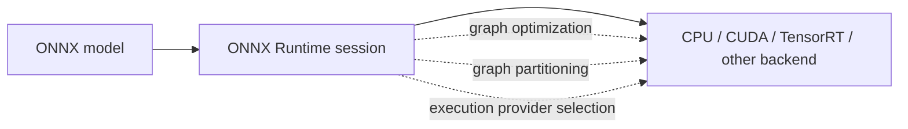

### TensorRT là gì?

TensorRT là một SDK của NVIDIA để tối ưu và tăng tốc deep learning inference trên GPU NVIDIA. Nó có thể nhận model từ PyTorch, TensorFlow, ONNX và tạo ra optimized runtime engine.

TensorRT có thể thực hiện nhiều loại tối ưu:

- Graph optimization.
- Layer fusion.
- Precision selection như FP32, FP16, BF16, FP8, INT8 tùy phần cứng và model.
- Kernel/tactic selection.
- Memory planning.
- Dynamic shape optimization profiles.
- Engine serialization.


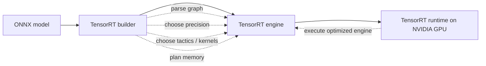

TensorRT không chỉ là runtime. Nó có phần compiler/optimizer rất quan trọng. Khi bạn build engine, TensorRT đang quyết định cách graph sẽ được thực thi hiệu quả trên GPU cụ thể.

### Triton Inference Server là gì?

Triton là serving layer. Nó không thay thế ONNX hoặc TensorRT, mà giúp quản lý và phục vụ model ở production.

Triton thường phụ trách:

- Model repository.
- Multi-model serving.
- Dynamic batching.
- Concurrent model execution.
- Versioning.
- Metrics.
- HTTP/gRPC endpoint.
- Backend integration: TensorRT, ONNX Runtime, PyTorch, Python backend, v.v.


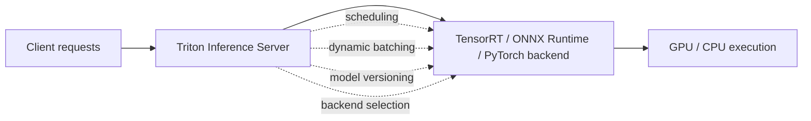

## Putting the stack together

Một inference stack phổ biến có thể như sau:

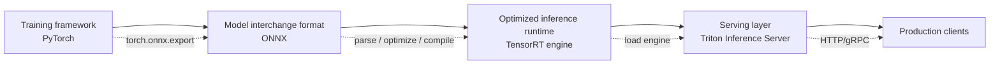

Một stack khác có thể không dùng TensorRT:

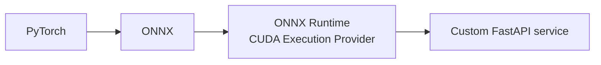

Một stack khác nữa có thể không dùng ONNX:

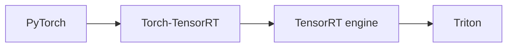

Điều quan trọng là hiểu vai trò:

| Công nghệ    | Vai trò chính                              | Không nên hiểu nhầm là             |
|:-------------|:-------------------------------------------|:-----------------------------------|
| ONNX         | Model representation / interchange format  | Một serving server                 |
| ONNX Runtime | Runtime chạy ONNX model trên nhiều backend | Chỉ dành cho CPU                   |
| TensorRT     | NVIDIA inference compiler + runtime        | Chỉ là một thư viện Python wrapper |
| Triton       | Inference serving server                   | Một model optimizer                |
| CUDA         | Programming/runtime layer cho NVIDIA GPU   | Một deep learning framework        |


## Latency, throughput và tail behavior

### Latency

Latency là thời gian để xử lý một request.

```text
request sent -> response received
```

Có nhiều cách nhìn latency:

| Metric          | Ý nghĩa                           |
|:----------------|:----------------------------------|
| Average latency | Trung bình, dễ bị che bởi outlier |
| Median / p50    | 50% request nhanh hơn giá trị này |
| p95             | 95% request nhanh hơn giá trị này |
| p99             | 99% request nhanh hơn giá trị này |
| Max             | Request chậm nhất quan sát được   |

Production service thường quan tâm p95 hoặc p99 vì user không chỉ cảm nhận request trung bình. Một phần nhỏ request chậm có thể phá trải nghiệm hoặc làm downstream system timeout.

### Throughput

Throughput là số request xử lý được trong một đơn vị thời gian.


$$\text{throughput} = \frac{\text{completed requests}}{\text{second}}$$


Đơn vị thường gặp:

- RPS: requests per second.
- QPS: queries per second.
- images/sec.
- tokens/sec đối với LLM.

### Utilization

GPU utilization cho biết GPU đang bận đến mức nào. Nhưng chỉ số này cần đọc cẩn thận.

GPU utilization cao không luôn đồng nghĩa service tốt:

- GPU có thể bận vì queue quá dài.
- GPU có thể bận nhưng p99 latency xấu.
- GPU có thể bận vì kernel kém hiệu quả.
- GPU có thể memory-bound, không phải compute-bound.

GPU utilization thấp cũng không luôn là lỗi:

- Service batch size = 1 và SLO rất thấp latency.
- Workload nhỏ, request thưa.
- Bottleneck nằm ở CPU preprocessing hoặc network.

### Concurrency

Concurrency là số request đang ở trong hệ thống cùng lúc. Một rule-of-thumb từ queueing theory:


$$\text{concurrency} \approx \text{throughput} * \text{latency}$$


Ví dụ, nếu service xử lý 500 requests/second và mỗi request mất trung bình 100 ms:

$$\text{concurrency} \approx 500 * 0.1 = 50 \space \text{requests}$$


Đây chỉ là trực giác ban đầu, không thay thế benchmark. Với p99, burst traffic, batching và queueing, behavior phức tạp hơn nhiều.


## The latency-throughput trade-off

Inference serving luôn có trade-off:

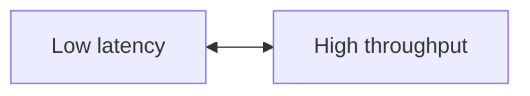

### Batch size = 1

Ưu điểm:

- Request không phải chờ gom batch.
- Latency đơn request thấp hơn trong nhiều trường hợp.
- Dễ reasoning.

Nhược điểm:

- GPU có thể không được tận dụng hết.
- Kernel launch overhead chiếm tỷ lệ lớn.
- Matrix multiplication nhỏ có thể kém hiệu quả.

### Batch size lớn

Ưu điểm:

- Tăng arithmetic intensity.
- Tận dụng GPU tốt hơn.
- Throughput cao hơn.

Nhược điểm:

- Request phải chờ batch đầy hoặc timeout.
- Memory usage tăng.
- p99 latency có thể xấu.
- Không phù hợp với mọi workload.

### Dynamic batching

Dynamic batching là kỹ thuật server chờ một khoảng rất ngắn để gom nhiều request độc lập thành một batch.

Ví dụ:

```text
Request arrival timeline:

0.0 ms: request A arrives
0.7 ms: request B arrives
1.2 ms: request C arrives
1.5 ms: dispatch batch [A, B, C]
```

Nếu model chạy batch size 3 hiệu quả hơn nhiều so với chạy 3 request batch size 1, throughput tăng. Nhưng nếu chờ quá lâu, latency tăng.

Vì vậy, dynamic batching thường cần cấu hình:

- Max batch size.
- Max queue delay.
- Preferred batch sizes.
- Number of instances.
- SLO target.

Chúng ta sẽ học kỹ phần này khi tới Triton.


## Where time goes: các loại bottleneck phổ biến

### Compute-bound

Dấu hiệu:

- GPU compute utilization cao.
- Tensor Cores bận.
- Model gồm nhiều matmul/convolution lớn.
- Tăng batch size cải thiện throughput.

Cách tối ưu thường gặp:

- FP16/BF16/INT8/FP8 nếu phù hợp.
- TensorRT engine.
- Kernel fusion.
- Shape alignment.
- Tối ưu architecture model.

### Memory-bound

Dấu hiệu:

- GPU memory bandwidth cao.
- Compute utilization không quá cao.
- Nhiều operation đọc/ghi tensor lớn nhưng ít tính toán.
- Elementwise chain hoặc attention decode có thể rơi vào nhóm này.

Cách tối ưu thường gặp:

- Kernel fusion để giảm đọc/ghi intermediate tensors.
- Layout tối ưu.
- Quantization để giảm footprint.
- KV cache optimization với LLM.

### Transfer-bound

Dấu hiệu:

- Thời gian H2D/D2H đáng kể.
- Input/output tensor lớn.
- Model execution nhanh nhưng end-to-end latency vẫn cao.

Cách tối ưu thường gặp:

- Giảm số lần copy.
- Dùng pinned/page-locked memory nếu phù hợp.
- Giữ postprocessing trên GPU khi có lợi.
- Overlap transfer với compute bằng stream.
- Tránh copy output không cần thiết.

### Preprocessing-bound

Dấu hiệu:

- CPU usage cao.
- GPU idle nhiều.
- Decode ảnh, resize, tokenization hoặc feature extraction chiếm thời gian lớn.

Cách tối ưu thường gặp:

- Parallel preprocessing.
- Move một phần preprocessing lên GPU.
- Cache kết quả nếu input lặp.
- Dùng thư viện tối ưu hơn.
- Giảm overhead serialization/deserialization.

### Queueing-bound

Dấu hiệu:

- Latency tăng mạnh khi traffic tăng.
- Model execution ổn nhưng p99 xấu.
- Queue length tăng.
- Timeout hoặc retry làm hệ thống tệ hơn.

Cách tối ưu thường gặp:

- Điều chỉnh batching delay.
- Tăng số instance hoặc replicas.
- Autoscaling.
- Admission control.
- Backpressure.
- Load shedding nếu cần.


## Vì sao TensorRT tồn tại?

Framework training như PyTorch rất linh hoạt. Nhưng linh hoạt không phải lúc nào cũng tối ưu nhất cho inference production.

TensorRT tồn tại để biến model đã train thành một execution plan tối ưu hơn cho GPU NVIDIA. Ở mức khái niệm, nó làm các việc như:

### Graph cleanup và optimization

Ví dụ, một graph có thể có node dư thừa hoặc pattern có thể đơn giản hóa:

```text
x -> Identity -> y
```

có thể thành:

```text
x -> y
```

### Layer fusion

Nhiều layer liên tiếp có thể được fuse để giảm memory access và kernel launch.

Ví dụ:

```text
Conv -> BatchNorm -> ReLU
```

có thể được thực thi hiệu quả hơn dưới dạng một fused operation hoặc một sequence đã tối ưu.

Tương tự:

```text
MatMul -> Add -> Activation
```

có thể map sang kernel/tactic tối ưu hơn.

### Precision optimization

Thay vì dùng FP32 mọi nơi, inference có thể dùng precision thấp hơn:

- FP16.
- BF16.
- INT8.
- FP8 trên phần cứng phù hợp.

Lợi ích:

- Giảm memory bandwidth.
- Giảm memory footprint.
- Tăng tốc nhờ Tensor Cores.

Rủi ro:

- Accuracy giảm.
- Operator không hỗ trợ precision mong muốn.
- Calibration hoặc quantization không tốt.

### Tactic selection

Với cùng một operation như convolution hoặc matrix multiplication, có nhiều thuật toán/kernel khác nhau. TensorRT có thể benchmark hoặc chọn tactic phù hợp với:

- GPU architecture.
- Tensor shape.
- Precision.
- Workspace memory limit.
- Dynamic shape profile.

Đây là lý do engine có thể phụ thuộc vào hardware, shape range và config build.

### Memory planning

TensorRT có thể lập kế hoạch memory cho intermediate tensors để giảm allocation runtime và tái sử dụng buffer hiệu quả hơn.

Trong production, memory planning quan trọng vì:

- GPU memory hữu hạn.
- Multi-model serving cần chia sẻ GPU.
- Batch size lớn làm activation memory tăng.
- Dynamic shape có thể cần profile rõ ràng.


## A practical mental model for optimization

Khi tối ưu inference, đừng bắt đầu bằng câu:

> Làm sao dùng TensorRT?

Hãy bắt đầu bằng câu:

> Bottleneck hiện tại của hệ thống là gì?

Một workflow chuẩn:

```text
1. Define target
   - p99 latency?
   - throughput?
   - cost/request?
   - GPU type?
   - accuracy constraint?

2. Measure baseline
   - End-to-end latency
   - Model-only latency
   - Preprocessing latency
   - Queueing latency
   - GPU utilization
   - CPU utilization
   - Memory usage

3. Identify bottleneck
   - Compute?
   - Memory?
   - Transfer?
   - Preprocessing?
   - Queueing?

4. Apply targeted optimization
   - TensorRT?
   - Quantization?
   - Batching?
   - Preprocessing optimization?
   - More replicas?

5. Validate
   - Accuracy
   - p50/p95/p99 latency
   - Throughput under load
   - Stability
   - Memory footprint

6. Roll out safely
   - Canary
   - A/B test
   - Shadow traffic
   - Rollback plan
```
Nếu bỏ qua baseline, bạn dễ tối ưu nhầm chỗ.


## Worked examples

### Example 1: model nhanh nhưng service chậm

Giả sử một image classification service có latency như sau:

| Thành phần            | Latency |
|:----------------------|:--------|
| API parse             | 2 ms    |
| Image decode + resize | 35 ms   |
| H2D copy              | 3 ms    |
| GPU execution         | 8 ms    |
| D2H copy              | 1 ms    |
| Postprocessing        | 2 ms    |
| Total                 | 51 ms   |

Bạn dùng TensorRT và giảm GPU execution từ 8 ms xuống 3 ms.

Latency mới:

```text
2 + 35 + 3 + 3 + 1 + 2 = 46 ms
```

Bạn đã tăng tốc model 2.67x, nhưng end-to-end latency chỉ cải thiện từ 51 ms xuống 46 ms, tức khoảng 9.8%.

Kết luận: bottleneck thật là preprocessing, không phải GPU execution.

### Example 2: batch size tăng throughput nhưng làm p99 xấu

Service object detection có traffic không đều. Bạn bật dynamic batching với max queue delay = 20 ms.

Kết quả:

| Metric | Trước batching | Sau batching |
|---|---:|---:|
| Throughput | 200 RPS | 520 RPS |
| Average latency | 30 ms | 42 ms |
| p99 latency | 70 ms | 145 ms |

Nếu SLO là p99 < 100 ms, cấu hình batching này không đạt dù throughput tăng mạnh.

Có thể cần:

- Giảm max queue delay.
- Chọn preferred batch size nhỏ hơn.
- Tăng number of instances.
- Tách traffic theo priority.
- Autoscale nhiều replicas hơn.

### Example 3: GPU utilization thấp không nhất thiết là xấu

Một real-time fraud detection service yêu cầu p99 < 20 ms. Model nhỏ, batch size = 1. GPU utilization chỉ 25%.

Điều này có thể chấp nhận được nếu:

- Latency đạt SLO.
- Cost chấp nhận được.
- Traffic không đủ lớn để batch.
- Business ưu tiên phản hồi nhanh hơn throughput.

Tối ưu utilization lên 90% nhưng làm p99 thành 80 ms là thất bại.

## Design principles cho inference engineer

 **1: Measure end-to-end, then measure model-only**

Luôn tách:

- End-to-end latency.
- Model execution latency.
- Queue latency.
- Preprocess/postprocess latency.
- Transfer latency.

Nếu không tách, bạn không biết tối ưu ở đâu.

 **2: p99 quan trọng hơn average trong production**

Average latency có thể đẹp nhưng p99 xấu. User và downstream system thường bị ảnh hưởng bởi tail latency.

 **3: Batching là con dao hai lưỡi**

Batching có thể tăng throughput, nhưng có thể làm latency tăng. Luôn tune batching theo SLO.

 **4: Precision thấp cần validation**

FP16/INT8/FP8 có thể nhanh hơn nhưng cần kiểm tra accuracy và numerical stability.

 **5: Runtime optimization không thay thế model design**

Một model quá lớn, shape không phù hợp hoặc architecture kém inference-friendly vẫn có thể khó tối ưu.

 **6: Optimize bottleneck, not the tool you like**

TensorRT rất mạnh, nhưng nếu bottleneck nằm ở tokenization hoặc image decode, TensorRT không giải quyết gốc vấn đề.

 **7: Hardware matters**

Engine, precision và tactic có thể phụ thuộc vào GPU architecture. Một engine tối ưu trên GPU này chưa chắc tối ưu trên GPU khác.

 **8: Production inference cần rollout strategy**

Mọi optimization đều có rủi ro. Cần canary, rollback và monitoring.


## 16. Mini-lab: worksheet tư duy hệ thống

### Lab 1: vẽ pipeline latency

Hãy chọn một model bạn quen thuộc, ví dụ:

- Image classification.
- Object detection.
- Text embedding.
- Speech-to-text.

Vẽ pipeline:

```text
request -> validation -> preprocessing -> batching -> H2D -> GPU execute -> D2H -> postprocessing -> response
```

Sau đó tự điền latency giả định:

| Stage             | Latency estimate |
|:------------------|:-----------------|
| Validation        | ?                |
| Preprocessing     | ?                |
| Queueing/batching | ?                |
| H2D               | ?                |
| GPU execution     | ?                |
| D2H               | ?                |
| Postprocessing    | ?                |
| Total             | ?                |

Câu hỏi:

1. Stage nào có khả năng là bottleneck?
2. Nếu dùng TensorRT làm GPU execution nhanh hơn 2x, total latency giảm bao nhiêu?
3. Nếu bật batching, stage nào tăng và stage nào giảm?

### Lab 2: chọn strategy theo SLO

Bạn có service với yêu cầu:

```text
p99 < 80 ms
throughput >= 300 RPS
```

Baseline:

| Metric                    | Value   |
|:--------------------------|:--------|
| Average latency           | 45 ms   |
| p99 latency               | 120 ms  |
| Throughput max            | 280 RPS |
| GPU utilization           | 55%     |
| CPU utilization           | 85%     |
| Preprocessing latency p99 | 60 ms   |

Bạn sẽ ưu tiên gì?

**A.** Build TensorRT engine ngay.\
**B.** Tăng batch size thật lớn.\
**C.** Profile và tối ưu preprocessing/CPU path trước.\
**D.** Chỉ nhìn GPU utilization.

Đáp án hợp lý nhất: **C.**

Lý do: p99 preprocessing đã 60 ms, CPU utilization cao, throughput chưa đạt, GPU utilization chưa quá cao. Bottleneck ban đầu có vẻ nằm ở CPU/preprocessing và queueing, không chắc là model execution.

### Lab 3: batching trade-off

Giả sử model có latency theo batch size:

| Batch size | Model latency | Images/sec |
|:-----------|:--------------|:-----------|
| 1          | 5 ms          | 200        |
| 2          | 7 ms          | 286        |
| 4          | 11 ms         | 364        |
| 8          | 20 ms         | 400        |
| 16         | 42 ms         | 381        |

Câu hỏi:

1. Batch size nào có throughput tốt nhất?
2. Batch size nào có latency model thấp nhất?
3. Nếu SLO p99 rất nghiêm ngặt, bạn có chắc chọn batch size 8 không?

Gợi ý đáp án:

1. Batch size 8 có images/sec cao nhất trong bảng.
2. Batch size 1 có model latency thấp nhất.
3. Không chắc. Cần tính thêm queueing delay, arrival pattern và p99 latency end-to-end.


## Checkpoint questions

**1. Vì sao trained model artifact chưa phải production service?**

Vì artifact chỉ lưu graph/weights hoặc model representation. Production service còn cần API, validation, preprocessing, scheduling, batching, runtime execution, postprocessing, monitoring, scaling, versioning và rollout.

**2. ONNX có phải là runtime không?**

Không. ONNX chủ yếu là format/representation cho model. Runtime như ONNX Runtime hoặc TensorRT mới là thứ thực thi model.

**3. ONNX Runtime khác TensorRT thế nào?**

ONNX Runtime là runtime đa backend cho ONNX model, có thể chạy qua nhiều Execution Providers như CPU, CUDA, TensorRT, OpenVINO, v.v. TensorRT là NVIDIA inference compiler/runtime tối ưu sâu cho GPU NVIDIA.

**4. TensorRT engine là gì?**

Ở mức khái niệm, TensorRT engine là execution plan đã được optimize/compile cho một model, một tập shape/profile, precision config và hardware target nhất định.

**5. Vì sao batch size lớn có thể tăng throughput?**

Batch size lớn giúp GPU có nhiều công việc song song hơn, làm matrix operations lớn hơn và giảm tỷ lệ overhead trên mỗi sample. Nhưng batch lớn cũng có thể tăng memory usage và queueing latency.

**6. Vì sao p99 latency quan trọng?**

Vì p99 phản ánh tail behavior. Một service có average latency tốt vẫn có thể gây timeout hoặc trải nghiệm xấu nếu 1% request chậm bất thường.

**7. GPU utilization thấp có luôn là vấn đề không?**

Không. Nếu service đạt latency SLO và traffic thấp hoặc workload nhỏ, utilization thấp có thể chấp nhận được. Optimization cần dựa trên mục tiêu business và SLO.

**8. Kernel fusion giúp gì?**

Kernel fusion giảm số kernel launches và giảm đọc/ghi intermediate tensors vào global memory. Điều này có thể cải thiện latency và memory bandwidth efficiency.

**9. Khi nào TensorRT không giải quyết được bottleneck?**

Khi bottleneck nằm ngoài model execution, ví dụ preprocessing, network, queueing, serialization, H2D/D2H transfer hoặc CPU tokenization.

**10. Bước đầu tiên khi tối ưu inference là gì?**

Xác định target và đo baseline end-to-end. Không nên tối ưu bằng cảm giác hoặc chỉ vì một tool nghe có vẻ mạnh.


## Glossary

| Thuật ngữ          | Giải thích ngắn                                                          |
|:-------------------|:-------------------------------------------------------------------------|
| Inference          | Quá trình dùng model đã train để tạo prediction/output                   |
| Model artifact     | File hoặc object chứa weights/graph/model sau training                   |
| Runtime            | Thành phần thực thi model, ví dụ ONNX Runtime hoặc TensorRT runtime      |
| Compiler/optimizer | Thành phần biến graph thành execution plan tối ưu hơn                    |
| ONNX               | Open model format để biểu diễn ML model và operator graph                |
| ONNX Runtime       | Runtime để chạy ONNX model với nhiều Execution Providers                 |
| TensorRT           | NVIDIA SDK để tối ưu và tăng tốc deep learning inference trên GPU NVIDIA |
| Triton             | Inference server để serve nhiều model/backend ở production               |
| CUDA               | Platform/programming model cho GPU NVIDIA                                |
| Kernel             | Function chạy song song trên GPU                                         |
| Stream             | Queue công việc trên GPU, dùng để quản lý thứ tự và concurrency          |
| SM                 | Streaming Multiprocessor, đơn vị thực thi chính trong GPU NVIDIA         |
| Warp               | Nhóm thread được thực thi cùng nhau ở mức phần cứng                      |
| H2D                | Host-to-device transfer, copy từ CPU RAM sang GPU memory                 |
| D2H                | Device-to-host transfer, copy từ GPU memory về CPU RAM                   |
| Latency            | Thời gian xử lý một request                                              |
| Throughput         | Số request/sample xử lý mỗi giây                                         |
| p99                | 99th percentile latency                                                  |
| Dynamic batching   | Gom request đến gần nhau thành batch để tăng throughput                  |
| Quantization       | Giảm precision của weight/activation để giảm memory/compute cost         |
| Kernel fusion      | Gộp nhiều operation thành ít kernel hơn                                  |
| Memory-bound       | Bottleneck do bandwidth/memory access                                    |
| Compute-bound      | Bottleneck do số phép tính                                               |


## Summary

Bài này xây nền tảng cho toàn bộ quá trình học ONNX và TensorRT.

Các ý quan trọng nhất:

1. Inference production không chỉ là `model(input)`.
2. Latency end-to-end gồm nhiều phần: queueing, preprocessing, transfer, GPU execution, postprocessing.
3. GPU là throughput machine, không phải CPU nhanh hơn.
4. Deep learning inference là graph execution qua nhiều kernels và memory operations.
5. ONNX là representation, ONNX Runtime là runtime đa backend, TensorRT là NVIDIA inference compiler/runtime, Triton là serving server.
6. Batching tăng throughput nhưng có thể làm p99 latency xấu.
7. Tối ưu inference cần đo baseline, tìm bottleneck, tối ưu đúng chỗ, validate accuracy và rollout an toàn.

Nếu bạn nắm chắc bài này, các bài sau về ONNX graph, ONNX Runtime Execution Providers, TensorRT engine, quantization và Triton dynamic batching sẽ dễ hiểu hơn nhiều.


## Preview bài tiếp theo

Lesson 2 là: **ONNX Fundamentals: Model Graph, Operators, Opset and Export Pipeline**

Nội dung chính:

- ONNX là intermediate representation như thế nào.
- Node, edge, tensor, initializer.
- Opset version.
- Static shape vs dynamic axes.
- Export từ PyTorch sang ONNX.
- Inspect graph bằng Netron.
- Validate model bằng ONNX checker.
- Chạy model bằng ONNX Runtime.
- Các lỗi export phổ biến.

## reference

Tài liệu dưới đây không bắt buộc phải đọc ngay, nhưng là nguồn chính thức để đối chiếu khi cần:

1. NVIDIA TensorRT Documentation  
   https://docs.nvidia.com/deeplearning/tensorrt/latest/index.html

2. NVIDIA TensorRT Developer page  
   https://developer.nvidia.com/tensorrt

3. ONNX official website  
   https://onnx.ai/

4. ONNX Runtime documentation  
   https://onnxruntime.ai/docs/

5. ONNX Runtime Execution Providers  
   https://onnxruntime.ai/docs/execution-providers/

6. NVIDIA CUDA C++ Programming Guide  
   https://docs.nvidia.com/cuda/cuda-c-programming-guide/contents.html
