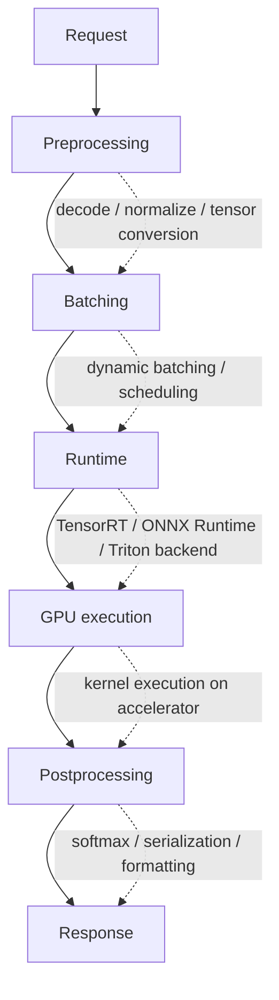
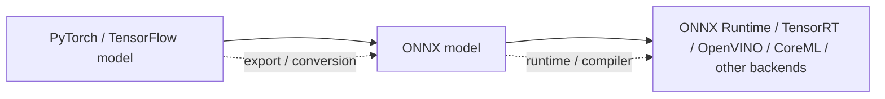
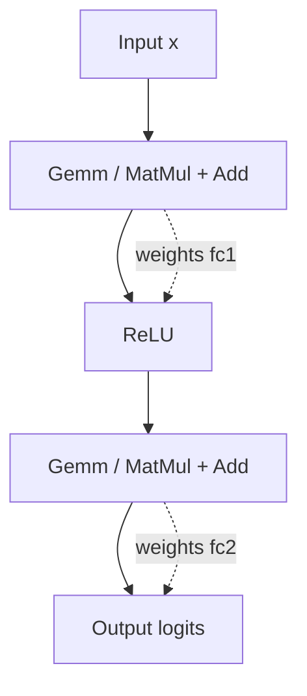
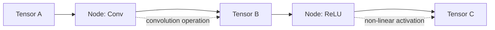
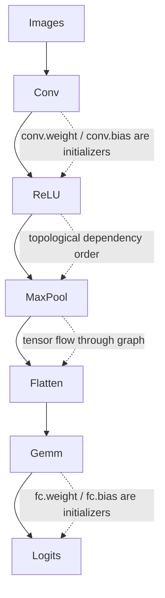
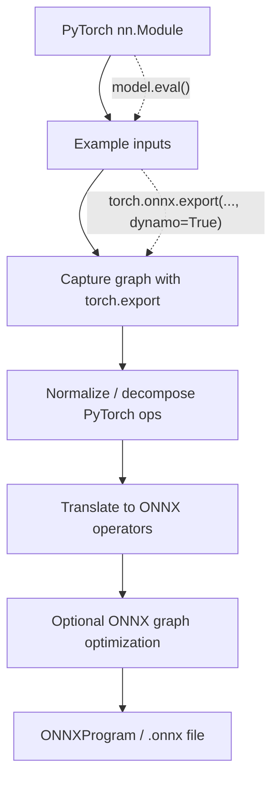
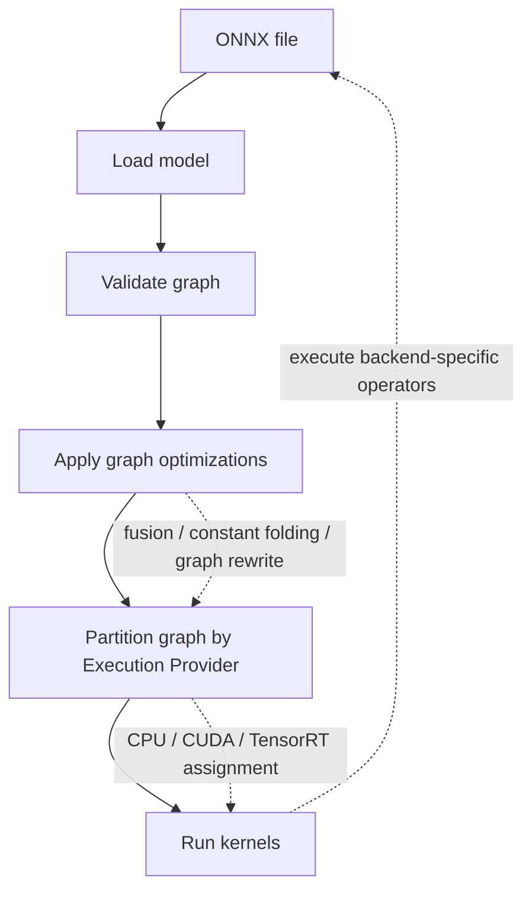

::: {.callout-note icon=false}
## Mục tiêu bài học
Mục tiêu của bài này là giúp bạn hiểu ONNX như một **intermediate representation (biểu diễn trung gian)** cho mô hình machine learning, không chỉ là một file `.onnx` được export từ PyTorch. Sau bài này, bạn cần có khả năng nhìn vào một ONNX graph và hiểu model đang được biểu diễn bằng các node, tensor, operator, initializer, input/output, opset và shape như thế nào.
:::


## Vị trí của Lesson 2 trong chuỗi học {.unnumbered}
 
Ở Lesson 1, bạn đã xây mental model về inference system:



Lesson 2 đi vào mảnh ghép đầu tiên trong pipeline tối ưu inference:



ONNX không phải là TensorRT, cũng không phải là ONNX Runtime. ONNX là format/specification để biểu diễn computation graph và weights. ONNX Runtime là runtime có thể load và chạy ONNX model. TensorRT có thể parse ONNX model rồi build engine tối ưu cho GPU NVIDIA.

Cách học đúng là:

```text
1. Hiểu ONNX graph là gì
2. Hiểu operator và opset là gì
3. Hiểu cách export từ framework sang ONNX
4. Biết validate, inspect, visualize và debug ONNX model
5. Sau đó mới dùng ONNX Runtime hoặc TensorRT để chạy/tối ưu
```

Nếu bỏ qua bước 1-4, bạn sẽ dùng ONNX như một black box. Khi export lỗi hoặc TensorRT báo unsupported operator, bạn sẽ rất khó biết lỗi nằm ở framework, exporter, ONNX graph, opset hay backend runtime.

## Learning outcomes {.unnumbered}

Sau bài này, bạn cần giải thích và thực hành được:

1. ONNX là gì và khác gì với ONNX Runtime, TensorRT, TorchScript, SavedModel.
2. ONNX graph được cấu thành từ `ModelProto`, `GraphProto`, `NodeProto`, `TensorProto`, `ValueInfoProto`.
3. Sự khác nhau giữa input tensor, output tensor, intermediate tensor và initializer.
4. Operator là gì, node là gì, attribute là gì, domain là gì.
5. Opset version là gì và vì sao opset mismatch có thể làm model không chạy được trên backend.
6. IR version, opset version và model version khác nhau như thế nào.
7. Export pipeline từ PyTorch sang ONNX hoạt động ở mức khái niệm.
8. Static shape, dynamic shape và symbolic dimension khác nhau thế nào.
9. Cách kiểm tra ONNX model bằng `onnx.checker`, `onnx.shape_inference`, Netron và ONNX Runtime.
10. Các lỗi export phổ biến và cách debug có hệ thống.


## Prerequisites {.unnumbered}

Bạn nên đã quen với:

- Python cơ bản.
- PyTorch ở mức định nghĩa `nn.Module` và chạy `model(input)`.
- Tensor shape cơ bản, ví dụ `NCHW = [batch, channel, height, width]`.
- Khái niệm inference từ Lesson 1.

Phần thực hành trong bài này chạy được trên CPU. Bạn chưa cần GPU NVIDIA, CUDA hay TensorRT.


## Cài đặt môi trường cho bài học {.unnumbered}

Khuyến nghị dùng virtual environment riêng:

```bash
python -m venv .venv
source .venv/bin/activate
pip install --upgrade pip
pip install --upgrade torch onnx onnxscript onnxruntime numpy
```

Nếu muốn xem graph trực quan:

```bash
pip install netron
```

Chạy Netron local:

```bash
netron model.onnx
```

Hoặc mở file `.onnx` bằng Netron web/app.

> Ghi chú: Với PyTorch hiện đại, exporter được khuyến nghị là `torch.onnx.export(..., dynamo=True)`. Cú pháp có thể thay đổi nhẹ theo version PyTorch, nên khi làm project thật bạn luôn cần kiểm tra documentation của version đang dùng.


## ONNX là gì?

ONNX là viết tắt của **Open Neural Network Exchange**. Về bản chất, ONNX là một chuẩn mở để biểu diễn model machine learning dưới dạng computation graph cộng với metadata, weights, input/output schema và operator set.

Một cách đơn giản:

```text
ONNX model = computation graph + weights + input/output schema + operator versioning
```

Ví dụ, một PyTorch model như sau:

```python
class MLP(torch.nn.Module):
    def __init__(self):
        super().__init__()
        self.fc1 = torch.nn.Linear(4, 8)
        self.fc2 = torch.nn.Linear(8, 2)

    def forward(self, x):
        x = torch.relu(self.fc1(x))
        return self.fc2(x)
```

Khi export sang ONNX, model có thể trở thành một graph gần giống:



ONNX không lưu Python code `forward()`. Nó lưu một biểu diễn graph có thể được runtime khác đọc và chạy.


## ONNX không phải là gì?

Đây là phần rất quan trọng để tránh nhầm lẫn.

### ONNX không phải là runtime

ONNX là format/specification. Muốn chạy ONNX model, bạn cần runtime hoặc compiler, ví dụ:

- ONNX Runtime.
- TensorRT.
- OpenVINO.
- CoreML converter/runtime.
- TVM.
- Backend riêng của hardware vendor.

### ONNX không tự động đảm bảo model nhanh hơn

Export PyTorch sang ONNX không tự động làm model nhanh hơn. Tốc độ phụ thuộc vào:

- Runtime/backend bạn dùng.
- Operator coverage của backend.
- Graph optimization.
- Hardware.
- Shape static hay dynamic.
- Batch size.
- Memory transfer.
- Dtype: FP32, FP16, BF16, INT8.

### ONNX không đảm bảo mọi PyTorch model đều export được

PyTorch linh hoạt hơn ONNX rất nhiều. Python control flow, custom ops, dynamic data structures, tensor-to-Python conversion, data-dependent shape logic có thể gây lỗi hoặc bị specialize thành shape cố định.

### ONNX không thay thế evaluation

Một ONNX model hợp lệ về mặt schema chưa chắc tương đương số học với model gốc. Bạn luôn cần so sánh output giữa framework gốc và ONNX Runtime/TensorRT với cùng input test.


## Big picture: cấu trúc một ONNX model

Một file `.onnx` thường là serialized Protobuf của một `ModelProto`.

Cấu trúc khái niệm:

```text
ModelProto
  |
  |-- ir_version
  |-- producer_name
  |-- producer_version
  |-- domain
  |-- model_version
  |-- doc_string
  |-- opset_import[]
  |
  |-- GraphProto
        |
        |-- name
        |-- input[]
        |-- output[]
        |-- initializer[]
        |-- value_info[]
        |-- node[]
```

Hãy nhớ các thành phần chính:

| Thành phần       | Ý nghĩa thực tế                                                 |
|:-----------------|:----------------------------------------------------------------|
| `ModelProto`     | Container cấp cao nhất của ONNX model                           |
| `GraphProto`     | Computation graph chính                                         |
| `NodeProto`      | Một phép tính trong graph, ví dụ `Conv`, `Relu`, `MatMul`       |
| `TensorProto`    | Tensor được serialize, thường dùng cho weights/constant         |
| `ValueInfoProto` | Tên, dtype, shape của input/output/intermediate value           |
| `opset_import`   | Cho biết graph đang dùng operator set version nào               |
| `initializer`    | Named tensors đã biết trước, thường là model parameters/weights |

Mental model:

```text
Graph = nodes + edges
Node  = operator call
Edge  = named tensor flowing between nodes
Weights = initializer tensors
```

## Graph: computation không có side effect

ONNX graph biểu diễn computation theo kiểu dataflow:



Một node không nên được hiểu như một dòng Python code. Nó là một lời gọi operator với input tensor, output tensor và attributes.

Ví dụ:

```text
Node
  op_type: Conv
  inputs:  ["images", "conv.weight", "conv.bias"]
  outputs: ["conv_out"]
  attributes:
    strides: [1, 1]
    pads:    [1, 1, 1, 1]
```

Graph ONNX là graph có hướng dựa trên dependency giữa tensor. Các node thường được sắp xếp theo topological order: node nào cần output của node trước thì xuất hiện sau node đó.

Một graph cơ bản:




## Tensor trong ONNX: input, output, intermediate, initializer

Trong ONNX, tensor được nhận diện bằng **name**. Tên tensor là thứ nối các node lại với nhau.

Ví dụ:

```text
Node A outputs: ["hidden_1"]
Node B inputs:  ["hidden_1"]
```

Hai node được nối vì cùng dùng tên `hidden_1`.

### Graph input

Graph input là tensor runtime phải cung cấp khi chạy inference.

Ví dụ:

```text
images: float32[batch, 3, 224, 224]
```

### Graph output

Graph output là tensor runtime trả về.

Ví dụ:

```text
logits: float32[batch, 1000]
```

### Intermediate tensor

Intermediate tensor là tensor nằm giữa các node. Nó thường không phải input/output public của model.

Ví dụ:

```text
conv_out -> relu_out -> pool_out
```

### Initializer

Initializer là tensor có giá trị cố định được lưu trong model, thường là weights và bias.

Ví dụ:

```text
conv.weight
conv.bias
fc.weight
fc.bias
```

Initializer thường không cần user truyền vào khi inference. Runtime load chúng từ file `.onnx`.

### Một lỗi hiểu nhầm phổ biến

Nhiều bạn mới học thấy trong graph có tensor tên `conv.weight` rồi nghĩ đó là input runtime. Thực tế nếu nó nằm trong `initializer`, nó là weight được lưu sẵn trong model.


## Node và Operator khác nhau thế nào?

Đây là distinction rất quan trọng.

```text
Operator = định nghĩa phép toán
Node     = một lần sử dụng operator trong graph
```

Ví dụ operator `Relu` định nghĩa công thức:

```text
y = max(0, x)
```

Trong graph có thể có nhiều node dùng operator `Relu`:

```text
relu1: Relu(conv1_out) -> relu1_out
relu2: Relu(conv2_out) -> relu2_out
relu3: Relu(fc1_out)   -> relu3_out
```

Cả ba node đều có `op_type = "Relu"`, nhưng là ba node khác nhau với input/output khác nhau.

### Anatomy của một node

Một `NodeProto` thường có:

| Field | Ý nghĩa |
|---|---|
| `op_type` | Tên operator, ví dụ `Conv`, `Relu`, `MatMul` |
| `domain` | Namespace của operator, ví dụ `ai.onnx` hoặc custom domain |
| `input[]` | Danh sách tên tensor input |
| `output[]` | Danh sách tên tensor output |
| `attribute[]` | Tham số cố định của operator |
| `name` | Tên node, có thể có hoặc không |

Ví dụ conceptual:

```text
node {
  name: "conv1"
  op_type: "Conv"
  input: "images"
  input: "conv1.weight"
  input: "conv1.bias"
  output: "conv1_out"
  attribute: strides = [1, 1]
  attribute: pads = [1, 1, 1, 1]
}
```

### Attribute khác input thế nào?

Input là tensor đi vào operator. Attribute là cấu hình tĩnh của operator.

Ví dụ `Conv`:

```text
Inputs:
  X: input feature map
  W: weight tensor
  B: optional bias tensor

Attributes:
  strides
  pads
  dilations
  groups
```

Attribute thường không thay đổi theo từng request inference. Input tensor thì thay đổi theo request.

## Operator domain

ONNX dùng domain để phân biệt operator sets.

Một số domain thường gặp:

| Domain                      | Ý nghĩa                                  |
|:----------------------------|:-----------------------------------------|
| `ai.onnx` hoặc empty string | ONNX standard operators                  |
| `ai.onnx.ml`                | Classical ML operators                   |
| Custom domain               | Operator riêng của framework/vendor/user |

Nếu graph chứa custom domain, backend của bạn phải biết cách chạy operator đó. Đây là nguyên nhân phổ biến của lỗi:

```text
No Op registered for CustomFoo with domain_version of X
```

hoặc khi build TensorRT:

```text
Unsupported operator: CustomFoo
```

Trong production, bạn nên ưu tiên export model thành các standard ONNX ops nếu muốn portable qua nhiều backend.

## Opset version: khái niệm cực quan trọng

Opset là viết tắt của **operator set**. Nó định nghĩa version của các operator mà graph đang dùng.

Ví dụ:

```text
opset_import:
  domain: ""
  version: 18
```

Điều đó nghĩa là graph dùng ONNX standard operator set version 18 cho domain mặc định.

### Vì sao cần opset?

Operator không bất biến mãi mãi. Theo thời gian, operator có thể được bổ sung behavior, type support, shape inference rule hoặc semantic mới.

Ví dụ một operator như `Add`, `Resize`, `Slice`, `Gather`, `Softmax` có thể có khác biệt giữa các version opset.

Vì vậy, graph cần khai báo:

```text
Tôi đang dùng operator theo version nào?
```

### Quy tắc tư duy

Khi một graph có opset `N`, mỗi operator trong domain đó dùng định nghĩa mới nhất có version nhỏ hơn hoặc bằng `N`.

Ví dụ conceptual:

```text
Graph opset = 15
Operator Add có spec ở version 7, 13, 14
=> Node Add trong graph dùng Add-14 semantics
```

### Không phải opset càng mới càng tốt

Một sai lầm phổ biến là luôn export opset mới nhất.

Trong production, bạn phải chọn opset theo backend target:

```text
PyTorch exporter supports opset A
ONNX Runtime version supports opset B
TensorRT parser supports opset C
Model uses operators D
=> chọn opset vừa đủ mới để biểu diễn model, nhưng đủ cũ để backend support ổn định
```

Nếu bạn dùng opset quá mới, runtime/compiler có thể chưa hỗ trợ. Nếu dùng opset quá cũ, exporter có thể không biểu diễn được operator hoặc dynamic behavior mong muốn.

### IR version khác opset version

ONNX có nhiều loại version khác nhau:

| Version | Ý nghĩa |
|---|---|
| IR version | Version của format/cấu trúc biểu diễn model graph |
| Opset version | Version của operator specifications |
| Model version | Version do người tạo model đặt, thường phục vụ quản lý artifact |
| Package version | Version của Python package `onnx`, ví dụ `onnx==1.x` |

Đừng nhầm `ir_version` với `opset_import.version`.


## Shape trong ONNX

Shape là một trong những nguồn lỗi lớn nhất khi export và deploy model.

Một tensor có thể có shape static:

```text
float32[1, 3, 224, 224]
```

hoặc dynamic/symbolic:

```text
float32[batch, 3, height, width]
```

### Static shape

Static shape nghĩa là mọi dimension đã biết cụ thể tại export time.

Ví dụ:

```text
images: float32[1, 3, 224, 224]
```

Ưu điểm:

- Runtime/compiler tối ưu dễ hơn.
- TensorRT build engine dễ hơn.
- Memory planning đơn giản hơn.

Nhược điểm:

- Model chỉ nhận đúng shape đó.
- Nếu batch size hoặc image size thay đổi, inference có thể fail.

### Dynamic shape

Dynamic shape nghĩa là một hoặc nhiều dimension chưa cố định.

Ví dụ:

```text
images: float32[batch, 3, 224, 224]
```

Ở đây `batch` là symbolic dimension. Khi runtime chạy, batch có thể là 1, 4, 8, v.v.

Ưu điểm:

- Linh hoạt hơn.
- Phù hợp serving với batch size thay đổi.

Nhược điểm:

- Runtime/compiler khó tối ưu hơn.
- Một số backend yêu cầu profile hoặc min/opt/max shape.
- Có thể gây lỗi nếu graph có shape logic không export được.

### Dynamic shape không có nghĩa là mọi thứ dynamic

Bạn thường chỉ muốn dynamic ở những dimension thật sự cần dynamic.

Ví dụ image classification production:

```text
images: [batch, 3, 224, 224]
```

Chỉ batch dynamic, còn channel/height/width static. Điều này giúp backend tối ưu tốt hơn so với:

```text
images: [batch, channel, height, width]
```

Nếu model chỉ phục vụ ảnh đã resize về 224x224, đừng làm height/width dynamic chỉ vì “cho linh hoạt”. Linh hoạt không cần thiết có thể làm performance và debug xấu hơn.


## Data type trong ONNX

ONNX tensor có dtype rõ ràng, ví dụ:

- `float32`
- `float16`
- `bfloat16`
- `int64`
- `int32`
- `bool`
- `string`

Một lỗi phổ biến khi chạy ONNX Runtime là truyền input sai dtype.

Ví dụ model yêu cầu:

```text
input_ids: int64[batch, seq]
```

nhưng bạn truyền NumPy array `int32`, runtime có thể báo lỗi.

Với model NLP, tokenizer có thể tạo `int64` hoặc `int32` tùy framework/backend. Luôn inspect input dtype của ONNX graph trước khi viết serving code.

## Layout: NCHW, NHWC và vấn đề silent mismatch

ONNX không chỉ là operator và shape; layout cũng rất quan trọng.

Ví dụ ảnh có hai layout phổ biến:

```text
NCHW = [batch, channel, height, width]
NHWC = [batch, height, width, channel]
```

PyTorch convolution thường dùng NCHW. TensorFlow/Keras thường hay gặp NHWC. Khi export sang ONNX, bạn phải biết model đang kỳ vọng layout nào.

Lỗi layout rất nguy hiểm vì đôi khi không crash, nhưng output sai.

Ví dụ:

```text
Expected: [1, 3, 224, 224]
Actual:   [1, 224, 224, 3]
```

Nếu shape không khớp, runtime sẽ báo lỗi. Nhưng trong vài case shape vẫn có thể “hợp lệ” về số chiều, output sẽ sai mà không báo lỗi rõ ràng.

Checklist:

```text
- Input name là gì?
- Input dtype là gì?
- Input shape là gì?
- Layout là NCHW hay NHWC?
- Normalization mean/std có đúng không?
- Channel order là RGB hay BGR?
```

## Export pipeline từ PyTorch sang ONNX

Với PyTorch hiện đại, pipeline khái niệm có thể hiểu như sau:



### Vì sao cần example input?

PyTorch model là Python program. Exporter cần chạy/capture model với example input để biết computation graph nào được tạo.

Ví dụ:

```python
example_input = torch.randn(1, 3, 224, 224)
```

Exporter dùng example input để:

- Biết dtype.
- Biết rank/số chiều tensor.
- Trace/capture tensor operations.
- Suy luận shape constraints.
- Specialize một số nhánh logic nếu cần.

### Vì sao cần `model.eval()`?

Một số layer có behavior khác nhau giữa training và inference:

- Dropout.
- BatchNorm.
- Một số module có conditional behavior theo `self.training`.

Nếu export khi model đang ở training mode, graph có thể không đúng cho inference.

Quy tắc:

```python
model.eval()
with torch.no_grad():
    ...
```

### Export không phải save weights đơn thuần

`torch.save(model.state_dict())` chỉ lưu weights. ONNX export lưu computation graph cộng weights.

So sánh:

| Artifact          | Lưu gì?                           | Chạy độc lập ngoài PyTorch?               |
|:------------------|:----------------------------------|:------------------------------------------|
| `.pth` state dict | Weights                           | Không, cần Python model class             |
| TorchScript       | PyTorch graph/module              | Có, nhưng vẫn PyTorch ecosystem           |
| ONNX              | Framework-neutral graph + weights | Có, nếu runtime hỗ trợ ops                |
| TensorRT engine   | Optimized engine cho GPU cụ thể   | Có, nhưng phụ thuộc TensorRT/GPU/platform |


## Practical Lab 2A — Export một model PyTorch đơn giản sang ONNX

Tạo file `lesson2_export_static.py`:

```python
import numpy as np
import onnx
import onnxruntime as ort
import torch
import torch.nn as nn
import torch.nn.functional as F


class TinyCNN(nn.Module):
    def __init__(self):
        super().__init__()
        self.conv = nn.Conv2d(3, 8, kernel_size=3, 
                              padding=1)
        self.fc = nn.Linear(8 * 32 * 32, 10)

    def forward(self, x):
        x = self.conv(x)
        x = F.relu(x)
        x = torch.flatten(x, 1)
        x = self.fc(x)
        return x


def main():
    torch.manual_seed(0)

    model = TinyCNN().eval()
    example_input = torch.randn(1, 3, 32, 32)

    # PyTorch 2.5+ recommended exporter path.
    onnx_program = torch.onnx.export(
        model,
        (example_input,),
        input_names=["images"],
        output_names=["logits"],
        opset_version=18,
        dynamo=True,
    )

    onnx_program.save("tinycnn_static.onnx")
    print("Saved tinycnn_static.onnx")

    # Validate ONNX structure.
    onnx_model = onnx.load("tinycnn_static.onnx")
    onnx.checker.check_model(onnx_model)
    print("ONNX checker passed")

    # Run ONNX Runtime and compare with PyTorch.
    session = ort.InferenceSession(
        "tinycnn_static.onnx",
        providers=["CPUExecutionProvider"],
    )

    ort_inputs = {"images": example_input.numpy()}
    ort_logits = session.run(["logits"], ort_inputs)[0]

    with torch.no_grad():
        torch_logits = model(example_input).numpy()

    np.testing.assert_allclose(torch_logits, ort_logits, 
                               rtol=1e-4, atol=1e-5)
    print("PyTorch and ONNX Runtime outputs match")
    print("Output shape:", ort_logits.shape)


if __name__ == "__main__":
    main()
```

Chạy:

```bash
python lesson2_export_static.py
```

Kỳ vọng:

```text
Saved tinycnn_static.onnx
ONNX checker passed
PyTorch and ONNX Runtime outputs match
Output shape: (1, 10)
```

Bạn vừa hoàn thành pipeline tối thiểu:

```text
PyTorch model -> ONNX file -> ONNX checker -> ONNX Runtime -> numerical validation
```


## Practical Lab 2B — Inspect ONNX graph bằng Python

Tạo file `lesson2_inspect_onnx.py`:

```python
import onnx


def describe_value_info(value_info):
    tensor_type = value_info.type.tensor_type
    dtype = onnx.TensorProto.DataType.Name(tensor_type.elem_type)

    dims = []
    for dim in tensor_type.shape.dim:
        if dim.HasField("dim_value"):
            dims.append(str(dim.dim_value))
        elif dim.HasField("dim_param"):
            dims.append(dim.dim_param)
        else:
            dims.append("?")

    return value_info.name, dtype, dims


def main():
    model = onnx.load("tinycnn_static.onnx")
    graph = model.graph

    print("IR version:", model.ir_version)
    print("Producer:", model.producer_name, 
          model.producer_version)
    print("Opset imports:")
    for opset in model.opset_import:
        domain = opset.domain if opset.domain \
            else "ai.onnx/default"
        print(f"  domain={domain}, \
        version={opset.version}")

    print("\nGraph name:", graph.name)

    print("\nInputs:")
    for value in graph.input:
        name, dtype, dims = describe_value_info(value)
        print(f"  {name}: {dtype}[{', '.join(dims)}]")

    print("\nOutputs:")
    for value in graph.output:
        name, dtype, dims = describe_value_info(value)
        print(f"  {name}: {dtype}[{', '.join(dims)}]")

    print("\nInitializers / weights:")
    for tensor in graph.initializer:
        print(f"  {tensor.name}: \
        {onnx.TensorProto.DataType.Name(tensor.data_type)}{list(tensor.dims)}")

    print("\nNodes:")
    for i, node in enumerate(graph.node):
        print(f"  [{i:02d}] {node.op_type}")
        print(f"       inputs : {list(node.input)}")
        print(f"       outputs: {list(node.output)}")
        if node.attribute:
            attrs = [attr.name for attr in node.attribute]
            print(f"       attrs  : {attrs}")


if __name__ == "__main__":
    main()
```

Chạy:

```bash
python lesson2_inspect_onnx.py
```

Bạn cần nhìn được:

```text
- Model dùng IR version nào?
- Model dùng opset nào?
- Input name/dtype/shape là gì?
- Output name/dtype/shape là gì?
- Weight nào nằm trong initializer?
- Graph có những operator nào?
```

Đây là kỹ năng cực kỳ quan trọng trước khi dùng TensorRT. Khi TensorRT fail, bạn sẽ quay lại graph này để xem operator nào gây lỗi.


## Practical Lab 2C — Export dynamic batch

Ở Lab 2A, input shape là static:

```text
images: float32[1, 3, 32, 32]
```

Bây giờ ta muốn batch dimension dynamic:

```text
images: float32[batch, 3, 32, 32]
```

Tạo file `lesson2_export_dynamic_batch.py`:

```python
import numpy as np
import onnx
import onnxruntime as ort
import torch
import torch.nn as nn
import torch.nn.functional as F


class TinyCNN(nn.Module):
    def __init__(self):
        super().__init__()
        self.conv = nn.Conv2d(3, 8, kernel_size=3, 
                              padding=1)
        self.fc = nn.Linear(8 * 32 * 32, 10)

    def forward(self, x):
        x = self.conv(x)
        x = F.relu(x)
        x = torch.flatten(x, 1)
        x = self.fc(x)
        return x


def main():
    torch.manual_seed(0)

    model = TinyCNN().eval()
    example_input = torch.randn(2, 3, 32, 32)

    # The key "x" refers to the argument name in forward(self, x),
    # not the exported ONNX input name "images".
    batch_dim = torch.export.Dim("batch", min=1, max=64)

    onnx_program = torch.onnx.export(
        model,
        (example_input,),
        input_names=["images"],
        output_names=["logits"],
        dynamic_shapes={"x": {0: batch_dim}},
        opset_version=18,
        dynamo=True,
    )

    onnx_program.save("tinycnn_dynamic_batch.onnx")
    print("Saved tinycnn_dynamic_batch.onnx")

    onnx_model = onnx.load("tinycnn_dynamic_batch.onnx")
    onnx.checker.check_model(onnx_model)
    print("ONNX checker passed")

    session = ort.InferenceSession(
        "tinycnn_dynamic_batch.onnx",
        providers=["CPUExecutionProvider"],
    )

    for batch_size in [1, 4, 8]:
        x = torch.randn(batch_size, 3, 32, 32)
        ort_logits = session.run(["logits"], {"images": x.numpy()})[0]
        with torch.no_grad():
            torch_logits = model(x).numpy()
        np.testing.assert_allclose(torch_logits, 
                                   ort_logits, rtol=1e-4, atol=1e-5)
        print(f"batch={batch_size}: OK, output shape={ort_logits.shape}")


if __name__ == "__main__":
    main()
```

Chạy:

```bash
python lesson2_export_dynamic_batch.py
python lesson2_inspect_onnx.py
```

Sửa `lesson2_inspect_onnx.py` để load `tinycnn_dynamic_batch.onnx`, sau đó kiểm tra input shape. Bạn nên thấy dimension đầu tiên là symbolic thay vì `1` hoặc `2`.

### Bài học quan trọng

Dynamic shape không phải là “miễn phí”. Nó cho model linh hoạt hơn, nhưng runtime/compiler có ít thông tin hơn để tối ưu. Khi sang TensorRT, dynamic shape thường cần optimization profile gồm min/opt/max shape.

Ví dụ mental model cho TensorRT sau này:

```text
min shape: [1, 3, 32, 32]
opt shape: [8, 3, 32, 32]
max shape: [64, 3, 32, 32]
```

TensorRT sẽ tối ưu engine dựa trên khoảng shape này. Nếu runtime nhận shape ngoài profile, inference có thể fail.


## Practical Lab 2D — Shape inference

Một số intermediate tensors không có shape rõ ràng trong graph. ONNX có shape inference để bổ sung thông tin shape khi có thể.

Tạo file `lesson2_shape_inference.py`:

```python
import onnx


def count_value_info(model):
    return len(model.graph.value_info)


def main():
    model = onnx.load("tinycnn_static.onnx")
    print("Value info before:", count_value_info(model))

    inferred_model = onnx.shape_inference.infer_shapes(model)
    print("Value info after:", count_value_info(inferred_model))

    onnx.save(inferred_model, "tinycnn_static_inferred.onnx")
    print("Saved tinycnn_static_inferred.onnx")

    print("\nSome inferred intermediate tensors:")
    for value in inferred_model.graph.value_info[:10]:
        tensor_type = value.type.tensor_type
        dims = []
        for dim in tensor_type.shape.dim:
            if dim.HasField("dim_value"):
                dims.append(str(dim.dim_value))
            elif dim.HasField("dim_param"):
                dims.append(dim.dim_param)
            else:
                dims.append("?")
        print(f"  {value.name}: [{', '.join(dims)}]")


if __name__ == "__main__":
    main()
```

Shape inference rất hữu ích khi debug graph, nhưng không phải lúc nào cũng suy luận được mọi shape, đặc biệt với dynamic shape, control flow hoặc custom ops.

## Visualize graph bằng Netron

Sau khi có file:

```text
tinycnn_static.onnx
```

Mở bằng Netron.

Bạn nên quan sát:

```text
- Input node tên gì?
- Output node tên gì?
- Conv có weight/bias không?
- Graph có Flatten không?
- Linear được export thành Gemm hay MatMul + Add?
- Tensor shape có đúng như bạn kỳ vọng không?
- Operator list có operator lạ không?
```

Netron không thay thế validation, nhưng cực kỳ hữu ích để phát hiện nhanh:

- Sai input name.
- Sai layout.
- Shape bị fixed ngoài ý muốn.
- Operator không mong muốn.
- Graph quá phức tạp do export không tối ưu.


## Numerical validation: bước không được bỏ qua

Một export thành công chỉ có nghĩa là exporter tạo được file ONNX hợp lệ. Nó chưa chứng minh output đúng.

Bạn luôn cần so sánh:

```text
PyTorch output vs ONNX Runtime output
```

với cùng input.

Ví dụ:

```python
np.testing.assert_allclose(torch_logits, ort_logits, rtol=1e-4, atol=1e-5)
```

### Tolerance không nên quá chặt

Do khác biệt implementation, floating point ordering, fused kernels, hoặc backend optimization, output có thể lệch nhỏ.

Gợi ý ban đầu:

```text
FP32: rtol=1e-4, atol=1e-5
FP16: rtol=1e-2, atol=1e-3 hoặc tùy model
INT8: cần metric-level validation, không chỉ element-wise comparison
```

### Với model classification

Ngoài `assert_allclose`, nên kiểm tra:

```text
- top-1 class có giống không?
- top-k overlap có cao không?
- accuracy trên validation set có giảm không?
```

### Với model detection/segmentation/NLP

Cần validation theo metric thật:

```text
- object detection: mAP, NMS output, bbox tolerance
- segmentation: IoU / Dice
- embedding: cosine similarity
- ASR: WER
- translation/summarization: task metric hoặc human eval
```


## ONNX Runtime chạy graph như thế nào? Preview

ONNX Runtime là runtime để load và execute ONNX model. Conceptual pipeline:



Execution Provider là backend thực thi, ví dụ:

```text
CPUExecutionProvider
CUDAExecutionProvider
TensorrtExecutionProvider
OpenVINOExecutionProvider
CoreMLExecutionProvider
```

Nếu bạn dùng nhiều provider:

```python
providers = ["TensorrtExecutionProvider", 
             "CUDAExecutionProvider", 
             "CPUExecutionProvider"]
```

Runtime sẽ cố gắng gán subgraph cho provider phù hợp. Những phần không chạy được trên provider chuyên biệt có thể fallback về provider khác nếu cấu hình cho phép.

Ta sẽ học sâu hơn trong Lesson 3.


##Graph optimization cơ bản

ONNX graph có thể được optimize theo nhiều cách:

**Constant folding**

Nếu một subgraph chỉ phụ thuộc vào constant/initializer, runtime có thể tính trước.

```text
Constant A + Constant B -> Constant C
```

**Dead node elimination**

Nếu một node tạo output không được dùng, có thể loại bỏ.

**Identity elimination**

```text
x -> Identity -> y
```

Nếu không cần thiết, có thể thay bằng:

```text
x -> y
```

**Operator fusion**

Nhiều operator liên tiếp có thể được fuse thành một kernel/operator tối ưu hơn.

Ví dụ:

```text
Conv -> BatchNorm -> Relu
```

có thể được runtime/compiler fuse ở mức graph hoặc kernel tùy backend.

Quan trọng: graph optimization phải giữ nguyên semantics. Nếu optimization làm output sai, đó là bug hoặc do assumption không đúng.

## Common export problems và cách suy nghĩ

### Input shape bị fixed ngoài ý muốn

Triệu chứng:

```text
Bạn muốn batch dynamic, nhưng ONNX input lại là [1, 3, 224, 224]
```

Nguyên nhân thường gặp:

- Không set `dynamic_shapes`.
- Dùng sai key trong `dynamic_shapes`.
- Dùng tensor shape để tạo Python integer, ví dụ `x.shape[0]` rồi đưa vào Python control flow.
- Có logic làm exporter chứng minh dimension chỉ có một giá trị.

Cách debug:

```text
1. Inspect graph input shape bằng Python hoặc Netron.
2. Kiểm tra tên argument trong forward().
3. Thử chạy ONNX Runtime với batch size khác.
4. Nếu fail, đọc error message và kiểm tra dynamic_shapes.
```

### Unsupported operator

Triệu chứng:

```text
Export failed: unsupported operator
```

hoặc runtime báo:

```text
No Op registered for ...
```

Cách xử lý:

```text
1. Tìm operator nào gây lỗi.
2. Kiểm tra operator đó có ONNX equivalent không.
3. Refactor model để dùng op phổ biến hơn.
4. Thử opset khác nếu operator support phụ thuộc opset.
5. Với custom op, cân nhắc custom symbolic / ONNX Script / backend plugin.
```

### Python control flow phụ thuộc tensor value

Ví dụ nguy hiểm:

```python
def forward(self, x):
    if x.sum() > 0:
        return x * 2
    return x - 2
```

Đây là control flow phụ thuộc data runtime. Exporter có thể không biểu diễn được hoặc phải dùng ONNX control-flow ops như `If`, nhưng không phải backend nào cũng tối ưu tốt.

Trong inference production, nếu có thể, hãy refactor thành tensor operations:

```python
return torch.where(x.sum() > 0, x * 2, x - 2)
```

Tùy case, cách này vẫn cần kiểm tra operator support.

`.item()`, `.tolist()`, **NumPy conversion trong forward**

Ví dụ:

```python
def forward(self, x):
    n = x.shape[0]
    value = x.sum().item()
    return x * value
```

`.item()` đưa tensor value từ graph sang Python scalar. Điều này làm graph capture khó hoặc khiến value bị constant-fold/specialize theo example input.

Quy tắc:

```text
Không dùng tensor value để điều khiển Python logic trong forward nếu muốn export portable.
```

### Training mode khi export

Triệu chứng:

```text
Output ONNX khác PyTorch inference
```

Nguyên nhân:

- Model vẫn ở training mode.
- Dropout còn active.
- BatchNorm dùng batch statistics thay vì running statistics.

Cách xử lý:

```python
model.eval()
```

và so sánh numerical output.

### Dtype mismatch khi chạy runtime

Triệu chứng:

```text
Unexpected input data type. Actual: tensor(int32), expected: tensor(int64)
```

Cách xử lý:

```python
inputs = inputs.astype(np.int64)
```

hoặc sửa preprocessing/tokenizer để tạo dtype đúng.

### External data cho model lớn

ONNX model có thể rất lớn, đặc biệt với LLM hoặc large vision models. Khi file vượt giới hạn hoặc không tiện lưu một file lớn, exporter có thể dùng external data: graph nằm trong `.onnx`, weights nằm ở file ngoài.

Khi deploy, bạn phải copy đủ cả:

```text
model.onnx
model.onnx.data hoặc các external tensor files
```

Nếu thiếu external data, runtime sẽ không load được model.


## Debugging checklist cho ONNX model

Khi có lỗi ONNX, đừng đoán. Hãy đi theo checklist.

**Kiểm tra model load được không**

```python
import onnx
model = onnx.load("model.onnx")
```

Nếu load fail, có thể file hỏng, thiếu external data hoặc version không tương thích.

**Kiểm tra ONNX checker**

```python
onnx.checker.check_model(model)
```

Nếu checker fail, model không hợp lệ theo ONNX spec.

**In opset**

```python
for opset in model.opset_import:
    print(opset.domain, opset.version)
```

Đối chiếu với runtime/compiler target.

**In input/output schema**

```python
for value in model.graph.input:
    print(value.name, value.type)
```

Kiểm tra name, dtype, shape.

**List operators**

```python
from collections import Counter
ops = Counter(node.op_type for node in model.graph.node)
print(ops)
```

Nếu TensorRT fail, operator list giúp tìm node khả nghi.

**Chạy ONNX Runtime CPU**

Trước khi đổ lỗi cho GPU/TensorRT, hãy chạy bằng CPUExecutionProvider.

```python
session = ort.InferenceSession("model.onnx", providers=["CPUExecutionProvider"])
```

Nếu CPU cũng fail, lỗi có thể nằm ở graph/input/export. Nếu CPU pass nhưng TensorRT fail, lỗi có thể nằm ở TensorRT operator support, dynamic shape profile, dtype, hoặc parser.

**So sánh numerical output**

Luôn so với framework gốc.

```python
np.testing.assert_allclose(reference, actual, rtol=..., atol=...)
```

**Visualize bằng Netron**

Dùng Netron để nhìn graph nhanh, nhưng vẫn cần code validation.


## Mini case study: vì sao TensorRT build fail dù ONNX Runtime chạy được?

Một tình huống rất phổ biến:

```text
PyTorch -> ONNX export: OK
ONNX Runtime CPU: OK
TensorRT build: FAIL
```

Có thể do:

1. ONNX graph hợp lệ nhưng TensorRT parser không hỗ trợ một operator.
2. Operator được hỗ trợ nhưng combination attributes không hỗ trợ.
3. Dynamic shape chưa có optimization profile đúng.
4. Dtype không phù hợp.
5. Graph chứa control-flow op như `If` hoặc `Loop`.
6. Graph chứa plugin/custom op chưa được đăng ký.
7. Opset quá mới so với TensorRT version.

Cách debug đúng:

```text
1. Confirm ONNX checker pass.
2. Confirm ONNX Runtime CPU pass.
3. List all operators in graph.
4. Tìm operator gần vị trí TensorRT báo lỗi.
5. Kiểm tra TensorRT support matrix cho version đang dùng.
6. Nếu dynamic shape, kiểm tra min/opt/max profile.
7. Nếu unsupported op, refactor model hoặc viết plugin.
```

Bài học: ONNX hợp lệ không đồng nghĩa mọi backend đều chạy được. ONNX là chuẩn biểu diễn; backend vẫn có operator coverage riêng.


## Bảng thuật ngữ {.unnumbered}

| Thuật ngữ          | Giải thích ngắn                                               |
|:-------------------|:--------------------------------------------------------------|
| ONNX               | Open format/spec để biểu diễn ML model                        |
| ONNX Runtime       | Runtime chạy ONNX model trên CPU/GPU/accelerators             |
| TensorRT           | Compiler/runtime tối ưu inference trên NVIDIA GPU             |
| Graph              | Computation dataflow gồm node và tensor edges                 |
| Node               | Một lần gọi operator trong graph                              |
| Operator           | Định nghĩa phép toán, ví dụ `Conv`, `Relu`, `MatMul`          |
| Opset              | Versioned set của operator specifications                     |
| IR version         | Version của ONNX intermediate representation format           |
| Initializer        | Tensor constant lưu trong graph, thường là weights            |
| ValueInfo          | Metadata về tensor name, dtype, shape                         |
| Dynamic shape      | Shape có dimension symbolic hoặc runtime-dependent            |
| Static shape       | Shape có toàn bộ dimension cố định                            |
| Execution Provider | Backend thực thi trong ONNX Runtime                           |
| Shape inference    | Quá trình suy luận shape cho intermediate tensors             |
| Graph optimization | Rewrite graph để chạy hiệu quả hơn nhưng giữ nguyên semantics |


## Key takeaways {.unnumbered}

1. ONNX là intermediate representation, không phải runtime.
2. ONNX model lưu computation graph, weights, input/output schema, metadata và opset imports.
3. Node là một lần dùng operator; operator là định nghĩa phép toán.
4. Initializer thường là weights, không phải runtime input.
5. Opset version quyết định semantics của operator trong graph.
6. IR version, opset version và model version là ba khái niệm khác nhau.
7. Export từ PyTorch sang ONNX là quá trình capture/normalize/translate graph, không phải chỉ save weights.
8. Dynamic shape cần được khai báo có chủ đích, không nên dynamic mọi thứ nếu không cần.
9. Luôn validate ONNX bằng checker, shape inference, Netron và numerical comparison.
10. ONNX Runtime chạy được không đảm bảo TensorRT build được, vì mỗi backend có operator coverage và constraints riêng.


## Checkpoint questions {.unnumbered}

Tự trả lời các câu hỏi sau trước khi sang Lesson 3:

1. ONNX khác ONNX Runtime ở điểm nào?
2. Trong ONNX graph, `initializer` thường dùng để lưu gì?
3. Node và operator khác nhau thế nào?
4. Opset version ảnh hưởng gì tới backend runtime?
5. Vì sao không nên luôn chọn opset mới nhất?
6. Static shape và dynamic shape khác nhau thế nào?
7. Vì sao `model.eval()` quan trọng trước khi export?
8. Nếu ONNX Runtime CPU chạy được nhưng TensorRT fail, bạn sẽ debug theo thứ tự nào?
9. Vì sao numerical validation cần thiết dù `onnx.checker.check_model()` pass?
10. Làm sao inspect input name, dtype và shape của một ONNX model?


## Exercises  {.unnumbered}

### Exercise 1 — Operator inventory

Viết script in ra số lượng mỗi operator trong model:

```python
from collections import Counter
import onnx

model = onnx.load("tinycnn_static.onnx")
counter = Counter(node.op_type for node in model.graph.node)
for op, count in counter.most_common():
    print(op, count)
```

Trả lời:

```text
- Model có bao nhiêu Conv?
- Có Relu không?
- Linear được biểu diễn bằng operator nào?
```

### Exercise 2 — Thử sai dtype

Chạy ONNX Runtime với input `float64` thay vì `float32`:

```python
bad_input = example_input.numpy().astype("float64")
session.run(["logits"], {"images": bad_input})
```

Ghi lại error message và giải thích.

### Exercise 3 — Static vs dynamic batch

Với `tinycnn_static.onnx`, thử batch size 4:

```python
x = np.random.randn(4, 3, 32, 32).astype("float32")
session.run(["logits"], {"images": x})
```

Sau đó thử với `tinycnn_dynamic_batch.onnx`.

Trả lời:

```text
- Static model fail hay pass?
- Dynamic model fail hay pass?
- Vì sao?
```

### Exercise 4 — Netron inspection report

Mở `tinycnn_static.onnx` bằng Netron và viết report ngắn:

```text
Input:
Output:
Opset:
Operator list:
Weights/initializers:
Có shape nào bất ngờ không?
```

### Exercise 5 — Export một model tự chọn

Chọn một model nhỏ hơn hoặc bằng ResNet18, export sang ONNX, sau đó:

```text
1. Run onnx.checker.
2. Inspect input/output.
3. List operators.
4. Run ONNX Runtime CPU.
5. Compare output với PyTorch.
```
 
## Suggested notes template khi debug ONNX {.unnumbered}
 
Khi gặp lỗi, ghi theo template này:

```text
Model:
Framework version:
ONNX package version:
ONNX Runtime version:
Exporter command:
Opset version:
IR version:
Input schema:
Output schema:
Dynamic shape settings:
Operator inventory:
Checker result:
ONNX Runtime CPU result:
ONNX Runtime CUDA result:
TensorRT result:
Error message:
Hypothesis:
Next action:
```

Template này giúp bạn debug giống engineer, không debug theo cảm tính.


## Kết nối sang Lesson 3 {.unnumbered}

Lesson 2 giúp bạn hiểu file `.onnx` bên trong có gì.

Lesson 3 nên là:

```text
Lesson 3: ONNX Runtime Deep Dive — Execution Providers, Graph Optimizations, I/O Binding and Performance Tuning
```

Trong Lesson 3, ta sẽ học:

- ONNX Runtime session là gì.
- Graph optimization levels.
- Execution Providers.
- CPU vs CUDA EP.
- TensorRT EP ở mức khái niệm.
- Memory allocation.
- I/O Binding.
- Benchmark latency.
- Cách đọc ORT profiling output.

Sau Lesson 3, bạn sẽ có nền tốt để học TensorRT internals ở Lesson 4.


## Nguồn tham khảo chính {.unnumbered}

Các nguồn dưới đây là tài liệu chính thức hoặc gần chính thức nên dùng khi cần kiểm tra chi tiết version/API:

1. ONNX Concepts: https://onnx.ai/onnx/intro/concepts.html
2. ONNX IR Specification: https://onnx.ai/onnx/repo-docs/IR.html
3. ONNX Versioning: https://onnx.ai/onnx/repo-docs/Versioning.html
4. ONNX Operators: https://onnx.ai/onnx/operators/
5. PyTorch `torch.onnx` documentation: https://docs.pytorch.org/docs/main/onnx.html
6. PyTorch tutorial — Export a PyTorch model to ONNX: https://docs.pytorch.org/tutorials/beginner/onnx/export_simple_model_to_onnx_tutorial.html
7. PyTorch tutorial — Introduction to ONNX: https://docs.pytorch.org/tutorials/beginner/onnx/intro_onnx.html
8. ONNX Runtime documentation: https://onnxruntime.ai/docs/
9. ONNX Runtime graph optimizations: https://onnxruntime.ai/docs/performance/model-optimizations/graph-optimizations.html
10. ONNX Runtime Execution Providers: https://onnxruntime.ai/docs/execution-providers/
