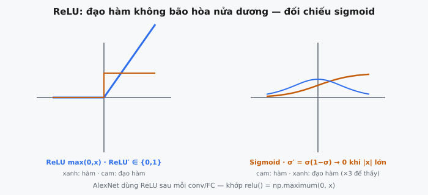

Rectified Linear Unit (ReLU) được định nghĩa là $f(x) = \max(0, x)$. Trong bài báo năm 2012 "ImageNet Classification with Deep Convolutional Neural Networks," Krizhevsky, Sutskever và Hinton đã cho thấy rằng việc thay thế sigmoid/tanh bằng ReLU cho phép AlexNet huấn luyện nhanh hơn nhiều lần trong khi đạt hiệu năng phá kỷ lục trên ILSVRC-2012.

## Nó là gì / Nó làm gì

Một **hàm kích hoạt** đưa tính phi tuyến vào mạng nơ-ron. Nếu không có nó, các lớp tuyến tính xếp chồng sẽ suy biến thành một mô hình tuyến tính duy nhất bất kể độ sâu.

ReLU thực hiện điều này với sự đơn giản cực độ:

* **Đầu vào dương** được truyền qua không thay đổi
* **Đầu vào âm** được đặt thành 0
* **Không có tham số học được** và không có phép tính tốn kém (không có hàm mũ, không có phép chia)
* Phép toán **element-wise** không có tương tác giữa các phần tử

Mỗi neuron hoạt động tuyến tính, nhưng mạng tạo ra một **xấp xỉ tuyến tính từng đoạn** của các hàm phức tạp. Một mạng ReLU sâu có thể tạo ra số lượng vùng tuyến tính tăng theo cấp số nhân.

Trong AlexNet, ReLU được áp dụng sau mỗi lớp tích chập và fully connected, độc lập trên tất cả các giá trị vô hướng trong mỗi feature map.

::: {#fig-alexnet-relu fig-cap="ReLU $f(x)=\\max(0,x)$ có đạo hàm $\\{0,1\\}$ không bão hòa khi $x>0$; sigmoid bão hòa và $\\sigma'=\\sigma(1-\\sigma)\\to 0$ ở đuôi — khớp `relu()` = `np.maximum(0, x)`." fig-alt="Hai đồ thị hàm và đạo hàm: ReLU bên trái, sigmoid bên phải."}
{fig-align="center"}
:::

## Các phương trình chính

### Định nghĩa ReLU

$$
f(x) = \max(0, x)
=
\begin{cases}
x, & \text{nếu } x > 0 \\
0, & \text{nếu } x \leq 0
\end{cases}
$$

### Đạo hàm ReLU (Gradient)

$$
f'(x) = \begin{cases} 1 & \text{nếu } x > 0 \\
0 & \text{nếu } x < 0 \end{cases}
$$

Về mặt kỹ thuật, $f'(0)$ không xác định. Trong thực tế, các implementation gán $f'(0) = 0$ mà không gây ảnh hưởng đo lường được đến quá trình huấn luyện.

### Hàm Sigmoid (để so sánh)

$$
\sigma(x) = \frac{1}{1 + e^{-x}}
$$

Đạo hàm: $\sigma'(x) = \sigma(x)(1 - \sigma(x))$, tối đa $0.25$ tại $x = 0$. Gradient luôn bị suy giảm ít nhất 4 lần ở mỗi lớp, và hiệu ứng này tích lũy qua chiều sâu.

### Hàm Tanh (để so sánh)

$$
\tanh(x) = \frac{e^x - e^{-x}}{e^x + e^{-x}}
$$

Đạo hàm: $\tanh'(x) = 1 - \tanh^2(x)$, tối đa $1.0$ tại $x = 0$, nhưng $< 1$ với mọi $x \neq 0$ và suy giảm nhanh khi $|x| > 2$. Cả sigmoid và tanh đều là **các phi tuyến bão hòa**. ReLU **không bão hòa** đối với đầu vào dương: gradient luôn đúng bằng 1.

## Cơ chế / Cách nó hoạt động

### Phép toán element-wise

Cho tensor đầu vào $\mathbf{Z}$, đầu ra $\mathbf{A}$ có cùng shape với $a_{ij} = \max(0, z_{ij})$. Không có tương tác giữa các phần tử, không có tham số, không có trạng thái.

### Hành vi trên các giá trị dương

Khi $z > 0$, ReLU hoạt động như ánh xạ đồng nhất: $f(z) = z$, gradient đúng bằng 1. Gradient upstream được truyền qua không thay đổi trong quá trình lan truyền ngược. Đây là thuộc tính then chốt: tín hiệu gradient truyền ngược qua nhiều lớp mà không bị suy giảm, miễn là các neuron đang hoạt động.

### Hành vi trên các giá trị âm

Khi $z \leq 0$, ReLU cho đầu ra bằng 0 và gradient bằng 0. Điều này tạo ra **độ thưa động**: với bất kỳ đầu vào cụ thể nào, chỉ một tập con các neuron hoạt động. Krizhevsky et al. lưu ý rằng độ thưa này có lợi về mặt tính toán, vì mạng thực chất sử dụng một sparse sub-network khác nhau cho mỗi đầu vào.

### Dòng gradient trong quá trình lan truyền ngược

$$
\frac{\partial L}{\partial z} = \frac{\partial L}{\partial a} \cdot f'(z) = 
\begin{cases} \frac{\partial L}{\partial a} & \text{nếu } z > 0 \\
0 & \text{nếu } z \leq 0 \end{cases}
$$

Trong quá trình lan truyền ngược, ReLU hoạt động như một **binary mask**: gradient đi qua nơi các neuron đã hoạt động, và bị chặn nơi chúng không hoạt động. Không có sự suy giảm đối với các neuron đang hoạt động. Với sigmoid, mỗi lớp nhân gradient với $\leq 0.25$; sau 10 lớp: $0.25^{10} \approx 9.5 \times 10^{-7}$. Với ReLU, các đường đang hoạt động có hệ số nhân đúng bằng 1.

## Bối cảnh bài báo / Các quyết định thiết kế

### Tại sao Krizhevsky et al. chọn ReLU

Trong Mục 3.1 ("ReLU Nonlinearity"), các tác giả phát biểu: "Deep convolutional neural networks with ReLUs train several times faster than their equivalents with tanh units." Thí nghiệm của họ: một CNN bốn lớp trên CIFAR-10 với ReLU đạt training error 25% **nhanh hơn sáu lần** so với tanh (**Hình 1**). Họ làm rõ: "This is not a regularization effect, because ReLUs do not saturate."

### Cho phép độ sâu của AlexNet

AlexNet có 5 lớp tích chập + 3 lớp fully connected (8 lớp học được, ~60M tham số). Bài báo ghi nhận ReLU là một yếu tố then chốt: nếu không có quá trình huấn luyện nhanh với ReLU, họ đã không thể huấn luyện kiến trúc này trên ImageNet (1.2M ảnh, 1,000 lớp) trong thời gian thực tế trên hai GPU GTX 580.

Các tác giả trích dẫn công trình trước đó của Jarrett et al. (2009) và Nair và Hinton (2010), nhưng AlexNet là mô hình đầu tiên xác thực ReLU ở quy mô lớn trên một tập dữ liệu lớn và thách thức, khiến nó trở thành tiêu chuẩn mặc định.

### Tác động kiến trúc rộng hơn

ReLU tương tác với các lựa chọn thiết kế khác của AlexNet. Độ thưa của nó bổ trợ cho dropout (cả hai đều khuyến khích các biểu diễn phân tán). Đầu ra dương không bị chặn trên của nó làm cho local response normalization (LRN) hữu ích trong việc ngăn các activation lấn át giữa các neuron lân cận.

## Vấn đề vanishing gradient

### Tại sao Sigmoid và Tanh gặp vấn đề

Trong một mạng sâu có $L$ lớp, gradient của loss theo trọng số ở lớp $l$ bao gồm một tích qua tất cả các lớp tiếp theo:

$$
\frac{\partial L}{\partial \mathbf{W}^{(l)}} = \frac{\partial L}{\partial \mathbf{a}^{(L)}} \cdot \prod_{k=l+1}^{L} \text{diag}(\sigma'(\mathbf{z}^{(k)})) \cdot \mathbf{W}^{(k)} \cdot \frac{\partial \mathbf{a}^{(l)}}{\partial \mathbf{W}^{(l)}}
$$

Với **sigmoid**, $\sigma'(x) \leq 0.25$. Sau 8 lớp: $0.25^8 \approx 1.5 \times 10^{-5}$, do đó gradient ở các lớp đầu nhỏ hơn gradient tại đầu ra năm bậc độ lớn.

Với **tanh**, $\tanh'(0) = 1$ nhưng giảm nhanh: $\tanh'(1) \approx 0.42$, $\tanh'(2) \approx 0.07$, $\tanh'(3) \approx 0.01$. Trừ khi tất cả các pre-activation tập trung gần 0 (không thực tế), gradient vẫn biến mất theo cấp số nhân.

### ReLU giải quyết điều này như thế nào

Đối với các neuron đang hoạt động ($z > 0$), $f'(z) = 1$. Tích dọc theo bất kỳ đường nào của các neuron đang hoạt động:

$$
\prod_{k=l+1}^{L} f'(z^{(k)}) = 1^{L-l} = 1
$$

Không có sự suy giảm từ hàm kích hoạt — một thay đổi mang tính định tính so với sigmoid/tanh. Các neuron không hoạt động ($z \leq 0$) có gradient bằng 0 (vấn đề "dying ReLU", xem Các lỗi thường gặp), nhưng trong một mạng khỏe mạnh, vẫn có đủ neuron còn hoạt động để gradient chảy qua các đường thay thế.

### Lập luận toán học

Trong các điều kiện điển hình, $\mathbb{E}[|\sigma'(z)|] \approx 0.2$ đối với sigmoid. Với ReLU có ~50% neuron hoạt động, $\mathbb{E}[f'(z)] \approx 0.5$. Qua 8 lớp: $0.5^8 / 0.2^8 = 3.9 \times 10^{-3} / 2.56 \times 10^{-6} \approx 1500\times$ nhiều gradient hơn đi tới các lớp đầu. Hơn nữa, các gradient ReLU đi qua sẽ đến với cường độ đầy đủ (hệ số 1), không giống các gradient luôn bị suy giảm của sigmoid.

## Ví dụ số

### Thiết lập

Các giá trị pre-activation từ một lớp đơn:

$$
\mathbf{z} = [-2.0, ; -0.5, ; 0.0, ; 0.3, ; 1.5, ; -1.0, ; 2.7, ; 0.1]
$$

### Bước 1: Forward Pass (Tính đầu ra ReLU)

Áp dụng $f(x) = \max(0, x)$ theo từng phần tử:

* $f(-2.0) = 0.0$, $f(-0.5) = 0.0$, $f(0.0) = 0.0$ (âm/zero, bị đưa về 0)
* $f(0.3) = 0.3$, $f(1.5) = 1.5$, $f(2.7) = 2.7$, $f(0.1) = 0.1$ (dương, truyền qua)
* $f(-1.0) = 0.0$ (âm, bị đưa về 0)

**Đầu ra ReLU:**

$$
\mathbf{a} = [0.0, ; 0.0, ; 0.0, ; 0.3, ; 1.5, ; 0.0, ; 2.7, ; 0.1]
$$

4 trong 8 giá trị (50%) bị đưa về 0 — độ thưa điển hình và mong muốn.

### Bước 2: Backward Pass (Tính gradient ReLU)

Gradient upstream:

$$
\frac{\partial L}{\partial \mathbf{a}} = [0.4, ; -0.2, ; 0.1, ; -0.6, ; 0.8, ; 0.3, ; -0.5, ; 0.9]
$$

Áp dụng binary mask (truyền gradient nơi $z > 0$, chặn nơi $z \leq 0$):

* $z_1=-2.0 \leq 0 \rightarrow 0.0$; $z_2=-0.5 \leq 0 \rightarrow 0.0$; $z_3=0.0 \leq 0 \rightarrow 0.0$; $z_6=-1.0 \leq 0 \rightarrow 0.0$
* $z_4=0.3 > 0 \rightarrow -0.6$; $z_5=1.5 > 0 \rightarrow 0.8$; $z_7=2.7 > 0 \rightarrow -0.5$; $z_8=0.1 > 0 \rightarrow 0.9$

**Gradient được truyền về lớp trước:**

$$
\frac{\partial L}{\partial \mathbf{z}} = [0.0, ; 0.0, ; 0.0, ; -0.6, ; 0.8, ; 0.0, ; -0.5, ; 0.9]
$$

Mọi neuron đang hoạt động đều truyền gradient của nó với **độ lớn đầy đủ** — không bị suy giảm.

### Bước 3: So sánh với Sigmoid

Các hệ số gradient sigmoid $\sigma'(z) = \sigma(z)(1-\sigma(z))$ cho cùng các đầu vào:

* $z=-2.0$: $0.105$; $z=-0.5$: $0.235$; $z=0.0$: $0.250$; $z=0.3$: $0.245$
* $z=1.5$: $0.149$; $z=-1.0$: $0.197$; $z=2.7$: $0.059$; $z=0.1$: $0.249$

Ngay cả trường hợp tốt nhất ($z=0$) cũng suy giảm xuống 25%. Tại $z=2.7$, gradient bị giảm xuống 5.9%. Các suy giảm này tích lũy thảm khốc qua nhiều lớp.

### Bước 4: So sánh với Tanh

Các hệ số gradient tanh $1 - \tanh^2(z)$:

* $z=-2.0$: $0.071$; $z=-0.5$: $0.786$; $z=0.0$: $1.000$; $z=0.3$: $0.915$
* $z=1.5$: $0.181$; $z=-1.0$: $0.420$; $z=2.7$: $0.020$; $z=0.1$: $0.990$

Tanh đạt 1.0 tại $z=0$ nhưng giảm xuống 0.020 tại $z=2.7$. ReLU cho đúng 1.0 với mọi đầu vào dương bất kể độ lớn: $f'(100) = f'(0.001) = 1$.

## Các biến thể và bối cảnh hiện đại

### Leaky ReLU

$$
f(x) = 
\begin{cases} x & \text{nếu } x > 0 \\
\alpha x & \text{nếu } x \leq 0 \end{cases}
$$

Thông thường $\alpha = 0.01$. Đảm bảo mọi neuron luôn có gradient khác 0, ngăn việc "chết" hoàn toàn. Được đề xuất bởi Maas et al. (2013), phổ biến trong GAN.

### Parametric ReLU (PReLU)

$$
f(x) = 
\begin{cases} x & \text{nếu } x > 0 \\
\alpha_i x & \text{nếu } x \leq 0 \end{cases}
$$

He et al. (2015) đã làm cho $\alpha_i$ trở thành một tham số học được theo từng channel. Kết hợp với He/Kaiming initialization (tính đến các thuộc tính phương sai của ReLU), PReLU đạt hiệu năng vượt con người trên ImageNet. Các giá trị $\alpha$ học được thường hội tụ về các số dương nhỏ.

### Exponential Linear Unit (ELU)

$$
f(x) = 
\begin{cases} x & \text{nếu } x > 0 \\
\alpha(e^x - 1) & \text{nếu } x \leq 0 \end{cases}
$$

Clevert et al. (2016), thường $\alpha = 1.0$. Tạo ra đầu ra âm (đẩy trung bình gần 0 hơn), bão hòa về $-\alpha$ với các giá trị âm lớn. Tốn kém hơn ReLU do tính toán hàm mũ; lợi ích thực tế thường không đáng kể.

### GELU (Gaussian Error Linear Unit)

$$
f(x) = x \cdot \Phi(x) = x \cdot \frac{1}{2}\left[1 + \text{erf}\left(\frac{x}{\sqrt{2}}\right)\right]
$$

Hendrycks và Gimpel (2016). Một phiên bản trơn, mang tính xác suất của ReLU: nhân tỉ lệ mỗi đầu vào với xác suất một biến chuẩn tắc tiêu chuẩn nhỏ hơn đầu vào đó. Được sử dụng trong BERT, GPT-2, GPT-3 và hầu hết các transformer hiện đại.

### Swish / SiLU (Sigmoid Linear Unit)

$$
f(x) = x \cdot \sigma(x) = \frac{x}{1 + e^{-x}}
$$

Ramachandran et al. (2017), Google Brain. Trơn, không đơn điệu, không bị chặn trên. Liên tục vượt ReLU trên nhiều kiến trúc. Được sử dụng trong EfficientNet. Trên thực tế có liên quan gần với GELU.

### Tại sao ReLU vẫn chiếm ưu thế

* **Đơn giản:** dễ cài đặt, không có siêu tham số
* **Hiệu quả:** một phép so sánh duy nhất trên mỗi phần tử so với các hàm mũ/hàm lỗi
* **Initialization đã được hiểu rõ:** He initialization được thiết kế và xác thực riêng cho ReLU
* **Ổn định:** hiếm khi thất bại nghiêm trọng, hiệu năng mạnh trên nhiều tác vụ và kiến trúc

## Các lỗi thường gặp

### Vấn đề Dying ReLU

Một neuron "chết" khi trọng số của nó tiến hóa sao cho $z = \mathbf{w}^T \mathbf{x} + b < 0$ với mọi đầu vào huấn luyện. Đầu ra và gradient vĩnh viễn bằng 0 — neuron không bao giờ phục hồi. Dễ xảy ra nhất với learning rate cao hoặc khởi tạo bias âm. Cách giảm thiểu: khởi tạo bias bằng 0/dương nhỏ, learning rate vừa phải, hoặc dùng Leaky ReLU/PReLU/ELU.

### Đầu ra không có trung tâm tại 0

Đầu ra ReLU luôn $\geq 0$, vì vậy tất cả đầu vào tới lớp tiếp theo đều dương. Điều này buộc tất cả gradient trọng số cho neuron đó có cùng dấu, ràng buộc quá trình tối ưu hóa vào các đường zig-zag trong không gian trọng số. Batch normalization phần lớn giảm nhẹ vấn đề này bằng cách đưa các activation về trung tâm.

### Không khả vi tại 0

ReLU có một điểm gấp khúc tại $x = 0$. Trong thực tế, đây không phải là vấn đề: xác suất đúng bằng $0.0$ trong floating-point là không đáng kể, và hầu hết các implementation đặt $f'(0) = 0$. Các mạng ReLU hội tụ trong các điều kiện tiêu chuẩn mặc dù có đặc điểm này.

### Activation không bị chặn

Khác với sigmoid (0 đến 1) hoặc tanh (-1 đến 1), ReLU không có chặn trên. Activation có thể tăng lớn, gây rủi ro overflow số học và gradient không ổn định. Batch normalization, layer normalization và weight decay là các thành phần đồng hành quan trọng. Trong AlexNet, LRN đảm nhiệm vai trò này.

### Ảnh hưởng lên thống kê batch

ReLU đưa ~50% đầu vào về 0, làm dịch trung bình lên trên và giảm phương sai. He initialization bù lại bằng cách scale trọng số theo $\sqrt{2/n}$ thay vì $\sqrt{1/n}$. Nếu batch norm được áp dụng trước ReLU, phân phối đã chuẩn hóa bị cắt thành một half-normal (trung bình $\approx 0.4$, phương sai $\approx 0.68$). Thứ tự của batch norm và ReLU vẫn là một vấn đề cần cân nhắc trong thực hành.

### Nhạy cảm với khởi tạo trọng số

Hành vi của ReLU phụ thuộc vào dấu của pre-activation, khiến initialization trở nên quan trọng. He initialization (phương sai $2/n$) giữ cho phương sai activation không đổi qua các lớp. Xavier/Glorot initialization (phương sai $1/n$), được thiết kế cho sigmoid/tanh, làm phương sai co lại 2 lần ở mỗi lớp ReLU, dẫn đến activation biến mất trong các mạng sâu. Initialization sai có thể khiến quá trình huấn luyện thất bại hoàn toàn.

## Code

```python

import numpy as np

def relu(x: np.ndarray) -> np.ndarray:
    """ReLU activation: f(x) = max(0, x)"""
    return np.maximum(0, x)

```

<!-- CROSSLINK_THEORY_RELU -->

::: {.callout-tip}
## Ôn nền tảng
Công thức và dead ReLU chi tiết: [Theory AI — ReLU Activation](../../theory-ai/07-activations-losses/relu-activation.qmd).
:::
