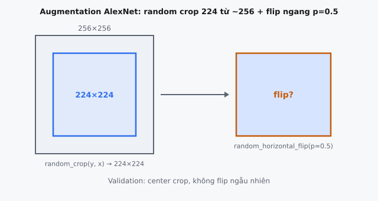

Data augmentation mở rộng tập dữ liệu huấn luyện một cách nhân tạo bằng cách áp dụng các phép biến đổi bảo toàn nhãn lên các ảnh hiện có. Trong AlexNet (Krizhevsky, Sutskever & Hinton, 2012), augmentation là một cơ chế phòng vệ chính chống lại overfitting khi huấn luyện một mạng 60 triệu tham số trên ~1.2 triệu ảnh ImageNet. Các tác giả sử dụng hai chiến lược augmentation, cả hai đều được tính trên CPU trong khi GPU huấn luyện trên batch trước đó.

## Data Augmentation là gì và nó làm gì

Augmentation lấy một mẫu huấn luyện gốc và tạo ra các mẫu mới thông qua các phép biến đổi ngẫu nhiên bảo toàn nhãn ngữ nghĩa. Một bức ảnh mèo vẫn là mèo dù được crop, flip hoặc dịch chuyển màu.

* **Mở rộng tập huấn luyện:** Nếu mỗi ảnh tạo ra $k$ phiên bản augmented, tập dữ liệu hiệu dụng tăng lên theo hệ số $k$. Cơ chế crop-and-flip của AlexNet tạo ra 2048 patch 224x224 duy nhất cho mỗi ảnh 256x256.
* **Giảm overfitting:** Mạng gần như không bao giờ thấy đúng cùng một bố cục pixel hai lần, buộc nó học các đặc trưng ổn định thay vì ghi nhớ các mẫu cụ thể.
* **Cải thiện khả năng khái quát hóa:** Augmentation mã hóa tri thức tiên nghiệm về các bất biến (tịnh tiến, phản chiếu, chiếu sáng) trực tiếp vào pipeline dữ liệu.
* **Thiết yếu cho mạng sâu:** AlexNet có ~60M tham số nhưng chỉ có ~1.2M ảnh huấn luyện. Nếu không có augmentation và dropout, mạng sẽ overfit nghiêm trọng.

::: {#fig-alexnet-aug fig-cap="Random crop $224\\times224$ từ ảnh $\\approx256\\times256$, rồi flip ngang với xác suất $0.5$ — khớp `random_crop` / `random_horizontal_flip`. Validation dùng center crop, không flip ngẫu nhiên." fig-alt="Khung ảnh lớn với cửa sổ crop và khối flip bên phải."}
{fig-align="center"}
:::

## Các phương trình chính

### Trích xuất Random Crop

Cho ảnh $I$ có kích thước $256 \times 256$, một crop $224 \times 224$ được trích xuất tại vị trí ngẫu nhiên $(y, x)$:

$$I_{\text{crop}} = I[y : y + h, ; x : x + w, ; :]$$

trong đó các offset được lấy mẫu đều:

$$y \sim \text{Uniform}{0, 1, \ldots, H - h}, \quad x \sim \text{Uniform}{0, 1, \ldots, W - w}$$

Cả $y$ và $x$ nằm trong khoảng từ 0 đến 32, tạo ra $(256 - 224)^2 = 1024$ vị trí khác nhau (theo cách làm tròn của bài báo).

### Horizontal Flip

Horizontal flip đảo ngược trục chiều rộng, được áp dụng với xác suất 0.5:

$$I_{\text{flip}}[y, x, c] = I_{\text{crop}}[y, ; w - 1 - x, ; c]$$

$$I_{\text{aug}} = 
\begin{cases} I_{\text{flip}} & 
\text{với xác suất } 0.5 \\
I_{\text{crop}} & \text{với xác suất } 0.5 \end{cases}$$

### PCA Color Augmentation (Fancy PCA)

Gọi $\mathbf{p}_1, \mathbf{p}_2, \mathbf{p}_3 \in \mathbb{R}^3$ là các vectơ riêng và $\lambda_1, \lambda_2, \lambda_3$ là các trị riêng của ma trận hiệp phương sai RGB $3 \times 3$ trên tập huấn luyện. Nhiễu được cộng vào mọi pixel là:

$$\Delta I = 
[\mathbf{p}_1, \mathbf{p}_2, \mathbf{p}_3] 
\begin{bmatrix} \alpha_1 \lambda_1 \\ 
\alpha_2 \lambda_2 \\ 
\alpha_3 \lambda_3 \end{bmatrix}$$

trong đó mỗi $\alpha_i \sim \mathcal{N}(0, 0.1)$. Cùng một $\Delta I \in \mathbb{R}^3$ được cộng vào mọi pixel, tạo ra một dịch chuyển màu nhất quán thay vì nhiễu theo từng pixel.

## Hai chiến lược Augmentation của AlexNet

### Chiến lược 1: Random Cropping với Horizontal Flipping

* **Rescale:** Resize sao cho cạnh ngắn hơn là 256px, sau đó lấy crop trung tâm 256x256.
* **Random crop:** Trích xuất một patch 224x224 từ một vị trí ngẫu nhiên, với góc trên-trái $(y, x)$ được lấy mẫu từ $[0, 32]$.
* **Random flip:** Flip ngang với xác suất 0.5, nhân đôi số patch hiệu dụng.
* **Hệ số augmentation:** $1024 \times 2 = 2048$ mẫu augmented khác nhau cho mỗi ảnh.

Cropping đưa vào tính bất biến tịnh tiến; flipping đưa vào tính bất biến phản chiếu gương. Cả hai đều phù hợp với hầu hết các hạng mục đối tượng trong ImageNet.

### Chiến lược 2: PCA Color Augmentation (Fancy PCA)

PCA được thực hiện trên tất cả các giá trị pixel RGB trong ImageNet, tạo ra ba vectơ riêng và trị riêng nắm bắt biến thiên màu chính. Tại thời điểm huấn luyện, ba hệ số vô hướng $\alpha_i \sim \mathcal{N}(0, 0.1)$ được lấy mẫu cho mỗi ảnh:

$$\Delta I = \alpha_1 \lambda_1 \mathbf{p}_1 + \alpha_2 \lambda_2 \mathbf{p}_2 + \alpha_3 \lambda_3 \mathbf{p}_3$$

Thành phần chính đầu tiên xấp xỉ tương ứng với độ sáng; các thành phần còn lại nắm bắt biến thiên đối kháng màu. Bài báo lưu ý: "This scheme approximately captures an important property of natural images, namely, that object identity is invariant to changes in the intensity and color of the illumination." Các giá trị $\alpha_i$ mới được lấy một lần cho mỗi ảnh trong mỗi epoch, đảm bảo sự đa dạng liên tục mà không cần lưu trữ các ảnh augmented.

## Bối cảnh bài báo và các quyết định thiết kế

### Hiệu quả tính toán

Cả hai chiến lược tạo ra ảnh đã biến đổi on-the-fly từ ảnh gốc với chi phí tính toán tối thiểu, tránh lưu trữ trên đĩa. Bài báo phát biểu: "The image transformations are generated in Python code on the CPU while the GPU is training on the previous batch of images. So these data augmentation schemes are, in effect, computationally free."

### Giảm lỗi

PCA color augmentation làm giảm top-1 error hơn 1%. Trên ImageNet LSVRC, nơi biên độ cạnh tranh thường dưới 1%, điều này có ý nghĩa. Đóng góp của crop-and-flip khó tách riêng hơn nhưng rất thiết yếu để ngăn overfitting nghiêm trọng.

### Tạo On-the-Fly

Augmentation được áp dụng trong quá trình huấn luyện, không phải như tiền xử lý. Mỗi epoch, mạng thấy một phiên bản augmented khác nhau của mỗi ảnh. Cách tiếp cận on-the-fly này trở thành tiêu chuẩn trong tất cả các pipeline Deep Learning sau đó.

## Tại sao Augmentation hoạt động như Regularization

* **Không bao giờ thấy cùng một ảnh hai lần:** Với 1024 vị trí crop, 2 trạng thái flip và nhiễu màu liên tục, không gian các phiên bản augmented cho mỗi ảnh về mặt hiệu dụng là vô hạn. Điều này ngăn ghi nhớ.
* **Nhân kích thước tập dữ liệu:** Nhân kích thước tập dữ liệu hiệu dụng lên 2048 lần (chỉ tính các augmentation rời rạc) làm giảm phương sai trong đánh đổi bias-variance, đẩy mô hình hướng tới các đặc trưng nắm bắt phân phối thật.
* **Buộc tính bất biến:** Huấn luyện trên ảnh đã flip dạy tính bất biến flip; các crop được tịnh tiến dạy tính bất biến tịnh tiến; nhiễu màu dạy tính bất biến chiếu sáng. Mỗi yếu tố làm giảm độ phức tạp hiệu dụng của hàm cần học.
* **Liên hệ bias-variance:** Augmentation tạo bias cho mạng hướng tới các nghiệm bất biến theo phép biến đổi. Vì quá trình sinh dữ liệu thật sự bất biến với các phép biến đổi này, bias này là có lợi, tạo ra phương sai thấp hơn với mức tăng bias không đáng kể.
* **Vicinal Risk Minimization (VRM):** ERM tiêu chuẩn chỉ xét các mẫu huấn luyện chính xác. Augmentation triển khai VRM bằng cách tối thiểu hóa rủi ro trên một "vùng lân cận" của mỗi mẫu, được định nghĩa bởi tập các phép biến đổi hợp lý.

## Test-Time Augmentation trong AlexNet

### Quy trình 10-Crop

Khi inference, mỗi ảnh kiểm thử (256x256) tạo ra 10 crop cố định kích thước 224x224:

* **Bốn crop ở góc:** trên-trái, trên-phải, dưới-trái, dưới-phải.
* **Một crop trung tâm.**
* **Năm phiên bản đã flip:** horizontal flip của từng crop ở trên.

Dự đoán cuối cùng lấy trung bình 10 đầu ra softmax:

$$\hat{y} = \frac{1}{10} \sum_{i=1}^{10} f(I_i)$$

### Tại sao nó hoạt động

Mỗi crop cung cấp một góc nhìn khác; lấy trung bình làm giảm phương sai dự đoán. Với các dự đoán không tương quan có phương sai $\sigma^2$, lấy trung bình tạo ra phương sai $\sigma^2 / 10$. Trong thực tế, các crop có tương quan (các vùng chồng lấp), vì vậy mức giảm nhỏ hơn, nhưng vẫn đáng kể. Không sử dụng quy trình này và chỉ dựa vào center crop dẫn đến kết quả kém hơn rõ rệt. Đây là một trong những ứng dụng TTA có hệ thống sớm nhất trong Deep Learning.

## Ví dụ số

Một walkthrough cụ thể của tất cả các phép augmentation trên một ảnh huấn luyện duy nhất.

### Bước 1: Bắt đầu với ảnh 256x256

Ảnh huấn luyện $I$ có shape $(256, 256, 3)$: một con golden retriever với các giá trị RGB trong $[0, 255]$.

### Bước 2: Random Crop

Lấy mẫu $y = 17$, $x = 24$ (cả hai đều nằm trong khoảng hợp lệ $[0, 32]$):

$$I_{\text{crop}} = I[17:241, ; 24:248, ; :]$$

Kết quả: một patch $(224, 224, 3)$, làm golden retriever dịch nhẹ lên trên-trái so với trung tâm.

### Bước 3: Random Horizontal Flip

Lấy mẫu $u = 0.37$. Vì $u < 0.5$, thực hiện flip:

$$I_{\text{flip}}[y, x, c] = I_{\text{crop}}[y, ; 223 - x, ; c]$$

Con golden retriever đang quay mặt sang trái giờ quay mặt sang phải. Nhãn được bảo toàn.

### Bước 4: PCA Color Augmentation

Các vectơ riêng và trị riêng đại diện của ImageNet:

$$\mathbf{p}_1 = 
\begin{bmatrix} -0.5675 \\
-0.5808 \\
-0.5836 \end{bmatrix}, 
\quad \mathbf{p}_2 = \begin{bmatrix} -0.7192 \\
0.0045 \\ 0.6948 \end{bmatrix}, 
\quad \mathbf{p}_3 = \begin{bmatrix} -0.4009 \\ 0.8140 \\ -0.4203 \end{bmatrix}$$

$$\lambda_1 = 0.2175, \quad \lambda_2 = 0.0188, \quad \lambda_3 = 0.0045$$

Lưu ý $\lambda_1 \gg \lambda_2 \gg \lambda_3$: phần lớn biến thiên màu nằm dọc theo thành phần đầu tiên (xấp xỉ độ sáng). Lấy mẫu $\alpha_1 = 0.12$, $\alpha_2 = -0.05$, $\alpha_3 = 0.08$ từ $\mathcal{N}(0, 0.1)$:

* **Hạng tử 1:** $\alpha_1 \lambda_1 \mathbf{p}_1 = 0.0261 \times [-0.5675, -0.5808, -0.5836]^T = [-0.0148, -0.0152, -0.0152]^T$
* **Hạng tử 2:** $\alpha_2 \lambda_2 \mathbf{p}_2 = -0.00094 \times [-0.7192, 0.0045, 0.6948]^T = [0.000676, -0.0000042, -0.000653]^T$
* **Hạng tử 3:** $\alpha_3 \lambda_3 \mathbf{p}_3 = 0.00036 \times [-0.4009, 0.8140, -0.4203]^T = [-0.000144, 0.000293, -0.000151]^T$

**Tổng:**

$$\Delta I = \begin{bmatrix} -0.01427 \\ -0.01491 \\ -0.01600 \end{bmatrix}$$

Tất cả channel đều giảm tương tự nhau vì nhiễu chi phối nằm dọc theo $\mathbf{p}_1$, tạo ra hiện tượng tối đi nhẹ. Trên thang $[0, 255]$: $\approx [-3.6, -3.8, -4.1]$, hầu như không cảm nhận được nhưng có ý nghĩa qua nhiều epoch.

### Bước 5: Ảnh Augmented cuối cùng

$$I_{\text{aug}}[y, x, :] = I_{\text{flip}}[y, x, :] + \Delta I$$

## Các kỹ thuật Augmentation hiện đại

Các chiến lược của AlexNet mang tính tiên phong. Lĩnh vực này sau đó đã mở rộng đáng kể.

* **AutoAugment / RandAugment:** AutoAugment sử dụng RL để tìm kiếm các chính sách tối ưu. RandAugment đơn giản hóa điều này thành hai siêu tham số ($N$ phép biến đổi, độ lớn $M$).
* **CutMix:** Dán một vùng hình chữ nhật từ một ảnh lên ảnh khác, trộn nhãn theo tỉ lệ diện tích.
* **Mixup:** Trộn hai ảnh và nhãn bằng tổ hợp lồi: $\tilde{x} = \lambda x_i + (1-\lambda)x_j, \tilde{y} = \lambda y_i + (1-\lambda)y_j$.
* **CutOut:** Che ngẫu nhiên một vùng hình vuông bằng các giá trị 0, buộc mô hình ổn định với che khuất một phần.
* **ColorJitter:** Hậu duệ hiện đại của PCA augmentation trong AlexNet, điều chỉnh độ sáng, độ tương phản, độ bão hòa và sắc độ.

## Các lỗi thường gặp

* **Vô tình augmentation ở thời điểm kiểm thử:** Để random augmentation bật trong quá trình đánh giá tạo ra metric nhiễu. Dùng tiền xử lý tất định (center crop, không flip) trừ khi cố ý thực hiện TTA.
* **Augmentation làm thay đổi nhãn:** Không phải mọi phép biến đổi đều bảo toàn nhãn (ví dụ, flip chữ số 6 thành 9).
* **Color augmentation trên các tác vụ phân biệt bằng màu sắc:** PCA color augmentation có thể gây hại cho các tác vụ mà màu sắc có tính phân biệt (ví dụ, phát hiện độ chín).
* **Tiền xử lý validation sai:** Validation nên sử dụng tiền xử lý tất định (resize, center crop), không dùng random training augmentation.
* **Augmentation quá mạnh:** Các phép biến đổi cực đoan tạo ra ảnh không còn giống phân phối thật.
* **Quên normalize sau augmentation:** Normalize nên là bước cuối cùng sau tất cả các phép biến đổi không gian và màu sắc.

## Code
```python
import numpy as np

def random_crop(image: np.ndarray, crop_size: int = 224, crop_y: int = None, crop_x: int = None) -> np.ndarray:
    """Extract a crop from the image at (crop_y, crop_x). If not given, choose randomly."""
    H, W, C = image.shape
    max_y = H - crop_size
    max_x = W - crop_size
    if crop_y is None:
        crop_y = np.random.randint(0, max_y + 1)
    if crop_x is None:
        crop_x = np.random.randint(0, max_x + 1)
    return image[crop_y:crop_y + crop_size, crop_x:crop_x + crop_size, :]

def random_horizontal_flip(image: np.ndarray, p: float = 0.5, flip_rand: float = None) -> np.ndarray:
    """Flip image horizontally if flip_rand < p. If flip_rand not given, generate randomly."""
    if flip_rand is None:
        flip_rand = np.random.rand()
    if flip_rand < p:
        return np.fliplr(image)
    return image

```