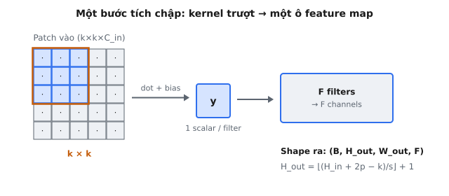
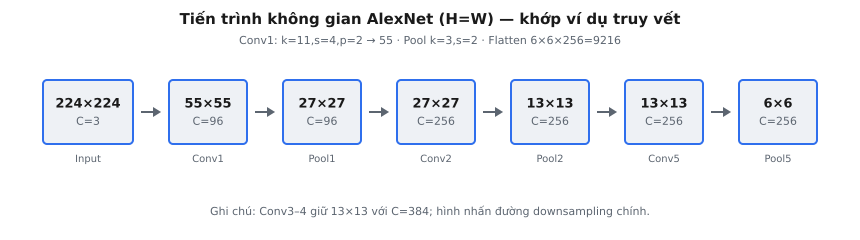

Một **lớp tích chập** áp dụng các bộ lọc có thể học được lên một tensor đầu vào, tạo ra các feature map phát hiện các mẫu không gian cục bộ (cạnh, kết cấu, hình dạng). Krizhevsky et al. (2012) đã sử dụng năm lớp tích chập làm backbone của AlexNet, mô hình đã giành chiến thắng ImageNet LSVRC-2012 và khơi lại Deep Learning hiện đại.

## Một lớp tích chập làm gì

Một lớp tích chập trượt một bộ lọc nhỏ (**kernel**) trên một tensor đầu vào. Tại mỗi vị trí, bộ lọc tính tích vô hướng với patch đầu vào mà nó bao phủ, tạo ra một giá trị vô hướng duy nhất. Lặp lại thao tác này trên tất cả các vị trí hợp lệ sẽ tạo ra một **feature map** 2D (hoặc **activation map**).

* **Nhiều bộ lọc:** Mỗi bộ lọc phát hiện một loại mẫu. Với $F$ bộ lọc, đầu ra có $F$ channel.
* **Đầu vào nhiều channel:** Mỗi bộ lọc trải rộng trên tất cả các channel đầu vào. Một bộ lọc áp dụng lên $C_{in}$ channel đầu vào có shape $k \times k \times C_{in}$.
* **Tham số:** Lớp có $F$ bộ lọc cộng với $F$ hệ số bias (một bias cho mỗi bộ lọc).

::: {#fig-alexnet-conv-geom fig-cap="Một bước tích chập: kernel $k\\times k\\times C_{in}$ trượt trên đầu vào, mỗi vị trí cho một vô hướng; $F$ bộ lọc tạo $F$ channel. $H_{out}=\\lfloor(H_{in}+2p-k)/s\\rfloor+1$." fig-alt="Lưới patch được kernel bao phủ, mũi tên tới ô đầu ra và khối F filters."}
{fig-align="center"}
:::

## Công thức kích thước đầu ra

Đối với mỗi trục không gian:

$$
H_{out} = \lfloor \frac{H_{in} + 2p - k}{s} \rfloor + 1
$$

* $H_{in}$: kích thước không gian đầu vào
* $k$: kích thước kernel
* $s$: stride (số pixel mà kernel di chuyển giữa các lần áp dụng)
* $p$: padding (các pixel bằng 0 được thêm vào mỗi phía trước khi tích chập)

Sau padding, kích thước đầu vào hiệu dụng là $H_{in} + 2p$. Vị trí bắt đầu hợp lệ xa nhất của kernel là $H_{in} + 2p - k$. Chia cho stride cho ta số bước; cộng 1 để tính cả vị trí ban đầu. Phép floor loại bỏ mọi pixel còn dư không vừa với một cửa sổ kernel hoàn chỉnh.

Shape đầy đủ của tensor đầu ra:

$$
(B, H_{out}, W_{out}, F)
$$

trong đó $B$ là batch size. Công thức chiều rộng là giống hệt, với $W_{in}$ thay cho $H_{in}$.

## Mỗi tham số kiểm soát điều gì

### Kích thước kernel

Kích thước kernel $k$ xác định vùng lân cận cục bộ mà mỗi bộ lọc nhìn thấy. Kernel lớn hơn có **receptive field** lớn hơn nhưng nhiều tham số hơn ($k^2 \times C_{in}$ cho mỗi bộ lọc). AlexNet sử dụng $11 \times 11$ trong Conv1 (để nắm bắt các cạnh và gradient màu quy mô lớn từ pixel thô) và các kernel nhỏ dần ($5 \times 5$, sau đó $3 \times 3$) ở các lớp sâu hơn, nơi mỗi vị trí đã biểu diễn một vùng ảnh lớn.

### Stride

Stride $s$ kiểm soát khoảng cách kernel di chuyển giữa các lần áp dụng. Stride 1 tạo ra kích thước đầu ra tối đa; stride 4 làm giảm kích thước đầu ra xấp xỉ 4 lần trên mỗi chiều không gian. Khác với pooling, tích chập có stride thực hiện downsampling trong khi vẫn học đặc trưng. Stride 4 của AlexNet trong Conv1 làm giảm mạnh $224 \times 224$ xuống $55 \times 55$ chỉ trong một lớp -- một lựa chọn thực dụng cho các GPU sẵn có vào năm 2012.

### Padding

Padding thêm các hàng và cột bằng 0 xung quanh biên đầu vào. Nếu không có padding, mỗi lớp làm co các chiều không gian đi $k - 1$ pixel (ở stride 1).

* **Valid padding** ($p = 0$): không padding, đầu ra nhỏ hơn đầu vào.
* **Same padding**: $p$ được chọn sao cho kích thước đầu ra bằng $\lceil H_{in} / s \rceil$, bảo toàn kích thước ở stride 1.

AlexNet sử dụng các giá trị cụ thể theo từng lớp: padding 2 cho Conv1 và Conv2, padding 1 cho Conv3-5.

### Số lượng bộ lọc

Số lượng bộ lọc $F$ xác định độ đa dạng đặc trưng. Nhiều bộ lọc hơn = nhiều dung lượng hơn, nhiều tham số hơn. AlexNet sử dụng 96 -> 256 -> 384 -> 384 -> 256 bộ lọc qua Conv1-5. Mẫu tăng số channel trong khi giảm kích thước không gian này là một đặc trưng điển hình của các kiến trúc CNN: khi độ phân giải giảm, mạng bù lại bằng nhiều channel đặc trưng hơn.

## Năm lớp tích chập của AlexNet

AlexNet có năm lớp tích chập, tiếp theo là ba lớp fully connected. Toàn bộ chồng tích chập:

* **Conv1**: 96 bộ lọc, kernel $11 \times 11$, stride 4, padding 2. Đầu vào $(224, 224, 3)$, đầu ra $(55, 55, 96)$. Theo sau là ReLU, LRN, max pooling ($3 \times 3$, stride 2) -> $(27, 27, 96)$.
* **Conv2**: 256 bộ lọc, kernel $5 \times 5$, stride 1, padding 2. Đầu vào $(27, 27, 96)$, đầu ra $(27, 27, 256)$. Theo sau là ReLU, LRN, max pooling ($3 \times 3$, stride 2) -> $(13, 13, 256)$.
* **Conv3**: 384 bộ lọc, kernel $3 \times 3$, stride 1, padding 1. Đầu vào $(13, 13, 256)$, đầu ra $(13, 13, 384)$. Chỉ có ReLU (không LRN, không pooling).
* **Conv4**: 384 bộ lọc, kernel $3 \times 3$, stride 1, padding 1. Đầu vào $(13, 13, 384)$, đầu ra $(13, 13, 384)$. Chỉ có ReLU.
* **Conv5**: 256 bộ lọc, kernel $3 \times 3$, stride 1, padding 1. Đầu vào $(13, 13, 384)$, đầu ra $(13, 13, 256)$. ReLU + max pooling ($3 \times 3$, stride 2) -> $(6, 6, 256)$.

Sau pooling của Conv5, đầu ra được flatten thành $6 \times 6 \times 256 = 9{,}216$ phần tử để đưa vào các lớp fully connected. Các lớp conv chứa phần lớn chi phí tính toán nhưng chỉ chiếm thiểu số tham số; các lớp FC chứa phần lớn tham số.

## Các quyết định thiết kế trong bài báo

### Tại sao dùng kernel $11 \times 11$ ở lớp đầu tiên

Conv1 hoạt động trên các pixel RGB thô. Một kernel $11 \times 11$ bao phủ 121 pixel trên mỗi channel -- đủ lớn để phát hiện các cạnh có hướng, mảng màu và gradient kết cấu. Các kernel nhỏ hơn sẽ có góc nhìn quá hẹp ở giai đoạn này. Khi kết hợp với stride 4, các vị trí đầu ra liền kề có receptive field chồng lấp nhau ($11 - 4 = 7$ pixel chồng lấp), thực hiện downsampling từ $224 \times 224$ xuống $55 \times 55$ trong một lớp.

### Tại sao dùng kernel nhỏ hơn ở các lớp sâu hơn

Đến Conv3-5, **receptive field hiệu dụng** của mỗi vị trí không gian đã bao phủ một vùng ảnh lớn (mỗi pixel tóm tắt nhiều pixel gốc từ các lớp trước). Một kernel $3 \times 3$ ở độ sâu này là đủ để kết hợp các đặc trưng cấp cao.

### Ràng buộc bộ nhớ GPU vào năm 2012

AlexNet được chia trên hai GPU GTX 580 (mỗi GPU 3 GB). Mỗi GPU xử lý một nửa số bộ lọc trong hầu hết các lớp. Conv3 là một ngoại lệ: nó nhận tất cả 256 channel từ cả hai GPU, trong khi Conv4 và Conv5 chỉ kết nối trong cùng một GPU. Tối ưu hóa đặc thù phần cứng này đã ảnh hưởng đến số lượng bộ lọc (96, 256, 384, 384, 256) nhưng không còn phù hợp với các GPU hiện đại.

### Vai trò của LRN và Pooling giữa các lớp

**Local Response Normalization (LRN)** sau Conv1 và Conv2 chuẩn hóa phản hồi neuron bằng cách chia cho tổng bình phương phản hồi của các neuron lân cận trên các feature map kề nhau. Bài báo báo cáo rằng LRN làm giảm top-1 error 1.4% và top-5 1.2%. Các kiến trúc sau này (VGGNet, ResNet) nhận thấy LRN không cần thiết và thay thế nó bằng Batch Normalization.

**Max pooling** ($3 \times 3$, stride 2) sau Conv1, Conv2 và Conv5 sử dụng **overlapping pooling** (pool 3, stride 2). Krizhevsky et al. báo cáo rằng điều này làm giảm top-1 error 0.4% và top-5 0.3% so với non-overlapping pooling.

## Số lượng tham số

Tham số cho mỗi lớp tích chập:

$$
\text{params} = F \times (k^2 \times C_{in} + 1)
$$

Hạng tử $+1$ biểu thị một bias cho mỗi bộ lọc. Đối với AlexNet:

* **Conv1**: $96 \times (11^2 \times 3 + 1) = 96 \times 364 = 34{,}944$
* **Conv2**: $256 \times (5^2 \times 96 + 1) = 256 \times 2{,}401 = 614{,}656$
* **Conv3**: $384 \times (3^2 \times 256 + 1) = 384 \times 2{,}305 = 885{,}120$
* **Conv4**: $384 \times (3^2 \times 384 + 1) = 384 \times 3{,}457 = 1{,}327{,}488$
* **Conv5**: $256 \times (3^2 \times 384 + 1) = 256 \times 3{,}457 = 884{,}992$

Tổng tham số conv: ~$3.7$ triệu. Để so sánh, riêng lớp FC đầu tiên có $9{,}216 \times 4{,}096 = 37{,}748{,}736$ tham số (xấp xỉ gấp 10 lần tất cả các lớp conv cộng lại). Điều này minh họa rằng các lớp conv hiệu quả về tham số nhờ chia sẻ trọng số trên các vị trí không gian.

## Chi phí tính toán (FLOPs)

FLOPs cho mỗi lớp tích chập:

$$
\text{FLOPs} \approx 2 \times H_{out} \times W_{out} \times F \times k^2 \times C_{in}
$$

Hệ số 2 tính đến các phép nhân-cộng. Đối với Conv1:

$$
\text{FLOPs}_{\text{Conv1}} \approx 2 \times 55 \times 55 \times 96 \times 11^2 \times 3 \approx 211 \text{ triệu}
$$

Các lớp conv chiếm phần lớn chi phí tính toán (~90% tổng FLOPs), trong khi các lớp FC chiếm phần lớn số lượng tham số. Sự bất đối xứng này là đặc trưng của CNN.

::: {#fig-alexnet-shape-funnel fig-cap="Tiến trình không gian: $224\\xrightarrow{\\mathrm{Conv1}}55\\xrightarrow{\\mathrm{Pool1}}27\\xrightarrow{\\mathrm{Conv2}}27\\xrightarrow{\\mathrm{Pool2}}13\\xrightarrow{\\mathrm{Conv5}}13\\xrightarrow{\\mathrm{Pool5}}6$; Flatten $6\\times6\\times256=9216$. Conv3–4 giữ $13\\times13$ ($C=384$)." fig-alt="Dãy khối không chồng: 224, 55, 27, 27, 13, 13, 6 kèm số channel."}
{fig-align="center"}
:::

## Ví dụ số: Tính toán shape của Conv1

Đầu vào: batch gồm 2 ảnh RGB, mỗi ảnh $224 \times 224$. Shape tensor: $(2, 224, 224, 3)$. Conv1: $k = 11$, $s = 4$, $p = 2$, $F = 96$.

1. **Sau padding**: $224 + 2 \times 2 = 228$ trên mỗi trục.
2. **Các vị trí đặt kernel hợp lệ**: Khoảng khả dụng: $228 - 11 = 217$. Số bước: $\lfloor 217 / 4 \rfloor = 54$. Cộng vị trí bắt đầu: $54 + 1 = 55$.
3. **Kiểm chứng công thức**: $H_{out} = \lfloor \frac{224 + 4 - 11}{4} \rfloor + 1 = \lfloor \frac{217}{4} \rfloor + 1 = 54 + 1 = 55$.
4. **Chiều rộng**: Tương tự (đầu vào vuông). $W_{out} = 55$.
5. **Channel đầu ra**: $C_{out} = 96$.
6. **Shape đầu ra cuối cùng**: $(2, 55, 55, 96)$.
7. **Tham số**: $96 \times (11 \times 11 \times 3 + 1) = 96 \times 364 = 34{,}944$.

## Ví dụ số: Truy vết qua cả năm lớp

Bắt đầu từ $(1, 224, 224, 3)$:

### Conv1

$k = 11$, $s = 4$, $p = 2$, $F = 96$.

$$
H_{out} = \lfloor \frac{224 + 4 - 11}{4} \rfloor + 1 = 55
$$

Đầu ra: $(1, 55, 55, 96)$. Sau ReLU, LRN, max pooling ($k_p = 3$, $s_p = 2$):

$$
H_{pool} = \lfloor \frac{55 - 3}{2} \rfloor + 1 = 27
$$

Sau pooling: $(1, 27, 27, 96)$.

### Conv2

$k = 5$, $s = 1$, $p = 2$, $F = 256$.

$$
H_{out} = \lfloor \frac{27 + 4 - 5}{1} \rfloor + 1 = 27
$$

Đầu ra: $(1, 27, 27, 256)$. Sau ReLU, LRN, max pooling ($k_p = 3$, $s_p = 2$):

$$
H_{pool} = \lfloor \frac{27 - 3}{2} \rfloor + 1 = 13
$$

Sau pooling: $(1, 13, 13, 256)$.

### Conv3

$k = 3$, $s = 1$, $p = 1$, $F = 384$.

$$
H_{out} = \lfloor \frac{13 + 2 - 3}{1} \rfloor + 1 = 13
$$

Đầu ra: $(1, 13, 13, 384)$. Chỉ có ReLU.

### Conv4

$k = 3$, $s = 1$, $p = 1$, $F = 384$.

$$
H_{out} = \lfloor \frac{13 + 2 - 3}{1} \rfloor + 1 = 13
$$

Đầu ra: $(1, 13, 13, 384)$. Chỉ có ReLU.

### Conv5

$k = 3$, $s = 1$, $p = 1$, $F = 256$.

$$
H_{out} = \lfloor \frac{13 + 2 - 3}{1} \rfloor + 1 = 13
$$

Đầu ra: $(1, 13, 13, 256)$. Sau ReLU, max pooling ($k_p = 3$, $s_p = 2$):

$$
H_{pool} = \lfloor \frac{13 - 3}{2} \rfloor + 1 = 6
$$

Sau pooling: $(1, 6, 6, 256)$. Được flatten thành $(1, 9216)$ trước các lớp FC.

Tiến trình không gian: $224 \to 55 \to 27 \to 27 \to 13 \to 13 \to 13 \to 13 \to 6$. Downsampling mạnh xảy ra ở Conv1 (stride 4) và ba giai đoạn pooling. Conv3 và Conv4 sử dụng same-padding để bảo toàn kích thước không gian.

## Từ AlexNet đến các tích chập hiện đại

### VGGNet: Chỉ dùng kernel $3 \times 3$

Simonyan và Zisserman (2014) đã cho thấy rằng việc xếp chồng các lớp $3 \times 3$ có thể đạt receptive field tương đương kernel lớn với ít tham số hơn và nhiều phi tuyến hơn. Hai lớp $3 \times 3$ = receptive field $5 \times 5$ với $2 \times 9 = 18$ trọng số so với $25$. Ba lớp $3 \times 3$ = trường $11 \times 11$ với $27$ trọng số so với $121$.

### ResNet: Residual Connections

He et al. (2015) đã giới thiệu skip connections ($\text{output} = F(x) + x$), cho phép huấn luyện các mạng 50-152 lớp bằng cách xử lý vấn đề vanishing gradients. ResNet sử dụng tích chập $1 \times 1$ để điều chỉnh channel và kernel lớp đầu tiên $7 \times 7$ ở stride 2, theo sau là max pool $3 \times 3$.

### Depthwise Separable Convolutions

MobileNet (Howard et al., 2017) phân rã tích chập tiêu chuẩn thành depthwise ($k \times k \times 1$ cho mỗi channel) và pointwise ($1 \times 1 \times C_{in}$) convolutions. Đối với Conv3 của AlexNet: tiêu chuẩn = $384 \times 3^2 \times 256 = 884{,}736$ MACs trên mỗi vị trí đầu ra; depthwise separable = $3^2 \times 256 + 256 \times 384 = 100{,}608$ (giảm 8.8 lần).

## Các lỗi thường gặp

* **Sai lệch một đơn vị trong công thức đầu ra.** Quên phép floor hoặc hạng tử $+1$ trong $\lfloor(H_{in} + 2p - k)/s\rfloor + 1$ tạo ra các shape sai, khiến các lớp sau bị crash do lỗi không khớp kích thước.
* **Quên rằng padding được thêm vào cả hai phía.** Công thức dùng $2p$, không phải $p$. Padding 2 nghĩa là 2 pixel ở mỗi phía (thêm 4 pixel trên mỗi trục). Dùng $p$ thay vì $2p$ tạo ra đầu ra quá nhỏ.
* **Nhầm lẫn số lượng bộ lọc với số lượng tham số.** 96 bộ lọc không có nghĩa là 96 tham số. Mỗi bộ lọc có $k^2 \times C_{in} + 1$ tham số. Conv1 có 96 bộ lọc nhưng có $34{,}944$ tham số.
* **Bỏ qua pooling giữa các lớp conv.** Conv1 tạo ra $(55, 55, 96)$ nhưng Conv2 nhận $(27, 27, 96)$ do max pooling. Bỏ qua bước pooling sẽ cho shape đầu vào sai cho lớp tiếp theo.
* **Giả định same-padding luôn bảo toàn kích thước.** Same-padding chỉ bảo toàn kích thước ở stride 1. Với stride $s > 1$, đầu ra là $\lceil H_{in} / s \rceil$, tức là nhỏ hơn. Không có padding nào bảo toàn $224 \times 224$ ở stride 4.
* **Nhầm lẫn stride với dilation.** Stride = khoảng cách kernel di chuyển. Dilation = khoảng cách giữa các phần tử kernel. AlexNet không dùng dilation, nhưng các kiến trúc hiện đại (DeepLab) có dùng. Một kernel $3 \times 3$ có dilation với rate 2 có kích thước hiệu dụng $2(3-1)+1 = 5$, làm thay đổi công thức để sử dụng $k_{\text{eff}}$.
* **Áp dụng công thức chiều rộng với giá trị chiều cao trên đầu vào không vuông.** Với đầu vào vuông $224 \times 224$ của AlexNet, $H_{out} = W_{out}$. Với đầu vào không vuông, mỗi trục phải được tính độc lập.


## Code
```python
import numpy as np

def alexnet_conv1(image: np.ndarray) -> np.ndarray:
    """AlexNet first conv layer: 11x11, stride 4, 96 filters (shape simulation)."""
    B = image.shape[0]
    # Output: (224 + 2*2 - 11) / 4 + 1 = 55
    return np.zeros((B, 55, 55, 96))

```