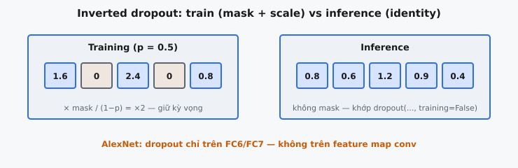

Dropout vô hiệu hóa ngẫu nhiên các neuron trong quá trình huấn luyện, buộc mạng phải học các biểu diễn dư thừa và có khả năng khái quát hóa. Được giới thiệu bởi Hinton et al. (2012) và được phổ biến bởi AlexNet (Krizhevsky, Sutskever và Hinton, 2012), nó cho phép mạng 60M tham số của AlexNet giành chiến thắng ILSVRC 2012 mà không bị overfitting nghiêm trọng.

## Nó là gì / Nó làm gì

Ở mỗi vòng lặp huấn luyện, mọi neuron trong một lớp có bật dropout có xác suất $p$ bị "dropped out" (đầu ra được đặt thành 0). Các neuron còn sống sót (xác suất $1 - p$) gánh toàn bộ tải. Một tập con ngẫu nhiên khác nhau sẽ hoạt động ở mỗi bước.

Dropout ngăn overfitting bằng cách phá vỡ sự đồng thích nghi giữa các neuron. Mỗi neuron phải học các đặc trưng hữu ích một cách độc lập thay vì dựa vào các đối tác cụ thể, tạo ra các biểu diễn ổn định hơn.

Trong quá trình inference, dropout bị vô hiệu hóa và tất cả neuron đều hoạt động. Với inverted dropout (chuẩn hiện đại), không cần scaling ở thời điểm kiểm thử.

::: {#fig-alexnet-dropout fig-cap="Inverted dropout $p=0.5$: train nhân mask và chia $(1-p)$ (ô giữ lại $0.8\\to1.6$); inference giữ nguyên. AlexNet chỉ dropout trên FC — khớp `dropout(..., training=...)`." fig-alt="Hai panel: training với ô zero và giá trị đã scale, inference đầy đủ không scale."}
{fig-align="center"}
:::

## Các phương trình chính

### Chế độ huấn luyện (Inverted Dropout)

Đối với một lớp có vectơ đầu vào $\mathbf{h}$, lấy mẫu một binary mask:

$$
m_i \sim \text{Bernoulli}(1 - p)
$$

Mỗi $m_i$ bằng 1 với xác suất $(1 - p)$ và bằng 0 với xác suất $p$. Áp dụng mask và scale:

$$
\tilde{\mathbf{h}} = \frac{\mathbf{m} \odot \mathbf{h}}{1 - p}
$$

trong đó $\odot$ là tích element-wise (Hadamard).

### Chế độ inference

Không áp dụng dropout; đầu ra là ánh xạ đồng nhất:

$$
\tilde{\mathbf{h}} = \mathbf{h}
$$

### Chứng minh kỳ vọng (Inverted Scaling bảo toàn kỳ vọng)

$$
\mathbb{E}[\tilde{h}_i] = \mathbb{E}\left[\frac{m_i \cdot h_i}{1 - p}\right] = \frac{h_i}{1 - p} \cdot \mathbb{E}[m_i]
$$

Vì $m_i \sim \text{Bernoulli}(1 - p)$, $\mathbb{E}[m_i] = 1 - p$:

$$
\mathbb{E}[\tilde{h}_i] = \frac{h_i}{1 - p} \cdot (1 - p) = h_i
$$

Đầu ra kỳ vọng trong huấn luyện bằng với đầu ra inference. Không cần chỉnh sửa ở thời điểm kiểm thử.

## Cơ chế / Cách nó hoạt động

### Giai đoạn huấn luyện (Từng bước)

* **Bước 1 -- Tạo Mask:** Lấy mẫu $n$ giá trị độc lập từ $\text{Bernoulli}(1 - p)$, tạo ra vectơ nhị phân $\mathbf{m} \in {0, 1}^n$.
* **Bước 2 -- Áp dụng Mask:** Nhân $\mathbf{h} \odot \mathbf{m}$ theo từng phần tử. Các neuron bị dropped xuất ra 0 và không nhận cập nhật gradient.
* **Bước 3 -- Scale:** Chia cho $(1 - p)$ để độ lớn kỳ vọng của đầu ra được giữ nhất quán.
* **Bước 4 -- Forward:** Đầu ra đã được scale và mask $\tilde{\mathbf{h}}$ được truyền tới lớp tiếp theo.
* **Bước 5 -- Backward:** Gradient chỉ chảy qua các neuron được giữ lại ($m_i = 1$). Các neuron bị dropped nhận gradient bằng 0.
* **Bước 6 -- Mask mới:** Một mask ngẫu nhiên mới được tạo ở mỗi vòng lặp, đảm bảo tất cả trọng số đều được huấn luyện theo thời gian.

### Giai đoạn inference

Dropout bị vô hiệu hóa hoàn toàn. Tất cả neuron tham gia mà không có masking hoặc scaling. Inverted dropout đã hiệu chỉnh scale trong quá trình huấn luyện, vì vậy inference khớp với một mạng tiêu chuẩn.

### Tóm tắt huấn luyện so với inference

* **Huấn luyện:** Mask ngẫu nhiên ở mỗi vòng lặp, activation được đưa về 0 và scale bởi $\frac{1}{1-p}$, gradient chỉ đi qua các neuron còn sống sót.
* **Inference:** Không mask, không scaling, tất cả neuron hoạt động.
* **Quan trọng:** Mô hình phải được chuyển rõ ràng giữa chế độ train/eval. Quên điều này là một trong những lỗi dropout phổ biến nhất.

## Bối cảnh bài báo / Các quyết định thiết kế

AlexNet (Krizhevsky, Sutskever và Hinton, 2012) chứa ~60M tham số trên năm lớp conv và ba lớp FC, được huấn luyện trên ~1.2M ảnh. Overfitting là một mối lo nghiêm trọng ở quy mô này.

### Tại sao họ sử dụng Dropout

Các tác giả phát biểu: "Without dropout, our network exhibits substantial overfitting. Dropout roughly doubles the number of iterations required to converge." Ngay cả với data augmentation và weight decay, mạng vẫn không thể khái quát hóa nếu không có nó.

### Dropout được áp dụng ở đâu

Chỉ áp dụng cho FC6 và FC7, vốn chứa >53M trong tổng số 60M tham số (FC6: ~37M, FC7: ~16M). Các lớp conv có ít tham số hơn nhiều nhờ chia sẻ trọng số và ít dễ bị overfitting hơn.

### Dropout Rate

$p = 0.5$, khiến mỗi neuron có 50% khả năng bị đưa về 0. Điều này tối đa hóa số subnetwork có thể có ($\binom{n}{n/2}$ là cực đại) và vẫn là mặc định phổ biến cho lớp FC.

### Đánh đổi về hội tụ

Dropout gần như làm tăng gấp đôi số vòng lặp huấn luyện vì mỗi neuron nhận cập nhật ~50% thời gian. Mặc dù vậy, AlexNet đạt top-5 error 15.3% so với 26.2% của mô hình về nhì.

### Các regularization khác trong AlexNet

AlexNet cũng sử dụng data augmentation (random crops, flips, PCA color jitter) và L2 weight decay (0.0005). Ngay cả với cả hai, mạng vẫn overfit nếu không có dropout.

## Tại sao Dropout hoạt động như Regularization

### Diễn giải Ensemble

Một lớp có $n$ neuron ngầm định nghĩa $2^n$ subnetwork. Mỗi mini-batch huấn luyện một subnetwork khác nhau. Khi inference, việc sử dụng tất cả neuron xấp xỉ trung bình hình học của dự đoán từ tất cả các subnetwork. Với FC6 (4096 neuron), đây là $2^{4096}$ subnetwork ngầm định.

### Ngăn chặn Co-adaptation

Không có dropout, các neuron hình thành những phụ thuộc đồng thích nghi mong manh, khớp với các artifact trong huấn luyện nhưng không khái quát hóa tốt. Việc làm cho sự hiện diện của mỗi neuron trở nên không đáng tin cậy buộc các đặc trưng phải hữu ích riêng lẻ và tạo ra các biểu diễn phân tán.

### Liên hệ với Bayesian Model Averaging

Gal và Ghahramani (2016) cho thấy dropout trước mỗi lớp trọng số xấp xỉ một deep Gaussian process. Test-time dropout (Monte Carlo dropout) xấp xỉ Bayesian inference. Inference tiêu chuẩn sử dụng trung bình của posterior xấp xỉ này.

### Thêm Noise như Regularization

Dropout đưa vào nhiễu Bernoulli nhân, tỉ lệ với độ lớn activation, cung cấp regularization thích ứng theo tín hiệu, khác với nhiễu Gaussian cộng.

### So sánh với các Regularization khác

* **L2 Weight Decay:** Tất định, tác động lên trọng số, khuyến khích trọng số nhỏ. Dropout là ngẫu nhiên, tác động lên activation, khuyến khích tính dư thừa. Bổ trợ cho nhau; AlexNet sử dụng cả hai.
* **Data Augmentation:** Tăng kích thước tập dữ liệu hiệu dụng; phụ thuộc miền. Dropout ở cấp kiến trúc, không phụ thuộc miền. Bổ trợ cho nhau.
* **Batch Normalization:** (Ioffe và Szegedy, 2015) Chuẩn hóa bằng thống kê mini-batch với regularization ngầm định. Có thể làm giảm nhu cầu dùng dropout.
* **Early Stopping:** Giới hạn dung lượng bằng cách hạn chế quỹ đạo tối ưu hóa. Dropout cho phép huấn luyện đầy đủ trong khi vẫn ràng buộc các biểu diễn.

## Standard Dropout so với Inverted Dropout

### Standard (Vanilla) Dropout

Công thức gốc áp dụng mask mà không scaling trong quá trình huấn luyện:

$$
\tilde{h}_i^{\text{train}} = m_i \cdot h_i \quad \text{where } m_i \sim \text{Bernoulli}(1-p)
$$

Để bù lại, activation được scale xuống ở thời điểm kiểm thử:

$$
\tilde{h}_i^{\text{test}} = (1 - p) \cdot h_i
$$

### Inverted Dropout

Chuyển scaling sang thời điểm huấn luyện:

$$
\tilde{h}_i^{\text{train}} = \frac{m_i \cdot h_i}{1 - p}
$$

Inference không cần scaling: $\tilde{h}_i^{\text{test}} = h_i$.

### Chứng minh tương đương toán học

Standard dropout -- đầu ra kỳ vọng trong huấn luyện:

$$
\mathbb{E}[\tilde{h}_i^{\text{train}}] = h_i \cdot (1-p) = \tilde{h}_i^{\text{test}}
$$

Inverted dropout -- đầu ra kỳ vọng trong huấn luyện:

$$
\mathbb{E}\left[\frac{m_i \cdot h_i}{1-p}\right] = \frac{h_i(1-p)}{1-p} = h_i = \tilde{h}_i^{\text{test}}
$$

Cả hai là tương đương. Các trọng số downstream hấp thụ các quy ước scaling khác nhau.

### Tại sao Inverted Dropout được ưu tiên

* **Không cần chỉnh sửa ở thời điểm kiểm thử:** Triển khai nguyên trạng mà không cần biết cấu hình dropout.
* **Linh hoạt:** Thay đổi dropout rate trong quá trình huấn luyện không ảnh hưởng đến code inference.
* **Mặc định của framework:** PyTorch `nn.Dropout(p)` và TensorFlow `tf.nn.dropout` đều sử dụng inverted dropout.
* **Tương thích checkpoint:** Các mô hình đã lưu có thể được load để inference mà không cần biết dropout rate trong huấn luyện.

## Ví dụ số

### Thiết lập

Lớp FC với 8 neuron, $p = 0.5$ (giống AlexNet). Activation đầu vào:

$$
\mathbf{h} = [0.8, ; -0.3, ; 1.5, ; 0.0, ; -1.2, ; 0.6, ; 2.1, ; -0.9]
$$

### Chế độ huấn luyện (Từng bước)

**Bước 1 -- Tạo mask** từ $\text{Bernoulli}(0.5)$:

$$
\mathbf{m} = [1, ; 0, ; 1, ; 0, ; 1, ; 0, ; 1, ; 0]
$$

Các neuron ở chỉ số 0, 2, 4, 6 sống sót; các chỉ số 1, 3, 5, 7 bị dropped.

**Bước 2 -- Áp dụng mask** theo từng phần tử:

$$
\mathbf{m} \odot \mathbf{h} = [0.8, ; 0.0, ; 1.5, ; 0.0, ; -1.2, ; 0.0, ; 2.1, ; 0.0]
$$

**Bước 3 -- Scale** bởi $\frac{1}{1-p} = 2$:

$$
\tilde{\mathbf{h}} = [1.6, ; 0.0, ; 3.0, ; 0.0, ; -2.4, ; 0.0, ; 4.2, ; 0.0]
$$

**Kiểm chứng:** Tổng ban đầu = 3.6. Hiện thực này = 6.4, nhưng qua nhiều hiện thực, tổng kỳ vọng là 3.6.

### Chế độ inference (Cùng đầu vào)

$$
\tilde{\mathbf{h}} = \mathbf{h} = [0.8, ; -0.3, ; 1.5, ; 0.0, ; -1.2, ; 0.6, ; 2.1, ; -0.9]
$$

Tất cả 8 neuron hoạt động, không mask, không scaling. Tổng = 3.6, khớp với tổng kỳ vọng trong huấn luyện.

### Đối chiếu với Standard Dropout trên cùng đầu vào

Huấn luyện với standard dropout (không scaling): $[0.8, 0.0, 1.5, 0.0, -1.2, 0.0, 2.1, 0.0]$.

Inference scale bởi $0.5$: $[0.4, -0.15, 0.75, 0.0, -0.6, 0.3, 1.05, -0.45]$.

Các mạng tương đương; inverted dropout giữ inference gọn gàng.

## Các biến thể và bối cảnh hiện đại

### DropConnect (Wan et al., 2013)

Đưa các trọng số riêng lẻ về 0 thay vì activation: $\mathbf{y} = (\mathbf{M} \odot \mathbf{W})\mathbf{x}$. Một tổng quát hóa chặt chẽ của dropout (dropout = toàn bộ cột bị đưa về 0 trong $\mathbf{M}$). Mịn hơn nhưng tốn kém hơn.

### Spatial Dropout (Tompson et al., 2015)

Drop toàn bộ feature map (channel) thay vì các phần tử riêng lẻ. Dropout element-wise tiêu chuẩn không hiệu quả đối với các lớp conv vì các phần tử lân cận trong không gian chia sẻ receptive field chồng lấp và có thể tái tạo các phần tử lân cận bị dropped.

### DropBlock (Ghiasi et al., 2018)

Drop các vùng hình chữ nhật liên tục trên tất cả channel. Hiệu quả hơn dropout tiêu chuẩn cho detection và segmentation, nơi cấu trúc không gian quan trọng.

### Dropout trong Transformers

Transformer (Vaswani et al., 2017) sử dụng dropout ở nhiều vị trí:

* **Attention Dropout:** Trên trọng số attention sau softmax, buộc mô hình không phụ thuộc quá mức vào các quan hệ token đơn lẻ.
* **Residual Dropout:** Trên đầu ra sub-layer trước phép cộng residual.
* **Feed-Forward Dropout:** Giữa hai lớp tuyến tính trong khối FFN.

Các rate điển hình là 0.1-0.2. Các mô hình rất lớn (GPT-3+) giảm hoặc loại bỏ dropout, dựa vào dữ liệu khổng lồ để regularization ngầm định.

### Các mẫu sử dụng hiện đại

Đối với CNN, batch normalization phần lớn đã thay thế dropout. Đối với Transformers, dropout vẫn là tiêu chuẩn ở các rate thấp. Các biến thể như DropEdge tồn tại cho GNN. Nguyên lý cốt lõi của nhiễu ngẫu nhiên có cấu trúc để khái quát hóa vẫn được áp dụng rộng rãi.

## Các lỗi thường gặp

### Quên chuyển đổi giữa chế độ Train và Test

Lỗi dropout phổ biến nhất. PyTorch yêu cầu `model.train()` / `model.eval()`; TensorFlow/Keras cần cờ `training`. Dropout hoạt động trong inference tạo ra dự đoán nhiễu và không tất định. Dropout bị vô hiệu hóa trong huấn luyện loại bỏ regularization. Cả hai trường hợp vẫn tạo ra đầu ra, khiến lỗi này khó phát hiện.

### Áp dụng Dropout cho các lớp tích chập một cách ngây thơ

Dropout element-wise trên conv feature map không hiệu quả vì các phần tử lân cận trong không gian có thể tái tạo các phần tử bị dropped. Thay vào đó, dùng Spatial Dropout hoặc DropBlock. AlexNet chỉ áp dụng dropout cho các lớp FC vì lý do này.

### Sai hệ số Scaling

Inverted scaling đúng là $\frac{1}{1-p}$, không phải $\frac{1}{p}$. Với $p=0.5$, cả hai đều bằng 2, che giấu lỗi. Với $p=0.3$: đúng = $\frac{1}{0.7} \approx 1.43$, sai = $\frac{1}{0.3} \approx 3.33$. Cũng cần cẩn thận: một số framework định nghĩa $p$ là keep probability, số khác định nghĩa là drop probability.

### Dropout Rate quá cao

Ở $p = 0.9$, chỉ 10% neuron sống sót với scaling 10 lần, gây nhiễu gradient cực lớn. Mặc định: $p = 0.5$ cho các lớp FC, $p = 0.2$-$0.3$ gần đầu vào, $p = 0.1$ cho Transformers. Nếu cả hiệu năng train và val đều kém, $p$ có thể quá cao.

### Tương tác với Batch Normalization

Scaling $\frac{1}{1-p}$ của dropout làm dịch phương sai activation. BN ghi nhận các thống kê đã bị dịch này trong huấn luyện, nhưng ở thời điểm kiểm thử dropout bị tắt, tạo ra sự không khớp "variance shift". Giải pháp: đặt dropout sau BN, giảm dropout rate, hoặc bỏ hẳn dropout khi dùng BN.

### Dropout với tập dữ liệu nhỏ

Với dữ liệu rất hạn chế, nhiễu dropout có thể lấn át tín hiệu huấn luyện yếu. Data augmentation, transfer learning hoặc các phương pháp Bayesian có thể hiệu quả hơn.

### Dropout trong quá trình Fine-tuning

Dropout rate tối ưu cho fine-tuning thường khác với pretraining. Các tập dữ liệu nhỏ có thể cần $p$ cao hơn; các đặc trưng đã khớp tốt có thể cần $p$ thấp hơn. Hãy xem nó như một siêu tham số.

## Code
```python
import numpy as np

def dropout(x: np.ndarray, p: float = 0.5, training: bool = True, mask: np.ndarray = None) -> np.ndarray:
    """Apply inverted dropout. If mask is provided, use it; otherwise generate one."""
    if not training:
        return x
    if mask is None:
        mask = np.random.binomial(1, 1 - p, size=x.shape)
    else:
        mask = np.array(mask)
    if p == 0:
        return x * mask
    return x * mask / (1 - p)


```