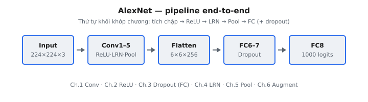

AlexNet (Krizhevsky, Sutskever và Hinton, 2012) là mạng nơ-ron tích chập mang tính đột phá đã giành chiến thắng ImageNet LSVRC-2012 với cách biệt lớn và khởi đầu kỷ nguyên Deep Learning hiện đại trong thị giác máy tính. Đóng góp cốt lõi của nó không phải là một toán tử mới đơn lẻ, mà là một thiết kế hệ thống thực tiễn kết hợp các chồng tích chập sâu hơn, hàm kích hoạt ReLU, tăng cường dữ liệu mạnh, regularization bằng dropout và huấn luyện trên GPU vào một mô hình dung lượng cao có thể huấn luyện được.

Ở mức khái quát, AlexNet ánh xạ một ảnh đầu vào thành xác suất lớp thông qua năm giai đoạn tích chập, tiếp theo là ba lớp fully connected. Các lớp đầu học các mẫu mức thấp (cạnh, tương phản màu, kết cấu), các lớp giữa hợp thành các bộ phận của đối tượng, và các lớp sâu hơn mã hóa ngữ nghĩa có tính phân biệt lớp. Hệ phân cấp này là nền tảng mà các họ CNN sau này (VGG, ResNet, EfficientNet) tinh chỉnh.

::: {#fig-alexnet-pipeline fig-cap="Pipeline AlexNet: Input $224\\times224\\times3$ → Conv1–5 (ReLU / LRN / Pool) → Flatten $6\\times6\\times256$ → FC (+ dropout) → 1000 logits." fig-alt="Sơ đồ khối ngang: Input, Conv1-5, Flatten, FC6-7 Dropout, FC8 logits."}
{fig-align="center"}
:::

## Phần này bao gồm những gì

Chuỗi chương này phân rã AlexNet thành các thành phần kỹ thuật chính:

1. Trích xuất đặc trưng tích chập và các chuyển đổi shape không gian.
2. Tính phi tuyến của hàm kích hoạt và lý do ReLU cho phép tối ưu hóa nhanh.
3. Dropout như một regularization cho các lớp fully connected lớn.
4. Local response normalization trong bối cảnh thiết kế ban đầu.
5. Max pooling và downsampling có kiểm soát.
6. Tăng cường dữ liệu để khái quát hóa trên huấn luyện quy mô ImageNet.

Mục tiêu cuối cùng là hiểu tại sao AlexNet hoạt động hiệu quả vào năm 2012, những ý tưởng nào vẫn còn thiết yếu, và những lựa chọn thiết kế nào sau đó đã được thay thế bằng các kỹ thuật mạnh hơn.

## Tại sao AlexNet vẫn quan trọng

Mặc dù kiến trúc này hiện đã cũ về mặt lịch sử, AlexNet vẫn quan trọng về mặt sư phạm vì nó giới thiệu các nguyên lý thiết kế CNN lặp lại nhiều lần:

* hệ phân cấp đặc trưng theo chiều sâu,
* đánh đổi giữa tính toán và độ chính xác thông qua stride và pooling,
* kiểm soát overfitting trong các mạng có dung lượng lớn,
* và các ràng buộc ở cấp hệ thống (bộ nhớ GPU, thông lượng huấn luyện) định hình các quyết định kiến trúc.

Đọc AlexNet trước cung cấp baseline phù hợp trước khi chuyển sang VGG và ResNet.

## Kiến thức tiên quyết

* Đại số tuyến tính cơ bản (vectơ, ma trận, shape tensor).
* Các khái niệm cốt lõi về mạng nơ-ron (forward pass, lan truyền ngược, hạ gradient).
* Cơ bản về tích chập (kernel, stride, padding, channel).
* Thiết lập bài toán phân loại (logit, softmax, hàm mất mát cross-entropy).

## Ký hiệu được sử dụng trong phần này

$$
\begin{aligned}
x &:\ \text{tensor ảnh đầu vào}, \\
H, W, C &:\ \text{chiều cao, chiều rộng và channel}, \\
k, s, p &:\ \text{kích thước kernel, stride và padding}, \\
F &:\ \text{số lượng bộ lọc tích chập}, \\
y &:\ \text{logit của mô hình hoặc xác suất lớp được dự đoán}.
\end{aligned}
$$
