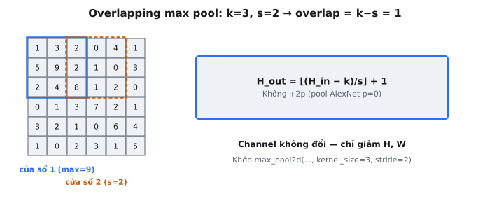

Pooling là một phép toán downsampling trong CNN, làm giảm các chiều không gian của feature map bằng cách tóm tắt các vùng cục bộ thành các giá trị đơn lẻ. Trong AlexNet (Krizhevsky, Sutskever và Hinton, 2012), overlapping max pooling là một lựa chọn kiến trúc có chủ đích, góp phần vào top-5 error mang tính cột mốc 15.3% của mạng trên ILSVRC-2012.

## Pooling làm gì

Pooling trượt một cửa sổ có kích thước cố định trên một feature map đầu vào và tính một giá trị tóm tắt duy nhất tại mỗi vị trí, tạo ra một đầu ra nhỏ hơn, giữ lại thông tin quan trọng nhất trong khi loại bỏ chi tiết không gian mức mịn.

Các mục đích chính:

* **Downsampling không gian:** Giảm chiều cao và chiều rộng, làm giảm số activation cho các lớp tiếp theo. Trong AlexNet, pooling giảm kích thước từ 55x55 xuống 6x6.
* **Bất biến tịnh tiến:** Các dịch chuyển nhỏ trong không gian tạo ra đầu ra pooled tương tự, giúp khái quát hóa.
* **Giảm chi phí tính toán:** Feature map nhỏ hơn nghĩa là ít phép toán hơn ở các lớp tiếp theo.
* **Kiểm soát overfitting:** Tóm tắt các vùng cục bộ hoạt động như regularization. Bài báo AlexNet lưu ý rằng overlapping pooling khiến mô hình "slightly more difficult to overfit."

Pooling hoạt động độc lập trên từng channel, vì vậy số lượng channel không thay đổi. Chỉ các chiều không gian (chiều cao và chiều rộng) bị giảm.

::: {#fig-alexnet-pool fig-cap="Overlapping max pool $k=3$, $s=2$: hai cửa sổ chồng 1 pixel ($k-s=1$). $H_{out}=\\lfloor(H_{in}-k)/s\\rfloor+1$ (không $+2p$); channel không đổi — khớp `max_pool2d`." fig-alt="Lưới số 6x6 với hai khung cửa sổ chồng và công thức H_out."}
{fig-align="center"}
:::

## Max Pooling so với Average Pooling

### Max Pooling

Chọn giá trị lớn nhất từ mỗi cửa sổ $k \times k$:

$$
y_{i,j} = \max_{0 \leq m < k, ; 0 \leq n < k} x_{i+m, ; j+n}
$$

Trong quá trình lan truyền ngược, gradient chỉ chảy tới vị trí giữ giá trị lớn nhất; tất cả vị trí còn lại nhận gradient bằng 0.

### Average Pooling

Tính trung bình cộng của tất cả các giá trị trong mỗi cửa sổ:

$$
y_{i,j} = \frac{1}{k^2} \sum_{m=0}^{k-1} \sum_{n=0}^{k-1} x_{i+m, ; j+n}
$$

Phân phối gradient đều cho tất cả các vị trí trong quá trình lan truyền ngược.

### Tại sao AlexNet sử dụng Max Pooling

* **Giữ lại các activation mạnh nhất:** Sau ReLU, tín hiệu giàu thông tin nhất là độ lớn của activation mạnh nhất. Average pooling làm loãng tín hiệu này bằng cách trộn với các activation yếu hơn hoặc bằng 0.
* **Dòng gradient tốt hơn:** Gradient chỉ chảy qua vị trí max, củng cố các đặc trưng có tính phân biệt nhất.
* **Ổn định với activation thưa:** Sau ReLU, nhiều activation bằng 0. Max pooling bỏ qua các giá trị 0; average pooling bị kéo xuống bởi chúng.
* **Hiệu năng thực nghiệm:** Max pooling liên tục vượt trội hơn average pooling trên các benchmark phân loại ảnh của thời kỳ đó.

## Các phương trình chính

### Công thức kích thước đầu ra

Với kích thước đầu vào $H_{in} \times W_{in}$, kích thước kernel $k$, và stride $s$ không có padding:

$$
H_{out} = \left\lfloor \frac{H_{in} - k}{s} \right\rfloor + 1
$$

$$
W_{out} = \left\lfloor \frac{W_{in} - k}{s} \right\rfloor + 1
$$

Pooling trong AlexNet luôn sử dụng $p = 0$. Công thức tích chập có thêm hạng tử $+2p$ ở tử số; đừng nhầm lẫn hai công thức này.

### Phép toán Max Pooling

Với đầu vào $X$ có $C$ channel, đầu ra tại vị trí $(i, j)$ cho channel $c$:

$$
Y(c, i, j) = \max_{0 \leq m < k, ; 0 \leq n < k} X(c, ; i \cdot s + m, ; j \cdot s + n)
$$

Chỉ số channel $c$ giống nhau ở đầu vào và đầu ra vì pooling hoạt động độc lập trên từng channel.

### Shape đầu ra đầy đủ

Đầu vào $(N, C, H_{in}, W_{in})$ tạo ra đầu ra:

$$
(N, ; C, ; H_{out}, ; W_{out})
$$

Batch size $N$ và số lượng channel $C$ không thay đổi. Chỉ các chiều không gian $H$ và $W$ bị giảm -- một điểm khác biệt quan trọng so với các lớp tích chập, vốn có thể thay đổi số lượng channel thông qua số bộ lọc.

## Overlapping Pooling so với Non-Overlapping Pooling

### Non-Overlapping Pooling

Khi $s = k$, các cửa sổ liền kề lát kín đầu vào mà không chia sẻ pixel. Phổ biến: $k = 2, s = 2$ (giảm một nửa kích thước). Mỗi pixel đầu vào đóng góp vào đúng một giá trị đầu ra.

### Overlapping Pooling

Khi $s < k$, các cửa sổ liền kề chia sẻ pixel. Độ chồng lấp là $k - s$ pixel dọc theo mỗi trục. AlexNet sử dụng $k = 3, s = 2$, tạo ra 1 pixel chồng lấp.

Ví dụ 1D với đầu vào $[0, 1, 2, 3, 4]$, $k=3$, $s=2$:

* **Cửa sổ 1:** các vị trí $[0, 1, 2]$
* **Cửa sổ 2:** các vị trí $[2, 3, 4]$

Vị trí 2 được chia sẻ -- đây là pixel chồng lấp.

### Tại sao Overlapping Pooling hữu ích

Các pixel được chia sẻ tạo ra sự dư thừa thông tin, hoạt động như một regularizer nhẹ, tạo ra biểu diễn mượt hơn và khiến việc ghi nhớ chính xác các cấu hình không gian trở nên khó hơn.

Nó cũng cung cấp downsampling nhẹ hơn: $k=3, s=3$ biến 27x27 thành 9x9, trong khi $k=3, s=2$ tạo ra 13x13, giữ lại nhiều độ phân giải không gian hơn.

## Bối cảnh bài báo và các quyết định thiết kế

### Bài báo nói gì

Krizhevsky et al. (2012) phát biểu: "We generally observe that models with overlapping pooling find it slightly more difficult to overfit." Điều này có ý nghĩa vì overfitting là một mối lo lớn đối với AlexNet có ~60 triệu tham số, được huấn luyện chỉ trên 1.2 triệu ảnh.

### Mức giảm lỗi đo được

Chuyển từ non-overlapping ($k=2, s=2$) sang overlapping ($k=3, s=2$) làm giảm top-1 error 0.4% và top-5 error 0.3%. Những phần trăm nhỏ này rất quan trọng trong ILSVRC, nơi các mô hình đứng đầu cách nhau chưa đến 1%.

### Pooling được áp dụng ở đâu trong AlexNet

Pooling được áp dụng có chọn lọc, không phải sau mọi lớp conv:

* **Sau Conv1:** Áp dụng Pool1
* **Sau Conv2:** Áp dụng Pool2
* **Sau Conv3:** Không pooling
* **Sau Conv4:** Không pooling
* **Sau Conv5:** Áp dụng Pool5

Pooling bị bỏ qua sau Conv3/Conv4 vì các chiều không gian đã nhỏ (13x13); pooling thêm nữa sẽ làm co feature map quá mạnh.

### Vai trò Regularization

Overlapping pooling là một trong nhiều kỹ thuật regularization trong AlexNet, bên cạnh data augmentation (random crops, flips, PCA color augmentation) và dropout trong các lớp FC. Mỗi kỹ thuật đóng góp một cải thiện nhỏ nhưng có tính cộng dồn.

## Pooling nằm ở đâu trong pipeline AlexNet

Mỗi khối tích chập tuân theo: **Conv -> ReLU -> (LRN tùy chọn) -> (Pool tùy chọn)**. LRN được áp dụng sau Conv1 và Conv2; pooling sau Conv1, Conv2 và Conv5.

### Truy vết đầy đủ kích thước không gian

Tất cả các lớp pooling sử dụng $k = 3, s = 2$.

**Đầu vào:** $224 \times 224 \times 3$

**Conv1:** 96 bộ lọc, $11 \times 11$, stride 4, không padding.

$$
H_{out} = \left\lfloor \frac{224 - 11}{4} \right\rfloor + 1 = 54
$$

Một số implementation sử dụng 227x227 để thu được đúng 55x55. Theo quy ước của bài báo: $55 \times 55 \times 96$.

**Pool1:** $k = 3, s = 2$

$$
H_{out} = \left\lfloor \frac{55 - 3}{2} \right\rfloor + 1 = 27
$$

**Sau Pool1:** $27 \times 27 \times 96$

**Conv2:** 256 bộ lọc, $5 \times 5$, stride 1, padding 2. Đầu ra: $27 \times 27 \times 256$

**Pool2:** $k = 3, s = 2$

$$
H_{out} = \left\lfloor \frac{27 - 3}{2} \right\rfloor + 1 = 13
$$

**Sau Pool2:** $13 \times 13 \times 256$

**Conv3:** 384 bộ lọc, $3 \times 3$, stride 1, padding 1. Đầu ra: $13 \times 13 \times 384$ (không pooling)

**Conv4:** 384 bộ lọc, $3 \times 3$, stride 1, padding 1. Đầu ra: $13 \times 13 \times 384$ (không pooling)

**Conv5:** 256 bộ lọc, $3 \times 3$, stride 1, padding 1. Đầu ra: $13 \times 13 \times 256$

**Pool5:** $k = 3, s = 2$

$$
H_{out} = \left\lfloor \frac{13 - 3}{2} \right\rfloor + 1 = 6
$$

**Sau Pool5:** $6 \times 6 \times 256$

Được flatten thành $6 \times 6 \times 256 = 9216$, đưa vào FC6 (4096) -> FC7 (4096) -> FC8 (1000 lớp) với softmax.

## Ví dụ số

Overlapping max pooling với $k = 3, s = 2$ trên một feature map đơn channel kích thước 5x5.

### Feature Map đầu vào (5x5)

$$
X =
\begin{bmatrix}
1 & 3 & 2 & 7 & 4 \\
5 & 6 & 8 & 1 & 3 \\
2 & 9 & 4 & 6 & 5 \\
3 & 1 & 7 & 2 & 8 \\
4 & 5 & 3 & 9 & 1
\end{bmatrix}
$$

### Kích thước đầu ra

$$
H_{out} = \left\lfloor \frac{5 - 3}{2} \right\rfloor + 1 = 2
$$

Đầu ra là $2 \times 2$ với 4 cửa sổ pooling.

### Vị trí cửa sổ và nội dung của chúng

**Cửa sổ (0, 0):** hàng 0-2, cột 0-2

$$
W_{0,0} =
\begin{bmatrix}
1 & 3 & 2 \\
5 & 6 & 8 \\
2 & 9 & 4
\end{bmatrix}
$$

$\max(W_{0,0}) = 9$

**Cửa sổ (0, 1):** hàng 0-2, cột 2-4

$$
W_{0,1} =
\begin{bmatrix}
2 & 7 & 4 \\
8 & 1 & 3 \\
4 & 6 & 5
\end{bmatrix}
$$

$\max(W_{0,1}) = 8$

**Cửa sổ (1, 0):** hàng 2-4, cột 0-2

$$
W_{1,0} =
\begin{bmatrix}
2 & 9 & 4 \\
3 & 1 & 7 \\
4 & 5 & 3
\end{bmatrix}
$$

$\max(W_{1,0}) = 9$

**Cửa sổ (1, 1):** hàng 2-4, cột 2-4

$$
W_{1,1} =
\begin{bmatrix}
4 & 6 & 5 \\
7 & 2 & 8 \\
3 & 9 & 1
\end{bmatrix}
$$

$\max(W_{1,1}) = 9$

### Feature Map đầu ra (2x2)

$$
Y =
\begin{bmatrix}
9 & 8 \\
9 & 9 \\
\end{bmatrix}
$$

### Xác định các vùng chồng lấp

* **Chồng lấp ngang (0,0)-(0,1):** Cột 2 (hàng 0-2), các giá trị $(0,2)=2$, $(1,2)=8$, $(2,2)=4$ được chia sẻ.
* **Chồng lấp dọc (0,0)-(1,0):** Hàng 2 (cột 0-2), các giá trị $(2,0)=2$, $(2,1)=9$, $(2,2)=4$ được chia sẻ.
* **Chồng lấp ngang (1,0)-(1,1):** Cột 2 (hàng 2-4), các giá trị $(2,2)=4$, $(3,2)=7$, $(4,2)=3$ được chia sẻ.
* **Chồng lấp dọc (0,1)-(1,1):** Hàng 2 (cột 2-4), các giá trị $(2,2)=4$, $(2,3)=6$, $(2,4)=5$ được chia sẻ.
* **Chồng lấp góc:** Pixel $(2,2)=4$ được chia sẻ bởi cả bốn cửa sổ.

Với non-overlapping $k = 2, s = 2$, không pixel nào xuất hiện trong nhiều hơn một cửa sổ.

## Pooling trong các kiến trúc hiện đại

### Strided Convolutions thay thế Pooling

Springenberg et al. (2015) cho thấy max pooling có thể được thay thế bằng tích chập stride-2 mà không mất độ chính xác. ResNet (He et al., 2015) đã áp dụng điều này. Ưu điểm: downsampling trở thành có thể học được thay vì cố định.

### Global Average Pooling

Lin et al. (2014) giới thiệu GAP như một thay thế cho các lớp FC. Nó tính trung bình không gian trên mỗi channel, tạo ra một vectơ độ dài $C$ từ một feature map $C \times H \times W$. Điều này làm giảm mạnh số tham số và được GoogLeNet (Szegedy et al., 2015) cũng như ResNet áp dụng.

### Adaptive Pooling trong PyTorch

`nn.AdaptiveMaxPool2d` và `nn.AdaptiveAvgPool2d` của PyTorch cho phép bạn chỉ định kích thước đầu ra mong muốn thay vì kernel/stride. Ví dụ, `nn.AdaptiveAvgPool2d((1, 1))` triển khai GAP bất kể kích thước đầu vào.

### Tại sao Pooling ít phổ biến hơn trong các thiết kế hiện đại

* **Mất thông tin:** Max pooling loại bỏ vĩnh viễn thông tin không gian, gây hại cho các tác vụ cần chi tiết mức mịn (detection, segmentation).
* **Các thay thế có thể học được:** Strided convolutions đạt cùng mức giảm kích thước trong khi học downsampling tối ưu thông qua lan truyền ngược.
* **Đơn giản hóa kiến trúc:** Các kiến trúc hiện đại ưu tiên các building block thống nhất.
* **Cơ chế Attention:** Các mô hình thị giác dựa trên Transformer sử dụng patch merging thay vì pooling.

Bất chấp các xu hướng này, GAP trước classifier cuối cùng vẫn phổ biến, và max pooling vẫn tồn tại trong các mô hình nhẹ cho edge device.

## Các lỗi thường gặp

### Nhầm lẫn công thức đầu ra của Pooling với công thức đầu ra của Tích chập

Pooling trong AlexNet sử dụng zero padding. Công thức đúng là:

$$
H_{out} = \left\lfloor \frac{H_{in} - k}{s} \right\rfloor + 1
$$

Không thêm hạng tử $+2p$ như đối với tích chập. Lỗi này lan truyền qua mạng, gây ra không khớp kích thước.

### Quên rằng Pooling bảo toàn số lượng Channel

Pooling hoạt động trên từng channel và không thay đổi số lượng channel. Đầu vào $96 \times 27 \times 27$ với $k=3, s=2$ tạo ra $96 \times 13 \times 13$. Khác với tích chập, nơi channel đầu ra bằng số lượng bộ lọc.

### Lỗi sai lệch một đơn vị với các cửa sổ chồng lấp

Phép floor và $+1$ rất dễ bị quên. Ví dụ: $H_{in}=13, k=3, s=2$:

$$
H_{out} = \left\lfloor \frac{13 - 3}{2} \right\rfloor + 1 = 6
$$

Quên $+1$ cho kết quả 5 thay vì 6. Ngoài ra, độ rộng chồng lấp là $k - s$ pixel (1 pixel với $k=3, s=2$), không phải 2.

### Giả định Pooling có tham số học được

Max pooling và average pooling có 0 tham số học được. Khi đếm ~60M tham số của AlexNet, pooling đóng góp 0. Hành vi được cố định sau khi chọn $k$ và $s$.

### Bỏ qua việc Pooling loại bỏ vĩnh viễn thông tin không gian

Max pooling không khả nghịch -- vị trí và giá trị của các phần tử không phải max bị mất vĩnh viễn.

* **Đối với phân loại:** Chấp nhận được, vì dự đoán cuối cùng chỉ cần biết có gì trong ảnh.
* **Đối với segmentation/detection:** Có vấn đề. Các kiến trúc như U-Net và FPN sử dụng skip connections để khôi phục thông tin không gian đã bị loại bỏ.
* **Đối với unpooling:** Cần lưu các chỉ số max trong forward pass, làm tăng chi phí bộ nhớ.


## Code
```python
import numpy as np

def max_pool2d(x: np.ndarray, kernel_size: int = 3, stride: int = 2) -> np.ndarray:
    """Apply 2D max pooling (shape simulation)."""
    B, H, W, C = x.shape
    H_out = (H - kernel_size) // stride + 1
    W_out = (W - kernel_size) // stride + 1
    return np.zeros((B, H_out, W_out, C))

```