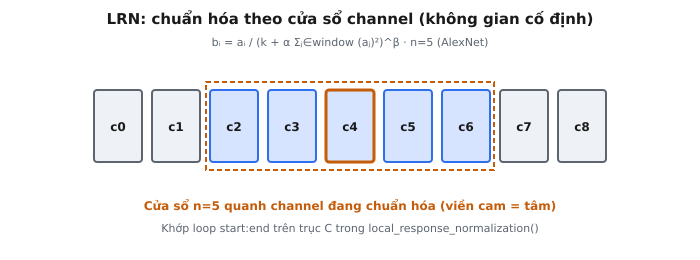

Local Response Normalization (LRN) là một kỹ thuật chuẩn hóa hoạt động trên các channel của feature map tại mỗi vị trí không gian, kìm hãm các phản hồi lớn một cách đồng đều trong khi tăng cường những phản hồi mạnh một cách riêng biệt. Nó là một thành phần then chốt của AlexNet (Krizhevsky, Sutskever và Hinton, 2012), CNN đã giành chiến thắng ILSVRC 2012 và khởi phát kỷ nguyên Deep Learning hiện đại.

## Nó là gì / Nó làm gì

LRN là một lớp chuẩn hóa không huấn luyện được, đưa cạnh tranh vào giữa các activation tại cùng một vị trí không gian nhưng trên các channel khác nhau. Nó chia mỗi activation cho một hệ số chuẩn hóa được tính từ các channel lân cận, vì vậy các channel có activation tương đối lớn sẽ giữ được độ lớn của chúng, trong khi các channel không nổi bật sẽ bị kìm hãm.

Mục đích gồm hai phần:

* **Ức chế bên:** Mượn từ khoa học thần kinh -- các neuron được kích hoạt mạnh sẽ ức chế các neuron lân cận, làm sắc nét hồ sơ phản hồi và đảm bảo chỉ những tín hiệu phù hợp nhất được truyền tiếp.
* **Chuẩn hóa tương phản cục bộ:** Chuẩn hóa mỗi activation tương đối với vùng lân cận channel của nó khuyến khích các bộ phát hiện đặc trưng đa dạng, bổ trợ nhau thay vì dư thừa.

LRN chuẩn hóa nghiêm ngặt theo chiều channel. Với một vị trí không gian $(x, y)$ cho trước, nó xét một cửa sổ các channel kề nhau được đặt tâm tại channel $i$ và tính hệ số chuẩn hóa từ các activation đó. Chính chuẩn hóa liên-channel này tạo ra ức chế bên.

Trong AlexNet, LRN được áp dụng sau ReLU. Thứ tự là: tích chập, ReLU, sau đó LRN trên các activation không âm thu được.

::: {#fig-alexnet-lrn fig-cap="LRN chuẩn hóa theo cửa sổ $n=5$ channel liền kề tại một vị trí không gian cố định — không phải lân cận không gian. Khớp vòng lặp `start:end` trên trục $C$ trong code." fig-alt="Dãy thanh channel với cửa sổ n=5 bao quanh channel trung tâm."}
{fig-align="center"}
:::

## Các phương trình chính

Gọi $a_{x,y}^i$ là activation tại vị trí không gian $(x, y)$ trong channel $i$ sau tích chập và ReLU. Đầu ra đã chuẩn hóa $b_{x,y}^i$ là:

$$
b_{x,y}^i =
\frac{
a_{x,y}^i
}{
\left(
k + \alpha
\sum_{j=\max(0,, i - n/2)}^{\min(N-1,, i + n/2)}
(a_{x,y}^j)^2
\right)^\beta
}
$$

* **$a_{x,y}^i$:** Activation đầu vào tại $(x, y)$ trong channel $i$, luôn $\geq 0$ sau ReLU.
* **$b_{x,y}^i$:** Đầu ra đã chuẩn hóa được truyền tới lớp tiếp theo.
* **$k$:** Hằng số bias ngăn chia cho 0. AlexNet sử dụng $k = 2$.
* **$\alpha$:** Hệ số scaling kiểm soát ảnh hưởng của vùng lân cận. AlexNet sử dụng $\alpha = 10^{-4}$.
* **$\beta$:** Số mũ kiểm soát tính phi tuyến của sự kìm hãm. AlexNet sử dụng $\beta = 0.75$.
* **$n$:** Kích thước vùng lân cận channel. AlexNet sử dụng $n = 5$, vì vậy $\lfloor n/2 \rfloor = 2$ channel ở mỗi phía.
* **$N$:** Tổng số channel; được dùng để cắt các cận tổng về các chỉ số hợp lệ $[0, N-1]$.

Các cận tổng chạy từ:

$$
j = \max(0, i - \lfloor n/2 \rfloor)
$$

đến:

$$
j = \min(N - 1, i + \lfloor n/2 \rfloor)
$$

Các hàm $\max$ và $\min$ xử lý các channel biên, nơi cửa sổ đầy đủ sẽ vượt quá phạm vi hợp lệ.

Mẫu số là một ước lượng năng lượng cục bộ được nâng lên lũy thừa. Khi năng lượng cục bộ cao, nghĩa là nhiều channel lân cận được kích hoạt mạnh, mẫu số tăng lên và đầu ra bị kìm hãm. Khi năng lượng cục bộ thấp, mẫu số giữ gần $k^\beta$ và activation được bảo toàn.

## Mỗi siêu tham số ảnh hưởng đến đầu ra như thế nào

### Hạng tử Bias $k$

Hạng tử bias $k$ đặt một mức chuẩn hóa nền và ngăn chia cho 0. $k$ lớn sẽ chi phối mẫu số bất kể activation, khiến LRN gần như chỉ là một phép scaling hằng:

$$
\approx \frac{a_{x,y}^i}{k^\beta}
$$

không có ức chế bên.

$k$ rất nhỏ khiến chuẩn hóa quá nhạy với ngay cả các activation lân cận nhỏ. $k = 2$ của AlexNet cung cấp một mức nền vừa phải.

### Hệ số Scaling $\alpha$

Hệ số scaling $\alpha$ kiểm soát cường độ chuẩn hóa tổng thể. $\alpha$ lớn hơn nghĩa là kìm hãm mạnh hơn; $\alpha$ nhỏ hơn làm cho lớp dễ cho qua hơn.

$\alpha = 10^{-4}$ của AlexNet được chọn rất nhỏ một cách có chủ ý để chuẩn hóa nhẹ. Nếu $\alpha \approx 1.0$, ngay cả các activation vừa phải cũng sẽ gây kìm hãm nghiêm trọng. Nếu $\alpha \approx 10^{-10}$, lớp trở thành một phép no-op.

### Số mũ $\beta$

Số mũ $\beta$ kiểm soát mức độ sự kìm hãm tăng theo năng lượng cục bộ.

Khi $\beta < 1$, như trong AlexNet với $\beta = 0.75$, chuẩn hóa là dưới tuyến tính: năng lượng tăng tạo ra mức kìm hãm biên giảm dần.

Khi $\beta > 1$, sự kìm hãm trở thành siêu tuyến tính và có thể tạo ra động lực winner-take-all. Lựa chọn dưới tuyến tính đảm bảo gradient vẫn có thể chảy qua các channel bị kìm hãm.

### Kích thước vùng lân cận $n$

Kích thước vùng lân cận $n$ kiểm soát số lượng channel kề nhau cạnh tranh. AlexNet sử dụng $n = 5$, nghĩa là mỗi channel cạnh tranh với tối đa hai channel ở mỗi phía.

$n$ nhỏ tạo ra cạnh tranh rất cục bộ. $n$ lớn làm cho chuẩn hóa mang tính toàn cục hơn trên các channel và có thể kìm hãm quá rộng.

## Bối cảnh AlexNet

Các siêu tham số LRN được sử dụng trong AlexNet là:

$$
k = 2,\quad n = 5,\quad \alpha = 10^{-4},\quad \beta = 0.75
$$

Các giá trị này được tinh chỉnh thực nghiệm trên tập validation, không được suy ra từ lý thuyết.

Bài báo báo cáo: "Response normalization reduces our top-1 and top-5 error rates by 1.4% and 1.2%, respectively." Sự cải thiện này có ý nghĩa trong bối cảnh cạnh tranh của ILSVRC, đạt được mà không có tham số huấn luyện được và chỉ thêm chi phí tính toán tối thiểu.

LRN chỉ được áp dụng sau hai lớp tích chập đầu tiên, có khả năng vì các lớp đầu phát hiện các đặc trưng mức thấp như cạnh và kết cấu được hưởng lợi nhiều nhất từ ức chế bên để phát triển các bộ phát hiện đặc trưng đa dạng.

## Động lực sinh học: Ức chế bên

LRN lấy cảm hứng từ ức chế bên trong các mạch thần kinh sinh học. Trong vỏ thị giác, các neuron được kích hoạt mạnh sẽ ức chế các neuron lân cận thông qua các kết nối synapse ức chế, làm sắc nét tương phản và tăng cường phát hiện cạnh cũng như ranh giới.

Một ví dụ kinh điển là võng mạc, nơi các tế bào ngang và amacrine tạo ra các kết nối ức chế sinh ra các receptive field dạng center-surround. Điều này đã được Hartline và Ratliff nghiên cứu rộng rãi trong những năm 1950-60 bằng mắt cua móng ngựa (*Limulus*).

Trong CNN, LRN triển khai điều này dọc theo chiều channel. Mỗi channel là một bộ phát hiện đặc trưng; một channel được kích hoạt mạnh sẽ kìm hãm các channel lân cận, làm giảm dư thừa và khuyến khích các bộ phát hiện đa dạng.

Lợi ích của sự cạnh tranh này bao gồm:

* **Regularization ngầm định:** Kìm hãm các activation dư thừa làm giảm dung lượng hiệu dụng và hạn chế overfitting.
* **Biểu diễn thưa:** Ít channel được kích hoạt mạnh tại mỗi vị trí, khiến các biểu diễn ổn định hơn cho xử lý downstream.
* **Soft winner-take-all:** Các đặc trưng mạnh nhất chiếm ưu thế trong khi các đặc trưng yếu hơn bị kìm hãm.

Phép tương tự này không hoàn hảo: ức chế bên sinh học sử dụng các synapse ức chế thích nghi, trong khi LRN dùng một công thức cố định không có học. Hạn chế này là một lý do khiến LRN bị thay thế bởi Batch Normalization, vốn có các tham số học được.

## Ví dụ số

Xét $N = 5$ channel tại một vị trí không gian duy nhất với các activation sau ReLU:

* **Channel 0:** $1.0$
* **Channel 1:** $2.0$
* **Channel 2:** $3.0$
* **Channel 3:** $0.5$
* **Channel 4:** $-1.0$

Sử dụng $k = 2$, $n = 5$, $\alpha = 10^{-4}$ và $\beta = 0.75$, mỗi channel được chia cho:

$$
(k + \alpha \cdot \text{tổng bình phương các lân cận})^\beta
$$

Vì $\alpha$ rất nhỏ, tổng bình phương activation chỉ làm nhiễu mẫu số rất nhẹ so với $k$. Mẫu số gần với:

$$
2^{0.75} \approx 1.68
$$

vì vậy các activation được scale xấp xỉ bởi:

$$
\frac{1}{2^{0.75}} \approx 0.5946
$$

Hiệu ứng ức chế bên là tinh tế nhưng tích lũy trong quá trình huấn luyện để tác động đáng kể đến các đặc trưng được học.

## LRN so với Batch Normalization

LRN đã bị thay thế bởi Batch Normalization (Ioffe và Szegedy, 2015). Sự chuyển đổi này đại diện cho một thay đổi nền tảng trong chuẩn hóa cho Deep Learning.

### Trục chuẩn hóa

LRN chuẩn hóa trên các channel tại mỗi vị trí không gian.

BatchNorm chuẩn hóa trên chiều batch cho từng channel một cách độc lập, đảm bảo mỗi channel có trung bình bằng 0 và phương sai bằng 1 trước một phép biến đổi affine học được.

### Tham số học được

BatchNorm có hai tham số huấn luyện được trên mỗi channel, $\gamma$ và $\delta$, cho một phép biến đổi affine học được:

$$
y = \gamma \hat{x} + \delta
$$

LRN chỉ sử dụng các siêu tham số cố định. Chuẩn hóa học được thích nghi trong quá trình huấn luyện, khiến nó biểu đạt mạnh hơn một cách nghiêm ngặt.

### Ảnh hưởng lên động lực huấn luyện

BatchNorm làm giảm độ nhạy với khởi tạo trọng số, cho phép learning rate cao hơn và tăng tốc hội tụ mạnh mẽ. Ioffe và Szegedy báo cáo số bước huấn luyện ít hơn 14 lần.

LRN không có ảnh hưởng như vậy lên động lực huấn luyện.

### Sự suy giảm của LRN

VGGNet (Simonyan và Zisserman, 2014) nhận thấy LRN "does not improve the performance on the ILSVRC dataset but leads to increased memory consumption and computation time."

GoogLeNet (Szegedy et al., 2015) cũng bỏ qua nó. Sau BatchNorm, không còn lý do để sử dụng LRN.

### Tại sao BatchNorm chiến thắng

* **Giải quyết một vấn đề sâu hơn:** Internal covariate shift, không chỉ ức chế bên.
* **Có thể học được:** Biểu đạt mạnh hơn một cách nghiêm ngặt so với công thức cố định của LRN.
* **Regularization:** Nhiễu mini-batch làm giảm nhu cầu dùng dropout.
* **Hội tụ nhanh hơn:** Cho phép learning rate cao hơn.
* **Phổ quát:** Được áp dụng cho tất cả các lớp, không chọn lọc như LRN.

## Các lỗi thường gặp

### Lỗi sai lệch một đơn vị trong cận tổng

Tổng chạy từ:

$$
\max(0, i - \lfloor n/2 \rfloor)
$$

đến:

$$
\min(N - 1, i + \lfloor n/2 \rfloor)
$$

Với $n = 5$, cửa sổ dự định là từ $i - 2$ đến $i + 2$, tức là 5 channel, không phải 4. Hãy kiểm tra quy ước của framework.

### Áp dụng LRN sai vị trí

Thứ tự đúng trong AlexNet là:

1. tích chập
2. ReLU
3. LRN
4. pooling

Áp dụng LRN trước ReLU nghĩa là các activation âm đóng góp giá trị bình phương vào mẫu số, làm thay đổi hành vi ức chế bên. Áp dụng nó sau pooling làm thay đổi các quan hệ không gian.

LRN thuộc về ngay sau phi tuyến và trước downsampling không gian.

### Vấn đề số học với activation rất lớn

Khi activation rất lớn:

$$
\alpha \sum_j (a^j)^2
$$

có thể chi phối mẫu số, khiến đầu ra cực nhỏ và làm chết gradient.

Trong float16 hoặc bfloat16, bình phương activation có thể overflow thành infinity hoặc NaN. Hãy dùng float32 cho tính toán LRN ngay cả khi phần còn lại của mạng sử dụng độ chính xác thấp hơn.

### Độ phức tạp tính toán gradient

Gradient của $b^i$ theo $a^j$ được ghép nối giữa các channel vì mỗi activation có thể xuất hiện trong nhiều cửa sổ chuẩn hóa lân cận. Điều này khiến backward pass phức tạp hơn chuẩn hóa elementwise.

Các framework hiện đại có thể xử lý điều này tự động, nhưng việc tự triển khai LRN thủ công đòi hỏi indexing và tính toán gradient cẩn thận.


## Code
```python
import numpy as np

def local_response_normalization(x: np.ndarray, k: float = 2, n: int = 5,
                                  alpha: float = 1e-4, beta: float = 0.75) -> np.ndarray:
    """Apply Local Response Normalization across channels."""
    B, H, W, C = x.shape
    squared = x ** 2
    out = np.zeros_like(x)

    for i in range(C):
        start = max(0, i - n // 2)
        end = min(C, i + n // 2 + 1)
        channel_sum = np.sum(squared[:, :, :, start:end], axis=3)
        out[:, :, :, i] = x[:, :, :, i] / (k + alpha * channel_sum) ** beta

    return out

```