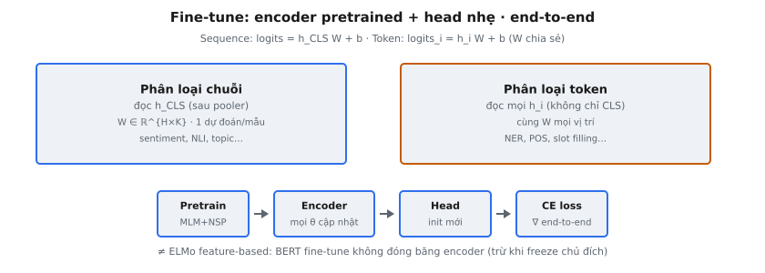

**Fine-tuning** là giai đoạn thứ hai trong paradigm hai giai đoạn của BERT (Devlin et al., 2019): trước tiên pre-train một Transformer hai chiều sâu trên corpus không nhãn, rồi fine-tune toàn bộ mô hình trên tập nhãn nhỏ hơn cho tác vụ downstream cụ thể. Như bài báo nêu: "Fine-tuning is straightforward since the self-attention mechanism in the Transformer allows BERT to model many downstream tasks. For each task, we simply plug in the task-specific inputs and outputs and fine-tune all the parameters end-to-end."

## Nó là gì / Nó làm gì

Fine-tuning lấy encoder BERT đã pre-train và thêm một lớp nhỏ, khởi tạo ngẫu nhiên, đặc thù tác vụ (gọi là "head") phía trên. Toàn hệ thống được huấn luyện end-to-end trên dữ liệu có nhãn. Điều này tương phản với cách dựa trên feature (như ELMo) nơi biểu diễn pre-trained bị đóng băng.

- **Giai đoạn 1 (Pre-training):** BERT học hiểu ngôn ngữ tổng quát từ văn bản không nhãn khổng lồ qua masked language modeling và next sentence prediction, xây dựng biểu diễn ngữ cảnh sâu qua 12 hoặc 24 lớp Transformer.
- **Giai đoạn 2 (Fine-tuning):** Mọi tham số được cập nhật trên tập nhãn nhỏ. Trọng số pre-trained cung cấp khởi tạo xuất sắc, nên mô hình hội tụ nhanh với ít dữ liệu.

Task head thường là một lớp tuyến tính duy nhất. Với phân loại chuỗi nó hoạt động trên hidden state [CLS]; với phân loại token nó hoạt động độc lập trên hidden state mỗi token. Head là thành phần duy nhất khởi tạo từ đầu.

::: {#fig-bert-finetune fig-cap="Fine-tune end-to-end: chuỗi dùng $h_{\\mathrm{CLS}}$; token dùng mọi $h_i$ với $W$ chia sẻ. Head init mới; gradient qua toàn encoder (khác feature-based ELMo)." fig-alt="Hai panel sequence vs token classification và pipeline pretrain-encoder-head."}
{fig-align="center"}
:::

## Các phương trình chính

Gọi $H \in \mathbb{R}^{L \times d}$ là đầu ra encoder cuối, với $L$ là độ dài chuỗi và $d$ là chiều ẩn (768 cho BERT-Base, 1024 cho BERT-Large). $h_{\text{CLS}} \in \mathbb{R}^d$ là hidden state [CLS], và $h_i \in \mathbb{R}^d$ là hidden state tại vị trí $i$.

**Phân loại chuỗi** chỉ dùng biểu diễn token [CLS]:

$$
\text{logits} = h_{\text{CLS}} \cdot W + b
$$

với $W \in \mathbb{R}^{d \times K}$ là ma trận trọng số classifier, $b \in \mathbb{R}^K$ là vector bias, và $K$ là số lớp.

**Phân loại token** áp dụng cùng biến đổi tuyến tính cho mọi token độc lập:

$$
\text{logits}_i = h_i \cdot W + b \quad \text{với } i = 1, 2, \ldots, L
$$

với $W \in \mathbb{R}^{d \times K}$ và $b \in \mathbb{R}^K$ được chia sẻ qua mọi vị trí.

**Phân phối xác suất** qua softmax:

$$
P(y = k \mid h) = \frac{\exp(\text{logits}_k)}{\sum_{j=1}^{K} \exp(\text{logits}_j)}
$$

**Loss training** là cross-entropy chuẩn. Với phân loại chuỗi và lớp ground-truth $c$:

$$
\mathcal{L} = -\log P(y = c \mid h_{\text{CLS}})
$$

Với phân loại token, loss cộng qua mọi vị trí token (bỏ qua padding và special token):

$$
\mathcal{L} = -\sum_{i=1}^{L} \log P(y_i = c_i \mid h_i)
$$

Gradient từ loss này lan ngược qua toàn bộ encoder, điều chỉnh mọi tham số pre-trained. Luồng gradient end-to-end này phân biệt fine-tuning với trích xuất feature.

## Phân loại chuỗi so với phân loại token

Cùng encoder BERT phục vụ cả hai tác vụ. Khác biệt nằm hoàn toàn ở hidden state nào classification head đọc.

**Phân loại chuỗi** tạo một dự đoán cho mỗi input:

- **Biểu diễn input:** Token [CLS] tổng hợp thông tin từ toàn chuỗi vào $h_{\text{CLS}}$ qua self-attention xuyên suốt mọi lớp.
- **Classifier:** Một lớp tuyến tính ánh xạ $h_{\text{CLS}} \in \mathbb{R}^d$ sang $\mathbb{R}^K$.
- **Tác vụ:** Phân tích cảm xúc, natural language inference, phân loại chủ đề, phát hiện paraphrase.

**Phân loại token** tạo một dự đoán cho mỗi token:

- **Biểu diễn input:** Dùng hidden state $h_i$ tại mọi vị trí token, không chỉ [CLS].
- **Classifier:** Cùng lớp tuyến tính áp dụng độc lập cho hidden state mỗi token. Trọng số $W$ và $b$ chia sẻ qua các vị trí.
- **Tác vụ:** Named entity recognition (NER), part-of-speech tagging, slot filling trong hệ thống hội thoại.

Với tác vụ cặp câu, BERT gói cả hai câu vào một input: [CLS] sentence_A [SEP] sentence_B [SEP]. Segment embeddings phân biệt câu mỗi token thuộc về, và [CLS] nắm quan hệ liên câu.

## Đóng băng lớp

Đóng băng lớp vô hiệu hóa cập nhật gradient cho tham số được chọn bằng cách đặt `requires_grad = False`, nên chúng giữ giá trị pre-trained suốt training.

**Tại sao đóng băng lớp:**

- **Ngăn catastrophic forgetting:** Trên tập nhỏ, cập nhật mọi tham số có thể ghi đè kiến thức ngôn ngữ tổng quát học trong pre-training.
- **Giảm overfitting:** Ít tham số học được nghĩa là capacity thấp hơn so với kích thước tập, hoạt động như regularization ngầm.
- **Tăng tốc training:** Lớp đóng băng bỏ qua tính gradient và cập nhật trọng số, giảm bộ nhớ và thời gian training.

**Lớp nào nên đóng băng:**

- **Lớp dưới (0-3 trong BERT-Base):** Nắm đặc trưng ngôn ngữ tổng quát như cú pháp và hình thái. Transfer tốt qua tác vụ và an toàn nhất để đóng băng.
- **Lớp giữa (4-7):** Nắm biểu diễn trung gian. Có đóng băng hay không phụ thuộc độ tương đồng domain với dữ liệu pre-training.
- **Lớp trên (8-11):** Nắm đặc trưng ngữ nghĩa cấp cao liên quan tác vụ. Hưởng lợi nhất từ fine-tuning và nên giữ trainable.
- **Lớp embedding:** Thường đóng băng vì subword embedding đã học tốt trong pre-training.

**Hướng dẫn theo kích thước tập:**

- **Rất nhỏ (< 1K ví dụ):** Đóng băng mọi lớp encoder, chỉ train classification head.
- **Nhỏ (1K-10K ví dụ):** Đóng băng 6-8 lớp dưới, fine-tune lớp trên và head.
- **Trung bình (10K-100K ví dụ):** Đóng băng 2-4 lớp dưới hoặc không đóng băng. Dùng learning rate nhỏ.
- **Lớn (100K+ ví dụ):** Fine-tune mọi lớp. Đủ dữ liệu ngăn catastrophic forgetting.

Gradual unfreezing là kỹ thuật liên quan: bắt đầu chỉ mở lớp trên cùng, train ngắn, rồi mở lớp kế dưới và lặp lại.

## Bối cảnh bài báo

Devlin et al. (2019) giới thiệu công thức fine-tuning trở thành chuẩn. Hyperparameter đề xuất cố ý bảo thủ.

**Hyperparameter đề xuất:**

- **Learning rate:** 2e-5, 3e-5, 4e-5, hoặc 5e-5 — nhỏ hơn khoảng 100 lần so với tốc độ training-from-scratch thông thường.
- **Batch size:** 16 hoặc 32.
- **Epochs:** 2, 3, hoặc 4. Rất ít epoch cần thiết vì mô hình bắt đầu từ biểu diễn mạnh.
- **Warmup:** Warmup tuyến tính trong 10% bước đầu, rồi decay tuyến tính.
- **Dropout:** 0.1 trên classification head.

**Kết quả chính từ bài báo:**

- **Benchmark GLUE:** 80.5 accuracy, cải thiện 7.7 điểm so với state of the art trước đó.
- **SQuAD 1.1:** F1 93.2, vượt hiệu suất con người (91.2 F1).
- **SQuAD 2.0:** F1 83.1, xử lý câu hỏi không trả lời được qua [CLS].
- **CoNLL-2003 NER:** F1 92.8, cho thấy cùng mô hình xuất sắc cả tác vụ cấp chuỗi và cấp token.

Fine-tuning vượt trội cách dựa trên feature trên hầu hết tác vụ, xác nhận chiến lược end-to-end.

## Catastrophic forgetting

Catastrophic forgetting xảy ra khi fine-tuning ghi đè kiến thức tổng quát học trong pre-training. Mô hình chuyên biệt hóa cho tác vụ mới đánh đổi bằng việc mất hiểu biết ngôn ngữ rộng.

**Tại sao learning rate nhỏ quan trọng:**

- **Cập nhật nhỏ bảo toàn kiến thức:** Tốc độ 2e-5 đến 5e-5 chỉ đẩy nhẹ trọng số pre-trained thay vì thay thế.
- **Tốc độ lớn phá hủy biểu diễn:** Ở 1e-3 trở lên, gradient nhanh chóng ghi đè pattern attention học từ hàng tỷ token.

**Tại sao ít epoch quan trọng:**

- **Drift tích lũy:** Mỗi bước đẩy tham số xa giá trị pre-trained. Nhiều epoch trên dữ liệu nhỏ gây drift tích lũy đáng kể.

**Liên hệ với đóng băng lớp:**

- **Đóng băng như biện pháp trực tiếp:** Nếu tham số không cập nhật, chúng không thể quên.
- **Chiến lược bổ sung:** Đóng băng lớp, learning rate nhỏ, ít epoch, và warmup cùng giải quyết vấn đề từ các góc độ khác nhau và thường kết hợp.

**Discriminative learning rates** là điểm giữa: gán tốc độ nhỏ hơn cho lớp dưới và lớn hơn cho lớp trên. Ví dụ, lớp 0 dùng 1e-6, lớp 6 dùng 1e-5, lớp 11 dùng 5e-5.

## Ví dụ số

Xét phân loại cảm xúc 3 lớp (negative, neutral, positive) với chiều ẩn $d = 4$.

**Bước 1: Đầu ra encoder.** Sau khi đưa "[CLS] This movie is great [SEP]" qua BERT, hidden state [CLS] là:

$$
h_{\text{CLS}} = [0.5, -0.3, 0.8, 0.1]
$$

**Bước 2: Trọng số classifier.** $W \in \mathbb{R}^{4 \times 3}$ và $b \in \mathbb{R}^3$:

$$
W = \begin{bmatrix} 0.2 & -0.1 & 0.4 \\ 0.3 & 0.5 & -0.2 \\ -0.1 & 0.2 & 0.6 \\ 0.4 & -0.3 & 0.1 \end{bmatrix}, \quad b = [0.1, -0.1, 0.2]
$$

**Bước 3: Tính logits.** $\text{logits} = h_{\text{CLS}} \cdot W + b$:

$$
\text{logits}_0 = (0.5)(0.2) + (-0.3)(0.3) + (0.8)(-0.1) + (0.1)(0.4) + 0.1 = 0.07
$$

$$
\text{logits}_1 = (0.5)(-0.1) + (-0.3)(0.5) + (0.8)(0.2) + (0.1)(-0.3) - 0.1 = -0.17
$$

$$
\text{logits}_2 = (0.5)(0.4) + (-0.3)(-0.2) + (0.8)(0.6) + (0.1)(0.1) + 0.2 = 0.95
$$

$$
\text{logits} = [0.07, -0.17, 0.95]
$$

**Bước 4: Softmax.**

$$
\exp(\text{logits}) = [e^{0.07}, e^{-0.17}, e^{0.95}] = [1.073, 0.844, 2.586]
$$

$$
\text{sum} = 1.073 + 0.844 + 2.586 = 4.503
$$

$$
P = [0.238, 0.187, 0.574]
$$

Mô hình dự đoán lớp 2 (positive) với xác suất 57.4%, khớp "This movie is great."

**Bước 5: Loss.** Với nhãn ground-truth lớp 2:

$$
\mathcal{L} = -\log(0.574) = 0.555
$$

Loss này lan truyền ngược qua classification head và toàn bộ encoder BERT.

### Ví dụ phân loại token

NER trên "John works at Google" với nhãn {O, PER, ORG} ($K = 3$). Cùng $W$ và $b$ áp dụng độc lập cho hidden state mỗi token.

Sau encoding:

$$
h_{\text{John}} = [0.9, -0.2, 0.4, 0.3], \quad h_{\text{works}} = [0.1, 0.5, -0.1, 0.2], \quad h_{\text{Google}} = [0.7, 0.1, 0.6, -0.4]
$$

**"John":** $\text{logits} = h_{\text{John}} \cdot W + b = [0.30, -0.30, 0.87]$. Softmax: $[0.243, 0.133, 0.624]$. Dự đoán: ORG. Với trọng số ngẫu nhiên điều này sai — mô hình đã train sẽ dự đoán PER.

**"works":** $\text{logits} = [0.36, 0.06, 0.10]$. Softmax: $[0.402, 0.298, 0.310]$. Dự đoán: O. Đúng — "works" không phải entity.

**"Google":** $\text{logits} = [0.05, 0.12, 0.78]$. Softmax: $[0.225, 0.242, 0.533]$. Dự đoán: ORG. Đúng — "Google" là tổ chức.

Tổng loss cộng cross-entropy qua mọi vị trí token.

## Bối cảnh hiện đại

Khi mô hình lên hàng trăm tỷ tham số, full fine-tuning trở nên không thực tế, thúc đẩy các phương án tiết kiệm tham số.

- **LoRA (Low-Rank Adaptation):** Đóng băng trọng số pre-trained và chèn ma trận hạng thấp trainable. Cập nhật là $\Delta W = AB$ với $A \in \mathbb{R}^{d \times r}$, $B \in \mathbb{R}^{r \times d}$, $r \ll d$. Giảm tham số trainable 1000 lần trong khi khớp full fine-tuning trên nhiều tác vụ.
- **Adapter layers:** Module bottleneck nhỏ chèn giữa các lớp Transformer. Chỉ adapter train; base model đóng băng.
- **Prompt tuning:** Vector liên tục học được thêm vào đầu input embedding. Mô hình đóng băng hoàn toàn; chỉ prompt vector được tối ưu.
- **In-context learning (ICL):** GPT-3 giới thiệu. Demonstration tác vụ đưa vào prompt input; mô hình thực hiện zero-shot hoặc few-shot không cập nhật tham số.
- **QLoRA:** Kết hợp quantization 4-bit với LoRA, cho phép fine-tuning mô hình 65B+ tham số trên một GPU.

Dù có tiến bộ, full fine-tuning vẫn là chuẩn vàng khi cần hiệu suất tối đa. Insight cốt lõi của BERT — biểu diễn pre-trained có thể thích ứng với thay đổi kiến trúc tối thiểu — nền tảng cho mọi phương pháp trên.

## Các lỗi thường gặp

- **Learning rate quá cao:** Dùng 1e-3 trở lên nhanh chóng phá hủy biểu diễn pre-trained. Luôn dùng 2e-5 đến 5e-5.
- **Quá nhiều epoch trên dữ liệu nhỏ:** Train 10+ epoch trên vài nghìn ví dụ gây overfitting nặng và catastrophic forgetting. Giữ 2-4 epoch.
- **Quên dùng [CLS] cho tác vụ chuỗi:** Lấy trung bình mọi trạng thái token hoặc dùng token cuối lệch với pre-training, vốn dùng [CLS] làm biểu diễn tổng hợp.
- **Áp head chuỗi cho tác vụ token:** Chỉ dùng [CLS] cho NER hoặc POS tagging loại bỏ thông tin theo token. Phân loại token cần hidden state mọi token.
- **Bỏ qua warmup:** Head khởi tạo ngẫu nhiên tạo gradient lớn, nhiễu, có thể làm hỏng vĩnh viễn biểu diễn pre-trained. Dùng warmup 5-10% số bước.
- **Đóng băng quá nhiều lớp:** Chỉ train head hạn chế khả năng thích ứng. Kém hơn trên tác vụ đặc thù domain.
- **Đóng băng quá ít lớp trên dữ liệu nhỏ:** Fine-tune cả 12 lớp trên 500 ví dụ cho quá nhiều bậc tự do. Đóng băng 8-10 lớp dưới.
- **Bỏ qua định dạng input:** Thiếu [CLS]/[SEP], sai segment ID, hoặc vượt 512 token cho kết quả suy giảm mà không có lỗi rõ ràng.


## Code
```python
import numpy as np
from typing import List

class MockBertEncoder:
    def __init__(self, hidden_size: int, num_layers: int):
        self.hidden_size = hidden_size
        self.num_layers = num_layers
        self.layers = [np.random.randn(hidden_size, hidden_size) * 0.01 for _ in range(num_layers)]
        self.layer_frozen = [False] * num_layers

    def freeze_layers(self, layer_indices: List[int]):
        for idx in layer_indices:
            self.layer_frozen[idx] = True

    def unfreeze_all(self):
        self.layer_frozen = [False] * self.num_layers

    def forward(self, embeddings: np.ndarray) -> np.ndarray:
        x = embeddings
        for i, layer in enumerate(self.layers):
            x = x @ layer + x
        return x

class BertForSequenceClassification:
    def __init__(self, hidden_size: int, num_labels: int, num_layers: int = 3):
        self.encoder = MockBertEncoder(hidden_size, num_layers)
        self.classifier = np.random.randn(hidden_size, num_labels) * 0.02

    def forward(self, embeddings: np.ndarray) -> np.ndarray:
        hidden = self.encoder.forward(embeddings)
        cls_hidden = hidden[:, 0, :]
        return cls_hidden @ self.classifier

class BertForTokenClassification:
    def __init__(self, hidden_size: int, num_labels: int, num_layers: int = 3):
        self.encoder = MockBertEncoder(hidden_size, num_layers)
        self.classifier = np.random.randn(hidden_size, num_labels) * 0.02

    def forward(self, embeddings: np.ndarray) -> np.ndarray:
        hidden = self.encoder.forward(embeddings)
        return hidden @ self.classifier

```
