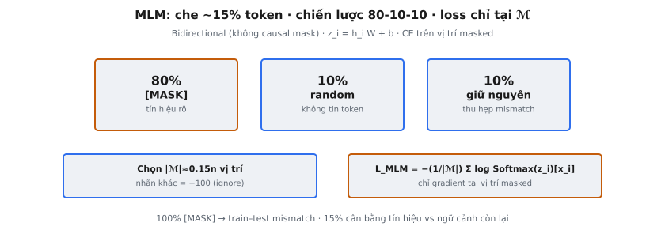

**Masked Language Modeling (MLM)** là mục tiêu pre-training chính của BERT (Devlin et al., 2019). Thay vì dự đoán token theo hướng trái sang phải như các mô hình autoregressive, MLM che ngẫu nhiên một tập con token đầu vào và huấn luyện mô hình tái tạo chúng bằng ngữ cảnh **bidirectional**. Điều này cho phép BERT attend đồng thời cả ngữ cảnh trái và phải, tạo ra các biểu diễn **bidirectional** sâu.

MLM biến pre-training thành bài toán điền vào chỗ trống. 15% token được chọn, bị làm hỏng qua chiến lược 80-10-10, và mô hình phải khôi phục token gốc tại mỗi vị trí bị hỏng. Loss chỉ được tính tại các vị trí bị che.

## Nó là gì / Nó làm gì

MLM chọn ngẫu nhiên token từ chuỗi đầu vào và thay bằng phiên bản bị làm hỏng. Mô hình phải dự đoán token gốc tại mỗi vị trí được chọn, dựa trên ngữ cảnh xung quanh. Vì không có causal mask hạn chế attention, mô hình có thể dùng token cả bên trái lẫn bên phải để dự đoán.

Điều này khác căn bản với mô hình autoregressive như GPT, nơi vị trí $t$ chỉ mã hóa thông tin từ các vị trí $1, 2, \ldots, t-1$. Trong MLM, các vị trí bị che lấy thông tin từ mọi vị trí chưa bị che, cả trước lẫn sau.

Các thuộc tính chính:

- **Ngữ cảnh bidirectional:** Mọi token attend tới mọi token khác (không có causal mask), nên vị trí bị che được dự đoán từ toàn bộ ngữ cảnh xung quanh.
- **Dự đoán một phần:** Chỉ 15% token được dự đoán mỗi forward pass, khiến mỗi bước huấn luyện kém hiệu quả hơn mô hình autoregressive (dự đoán mọi token), nhưng tạo biểu diễn phong phú hơn cho mỗi token.
- **Chiến lược làm hỏng:** Token được chọn không đơn giản bị thay bằng ký hiệu [MASK]. Chiến lược 80-10-10 được dùng để thu hẹp khoảng cách giữa pre-training (dùng [MASK]) và fine-tuning (không bao giờ thấy [MASK]).

::: {#fig-bert-mlm fig-cap="MLM: chọn $|\\mathcal{M}|\\approx 0.15n$; với $i\\in\\mathcal{M}$: 80% $[\\mathrm{MASK}]$, 10% random, 10% giữ nguyên. $\\mathcal{L}_{\\mathrm{MLM}}$ chỉ trên $\\mathcal{M}$ (nhãn khác $= -100$)." fig-alt="Ba panel 80-10-10 và công thức loss MLM."}
{fig-align="center"}
:::

## Các phương trình chính

Gọi $\mathbf{x} = (x_1, x_2, \ldots, x_n)$ là chuỗi token đầu vào có độ dài $n$. Gọi $\mathcal{M} \subset \{1, 2, \ldots, n\}$ là tập vị trí được chọn để che, với $|\mathcal{M}| \approx 0.15n$.

**Chiến lược che 80-10-10.** Với mỗi vị trí $i \in \mathcal{M}$, token bị làm hỏng $\tilde{x}_i$ được xác định như sau:

$$
\tilde{x}_i = \begin{cases} \texttt{[MASK]} & \text{with probability } 0.80 \\ x_r \sim \text{Uniform}(\mathcal{V}) & \text{with probability } 0.10 \\ x_i & \text{with probability } 0.10 \end{cases}
$$

trong đó $\mathcal{V}$ là toàn bộ vocabulary và $x_r$ là token lấy ngẫu nhiên đều từ $\mathcal{V}$.

**Đầu dự đoán MLM.** Tại mỗi vị trí bị che $i \in \mathcal{M}$, mô hình lấy hidden state cuối $\mathbf{h}_i \in \mathbb{R}^{H}$ và chiếu ra **logits** có kích thước vocabulary:

$$
\mathbf{z}_i = \mathbf{h}_i \mathbf{W} + \mathbf{b}
$$

trong đó $\mathbf{W} \in \mathbb{R}^{H \times V}$ là ma trận trọng số chiếu, $\mathbf{b} \in \mathbb{R}^{V}$ là vector bias, $H$ là hidden size, và $V$ là kích thước vocabulary.

**Loss MLM.** Cross-entropy chỉ được tính tại các vị trí bị che:

$$
\mathcal{L}_{\text{MLM}} = -\frac{1}{|\mathcal{M}|} \sum_{i \in \mathcal{M}} \log \frac{\exp(\mathbf{z}_i[x_i])}{\sum_{v=1}^{V} \exp(\mathbf{z}_i[v])}
$$

trong đó $\mathbf{z}_i[x_i]$ là logit tương ứng token đúng $x_i$ tại vị trí $i$, và mẫu số là hệ số chuẩn hóa **softmax** trên toàn bộ vocabulary.

Các vị trí không thuộc $\mathcal{M}$ được gán nhãn $-100$, theo quy ước chuẩn PyTorch cho `ignore_index` trong `CrossEntropyLoss`. Các vị trí này không đóng góp gradient và bị loại khỏi phép tính loss hoàn toàn.

## Tại sao 80-10-10 (không phải 100% [MASK])

Cách naïve là thay mọi token được chọn bằng ký hiệu [MASK]. Điều này tạo train-test mismatch: trong pre-training, mô hình thấy token [MASK] khắp nơi, nhưng trong fine-tuning và inference, [MASK] không bao giờ xuất hiện ở đầu vào. Biểu diễn của mô hình sẽ được tối ưu cho đầu vào chứa [MASK] và suy giảm trên văn bản thật.

Chiến lược 80-10-10 giảm mismatch theo ba cách:

- **80% [MASK]:** Cho mô hình tín hiệu rõ ràng rằng một vị trí cần được dự đoán. Không có [MASK], mô hình không biết vị trí nào cần tái tạo.
- **10% token ngẫu nhiên:** Buộc mô hình duy trì biểu diễn tốt tại mọi vị trí. Mô hình không thể giả định token không phải [MASK] là đúng — nó phải kiểm tra tính nhất quán với ngữ cảnh, tăng độ robust.
- **10% giữ nguyên:** Dạy mô hình rằng ngay cả token trông đúng cũng có thể là mục tiêu dự đoán. Điều này thiên biểu diễn về việc mã hóa token quan sát được, hữu ích lúc fine-tuning khi [MASK] không xuất hiện.

Devlin et al. chọn tỷ lệ 80-10-10 bằng thực nghiệm. Ablation cho thấy tỷ lệ chính xác ít quan trọng hơn việc có đủ cả ba thành phần. Dùng 100% [MASK] cho kết quả downstream kém đo lường được.

## Tại sao tỷ lệ che 15%

Tỷ lệ che điều khiển tradeoff cơ bản giữa hiệu quả huấn luyện và chất lượng dự đoán:

- **Quá thấp (ví dụ 5%):** Rất ít token được dự đoán mỗi forward pass, nghĩa là mỗi bước huấn luyện cung cấp tín hiệu gradient tối thiểu. Mô hình cần nhiều bước hơn để học cùng biểu diễn, khiến pre-training chậm và tốn kém đến mức không khả thi.
- **Quá cao (ví dụ 50%):** Quá nhiều token bị che, phá hủy phần lớn ngữ cảnh. Mô hình không thể dự đoán có ý nghĩa vì không đủ thông tin xung quanh để tái tạo token bị che. Bài toán gần với đoán ngẫu nhiên hơn là hiểu ngôn ngữ.

Ở 15%, với chuỗi BERT điển hình 512 token, khoảng 77 token được chọn để dự đoán mỗi chuỗi. Mức này cung cấp tín hiệu gradient đáng kể mỗi bước trong khi giữ 85% ngữ cảnh để mô hình điều kiện hóa.

Tỷ lệ 15% được xác định bằng thực nghiệm. Mô hình MLM hội tụ chậm hơn mô hình autoregressive (dự đoán 100% token) vì chỉ 15% tạo loss. Đây là chi phí hiệu quả cơ bản của pre-training **bidirectional**: biểu diễn phong phú hơn, nhưng ít mục tiêu dự đoán hơn mỗi bước. Công trình sau này thấy tỷ lệ cao hơn một chút (20–25%) có thể dùng cho mô hình lớn, nhưng 15% vẫn là baseline chuẩn.

## Bối cảnh bài báo

Mục tiêu MLM được giới thiệu trong "BERT: Pre-training of Deep Bidirectional Transformers for Language Understanding" (Devlin, Chang, Lee, and Toutanova, 2019). Luận điểm cốt lõi là biểu diễn **bidirectional** sâu vượt trội cả hướng trái sang phải (GPT) lẫn **bidirectional** nông (ELMo).

Bài báo đối chiếu MLM với mục tiêu autoregressive của GPT, nơi causal mask hạn chế vị trí $t$ chỉ attend tới vị trí $1$ đến $t-1$. BERT bỏ mask này, cho phép attention **bidirectional** đầy đủ. Tradeoff là BERT không thể dùng trực tiếp cho sinh văn bản.

Devlin et al. mượn khái niệm MLM từ bài toán Cloze (Taylor, 1953). Bài báo viết: "We simply mask some percentage of the input tokens at random, and then predict those masked tokens." Cách này tạo biểu diễn đạt state-of-the-art mới trên 11 benchmark NLP.

Quy ước nhãn $-100$ là trung tâm của triển khai. Mọi vị trí đều có nhãn: vị trí bị che nhận token ID gốc, vị trí không bị che nhận $-100$. `CrossEntropyLoss` của PyTorch với `ignore_index=-100` bỏ qua các vị trí này, không đóng góp gradient. Quy ước này giờ là chuẩn trong mọi triển khai MLM.

BERT được pre-train trên BooksCorpus (800M từ) và English Wikipedia (2500M từ) trong 1M bước với batch size 256. Mục tiêu MLM được kết hợp với **Next Sentence Prediction (NSP)**, dù công trình sau (RoBERTa) cho thấy NSP không cần thiết.

## Đầu dự đoán

Đầu dự đoán MLM ánh xạ hidden state sang **logits** vocabulary. Trong triển khai đầy đủ của BERT, nó áp dụng lớp dense ($H \to H$), kích hoạt GELU, layer normalization, rồi chiếu vocabulary ($H \to V$). Ở dạng đơn giản:

$$
\mathbf{z}_i = \mathbf{h}_i \mathbf{W} + \mathbf{b}
$$

trong đó $\mathbf{W} \in \mathbb{R}^{H \times V}$ và $\mathbf{b} \in \mathbb{R}^{V}$.

**Weight tying.** Tối ưu phổ biến là ràng buộc $\mathbf{W}$ với ma trận embedding đầu vào $\mathbf{E} \in \mathbb{R}^{V \times H}$, đặt $\mathbf{W} = \mathbf{E}^\top$. Cách này tiết kiệm $V \times H$ tham số (khoảng 23M cho BERT-base) và ép tính nhất quán: token có embedding tương tự tạo **logits** tương tự. BERT dùng weight tying.

**Huấn luyện vs. inference.** Trong pre-training, đầu dự đoán chỉ áp dụng tại vị trí bị che. Trong fine-tuning, nó bị loại bỏ — chỉ giữ encoder Transformer và gắn đầu mới theo task.

## Ví dụ số

Xét chuỗi 10 token (dùng token ID cho rõ):

- **Input token IDs:** $[101, 2023, 2003, 1037, 6251, 2005, 9543, 4083, 1012, 102]$
- **Dạng đọc được:** [CLS] this is a sentence for masked language. [SEP]

**Bước 1: Chọn 15% token để che.**

$0.15 \times 10 = 1.5$, làm tròn thành 2 token. Giả sử vị trí 4 và 6 được chọn (chỉ số 0). Vị trí 4 có token ID 6251 ("sentence") và vị trí 6 có token ID 9543 ("masked").

Lưu ý: vị trí 0 và 9 là [CLS] và [SEP] — token đặc biệt thường bị loại khỏi tập ứng viên che, nên pool ứng viên thực tế là vị trí 1–8.

**Bước 2: Áp dụng 80-10-10 cho mỗi vị trí được chọn.**

Với vị trí 4 (token 6251, "sentence"):

- **Rút thăm:** giá trị ngẫu nhiên 0.35 — rơi vào khoảng 80% (0.0 đến 0.8).
- **Hành động:** Thay bằng [MASK] (token ID 103).

Với vị trí 6 (token 9543, "masked"):

- **Rút thăm:** giá trị ngẫu nhiên 0.87 — rơi vào khoảng 10% random (0.8 đến 0.9).
- **Hành động:** Thay bằng token ngẫu nhiên từ vocabulary. Giả sử token ngẫu nhiên là 7592 ("playing").

**Bước 3: Tạo ba mảng đầu ra.**

**masked_ids** (đầu vào bị làm hỏng đưa vào mô hình):

$$
[101, 2023, 2003, 1037, \mathbf{103}, 2005, \mathbf{7592}, 4083, 1012, 102]
$$

Vị trí 4 đổi từ 6251 sang 103 ([MASK]). Vị trí 6 đổi từ 9543 sang 7592 (token ngẫu nhiên).

**labels** (mục tiêu cho phép tính loss):

$$
[-100, -100, -100, -100, \mathbf{6251}, -100, \mathbf{9543}, -100, -100, -100]
$$

Chỉ vị trí 4 và 6 có nhãn thật (token ID gốc). Mọi vị trí khác là $-100$, nghĩa là bị bỏ qua trong cross-entropy loss.

**mask** (mảng boolean chỉ vị trí nào là mục tiêu dự đoán):

$$
[\text{False}, \text{False}, \text{False}, \text{False}, \mathbf{\text{True}}, \text{False}, \mathbf{\text{True}}, \text{False}, \text{False}, \text{False}]
$$

**Bước 4: Forward pass và loss.**

Mô hình xử lý masked_ids qua encoder. Tại vị trí 4 và 6, đầu dự đoán tính **logits** $\mathbf{z}_4$ và $\mathbf{z}_6$. Cross-entropy loss được tính so với nhãn 6251 và 9543. Loss MLM là trung bình của hai giá trị này.

## Bối cảnh hiện đại

MLM là mục tiêu pre-training thống trị từ 2018 đến khoảng 2020, nhưng bối cảnh đã thay đổi đáng kể:

- **Dự đoán token kế tiếp kiểu GPT:** Pre-training autoregressive scale hiệu quả hơn vì mọi token tạo tín hiệu loss (không chỉ 15%). Cách này giờ thống trị pre-training quy mô lớn.
- **SpanBERT (Joshi et al., 2020):** Che các span liên tiếp thay vì token ngẫu nhiên, buộc mô hình suy luận phụ thuộc tầm xa hơn. Vượt BERT trên task trích span như question answering.
- **ELECTRA (Clark et al., 2020):** Thay MLM bằng replaced token detection. Một generator nhỏ tạo thay thế hợp lý, và discriminator phân loại mọi token là thật hay bị thay, nhận gradient tại mọi vị trí. Hiệu quả mẫu cao hơn đáng kể so với BERT.
- **T5 (Raffel et al., 2020):** Dùng span corruption với sentinel token và kiến trúc encoder-decoder, kết hợp mã hóa **bidirectional** với sinh span autoregressive.
- **RoBERTa (Liu et al., 2019):** Giữ MLM nhưng dùng dynamic masking (tạo lại mỗi epoch) thay vì mask cố định lúc tiền xử lý, cải thiện hiệu năng mà không đổi kiến trúc.

Dù có các tiến bộ này, MLM vẫn là nền tảng để hiểu pre-training **bidirectional** và các tradeoff so với mô hình autoregressive.

## Các lỗi thường gặp

- **Tính loss trên mọi vị trí thay vì chỉ vị trí bị che.** Nếu tính cross-entropy trên toàn chuỗi, vị trí không bị che chiếm ưu thế trong loss và làm loãng tín hiệu học thực sự. Luôn dùng `ignore_index=-100` hoặc chỉ index vào vị trí bị che.
- **Sai tỷ lệ che.** Quá thấp nghĩa là hội tụ chậm; quá cao phá hủy ngữ cảnh. Giữ 15% trừ khi có kết quả ablation chứng minh tỷ lệ khác.
- **Quên 10% random và 10% giữ nguyên.** Thay mọi token được chọn bằng [MASK] cho hiệu năng downstream kém hơn do train-test mismatch. Luôn triển khai đủ chiến lược 80-10-10.
- **Dùng [MASK] lúc inference hoặc fine-tuning.** Token [MASK] chỉ tồn tại cho pre-training. Đưa nó vào đầu vào fine-tuning gây hành vi không dự đoán được.
- **Nhãn -100 không xử lý đúng.** Nếu hàm loss không hỗ trợ `ignore_index`, mô hình cố dự đoán token không tồn tại, gây lỗi số hoặc crash.
- **Che token đặc biệt.** [CLS], [SEP] và token padding không bao giờ được che. Loại chúng khỏi pool ứng viên trước khi chọn 15%.
- **Static vs. dynamic masking.** BERT gốc dùng static masking (cố định lúc tiền xử lý). RoBERTa cho thấy dynamic masking (tạo lại mỗi epoch) cải thiện hiệu năng.

## Code
```python
import numpy as np
from typing import Tuple

def apply_mlm_mask(
    token_ids: np.ndarray,
    mask_positions: np.ndarray,
    replace_probs: np.ndarray,
    random_tokens: np.ndarray,
    mask_token_id: int = 103
) -> Tuple[np.ndarray, np.ndarray]:
    token_ids = np.array(token_ids)
    mask_positions = np.array(mask_positions, dtype=bool)
    replace_probs = np.array(replace_probs)
    random_tokens = np.array(random_tokens)
    
    masked_ids = token_ids.copy()
    labels = np.full_like(token_ids, -100)
    
    for i in range(token_ids.shape[0]):
        for j in range(token_ids.shape[1]):
            if mask_positions[i][j]:
                labels[i][j] = token_ids[i][j]
                if replace_probs[i][j] < 0.8:
                    masked_ids[i][j] = mask_token_id
                elif replace_probs[i][j] < 0.9:
                    masked_ids[i][j] = random_tokens[i][j]
    
    return masked_ids, labels

class MLMHead:
    def __init__(self, hidden_size: int, vocab_size: int):
        self.hidden_size = hidden_size
        self.vocab_size = vocab_size
        self.W = np.random.randn(hidden_size, vocab_size) * 0.02
        self.b = np.zeros(vocab_size)

    def forward(self, hidden_states: np.ndarray) -> np.ndarray:
        return hidden_states @ self.W + self.b

```
