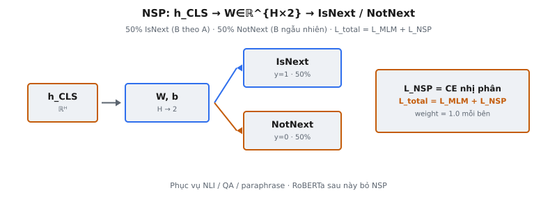

**Next Sentence Prediction (NSP)** là mục tiêu pre-training thứ hai trong hai mục tiêu của BERT. Trong khi **Masked Language Modeling (MLM)** dạy mô hình hiểu ngữ cảnh cấp token, NSP huấn luyện mô hình hiểu quan hệ giữa các câu. Cho cặp (A, B), mô hình dự đoán liệu B có phải câu kế tiếp thực sự sau A trong corpus (**IsNext**) hay là câu lấy ngẫu nhiên (**NotNext**). NSP được giới thiệu trong Devlin et al. (2019), "BERT: Pre-training of Deep Bidirectional Transformers for Language Understanding."

## Nó là gì / Nó làm gì

NSP là bài toán phân loại nhị phân áp dụng lên cặp câu trong pre-training của BERT. Mô hình nhận hai segment tách bởi token [SEP], với token [CLS] được thêm ở đầu. Hidden state cuối của [CLS] được đưa qua đầu phân loại tuyến tính để tạo dự đoán nhị phân.

Hai lớp là:

- **IsNext (label = 1):** Câu B là câu kế tiếp thật sau câu A trong tài liệu nguồn. 50% cặp huấn luyện dùng cách ghép này.
- **NotNext (label = 0):** Câu B được lấy ngẫu nhiên từ phần khác của corpus. 50% còn lại dùng cách ghép này.

Tỷ lệ cân bằng 50/50 nghĩa là baseline tầm thường (luôn dự đoán một lớp) đạt 50% accuracy. Bộ phân loại NSP pre-trained của BERT đạt khoảng 97–98% accuracy, xác nhận mô hình học được quan hệ liên câu có ý nghĩa.

NSP được huấn luyện đồng thời với MLM. Mọi ví dụ huấn luyện đồng thời có token bị che (cho MLM) và nhãn cặp câu (cho NSP). Tổng loss pre-training là tổng loss MLM và loss NSP.

::: {#fig-bert-nsp fig-cap="NSP: $\\mathrm{logits}=h_{\\mathrm{CLS}}W+b$, $W\\in\\mathbb{R}^{H\\times 2}$. 50% IsNext / 50% NotNext; $\\mathcal{L}_{\\mathrm{total}}=\\mathcal{L}_{\\mathrm{MLM}}+\\mathcal{L}_{\\mathrm{NSP}}$." fig-alt="h_CLS qua head ra IsNext hoặc NotNext; total loss."}
{fig-align="center"}
:::

## Các phương trình chính

Gọi $h_{\text{CLS}} \in \mathbb{R}^h$ là hidden state cuối của token [CLS] từ lớp Transformer cuối, với $h$ là chiều hidden (768 cho BERT-Base, 1024 cho BERT-Large).

Đầu NSP áp dụng biến đổi tuyến tính rồi **softmax**:

$$
\text{logits} = h_{\text{CLS}} \cdot W + b
$$

trong đó $W \in \mathbb{R}^{h \times 2}$ là ma trận trọng số và $b \in \mathbb{R}^2$ là vector bias. Phép này tạo hai **logits** cho lớp IsNext và NotNext.

Phân phối xác suất trên hai lớp qua **softmax**:

$$
P(\text{IsNext}) = \frac{e^{\text{logits}_1}}{e^{\text{logits}_0} + e^{\text{logits}_1}}
$$

$$
P(\text{NotNext}) = \frac{e^{\text{logits}_0}}{e^{\text{logits}_0} + e^{\text{logits}_1}}
$$

Loss NSP là cross-entropy chuẩn:

$$
\mathcal{L}_{\text{NSP}} = -\left[ y \log P(\text{IsNext}) + (1 - y) \log P(\text{NotNext}) \right]
$$

trong đó $y = 1$ cho cặp IsNext và $y = 0$ cho cặp NotNext.

Tổng loss pre-training BERT kết hợp cả hai mục tiêu:

$$
\mathcal{L}_{\text{total}} = \mathcal{L}_{\text{MLM}} + \mathcal{L}_{\text{NSP}}
$$

Cả hai loss được gán trọng số bằng nhau (weight = 1.0) trong triển khai gốc. Không có hệ số scale giữa chúng.

## Cách tạo dữ liệu huấn luyện NSP

BERT xây dựng dữ liệu huấn luyện ở cấp cặp câu. Hai "câu" (thực ra là span văn bản liên tiếp, có thể chứa nhiều câu ngôn ngữ học) được chọn để tạo mỗi cặp đầu vào.

Quy trình tạo:

- **Bước 1:** Chọn ngẫu nhiên một tài liệu từ corpus.
- **Bước 2:** Chọn vị trí ngẫu nhiên trong tài liệu và lấy span văn bản làm câu A.
- **Bước 3 (IsNext, 50%):** Lấy span ngay sau A trong cùng tài liệu làm câu B. Gán nhãn IsNext ($y = 1$).
- **Bước 3 (NotNext, 50%):** Lấy span ngẫu nhiên từ tài liệu khác làm câu B. Gán nhãn NotNext ($y = 0$).

Đầu vào kết quả được định dạng với token đặc biệt:

$$
[\text{CLS}] \; A_1 \; A_2 \; \ldots \; A_n \; [\text{SEP}] \; B_1 \; B_2 \; \ldots \; B_m \; [\text{SEP}]
$$

Ba loại embedding được cộng cho mỗi vị trí token:

- **Token embeddings:** WordPiece embedding của token thực tế.
- **Segment embeddings:** $E_A$ cho mọi token trong câu A (gồm [CLS] và [SEP] đầu), $E_B$ cho mọi token trong câu B (gồm [SEP] cuối).
- **Position embeddings:** Embedding vị trí tuyệt đối học được từ 0 đến 511.

Độ dài chuỗi kết hợp (A + B + token đặc biệt) không được vượt 512 token.

## Tại sao có NSP

Devlin et al. thêm NSP vì nhiều task NLP downstream cần hiểu quan hệ giữa hai đoạn văn bản. Các task hưởng lợi:

- **Natural Language Inference (NLI):** Cho premise và hypothesis, xác định entailment, contradiction hay neutrality.
- **Question Answering (QA):** Cho câu hỏi và đoạn văn, định vị span câu trả lời. Cần suy luận liên câu.
- **Paraphrase Detection:** Cho hai câu, xác định chúng có cùng nghĩa không.

Bài báo viết: "Many important downstream tasks such as Question Answering and Natural Language Inference are based on understanding the relationship between two sentences, which is not directly captured by language modeling."

NSP buộc token [CLS] mã hóa biểu diễn toàn cục, liên câu, nắm bắt liệu hai segment có liên kết mạch lạc hay không. Biểu diễn này sau đó có thể fine-tune cho task cặp câu.

Devlin et al. báo cáo kết quả ablation cho thấy bỏ NSP làm giảm hiệu năng trên QNLI (86.4% xuống 84.3%), MNLI (84.4% xuống 83.7%), và SQuAD (88.5 F1 xuống 87.3 F1), là bằng chứng trực tiếp rằng pre-training NSP chuyển giao kiến thức hữu ích.

## Bối cảnh bài báo

Trong bài BERT gốc, NSP được giới thiệu cùng MLM như một trong hai mục tiêu pre-training bổ sung cho nhau. Chưa có cách tiếp cận trước đó nắm bắt quan hệ liên câu, khiến NSP là đóng góp mới.

Chi tiết chính từ bài báo:

- **Accuracy pre-training:** Bộ phân loại NSP đạt 97–98% accuracy. Accuracy cao cho thấy task có thể học được nhưng cũng báo trước phê bình sau này rằng task có thể quá dễ.
- **Huấn luyện đồng thời:** MLM và NSP được huấn luyện cùng lúc trên cùng đầu vào. Mọi ví dụ huấn luyện vừa có token bị che vừa có nhãn IsNext/NotNext. Hai hạng loss được cộng mà không có hệ số cân bằng.
- **Token [CLS]:** Hidden state cuối của [CLS] đóng vai biểu diễn chuỗi tổng hợp cho NSP lúc pre-training và cho task phân loại lúc fine-tuning. Vai trò kép này là then chốt trong thiết kế BERT.
- **Lớp pooler:** BERT có pooler áp dụng lớp dense với kích hoạt tanh lên hidden state [CLS]: $\text{pooled} = \tanh(W_p \cdot h_{\text{CLS}} + b_p)$. Đầu NSP hoạt động trên biểu diễn pooled này, không trực tiếp trên hidden state thô.
- **Dữ liệu pre-training:** BERT được pre-train trên BooksCorpus (800M từ) và English Wikipedia (2,500M từ). Corpus cấp tài liệu là cần thiết vì mô hình cần câu liên tiếp trong tài liệu cho cặp IsNext.
- **Thời lượng huấn luyện:** BERT-Base được pre-train 1M bước với batch size 256. Mỗi chuỗi chứa một cặp câu, nên mô hình thấy tổng cộng 256M cặp câu.

## Tranh luận về NSP

Dù NSP được trình bày là có lợi trong bài gốc, nghiên cứu sau đó thách thức mạnh tiện ích của nó.

### RoBERTa (Liu et al., 2019)

Thách thức ảnh hưởng nhất đến từ RoBERTa, đánh giá NSP có kiểm soát qua thí nghiệm:

- **SEGMENT-PAIR + NSP:** Thiết lập BERT gốc với cặp câu và loss NSP.
- **SENTENCE-PAIR + NSP:** Dùng câu đơn lẻ (không phải span) với loss NSP.
- **FULL-SENTENCES (no NSP):** Ghép câu đầy đủ từ một hoặc nhiều tài liệu mà không có NSP.
- **DOC-SENTENCES (no NSP):** Tương tự nhưng không vượt ranh giới tài liệu.

RoBERTa thấy bỏ NSP liên tục cải thiện hoặc ngang hiệu năng. Cấu hình FULL-SENTENCES không NSP vượt thiết lập BERT gốc trên SQuAD, MNLI, SST-2 và RACE.

### Vì sao NSP có thể gây hại

- **Task quá dễ:** Cặp NotNext đến từ tài liệu ngẫu nhiên với chủ đề hoàn toàn khác. Mô hình giải NSP bằng cách phát hiện đổi chủ đề thay vì học mạch lạc discourse. Bộ phân loại khớp chủ đề đơn giản đạt accuracy gần hoàn hảo.
- **Ô nhiễm tín hiệu MLM:** Cặp NotNext tạo đầu vào ghép không mạch lạc. Mục tiêu MLM trên đầu vào này có thể làm mô hình bối rối, vì nó cố dự đoán token bị che trong văn bản không có dòng tự nhiên.
- **Giảm ngữ cảnh MLM:** Dùng cặp câu nghĩa là ngữ cảnh hiệu dụng cho MLM ngắn hơn. Không có NSP, cùng độ dài đầu vào có thể chứa một đoạn dài, cung cấp ngữ cảnh phong phú hơn cho dự đoán token bị che.

### ALBERT và Sentence Order Prediction (SOP)

Lan et al. (2020) đề xuất ALBERT, thay NSP bằng **Sentence Order Prediction (SOP)**. SOP dùng hai câu liên tiếp nhưng hoán đổi thứ tự cho mẫu âm thay vì dùng câu ngẫu nhiên. Cách này buộc học mạch lạc discourse thay vì phát hiện chủ đề. ALBERT cho thấy SOP liên tục vượt NSP, xác nhận vấn đề nằm ở lấy mẫu âm tầm thường của NSP chứ không phải ý tưởng pre-training cấp câu.

## Ví dụ số

Xét hai câu từ tài liệu về khí hậu:

- **Câu A:** "Global temperatures have risen by 1.1 degrees Celsius since pre-industrial times."
- **Câu B (IsNext):** "This warming is primarily driven by greenhouse gas emissions."
- **Câu B' (NotNext):** "The stock market closed at a record high yesterday."

### Ghép cặp IsNext

Đầu vào sau tokenize (đơn giản hóa):

$$
[\text{CLS}] \; \text{Global} \; \text{temperatures} \; \text{have} \; \text{risen} \; \ldots \; [\text{SEP}] \; \text{This} \; \text{warming} \; \text{is} \; \ldots \; [\text{SEP}]
$$

- **segment_ids:** [0, 0, 0, 0, 0,..., 0, 1, 1, 1,..., 1]
- **Segment 0** bao [CLS] đến [SEP] đầu (câu A).
- **Segment 1** bao câu B đến [SEP] cuối.
- **Label:** $y = 1$ (IsNext)

### Ghép cặp NotNext

Thay câu B bằng câu ngẫu nhiên B':

$$
[\text{CLS}] \; \text{Global} \; \text{temperatures} \; \text{have} \; \text{risen} \; \ldots \; [\text{SEP}] \; \text{The} \; \text{stock} \; \text{market} \; \ldots \; [\text{SEP}]
$$

- **segment_ids:** [0, 0, 0, 0, 0,..., 0, 1, 1, 1,..., 1]
- **Label:** $y = 0$ (NotNext)

### Forward pass qua đầu NSP

Giả sử BERT-Base ($h = 768$). Sau 12 lớp Transformer, trích $h_{\text{CLS}} \in \mathbb{R}^{768}$ tại vị trí 0.

Trước hết, pooler biến đổi $h_{\text{CLS}}$:

$$
h_{\text{pooled}} = \tanh(W_p \cdot h_{\text{CLS}} + b_p) \in \mathbb{R}^{768}
$$

Sau đó đầu NSP tạo **logits**:

$$
\text{logits} = h_{\text{pooled}} \cdot W + b \in \mathbb{R}^2
$$

trong đó $W \in \mathbb{R}^{768 \times 2}$ và $b \in \mathbb{R}^2$.

Giả sử với cặp IsNext, **logits** là:

$$
\text{logits} = [-1.2, \; 2.8]
$$

Áp dụng **softmax**:

$$
P(\text{NotNext}) = \frac{e^{-1.2}}{e^{-1.2} + e^{2.8}} = \frac{0.301}{0.301 + 16.445} = \frac{0.301}{16.746} = 0.018
$$

$$
P(\text{IsNext}) = \frac{e^{2.8}}{e^{-1.2} + e^{2.8}} = \frac{16.445}{16.746} = 0.982
$$

Mô hình dự đoán IsNext với độ tin cậy 98.2%. Cross-entropy loss với $y = 1$:

$$
\mathcal{L}_{\text{NSP}} = -\log P(\text{IsNext}) = -\log(0.982) = 0.018
$$

Giả sử với cặp NotNext, **logits** là:

$$
\text{logits} = [3.1, \; -0.9]
$$

$$
P(\text{NotNext}) = \frac{e^{3.1}}{e^{3.1} + e^{-0.9}} = \frac{22.198}{22.198 + 0.407} = 0.982
$$

$$
\mathcal{L}_{\text{NSP}} = -\log P(\text{NotNext}) = -\log(0.982) = 0.018
$$

Cả hai ví dụ cho loss thấp, xác nhận mô hình phân biệt đúng cặp IsNext và NotNext.

## Các lỗi thường gặp

- **Dùng sai vị trí token:** Đầu NSP phải dùng hidden state tại vị trí 0 (token [CLS]). Dùng token cuối, trung bình mọi vị trí, hoặc hidden state [SEP] sẽ cho kết quả sai.
- **Sai chiều đầu ra:** Đầu NSP xuất 2 **logits** (NotNext và IsNext), không phải 1. BERT dùng **softmax** hai lớp, không phải sigmoid một đầu ra. Ma trận trọng số $W$ có shape $(h, 2)$, không phải $(h, 1)$.
- **Cặp NotNext từ cùng tài liệu:** BERT gốc lấy câu NotNext từ tài liệu khác. Lấy từ cùng tài liệu tạo mẫu âm khó hơn và không khớp thiết lập. Đây là điều ALBERT SOP cố ý làm.
- **Quên segment embeddings:** Segment embeddings ($E_A$ và $E_B$) là cần thiết cho NSP. Không có chúng, mô hình không có tín hiệu phân biệt câu A và B. Chỉ token [SEP] là không đủ. Bỏ chúng làm suy giảm hiệu năng một cách âm thầm.
- **Bỏ qua lớp pooler:** Đầu NSP hoạt động trên đầu ra pooler, không trực tiếp trên $h_{\text{CLS}}$. Pooler áp dụng dense + tanh. Bỏ qua nó đổi kiến trúc hiệu dụng.
- **Giả định loss NSP cần hệ số trọng số:** Trong BERT gốc, tổng loss là $\mathcal{L}_{\text{MLM}} + \mathcal{L}_{\text{NSP}}$ không scale. Thêm hệ số cân bằng lệch khỏi thiết lập gốc.
- **Nhầm "câu" với câu ngôn ngữ học:** Trong tạo dữ liệu BERT, "câu" là span văn bản liên tiếp có thể chứa nhiều câu ngôn ngữ học. Tách theo ranh giới câu tạo span ngắn hơn BERT dùng.
- **Bỏ sót cân bằng 50/50:** Dữ liệu huấn luyện phải giữ tỷ lệ 50/50 giữa IsNext và NotNext. Lệch tỷ lệ gây mất cân bằng lớp, dịch prior của mô hình và phá mục đích mục tiêu.


## Code
```python
import numpy as np
from typing import List, Tuple

def create_nsp_pairs(
    documents: List[List[str]],
    pair_specs: List[dict]
) -> List[Tuple[str, str, int]]:
    results = []
    for spec in pair_specs:
        sent_a = documents[spec["doc_a"]][spec["sent_a"]]
        sent_b = documents[spec["doc_b"]][spec["sent_b"]]
        if spec["doc_a"] == spec["doc_b"] and spec["sent_b"] == spec["sent_a"] + 1:
            label = 1
        else:
            label = 0
        results.append((sent_a, sent_b, label))
    return results

class NSPHead:
    def __init__(self, hidden_size: int):
        self.W = np.random.randn(hidden_size, 2) * 0.02
        self.b = np.zeros(2)

    def forward(self, cls_hidden: np.ndarray) -> np.ndarray:
        return cls_hidden @ self.W + self.b

def softmax(x: np.ndarray) -> np.ndarray:
    exp_x = np.exp(x - np.max(x, axis=-1, keepdims=True))
    return exp_x / np.sum(exp_x, axis=-1, keepdims=True)

```
