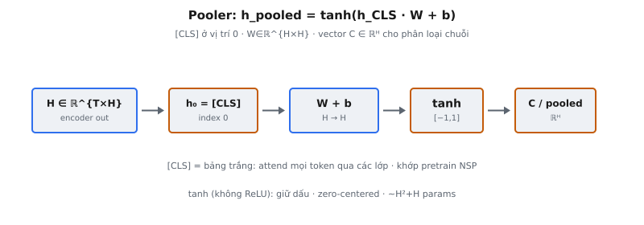

**Pooler** của BERT chuyển một chuỗi hidden state có độ dài biến đổi thành một vector cố định cho phân loại cấp chuỗi. Nó chọn hidden state tại vị trí 0 (token [CLS]) và chiếu qua một lớp dense với hàm kích hoạt tanh. Module nhỏ này nối đầu ra encoder của BERT với mọi tác vụ downstream cần một vector đại diện cho toàn bộ input.

Trong bài báo BERT (Devlin et al., 2019): "The final hidden state corresponding to this token ([CLS]) is used as the aggregate sequence representation for classification tasks. We denote this vector as C in R^H." Pooler tạo ra vector C này.

## Nó là gì / Nó làm gì

Pooler nhận tensor đầu ra encoder có shape $(B, T, H)$ và chỉ trích hidden state tại vị trí 0 (token [CLS]). Sau đó thực hiện:

- **Trích xuất:** Chọn hidden state tại index 0 theo chiều chuỗi, thu được vector shape $(B, H)$.
- **Chiếu tuyến tính:** Nhân với $W \in \mathbb{R}^{H \times H}$ và cộng bias $b \in \mathbb{R}^H$. Chiếu vuông giữ nguyên số chiều.
- **Hàm kích hoạt tanh:** Áp dụng tanh theo từng phần tử để giới hạn đầu ra trong $[-1, 1]$ và thêm phi tuyến.

Kết quả là một biểu diễn cố định bất kể độ dài input. Input có độ dài biến đổi trở thành vector đồng nhất cho phân loại.

::: {#fig-bert-pooler fig-cap="Pooler: $h_{\\mathrm{pooled}}=\\tanh(h_{\\mathrm{CLS}}\\cdot W+b)$ với $W\\in\\mathbb{R}^{H\\times H}$. $[\\mathrm{CLS}]$ ở index 0 → vector $C\\in\\mathbb{R}^H$ cho phân loại chuỗi." fig-alt="H lấy h0, dense, tanh ra C pooled."}
{fig-align="center"}
:::

## Các phương trình chính

Gọi $h_0, h_1, \ldots, h_{T-1}$ là các hidden state từ lớp Transformer cuối. Token [CLS] luôn ở vị trí 0, nên $h_{\text{CLS}} = h_0 \in \mathbb{R}^H$.

Pooler tính:

$$
h_{\text{pooled}} = \tanh(h_{\text{CLS}} \cdot W + b)
$$

- **$h_{\text{CLS}} \in \mathbb{R}^H$:** Hidden state tại vị trí 0 từ lớp encoder cuối.
- **$W \in \mathbb{R}^{H \times H}$:** Ma trận trọng số học được. Vuông vì input và output cùng số chiều.
- **$b \in \mathbb{R}^H$:** Vector bias học được.
- **$\tanh$:** Áp dụng theo từng phần tử, nén mỗi thành phần về $[-1, 1]$.

Với phân loại chuỗi, một classification head được đặt phía trên:

$$
\text{logits} = h_{\text{pooled}} \cdot W_c + b_c
$$

- **$W_c \in \mathbb{R}^{H \times C}$:** Ma trận trọng số classifier, với $C$ là số lớp.
- **$b_c \in \mathbb{R}^C$:** Vector bias classifier.
- **logits $\in \mathbb{R}^C$:** Điểm chưa chuẩn hóa đưa vào softmax để có xác suất.

Hàm tanh được định nghĩa:

$$
\tanh(x) = \frac{e^x - e^{-x}}{e^x + e^{-x}}
$$

Hàm này ánh xạ mọi giá trị thực về $(-1, 1)$. Khác sigmoid ánh xạ về $(0, 1)$, tanh có tâm tại 0, nghĩa là đầu ra có mean gần 0 hơn. Điều này quan trọng cho các lớp downstream tiêu thụ biểu diễn pooled.

## Tại sao token [CLS]

BERT thêm token đặc biệt [CLS] vào đầu mọi input. Token này không mang nghĩa ngôn ngữ. Nó đóng vai trò "bảng trắng" thu thập thông tin từ mọi token khác qua self-attention xuyên suốt các lớp encoder.

Ở mỗi lớp self-attention, [CLS] tính attention trên mọi token khác. Sau 12 hoặc 24 lớp (BERT-Base hoặc BERT-Large), hidden state của nó đã tổng hợp thông tin toàn cục của chuỗi. Tại sao cụ thể vị trí 0:

- **Vị trí nhất quán:** Bất kể độ dài chuỗi, [CLS] luôn ở index 0. Pooler trích nó bằng thao tác index đơn giản $h_0$.
- **Không bias nội dung:** [CLS] bắt đầu không có nội dung, nên hidden state cuối của nó thuần là hàm của những gì nó đã attend. Một từ như "good" mang bias cảm xúc từ embedding; [CLS] thì không.
- **Điểm quan sát trung lập:** Trong tác vụ cặp câu (như NLI), [CLS] đứng trước cả hai đoạn, attend cả hai câu như nhau.
- **Khớp pre-training:** Trong pre-training, vị trí [CLS] được dùng cho Next Sentence Prediction (NSP), huấn luyện nó mã hóa quan hệ liên câu ngay từ đầu.

Vị trí 0 là quy ước, không phải yêu cầu toán học. Mô hình kiểu GPT dùng token cuối thay thế (causal attention nghĩa là chỉ vị trí cuối mới thấy toàn bộ token trước đó). Trong bidirectional attention của BERT, mọi vị trí thấy mọi vị trí khác, nên quy ước mang lại tính nhất quán.

## Tại sao dùng tanh

Pooler dùng tanh thay vì ReLU, GELU, hoặc không có hàm kích hoạt.

### Giới hạn và tâm tại 0

Tanh giới hạn mọi thành phần của $h_{\text{pooled}}$ trong $[-1, 1]$, ngăn bất kỳ chiều nào chi phối classifier. Đầu ra tập trung quanh 0, nên gradient cho ma trận trọng số downstream được điều kiện tốt hơn và training hội tụ nhanh hơn. Đầu ra ReLU không âm (mean > 0), gây gradient zig-zag.

### Tại sao không dùng ReLU

ReLU ($\max(0, x)$) đưa các thành phần âm về 0, phá hủy thông tin hữu ích. Sau layer normalization, hidden state [CLS] có cả giá trị dương và âm. ReLU loại bỏ khoảng một nửa thông tin. Tanh giữ dấu trong khi nén độ lớn.

### So sánh với các chiến lược pooling khác

- **Mean pooling:** Lấy trung bình mọi hidden state token. Có thể làm loãng tín hiệu quan trọng nhưng nắm bắt thông tin phân tán.
- **Max pooling:** Max theo từng phần tử qua các vị trí. Nắm activation mạnh nhất mỗi chiều nhưng mất thông tin vị trí.
- **[CLS] không chiếu:** Đơn giản hơn nhưng thiếu biến đổi phi tuyến tái định hình biểu diễn.
- **Attention pooling:** Trọng số học được trên các vị trí. Linh hoạt hơn nhưng thêm tham số.

BERT dùng [CLS] + dense + tanh: đơn giản, ít tham số ($H^2 + H$), và được pre-train qua NSP.

## Bối cảnh bài báo

Trong "BERT: Pre-training of Deep Bidirectional Transformers for Language Understanding" (Devlin et al., 2019), pooler phục vụ cả pre-training và fine-tuning.

### Vector C

Bài báo định nghĩa biểu diễn cấp token $T_i$ (hidden state tại mỗi vị trí) và biểu diễn cấp chuỗi $C$ (hidden state [CLS] đã pooled). $C \in \mathbb{R}^H$ là đầu ra pooler, không phải hidden state [CLS] thô trước chiếu.

### Pre-training với NSP

BERT pre-train với Masked Language Modeling (MLM) và Next Sentence Prediction (NSP). NSP đưa $C$ vào classifier nhị phân dự đoán câu B có theo sau câu A hay không. Đây là cơ chế pre-train $W$ và $b$ của pooler, dạy nó mã hóa tính mạch lạc liên câu để khi fine-tuning đã tạo biểu diễn hữu ích.

### Fine-tuning cho phân loại

Trong fine-tuning, $C$ đi vào lớp mới khởi tạo $W_c \in \mathbb{R}^{K \times H}$ ($K$ = số nhãn). Toàn bộ mô hình được fine-tune end-to-end. Bài báo báo cáo kết quả trên SST-2, MRPC, QNLI và các tác vụ GLUE khác dùng đầu ra pooler.

### Ảnh hưởng của NSP lên chất lượng pooler

RoBERTa (Liu et al., 2019) cho thấy bỏ NSP không làm hại và có thể giúp, đặt câu hỏi liệu pre-training NSP của pooler có cung cấp khởi tạo hữu ích hay trọng số được học lại trong fine-tuning. Các mô hình bỏ NSP (RoBERTa, ALBERT) vẫn có pooler nhưng không được pre-train có ý nghĩa.

## Phân loại chuỗi so với phân loại token

BERT xử lý hai paradigm phân loại căn bản khác nhau, và pooler chỉ liên quan đến một trong hai.

### Phân loại chuỗi

Toàn bộ input nhận một nhãn duy nhất. Pooler trích biểu diễn [CLS] và classifier tạo một bộ logits cho mỗi chuỗi.

- **Phân tích cảm xúc:** "This movie was fantastic" ánh xạ sang Positive.
- **Natural Language Inference:** Phân loại cặp premise-hypothesis thành entailment, contradiction, hoặc neutral.
- **Phát hiện paraphrase:** Xác định hai câu có cùng nghĩa hay không.
- **Next Sentence Prediction:** Chính tác vụ pre-training.

Pipeline: đầu ra encoder tại vị trí 0, pooler (dense + tanh), classifier (dense + softmax). Chỉ hidden state [CLS] quan trọng; mọi biểu diễn token khác bị loại bỏ.

### Phân loại token

Mỗi token nhận nhãn riêng. Pooler không được dùng. Mọi hidden state đi qua classification head độc lập.

- **Named Entity Recognition (NER):** Mỗi token gán Person, Organization, Location, hoặc Other.
- **Part-of-Speech tagging:** Mỗi token gán noun, verb, adjective, v.v.
- **Slot filling:** Mỗi token gắn vai trò ngữ nghĩa trong hệ thống hội thoại.

Với phân loại token: $\text{logits}_i = h_i \cdot W_t + b_t$ cho mỗi token $i$. Pooler bị bỏ qua hoàn toàn. Dùng pooler cho tác vụ token sẽ gom mọi thông tin thành một vector.

## Ví dụ số

Ví dụ đồ chơi với $H = 4$ (BERT-Base dùng $H = 768$).

### Bước 1: Trích [CLS]

Đầu ra encoder cho chuỗi 3 token. Pooler chỉ lấy $h_0$:

$$
h_0 = [0.8, -0.3, 1.2, -0.5] \quad \text{([CLS])}, \quad h_1 = [0.1, 0.9, -0.4, 0.6], \quad h_2 = [-0.2, 0.5, 0.7, -0.1]
$$

### Bước 2: Chiếu tuyến tính

$$
W = \begin{bmatrix} 0.5 & 0.1 & -0.3 & 0.2 \\ -0.1 & 0.4 & 0.6 & -0.2 \\ 0.3 & -0.5 & 0.2 & 0.7 \\ 0.2 & 0.3 & -0.1 & 0.4 \end{bmatrix}, \quad b = [0.1, 0.0, -0.1, 0.05]
$$

$z = h_0 \cdot W + b$. Tính từng thành phần:

$$
z_0 = (0.8)(0.5) + (-0.3)(-0.1) + (1.2)(0.3) + (-0.5)(0.2) + 0.1 = 0.79
$$

$$
z_1 = (0.8)(0.1) + (-0.3)(0.4) + (1.2)(-0.5) + (-0.5)(0.3) + 0.0 = -0.79
$$

$$
z_2 = (0.8)(-0.3) + (-0.3)(0.6) + (1.2)(0.2) + (-0.5)(-0.1) - 0.1 = -0.23
$$

$$
z_3 = (0.8)(0.2) + (-0.3)(-0.2) + (1.2)(0.7) + (-0.5)(0.4) + 0.05 = 0.91
$$

### Bước 3: Tanh

$$
\tanh(0.79) = \frac{e^{0.79} - e^{-0.79}}{e^{0.79} + e^{-0.79}} = \frac{2.2034 - 0.4538}{2.2034 + 0.4538} \approx 0.659
$$

$$
\tanh(-0.79) \approx -0.659, \quad \tanh(-0.23) \approx -0.226, \quad \tanh(0.91) \approx 0.723
$$

$$
h_{\text{pooled}} = [0.659, -0.659, -0.226, 0.723]
$$

Mọi giá trị nằm trong $[-1, 1]$. Tanh nén độ lớn trong khi giữ dấu.

### Bước 4: Classifier

Classifier cảm xúc nhị phân với $W_c \in \mathbb{R}^{4 \times 2}$, $b_c \in \mathbb{R}^2$:

$$
W_c = \begin{bmatrix} 0.6 & -0.4 \\ -0.3 & 0.5 \\ 0.2 & -0.1 \\ 0.4 & -0.6 \end{bmatrix}, \quad b_c = [0.1, -0.1]
$$

$$
\text{logit}_0 = (0.659)(0.6) + (-0.659)(-0.3) + (-0.226)(0.2) + (0.723)(0.4) + 0.1 = 0.937
$$

$$
\text{logit}_1 = (0.659)(-0.4) + (-0.659)(0.5) + (-0.226)(-0.1) + (0.723)(-0.6) - 0.1 = -1.104
$$

Softmax: $P(\text{Positive}) = \frac{e^{0.937}}{e^{0.937} + e^{-1.104}} \approx \frac{2.552}{2.552 + 0.332} \approx 0.885$. Mô hình dự đoán Positive với độ tin cậy 88.5%.

## Bối cảnh hiện đại

Kể từ khi BERT xuất bản, cộng đồng đã xem xét lại và thường chuyển khỏi pooling [CLS].

### Mean pooling thường vượt trội [CLS]

Sentence-BERT (Reimers and Gurevych, 2019) cho thấy mean pooling tạo embedding câu tốt hơn [CLS] cho semantic similarity. Lấy trung bình phân bổ biểu diễn qua mọi token thay vì dựa vào một vị trí. Mean pooling trở thành mặc định trong Sentence Transformers và các mô hình như all-MiniLM.

### Một số mô hình bỏ pooler hoàn toàn

RoBERTa bỏ NSP, nên pooler không được pre-train có ý nghĩa. Thực hành viên bỏ qua nó và dùng [CLS] thô hoặc mean pooling. DistilBERT bỏ pooler hoàn toàn.

### Mô hình decoder-only dùng token cuối

Mô hình kiểu GPT dùng causal attention nơi mỗi vị trí chỉ attend các vị trí trước. Chỉ token cuối thấy toàn bộ input, nên mô hình decoder-only dùng last-token pooling — đối xứng với cách BERT dùng token đầu.

### Contrastive learning thay đổi bức tranh

SimCSE (Gao et al., 2021) cho thấy chất lượng biểu diễn phụ thuộc mục tiêu training hơn chiến lược pooling. Với contrastive pre-training, ngay cả pooling [CLS] cũng tạo embedding xuất sắc. Quan trọng là mục tiêu, không phải cơ chế pooling.

## Các lỗi thường gặp

### Trích sai vị trí

[CLS] luôn ở vị trí 0. Lỗi phổ biến là dùng vị trí -1 (token cuối). Trích xuất phải là `hidden_states[:, 0,:]`. Vị trí -1 cho [SEP] hoặc padding token, không mang thông tin đúng.

### Quên hàm kích hoạt tanh

Triển khai pooler không có tanh thay đổi phân phối đầu ra. Biểu diễn trở nên không giới hạn, không khớp trọng số pre-trained kỳ vọng input trong $[-1, 1]$.

### Sai shape ma trận trọng số

Ma trận trọng số pooler phải là $H \times H$ (vuông). Lỗi phổ biến là tạo $H \times C$ với $C$ là số lớp, nhầm pooler với classifier. Chúng tách biệt: pooler chiếu $H \to H$ với tanh, rồi classifier chiếu $H \to C$ không có tanh.

### Dùng pooler cho phân loại token

Pooler tạo một vector cho toàn chuỗi. Với tác vụ cấp token (NER, POS tagging), cần biểu diễn theo từng token. Phân loại token phải dùng trực tiếp chuỗi hidden state đầy đủ $h_0, h_1, \ldots, h_{T-1}$, bỏ qua pooler.

### Pooler không pre-train khi bỏ NSP

Mô hình pre-train không có NSP (RoBERTa) có trọng số pooler chưa được huấn luyện. Các lựa chọn: (1) dùng [CLS] thô, (2) dùng mean pooling, hoặc (3) chấp nhận pooler học từ đầu trong fine-tuning.

### Nhầm đầu ra pooler với hidden state thô

Trong HuggingFace, `outputs.last_hidden_state[:, 0]` là hidden state [CLS] thô trước pooler; `outputs.pooler_output` là sau dense + tanh. Đây là hai tensor khác nhau với phân phối khác nhau. Dùng sai gây bug tinh vi.


## Code
```python
import numpy as np

def tanh(x):
    return np.tanh(x)

class BertPooler:
    def __init__(self, hidden_size: int):
        self.hidden_size = hidden_size
        self.W = np.random.randn(hidden_size, hidden_size) * 0.02
        self.b = np.zeros(hidden_size)

    def forward(self, hidden_states: np.ndarray) -> np.ndarray:
        cls_hidden = hidden_states[:, 0, :]
        pooled = cls_hidden @ self.W + self.b
        return tanh(pooled)

class SequenceClassifier:
    def __init__(self, hidden_size: int, num_classes: int):
        self.pooler = BertPooler(hidden_size)
        self.classifier = np.random.randn(hidden_size, num_classes) * 0.02

    def forward(self, hidden_states: np.ndarray) -> np.ndarray:
        pooled = self.pooler.forward(hidden_states)
        return pooled @ self.classifier

```
