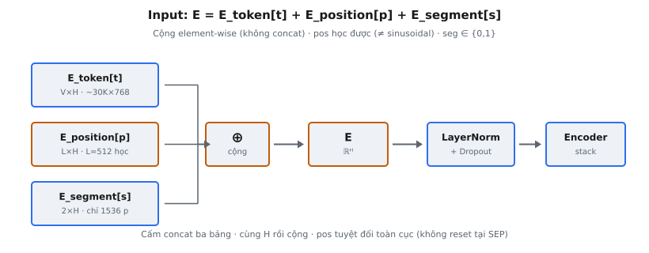
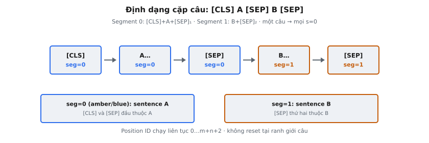

Segment embedding là một trong ba thành phần embedding mà BERT (Devlin et al., 2019) cộng để tạo biểu diễn đầu vào của mỗi token. Trong khi token embedding mã hóa danh tính từ và position embedding mã hóa thứ tự tuần tự, segment embedding cho mô hình biết token thuộc câu nào. Điều này cần thiết vì nhiều tác vụ NLP — natural language inference, question answering, paraphrase detection — đòi hỏi suy luận đồng thời về cặp câu.

Segment embedding đơn giản nhất trong ba thành phần: bảng tra cứu chỉ hai hàng, một cho sentence A (segment 0) và một cho sentence B (segment 1). Mỗi token nhận một trong hai vector này theo câu nó thuộc về.

## Nó là gì / Nó làm gì

BERT xây biểu diễn đầu vào của mỗi token bằng cách cộng ba embedding riêng:

* **Token embedding:** Ánh xạ chỉ số vocabulary của token sang vector dense. Shape bảng tra cứu: (vocab_size, hidden_size).
* **Position embedding:** Ánh xạ vị trí tuyệt đối của token trong chuỗi sang vector dense. Shape bảng tra cứu: (max_position_embeddings, hidden_size). Các vector này được học, không phải sinusoidal.
* **Segment embedding:** Ánh xạ chỉ báo nhị phân (0 hoặc 1) sang vector dense. Shape bảng tra cứu: (2, hidden_size). Token sentence A nhận segment 0, token sentence B nhận segment 1.

Input cuối vào stack encoder Transformer là tổng element-wise của cả ba vector. Tổng này đi qua LayerNorm và dropout trước khi vào block Transformer đầu tiên.

Segment embedding tồn tại vì BERT được thiết kế từ đầu cho tác vụ cặp câu. Tác vụ như natural language inference yêu cầu mô hình so sánh hai câu, nên cần cơ chế phân biệt token thuộc câu nào. Segment embedding cung cấp tín hiệu này ở tầng embedding, trước mọi phép tính self-attention.

::: {#fig-bert-embeddings fig-cap="Input BERT: $E=E_{\\mathrm{token}}[t]+E_{\\mathrm{position}}[p]+E_{\\mathrm{segment}}[s]$ (cộng, không concat). Position học được ($L=512$), không sinusoidal; rồi LayerNorm + Dropout vào encoder." fig-alt="Ba bảng embedding cộng thành E rồi LayerNorm vào Encoder."}
{fig-align="center"}
:::

## Các phương trình chính

Với token tại vị trí $p$, chỉ số vocabulary $t$ và nhãn segment $s \in \{0, 1\}$, biểu diễn đầu vào $E$ là:

$$
E = E_{\text{token}}[t] + E_{\text{position}}[p] + E_{\text{segment}}[s]
$$

Mỗi số hạng là tra cứu vào bảng embedding học được:

* **$E_{\text{token}} \in \mathbb{R}^{V \times H}$:** Bảng token embedding, với $V$ là kích thước vocabulary (30.522 cho BERT-base với WordPiece) và $H$ là hidden size (768 cho BERT-base). Tra cứu $E_{\text{token}}[t]$ trả về vector trong $\mathbb{R}^H$.
* **$E_{\text{position}} \in \mathbb{R}^{L \times H}$:** Bảng position embedding, với $L$ là độ dài chuỗi tối đa (512 cho BERT). Tra cứu $E_{\text{position}}[p]$ trả về vector trong $\mathbb{R}^H$.
* **$E_{\text{segment}} \in \mathbb{R}^{2 \times H}$:** Bảng segment embedding đúng hai hàng. Tra cứu $E_{\text{segment}}[s]$ trả về vector trong $\mathbb{R}^H$.

Nhãn segment $s$ được xác định theo thành viên câu:

$$
s_i = \begin{cases} 0 & \text{nếu token } i \text{ thuộc sentence A (kể cả [CLS] và [SEP] đầu)} \\ 1 & \text{nếu token } i \text{ thuộc sentence B (kể cả [SEP] thứ hai)} \end{cases}
$$

Cả ba embedding phải cùng chiều $H$ vì được cộng element-wise, không nối (concatenate). Nối sẽ gấp ba hidden dimension, không phải cách BERT làm.

Tổng tham số học được trong bảng segment embedding là $2 \times H$. Với BERT-base ($H = 768$), chỉ 1.536 tham số — nhỏ bé so với bảng token embedding $30{,}522 \times 768 = 23{,}440{,}896$ tham số.

## Vì sao BERT cần segment embedding

Nhiều tác vụ NLP quan trọng vốn dĩ về quan hệ giữa hai chuỗi văn bản:

* **Natural language inference (NLI):** Cho premise và hypothesis, phân loại entailment, contradiction hay neutral. Mô hình phải biết câu nào là premise và câu nào là hypothesis.
* **Question answering (QA):** Cho câu hỏi và đoạn văn, tìm span trả lời trong đoạn. Mô hình phải phân biệt token câu hỏi và token đoạn văn.
* **Paraphrase detection:** Cho hai câu, xác định có cùng nghĩa không. Mô hình phải so sánh câu này với câu kia.
* **Sentence similarity:** Cho hai câu, tính điểm tương đồng. Mô hình vẫn cần biết token thuộc câu nào.

Không có segment embedding, mô hình chỉ dựa vào token [SEP] để suy ranh giới câu. Nhưng [SEP] chỉ đánh dấu ranh giới tại một vị trí — không lan truyền thành viên câu đến mọi token. Segment embedding giải quyết bằng cách bơm thành viên trực tiếp vào biểu diễn mỗi token ở tầng input, cho Transformer tín hiệu sạch, không mơ hồ từ lớp đầu tiên.

## Định dạng input

::: {#fig-bert-segments fig-cap="Cặp câu: $[\\mathrm{CLS}]\\,A\\,[\\mathrm{SEP}]\\,B\\,[\\mathrm{SEP}]$. Segment $0$ cho $[\\mathrm{CLS}]+A+[\\mathrm{SEP}]_1$; segment $1$ cho $B+[\\mathrm{SEP}]_2$. Position ID tuyệt đối liên tục (không reset)." fig-alt="Năm ô token với seg 0 hoặc 1."}
{fig-align="center"}
:::

Input BERT cho cặp câu tuân theo định dạng cố định:

$$
[\text{CLS}] \; w_1^A \; w_2^A \; \ldots \; w_m^A \; [\text{SEP}] \; w_1^B \; w_2^B \; \ldots \; w_n^B \; [\text{SEP}]
$$

Các segment ID tương ứng:

$$
\underbrace{0 \; 0 \; 0 \; \ldots \; 0 \; 0}_{\text{[CLS] + sentence A + [SEP]}} \; \underbrace{1 \; 1 \; 1 \; \ldots \; 1 \; 1}_{\text{sentence B + [SEP]}}
$$

Chi tiết về định dạng input:

* **[CLS] nhận segment 0.** Luôn thuộc segment của sentence A. Trạng thái ẩn cuối của nó dùng làm biểu diễn chuỗi tổng hợp cho phân loại.
* **[SEP] đầu nhận segment 0.** Dấu phân cách sau sentence A thuộc segment của sentence A.
* **[SEP] thứ hai nhận segment 1.** Dấu phân cách sau sentence B thuộc segment của sentence B.
* **Position ID là toàn cục.** Vị trí chạy từ 0 đến $m + n + 2$ (tổng token trừ 1), liên tục qua cả hai câu. Không reset tại ranh giới câu.

Với tác vụ một câu (sentiment analysis, named entity recognition), chỉ dùng sentence A:

$$
[\text{CLS}] \; w_1 \; w_2 \; \ldots \; w_m \; [\text{SEP}]
$$

Mọi segment ID đều là 0 trong trường hợp một câu. Hàng segment B ($E_{\text{segment}}[1]$) đơn giản không được truy cập.

## Bối cảnh bài báo

Devlin et al. mô tả biểu diễn input ở Mục 3 của "BERT: Pre-training of Deep Bidirectional Transformers for Language Understanding" (2019). Bài báo nêu: "We differentiate the sentences in two ways. First, we separate them with a special token ([SEP]). Second, we add a learned embedding to every token indicating whether it belongs to sentence A or sentence B."

Segment embedding được thúc đẩy bởi mục tiêu pre-training Next Sentence Prediction (NSP) của BERT. BERT nhận cặp câu và dự đoán sentence B có thực sự theo sau sentence A trong corpus hay được lấy mẫu ngẫu nhiên. Phân loại nhị phân này dùng biểu diễn cuối của [CLS], nên mô hình cần segment embedding để phân biệt hai câu.

BERT dùng position embedding học được, không phải mã hóa sinusoidal từ Transformer gốc (Vaswani et al., 2017). Transformer gốc định nghĩa $\text{PE}(pos, 2i) = \sin(pos / 10000^{2i/d})$ và $\text{PE}(pos, 2i+1) = \cos(pos / 10000^{2i/d})$. BERT thay bằng bảng position embedding học hoàn toàn, đổi khả năng ngoại suy lấy biểu diễn tối ưu trong pre-training. Điều này giới hạn BERT ở chuỗi tối đa 512 token.

Bài báo lưu ý "sentence" trong ngữ cảnh BERT là tên gọi không chính xác — một "sentence" có thể là bất kỳ đoạn văn liên tục nào, không nhất thiết là câu ngôn ngữ học. Mỗi input pre-training gồm hai "segment" có thể chứa nhiều câu thực sự. Đó là lý do "segment embedding" chính xác hơn "sentence embedding."

## Ví dụ số

Xét cặp câu: "The cat sat" (sentence A) và "It slept" (sentence B). Sau tokenization WordPiece, giả sử token và chỉ số vocabulary là:

* **[CLS]:** token_id = 101
* **The:** token_id = 1996
* **cat:** token_id = 4937
* **sat:** token_id = 2938
* **[SEP]:** token_id = 102
* **It:** token_id = 2009
* **slept:** token_id = 14195
* **[SEP]:** token_id = 102

Ba chuỗi ID cho input này:

* **token_ids:** [101, 1996, 4937, 2938, 102, 2009, 14195, 102]
* **position_ids:** [0, 1, 2, 3, 4, 5, 6, 7]
* **segment_ids:** [0, 0, 0, 0, 0, 1, 1, 1]

Xét tra cứu embedding cho token "cat" tại vị trí 2 (segment A) và token "slept" tại vị trí 6 (segment B). Giả sử hidden_size nhỏ $H = 4$ để minh họa.

Với "cat" (token_id=4937, position=2, segment=0):

$$
E_{\text{token}}[4937] = [0.12, -0.45, 0.78, 0.33]
$$

$$
E_{\text{position}}[2] = [0.05, 0.11, -0.03, 0.22]
$$

$$
E_{\text{segment}}[0] = [0.08, -0.14, 0.06, 0.19]
$$

$$
E_{\text{cat}} = [0.12 + 0.05 + 0.08, \; -0.45 + 0.11 + (-0.14), \; 0.78 + (-0.03) + 0.06, \; 0.33 + 0.22 + 0.19]
$$

$$
E_{\text{cat}} = [0.25, \; -0.48, \; 0.81, \; 0.74]
$$

Với "slept" (token_id=14195, position=6, segment=1):

$$
E_{\text{token}}[14195] = [-0.31, 0.56, 0.14, -0.27]
$$

$$
E_{\text{position}}[6] = [0.18, -0.07, 0.29, 0.03]
$$

$$
E_{\text{segment}}[1] = [-0.11, 0.22, -0.09, 0.15]
$$

$$
E_{\text{slept}} = [-0.31 + 0.18 + (-0.11), \; 0.56 + (-0.07) + 0.22, \; 0.14 + 0.29 + (-0.09), \; -0.27 + 0.03 + 0.15]
$$

$$
E_{\text{slept}} = [-0.24, \; 0.71, \; 0.34, \; -0.09]
$$

"cat" nhận $E_{\text{segment}}[0] = [0.08, -0.14, 0.06, 0.19]$ còn "slept" nhận $E_{\text{segment}}[1] = [-0.11, 0.22, -0.09, 0.15]$. Hai vector khác nhau, nên trước khi self-attention bắt đầu mô hình đã có tín hiệu hai token thuộc câu khác nhau.

Mọi token sentence A được cộng cùng $E_{\text{segment}}[0]$; mọi token sentence B được cộng $E_{\text{segment}}[1]$. Tín hiệu cộng đồng nhất này là thứ Transformer dùng để học biểu diễn nhận biết câu.

## Bối cảnh hiện đại

Kể từ khi BERT ra mắt, nhiều quyết định kiến trúc quanh embedding đã tiến hóa đáng kể.

**Position embedding: từ học sang rotary.** Mô hình hiện đại như LLaMA và Mistral dùng Rotary Position Embeddings (RoPE, Su et al., 2021), mã hóa vị trí tương đối bằng cách xoay vector query và key. RoPE nắm khoảng cách tương đối giữa token và có thể ngoại suy độ dài chuỗi chưa thấy. Position học của BERT giới hạn ở max_position_embeddings = 512.

**Segment embedding: đôi khi không cần.** RoBERTa (Liu et al., 2019) chứng minh mục tiêu Next Sentence Prediction — lý do chính segment embedding tồn tại — thực ra làm hại hiệu năng downstream. RoBERTa bỏ NSP và đặt mọi segment ID bằng 0 trong pre-training, khiến segment embedding trở thành bias cộng hằng số được các tham số khác hấp thụ. Điều này cho thấy thành viên câu có thể học ngầm qua cơ chế khác.

**Mô hình decoder-only không dùng segment embedding.** GPT-2, GPT-3, LLaMA, Mistral và các mô hình autoregressive khác xử lý một chuỗi token liên tục, không có khái niệm sentence A vs B. Phân biệt multi-turn được mã hóa qua special token và định dạng trong văn bản, không qua bảng embedding riêng.

**Factored embedding của ALBERT.** ALBERT (Lan et al., 2020) phân tách token embedding thành hai ma trận nhỏ hơn ($V \times E$ rồi $E \times H$ với $E \ll H$), giảm mạnh tham số. Vẫn giữ segment embedding.

**Relative segment của XLNet.** XLNet (Yang et al., 2019) thay segment embedding tuyệt đối kiểu BERT bằng mã hóa segment tương đối, tính attention bias theo hai token cùng hay khác segment thay vì gán vector cố định mỗi segment.

## Các lỗi thường gặp

### Segment ID sai cho input một câu

Khi fine-tuning trên tác vụ một câu, mọi segment ID phải là 0. Dùng segment 1 sẽ cộng vector bias không mong đợi vào mọi token, làm giảm hiệu năng. Hầu hết implementation tokenizer mặc định toàn số 0, nhưng pipeline tiền xử lý tùy chỉnh có thể không.

### Quên [CLS] nhận segment 0

Token [CLS] luôn nhận segment ID 0. Trong pre-training, biểu diễn [CLS] cấp cho head phân loại NSP. Nếu [CLS] được segment 1, head pretrained sẽ thấy phân phối input chưa từng huấn luyện, và fine-tuning downstream trên phân loại khởi đầu từ initialization kém.

### Lỗi off-by-one position ID

Position ID chạy liên tục từ 0 qua cả hai câu. Không reset tại đầu sentence B. [CLS] là vị trí 0, sentence A chiếm 1 đến $m$, [SEP] đầu là $m+1$, sentence B bắt đầu $m+2$, [SEP] thứ hai tại $m+n+2$. Reset vị trí tại ranh giới sẽ tái sử dụng embedding và gây nhầm lẫn cho mô hình.

### Nhầm chiều bảng embedding

Ba bảng embedding có chiều thứ nhất rất khác nhau nhưng chiều thứ hai giống nhau:

* **Token:** (30522, 768) — 30.522 mục vocabulary
* **Position:** (512, 768) — 512 vị trí có thể
* **Segment:** (2, 768) — 2 segment có thể

Nhầm lẫn phổ biến là nói shape (768, 2). Trong PyTorch `nn.Embedding`, convention là (num_embeddings, embedding_dim), nên chiều đầu luôn là số mục rời rạc. Transpose sẽ cho tra cứu sai.

### Nối thay vì cộng

BERT cộng element-wise ba embedding, tạo vector chiều $H$. Không nối thành vector chiều $3H$. Cộng giữ hidden dimension mà các lớp Transformer kỳ vọng; nối sẽ tạo input rộng gấp ba và fail tại lớp attention đầu tiên.

### Giả định hơn hai segment

Bảng segment embedding của BERT đúng 2 hàng. Không xử lý ba segment trở lên mà không sửa đổi. Cách xử lý gồm nối thêm văn bản vào một segment, thêm hàng (cần huấn luyện lại), hoặc dùng separator token không phân biệt segment.


## Code
```python
import numpy as np

class BertEmbeddings:
    def __init__(self, vocab_size: int, max_position: int, hidden_size: int):
        self.hidden_size = hidden_size
        self.token_embeddings = np.random.randn(vocab_size, hidden_size) * 0.02
        self.position_embeddings = np.random.randn(max_position, hidden_size) * 0.02
        self.segment_embeddings = np.random.randn(2, hidden_size) * 0.02

    def forward(self, token_ids: np.ndarray, segment_ids: np.ndarray) -> np.ndarray:
        batch_size, seq_len = token_ids.shape
        tok_emb = self.token_embeddings[token_ids]
        positions = np.arange(seq_len)
        pos_emb = self.position_embeddings[positions]
        seg_emb = self.segment_embeddings[segment_ids]
        return tok_emb + pos_emb + seg_emb

```
