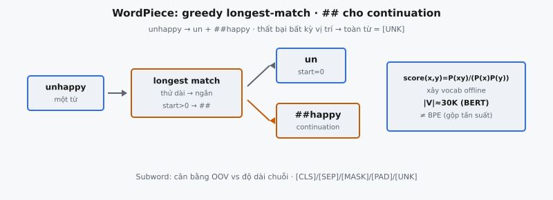

WordPiece là thuật toán subword tokenization phân tách văn bản thành các đơn vị subword rút từ một vocabulary cố định. Được Schuster và Nakajima (2012) giới thiệu cho phân đoạn tiếng Nhật và Hàn, sau đó được BERT (Devlin et al., 2018) dùng làm tokenizer cốt lõi. Thuật toán dùng greedy longest-match-first: với một từ, nó tìm prefix dài nhất trong vocabulary, phát token đó, rồi tiếp tục từ vị trí còn lại.

Trong BERT, WordPiece hoạt động trên vocabulary 30.000 token. Mỗi câu input trước hết được tách thành các từ phân cách bằng khoảng trắng, rồi mỗi từ được phân rã thành các token WordPiece. Subword token đầu tiên giữ nguyên dạng gốc; mọi subword token tiếp theo trong cùng từ được thêm prefix `##` để báo hiệu phần tiếp nối. Nếu thuật toán không thể phân đoạn từ nào, toàn bộ từ được thay bằng `[UNK]`.

## Nó là gì / Nó làm gì

Tokenization chuyển văn bản thô thành các đơn vị rời rạc mà mô hình xử lý được. Ba chiến lược rộng tồn tại:

* **Tokenization cấp từ:** Mỗi từ phân tách bằng khoảng trắng trở thành một token. Cách này tạo vocabulary khổng lồ (chỉ riêng tiếng Anh đã có hàng trăm nghìn dạng từ) và gây lỗi out-of-vocabulary (OOV) trên từ chưa thấy.
* **Tokenization cấp ký tự:** Mỗi ký tự trở thành một token. Vocabulary rất nhỏ và OOV bị loại bỏ, nhưng chuỗi trở nên cực dài, khiến self-attention tốn $O(n^2)$. Từng ký tự mang ít thông tin ngữ nghĩa.
* **Subword tokenization:** Từ được tách thành các mảnh cân bằng tần suất và độ phủ. Từ thường gặp giữ nguyên ("the", "is"), từ hiếm được phân rã thành sub-unit có nghĩa ("un", "##happi", "##ness"). Vocabulary gọn và OOV được xử lý êm.

WordPiece duy trì vocabulary cố định các đơn vị subword phủ toàn bộ văn bản huấn luyện. Từ thường gặp xuất hiện dưới dạng token đơn; từ hiếm phân rã thành subword đã biết mang một phần ngữ nghĩa. Đó là lý do BERT xử lý lỗi chính tả, từ mới và biến thể hình thái mà không cần `[UNK]`.

Prefix `##` phân biệt token đầu từ với phần tiếp nối. "un" mở đầu "unhappy" là token `un`, còn "un" giữa từ sẽ là `##un`. Điều này cho phép mô hình tái tạo ranh giới từ từ một chuỗi token phẳng.

::: {#fig-bert-wordpiece fig-cap="WordPiece greedy longest-match: tại mỗi vị trí thử substring dài nhất trong $V$; $\\texttt{\\#\\#}$ khi $\\mathrm{start}>0$; thất bại → toàn từ $[\\mathrm{UNK}]$. Vocab offline tối đa hóa $\\mathrm{score}(x,y)=P(xy)/(P(x)P(y))$." fig-alt="Từ unhappy qua longest match ra un và ##happy; panel score PMI."}
{fig-align="center"}
:::

## Các phương trình chính

Tokenization WordPiece lúc inference được định nghĩa bởi thuật toán greedy chứ không phải phương trình dạng đóng. Logic cốt lõi có thể diễn đạt chính thức như sau.

Gọi $w = c_1 c_2 \dots c_n$ là một từ gồm $n$ ký tự, và $V$ là vocabulary. Định nghĩa hàm tokenization $\text{WordPiece}(w, V)$:

**Khởi tạo:**

$$
\text{tokens} = [\,], \quad \text{start} = 0
$$

**Trong khi** $\text{start} < n$:

$$
\text{end} = n, \quad \text{cur\_substr} = \text{None}
$$

**Trong khi** $\text{start} < \text{end}$:

$$
\text{substr} = \begin{cases} w[\text{start}:\text{end}] & \text{nếu } \text{start} = 0 \\ \texttt{\#\#} + w[\text{start}:\text{end}] & \text{nếu } \text{start} > 0 \end{cases}
$$

$$
\text{nếu } \text{substr} \in V: \quad \text{cur\_substr} = \text{substr}, \quad \text{break}
$$

$$
\text{end} = \text{end} - 1
$$

**Nếu** $\text{cur\_substr}$ là None: trả về $[\texttt{[UNK]}]$

$$
\text{tokens.append}(\text{cur\_substr}), \quad \text{start} = \text{end}
$$

**Trả về** tokens

Ý chính là greedy longest-match: tại mỗi vị trí, thử substring dài nhất trước rồi thu nhỏ cho đến khi khớp vocabulary. Độ phức tạp worst-case là $O(n^2)$ với từ dài $n$, dù thực tế từ thường ngắn và tra cứu vocabulary dùng hash set cho kiểm tra thành viên $O(1)$.

Giai đoạn xây vocabulary (offline, trước huấn luyện) dùng tiêu chí khác. WordPiece gộp cặp token $(x, y)$ tối đa hóa:

$$
\text{score}(x, y) = \frac{P(xy)}{P(x) \cdot P(y)}
$$

trong đó $P$ là tần suất trên corpus. Đây là pointwise mutual information — ưu tiên gộp các cặp đồng xuất hiện nhiều hơn kỳ vọng ngẫu nhiên, không chỉ các cặp tần suất tuyệt đối cao.

## Các bước thuật toán

Thuật toán tokenization WordPiece cho một từ đơn diễn ra như sau:

* **Bước 1 — Đặt con trỏ start tại vị trí 0.** Token đầu tiên phát ra sẽ không có prefix `##`.
* **Bước 2 — Đặt con trỏ end bằng độ dài từ.** Substring ứng viên là `word[start:end]`. Thử substring dài nhất trước.
* **Bước 3 — Kiểm tra ứng viên có trong vocabulary không.** Nếu `start > 0`, thêm `##` trước khi kiểm tra. Nếu tìm thấy, phát token và chuyển Bước 5.
* **Bước 4 — Thu nhỏ ứng viên.** Giảm `end` đi 1 và lặp Bước 3. Nếu `end` chạm `start` mà vẫn không khớp, trả về `[UNK]` cho toàn bộ từ.
* **Bước 5 — Tiến con trỏ start.** Đặt `start = end`. Nếu `start` đã tới cuối từ thì xong. Ngược lại quay Bước 2.

Chi tiết quan trọng:

* **Prefix `##` chỉ thêm khi `start > 0`.** Subword đầu của mỗi từ không có prefix. Mọi subword tiếp nối mang `##`.
* **Thất bại là all-or-nothing.** Nếu tại bất kỳ vị trí nào thuật toán không tìm được khớp kể cả một ký tự, toàn bộ từ gốc trở thành `[UNK]`. Kết quả một phần bị loại bỏ.
* **Greedy không đảm bảo phân đoạn tối ưu toàn cục.** Khớp dài nhất tại vị trí $i$ có thể chặn phân đoạn tốt hơn toàn cục. WordPiece chấp nhận đánh đổi này để nhanh.
* **Vocabulary phải chứa mọi ký tự đơn lẻ từ dữ liệu huấn luyện.** Thiếu một ký tự thì mọi từ chứa ký tự đó trở thành `[UNK]`.

## Bối cảnh bài báo

Bài báo BERT gốc (Devlin et al., 2018) nêu: "We use WordPiece embeddings with a 30,000 token vocabulary." WordPiece đặt trong BERT như sau:

**Xây vocabulary.** Vocabulary 30K được xây offline trước huấn luyện. Bắt đầu từ từng ký tự đơn lẻ, thuật toán lặp gộp các cặp token tối đa hóa likelihood corpus. Khác BPE, vốn gộp cặp tần suất cao nhất. Quá trình lặp đến khi đạt 30.000 token.

**Special token.** Vocabulary BERT gồm năm special token:

* **[CLS]:** Thêm vào đầu mọi input. Trạng thái ẩn cuối của nó phục vụ biểu diễn chuỗi cho phân loại.
* **[SEP]:** Chèn giữa cặp câu và ở cuối. Đánh dấu ranh giới câu.
* **[PAD]:** Lấp chuỗi đến độ dài đồng nhất. Bị mask trong attention.
* **[MASK]:** Thay token trong pre-training Masked Language Model. Mô hình dự đoán token gốc từ ngữ cảnh.
* **[UNK]:** Đại diện từ không thể phân đoạn thành subword đã biết.

**Mô hình cased và uncased.** Mô hình uncased lowercases văn bản và bỏ dấu, giảm áp lực vocabulary nhưng mất thông tin hoa thường. Mô hình cased giữ hoa thường, quan trọng cho NER khi "Apple" (công ty) khác "apple" (quả).

**Biểu diễn input.** Sau tokenization, mỗi token nhận ba embedding cộng element-wise:

* **Token embedding:** Vector học được cho mỗi mục vocabulary (30.000 vector).
* **Segment embedding:** Chỉ Sentence A hay Sentence B (hai vector).
* **Position embedding:** Mã hóa vị trí tuyệt đối (tối đa 512 vector).

**Độ dài chuỗi tối đa.** BERT hỗ trợ tối đa 512 token WordPiece kể cả [CLS] và [SEP]. Mở rộng subword nghĩa là cửa sổ ngữ cảnh cấp từ thực tế ngắn hơn 512.

## WordPiece so với BPE và Unigram

Ba thuật toán subword tokenization chi phối NLP hiện đại. Chúng cùng mục tiêu phân rã văn bản thành subword nhưng khác cách xây vocabulary và phân đoạn lúc inference.

* **BPE (GPT, GPT-2, GPT-3, RoBERTa):** Xây bottom-up bằng cách gộp cặp kề nhau tần suất cao nhất. Inference phát lại các lần gộp theo thứ tự đã học. Xác định.
* **WordPiece (BERT, DistilBERT, ELECTRA):** Xây bottom-up bằng cách gộp cặp tối đa hóa $P(xy) / (P(x) \cdot P(y))$ — lợi likelihood thay vì tần suất thô. Inference dùng greedy longest-match trên vocabulary cuối; lịch sử gộp bị bỏ. Xác định.
* **Unigram (T5, XLNet, ALBERT, mBART):** Xây top-down bằng cách bắt đầu vocabulary lớn rồi cắt token mà việc bỏ ít làm giảm likelihood corpus nhất. Inference tìm phân đoạn tối ưu bằng Viterbi. Có thể lấy mẫu nhiều phân đoạn cho subword regularization.

**Phân biệt chính:**

* **Hướng xây:** BPE và WordPiece gộp bottom-up. Unigram cắt top-down.
* **Tiêu chí gộp/cắt:** BPE dùng tần suất. WordPiece dùng tỷ lệ likelihood. Unigram dùng mất likelihood khi bỏ token.
* **Inference:** BPE phát lại gộp. WordPiece dùng greedy longest-match. Unigram dùng Viterbi hoặc lấy mẫu.

## Ví dụ số

Xét tokenization "unhappiness" với vocabulary $V = \{$"un", "happy", "##happi", "##happiness", "##ness", "##i", "##n", "##e", "##s", "a", "h", "i", "n", "p", "s", "u", "e",...$\}$

**Lần lặp 1 (start=0):**

* **Thử** word[0:11] = "unhappiness". Không có trong $V$.
* **Thử** word[0:10] đến word[0:3]. Không có trong $V$.
* **Thử** word[0:2] = "un". Tìm thấy! Phát "un". Đặt start=2.

**Lần lặp 2 (start=2):**

* **Thử** "##" + word[2:11] = "##happiness". Tìm thấy! Phát "##happiness". Đặt start=11.

**start=11 = độ dài từ. Kết quả:** ["un", "##happiness"]

Với $V_2$ không có "##happiness" nhưng có "##happi" và "##ness":

**Lần lặp 1 (start=0):**

* **Thử** word[0:11] đến word[0:3]. Không tìm thấy.
* **Thử** word[0:2] = "un". Tìm thấy! Phát "un". Đặt start=2.

**Lần lặp 2 (start=2):**

* **Thử** "##" + word[2:11] đến "##" + word[2:8]. Không có trong $V_2$.
* **Thử** "##" + word[2:7] = "##happi". Tìm thấy! Phát "##happi". Đặt start=7.

**Lần lặp 3 (start=7):**

* **Thử** "##" + word[7:11] = "##ness". Tìm thấy! Phát "##ness". Đặt start=11.

**Kết quả:** ["un", "##happi", "##ness"]

Cùng một từ cho hai token với $V$ và ba token với $V_2$. Thành phần vocabulary quyết định trực tiếp độ mịn phân đoạn. Cả hai trường hợp thuật toán greedy lấy khớp dài nhất có sẵn tại mỗi vị trí.

**Trường hợp [UNK].** Nếu tokenization "cafe" có dấu trên ký tự cuối nhưng ký tự có dấu không có trong vocabulary, thuật toán thất bại tại vị trí đó và toàn bộ từ trở thành [UNK]. "cafe" không dấu tokenization bình thường — đó là lý do mô hình uncased của BERT bỏ dấu.

## Bối cảnh hiện đại

WordPiece là state-of-the-art khi BERT ra mắt năm 2018, nhưng tokenization đã tiến hóa đáng kể.

**SentencePiece (Kudo, 2018).** Thư viện độc lập ngôn ngữ coi input là luồng byte thô, bỏ nhu cầu pre-tokenization theo khoảng trắng. Triển khai cả BPE và Unigram, áp dụng được cho ngôn ngữ không có ranh giới từ (Trung, Nhật, Thái). Được T5, ALBERT, XLNet và mBART dùng.

**Byte-level BPE (Radford et al., 2019).** GPT-2 đưa BPE lên byte UTF-8 thay vì ký tự Unicode. Vocabulary cơ sở là 256 giá trị byte, nên mọi văn bản mã hóa được mà không cần `[UNK]`. GPT-3 và GPT-4 dùng cùng hướng qua tiktoken, tokenizer Rust nhanh với vocabulary 100K (cl100k_base).

**HuggingFace Tokenizers (2020).** Thư viện Rust với triển khai nhanh WordPiece, BPE và Unigram qua API thống nhất. Tokenization BERT nhanh đến microsecond.

**Xu hướng kích thước vocabulary.** BERT dùng 30K. GPT-2 dùng 50K. T5 dùng 32K. GPT-4 dùng 100K. Vocabulary lớn hơn rút ngắn chuỗi nhưng tăng kích thước bảng embedding.

**Thách thức đa ngôn ngữ.** Multilingual BERT dùng vocabulary chung 110K trên 104 ngôn ngữ. Script không Latin phân mảnh mạnh, tăng độ dài chuỗi — vấn đề gọi là "fertility" disparity.

**Mô hình byte-level.** ByT5 và MegaByte vận hành trực tiếp trên byte thô, bỏ qua tokenization nhưng tạo chuỗi dài hơn nhiều.

## Các lỗi thường gặp

* **Greedy không tối ưu.** Xét vocabulary có "a", "ab", "##b", "##bc", "##c". Với "abc", greedy khớp "ab" + "##c", nhưng "a" + "##bc" có thể tốt hơn về ngữ nghĩa. Unigram tránh điều này bằng Viterbi.
* **Một ký tự không biết làm hỏng cả từ.** Nếu vocabulary thiếu ký tự, thuật toán thất bại tại vị trí đó và trả về [UNK] cho toàn bộ từ. Mọi ký tự hợp lệ khác bị mất.
* **Phân biệt hoa thường quan trọng.** Mô hình cased của BERT coi "The" và "the" là token khác nhau. Mô hình uncased lowercases mọi thứ, nhưng khi đó "US" (quốc gia) và "us" (đại từ) trùng nhau.
* **Prefix `##` phải xử lý nhất quán.** Quên `##` cho phần tiếp nối, hoặc thêm prefix cho token đầu, gây miss vocabulary dẫn tới [UNK] giả hoặc lỗi tra cứu embedding.
* **Vocabulary phải chứa ký tự đơn làm fallback.** Không có chúng thì thuật toán không có base case và mọi ký tự không phủ gây [UNK].
* **Tokenization không hoàn toàn khả nghịch.** Khoảng trắng giữa từ bị mất trong pre-tokenization. Chuỗi token một mình không mã hóa vị trí khoảng trắng.
* **Chuỗi phình độ dài.** Từ hiếm, URL và đoạn code phân rã thành nhiều token, nhanh chóng tiêu hao ngân sách 512 token.
* **Giả định pre-tokenization.** WordPiece giả định input phân tách bằng khoảng trắng. Ngôn ngữ không có khoảng trắng (Trung, Nhật) cần xử lý đặc biệt — BERT chèn khoảng trắng quanh mỗi ký tự CJK.
* **Lệch vocabulary theo miền.** Thuật ngữ không có trong vocabulary pre-training phân mảnh quá mức khi fine-tuning, làm giảm hiệu năng theo miền.


## Code
```python
from typing import List, Dict

class WordPieceTokenizer:
    def __init__(self, vocab: Dict[str, int], unk_token: str = "[UNK]", max_word_len: int = 100):
        self.vocab = vocab
        self.unk_token = unk_token
        self.max_word_len = max_word_len

    def tokenize(self, text: str) -> List[str]:
        tokens = []
        for word in text.lower().split():
            word_tokens = self._tokenize_word(word)
            tokens.extend(word_tokens)
        return tokens

    def _tokenize_word(self, word: str) -> List[str]:
        if len(word) > self.max_word_len:
            return [self.unk_token]

        tokens = []
        start = 0

        while start < len(word):
            end = len(word)
            found = False

            while start < end:
                substr = word[start:end]
                if start > 0:
                    substr = "##" + substr

                if substr in self.vocab:
                    tokens.append(substr)
                    found = True
                    break
                end -= 1

            if not found:
                return [self.unk_token]

            start = end

        return tokens

```
