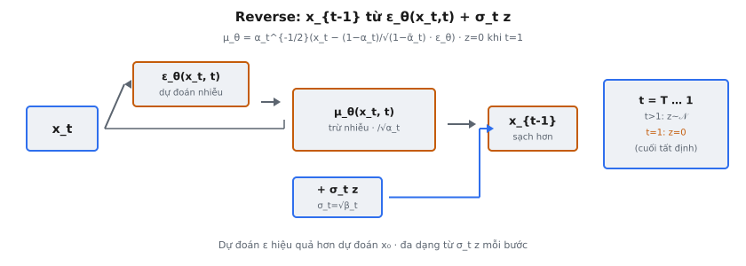

# Reverse Diffusion Process

Reverse diffusion process là nơi generation thực sự diễn ra trong Denoising Diffusion Probabilistic Models (DDPM). Ho et al. (2020) giới thiệu DDPM: sinh dữ liệu bằng cách học đảo ngược quá trình làm nhiễu dần. Forward process làm hỏng mẫu $x_0$ qua $T$ timestep cho đến khi gần như không phân biệt được với pure Gaussian noise $x_T \sim \mathcal{N}(0, I)$. Reverse process đi ngược từ $x_T$ về $x_0$, khử nhiễu từng bước.

Cho mẫu nhiễu $x_t$ và mạng dự đoán nhiễu $\epsilon_\theta(x_t, t)$, ta tính mẫu ít nhiễu hơn một chút $x_{t-1}$. Một bước reverse này, lặp từ $t = T$ xuống $t = 1$, biến random noise thành mẫu dữ liệu mạch lạc.

## Nó là gì

Reverse process được định nghĩa là Markov chain đã học với transition Gaussian. Bắt đầu tại $p(x_T) = \mathcal{N}(x_T; 0, I)$, mô hình áp chuỗi bước khử nhiễu đã học $p_\theta(x_{t-1} \mid x_t)$, mỗi bước tham số hóa dạng Gaussian:

$$
p_\theta(x_{t-1} \mid x_t) = \mathcal{N}(x_{t-1}; \mu_\theta(x_t, t), \sigma_t^2 I)
$$

Ở mỗi timestep, mô hình nhận mẫu nhiễu hiện tại và sinh phân phối trên các mẫu sạch hơn một chút. Lấy mẫu từ phân phối này cho $x_{t-1}$. Chuỗi chạy từ $t = T$ xuống $t = 1$, loại nhiễu dần cho đến $x_0$.

Insight then chốt của DDPM: thay vì dự đoán trực tiếp mean $\mu_\theta$, mạng nơ-ron dự đoán thành phần nhiễu $\epsilon_\theta(x_t, t)$. Dự đoán nhiễu này được cắm vào công thức dạng kín để tính mean bước reverse. Mục tiêu dự đoán nhiễu tương đương tối ưu variational lower bound trên log-likelihood dữ liệu, nhưng với tín hiệu huấn luyện đơn giản hơn.

::: {#fig-ddpm-reverse fig-cap="Reverse: $x_{t-1}=\\alpha_t^{-1/2}(x_t-(1-\\alpha_t)/\\sqrt{1-\\bar{\\alpha}_t}\\,\\epsilon_\\theta)+\\sigma_t z$; $\\sigma_t=\\sqrt{\\beta_t}$; $z=0$ khi $t=1$." fig-alt="x_t qua epsilon_theta thanh mu_theta roi x_t-1 voi nhieu sigma z."}
{fig-align="center"}
:::

## Các phương trình chính

### Công thức bước reverse

Bước sampling reverse đầy đủ tính $x_{t-1}$ từ $x_t$:

$$
x_{t-1} = \frac{1}{\sqrt{\alpha_t}} \left( x_t - \frac{1 - \alpha_t}{\sqrt{1 - \bar{\alpha}_t}} \, \epsilon_\theta(x_t, t) \right) + \sigma_t \, z
$$

ở đó $z \sim \mathcal{N}(0, I)$ khi $t > 1$, và $z = 0$ khi $t = 1$.

### Tham số schedule

Noise schedule định nghĩa $\beta_t$ (hằng dương nhỏ tại mỗi timestep), từ đó mọi đại lượng khác suy ra:

* $\alpha_t = 1 - \beta_t$ (phần tín hiệu giữ ở bước $t$)
* $\bar{\alpha}_t = \prod_{s=1}^{t} \alpha_s$ (tích lũy, cho tổng tín hiệu giữ từ bước 0 đến $t$)
* $\sigma_t = \sqrt{\beta_t}$ (độ lệch chuẩn nhiễu thêm trong bước reverse)

### Mean posterior

Mean của transition reverse:

$$
\mu_\theta(x_t, t) = \frac{1}{\sqrt{\alpha_t}} \left( x_t - \frac{1 - \alpha_t}{\sqrt{1 - \bar{\alpha}_t}} \, \epsilon_\theta(x_t, t) \right)
$$

Đây là phần tất định của bước reverse. Phần stochastic $\sigma_t z$ thêm ngẫu nhiên có kiểm soát để sampling đa dạng.

### Điều kiện biên

Ở bước cuối $t = 1$, đặt $z = 0$. Bước khử nhiễu cuối thuần tất định: không tiêm nhiễu. Đầu ra là mẫu sạch $x_0$ không nhiễu stochastic thêm.

## Suy diễn mean posterior

### Công thức đến từ đâu

Forward process cho biểu thức dạng kín của $x_t$ theo $x_0$ và nhiễu:

$$
x_t = \sqrt{\bar{\alpha}_t} \, x_0 + \sqrt{1 - \bar{\alpha}_t} \, \epsilon
$$

ở đó $\epsilon \sim \mathcal{N}(0, I)$. Nếu biết nhiễu thật $\epsilon$ đã thêm, ta giải chính xác $x_0$:

$$
x_0 = \frac{x_t - \sqrt{1 - \bar{\alpha}_t} \, \epsilon}{\sqrt{\bar{\alpha}_t}}
$$

Mạng $\epsilon_\theta(x_t, t)$ xấp xỉ nhiễu thật. Thay nhiễu dự đoán cho ước lượng $\hat{x}_0$, rồi suy ra mean posterior cho bước reverse.

### Vai trò từng hệ số

Công thức $\mu_\theta = \frac{1}{\sqrt{\alpha_t}} \left( x_t - \frac{1 - \alpha_t}{\sqrt{1 - \bar{\alpha}_t}} \epsilon_\theta \right)$ có hai phần phối hợp trong ngoặc.

**Phép trừ $x_t - \frac{1 - \alpha_t}{\sqrt{1 - \bar{\alpha}_t}} \epsilon_\theta$:** Loại đóng góp nhiễu khỏi $x_t$. Hệ số $\frac{1 - \alpha_t}{\sqrt{1 - \bar{\alpha}_t}}$ co nhiễu dự đoán khớp đúng lượng thêm tại timestep $t$, gỡ thành phần nhiễu gán cho bước $t$.

**Co lại $\frac{1}{\sqrt{\alpha_t}}$:** Sau khi bỏ nhiễu, tín hiệu còn lại hơi suy giảm (vì bước forward nhân $\sqrt{\alpha_t}$). Chia cho $\sqrt{\alpha_t}$ bù suy giảm, khôi phục tỉ lệ đúng tại timestep $t - 1$.

### Vì sao không dự đoán trực tiếp $x_0$?

Ho et al. thấy dự đoán nhiễu $\epsilon$ hiệu quả hơn nhiều so với dự đoán trực tiếp $x_0$. Target dự đoán nhiễu có phân phối đồng đều hơn xuyên suốt timestep và gradient ổn định hơn. Loss rút gọn thành:

$$
L_{\text{simple}} = \mathbb{E}_{t, x_0, \epsilon} \left[ \| \epsilon - \epsilon_\theta(x_t, t) \|^2 \right]
$$

Đây là MSE thẳng giữa nhiễu thật và dự đoán, trung bình trên timestep và ví dụ huấn luyện.

## Vì sao thêm nhiễu ($\sigma_t \cdot z$)

### Sampling stochastic cho phép đa dạng

Số hạng nhiễu $\sigma_t z$ không phải lỗi hay xấp xỉ; nó thiết yếu cho quá trình sinh. Không có nó, reverse process tất định: mọi mẫu từ cùng $x_T$ đi cùng quỹ đạo và cho cùng $x_0$. Nhiễu thêm mỗi bước đưa stochasticity để mô hình khám phá các mode khác nhau của phân phối dữ liệu.

Ví dụ sinh ảnh khuôn mặt: đường tất định từ $x_T$ cho luôn cùng một khuôn mặt. Nhiễu tiêm vào tạo biến thể tinh tế mỗi bước, để các mẫu khác nhau thành khuôn mặt, kiểu tóc và biểu cảm khác nhau.

### Không có nhiễu thì sao

Nếu đặt $z = 0$ ở mọi bước (không chỉ $t = 1$), sampler tất định thường cho đầu ra mờ, trung bình hóa. Mean dự đoán $\mu_\theta$ là tâm phân phối posterior $p_\theta(x_{t-1} \mid x_t)$, trung bình nhiều kết quả khử nhiễu có thể. Không lấy mẫu từ phân phối, luôn chọn trung bình — trung bình ảnh sắc nét thì mờ. Tiêm nhiễu buộc mô hình cam kết chi tiết sắc cụ thể mỗi bước thay vì do dự.

### Vì sao $z = 0$ tại $t = 1$

Ở bước cuối ($t = 1$), ta muốn đầu ra sạch. Thêm nhiễu ở giai đoạn này làm suy giảm mẫu sinh không cần thiết. Variance $\sigma_1^2 = \beta_1$ thường rất nhỏ, tác động nhẹ, nhưng $z = 0$ đảm bảo đầu ra sắc nét. Không có $x_{-1}$ để transition, nên cần ước lượng $x_0$ sắc nhất có thể.

## Bối cảnh bài báo

### Formulation của Ho et al.

Trong bài DDPM gốc, Ho et al. (2020) định nghĩa variance reverse process là $\sigma_t^2 = \beta_t$. Đây là lựa chọn variance "đơn giản hóa". Variance posterior thật, có điều kiện biết $x_0$, là:

$$
\tilde{\beta}_t = \frac{1 - \bar{\alpha}_{t-1}}{1 - \bar{\alpha}_t} \beta_t
$$

Ho et al. thấy cả hai lựa chọn cho kết quả tương đương. $\beta_t$ là cận trên và $\tilde{\beta}_t$ là cận dưới của variance reverse process tối ưu. Nichol và Dhariwal (2021) sau đó chứng minh học variance (nội suy giữa các cận) có thể cải thiện chất lượng mẫu.

### Liên hệ với variational lower bound

Mục tiêu huấn luyện DDPM suy ra từ variational lower bound (VLB) trên log-likelihood dữ liệu $\log p_\theta(x_0)$. VLB phân rã thành KL divergence giữa posterior thật $q(x_{t-1} \mid x_t, x_0)$ và transition reverse đã học $p_\theta(x_{t-1} \mid x_t)$. Vì cả hai phân phối là Gaussian, KL rút về so sánh mean (và variance nếu học). Loss đơn giản hóa $L_{\text{simple}}$ bỏ số hạng variance, chỉ giữ khớp mean. Dù là cận lỏng hơn, loss này cho chất lượng mẫu tốt hơn trong thực nghiệm.

### Noise schedule

Ho et al. dùng linear schedule cho $\beta_t$, nội suy từ $\beta_1 = 10^{-4}$ đến $\beta_T = 0.02$ trên $T = 1000$ bước. Giá trị $\beta_t$ nhỏ đảm bảo mỗi bước forward chỉ thêm ít nhiễu, giúp bước reverse dễ học hơn. Công trình sau khám phá cosine schedule cho SNR đồng đều hơn xuyên suốt timestep.

## Ví dụ số

### Thiết lập: Timestep giữa ($t = 500$)

Đi qua công thức bước reverse với số cụ thể. Giả sử vectơ 4 chiều tại $t = 500$.

Với linear schedule từ $\beta_1 = 0.0001$ đến $\beta_T = 0.02$, $T = 1000$:

$$
\beta_{500} = 0.0001 + \frac{499}{999}(0.02 - 0.0001) = 0.0001 + 0.4995 \times 0.0199 \approx 0.01004
$$

Từ đó:

* $\alpha_{500} = 1 - \beta_{500} = 1 - 0.01004 = 0.98996$
* $\bar{\alpha}_{500} \approx 0.0495$ (tích lũy mọi $\alpha_s$ từ $s = 1$ đến $500$)
* $\sigma_{500} = \sqrt{\beta_{500}} = \sqrt{0.01004} \approx 0.10020$

Các hệ số suy ra then chốt:

* $\frac{1}{\sqrt{\alpha_{500}}} = \frac{1}{\sqrt{0.98996}} \approx 1.00507$
* $\frac{1 - \alpha_{500}}{\sqrt{1 - \bar{\alpha}_{500}}} = \frac{0.01004}{\sqrt{0.9505}} = \frac{0.01004}{0.97493} \approx 0.01030$

### Phép tính

Cho:

$$
x_{500} = [0.82, -1.45, 0.33, 2.10]
$$

$$
\epsilon_\theta(x_{500}, 500) = [0.50, -0.80, 1.20, 0.35]
$$

$$
z = [-0.62, 0.91, 0.15, -1.30]
$$

**Bước 1: Co nhiễu dự đoán.**

$$
\frac{1 - \alpha_t}{\sqrt{1 - \bar{\alpha}_t}} \epsilon_\theta = 0.01030 \times [0.50, -0.80, 1.20, 0.35]
$$

$$
= [0.00515, -0.00824, 0.01236, 0.00361]
$$

**Bước 2: Trừ đóng góp nhiễu khỏi $x_t$.**

$$
x_t - \frac{1 - \alpha_t}{\sqrt{1 - \bar{\alpha}_t}} \epsilon_\theta = [0.82 - 0.00515, \; -1.45 + 0.00824, \; 0.33 - 0.01236, \; 2.10 - 0.00361]
$$

$$
= [0.81485, -1.44176, 0.31764, 2.09639]
$$

**Bước 3: Co lại bằng $\frac{1}{\sqrt{\alpha_t}}$.**

$$
\mu_\theta = 1.00507 \times [0.81485, -1.44176, 0.31764, 2.09639]
$$

$$
= [0.81898, -1.44907, 0.31925, 2.10702]
$$

**Bước 4: Cộng nhiễu stochastic.**

$$
\sigma_t z = 0.10020 \times [-0.62, 0.91, 0.15, -1.30]
$$

$$
= [-0.06212, 0.09118, 0.01503, -0.13026]
$$

**Bước 5: Kết hợp để có $x_{499}$.**

$$
x_{499} = \mu_\theta + \sigma_t z = [0.81898 - 0.06212, \; -1.44907 + 0.09118, \; 0.31925 + 0.01503, \; 2.10702 - 0.13026]
$$

$$
= [0.75686, -1.35789, 0.33428, 1.97676]
$$

Mỗi bước reverse chỉ điều chỉnh nhỏ. Qua hàng trăm bước, các điều chỉnh nhỏ tích lũy biến pure noise thành dữ liệu có cấu trúc.

### Timestep cuối ($t = 1$, không nhiễu)

Xét bước reverse cuối. Tại $t = 1$ với linear schedule:

$$
\beta_1 = 0.0001, \quad \alpha_1 = 0.9999, \quad \bar{\alpha}_1 = 0.9999
$$

Hệ số suy ra:

* $\frac{1}{\sqrt{\alpha_1}} = \frac{1}{\sqrt{0.9999}} \approx 1.00005$
* $\frac{1 - \alpha_1}{\sqrt{1 - \bar{\alpha}_1}} = \frac{0.0001}{\sqrt{0.0001}} = \frac{0.0001}{0.01} = 0.01$

Cho:

$$
x_1 = [0.52, -0.38, 1.15, -0.74]
$$

$$
\epsilon_\theta(x_1, 1) = [0.20, -0.55, 0.90, 0.10]
$$

**Bước 1: Co nhiễu dự đoán.**

$$
0.01 \times [0.20, -0.55, 0.90, 0.10] = [0.00200, -0.00550, 0.00900, 0.00100]
$$

**Bước 2: Trừ khỏi $x_1$.**

$$
[0.52 - 0.00200, \; -0.38 + 0.00550, \; 1.15 - 0.00900, \; -0.74 - 0.00100]
$$

$$
= [0.51800, -0.37450, 1.14100, -0.74100]
$$

**Bước 3: Co lại.**

$$
\mu_\theta = 1.00005 \times [0.51800, -0.37450, 1.14100, -0.74100]
$$

$$
= [0.51803, -0.37452, 1.14106, -0.74104]
$$

**Bước 4: Đặt $z = 0$ (không nhiễu tại $t = 1$).**

$$
x_0 = \mu_\theta = [0.51803, -0.37452, 1.14106, -0.74104]
$$

Đầu ra cuối là mẫu sinh sạch. Điều chỉnh tại $t = 1$ rất nhỏ vì SNR đã rất cao ($\bar{\alpha}_1 = 0.9999$).

## Liên hệ với score matching

### Dự đoán nhiễu như ước lượng score

Nhiễu dự đoán $\epsilon_\theta(x_t, t)$ gắn chặt với hàm score $\nabla_{x_t} \log p_t(x_t)$ — gradient log-mật độ của phân phối dữ liệu nhiễu tại timestep $t$. Quan hệ:

$$
\nabla_{x_t} \log p_t(x_t) = -\frac{\epsilon_\theta(x_t, t)}{\sqrt{1 - \bar{\alpha}_t}}
$$

Hàm score chỉ hướng tăng mật độ dữ liệu. Nhiễu dự đoán chỉ hướng ngược (về nhiễu đã thêm). Cùng thông tin tới hệ số co đã biết.

### Score-based generative models

Song và Ermon (2019, 2020) phát triển score-based generative models độc lập, dùng formulation thời gian liên tục với stochastic differential equations (SDE). Song et al. (2021) chứng minh DDPM là rời rạc hóa khung liên tục: bước reverse DDPM là Euler-Maruyama rời rạc hóa reverse SDE, và mạng dự đoán nhiễu $\epsilon_\theta$ tương đương mạng score $s_\theta$ tới hệ số co ở trên.

### Hệ quả thực hành

Tương đương này nghĩa insight từ score matching chuyển sang DDPM và ngược lại. Quy trình sampling DDPM có thể thay bằng SDE solver tinh hơn (predictor-corrector) để cải thiện chất lượng mẫu. Liên hệ cũng động viên probability flow ODE — đối tác tất định của reverse SDE stochastic — cho phép tính likelihood chính xác. DDIM (Song et al., 2020) có thể xem như rời rạc hóa probability flow ODE này.

## Các lỗi thường gặp

### Quên $z = 0$ tại $t = 1$

Lỗi triển khai phổ biến nhất là lấy mẫu $z \sim \mathcal{N}(0, I)$ ở mọi timestep, kể $t = 1$. Điều này thêm nhiễu nhỏ vào đầu ra cuối, mẫu hơi nhiễu. Trong code thường xử lý bằng điều kiện đơn giản:

$$
z = \begin{cases} \mathcal{N}(0, I) & \text{nếu } t > 1 \\ 0 & \text{nếu } t = 1 \end{cases}
$$

Tác động có thể tinh tế (vì $\sigma_1 = \sqrt{\beta_1}$ nhỏ), nhưng sai và có thể làm FID score xấu đi đo được.

### Nhầm $\alpha_t$ với $\bar{\alpha}_t$

Nguồn bug dai dẳng. Hai đại lượng khác bản chất:

* $\alpha_t = 1 - \beta_t$ là hệ số giữ một bước (gần 1 mọi $t$)
* $\bar{\alpha}_t = \prod_{s=1}^t \alpha_s$ là hệ số giữ tích lũy (giảm từ gần 1 tại $t = 1$ đến gần 0 tại $t = T$)

Dùng $\alpha_t$ chỗ cần $\bar{\alpha}_t$ (hoặc ngược lại) cho kết quả sai mạnh. Ví dụ tại $t = 500$, $\alpha_{500} \approx 0.99$ trong khi $\bar{\alpha}_{500} \approx 0.05$. Hoán trong hệ số $\frac{1 - \alpha_t}{\sqrt{1 - \bar{\alpha}_t}}$ đổi tỉ lệ gỡ nhiễu một bậc độ lớn.

Gợi nhớ: $\alpha_t$ (không gạch) là đại lượng local một bước; $\bar{\alpha}_t$ (có gạch) là đại lượng global tích lũy. Công thức forward $x_t = \sqrt{\bar{\alpha}_t} x_0 + \sqrt{1 - \bar{\alpha}_t} \epsilon$ dùng bản có gạch vì mô tả tổng làm hỏng từ bước 0 đến $t$.

### Sai variance (công thức $\sigma_t$)

Ho et al. dùng $\sigma_t^2 = \beta_t$, nên $\sigma_t = \sqrt{\beta_t}$. Lỗi phổ biến là $\sigma_t = \beta_t$ (quên căn bậc hai), khiến nhiễu tiêm quá nhỏ. Lỗi khác là $\sigma_t^2 = \tilde{\beta}_t$ mà không nhận ra cần $\bar{\alpha}_{t-1}$, gây off-by-one tại $t = 1$ nơi $\bar{\alpha}_0$ phải định nghĩa là 1.

### Thứ tự bước reverse: phải đi $T$ xuống $1$

Reverse process phải lặp từ $t = T$ xuống $t = 1$, không từ $1$ lên $T$. Hệ số hiệu chỉnh cho mức nhiễu cụ thể mỗi timestep. Chạy sai thứ tự áp hệ số khử nhiễu ở mức nhiễu không khớp, cho rác. Trong Python:

$$
\text{for } t \text{ in } [T, T{-}1, \ldots, 2, 1]: \quad x_{t-1} = \text{reverse\_step}(x_t, t)
$$

### Bất ổn số học tại $t$ nhỏ

Ở timestep rất nhỏ (gần $t = 1$), $\bar{\alpha}_t$ gần 1 và $1 - \bar{\alpha}_t$ gần 0. Tính $\sqrt{1 - \bar{\alpha}_t}$ có thể mất chính xác, chia cho nó khuếch đại lỗi. Kẹp $1 - \bar{\alpha}_t$ tối thiểu dương nhỏ (ví dụ $10^{-8}$) tránh chia cho 0. Tiền tính mọi đại lượng schedule float64 rồi cast float32 cho inference là best practice phổ biến.

### Lỗi off-by-one khi index schedule

Codebase khác nhau index $\beta_t$ từ $t = 0$ đến $T - 1$ hoặc $t = 1$ đến $T$. Dẫn tới off-by-one khi tra $\bar{\alpha}_t$ hoặc $\bar{\alpha}_{t-1}$. Cách an toàn: tiền tính mảng mọi hệ số cần và xác minh index bằng test case đã biết (ví dụ kiểm tra $\bar{\alpha}_T \approx 0$ và $\bar{\alpha}_1 \approx 1$).


## Code
```python
import numpy as np

def reverse_step(x_t, t, epsilon_pred, betas, z=None):
    x_t = np.array(x_t, dtype=float)
    ep = np.array(epsilon_pred, dtype=float)
    betas = np.array(betas, dtype=float)
    
    alphas = 1 - betas
    alpha_bar = np.cumprod(alphas)
    alpha_t = alphas[t - 1]
    alpha_bar_t = alpha_bar[t - 1]
    beta_t = betas[t - 1]
    
    coef1 = 1 / np.sqrt(alpha_t)
    coef2 = beta_t / np.sqrt(1 - alpha_bar_t)
    mu = coef1 * (x_t - coef2 * ep)
    
    if t > 1 and z is not None:
        sigma = np.sqrt(beta_t)
        result = mu + sigma * np.array(z, dtype=float)
    else:
        result = mu
    
    def to_list(a):
        if a.ndim == 0: return round(float(a), 4)
        return [to_list(r) for r in a]
    return to_list(result)

```