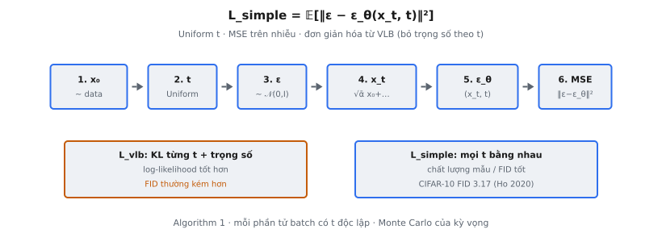

# DDPM Training Loss

Denoising Diffusion Probabilistic Models (DDPM) học sinh dữ liệu bằng cách đảo ngược quá trình thêm nhiễu dần. Mục tiêu huấn luyện Ho et al. (2020) đề xuất đáng chú ý ở sự đơn giản: dự đoán nhiễu đã được thêm vào mẫu dữ liệu. Loss là mean squared error (MSE) thuần giữa nhiễu thật và dự đoán của mô hình. Mục tiêu đơn giản hóa này thay thế variational lower bound phức tạp bằng một công thức gọn, cho chất lượng mẫu vượt trội.

## Nó là gì

Diffusion model định nghĩa hai quá trình. **Forward process** thêm nhiễu Gaussian dần vào dữ liệu qua $T$ **timestep** cho đến khi tín hiệu bị phá hủy. **Reverse process** học hoàn tác từng bước thêm nhiễu, khôi phục dữ liệu sạch từ nhiễu thuần. Huấn luyện **reverse process** cần hàm loss dạy mạng nơ-ron $\epsilon_\theta$ biết nhiễu nào đã được thêm ở mỗi bước.

Loss huấn luyện DDPM, gọi là $L_{\text{simple}}$, yêu cầu mô hình dự đoán đúng vector nhiễu $\epsilon$ đã được rút mẫu và cộng để tạo đầu vào nhiễu $x_t$. Mô hình nhìn $x_t$ và **timestep** $t$, rồi xuất dự đoán tốt nhất $\epsilon_\theta(x_t, t)$. Loss là MSE giữa nhiễu thật và dự đoán.

Đây là sự lệch so với diffusion model sớm hơn (Sohl-Dickstein et al., 2015) tối ưu toàn bộ variational lower bound. Ho et al. chứng minh loss MSE dự đoán nhiễu này cho ảnh tốt hơn, dù về lý thuyết "kém đúng" hơn từ góc nhìn variational inference.

::: {#fig-ddpm-loss fig-cap="$L_{\\mathrm{simple}}=\\mathbb{E}[\\|\\epsilon-\\epsilon_\\theta(x_t,t)\\|^2]$: lấy $x_0,t,\\epsilon$ → dựng $x_t$ → MSE. Uniform $t$ tốt FID hơn $L_{\\mathrm{vlb}}$ có trọng số (CIFAR-10 FID 3.17)." fig-alt="Chuỗi bước Algorithm 1 và so sánh VLB vs simple."}
{fig-align="center"}
:::

## Các phương trình chính

### Forward Process

Cho **noise schedule** $\beta_1, \beta_2, \ldots, \beta_T$ với $\beta_t \in (0, 1)$, **forward process** thêm nhiễu tăng dần:

$$
q(x_t | x_{t-1}) = \mathcal{N}(x_t; \sqrt{1 - \beta_t} \, x_{t-1}, \beta_t I)
$$

Tính chất then chốt: có thể lấy mẫu $x_t$ trực tiếp từ $x_0$ mà không lặp qua mọi bước trước. Đặt $\alpha_t = 1 - \beta_t$ và $\bar{\alpha}_t = \prod_{s=1}^{t} \alpha_s$. Khi đó:

$$
q(x_t | x_0) = \mathcal{N}(x_t; \sqrt{\bar{\alpha}_t} \, x_0, (1 - \bar{\alpha}_t) I)
$$

Nghĩa là $x_t$ viết trực tiếp:

$$
x_t = \sqrt{\bar{\alpha}_t} \, x_0 + \sqrt{1 - \bar{\alpha}_t} \, \epsilon, \quad \epsilon \sim \mathcal{N}(0, I)
$$

### Variational Lower Bound (VLB)

Variational lower bound đầy đủ phân rã negative log-likelihood thành tổng các số hạng KL divergence:

$$
L_{\text{vlb}} = L_0 + L_1 + \cdots + L_{T-1} + L_T
$$

với mỗi $L_{t-1}$ cho $t > 1$ là:

$$
L_{t-1} = D_{\text{KL}}(q(x_{t-1} | x_t, x_0) \| p_\theta(x_{t-1} | x_t))
$$

Cả $q(x_{t-1} | x_t, x_0)$ và $p_\theta(x_{t-1} | x_t)$ đều là Gaussian, nên KL divergence này có dạng kín. Nhưng tối ưu cả $T$ số hạng với trọng số riêng phức tạp và không ổn định.

### Mục tiêu đơn giản hóa

Ho et al. chứng minh mỗi số hạng KL $L_{t-1}$ có thể viết lại theo dự đoán nhiễu. Sau khi reparameterize mean của $p_\theta$ để dự đoán $\epsilon$ thay vì $x_{t-1}$ trực tiếp, và bỏ hệ số trọng số phụ thuộc thời gian, loss đơn giản trở thành:

$$
L_{\text{simple}} = \mathbb{E}_{t, x_0, \epsilon} \left[ \| \epsilon - \epsilon_\theta(x_t, t) \|^2 \right]
$$

với $t \sim \text{Uniform}(\{1, \ldots, T\})$, $x_0 \sim q(x_0)$ là mẫu huấn luyện, $\epsilon \sim \mathcal{N}(0, I)$, và $x_t = \sqrt{\bar{\alpha}_t} \, x_0 + \sqrt{1 - \bar{\alpha}_t} \, \epsilon$.

## Từ VLB sang Simple Loss

VLB đầy đủ gán trọng số khác nhau cho loss mỗi **timestep**. Trọng số đến từ hệ số trong KL divergence giữa posterior thật và phân phối **reverse** học được. Cụ thể, mỗi số hạng $L_{t-1}$ trong VLB mang hệ số tỷ lệ với $\frac{\beta_t^2}{2 \sigma_t^2 \alpha_t (1 - \bar{\alpha}_t)}$, thay đổi theo $t$.

Ho et al. thấy bỏ các trọng số này và coi mọi **timestep** bằng nhau (uniform weighting) thực tế cho chất lượng mẫu tốt hơn. Trực giác: trọng số VLB giảm loss ở $t$ lớn (mức nhiễu cao), nhưng đây đúng là **timestep** mô hình cần học cấu trúc thô toàn cục. Cho trọng số bằng nhau, simple loss buộc mô hình hoạt động tốt ở mọi mức nhiễu.

Có đánh đổi: $L_{\text{vlb}}$ cho log-likelihood tốt hơn (tối ưu trực tiếp variational bound), còn $L_{\text{simple}}$ cho chất lượng mẫu tốt hơn (đo bằng FID và IS). Ho et al. chọn chất lượng mẫu, lập luận chất lượng cảm nhận quan trọng hơn log-likelihood cho sinh ảnh.

## Thuật toán huấn luyện

Quy trình huấn luyện đầy đủ, theo Algorithm 1 trong bài DDPM, lặp các bước sau đến hội tụ:

**Bước 1.** Lấy mẫu ví dụ huấn luyện $x_0$ từ phân phối dữ liệu $q(x_0)$.

**Bước 2.** Lấy mẫu **timestep** $t$ đều từ $\{1, 2, \ldots, T\}$.

**Bước 3.** Lấy mẫu vector nhiễu $\epsilon \sim \mathcal{N}(0, I)$ cùng shape với $x_0$.

**Bước 4.** Dựng mẫu nhiễu bằng công thức **forward process**:

$$
x_t = \sqrt{\bar{\alpha}_t} \, x_0 + \sqrt{1 - \bar{\alpha}_t} \, \epsilon
$$

**Bước 5.** Đưa $x_t$ và $t$ qua mạng nơ-ron để có dự đoán nhiễu $\epsilon_\theta(x_t, t)$.

**Bước 6.** Tính loss là MSE:

$$
L = \| \epsilon - \epsilon_\theta(x_t, t) \|^2
$$

**Bước 7.** Tính gradient $\nabla_\theta L$ và cập nhật tham số mô hình $\theta$ bằng optimizer.

Mỗi bước huấn luyện lấy mẫu $t$ và $\epsilon$ mới. Mỗi phần tử trong batch nên có $t$ được rút mẫu độc lập riêng. Tính ngẫu nhiên trên $t$ và $\epsilon$ cung cấp ước lượng Monte Carlo của kỳ vọng đầy đủ trong $L_{\text{simple}}$.

## Bối cảnh bài báo

Ho et al. (2020) thử cả $L_{\text{vlb}}$ và $L_{\text{simple}}$ trên CIFAR-10 và LSUN 256×256. Với $T = 1000$ **timestep** và linear **noise schedule** từ $\beta_1 = 10^{-4}$ đến $\beta_T = 0.02$, họ thấy $L_{\text{simple}}$ đạt FID 3.17 trên CIFAR-10 — state-of-the-art thời điểm đó.

Bài báo báo cáo huấn luyện với $L_{\text{vlb}}$ cho negative log-likelihood tốt hơn (3.99 bits/dim so với 3.75 bits/dim), nhưng FID kém hơn. Điều này cho thấy căng thẳng cơ bản trong generative modeling: tối ưu variational bound chính xác không nhất thiết cho chất lượng cảm nhận tốt nhất.

Kiến trúc dùng là **U-Net** với self-attention ở độ phân giải 16×16. **Timestep** $t$ được mã hóa bằng sinusoidal position embedding (mượn từ Transformer) và inject vào mỗi residual block. Mô hình dự đoán $\epsilon$ ở mọi **timestep**, và **reverse process** dùng phương sai cố định $\sigma_t^2 = \beta_t$.

Follow-up sau, Improved DDPM (Nichol và Dhariwal, 2021), chỉ ra học phương sai cùng mean và dùng hybrid loss $L_{\text{hybrid}} = L_{\text{simple}} + \lambda L_{\text{vlb}}$ có thể cải thiện đồng thời chất lượng mẫu và log-likelihood.

## Mô hình học được gì

Mạng nơ-ron $\epsilon_\theta(x_t, t)$ học dự đoán thành phần nhiễu trong đầu vào nhiễu $x_t$. Vì $x_t = \sqrt{\bar{\alpha}_t} \, x_0 + \sqrt{1 - \bar{\alpha}_t} \, \epsilon$, dự đoán $\epsilon$ tương đương dự đoán $x_0$ qua quan hệ:

$$
\hat{x}_0 = \frac{x_t - \sqrt{1 - \bar{\alpha}_t} \, \epsilon_\theta(x_t, t)}{\sqrt{\bar{\alpha}_t}}
$$

Còn liên hệ sâu với score matching. Score function của phân phối là $\nabla_{x} \log p(x)$. Với phân phối nhiễu $q(x_t)$, score tỷ lệ với nhiễu âm:

$$
\nabla_{x_t} \log q(x_t) = -\frac{\epsilon}{\sqrt{1 - \bar{\alpha}_t}}
$$

Huấn luyện $\epsilon_\theta$ dự đoán $\epsilon$ tương đương huấn luyện score network $s_\theta(x_t, t) \approx \nabla_{x_t} \log q(x_t)$. Điều này nối DDPM với khung score-based generative modeling của Song và Ermon (2019).

Ba cách parameterize (dự đoán nhiễu, dự đoán $x_0$, và dự đoán score) tương đương toán học. Chúng chỉ khác hệ số scale phụ thuộc $\bar{\alpha}_t$. Lựa chọn parameterization ảnh hưởng động lực huấn luyện: dự đoán nhiễu hoạt động tốt nhất cho DDPM gốc, còn dự đoán $x_0$ và velocity prediction có lợi thế ở bối cảnh khác.

## Ví dụ số

Xét ví dụ 1D đơn giản để truy vết tính loss huấn luyện. Cho $T = 1000$ với linear schedule $\beta_t$ từ $0.0001$ đến $0.02$.

**Điểm dữ liệu:** $x_0 = 0.8$

**Timestep rút mẫu:** $t = 300$

**Tính $\bar{\alpha}_{300}$:** Với linear schedule, $\beta_{300} \approx 0.006$. Tích tích lũy $\bar{\alpha}_{300} = \prod_{s=1}^{300}(1 - \beta_s) \approx 0.448$. Do đó $\sqrt{\bar{\alpha}_{300}} \approx 0.669$ và $\sqrt{1 - \bar{\alpha}_{300}} \approx 0.743$.

**Nhiễu rút mẫu:** $\epsilon = -1.2$ (rút từ $\mathcal{N}(0, 1)$)

**Dựng $x_t$:**

$$
x_{300} = 0.669 \times 0.8 + 0.743 \times (-1.2) = 0.535 - 0.892 = -0.357
$$

**Dự đoán mô hình:** Mạng thấy $x_{300} = -0.357$ và $t = 300$. Giả sử xuất $\epsilon_\theta(x_{300}, 300) = -1.05$.

**Tính loss:**

$$
L = \| \epsilon - \epsilon_\theta \|^2 = (-1.2 - (-1.05))^2 = (-0.15)^2 = 0.0225
$$

Dự đoán mô hình gần nhưng chưa hoàn hảo. Qua nhiều bước huấn luyện với $x_0$, $t$, và $\epsilon$ khác nhau, mô hình học minimize MSE này trên mọi tổ hợp. Khi hội tụ, loss kỳ vọng tiến tới sai số không thể giảm thêm, phụ thuộc mức kiến trúc mô hình xấp xỉ nhiễu thật.

## Các biến thể hiện đại

### Velocity Prediction (v-prediction)

Salimans và Ho (2022) đề xuất dự đoán "velocity" $v_t = \sqrt{\bar{\alpha}_t} \, \epsilon - \sqrt{1 - \bar{\alpha}_t} \, x_0$ thay vì dự đoán $\epsilon$ trực tiếp. Loss trở thành $L_v = \mathbb{E}[\| v_t - v_\theta(x_t, t) \|^2]$. Parameterization này cho gradient ổn định hơn ở mức nhiễu thấp ( $t$ nhỏ) và được dùng trong Stable Diffusion v2 và mô hình sau.

### Dự đoán $x_0$

Thay vì dự đoán nhiễu, mô hình dự đoán trực tiếp dữ liệu sạch $x_0$. Loss là $L_{x_0} = \mathbb{E}[\| x_0 - x_{0,\theta}(x_t, t) \|^2]$. Tương đương toán học với dự đoán nhiễu (đến hệ số scale phụ thuộc $t$), nhưng đổi trọng số ngầm qua các **timestep**. Một số công trình như DALL-E 2 dùng dự đoán $x_0$ vì cho phép kiểm tra trực tiếp mô hình "nghĩ" ảnh sạch trông thế nào.

### Weighted Loss

Nhiều công trình khám phá scheme trọng số không đều. P2 weighting (Choi et al., 2022) gán trọng số cao hơn cho **timestep** quan trọng về cảm nhận. Min-SNR weighting (Hang et al., 2023) clip SNR để không **timestep** nào chi phối gradient. Các scheme này cố khôi phục lợi ích trọng số VLB trong khi giữ ổn định của $L_{\text{simple}}$.

### Classifier-Free Guidance Loss

Cho sinh có điều kiện, classifier-free guidance (Ho và Salimans, 2022) huấn luyện mô hình đồng thời trên denoising có điều kiện và không điều kiện. Khi huấn luyện, tín hiệu điều kiện (ví dụ text prompt hoặc nhãn lớp) bị bỏ ngẫu nhiên với xác suất nào đó (thường 10–20%), thay bằng null token. Loss vẫn là MSE trên dự đoán nhiễu, nhưng mô hình học cả $\epsilon_\theta(x_t, t, c)$ và $\epsilon_\theta(x_t, t, \varnothing)$. Lúc **inference**, hai dự đoán được kết hợp: $\hat{\epsilon} = \epsilon_\theta(x_t, t, \varnothing) + w \cdot (\epsilon_\theta(x_t, t, c) - \epsilon_\theta(x_t, t, \varnothing))$, với $w > 1$ điều khiển cường độ guidance.

## Các lỗi thường gặp

**Không lấy mẫu $t$ đều.** Mọi **timestep** từ 1 đến $T$ phải có xác suất được chọn bằng nhau. Lệch về $t$ nhỏ hoặc lớn đổi trọng số loss ngầm và làm giảm chất lượng mẫu. Một số practitioner vô tình dùng lấy mẫu 0-indexed ($t \in \{0, \ldots, T-1\}$), dịch mọi giá trị **noise schedule** một vị trí.

**Dùng cùng $t$ cho mọi phần tử batch.** Mỗi mẫu trong batch nên có $t$ rút mẫu độc lập riêng. Chia sẻ một $t$ trong batch giảm đa dạng tín hiệu gradient và chậm hội tụ. Giảm phương sai nhờ thấy nhiều **timestep** mỗi batch là cần thiết cho huấn luyện ổn định.

**Quên detach $x_t$ khỏi đồ thị gradient.** Khi dựng $x_t = \sqrt{\bar{\alpha}_t} \, x_0 + \sqrt{1 - \bar{\alpha}_t} \, \epsilon$, đây là bước chuẩn bị dữ liệu, không phải forward pass của mô hình. Nếu đồ thị tính gradient qua $x_t$ về $x_0$, optimizer có thể cố "đổi dữ liệu" thay vì cải thiện mô hình. Trong PyTorch, $x_0$ nên coi là đầu vào hằng, và giá trị **noise schedule** $\bar{\alpha}_t$ không cần gradient.

**Tính loss trên $x_t$ thay vì $\epsilon$.** Lỗi implementation phổ biến là so sánh đầu ra mô hình với đầu vào nhiễu $x_t$ thay vì nhiễu $\epsilon$. Mô hình dự đoán nhiễu, không phải dữ liệu nhiễu. Target luôn là $\epsilon$ đã rút mẫu, không bao giờ $x_t$ hay $x_0$ (trừ khi dùng biến thể dự đoán $x_0$ một cách rõ ràng).

**Sai reduction MSE.** `nn.MSELoss` của PyTorch mặc định `reduction='mean'`, lấy trung bình qua mọi phần tử (chiều không gian và channel). Dùng `reduction='sum'` thay đổi learning rate hiệu dụng theo hệ số bằng chiều dữ liệu. Bài DDPM dùng MSE theo phần tử rồi trung bình trên batch, khớp `reduction='mean'`. Đổi reduction mà không chỉnh learning rate khiến huấn luyện phân kỳ hoặc hội tụ kém.


## Code
```python
import numpy as np

def compute_ddpm_loss(x_0, betas, t_values, epsilon, epsilon_pred):
    epsilon = np.array(epsilon, dtype=float)
    epsilon_pred = np.array(epsilon_pred, dtype=float)
    loss = np.mean((epsilon - epsilon_pred) ** 2)
    return round(float(loss), 6)

```