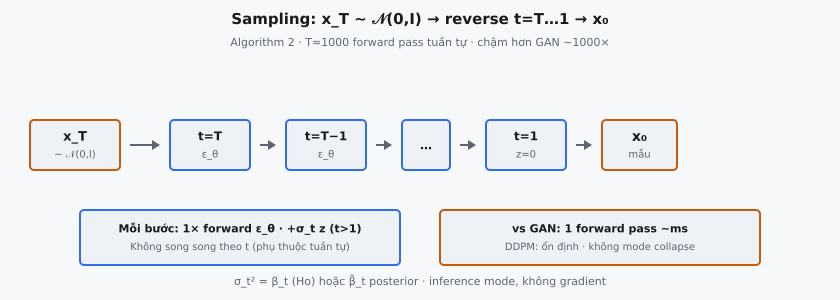
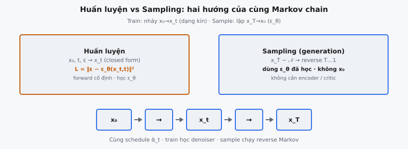

# DDPM Sampling

**Sampling** là hành vi generative của diffusion model: bắt đầu từ nhiễu Gaussian thuần và gỡ dần để tạo mẫu dữ liệu sạch. Trong khung Denoising Diffusion Probabilistic Model (DDPM) Ho, Jain, và Abbeel (2020) giới thiệu, **sampling** chạy Markov chain **reverse** học được từ **timestep** $T$ xuống **timestep** $1$, đảo ngược **forward process** đã phá dần cấu trúc dữ liệu.

Khác GAN sinh mẫu trong một forward pass qua mạng generator, **sampling** DDPM là quy trình lặp. Mỗi bước yêu cầu mô hình dự đoán và trừ một lượng nhiễu nhỏ, dần lộ phân phối dữ liệu bên dưới qua từng bước denoising.

## Nó là gì / Nó làm gì

Pipeline **sampling** DDPM là quy trình sinh hoàn chỉnh biến vector nhiễu ngẫu nhiên thành mẫu dữ liệu thực tế. Gồm ba giai đoạn: (1) lấy mẫu nhiễu ban đầu $\mathbf{x}_T$ từ Gaussian chuẩn, (2) lặp áp dụng chuyển tiếp denoising **reverse** học được từ $t = T$ xuống $t = 1$, và (3) xuất $\mathbf{x}_0$ cuối làm mẫu sinh.

Ở mỗi bước, mạng nơ-ron $\epsilon_\theta(\mathbf{x}_t, t)$ dự đoán thành phần nhiễu có trong $\mathbf{x}_t$. Dự đoán này dùng để tính mean của phân phối chuyển tiếp **reverse**, rồi lấy mẫu $\mathbf{x}_{t-1}$. Mạng nhiễu được huấn luyện minimize sai khác giữa dự đoán và nhiễu thật đã thêm trong **forward process**.

Quy trình mang tính ngẫu nhiên: ở mọi bước trừ bước cuối, nhiễu Gaussian mới $\mathbf{z}$ được cộng vào ước lượng đã denoise. Ngẫu nhiên này cho phép mô hình khám phá nhiều mode của phân phối dữ liệu. Ở $t = 1$, không thêm nhiễu vì cần đầu ra sạch, không phải nhiễu.

::: {#fig-ddpm-sampling fig-cap="Sampling (Alg. 2): $x_T\\sim\\mathcal{N}(0,I)$ → reverse $t=T\\ldots 1$ với $\\epsilon_\\theta$ → $x_0$. $T\\approx 1000$ pass tuần tự; $z=0$ ở $t=1$." fig-alt="Chuỗi reverse từ x_T tới x_0."}
{fig-align="center"}
:::

::: {#fig-ddpm-modes fig-cap="Huấn luyện: nhảy $x_0\\to x_t$ (dạng kín) + $L=\\|\\epsilon-\\epsilon_\\theta\\|^2$. Sampling: $x_T\\to\\cdots\\to x_0$ bằng reverse đã học — cùng schedule $\\bar{\\alpha}_t$." fig-alt="Hai panel train va sample."}
{fig-align="center"}
:::

## Các phương trình chính

**Noise schedule** định nghĩa dãy $\beta_1, \beta_2, \dots, \beta_T$ (hằng dương nhỏ, thường $\beta_1 = 10^{-4}$ và $\beta_T = 0.02$ với nội suy linear). Từ đó suy ra:

- **$\alpha_t = 1 - \beta_t$:** Hệ số giữ tín hiệu mỗi bước.
- **$\bar{\alpha}_t = \prod_{s=1}^{t} \alpha_s$:** Giữ tín hiệu tích lũy từ bước $0$ đến bước $t$.

Mẫu nhiễu ban đầu rút từ Gaussian chuẩn:

$$
\mathbf{x}_T \sim \mathcal{N}(\mathbf{0}, \mathbf{I})
$$

Với mỗi **timestep** $t$ từ $T$ xuống $1$, bước **reverse** tính:

$$
\mathbf{x}_{t-1} = \frac{1}{\sqrt{\alpha_t}} \left( \mathbf{x}_t - \frac{1 - \alpha_t}{\sqrt{1 - \bar{\alpha}_t}} \, \epsilon_\theta(\mathbf{x}_t, t) \right) + \sigma_t \, \mathbf{z}
$$

với $\mathbf{z} \sim \mathcal{N}(\mathbf{0}, \mathbf{I})$ cho $t > 1$ và $\mathbf{z} = \mathbf{0}$ cho $t = 1$.

- **$\frac{1}{\sqrt{\alpha_t}}$:** Rescale tín hiệu lên bù co lại trong **forward process** ở bước $t$.
- **$\frac{1 - \alpha_t}{\sqrt{1 - \bar{\alpha}_t}}$:** Hệ số chuyển dự đoán nhiễu $\epsilon_\theta$ thành độ lớn nhiễu đúng để trừ khỏi $\mathbf{x}_t$.
- **$\epsilon_\theta(\mathbf{x}_t, t)$:** Ước lượng của mạng về thành phần nhiễu trong $\mathbf{x}_t$. Nhận cả đầu vào nhiễu và **timestep**.
- **$\sigma_t$:** Scale nhiễu cho bước **reverse**. Ho et al. đặt $\sigma_t^2 = \beta_t$, khớp phương sai **forward process**. Phương án khác là $\sigma_t^2 = \tilde{\beta}_t = \frac{1 - \bar{\alpha}_{t-1}}{1 - \bar{\alpha}_t} \beta_t$, phương sai posterior.

Số hạng trong ngoặc tính mean ước lượng $\mu_\theta(\mathbf{x}_t, t)$ của phân phối **reverse** $p_\theta(\mathbf{x}_{t-1} | \mathbf{x}_t)$. Cộng $\sigma_t \mathbf{z}$ lấy mẫu từ phân phối đó thay vì lấy điểm ước lượng.

## Thuật toán sampling

Quy trình đầy đủ, theo Algorithm 2 của Ho et al. (2020):

**Bước 1.** Lấy mẫu $\mathbf{x}_T \sim \mathcal{N}(\mathbf{0}, \mathbf{I})$. Đây là tensor ngẫu nhiên cùng shape đầu ra mong muốn (ví dụ $3 \times 64 \times 64$ cho ảnh RGB $64 \times 64$).

**Bước 2.** Với $t = T, T-1, \dots, 1$:

- Nếu $t > 1$, lấy mẫu $\mathbf{z} \sim \mathcal{N}(\mathbf{0}, \mathbf{I})$. Nếu $t = 1$, đặt $\mathbf{z} = \mathbf{0}$.
- Chạy forward pass mạng: $\hat{\epsilon} = \epsilon_\theta(\mathbf{x}_t, t)$.
- Tính ước lượng đã denoise: $\mathbf{x}_{t-1} = \frac{1}{\sqrt{\alpha_t}} \left( \mathbf{x}_t - \frac{1 - \alpha_t}{\sqrt{1 - \bar{\alpha}_t}} \hat{\epsilon} \right) + \sigma_t \mathbf{z}$.

**Bước 3.** Trả về $\mathbf{x}_0$ làm mẫu sinh.

Mỗi vòng lặp cần đúng một forward pass qua mạng denoising. Giá trị schedule $\alpha_t$, $\bar{\alpha}_t$, và $\sigma_t$ được tính trước một lần và lưu dạng mảng tra cứu theo $t$. **Sampling** không cần tính gradient, nên dùng chế độ **inference**.

## Vì sao $T$ bước chậm

DDPM mặc định dùng $T = 1000$ **timestep**, tức 1000 forward pass mạng nơ-ron tuần tự cho mỗi mẫu. Trên GPU hiện đại, mỗi pass **U-Net** cho ảnh $256 \times 256$ mất 20–50 ms, tổng thời gian sinh khoảng 20–50 giây mỗi ảnh.

Các bước vốn tuần tự: $\mathbf{x}_{t-1}$ phụ thuộc $\mathbf{x}_t$, vốn phụ thuộc $\mathbf{x}_{t+1}$. Không song song hóa qua **timestep** cho một mẫu. Có thể song song batch qua nhiều mẫu, nhưng độ trễ mỗi mẫu vẫn là $T$ forward pass.

So sánh, GAN sinh mẫu trong một forward pass (~5–20 ms). Chậm hơn ~1000 lần này là hạn chế thực tế chính của DDPM và trọng tâm nghiên cứu sau đó.

## Bối cảnh bài báo

Ho, Jain, và Abbeel (2020) trình bày quy trình **sampling** DDPM trong Algorithm 2 của "Denoising Diffusion Probabilistic Models." Họ mô tả: "sampling from the model is performed by running the reverse Markov chain, starting from $\mathbf{x}_T \sim \mathcal{N}(\mathbf{0}, \mathbf{I})$ and iteratively sampling $\mathbf{x}_{t-1} \sim p_\theta(\mathbf{x}_{t-1} | \mathbf{x}_t)$."

Bài báo đạt FID 3.17 và Inception Score 9.46 trên CIFAR-10, cạnh tranh GAN thời điểm đó. Trên LSUN bedrooms ($256 \times 256$), DDPM tạo cấu trúc phòng sắc nét, mạch lạc.

So với GAN, DDPM có nhiều ưu điểm dù **sampling** chậm hơn. Huấn luyện ổn định, không có min-max đối kháng, không mode collapse, và loss MSE đơn giản. DDPM còn phủ mode tốt hơn, sinh mẫu đa dạng hơn thay vì tập trung vài mode chất lượng cao.

Ho et al. chọn $\sigma_t^2 = \beta_t$ cho phương sai **reverse process** và linear schedule từ $\beta_1 = 10^{-4}$ đến $\beta_T = 0.02$ với $T = 1000$. Công trình sau (Nichol và Dhariwal, 2021) thấy cosine schedule cho kết quả tốt hơn, đặc biệt ảnh độ phân giải cao.

## Ví dụ số

Xét ví dụ đồ chơi với $T = 3$ và một giá trị vô hướng (1D) để truy vết toàn vòng **sampling**. Dùng schedule đơn giản hóa:

- $\beta_1 = 0.1, \quad \beta_2 = 0.2, \quad \beta_3 = 0.3$
- $\alpha_1 = 0.9, \quad \alpha_2 = 0.8, \quad \alpha_3 = 0.7$
- $\bar{\alpha}_1 = 0.9, \quad \bar{\alpha}_2 = 0.72, \quad \bar{\alpha}_3 = 0.504$
- $\sigma_t = \sqrt{\beta_t}$, nên $\sigma_1 \approx 0.3162, \quad \sigma_2 \approx 0.4472, \quad \sigma_3 \approx 0.5477$

### Bước 1: Khởi tạo $\mathbf{x}_3$

Lấy mẫu $\mathbf{x}_3 \sim \mathcal{N}(0, 1)$. Giả sử rút $\mathbf{x}_3 = 1.5$.

### Bước 2: Reverse từ $t = 3$ xuống $t = 2$

Mô hình dự đoán $\epsilon_\theta(\mathbf{x}_3, 3) = 0.8$ (ước lượng nhiễu trong $\mathbf{x}_3$). Lấy mẫu $\mathbf{z} \sim \mathcal{N}(0, 1)$; giả sử $\mathbf{z} = -0.3$.

$$
\mathbf{x}_2 = \frac{1}{\sqrt{0.7}} \left( 1.5 - \frac{1 - 0.7}{\sqrt{1 - 0.504}} \cdot 0.8 \right) + 0.5477 \cdot (-0.3)
$$

$$
= \frac{1}{0.8367} \left( 1.5 - \frac{0.3}{0.7043} \cdot 0.8 \right) - 0.1643
$$

$$
= 1.1952 \times (1.5 - 0.3408) - 0.1643
$$

$$
= 1.1952 \times 1.1592 - 0.1643 = 1.3855 - 0.1643 = 1.2212
$$

### Bước 3: Reverse từ $t = 2$ xuống $t = 1$

Mô hình dự đoán $\epsilon_\theta(\mathbf{x}_2, 2) = 0.5$. Lấy mẫu $\mathbf{z} \sim \mathcal{N}(0, 1)$; giả sử $\mathbf{z} = 0.1$.

$$
\mathbf{x}_1 = \frac{1}{\sqrt{0.8}} \left( 1.2212 - \frac{1 - 0.8}{\sqrt{1 - 0.72}} \cdot 0.5 \right) + 0.4472 \cdot 0.1
$$

$$
= \frac{1}{0.8944} \left( 1.2212 - \frac{0.2}{0.5292} \cdot 0.5 \right) + 0.0447
$$

$$
= 1.1180 \times (1.2212 - 0.1890) + 0.0447
$$

$$
= 1.1180 \times 1.0322 + 0.0447 = 1.1540 + 0.0447 = 1.1987
$$

### Bước 4: Reverse từ $t = 1$ xuống $t = 0$

Mô hình dự đoán $\epsilon_\theta(\mathbf{x}_1, 1) = 0.2$. Ở $t = 1$, đặt $\mathbf{z} = \mathbf{0}$ (không thêm nhiễu).

$$
\mathbf{x}_0 = \frac{1}{\sqrt{0.9}} \left( 1.1987 - \frac{1 - 0.9}{\sqrt{1 - 0.9}} \cdot 0.2 \right) + 0
$$

$$
= \frac{1}{0.9487} \left( 1.1987 - \frac{0.1}{0.3162} \cdot 0.2 \right)
$$

$$
= 1.0541 \times (1.1987 - 0.0632)
$$

$$
= 1.0541 \times 1.1355 = 1.1968
$$

Mẫu sinh cuối là $\mathbf{x}_0 \approx 1.197$. Bắt đầu từ nhiễu thuần ($\mathbf{x}_3 = 1.5$), mô hình tinh chỉnh dần qua 3 bước denoising. Với mô hình huấn luyện tốt trên dữ liệu thật, $\mathbf{x}_0$ sẽ rơi vào vùng mật độ cao của phân phối huấn luyện.

## Vai trò của tính ngẫu nhiên

Số hạng nhiễu $\sigma_t \mathbf{z}$ cộng ở mỗi bước **reverse** không phải chi tiết implementation mà là phần cơ bản của quá trình generative. Nó là nguồn đa dạng: các lần rút $\mathbf{z}$ khác nhau ở mỗi bước dẫn tới mẫu cuối khác nhau, dù cùng $\mathbf{x}_T$ ban đầu. Không có nhiễu này, cùng điểm khởi đầu luôn cho cùng đầu ra.

Độ lớn $\sigma_t$ điều khiển mức khám phá mỗi bước. Ho et al. dùng $\sigma_t^2 = \beta_t$, khớp phương sai **forward process** và tương ứng cận trên entropy của **reverse process**. Phương án $\sigma_t^2 = \tilde{\beta}_t$ (phương sai posterior) cho cận dưới. Cả hai đều cho mẫu hợp lệ, nhưng lựa chọn ảnh hưởng đa dạng và chất lượng mẫu.

DDIM (Song, Meng, và Ermon, 2020) chứng minh số hạng nhiễu có thể bỏ hoàn toàn, tạo quy trình **sampling** xác định. Ánh xạ từ $\mathbf{x}_T$ tới $\mathbf{x}_0$ trở thành song ánh cố định, cho phép nội suy có ý nghĩa trong không gian latent.

Temperature scaling cung cấp đòn bẩy điều khiển liên tục. Nhân $\sigma_t$ với hệ số $\eta$ ($\eta = 1$ khôi phục DDPM, $\eta = 0$ cho DDIM) nội suy giữa **sampling** ngẫu nhiên và xác định. $\eta$ thấp hơn cho mẫu sắc nét hơn nhưng ít đa dạng hơn.

## Tăng tốc hiện đại

Yêu cầu **sampling** 1000 bước của DDPM thúc đẩy nghiên cứu lớn về phương án nhanh hơn. Các phương pháp này giảm số lần đánh giá mạng nơ-ron trong khi giữ chất lượng mẫu.

**DDIM (Song et al., 2020)** diễn giải lại quá trình diffusion thành chuỗi non-Markovian, cho phép **sampling** với tập con **timestep**. Thay vì cả 1000 bước, DDIM dùng dãy con như $\{1, 51, 101, \dots, 951\}$ (20 bước) với mất chất lượng tối thiểu. Mạng dự đoán nhiễu khái quát hóa qua **timestep**, nên bỏ qua bước trung gian vẫn hoạt động.

**DPM-Solver (Lu et al., 2022)** coi diffusion **reverse** như ODE và áp dụng solver số học bậc cao. Trong khi DDPM dùng cập nhật kiểu Euler bậc một, DPM-Solver dùng phương pháp bậc hai và ba với bước lớn, chính xác hơn, đạt kết quả mạnh trong 10–20 bước.

**Consistency Models (Song et al., 2023)** học ánh xạ mọi điểm trên quỹ đạo diffusion trực tiếp về $\mathbf{x}_0$ trong một bước, huấn luyện bằng distill mô hình diffusion đã huấn luyện sẵn hoặc từ đầu.

**Progressive Distillation (Salimans và Ho, 2022)** huấn luyện student gộp hai bước teacher thành một, rồi lặp. Mỗi vòng giảm một nửa số bước: 1024, 512, 256, …, xuống 4 bước.

**Latent Diffusion (Rombach et al., 2022)** chạy diffusion trong không gian latent nén thay vì pixel. Encoder nén ảnh (ví dụ $512 \times 512$ thành latent $64 \times 64$), diffusion hoạt động ở đó, decoder ánh xạ về pixel. Stable Diffusion là ví dụ nổi bật nhất.

## Các lỗi thường gặp

### Sai hướng vòng lặp

**Reverse process** phải lặp từ $t = T$ xuống $t = 1$. Lỗi implementation phổ biến là lặp từ $t = 1$ lên $t = T$, chạy hướng forward (thêm nhiễu) thay vì **reverse** (denoising). Kết quả là đầu ra ngày càng nhiễu thay vì sạch hơn.

### Quên $\mathbf{z} = \mathbf{0}$ ở $t = 1$

Ở bước cuối ($t = 1$), không được thêm nhiễu. Nếu vẫn lấy mẫu $\mathbf{z}$ bình thường ở $t = 1$, đầu ra cuối $\mathbf{x}_0$ sẽ có nhiễu Gaussian thừa, ảnh grainy rõ ràng. Đây là lỗi một dòng nhưng ảnh hưởng thị giác lớn.

### Dùng sai giá trị schedule

Nhầm $\alpha_t$ với $\bar{\alpha}_t$ là nguồn bug thường gặp. Công thức bước **reverse** dùng cả hai: $\alpha_t$ (giá trị mỗi bước) xuất hiện ở $\frac{1}{\sqrt{\alpha_t}}$ và tử số $1 - \alpha_t$, còn $\bar{\alpha}_t$ (tích tích lũy) ở mẫu số $\sqrt{1 - \bar{\alpha}_t}$. Hoán đổi chúng cho độ lớn denoising sai và mẫu hỏng.

### Không khởi tạo từ nhiễu Gaussian thuần

Suy ra giả định $\mathbf{x}_T \sim \mathcal{N}(\mathbf{0}, \mathbf{I})$. Nếu $\mathbf{x}_T$ khởi tạo từ phân phối khác (ví dụ nhiễu uniform, hoặc Gaussian sai phương sai), **reverse process** sinh mẫu ngoài phân phối đã học. Phương sai phải đúng $\mathbf{I}$, không được scale.

### Clip giá trị đầu ra

Giá trị trung gian $\mathbf{x}_t$ có thể trôi ngoài khoảng kỳ vọng (ví dụ vượt $[-1, 1]$). Clip mạnh mỗi bước tạo artifact. Thực hành khuyến nghị chỉ clip $\mathbf{x}_0$ cuối, hoặc dùng dynamic thresholding (Saharia et al., 2022) rescale giá trị ngoại lai thay vì clip cứng.


## Code
```python
import numpy as np

def ddpm_sample(x_T, betas, epsilon_preds, z_values):
    x_T = np.array(x_T, dtype=float)
    betas = np.array(betas, dtype=float)
    T = len(betas)
    alphas = 1 - betas
    alpha_bar = np.cumprod(alphas)
    
    x = x_T.copy()
    for i, t in enumerate(range(T, 0, -1)):
        alpha_t = alphas[t - 1]
        alpha_bar_t = alpha_bar[t - 1]
        beta_t = betas[t - 1]
        
        ep = np.array(epsilon_preds[i], dtype=float)
        coef1 = 1 / np.sqrt(alpha_t)
        coef2 = (1 - alpha_t) / np.sqrt(1 - alpha_bar_t)
        mu = coef1 * (x - coef2 * ep)
        
        if t > 1:
            sigma = np.sqrt(beta_t)
            z = np.array(z_values[i], dtype=float)
            x = mu + sigma * z
        else:
            x = mu
    
    def to_list(a):
        if a.ndim == 0: return round(float(a), 4)
        return [to_list(r) for r in a]
    return to_list(x)

```