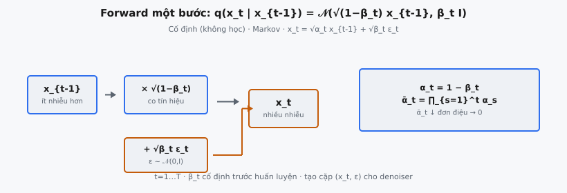
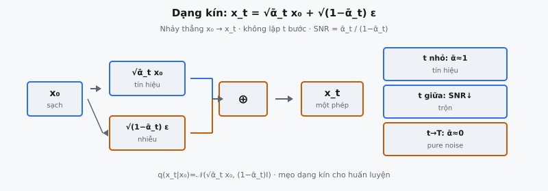

Forward diffusion process là nửa làm hỏng dữ liệu của Denoising Diffusion Probabilistic Models (DDPM). Ho et al. (2020) giới thiệu trong "Denoising Diffusion Probabilistic Models"; nó định nghĩa một Markov chain cố định thêm Gaussian noise dần vào mẫu dữ liệu sạch qua $T$ timestep cho đến khi mẫu gần như không phân biệt được với pure noise. Forward process không có tham số học được. Mục đích duy nhất là tạo các cặp huấn luyện nhiễu để dạy mạng nơ-ron đảo ngược sự làm hỏng.

## Nó là gì

Forward process nhận mẫu dữ liệu sạch $x_0$ rút từ phân phối dữ liệu thật $q(x_0)$ và sinh chuỗi các phiên bản ngày càng nhiễu $x_1, x_2, \ldots, x_T$. Ở mỗi timestep $t$, một lượng nhỏ Gaussian noise được cộng vào mẫu trước theo lịch variance cố định. Đến timestep cuối $T$, mẫu bị làm hỏng đủ mạnh để về cơ bản là một draw từ phân phối chuẩn $\mathcal{N}(0, I)$.

Đây là quá trình **cố định**. Khác với reverse process (dùng mạng nơ-ron đã học để khử nhiễu), forward process không cần huấn luyện. Noise schedule $\beta_1, \beta_2, \ldots, \beta_T$ được đặt trước khi huấn luyện bắt đầu và không đổi. Ho et al. mô tả rõ: "We define the forward process as a fixed Markov chain that gradually adds Gaussian noise to the data according to a variance schedule $\beta_1, \ldots, \beta_T$."

Tính chất Markov nghĩa là mỗi bước chỉ phụ thuộc mẫu ngay trước, không phụ thuộc các timestep sớm hơn. Điều này làm forward process khả giả về mặt toán và cho phép mẹo sampling dạng kín tránh lặp qua mọi bước $t$.

::: {#fig-ddpm-forward fig-cap="Forward một bước: $q(x_t|x_{t-1})=\\mathcal{N}(\\sqrt{1-\\beta_t}\\,x_{t-1},\\beta_t I)$; $x_t=\\sqrt{\\alpha_t}x_{t-1}+\\sqrt{\\beta_t}\\epsilon_t$. Cố định; $\\alpha_t=1-\\beta_t$, $\\bar{\\alpha}_t=\\prod\\alpha_s$." fig-alt="x_t-1 co tin hieu cong nhieu ra x_t."}
{fig-align="center"}
:::

::: {#fig-ddpm-closed fig-cap="Dạng kín: $x_t=\\sqrt{\\bar{\\alpha}_t}x_0+\\sqrt{1-\\bar{\\alpha}_t}\\epsilon$. Nhảy $x_0\\to x_t$ không lặp; $t$ nhỏ SNR cao, $t\\to T$ gần pure noise." fig-alt="To hop tin hieu va nhieu thanh x_t trong mot phep."}
{fig-align="center"}
:::

## Các phương trình chính

Forward process được định nghĩa bởi một Gaussian có điều kiện tại mỗi bước:

$$
q(x_t \mid x_{t-1}) = \mathcal{N}\!\left(x_t;\; \sqrt{1 - \beta_t}\, x_{t-1},\; \beta_t I\right)
$$

Nghĩa là: để có $x_t$ từ $x_{t-1}$, co mẫu trước bằng $\sqrt{1 - \beta_t}$ (thu nhỏ tín hiệu nhẹ) và cộng Gaussian noise với variance $\beta_t$. Tham số $\beta_t$ điều khiển lượng nhiễu được tiêm ở bước $t$.

Dùng **reparameterization trick**, ta viết dạng hàm tất định của $x_{t-1}$ và mẫu nhiễu:

$$
x_t = \sqrt{1 - \beta_t}\, x_{t-1} + \sqrt{\beta_t}\, \epsilon_t, \quad \epsilon_t \sim \mathcal{N}(0, I)
$$

Để xây ký hiệu cho kết quả dạng kín, định nghĩa hai đại lượng phụ:

$$
\alpha_t = 1 - \beta_t, \qquad \bar{\alpha}_t = \prod_{s=1}^{t} \alpha_s
$$

Ở đây $\alpha_t$ là phần tín hiệu được giữ ở bước $t$ (luôn hơi nhỏ hơn 1), và $\bar{\alpha}_t$ (alpha-bar) là tích lũy từ bước 1 đến $t$. Vì mỗi $\alpha_s < 1$, $\bar{\alpha}_t$ giảm đơn điệu về 0 khi $t$ tăng.

Phân phối liên hợp trên toàn chuỗi forward phân tích thành:

$$
q(x_{1:T} \mid x_0) = \prod_{t=1}^{T} q(x_t \mid x_{t-1})
$$

Phân tích này theo trực tiếp từ tính chất Markov.

## Mẹo dạng kín

Insight toán quan trọng nhất trong forward process là **không** cần lặp qua mọi bước $t$ để lấy mẫu $x_t$. Ta có thể nhảy trực tiếp từ $x_0$ sang $x_t$ trong một phép tính.

Đây là suy diễn. Bắt đầu một bước:

$$
x_1 = \sqrt{\alpha_1}\, x_0 + \sqrt{1 - \alpha_1}\, \epsilon_1
$$

Áp transition lần nữa để có $x_2$:

$$
x_2 = \sqrt{\alpha_2}\, x_1 + \sqrt{1 - \alpha_2}\, \epsilon_2
$$

Thay biểu thức của $x_1$:

$$
x_2 = \sqrt{\alpha_2}\left(\sqrt{\alpha_1}\, x_0 + \sqrt{1 - \alpha_1}\, \epsilon_1\right) + \sqrt{1 - \alpha_2}\, \epsilon_2
$$

$$
= \sqrt{\alpha_1 \alpha_2}\, x_0 + \sqrt{\alpha_2(1 - \alpha_1)}\, \epsilon_1 + \sqrt{1 - \alpha_2}\, \epsilon_2
$$

Hai số hạng cuối là Gaussian độc lập. Tổng của Gaussian độc lập $\mathcal{N}(0, \sigma_1^2 I)$ và $\mathcal{N}(0, \sigma_2^2 I)$ là Gaussian với variance $\sigma_1^2 + \sigma_2^2$. Variance kết hợp là:

$$
\alpha_2(1 - \alpha_1) + (1 - \alpha_2) = \alpha_2 - \alpha_1\alpha_2 + 1 - \alpha_2 = 1 - \alpha_1\alpha_2 = 1 - \bar{\alpha}_2
$$

Ta có thể thay hai số hạng nhiễu bằng một draw duy nhất:

$$
x_2 = \sqrt{\bar{\alpha}_2}\, x_0 + \sqrt{1 - \bar{\alpha}_2}\, \epsilon, \quad \epsilon \sim \mathcal{N}(0, I)
$$

Mẫu này giữ với mọi timestep $t$ theo quy nạp. Kết quả dạng kín tổng quát:

$$
q(x_t \mid x_0) = \mathcal{N}\!\left(x_t;\; \sqrt{\bar{\alpha}_t}\, x_0,\; (1 - \bar{\alpha}_t) I\right)
$$

Hay tương đương, dùng reparameterization trick:

$$
x_t = \sqrt{\bar{\alpha}_t}\, x_0 + \sqrt{1 - \bar{\alpha}_t}\, \epsilon, \quad \epsilon \sim \mathcal{N}(0, I)
$$

Đây là phương trình sẽ triển khai. Nó nhận ba input ($x_0$, $t$, và $\epsilon$) và sinh $x_t$ trong một phép vector hóa. Không vòng lặp, không lặp qua các timestep trung gian.

## Ý nghĩa các hệ số

Phương trình dạng kín $x_t = \sqrt{\bar{\alpha}_t}\, x_0 + \sqrt{1 - \bar{\alpha}_t}\, \epsilon$ là tổ hợp có trọng số của hai thành phần: dữ liệu sạch gốc và pure noise. Các hệ số điều khiển **signal-to-noise ratio (SNR)** tại mỗi timestep.

* $\sqrt{\bar{\alpha}_t}$ co **tín hiệu** (dữ liệu gốc $x_0$). Khi $t$ nhỏ, $\bar{\alpha}_t$ gần 1, hệ số này gần 1, giữ phần lớn dữ liệu gốc.
* $\sqrt{1 - \bar{\alpha}_t}$ co **nhiễu** ($\epsilon$). Khi $t$ nhỏ, $1 - \bar{\alpha}_t$ gần 0, rất ít nhiễu được thêm.

Khi $t$ tăng về $T$, tích lũy $\bar{\alpha}_t$ co về 0. Hệ số tín hiệu giảm và hệ số nhiễu tăng. Ở cực trị:

* **Tại $t = 0$**: $\bar{\alpha}_0 = 1$ theo quy ước, nên $x_0 = 1 \cdot x_0 + 0 \cdot \epsilon = x_0$. Mẫu hoàn toàn sạch.
* **Tại $t = T$**: $\bar{\alpha}_T \approx 0$ (với schedule chọn đúng), nên $x_T \approx 0 \cdot x_0 + 1 \cdot \epsilon = \epsilon$. Mẫu là pure noise.

Hai hệ số thỏa $(\sqrt{\bar{\alpha}_t})^2 + (\sqrt{1 - \bar{\alpha}_t})^2 = \bar{\alpha}_t + 1 - \bar{\alpha}_t = 1$. Đây là tính chất **variance-preserving**. Nếu $x_0$ có variance đơn vị và $\epsilon$ có variance đơn vị, thì $x_t$ cũng có variance đơn vị ở mọi timestep. Tổng năng lượng trong mẫu không đổi; chỉ tỷ lệ từ tín hiệu so với nhiễu thay đổi.

Thiết kế variance-preserving này là có chủ đích. Không có nó, độ lớn của $x_t$ sẽ tăng hoặc giảm theo thời gian, khiến mạng khử nhiễu khó hoạt động nhất quán xuyên suốt timestep.

## Bối cảnh bài báo

Ho et al. (2020) xây trên khung lý thuyết của Sohl-Dickstein et al. (2015), nhóm đầu tiên đề xuất dùng diffusion process cho generative modeling. Đóng góp then chốt của Ho et al. là chứng minh mục tiêu huấn luyện đơn giản hóa và các lựa chọn kiến trúc cụ thể có thể làm diffusion model sinh ảnh chất lượng cao cạnh tranh với GAN.

Trong bài gốc, forward process dùng **linear variance schedule** với $\beta_t$ tăng tuyến tính từ $\beta_1 = 10^{-4}$ đến $\beta_T = 0.02$ trên $T = 1000$ timestep. Nghĩa là tiêm nhiễu bắt đầu rất nhẹ (giá trị $\beta$ nhỏ ở bước đầu) và tăng tốc về cuối. Linear schedule được chọn theo kinh nghiệm; công trình sau của Nichol và Dhariwal (2021) giới thiệu cosine schedule phân bổ nhiễu đều hơn xuyên suốt timestep và cải thiện chất lượng mẫu.

Forward process cố định (không học) là lựa chọn thiết kế có chủ đích. Sohl-Dickstein et al. thử nghiệm học noise schedule, nhưng Ho et al. thấy cố định nó đơn giản hóa huấn luyện rất nhiều. Với forward process cố định, thành phần duy nhất học được là mạng khử nhiễu reverse. Số timestep $T = 1000$ lớn có chủ đích: nhiều bước hơn nghĩa là mỗi bước chỉ thêm một lượng nhiễu rất nhỏ, khiến transition reverse gần Gaussian hơn — giả định then chốt trong suy diễn reverse process.

## Ví dụ số

Giả sử có điểm dữ liệu 2D $x_0 = [0.5, -0.3]$ và lấy mẫu nhiễu $\epsilon = [0.8, -1.2]$. Ta tính $x_t$ tại ba timestep khác nhau để thấy tín hiệu suy thoái dần.

Với linear schedule điển hình $T = 1000$, giá trị xấp xỉ của $\bar{\alpha}_t$ tại các timestep chọn lọc:

* $\bar{\alpha}_{100} \approx 0.9048$
* $\bar{\alpha}_{500} \approx 0.0821$
* $\bar{\alpha}_{1000} \approx 0.0001$

### Tại $t = 100$

$$
x_{100} = \sqrt{0.9048} \cdot [0.5, -0.3] + \sqrt{1 - 0.9048} \cdot [0.8, -1.2]
$$

$$
= 0.9513 \cdot [0.5, -0.3] + 0.3087 \cdot [0.8, -1.2]
$$

$$
= [0.4756, -0.2854] + [0.2469, -0.3704]
$$

$$
= [0.7226, -0.6558]
$$

Kết quả vẫn gần bản gốc. Hệ số tín hiệu (0.9513) chi phối hệ số nhiễu (0.3087), cấu trúc gốc phần lớn còn nguyên.

### Tại $t = 500$

$$
x_{500} = \sqrt{0.0821} \cdot [0.5, -0.3] + \sqrt{1 - 0.0821} \cdot [0.8, -1.2]
$$

$$
= 0.2865 \cdot [0.5, -0.3] + 0.9580 \cdot [0.8, -1.2]
$$

$$
= [0.1433, -0.0860] + [0.7664, -1.1496]
$$

$$
= [0.9097, -1.2356]
$$

Giờ nhiễu chi phối. Hệ số tín hiệu (0.2865) bị lấn át bởi hệ số nhiễu (0.9580). Giá trị gần như không còn giống $[0.5, -0.3]$ gốc.

### Tại $t = 1000$

$$
x_{1000} = \sqrt{0.0001} \cdot [0.5, -0.3] + \sqrt{1 - 0.0001} \cdot [0.8, -1.2]
$$

$$
= 0.01 \cdot [0.5, -0.3] + 0.99995 \cdot [0.8, -1.2]
$$

$$
= [0.005, -0.003] + [0.7999, -1.1999]
$$

$$
= [0.8049, -1.2029]
$$

Tín hiệu gốc chỉ đóng góp $[0.005, -0.003]$, không đáng kể. Đầu ra về cơ bản là vectơ nhiễu, xác nhận tại $t = T$ forward process đã phá hết thông tin về $x_0$. Sự làm hỏng dần này là ý tưởng cốt lõi: forward process tạo cầu nối mượt từ dữ liệu có cấu trúc sang nhiễu không cấu trúc, và reverse process học đi ngược cầu đó.

## Vì sao cần trả về cả $x_t$ và $\epsilon$

Khi triển khai forward process cho huấn luyện, hàm phải trả về **cả** mẫu nhiễu $x_t$ **và** vectơ nhiễu $\epsilon$ dùng để tạo nó. Không tùy chọn; cả hai đều cần cho mục tiêu huấn luyện.

Training loss đơn giản hóa từ Ho et al.:

$$
L_{\text{simple}} = \mathbb{E}_{t, x_0, \epsilon}\left[\left\| \epsilon - \epsilon_\theta(x_t, t) \right\|^2\right]
$$

Ở đây $\epsilon_\theta(x_t, t)$ là dự đoán nhiễu của mạng nơ-ron, cho input nhiễu $x_t$ và timestep $t$. Loss so sánh dự đoán này với **nhiễu thật** $\epsilon$ được lấy mẫu trong forward process.

Trong một bước huấn luyện, luồng là:

1. **Lấy mẫu** ảnh sạch $x_0$ từ dataset
2. **Lấy mẫu** timestep ngẫu nhiên $t \sim \text{Uniform}(\{1, 2, \ldots, T\})$
3. **Lấy mẫu** nhiễu $\epsilon \sim \mathcal{N}(0, I)$
4. **Tính** $x_t = \sqrt{\bar{\alpha}_t}\, x_0 + \sqrt{1 - \bar{\alpha}_t}\, \epsilon$ (forward process)
5. **Dự đoán** $\hat{\epsilon} = \epsilon_\theta(x_t, t)$ (forward pass mạng nơ-ron)
6. **Tính loss** $\|\epsilon - \hat{\epsilon}\|^2$ (MSE giữa nhiễu thật và dự đoán)

Bước 4 dùng $\epsilon$ để tạo $x_t$. Bước 6 dùng cùng $\epsilon$ làm target hồi quy. Nếu hàm forward chỉ trả $x_t$, không thể tính loss. Khác với phân loại, nơi nhãn đến từ dataset — trong huấn luyện DDPM, "nhãn" ($\epsilon$) được sinh tại chỗ như phần của forward process, nên hàm forward đồng thời tạo input ($x_t$) và target ($\epsilon$).

## Các lỗi thường gặp

* **Nhầm $\alpha_t$ với $\bar{\alpha}_t$.** $\alpha_t = 1 - \beta_t$ là hệ số giữ tín hiệu theo từng bước. $\bar{\alpha}_t = \prod_{s=1}^t \alpha_s$ là tích lũy. Phương trình dạng kín dùng $\bar{\alpha}_t$, không phải $\alpha_t$. Dùng $\alpha_t$ thay vào chỉ tính một bước thêm nhiễu thay vì hiệu ứng tích lũy của $t$ bước, khiến kết quả ít nhiễu hơn nhiều so với đúng.
* **Hoán hệ số tín hiệu và nhiễu.** Công thức đúng là $x_t = \sqrt{\bar{\alpha}_t}\, x_0 + \sqrt{1 - \bar{\alpha}_t}\, \epsilon$. Viết $\sqrt{1 - \bar{\alpha}_t}\, x_0 + \sqrt{\bar{\alpha}_t}\, \epsilon$ đảo vai trò: timestep sớm chủ yếu là nhiễu và timestep muộn chủ yếu là tín hiệu — ngược với forward process.
* **Quên trả về $\epsilon$.** Nếu hàm forward chỉ trả $x_t$, vòng huấn luyện không tính được loss $\|\epsilon - \epsilon_\theta(x_t, t)\|^2$ vì không có nhiễu ground-truth. Người triển khai có thể lấy mẫu nhiễu mới cho target loss, phá tương ứng giữa input và nhãn.
* **Lặp qua mọi bước $t$ thay vì dùng dạng kín.** Triển khai naive có thể lặp từ $x_0$ sang $x_1$ sang $x_2$ … đến $x_t$. Toán đúng nhưng cực chậm: với $T = 1000$, chạy 1000 lần lấy mẫu Gaussian tuần tự mỗi ảnh thay vì một phép vector hóa. Dạng kín tồn tại để tránh điều này.
* **Lệch chiều giữa $x_0$ và $\epsilon$.** Nhiễu $\epsilon$ phải cùng shape với $x_0$. Với dữ liệu ảnh, $\epsilon \in \mathbb{R}^{B \times C \times H \times W}$. Lấy mẫu nhiễu sai shape sẽ crash do broadcasting hoặc im lặng cho kết quả sai qua broadcasting không mong muốn.
* **Dùng sai phân phối cho $\epsilon$.** Nhiễu phải rút từ chuẩn $\mathcal{N}(0, I)$, không phải uniform, không phải Bernoulli, không phải normal variance khác đơn vị. Toàn bộ suy diễn giả định Gaussian noise; phân phối khác phá dạng kín và vô hiệu mục tiêu huấn luyện.
* **Áp $\beta_t$ trực tiếp làm hệ số nhiễu.** Viết $x_t = \sqrt{1 - \beta_t}\, x_0 + \sqrt{\beta_t}\, \epsilon$ dùng công thức transition một bước (từ $x_{t-1}$ sang $x_t$), không phải nhảy dạng kín từ $x_0$ sang $x_t$. Điều này đánh giá thấp mạnh tổng nhiễu ở mọi timestep ngoài $t = 1$.


## Code
```python
import numpy as np

def get_alpha_bar(betas):
    alphas = 1 - np.array(betas, dtype=float)
    return [round(float(v), 6) for v in np.cumprod(alphas)]

def forward_diffusion(x_0, t, betas, epsilon):
    x_0 = np.array(x_0, dtype=float)
    betas = np.array(betas, dtype=float)
    epsilon = np.array(epsilon, dtype=float)
    alpha_bar = np.cumprod(1 - betas)
    abt = alpha_bar[t - 1]
    x_t = np.sqrt(abt) * x_0 + np.sqrt(1 - abt) * epsilon
    
    def to_list(a):
        if a.ndim == 0:
            return round(float(a), 4)
        return [to_list(row) for row in a]
    return to_list(x_t)

```
