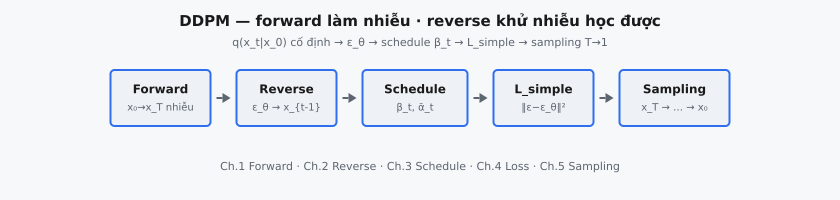

Denoising Diffusion Probabilistic Models (DDPM) là mô hình sinh học phân phối dữ liệu bằng cách đảo ngược một quá trình làm nhiễu dần. Forward diffusion process dần làm hỏng dữ liệu bằng Gaussian noise qua nhiều timestep, trong khi reverse process đã học khử nhiễu từng bước để tổng hợp mẫu realistic từ pure noise.

::: {#fig-ddpm-pipeline fig-cap="Pipeline DDPM: Forward ($x_0\\to x_T$) → Reverse ($\\epsilon_\\theta$) → Schedule ($\\beta_t,\\bar{\\alpha}_t$) → $L_{\\mathrm{simple}}$ → Sampling ($x_T\\to\\cdots\\to x_0$)." fig-alt="Sơ đồ khối ngang từ Forward tới Sampling."}
{fig-align="center"}
:::

DDPM tái khung generation như tinh chỉnh stochastic lặp lại thay vì decode một lần. Cách này thường cải thiện training stability và sample diversity so với adversarial training, với chi phí sampling chậm hơn do nhiều bước denoising.

## Phần này bao gồm những gì

Chuỗi chương này đi theo pipeline diffusion đầy đủ:

1. Định nghĩa forward diffusion process và trực giác — Markov chain cố định thêm Gaussian noise dần vào mẫu dữ liệu sạch $x_0$ cho đến khi mẫu gần như không phân biệt được với pure noise.
2. Reverse diffusion process và denoiser đã học — mạng dự đoán nhiễu $\epsilon_\theta(x_t, t)$ và công thức bước reverse để khôi phục $x_{t-1}$ từ $x_t$.
3. Thiết kế noise schedule và trọng số theo timestep — lịch $\beta_t$, tích lũy $\bar{\alpha}_t$ và tác động lên signal-to-noise ratio (SNR) xuyên suốt chuỗi diffusion.
4. Suy diễn DDPM training loss và parameterization — mục tiêu MSE trên nhiễu, liên hệ với variational lower bound (VLB) và các lựa chọn parameterization.
5. Quy trình sampling từ noise đến dữ liệu — lặp reverse từ $t = T$ xuống $t = 1$ để biến random noise thành mẫu có cấu trúc.

Mục tiêu là nối formulation xác suất, mục tiêu huấn luyện và quy trình generation thực tế.

## Tại sao DDPM vẫn quan trọng

Diffusion model hiện là trung tâm của generative AI hiện đại vì chúng cung cấp:

* tối ưu hóa ổn định với chất lượng mẫu mạnh,
* giao diện conditioning linh hoạt,
* và khung xác suất với training target rõ ràng.

Hiểu DDPM tạo nền tảng khái niệm cho nhiều generator ảnh và đa phương thức state-of-the-art.

## Kiến thức tiên quyết

* Gaussian noise và trực giác cơ bản về stochastic process.
* Cơ bản huấn luyện mạng khử nhiễu (neural denoising).
* Quen thuộc với formulation variational / tối thiểu hóa loss.
* Động lực mô hình lặp theo chỉ số thời gian (time-indexed iterative dynamics).

## Ký hiệu được sử dụng trong phần này

$$
\begin{aligned}
x_0 &:\ \text{mẫu dữ liệu sạch}, \\
x_t &:\ \text{mẫu nhiễu tại bước diffusion } t, \\
\beta_t, \alpha_t &:\ \text{tham số noise schedule}, \\
\epsilon_{\theta}(x_t, t) &:\ \text{nhiễu dự đoán từ denoiser}, \\
T &:\ \text{tổng số bước diffusion}.
\end{aligned}
$$

::: {.callout-tip}
## Backbone densenet thường gặp
Nhiều diffusion model dùng U-Net làm denoiser $\epsilon_\theta$. Xem [U-Net](../UNet/index.qmd) nếu cần ôn encoder–decoder + skip.
:::
