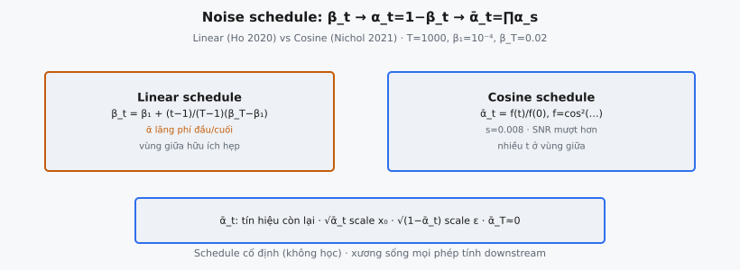

**Noise schedule** là dãy các giá trị phương sai $\beta_1, \beta_2, \dots, \beta_T$ điều khiển lượng nhiễu Gaussian được inject vào mỗi **timestep** của **forward process**. Trong Denoising Diffusion Probabilistic Models (Ho, Gulrajani, và Abbeel, 2020), schedule này là xương sống của khung generative. Mọi đại lượng downstream — mẫu huấn luyện nhiễu, signal-to-noise ratio (SNR), và target dự đoán của mạng — đều suy ra từ dãy scalar này.

Một schedule chọn kém hoặc lãng phí bước khi dữ liệu đã bị phá hủy, hoặc không biến đầu vào thành nhiễu thuần túy đến **timestep** cuối.

## Nó là gì / Nó làm gì

**Noise schedule** định nghĩa **forward process** $q(x_t | x_{t-1})$ tại mỗi **timestep**. Ở bước $t$, nhiễu Gaussian scaled bởi $\beta_t$ được cộng thêm và tín hiệu được scale bởi $\sqrt{1 - \beta_t}$. Qua $T$ bước, quá trình này biến mọi phân phối dữ liệu thành Gaussian đẳng hướng.

- **Tốc độ phá hủy forward:** $\beta_t$ lớn hơn nghĩa là nhiều nhiễu hơn mỗi bước, tín hiệu bị phá nhanh hơn.
- **Độ khó denoising reverse:** $\beta_t$ lớn hơn nghĩa là mỗi bước **reverse** phải gỡ nhiều nhiễu hơn, khiến dự đoán khó hơn.

::: {#fig-ddpm-schedule fig-cap="Schedule: $\\beta_t\\to\\alpha_t=1-\\beta_t\\to\\bar{\\alpha}_t$. Linear (Ho: $\\beta_1=10^{-4},\\beta_T=0.02,T=1000$) vs Cosine (Nichol: $\\bar{\\alpha}_t=f(t)/f(0)$). $\\bar{\\alpha}_t$ = tín hiệu còn lại." fig-alt="Hai panel linear va cosine schedule."}
{fig-align="center"}
:::

Schedule là hyperparameter cố định, không được học. Từ $\beta_t$, hai đại lượng suy ra chi phối mọi phép tính:

- **$\alpha_t = 1 - \beta_t$:** Hệ số giữ tín hiệu ở bước $t$.
- **$\bar{\alpha}_t = \prod_{s=1}^{t} \alpha_s$:** Tích lũy giữ tín hiệu từ bước 0 đến bước $t$. Cho phép nhảy trực tiếp từ dữ liệu sạch $x_0$ sang dữ liệu nhiễu $x_t$ mà không cần lặp qua các bước trung gian.

## Các phương trình chính

**Forward process** tại mỗi bước:

$$
q(x_t | x_{t-1}) = \mathcal{N}(x_t; \sqrt{1 - \beta_t}\, x_{t-1},\; \beta_t \mathbf{I})
$$

Phân phối biên $q(x_t | x_0)$ có dạng kín qua $\bar{\alpha}_t$:

$$
q(x_t | x_0) = \mathcal{N}(x_t; \sqrt{\bar{\alpha}_t}\, x_0,\; (1 - \bar{\alpha}_t) \mathbf{I})
$$

Mọi mẫu nhiễu ở bước $t$ có thể viết:

$$
x_t = \sqrt{\bar{\alpha}_t}\, x_0 + \sqrt{1 - \bar{\alpha}_t}\, \epsilon, \quad \epsilon \sim \mathcal{N}(0, \mathbf{I})
$$

Các đại lượng suy ra:

- **Giữ tín hiệu mỗi bước:** $\alpha_t = 1 - \beta_t$
- **Giữ tín hiệu tích lũy:** $\bar{\alpha}_t = \prod_{s=1}^{t} \alpha_s = \alpha_1 \cdot \alpha_2 \cdots \alpha_t$
- **Hệ số nhiễu:** $\sqrt{1 - \bar{\alpha}_t}$ scale nhiễu ở bước $t$.
- **Hệ số tín hiệu:** $\sqrt{\bar{\alpha}_t}$ scale dữ liệu sạch ở bước $t$.

**Linear schedule** định nghĩa $\beta_t$ bằng nội suy:

$$
\beta_t = \beta_1 + \frac{t - 1}{T - 1}(\beta_T - \beta_1)
$$

với $\beta_1 = 10^{-4}$, $\beta_T = 0.02$, và $T = 1000$.

**Cosine schedule** từ Nichol và Dhariwal (2021) định nghĩa $\bar{\alpha}_t$ trực tiếp:

$$
\bar{\alpha}_t = \frac{f(t)}{f(0)}, \quad f(t) = \cos\left(\frac{t/T + s}{1 + s} \cdot \frac{\pi}{2}\right)^2
$$

với $s = 0.008$ là offset nhỏ ngăn $\beta_t$ quá nhỏ gần $t = 0$.

## Linear Schedule

Ho et al. chọn schedule đơn giản nhất: nội suy linear của $\beta_t$ từ $\beta_1 = 10^{-4}$ đến $\beta_T = 0.02$ qua $T = 1000$ bước.

- **$\beta_1 = 10^{-4}$ (khởi đầu rất nhỏ):** Ở $t = 1$, gần như không thêm nhiễu. Bước forward đầu tiên hầu như không làm thay đổi dữ liệu.
- **$\beta_T = 0.02$ (kết thúc vừa phải):** Sau 1000 bước tích lũy, $\bar{\alpha}_T$ bị đẩy gần zero — $x_T$ gần như nhiễu Gaussian thuần.
- **$T = 1000$ bước:** Mỗi bước **reverse** là một tác vụ denoising nhỏ, có thể học. Ít bước hơn sẽ yêu cầu nhảy $\beta_t$ lớn hơn.

Với các giá trị này, $\bar{\alpha}_t$ bắt đầu gần 1 và giảm đơn điệu. Giai đoạn đầu, mỗi $\alpha_t \approx 0.9999$ nên tích gần như không đổi. Ở giữa, $\bar{\alpha}_t$ giảm đều. Gần cuối, nó tiến nhanh về zero.

Linear schedule có bất đối xứng đã biết: $\bar{\alpha}_t$ dành nhiều **timestep** đầu gần 1 và **timestep** cuối gần 0. Vùng chuyển tiếp hữu ích tập trung ở phần giữa. Mô hình lãng phí capacity cho denoising gần như tầm thường ở đầu và gần như không thể ở cuối.

## Cosine Schedule

Nichol và Dhariwal (2021) chỉ ra sự kém hiệu quả của linear schedule: quá nhiều **timestep** dành cho vùng $\bar{\alpha}_t$ gần 1 hoặc gần 0. Giải pháp của họ: định nghĩa $\bar{\alpha}_t$ trực tiếp qua hàm cosine, rồi suy ra $\beta_t$.

$$
\bar{\alpha}_t = \frac{f(t)}{f(0)}, \quad f(t) = \cos\left(\frac{t/T + s}{1 + s} \cdot \frac{\pi}{2}\right)^2
$$

Tính chất chính:

- **Ở $t = 0$:** $f(0)/f(0) = 1$, nên $\bar{\alpha}_0 = 1$ (tín hiệu thuần).
- **Ở $t = T$:** Đối số cosine tiến tới $\pi/2$, nên $\bar{\alpha}_T \to 0$ (nhiễu thuần).
- **Offset $s = 0.008$:** Ngăn $\beta_t$ quá nhỏ gần $t = 0$, đảm bảo nhiễu không tầm thường ngay từ bước đầu.
- **Dạng cosine:** Cosine bình phương tạo đường cong $\bar{\alpha}_t$ dạng chữ S chuyển mượt từ 1 xuống 0.

Sau khi $\bar{\alpha}_t$ được định nghĩa, $\beta_t$ được khôi phục:

$$
\beta_t = 1 - \frac{\bar{\alpha}_t}{\bar{\alpha}_{t-1}}
$$

Nichol và Dhariwal clip $\beta_t$ tối đa $0.999$ để tránh mất ổn định số học gần cuối schedule. Lợi ích thực tế: SNR giảm dần hơn, nhiều **timestep** hơn nằm trong vùng giữa có thông tin, và chất lượng mẫu cải thiện.

## $\bar{\alpha}_t$ biểu thị điều gì

$\bar{\alpha}_t$ nắm giữ tổng lượng tín hiệu còn lại từ $x_0$ đến $x_t$. Đây là đại lượng quan trọng nhất trong khung diffusion.

- **$\bar{\alpha}_t$ gần 1:** Mẫu chủ yếu là dữ liệu sạch. Thành phần nhiễu $\sqrt{1 - \bar{\alpha}_t}\, \epsilon$ nhỏ.
- **$\bar{\alpha}_t$ gần 0.5:** Phương sai tín hiệu và nhiễu bằng nhau. Mô hình phải trích cấu trúc từ đầu vào bị phá hủy nặng.
- **$\bar{\alpha}_t$ gần 0:** Gần như nhiễu thuần. Dữ liệu gốc gần như không thể khôi phục.

SNR (signal-to-noise ratio) chính thức tại **timestep** $t$:

$$
\text{SNR}(t) = \frac{\bar{\alpha}_t}{1 - \bar{\alpha}_t}
$$

Loss DDPM có thể viết lại theo SNR, và trọng số **timestep** ngầm điều khiển tập trung vào các mức nhiễu khác nhau.

- **SNR cao (timestep đầu):** Mô hình học chi tiết tinh và đặc trưng tần số cao.
- **SNR thấp (timestep cuối):** Mô hình học cấu trúc thô, toàn cục.
- **Schedule quyết định đường cong SNR:** Chuyển từ linear sang cosine dịch chuyển vùng SNR nào nhận nhiều **timestep** hơn.

Các hệ số thỏa $\bar{\alpha}_t + (1 - \bar{\alpha}_t) = 1$, nên tổng phương sai được bảo toàn ở mọi **timestep**. Tính chất variance-preserving này khiến **forward process** ổn định.

## Bối cảnh bài báo

Ho et al. (2020) đưa ra các lựa chọn cố ý đơn giản để chứng minh diffusion model cạnh tranh được với GAN.

- **$T = 1000$:** Đảm bảo mỗi bước **reverse** là nhiễu loạn nhỏ. Bài báo: "We set $T = 1000$ for all experiments."
- **Linear $\beta_t$ từ $10^{-4}$ đến $0.02$:** Bài báo: "We set the forward process variances to constants increasing linearly from $\beta_1 = 10^{-4}$ to $\beta_T = 0.02$."
- **Schedule cố định (không học):** Họ thử học $\Sigma_\theta$ nhưng thấy cố định về $\beta_t \mathbf{I}$ hoặc $\tilde{\beta}_t \mathbf{I}$ hoạt động tốt.

Loss huấn luyện đơn giản hóa:

$$
L_{\text{simple}} = \mathbb{E}_{t, x_0, \epsilon}\left[\|\epsilon - \epsilon_\theta(x_t, t)\|^2\right]
$$

với $t \sim \text{Uniform}\{1, \dots, T\}$. Schedule xuất hiện qua $x_t = \sqrt{\bar{\alpha}_t}\, x_0 + \sqrt{1 - \bar{\alpha}_t}\, \epsilon$. Lấy mẫu $t$ đều với linear schedule huấn luyện quá mức vùng dễ và khó, huấn luyện thiếu vùng giữa có thông tin. Nichol và Dhariwal sau đó chỉ ra điều này là suboptimal.

Dù đơn giản, linear schedule đạt FID 3.17 trên CIFAR-10, khẳng định diffusion model cạnh tranh được.

## Ví dụ số

Linear schedule với $\beta_1 = 10^{-4}$, $\beta_T = 0.02$, $T = 1000$. Bước nhảy:

$$
\Delta\beta = \frac{\beta_T - \beta_1}{T - 1} = \frac{0.02 - 0.0001}{999} \approx 1.99 \times 10^{-5}
$$

**Timestep đầu (t = 1, 2, 3):**

- **$t = 1$:** $\beta_1 = 0.0001$, $\alpha_1 = 0.9999$, $\bar{\alpha}_1 = 0.9999$
- **$t = 2$:** $\beta_2 = 0.0001199$, $\alpha_2 = 0.9998801$, $\bar{\alpha}_2 = 0.9999 \times 0.9998801 = 0.9997801$
- **$t = 3$:** $\beta_3 = 0.0001399$, $\alpha_3 = 0.9998601$, $\bar{\alpha}_3 = 0.9997801 \times 0.9998601 = 0.9996403$

Sau 3 bước, $\bar{\alpha}_3 \approx 0.9996$. Trong phương trình **sampling**, hệ số nhiễu chỉ $\sqrt{0.0004} = 0.02$. Ảnh nhiễu trông không phân biệt được với ảnh gốc.

**Timestep cuối (t = 999, 1000):**

- **$t = 999$:** $\beta_{999} = 0.01990$, $\alpha_{999} = 0.98010$
- **$t = 1000$:** $\beta_{1000} = 0.02000$, $\alpha_{1000} = 0.98000$

Tích tích lũy tại $t = 1000$ tính qua log-sum:

$$
\log \bar{\alpha}_{1000} = \sum_{s=1}^{1000} \log(1 - \beta_s) \approx -10.0
$$

Cho $\bar{\alpha}_{1000} \approx e^{-10.0} \approx 4.5 \times 10^{-5}$. Phương trình **sampling** trở thành $x_{1000} \approx 0.0067\, x_0 + 0.9999\, \epsilon$, gần như nhiễu thuần.

**Hồ sơ suy giảm qua các timestep:**

- **$t = 100$:** $\bar{\alpha}_{100} \approx 0.990$ (1% phương sai nhiễu)
- **$t = 250$:** $\bar{\alpha}_{250} \approx 0.940$ (6% phương sai nhiễu)
- **$t = 500$:** $\bar{\alpha}_{500} \approx 0.725$ (27.5% phương sai nhiễu)
- **$t = 750$:** $\bar{\alpha}_{750} \approx 0.300$ (70% phương sai nhiễu)
- **$t = 900$:** $\bar{\alpha}_{900} \approx 0.045$ (95.5% phương sai nhiễu)
- **$t = 1000$:** $\bar{\alpha}_{1000} \approx 0.00005$ (99.995% phương sai nhiễu)

Điều này cho thấy bất đối xứng: 250 bước đầu chỉ phá 6% tín hiệu, trong khi bước 750–1000 dành cho vùng tín hiệu đã bị phá hơn 95%. Cosine schedule phân bố lại **timestep** để dành nhiều thời gian hơn cho $\bar{\alpha}_t \in [0.1, 0.9]$.

## Bối cảnh hiện đại

Linear schedule là điểm khởi đầu. Công trình sau đó tạo ra nhiều lựa chọn thay thế.

- **Cosine schedule (Nichol và Dhariwal, 2021):** Cải tiến được áp dụng rộng nhất. SNR suy giảm mượt hơn dẫn tới FID tốt hơn. Dùng trong Improved DDPM và nhiều mô hình sau.
- **Sigmoid schedule:** Dùng sigmoid định nghĩa $\bar{\alpha}_t$, cung cấp điểm uốn có thể điều chỉnh kiểm soát vùng phá hủy tín hiệu nhanh nhất.
- **Learned schedule:** Một số hướng học $\beta_t$ đồng thời với tham số mô hình, dù chưa trở thành chuẩn.
- **Continuous-time diffusion (Song et al., 2021):** Thay schedule rời rạc bằng SDE liên tục, $\beta(t)$ cho $t \in [0, 1]$, thống nhất DDPM và score-matching.
- **Flow matching (Lipman et al., 2023):** Định nghĩa đường thẳng $x_t = (1-t)\, x_0 + t\, \epsilon$ không cần schedule $\beta_t$.
- **Resolution-dependent schedule:** Chen (2023) chỉ ra schedule tối ưu phụ thuộc độ phân giải. Ảnh độ phân giải cao cần thêm nhiễu chậm hơn.
- **Timestep spacing cho fast sampling:** Với ít bước hơn (ví dụ DDIM 50 bước), chọn **timestep** nào để đánh giá cũng là câu hỏi thiết kế schedule.

Xu hướng là hướng tới schedule đơn giản hơn (flow matching loại bỏ hoàn toàn) hoặc adaptive (solver liên tục chọn kích thước bước). Linear schedule của Ho et al. vẫn là baseline và tham chiếu sư phạm.

## Các lỗi thường gặp

### $\bar{\alpha}_T$ không tiến gần zero

Nếu $\bar{\alpha}_T$ không gần zero, $q(x_T | x_0)$ khác $\mathcal{N}(0, \mathbf{I})$. **Reverse process** bắt đầu từ prior này, nên mọi lệch gây bias hệ thống. Với schedule của Ho et al., $\bar{\alpha}_{1000} \approx 4.5 \times 10^{-5}$, đủ nhỏ để tránh vấn đề này.

### Underflow số học trong tích tích lũy

Tính $\prod_{s=1}^{t} (1 - \beta_s)$ dạng tích chạy trong float32 có thể underflow về zero với $t$ lớn, khiến gradient loss suy biến. Cách sửa: tính $\log \bar{\alpha}_t = \sum \log(1 - \beta_s)$ trong log-space và lũy thừa chỉ khi cần, hoặc dùng float64.

### Off-by-one trong chỉ mục timestep

Một số implementation index từ 0 đến $T-1$, số khác từ 1 đến $T$. Công thức giả định index 1-based. Dùng 0-based mà không điều chỉnh dịch toàn bộ schedule. Luôn kiểm tra $\beta$ ở chỉ mục đầu bằng $\beta_1$ và ở chỉ mục cuối bằng $\beta_T$.

### Nhầm $\beta_t$ với $\alpha_t$

$\beta_t$ là phương sai nhiễu; $\alpha_t = 1 - \beta_t$ là giữ tín hiệu. Truyền $\beta_t$ vào chỗ cần $\alpha_t$ đảo mức nhiễu — mô hình thấy nhiễu thuần ở $t = 1$ và dữ liệu sạch ở $t = T$. Loss huấn luyện bùng nổ ngay.

### Sai giá trị $T$

Huấn luyện dùng $T = 1000$ nhưng **sampling** dùng $T = 500$ mà không tính lại schedule thì mọi $\bar{\alpha}_t$ sai. Cách sửa: huấn luyện lại với $T$ mới hoặc dùng timestep skipping kiểu DDIM (tập con 1000 bước gốc).

### $\beta_t$ quá lớn

Giá trị $\beta_t$ lớn (ví dụ $> 0.1$) phá vỡ xấp xỉ Gaussian trong **reverse process**. Cosine schedule clip $\beta_t$ ở 0.999 vì lý do này.


## Code
```python
import numpy as np

def linear_beta_schedule(T, beta_1=0.0001, beta_T=0.02):
    result = np.linspace(beta_1, beta_T, T)
    return [round(float(v), 6) for v in result]

def cosine_alpha_bar_schedule(T, s=0.008):
    steps = np.arange(T + 1) / T
    f = np.cos((steps + s) / (1 + s) * np.pi / 2) ** 2
    alpha_bars = f[1:] / f[0]
    alpha_bars = np.clip(alpha_bars, 0.0001, 0.9999)
    return [round(float(v), 6) for v in alpha_bars]

def alpha_bar_to_betas(alpha_bars):
    ab = np.array(alpha_bars, dtype=float)
    ab_prev = np.concatenate([[1.0], ab[:-1]])
    betas = 1 - ab / ab_prev
    betas = np.clip(betas, 0.0001, 0.9999)
    return [round(float(v), 6) for v in betas]

```
