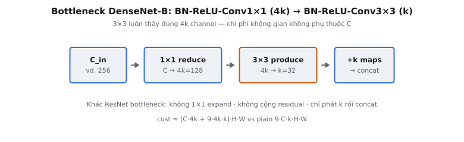

Bottleneck layer của DenseNet (Huang et al., 2017) là hàm composite dùng trong mọi dense block của biến thể DenseNet-B. Nó đặt convolution $1 \times 1$ trước convolution $3 \times 3$ đắt để cắt số feature map đầu vào, giữ dense connectivity vẫn khả thi về chi phí khi mạng sâu hơn.

## Nó là gì / Nó làm gì

Một dense block kết nối mọi lớp với mọi lớp khác theo kiểu feed-forward. Lớp $\ell$ nhận concatenation mọi feature map trước làm đầu vào, nên số channel đầu vào tăng tuyến tính theo độ sâu: $C_0 + (\ell - 1) \cdot k$, với $k$ là **growth rate** (số feature map mỗi lớp thêm). Dù $k$ nhỏ, đầu vào của lớp sâu vẫn có thể có hàng trăm channel.

Chạy convolution $3 \times 3$ trực tiếp trên nhiều channel đầu vào như vậy rất đắt. Bottleneck layer sửa bằng cách chèn convolution $1 \times 1$ giảm đầu vào rộng xuống width cố định $4k$ channel trước khi convolution $3 \times 3$ chạy. Bài báo gọi đây là phiên bản **BN-ReLU-Conv(1x1)-BN-ReLU-Conv(3x3)**, viết tắt **DenseNet-B**.

Composite hai giai đoạn:

* **Giai đoạn 1 (reduce):** BatchNorm, ReLU, rồi convolution $1 \times 1$ ánh xạ $C$ channel rộng xuống $4k$ channel.
* **Giai đoạn 2 (produce):** BatchNorm, ReLU, rồi convolution $3 \times 3$ ánh xạ $4k$ channel xuống đúng $k$ feature map mới.

Độ phân giải không gian $H \times W$ được bảo toàn xuyên suốt vì convolution $1 \times 1$ không cần padding và convolution $3 \times 3$ dùng padding $1$ với stride $1$. Bảo toàn kích thước không gian là thiết yếu: mọi lớp trong dense block phải phát feature map cùng chiều cao và chiều rộng để concatenation theo chiều channel xác định tốt.

Hình dung data flow trong một dense block. Block bắt đầu với $C_0$ channel. Bottleneck layer đầu đọc $C_0$ channel đó và phát $k$ channel mới, được concat thành $C_0 + k$ channel. Bottleneck thứ hai đọc toàn bộ $C_0 + k$ và phát thêm $k$, cho $C_0 + 2k$, và cứ thế. Sau $L$ lớp block giữ $C_0 + Lk$ channel. Giảm $1 \times 1$ của bottleneck chính là thứ giữ convolution $3 \times 3$ mỗi lớp rẻ dù stack đã concat ngày càng rộng.

::: {#fig-densenet-bottleneck fig-cap="Bottleneck DenseNet-B: $C \\to 4k$ bằng Conv $1\\times1$, rồi $4k \\to k$ bằng Conv $3\\times3$ — không expand, không cộng residual." fig-alt="Chuỗi C_in, 1x1 reduce, 3x3 produce, +k maps concat."}
{fig-align="center"}
:::

## Các phương trình chính

Mỗi giai đoạn batch normalization, ở chế độ evaluation, dùng running mean $\mu$, running variance $\sigma^2$, scale học $\gamma$, và shift học $\beta$. Với channel $c$:

$$
\text{BN}(x)_c = \gamma_c \cdot \frac{x_c - \mu_c}{\sqrt{\sigma_c^2 + \epsilon}} + \beta_c
$$

với $\epsilon$ là hằng số nhỏ cho ổn định số (mặc định $10^{-5}$). Composite bottleneck đầy đủ, với đầu vào $x \in \mathbb{R}^{N \times C \times H \times W}$, là:

$$
y_1 = \text{Conv}_{1\times1}\!\left(\text{ReLU}\!\left(\text{BN}_1(x)\right)\right) \in \mathbb{R}^{N \times 4k \times H \times W}
$$

$$
y_2 = \text{Conv}_{3\times3}\!\left(\text{ReLU}\!\left(\text{BN}_2(y_1)\right)\right) \in \mathbb{R}^{N \times k \times H \times W}
$$

Cả hai convolution không có bias. $\text{BN}_1$ chuẩn hóa trên $C$ channel đầu vào, và $\text{BN}_2$ chuẩn hóa trên $4k$ channel trung gian. Đầu ra $y_2$ giữ $k$ feature map mới được concat vào stack đang chạy của dense block.

## Vì sao quy ước $4k$

Bài báo cố định width đầu ra $1 \times 1$ ở $4k$ feature map: “we let each $1 \times 1$ convolution produce $4k$ feature-maps.” Số này gắn chủ đích với growth rate $k$ chứ không với width đầu vào biến thiên $C$.

* **Tách chi phí khỏi độ sâu.** Dù đầu vào dense block rộng thế nào, convolution $3 \times 3$ luôn thấy đúng $4k$ channel đầu vào. Phép toán đắt nhất có chi phí không đổi mỗi lớp.
* **Giữ width làm việc đủ rộng.** Giảm thẳng về $k$ trước convolution $3 \times 3$ sẽ làm nó đói channel. Hệ số $4$ cho convolution không gian đủ đặc trưng trung gian để trộn trước khi co về $k$ đầu ra.
* **Hyperparameter cố định, không học.** Hệ số $4\times$ được chọn thực nghiệm và dùng trên mọi cấu hình DenseNet-BC trong bài báo.

Ví dụ cụ thể: lớp sâu với $C = 256$ channel đầu vào và $k = 32$. Convolution $1 \times 1$ ánh xạ $256 \to 128$ channel, rồi convolution $3 \times 3$ ánh xạ $128 \to 32$. Không có bottleneck, convolution $3 \times 3$ sẽ vận hành trên cả $256$ channel đầu vào. Ở đây $4k = 128$ nhỏ hơn $C = 256$, nên lớp thực sự giảm width trước convolution không gian.

## Tiết kiệm FLOPs và tham số

Với feature map kích thước $H \times W$, convolution $3 \times 3$ từ $C_{in}$ sang $C_{out}$ channel tốn khoảng $9 \cdot C_{in} \cdot C_{out} \cdot H \cdot W$ nhân-cộng. So lớp thuần với bottleneck khi width đầu vào $C$ tạo $k$ đầu ra.

**Composite thuần** (một $3 \times 3$, $C \to k$):

$$
\text{cost}_{\text{plain}} = 9 \cdot C \cdot k \cdot H \cdot W
$$

**Bottleneck** ($1 \times 1$ rồi $3 \times 3$):

$$
\text{cost}_{\text{bneck}} = \big(1 \cdot C \cdot 4k + 9 \cdot 4k \cdot k\big) \cdot H \cdot W
$$

Khi $C$ lớn (sâu trong block) hạng $9 \cdot C \cdot k$ của lớp thuần chiếm ưu thế. Bottleneck thay bằng $1 \cdot C \cdot 4k$ rẻ hơn nhiều cho giảm channel cộng chi phí không gian cố định $9 \cdot 4k \cdot k$ không phụ thuộc $C$. Với $C = 256, k = 32$, plain $3 \times 3$ tốn khoảng $9 \cdot 256 \cdot 32 \approx 73{,}728$ mỗi pixel, trong khi bottleneck tốn khoảng $256 \cdot 128 + 9 \cdot 128 \cdot 32 \approx 69{,}632$ mỗi pixel, và khoảng cách mở rộng mạnh khi $C$ tiếp tục tăng theo độ sâu. Tiết kiệm này cho phép DenseNet xếp nhiều lớp mà không nổ ngân sách compute.

Số tham số theo cùng mẫu. Lớp $3 \times 3$ thuần giữ $9 \cdot C \cdot k$ trọng số, tăng theo độ sâu block qua $C$. Bottleneck giữ $C \cdot 4k$ trọng số cho convolution $1 \times 1$ cộng $9 \cdot 4k \cdot k = 36 k^2$ trọng số cho convolution $3 \times 3$. Hạng thứ hai không đổi theo $C$, nên phần lớn tăng tham số của bottleneck đến từ bước giảm $1 \times 1$ rẻ. Bài báo báo cáo DenseNet-BC đạt độ chính xác ngang hoặc hơn DenseNet thuần trong khi dùng ít tham số hơn rõ: ví dụ DenseNet-BC 250 lớp với $k = 24$ đạt kết quả CIFAR mạnh với khoảng $15.3$M tham số, ít hơn nhiều so với wide ResNet cùng thời.

Trực giác: dense connectivity đã cho mỗi lớp truy cập trực tiếp mọi đặc trưng sớm hơn qua concatenation, nên từng lớp có thể mỏng ( $k$ nhỏ). Bottleneck bảo vệ độ mỏng đó khỏi bị phá bởi width đầu vào tăng tuyến tính.

## So sánh với thiết kế liên quan

* **Composite DenseNet thuần (không bottleneck):** chỉ BN-ReLU-Conv($3 \times 3$) tạo $k$ map. Đơn giản hơn, nhưng convolution $3 \times 3$ thấy toàn bộ width đầu vào đang tăng, nên chi phí scale theo độ sâu.
* **Bottleneck ResNet (He et al., 2016):** giảm $1 \times 1$, xử lý $3 \times 3$, rồi mở rộng $1 \times 1$ bọc trong residual addition. Nó giảm rồi khôi phục số channel, và đầu ra block được cộng vào đầu vào. Bottleneck DenseNet chỉ có hai convolution và không bao giờ expand lại: nó tạo đúng $k$ đầu ra cố định nhỏ rồi concat, không cộng.
* **DenseNet-BC:** kết hợp bottleneck này (B) với compression tại transition (C), nơi hệ số $\theta < 1$ thu hẹp channel giữa các block. Bottleneck xử lý chi phí trong block; compression xử lý chi phí giữa các block.

Khác biệt định nghĩa so với ResNet là concatenation versus summation. ResNet cộng tín hiệu đã biến đổi trở lại, nên width đầu vào và đầu ra phải khớp, thúc đẩy bước expand. DenseNet concat, nên mỗi lớp chỉ cần phát $k$ map mới và bottleneck không bao giờ khôi phục width gốc. Đó là vì sao bottleneck DenseNet có hai convolution trong khi bottleneck ResNet có ba: không có gì để cộng lại, nên không có expansion về số channel gốc.

## Thứ tự pre-activation

DenseNet dùng thứ tự **pre-activation** BN-ReLU-Conv, theo residual unit cải tiến của He et al. (2016). Chuẩn hóa và kích hoạt đứng trước convolution, không sau.

* **Vì sao pre-activation:** với concatenation, đầu ra mọi lớp được đẩy (không đổi) vào mọi lớp sau. Áp dụng BN-ReLU trước mỗi convolution cho phép mỗi lớp tiêu thụ chuẩn hóa đặc trưng dùng chung theo cách riêng, trong khi tín hiệu đã concat thô chảy về phía trước sạch.
* **Convolution không bias:** shift BatchNorm $\beta$ đã cung cấp hạng tử cộng theo channel, nên bias convolution riêng sẽ dư. Cả convolution $1 \times 1$ và $3 \times 3$ đều bỏ bias.
* **Chế độ evaluation:** khi inference, BatchNorm dùng running statistics đã lưu thay vì thống kê theo batch. Chương này cung cấp $\mu$, $\sigma^2$, $\gamma$, $\beta$ trực tiếp cho mỗi giai đoạn, nên phép tính hoàn toàn xác định.

## Bối cảnh hiện đại

Hai ý tưởng trung tâm của lớp này — giảm channel bằng convolution $1 \times 1$ và feature reuse — trở thành công cụ chuẩn trong thiết kế kiến trúc hiệu quả sau DenseNet.

* **$1 \times 1$ như channel mixer rẻ:** convolution $1 \times 1$ là chiếu tuyến tính theo pixel qua channel. Gần như không tốn chi phí không gian nhưng kiểm soát width — đúng vì sao nó xuất hiện như bước reduce ở đây, trong bottleneck ResNet, và trong bước pointwise của depthwise-separable convolution (MobileNet, Xception).
* **Feature reuse hơn là biến đổi đặc trưng:** bằng cách concat đầu ra mỏng $k$ channel thay vì biến đổi rồi bỏ đặc trưng, DenseNet có dòng gradient mạnh và hiệu quả tham số. Thiết kế sau như EfficientNet và họ CSPNet quay lại cùng đánh đổi giữa tái sử dụng và tính lại đặc trưng.
* **Width trong bị chặn trên:** cố định width trung gian ở $4k$ giữ phép toán đắt nhất độc lập với độ sâu. Mẫu này — giới hạn width của phép tính trong đắt — lặp lại ở inverted-residual block và nhiều block hiệu quả sau.

Hiểu bottleneck DenseNet do đó chuyển trực tiếp sang lập luận về hầu hết khối xây dựng tích chập hiện đại: nhận diện bước trộn channel rẻ, bước không gian đắt, và quy tắc quyết định biểu diễn trung gian rộng bao nhiêu.

## Ví dụ số

Lấy case nhỏ: $N = 1$, $C = 2$, $H = W = 4$, growth rate $k = 2$ nên width trung gian là $4k = 8$.

1. **Stage 1 BN:** chuẩn hóa $2$ channel đầu vào với $\gamma, \beta, \mu, \sigma^2$ dài $2$ bằng $\hat{x}_c = \gamma_c (x_c - \mu_c)/\sqrt{\sigma_c^2 + \epsilon} + \beta_c$.
2. **Stage 1 ReLU:** kẹp âm về không theo phần tử.
3. **Stage 1 Conv $1 \times 1$:** áp dụng `conv1_weight` shape $(8, 2, 1, 1)$ với padding $0$, stride $1$, không bias. Đầu ra shape $(1, 8, 4, 4)$. Convolution $1 \times 1$ là trộn tuyến tính theo pixel qua $2$ channel đầu vào thành $8$ channel đầu ra.
4. **Stage 2 BN:** chuẩn hóa $8$ channel trung gian với thống kê dài $8$.
5. **Stage 2 ReLU:** kẹp âm về không.
6. **Stage 2 Conv $3 \times 3$:** áp dụng `conv2_weight` shape $(2, 8, 3, 3)$ với padding $1$, stride $1$, không bias. Đầu ra shape $(1, 2, 4, 4)$ — $k = 2$ feature map mới. Padding $1$ bảo toàn kích thước không gian $4 \times 4$.

Tensor cuối có shape $(N, k, H, W) = (1, 2, 4, 4)$. Hai map này rồi sẽ được concat vào feature stack của dense block.

## Các lỗi thường gặp

* **Tạo $k$ feature map từ lớp $1 \times 1$ thay vì $4k$.** Convolution $1 \times 1$ phải xuất $4k$ channel; chỉ convolution $3 \times 3$ cuối tạo $k$. Co về $k$ quá sớm làm đói giai đoạn $3 \times 3$ và lệch số channel BatchNorm giai đoạn 2.
* **Sai padding trên convolution.** Convolution $1 \times 1$ dùng padding $0$ và $3 \times 3$ dùng padding $1$. Đổi chỗ chúng đổi kích thước không gian đầu ra: padding $1$ trên $1 \times 1$ phình map, và padding $0$ trên $3 \times 3$ co hai hàng và cột.
* **Bỏ một BatchNorm hoặc ReLU.** Composite là BN-ReLU-Conv hai lần. Quên BatchNorm giai đoạn 2 hoặc một trong hai ReLU lặng lẽ tạo giá trị sai mà không lỗi shape — khó phát hiện.
* **Broadcast thống kê BatchNorm sai trục.** Các vectơ theo channel $\gamma, \beta, \mu, \sigma^2$ phải broadcast trên chiều channel của tensor NCHW, tức reshape thành $(1, C, 1, 1)$. Broadcast trên batch hoặc trục không gian áp dụng thống kê sai cho mọi giá trị.

## Code

```python
import torch
import torch.nn.functional as F

def bottleneck_layer(x, bn1_gamma, bn1_beta, bn1_mean, bn1_var, conv1_weight,
                     bn2_gamma, bn2_beta, bn2_mean, bn2_var, conv2_weight, eps=1e-5):
    x = torch.as_tensor(x, dtype=torch.float64)

    def bn(t, g, b, m, v):
        g = torch.as_tensor(g, dtype=torch.float64)
        b = torch.as_tensor(b, dtype=torch.float64)
        m = torch.as_tensor(m, dtype=torch.float64)
        v = torch.as_tensor(v, dtype=torch.float64)
        xh = (t - m[None, :, None, None]) / torch.sqrt(v[None, :, None, None] + eps)
        return g[None, :, None, None] * xh + b[None, :, None, None]

    # Stage 1: BN-ReLU-Conv(1x1) -> 4k channels
    y = F.relu(bn(x, bn1_gamma, bn1_beta, bn1_mean, bn1_var))
    y = F.conv2d(y, torch.as_tensor(conv1_weight, dtype=torch.float64), bias=None, stride=1, padding=0)

    # Stage 2: BN-ReLU-Conv(3x3) -> k channels
    y = F.relu(bn(y, bn2_gamma, bn2_beta, bn2_mean, bn2_var))
    y = F.conv2d(y, torch.as_tensor(conv2_weight, dtype=torch.float64), bias=None, stride=1, padding=1)
    return y
```
