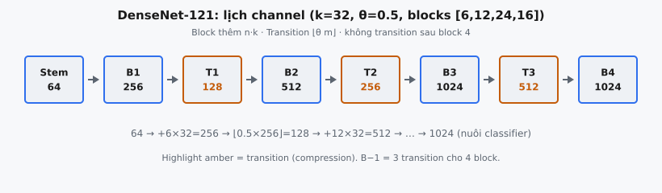

DenseNet (Huang et al., 2017) kết nối mọi lớp với mọi lớp khác theo kiểu feed-forward. Trong một dense block, mỗi lớp thêm một số cố định feature map gọi là **growth rate** $k$, nên số channel tăng tuyến tính theo độ sâu. Các **transition layer** đặt giữa các block dùng **compression factor** $\theta$ để thu hẹp lại số channel đó. Chương này theo dõi số channel xuyên suốt mạng chỉ bằng phép đếm số nguyên.

## Dense connectivity trong một ý

Trong mạng tích chập chuẩn, lớp $\ell$ chỉ nhận đầu ra của lớp $\ell-1$. DenseNet đổi điều này: lớp $\ell$ nhận concatenation của feature map của mọi lớp trước trong cùng block.

Nếu $x_0$ là đầu vào block và $H_\ell$ là biến đổi tại lớp $\ell$ (batch norm, ReLU, rồi convolution), đầu ra của lớp $\ell$ là:

$$
x_\ell = H_\ell([x_0, x_1, \ldots, x_{\ell-1}])
$$

Dấu ngoặc vuông ký hiệu **concatenation theo trục channel**, không phải phép cộng. Đây là khác biệt then chốt so với ResNet, nơi shortcut cộng tensor element-wise. Vì DenseNet concat, feature map từ lớp sớm vẫn sẵn có cho mọi lớp sau mà không bị ghi đè — các tác giả lập luận rằng điều này cải thiện dòng gradient và feature reuse.

Một block $n$ lớp do đó có $n(n+1)/2$ kết nối trực tiếp thay vì $n$ kết nối của chuỗi tuần tự. Bài báo nêu ba lợi ích từ wiring dày đặc này: mỗi lớp nhận gradient loss trực tiếp qua các đường ngắn, giảm vanishing gradient trong mạng sâu; đặc trưng được tái sử dụng thay vì tính lại, giảm dư thừa; và implicit deep supervision để đặc trưng nông ảnh hưởng dự đoán cuối. Tất cả đều xuất phát từ việc concatenation giữ nguyên feature map sớm — cũng chính là lý do số channel trong block chỉ tăng, không giảm.

## Growth rate $k$

Mỗi $H_\ell$ tạo đúng $k$ feature map mới, với $k$ là **growth rate**. Bài báo chọn $k$ nhỏ (ví dụ $k = 12$ hoặc $k = 32$). Sau $n$ lớp trong một dense block, số channel là:

$$
C_{\text{out}} = C_{\text{in}} + n \cdot k
$$

với $C_{\text{in}}$ là số channel vào block. Sự tăng là thuần cộng và tuyến tính theo số lớp.

**Vì sao $k$ nhỏ vẫn đủ.** Trong mạng thông thường mỗi lớp phải học lại hoặc mang theo đặc trưng hữu ích, nên buộc phải rộng. Trong DenseNet mọi lớp đọc trực tiếp “kiến thức tập thể” của block qua concatenation, nên mỗi lớp chỉ cần đóng góp một lát mỏng thông tin mới. Bài báo khung trạng thái mạng như một bộ nhớ toàn cục mà mỗi lớp thêm $k$ map. Growth rate nhỏ như 12 đã đủ để đạt độ chính xác cạnh tranh — đó là phần lớn lý do DenseNet hiệu quả tham số.

Growth rate là hyperparameter width quan trọng nhất trong DenseNet. Nó không đổi trên mọi lớp và mọi block của một model, nên phép đếm channel được xác định hoàn toàn bởi stem, $k$, số lớp mỗi block, và $\theta$. $k$ lớn hơn cho mỗi lớp thêm capacity nhưng làm phình trạng thái đã concat (chi phí tăng theo kiểu gần bậc hai trong block), nên bài báo cố ý giữ $k$ nhỏ và dựa vào độ sâu cùng dense connectivity thay vì width.

## Vấn đề channel nổ

Tăng tuyến tính nghe khiêm tốn, nhưng xếp nhiều block sẽ cộng dồn. Một block 24 lớp với $k = 32$ thêm $24 \times 32 = 768$ channel. Sau hai hoặc ba block như vậy, số channel — và do đó chi phí của các convolution $1 \times 1$ và $3 \times 3$ kế tiếp — trở nên lớn. Concatenation không bao giờ bỏ channel, nên số đếm đơn điệu không giảm trong một block.

Nếu không kiểm soát, chiều đặc trưng phình to và chiếm cả bộ nhớ lẫn compute. DenseNet kiểm soát bằng hai cơ chế: bottleneck trong mỗi block (chữ **B** trong DenseNet-BC), và compression tại transition (chữ **C**). Chương này tập trung vào cơ chế thứ hai.

Chi phí là cụ thể. Một convolution $3 \times 3$ ánh xạ $C_{\text{in}}$ channel sang $C_{\text{out}}$ channel tốn khoảng $C_{\text{in}} \cdot C_{\text{out}}$ nhân-cộng mỗi vị trí không gian, nên một block có đầu vào đã lên tới hàng nghìn channel làm mọi convolution trong block kế tiếp đắt. Compression tại transition reset width đầu vào trước khi block kế bắt đầu — đó là vì sao $\theta = 0.5$ giữ DenseNet sâu vẫn huấn luyện được. Theo dõi đúng số channel từng stage là bước đầu để lập ngân sách compute.

## Compression $\theta$ tại transition layer

Một **transition layer** nằm giữa hai dense block. Nó áp dụng batch norm, convolution $1 \times 1$, và average pooling $2 \times 2$. Compression xảy ra ở convolution $1 \times 1$: nếu block trước tạo $m$ feature map, transition xuất:

$$
m_{\text{out}} = \lfloor \theta \cdot m \rfloor
$$

với $\theta \in (0, 1]$ là **compression factor**. Bài báo gọi mạng có $\theta < 1$ là **DenseNet-C** và dùng $\theta = 0.5$ trong thí nghiệm, tức giảm một nửa channel mỗi transition. Khi $\theta = 1$ không có compression và transition chỉ đổi độ phân giải không gian, không đổi số channel.

Hàm floor quan trọng. Số channel là số nguyên, nên $\theta \cdot m$ phải làm tròn xuống. Với $\theta = 0.5$ và $m$ chẵn thì floor “vô hình”, nhưng với $\theta = 0.75$ hoặc $m$ lẻ thì nó đổi đáp án. Ví dụ $\lfloor 0.75 \cdot 66 \rfloor = \lfloor 49.5 \rfloor = 49$, không phải 50.

## Transition nằm ở đâu

Transition nằm **giữa** các dense block, không bao giờ sau block cuối. Đầu ra block cuối đi vào global average pool và classifier, nên không có gì để “transition” vào. Với mạng $B$ dense block có đúng $B - 1$ transition layer.

Đọc chuỗi channel theo thứ tự, các stage xen kẽ block, transition, block, transition, và kết thúc bằng block:

* **sau stem:** đầu ra convolution ban đầu — số channel khởi đầu
* **sau block 1:** stem cộng $n_1 \cdot k$
* **sau transition 1:** floor của $\theta$ nhân số channel sau block 1
* **sau block 2:** số sau transition 1 cộng $n_2 \cdot k$, và cứ thế
* **sau block cuối:** không có transition theo sau

Lỗi off-by-one ở đây (thêm transition sau block cuối, hoặc quên một transition giữa các block) là bug phổ biến nhất khi dựng lại lịch channel.

## Bottleneck và tên gọi BC

Compression là một trong hai thủ thuật kiểm soát width của DenseNet. Thủ thuật kia là **bottleneck**. Trong dense block mỗi $H_\ell$ có thể là một convolution $3 \times 3$ đơn, hoặc trước hết áp dụng convolution $1 \times 1$ giảm đầu vào đã concat xuống $4k$ channel rồi mới để $3 \times 3$ tạo đúng $k$ map. Bước $1 \times 1$ chính là bottleneck.

Bài báo đặt tên biến thể theo thủ thuật có mặt:

* **DenseNet:** thuần, không bottleneck, không compression ($\theta = 1$).
* **DenseNet-B:** có bottleneck trong block.
* **DenseNet-C:** có compression tại transition ($\theta < 1$).
* **DenseNet-BC:** cả hai — cấu hình dùng cho các model ImageNet như DenseNet-121, 169, 201, và 161.

Bottleneck ảnh hưởng width nội bộ của một lớp nhưng không đổi số channel đầu ra của block: block $n$ lớp vẫn thêm $n \cdot k$ channel dù mỗi lớp có dùng bottleneck hay không. Vì vậy khi theo dõi channel theo stage, chỉ $k$, số lớp mỗi block, và $\theta$ là quan trọng. Bottleneck là chi tiết nội bộ không cần mô hình hóa cho phép đếm stage.

## Hiệu quả tham số so với ResNet

Kết quả nổi bật của DenseNet là độ chính xác trên mỗi tham số. Bài báo báo cáo DenseNet-BC khoảng 0.8M tham số khớp ResNet 1.7M tham số trên CIFAR, và DenseNet-201 đạt độ chính xác ResNet-101 trên ImageNet với khoảng một nửa số tham số.

* **ResNet cộng, DenseNet concat.** Shortcut identity của ResNet $x_{\ell} = x_{\ell-1} + F(x_{\ell-1})$ giữ số channel cố định, nên lớp có thể rộng và nhiều. DenseNet giữ mỗi lớp mỏng (width $k$) nhưng tích lũy channel.
* **Feature reuse.** Vì mọi lớp thấy mọi feature map sớm hơn, mạng không cần học lại đặc trưng dư thừa — cơ chế các tác giả gán cho việc tiết kiệm tham số.
* **Compression giới hạn chi phí.** Giảm một nửa channel mỗi transition giữ trạng thái đã concat không nổ, nên lợi thế vẫn giữ được trên mạng sâu.

::: {#fig-densenet-channels fig-cap="Lịch channel DenseNet-121: stem 64 → blocks $[6,12,24,16]$ với $k=32$ → transition $\\theta=0.5$ → cuối 1024 (nuôi classifier)." fig-alt="Chuỗi khối Stem, B1, T1, B2, T2, B3, T3, B4 với số channel."}
{fig-align="center"}
:::

## Ví dụ số (DenseNet-121 stem và các stage đầu)

DenseNet-121 dùng stem 64 channel, growth rate $k = 32$, số lớp mỗi block $[6, 12, 24, 16]$, và compression $\theta = 0.5$. Truy vết số channel:

1. **Sau stem:** $64$.
2. **Sau block 1** ($n_1 = 6$): $64 + 6 \times 32 = 64 + 192 = 256$.
3. **Sau transition 1:** $\lfloor 0.5 \times 256 \rfloor = 128$.
4. **Sau block 2** ($n_2 = 12$): $128 + 12 \times 32 = 128 + 384 = 512$.
5. **Sau transition 2:** $\lfloor 0.5 \times 512 \rfloor = 256$.
6. **Sau block 3** ($n_3 = 24$): $256 + 24 \times 32 = 256 + 768 = 1024$.
7. **Sau transition 3:** $\lfloor 0.5 \times 1024 \rfloor = 512$.
8. **Sau block 4** ($n_4 = 16$): $512 + 16 \times 32 = 512 + 512 = 1024$. Không có transition sau block cuối.

Chuỗi đầy đủ là $[64, 256, 128, 512, 256, 1024, 512, 1024]$. Lưu ý 1024 channel cuối — đúng chiều đặc trưng nuôi classifier trong DenseNet-121. Đọc chuỗi cho thấy nhịp thiết kế: mỗi block gần như nhân đôi hoặc hơn width, mỗi transition giảm một nửa, nên width dao động đi lên trong một dải có kiểm soát thay vì chạy thoát.

## Floor trong thực tế ($\theta = 0.75$)

Lấy stem 33, $k = 11$, blocks $[3, 7]$, và $\theta = 0.75$. Sau block 1: $33 + 3 \times 11 = 66$. Transition duy nhất cho $\lfloor 0.75 \times 66 \rfloor = \lfloor 49.5 \rfloor = 49$. Sau block 2: $49 + 7 \times 11 = 126$. Chuỗi: $[33, 66, 49, 126]$. Implementation ngây thơ giữ $49.5$ dạng float, hoặc làm tròn thành 50, sẽ lệch từ đây và mọi stage sau.

## Cấu hình chuẩn và bối cảnh hiện đại

Các model DenseNet-BC trên ImageNet chia sẻ stem 64 channel (hoặc $2k$ với biến thể rộng hơn), $\theta = 0.5$, và chỉ khác số lớp mỗi block:

* **DenseNet-121:** $k = 32$, blocks $[6, 12, 24, 16]$.
* **DenseNet-169:** $k = 32$, blocks $[6, 12, 32, 32]$.
* **DenseNet-201:** $k = 32$, blocks $[6, 12, 48, 32]$.
* **DenseNet-161:** $k = 48$, blocks $[6, 12, 36, 24]$, stem rộng hơn 96 channel.

Số trong tên đếm các lớp tích chập trên đường chính: gần bằng tổng số lớp trong block nhân số lớp mỗi dense unit, cộng stem, transition, và classifier. Lịch channel tính ở đây cũng là phép kế toán mà các framework như torchvision dùng để định kích thước convolution $1 \times 1$ của mỗi transition.

Ý tưởng concatenation xuất hiện lại ở thiết kế sau. Feature pyramid networks và decoder kiểu U-Net concat skip connection, và connectivity kiểu dense ảnh hưởng các kiến trúc như DLA và CondenseNet. Mẫu tăng tuyến tính cộng compression định kỳ là cách sạch, xác định để lập luận width đặc trưng tiến hóa theo độ sâu.

## Các lỗi thường gặp

* **Bỏ qua floor.** Tính $\theta \cdot m$ mà không $\lfloor \cdot \rfloor$ để lại số channel không nguyên. Với $\theta = 0.5$ và số chẵn phép này tình cờ đúng, nên bug ẩn ở case dễ và chỉ lộ với $\theta = 0.75$ hoặc số lẻ. Luôn floor đầu ra transition.
* **Thêm transition sau block cuối.** Có $B - 1$ transition cho $B$ block. Phát thêm bước compression sau block cuối thêm một stage ma và tạo chuỗi dài hơn một phần tử. Bảo vệ transition bằng kiểm tra block hiện tại không phải block cuối.
* **Nhầm $n \cdot k$ với $n + k$.** Block thêm $n$ lớp mỗi lớp $k$ map, nên phần tăng là tích $n \cdot k$, không phải tổng. Dùng $n + k$ gần đúng với $n$ nhỏ và dễ bỏ sót.
* **Làm tròn thay vì floor.** `round` của Python dùng banker's rounding và làm tròn nửa về số chẵn gần nhất, lệch $\lfloor \cdot \rfloor$ mỗi khi phần thập phân $\geq 0.5$. Convolution $1 \times 1$ của bài báo tạo $\lfloor \theta m \rfloor$ channel đầu ra, nên floor là phép đúng.

## Code

```python
import math
import torch

def densenet_channel_counts(stem_channels: int, growth_rate: int, block_layers, compression: float) -> torch.Tensor:
    """
    Return a 1D int64 torch.Tensor of channel counts in order:
    [after stem, after block 1, after transition 1, after block 2, ..., after final block].
    """
    block_layers = list(block_layers)
    counts = [int(stem_channels)]
    c = int(stem_channels)
    for i, n in enumerate(block_layers):
        c = c + n * growth_rate            # dense block grows channels by n*k
        counts.append(c)
        if i < len(block_layers) - 1:      # transition after every block except the last
            c = int(math.floor(c * compression))
            counts.append(c)
    return torch.tensor(counts, dtype=torch.int64)
```
