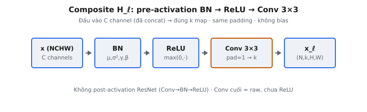

Composite layer là đơn vị tính toán sơ cấp bên trong DenseNet (Huang et al., 2017). Nó là hàm $H_\ell(\cdot)$ mà mọi lớp trong dense block áp dụng lên đầu vào: Batch Normalization, rồi phi tuyến ReLU, rồi convolution $3 \times 3$ tạo một số cố định nhỏ feature map mới gọi là **growth rate**.

## Nó là gì / Nó làm gì

Trong Densely Connected Convolutional Network, lớp $\ell$ nhận concatenation của feature map mọi lớp trước làm đầu vào. Nó rồi tính biến đổi phi tuyến $H_\ell$ và xuất $k$ feature map mới, với $k$ là growth rate. Bài báo định nghĩa $H_\ell$ là **hàm composite** của ba phép liên tiếp.

Cụ thể, $H_\ell$ là hợp thành có thứ tự:

* **Batch Normalization (BN):** chuẩn hóa mỗi channel bằng running statistics, rồi áp dụng scale và shift affine đã học.
* **ReLU:** áp dụng hàm kích hoạt rectified linear theo từng phần tử.
* **Convolution:** convolution $3 \times 3$ với same padding (padding $= 1$, stride $= 1$, không bias) ánh xạ channel đầu vào xuống đúng $k$ channel đầu ra.

Chương này triển khai composite layer cơ bản (không bottleneck) đúng như Section 3 của bài báo.

::: {#fig-densenet-composite fig-cap="Composite $H_\\ell$: pre-activation BN → ReLU → Conv $3\\times3$ (pad 1, không bias) xuất đúng $k$ channel, giữ $H\\times W$." fig-alt="Chuỗi khối x, BN, ReLU, Conv 3x3, x_ell."}
{fig-align="center"}
:::

## Các phương trình chính

Với tensor đầu vào $x \in \mathbb{R}^{N \times C \times H \times W}$, Batch Normalization ở chế độ evaluation chuẩn hóa mỗi channel $c$ bằng running mean $\mu_c$ và running variance $\sigma^2_c$ đã lưu, rồi scale lại bằng tham số học $\gamma_c$ và $\beta_c$:

$$
\hat{x}_{n,c,i,j} = \frac{x_{n,c,i,j} - \mu_c}{\sqrt{\sigma^2_c + \epsilon}}, \qquad y_{n,c,i,j} = \gamma_c \, \hat{x}_{n,c,i,j} + \beta_c
$$

với $\epsilon$ là hằng số nhỏ (mặc định $10^{-5}$) cộng trong căn để ổn định số. Activation rồi được rectify:

$$
z_{n,c,i,j} = \max(0, \, y_{n,c,i,j})
$$

Cuối cùng convolution $3 \times 3$ với trọng số $W \in \mathbb{R}^{k \times C \times 3 \times 3}$ và không bias tạo $k$ channel đầu ra, kích thước không gian được bảo toàn bởi padding $= 1$:

$$
H_\ell(x)_{n,o,i,j} = \sum_{c=1}^{C} \sum_{a=0}^{2} \sum_{b=0}^{2} W_{o,c,a,b} \; z_{n,c,\, i+a-1,\, j+b-1}
$$

Shape đầu ra là $(N, k, H, W)$. Số channel co từ $C$ về growth rate $k$, trong khi độ phân giải không gian $H \times W$ không đổi.

## Thứ tự pre-activation và vì sao quan trọng

Thứ tự BN $\to$ ReLU $\to$ Conv gọi là **pre-activation**, vì chuẩn hóa và kích hoạt đứng **trước** convolution thay vì sau. DenseNet lấy thứ tự này trực tiếp từ nghiên cứu pre-activation ResNet (He et al., 2016), cho thấy đặt BN và ReLU trước lớp trọng số cải thiện dòng gradient và cho đường identity sạch hơn trong mạng rất sâu.

Một số tính chất làm pre-activation khớp tự nhiên với DenseNet:

* **Concatenation sạch:** vì mỗi lớp xuất kết quả convolution thô (không post-activate), đầu vào đã concat cho lớp sau hành xử tốt, và mỗi consumer tự BN để chuẩn hóa lại đúng các channel nó đọc.
* **Chuẩn hóa theo nguồn:** một lớp sâu trong dense block thấy concatenation của feature map sinh ra ở độ sâu rất khác và scale rất khác. BN trước cho lớp đó chuẩn hóa lại mọi channel đến trước khi trộn — thiết yếu khi đầu vào đến từ nhiều nguồn.
* **Đường gradient ít cản:** với hàm kích hoạt đứng trước trọng số, các đường shortcut tạo bởi concatenation mang gradient ngược mà không bị bóp bởi ReLU đuôi.

ResNet gốc (post-activation) dùng Conv $\to$ BN $\to$ ReLU. Đổi sang BN $\to$ ReLU $\to$ Conv không chỉ thẩm mỹ: nó đổi tensor nào được chuẩn hóa và tensor nào là đầu ra lớp, và cho kết quả số khác. Sai thứ tự này là lỗi triển khai phổ biến nhất cho composite layer.

## Growth rate

Growth rate $k$ là số feature map mỗi composite layer đóng góp. Nó là số channel đầu ra của convolution $3 \times 3$. DenseNet dùng growth rate bất ngờ nhỏ (bài báo báo cáo kết quả ImageNet mạnh với $k = 32$, và thí nghiệm CIFAR với $k = 12$) — một lý do kiến trúc hiệu quả tham số.

Vì lớp $\ell$ nhận concatenation mọi đầu ra sớm hơn, số channel đầu vào của nó là $C_0 + (\ell - 1) k$, với $C_0$ là số channel vào block. Width đầu vào do đó tăng tuyến tính theo độ sâu, nhưng mỗi lớp chỉ thêm $k$ map mới. Đóng góp mỏng mỗi lớp chính là thứ giữ tổng model gọn dù connectivity dày đặc.

Trong chương này, số channel đầu vào $C$ là bất kỳ giá trị nào của đầu vào đã concat, và trọng số convolution có shape $(k, C, 3, 3)$, nên growth rate đọc trực tiếp từ chiều đầu của tensor trọng số.

## Same padding và convolution $3\times3$

Kernel $3 \times 3$ với stride $1$ và padding $1$ là convolution **same**: chiều không gian đầu ra bằng đầu vào. Công thức tổng quát một trục không gian:

$$
H_{\text{out}} = \left\lfloor \frac{H_{\text{in}} + 2p - k_{\text{size}}}{s} \right\rfloor + 1
$$

Với $k_{\text{size}} = 3$, $p = 1$, $s = 1$ ta được $H_{\text{out}} = H_{\text{in}} + 2 - 3 + 1 = H_{\text{in}}$. Bảo toàn kích thước không gian là bắt buộc trong dense block: đầu ra mọi lớp phải khớp chiều không gian với mọi lớp khác để **concat** theo trục channel. Nếu convolution bỏ padding, đầu ra co hai pixel mỗi chiều không gian và concatenation thất bại.

Convolution **không có bias** trong composite layer này. Affine shift $\beta$ từ BN đứng trước đã cung cấp bậc tự do cộng theo channel, nên bias convolution riêng sẽ dư. Thêm bias giả làm lệch đầu ra và là bug phổ biến.

## Batch Normalization ở chế độ evaluation

Trong huấn luyện, BN tính mean và variance từ mini-batch hiện tại và cập nhật ước lượng chạy. Khi inference lớp bị đóng băng: dùng running statistics đã lưu thay vì thống kê batch, nên biến đổi trở thành ánh xạ affine cố định, xác định theo từng channel. Chương này dùng hành vi **eval mode**, đó là vì sao running mean $\mu_c$ và running variance $\sigma^2_c$ được cung cấp như đầu vào thay vì tính từ $x$.

Eval mode là lựa chọn đúng cho kiểm tra composite layer từ đầu, vì loại bỏ phụ thuộc batch size và làm đầu ra tái lập được. Chuẩn hóa áp dụng **theo channel**: $\mu$, $\sigma^2$, $\gamma$, và $\beta$ đều là vectơ dài $C$, mỗi cái broadcast qua batch và chiều không gian.

Một kiểm tra hữu ích là **identity BN**: với $\gamma = 1$, $\beta = 0$, $\mu = 0$, $\sigma^2 = 1$, chuẩn hóa rút về $\hat{x} = x / \sqrt{1 + \epsilon}$, xấp xỉ $x$ khi $\epsilon$ nhỏ. Trong trường hợp này composite layer gần như ReLU rồi convolution.

## Bối cảnh bài báo và quyết định thiết kế

Bài báo thúc đẩy composite layer bằng một mục tiêu: tối đa dòng thông tin và gradient giữa các lớp. Nơi ResNet cộng đầu ra lớp qua summation, DenseNet **concat**. Summation có thể cản dòng thông tin vì identity và residual bị gộp vào một tensor, trong khi concatenation giữ mọi feature map riêng biệt và truy cập được. Hàm composite $H_\ell$ là toán tử biến trạng thái đã tích lũy, đã concat thành một tập đặc trưng mới.

Ba quyết định thiết kế tường minh ở Section 3 định hình lớp này:

* **Hàm composite pre-activation.** Các tác giả định nghĩa $H_\ell$ là hợp thành BN, ReLU, và convolution $3 \times 3$, trích dẫn pre-activation ResNet (He et al., 2016) làm nguồn thứ tự. Đây là chủ đích tách khỏi convolution block post-activation gốc.
* **Growth rate nhỏ.** Vì mọi lớp chỉ thêm $k$ feature map và tất cả chúng feed forward, $k$ nhỏ đã cung cấp đủ thông tin mới mỗi lớp. Bài báo lập luận mỗi lớp thêm tập feature map nhỏ của riêng mình vào kiến thức tập thể của mạng — các tác giả mô tả như trạng thái toàn cục mọi lớp có thể đọc.
* **Không dropout, BN như regularizer.** Bài báo báo cáo rằng với regularization ẩn mạnh từ dense connectivity và BN, dropout không cần thiết trên các dataset đã nghiên cứu. BN trong composite layer do đó làm hai việc: ổn định kích hoạt và cung cấp regularization.

Các lựa chọn này cùng giải thích vì sao composite layer trông như vậy: một bước chuẩn hóa chịu được đầu vào đã concat dị thể, một activation, và một same-padded convolution nhỏ phát đúng $k$ map mới.

## Pre-activation so với post-activation

Đáng đối chiếu trực tiếp hai thứ tự vì chúng dễ nhầm:

* **Post-activation (ResNet gốc, He et al. 2015):** Conv $\to$ BN $\to$ ReLU. Convolution chạy trước trên đầu vào thô, BN chuẩn hóa đầu ra convolution, và ReLU là phép cuối. Đầu ra block là tensor đã post-activate.
* **Pre-activation (DenseNet, He et al. 2016):** BN $\to$ ReLU $\to$ Conv. Chuẩn hóa và kích hoạt chạy trên đầu vào, convolution là phép cuối. Đầu ra block là kết quả convolution thô.

Khác biệt quan trọng nhất trong mạng sâu với nhiều shortcut. Ở dạng pre-activation, đường một feature map đi tới lớp downstream không bị gián đoạn bởi chuẩn hóa hay kích hoạt phụ thuộc phép cộng/concat, nên gradient lan truyền sạch hơn. Với DenseNet, nơi mỗi feature map có thể được nhiều lớp sau đọc, giữ đầu ra chưa activate cũng nghĩa là mỗi consumer có thể chuẩn hóa channel theo cách phù hợp tính toán của mình.

Hệ quả thực tiễn: ở dạng pre-activation, lớp đầu tiên của block chuẩn hóa đầu vào thô, và phép cuối mọi lớp là convolution tuyến tính. Nếu implementation tình cờ gắn ReLU đuôi sau convolution, đầu ra trở nên không âm và concatenation chỉ đẩy đặc trưng đã rectify — không đúng đặc tả bài báo.

## Vai trò trong dense block

Một dense block xếp chồng nhiều composite layer. Lớp $\ell$ lấy concatenation $[x_0, x_1, \ldots, x_{\ell-1}]$ của mọi feature map trước, áp dụng $H_\ell$, và tạo $x_\ell$ — tensor đúng $k$ channel. Đầu ra đó rồi được concat vào collection đang chạy để lớp kế tiêu thụ.

Dense connectivity này là ý tưởng định nghĩa của bài báo: mọi lớp truy cập trực tiếp feature map mọi lớp trước, và đầu ra của nó được truyền tới mọi lớp sau. Composite layer là phép tính từng bước làm điều đó khả thi. Nó phải tự chứa, chuẩn hóa đầu vào (có thể dị thể), và phát một tập đặc trưng mới nhỏ, căn chỉnh không gian.

Biến thể bottleneck sâu hơn (DenseNet-B) chèn convolution $1 \times 1$ trước convolution $3 \times 3$ để giảm channel đầu vào trước. Chương này triển khai composite layer cơ bản không bottleneck, khớp định nghĩa $H_\ell$ đơn giản nhất trong bài báo.

## Ví dụ số ($N=1$, $C=2$, $H=W=2$, $k=1$)

Lấy một cặp channel với

$$
x[0,0] = \begin{pmatrix} 1 & -1 \\ 0 & 2 \end{pmatrix}, \qquad
x[0,1] = \begin{pmatrix} 0 & 1 \\ -2 & 1 \end{pmatrix}.
$$

Cho $\gamma = [1, 1]$, $\beta = [0, 0]$, $\mu = [0, 0]$, $\sigma^2 = [1, 1]$, và $\epsilon = 0$.

1. **BN (identity ở đây):** với thống kê này $\hat{x} = x$ và $y = x$, nên tensor đi qua không đổi.
2. **ReLU:** kẹp âm về không. Channel 0 thành $\begin{pmatrix} 1 & 0 \\ 0 & 2 \end{pmatrix}$ và channel 1 thành $\begin{pmatrix} 0 & 1 \\ 0 & 1 \end{pmatrix}$.
3. **Convolution:** kernel $3 \times 3$ same-padded trượt trên activation đã zero-pad $2 \times 2$, cộng tích theo phần tử qua cả hai channel đầu vào tại mọi vị trí. Kết quả là một map đầu ra $2 \times 2$ (vì $k = 1$), kích thước không gian được bảo toàn bởi padding.

Quan sát then chốt: giá trị âm bị loại trước khi convolution thấy chúng, và hai channel đầu vào được hợp thành một channel đầu ra bằng cách cộng theo chiều channel trong convolution.

## Các lỗi thường gặp

* **Sai thứ tự phép toán.** Áp dụng Conv $\to$ ReLU $\to$ BN, hoặc Conv $\to$ BN $\to$ ReLU (thứ tự post-activation ResNet), cho kết quả khác. DenseNet dùng pre-activation BN $\to$ ReLU $\to$ Conv. Convolution phải là bước cuối và phải tiêu thụ tensor đã chuẩn hóa, đã rectify.
* **Bỏ padding.** Convolution $3 \times 3$ với padding $= 0$ co kích thước không gian từ $H \times W$ xuống $(H-2) \times (W-2)$. Trong dense block điều này phá concatenation vì đầu ra các lớp khác nhau không còn chung chiều không gian. Luôn dùng padding $= 1$ cho kernel $3 \times 3$.
* **Quên epsilon.** Bỏ $\epsilon$ trong $\sqrt{\sigma^2 + \epsilon}$ đổi chuẩn hóa và rủi ro chia cho không hoặc bất ổn khi variance channel rất nhỏ. Mặc định $\epsilon = 10^{-5}$ phải cộng trước căn, không sau.
* **Thêm bias convolution.** Convolution của composite layer không có bias; affine shift $\beta$ của BN đã cung cấp hạng tử cộng. Đưa vectơ bias dịch mọi channel đầu ra và lặng lẽ tạo giá trị sai dù shape vẫn đúng.

## Code

```python
import torch
import torch.nn.functional as F

def composite_layer(x, bn_gamma, bn_beta, bn_mean, bn_var, conv_weight, eps=1e-5):
    """
    Return torch.Tensor of shape (N, growth_rate, H, W): BN, ReLU, then a 3x3 same-padding convolution.
    """
    x = torch.as_tensor(x, dtype=torch.float64)
    g = torch.as_tensor(bn_gamma, dtype=torch.float64)
    b = torch.as_tensor(bn_beta, dtype=torch.float64)
    m = torch.as_tensor(bn_mean, dtype=torch.float64)
    v = torch.as_tensor(bn_var, dtype=torch.float64)
    w = torch.as_tensor(conv_weight, dtype=torch.float64)
    xh = (x - m[None, :, None, None]) / torch.sqrt(v[None, :, None, None] + eps)
    y = g[None, :, None, None] * xh + b[None, :, None, None]
    y = F.relu(y)
    return F.conv2d(y, w, bias=None, stride=1, padding=1)
```
