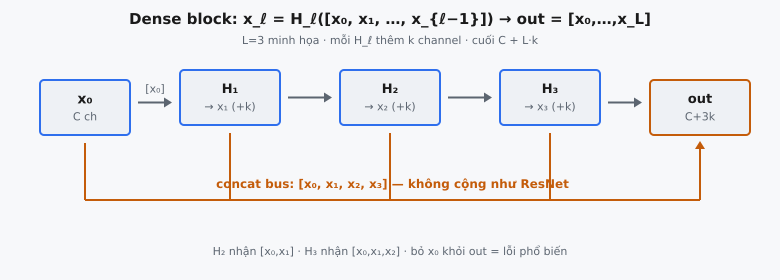
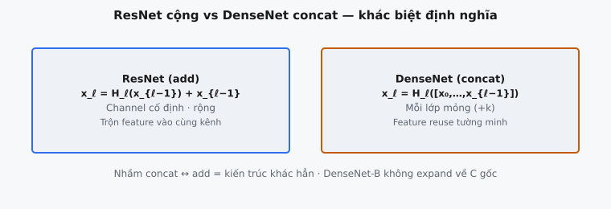

Một **dense block** là khối xây dựng cốt lõi của DenseNet (Huang et al., 2017). Trong block, mọi lớp nhận feature map của **mọi** lớp trước làm đầu vào, và truyền feature map của chính nó tới **mọi** lớp sau. Connectivity được biểu diễn bằng **concatenation theo channel**, không phải phép cộng. Một lựa chọn thiết kế này mang lại cho DenseNet feature reuse mạnh, lớp rất mỏng, dùng tham số hiệu quả, và dòng gradient tốt.

## Dense block tính gì

Một dense block chứa $L$ composite layer. Gọi $x_0$ là đầu vào block (tensor $C$ channel). Mỗi composite layer $H_\ell$ là hàm nhỏ (ở đây **BN-ReLU-Conv3x3**) tạo số cố định feature map mới gọi là **growth rate** $k$.

Hệ thức định nghĩa là lớp $\ell$ không chỉ nhìn đầu ra của lớp $\ell-1$. Nó nhìn concatenation của đầu vào block và mọi đầu ra lớp sớm hơn:

$$
x_\ell = H_\ell\big([\,x_0, x_1, x_2, \ldots, x_{\ell-1}\,]\big)
$$

Ở đây $[\cdot]$ ký hiệu concatenation theo chiều channel. Đây là **Equation 2** của bài báo DenseNet. Đầu ra cuối của block là concatenation của đầu vào và **mọi** $L$ đầu ra lớp:

$$
\text{out} = [\,x_0, x_1, \ldots, x_L\,] \in \mathbb{R}^{N \times (C + L \cdot k) \times H \times W}
$$

Kích thước không gian $H \times W$ được bảo toàn vì mỗi convolution $3 \times 3$ dùng padding 1 và stride 1. Chỉ số channel tăng.

Động lực, nêu trong abstract bài báo, trực tiếp: “to ensure maximum information flow between layers in the network, we connect all layers (with matching feature-map sizes) directly with each other.” Trong khi mạng $L$ lớp truyền thống có $L$ kết nối (một giữa mỗi lớp và lớp kế), dense block có $\frac{L(L+1)}{2}$ kết nối trực tiếp. Mọi lớp kết nối với mọi lớp đứng sau nó trong block.

::: {#fig-densenet-block fig-cap="Dense block: mỗi $H_\\ell$ nhận concatenation mọi map trước; đầu ra cuối $[x_0,\\ldots,x_L]$ có $C+L\\cdot k$ channel." fig-alt="Các lớp H1-H3 nối concat bus tới out."}
{fig-align="center"}
:::

## Bài báo nói gì

DenseNet được giới thiệu để xử lý quan sát lặp lại về mạng rất sâu: “as information about the input or gradient passes through many layers, it can vanish and wash out by the time it reaches the end (or beginning) of the network.” ResNet, Highway Networks, và stochastic depth đều tấn công điều này bằng cách tạo đường ngắn từ lớp sớm tới lớp muộn. DenseNet chưng cất chủ đề chung đó thành một mẫu connectivity đơn giản.

Bài báo liệt kê vài lợi thế cụ thể theo sau dense connectivity: giảm vanishing-gradient, tăng cường lan truyền đặc trưng, khuyến khích feature reuse, và giảm đáng kể số tham số. Quan trọng, các tác giả lưu ý DenseNet cần ít tham số hơn mạng tích chập truyền thống vì “there is no need to relearn redundant feature maps.” Kiến trúc truyền thống phải mang thông tin về phía trước bằng cách sao chép qua trọng số mỗi lớp; lớp DenseNet có thể thêm vài feature map trong khi vẫn giữ truy cập mọi đặc trưng đã tính trước.

## Composite layer $H_\ell$

Trong bài báo, $H_\ell$ là hàm composite **BN rồi ReLU rồi convolution $3 \times 3$**. Với đầu vào $u$ có $c_\ell$ channel (với $c_\ell = C + (\ell-1)k$), composite layer tính:

$$
\hat{u} = \frac{u - \mu}{\sqrt{\sigma^2 + \epsilon}}, \quad
z = \text{ReLU}\big(\gamma \odot \hat{u} + \beta\big), \quad
x_\ell = \text{Conv}_{3\times 3}(z)
$$

trong đó:

* $\mu, \sigma^2 \in \mathbb{R}^{c_\ell}$ là running mean và variance theo channel của batch-norm (ở đây cung cấp như đầu vào cố định cho inference)
* $\gamma, \beta \in \mathbb{R}^{c_\ell}$ là scale và shift batch-norm đã học
* $\epsilon$ là hằng số nhỏ cho ổn định số (mặc định $10^{-5}$)
* kernel convolution có shape $(k, c_\ell, 3, 3)$: ánh xạ $c_\ell$ channel đầu vào sang đúng $k$ channel đầu ra

Sự kiện cấu trúc then chốt: vì số channel đầu vào $c_\ell$ **tăng** thêm $k$ mỗi lớp, kernel convolution mỗi lớp rộng hơn trên trục đầu vào so với lớp trước. Đầu ra luôn $k$ channel bất kể $\ell$.

Thứ tự BN-ReLU-Conv là chủ đích. Bài báo đặt batch normalization trước để chuẩn hóa thích ứng với thống kê của toàn bộ đầu vào đã concat, vốn trộn feature map từ nhiều lớp ở scale rất khác. Áp dụng BN trước convolution scale lại mỗi channel đến về khoảng tương đương, nên convolution thấy đầu vào điều kiện tốt. Thứ tự “pre-activation” này theo residual unit cải tiến của He et al. (2016) và là một lý do DenseNet huấn luyện ổn định dù đầu vào đã concat dị thể.

Khi inference, thống kê batch-norm cố định. Thay vì tính lại mean và variance theo batch, lớp dùng ước lượng chạy $\mu$ và $\sigma^2$ tích lũy khi huấn luyện. Đó là vì sao implementation cung cấp $\mu$ và $\sigma^2$ như đầu vào tường minh theo channel thay vì tính từ batch: forward pass xác định và độc lập với batch size.

## Vì sao concatenation, không summation

ResNet (He et al., 2016) kết nối lớp bằng shortcut identity **cộng**: $x_\ell = H_\ell(x_{\ell-1}) + x_{\ell-1}$. DenseNet thay tổng bằng **concatenation**. Bài báo lập luận khác biệt này là cơ bản:

* **Summation có thể cản dòng thông tin.** Cộng tensor hợp đặc trưng cũ và mới vào cùng channel. Nếu identity và residual mang tín hiệu xung đột, chúng hủy một phần. Concatenation giữ mọi feature map nguyên vẹn và từng cái địa chỉ được bởi lớp sau.
* **Concatenation làm feature reuse tường minh.** Mỗi lớp sau truy cập trực tiếp đầu ra thô, chưa sửa của bất kỳ lớp sớm hơn nào, kể cả đầu vào block. Mạng không bao giờ phải học lại đặc trưng mà lớp sớm đã tạo.
* **Kiến thức tập thể.** Bài báo khung stack đã concat như “collective knowledge” của block: các lớp thêm số nhỏ feature map vào trạng thái dùng chung đang tăng, thay vì biến đổi tại chỗ một hidden state width cố định.

Giá của concatenation là width đầu vào tăng tuyến tính theo độ sâu trong block, nên convolution mỗi lớp rộng hơn trên trục đầu vào. DenseNet giữ điều này khả thi bằng cách làm $k$ nhỏ (thường $k = 12$ hoặc $k = 32$).

::: {#fig-densenet-concat-vs-add fig-cap="ResNet cộng $x_\\ell = H_\\ell(x_{\\ell-1}) + x_{\\ell-1}$ giữ channel cố định; DenseNet concat $x_\\ell = H_\\ell([x_0,\\ldots])$ với lớp mỏng $+k$." fig-alt="Hai thẻ so sánh ResNet add và DenseNet concat."}
{fig-align="center"}
:::

## Growth rate và sổ sách channel

Growth rate $k$ là số feature map mỗi composite layer đóng góp. Sau $\ell$ lớp, số channel đang chạy là:

$$
c_\ell = C + \ell \cdot k
$$

Vậy đầu vào lớp $\ell$ (đánh số từ 1) có $C + (\ell - 1)k$ channel, và đầu ra cuối block có $C + L \cdot k$ channel. $k$ nhỏ giữ mỗi lớp hẹp: bài báo lưu ý growth rate tương đối nhỏ là đủ vì mọi lớp truy cập trực tiếp kiến thức tập thể của block, nên chỉ cần thêm ít thông tin mới.

**Hiệu quả tham số.** Vì lớp mỏng và tái sử dụng đặc trưng sớm hơn, DenseNet đạt độ chính xác của ResNet rộng hoặc sâu hơn nhiều với ít tham số hơn. Bài báo báo cáo DenseNet khớp độ chính xác ResNet trên ImageNet với khoảng một nửa tham số và ít FLOPs hơn.

Một cách hữu ích để thấy hiệu quả: một composite layer với growth rate $k$ và width đầu vào $c_\ell$ có khoảng $9 \cdot c_\ell \cdot k$ tham số convolution (số $9$ đến từ kernel $3 \times 3$). Dù $c_\ell$ tăng theo độ sâu, $k$ giữ nhỏ, nên mỗi lớp vẫn rẻ. Đối chiếu mạng thuần rộng nơi mọi lớp có thể ánh xạ hàng trăm channel sang hàng trăm channel. DenseNet chi ngân sách tham số cho nhiều lớp hẹp, kết nối dày thay vì ít lớp rất rộng.

Bài báo cũng báo cáo feature map trung gian của DenseNet có xu hướng được nhiều lớp downstream dùng, xác nhận bằng cách kiểm tra trọng số tuyệt đối trung bình mỗi lớp gán cho mỗi lớp nguồn. Trọng số trải trên nhiều lớp nguồn thay vì tập trung vào lớp ngay trước — bằng chứng thực nghiệm rằng concatenation thực sự được khai thác cho feature reuse.

## Dòng gradient

Dense connectivity cũng cải thiện huấn luyện. Vì đầu ra block concat mọi đầu ra lớp, mỗi lớp có kết nối **trực tiếp** tới đầu ra block và, qua loss, tới tín hiệu gradient. Có đường ngắn từ loss về mọi lớp, không chỉ chuỗi dài qua mọi lớp trung gian. Bài báo gọi đây là **implicit deep supervision**: mỗi lớp nhận thông tin gradient gần như được giám sát trực tiếp, giảm vanishing gradient và ổn định huấn luyện mạng rất sâu.

## Ví dụ số (truy vết channel)

Lấy $C = 2$, growth rate $k = 2$, và $L = 2$ composite layer, với một mẫu kích thước không gian $4 \times 4$. Bắt đầu với đầu vào $x_0$ (2 channel).

1. **Lớp 1.** Đầu vào là $[x_0]$ với $2$ channel. BN-ReLU-Conv dùng kernel shape $(2, 2, 3, 3)$ và tạo $x_1$ với $2$ channel. Stack đang chạy giờ là $[x_0, x_1]$ với $4$ channel.
2. **Lớp 2.** Đầu vào là concatenation $[x_0, x_1]$ với $4$ channel. BN-ReLU-Conv dùng kernel shape $(2, 4, 3, 3)$ và tạo $x_2$ với $2$ channel. Stack đang chạy giờ là $[x_0, x_1, x_2]$.
3. **Đầu ra block.** Concat mọi thứ: $[x_0, x_1, x_2]$ có $2 + 2 + 2 = 6$ channel, shape $(1, 6, 4, 4)$. Khớp $C + L \cdot k = 2 + 2 \cdot 2 = 6$.

Lưu ý trục đầu vào kernel lớp 2 ($4$) bằng số channel của concatenation nó tiêu thụ, trong khi trục đầu vào kernel lớp 1 ($2$) chỉ bằng $C$. Lấy đúng các width này là trái tim của implementation.

Một case đặc biệt sạch giúp kiểm chứng implementation. Nếu tham số batch-norm của một lớp là identity ($\gamma = 1$, $\beta = 0$, $\mu = 0$, $\sigma^2 = 1$), thì khi $\epsilon \to 0$ bước chuẩn hóa là no-op và composite layer rút về $\text{ReLU}$ rồi convolution. Điều này giúp kiểm tay rằng bước BN được nối đúng: biến đổi còn lại chỉ là rectified linear unit và convolution $3 \times 3$ chuẩn. Nếu đầu ra lớp identity-BN lệch plain ReLU-then-conv, công thức batch-norm đang bị áp sai (ví dụ chuẩn hóa sai trục hoặc quên $\epsilon$).

## Chi tiết số

Hai điểm số quan trọng khi triển khai composite layer. Thứ nhất, $\epsilon$ trong căn ngăn chia cho không khi một channel có variance gần không; nó nằm **trong** căn, $\sqrt{\sigma^2 + \epsilon}$, không cộng vào kết quả. Đặt ngoài đổi giá trị tinh tế và fail kiểm tra dung sai chặt. Thứ hai, convolution phải dùng **stride 1 và padding 1** cho kernel $3 \times 3$ để bảo toàn chiều không gian; mọi padding khác co $H$ và $W$ và làm concatenation theo lớp không thể vì kích thước không gian không còn khớp.

Concatenation đòi hỏi mọi tensor khớp mọi chiều trừ chiều đang nối. Trong dense block, điều đó nghĩa là mọi đầu ra lớp phải cùng $N$, $H$, và $W$ với đầu vào block. Convolution padding-1, stride-1 đảm bảo điều này — đúng vì sao DenseNet hạn chế dense connectivity ở các lớp “with matching feature-map sizes” và đẩy mọi downsampling vào transition layer giữa các block.

## Transition layer và bức tranh lớn hơn

Một DenseNet đầy đủ xen kẽ dense block với **transition layer** (BN, convolution $1 \times 1$, và average pooling $2 \times 2$) giảm cả kích thước không gian lẫn số channel giữa các block. Không có transition, số channel sẽ tăng không bị chặn trên toàn mạng. Bản thân dense block, tuy nhiên, chỉ concat và không bao giờ downsample — đó là vì chiều không gian không đổi trong block.

**DenseNet-B** thêm convolution bottleneck $1 \times 1$ trước mỗi $3 \times 3$ để chặn chi phí khi $c_\ell$ lớn. **DenseNet-C** nén thêm channel tại transition. Dense block thuần ở đây tương ứng composite layer DenseNet cơ sở ($H_\ell$ = BN-ReLU-Conv$3\times 3$) mô tả trong bài báo trước các tinh chỉnh đó.

## Các lỗi thường gặp

* **Chỉ đưa đầu ra lớp trước thay vì full concatenation.** Coi block như CNN thuần (đầu vào lớp $\ell$ chỉ là $x_{\ell-1}$) phá thuộc tính định nghĩa của DenseNet. Vì mỗi kernel kỳ vọng số channel **đang tăng** $C + (\ell-1)k$, điều này thường crash với lỗi lệch channel ở lớp 2, hoặc lặng lẽ tạo block sai khi $L = 1$.
* **Concat sai trục.** Feature map phải nối theo chiều **channel** (dim 1 cho tensor $(N, C, H, W)$). Concat theo chiều batch (dim 0) xếp mẫu thay vì đặc trưng và cho tensor shape $(N \cdot (L+1), C, H, W)$ hoàn toàn sai.
* **Bỏ đầu vào $x_0$ khỏi đầu ra cuối.** Đầu ra block là $[x_0, x_1, \ldots, x_L]$ với $C + L \cdot k$ channel, không chỉ $L$ đầu ra lớp ($L \cdot k$ channel). Bỏ đầu vào gốc vừa co số channel vừa vứt đặc trưng rẻ nhất, dễ tái sử dụng nhất.
* **Chỉ trả đầu ra lớp cuối.** Sai phổ biến là tính đúng dense input nhưng trả $x_L$ một mình. Block phải trả full concatenation; toàn bộ điểm là lớp downstream thấy mọi feature map trung gian, không chỉ cái gần nhất.

## Code

```python
import torch
import torch.nn.functional as F

def dense_block(x, layers, growth_rate, eps=1e-5):
    x = torch.as_tensor(x, dtype=torch.float64)
    feats = [x]
    for p in layers:
        # input to this layer is the channel-wise concat of x and all previous outputs
        inp = torch.cat(feats, dim=1)
        gamma = torch.as_tensor(p['bn_gamma'], dtype=torch.float64)
        beta = torch.as_tensor(p['bn_beta'], dtype=torch.float64)
        mean = torch.as_tensor(p['bn_mean'], dtype=torch.float64)
        var = torch.as_tensor(p['bn_var'], dtype=torch.float64)
        weight = torch.as_tensor(p['conv_weight'], dtype=torch.float64)
        # BN (inference) -> ReLU -> 3x3 Conv (stride 1, padding 1) producing growth_rate channels
        xhat = (inp - mean[None, :, None, None]) / torch.sqrt(var[None, :, None, None] + eps)
        z = F.relu(gamma[None, :, None, None] * xhat + beta[None, :, None, None])
        out = F.conv2d(z, weight, bias=None, stride=1, padding=1)
        feats.append(out)
    # block output: concat of input and ALL L layer outputs
    return torch.cat(feats, dim=1)
```
