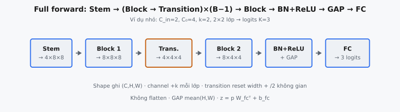

DenseNet (Huang et al., 2017) là kiến trúc tích chập trong đó mọi lớp nhận feature map của mọi lớp trước trong block làm đầu vào. Forward pass đầy đủ lắp stem convolution, vài dense block ngăn cách bởi transition layer, chuẩn hóa cuối, global average pooling, và linear classifier thành một hàm end-to-end từ ảnh tới class logits.

## Mạng đầy đủ tính gì

Một DenseNet ánh xạ ảnh đầu vào $x \in \mathbb{R}^{N \times C_{in} \times H \times W}$ thành logits $z \in \mathbb{R}^{N \times K}$ trên $K$ lớp. Bài báo tổ chức mạng thành số nhỏ dense block (thường 3 hoặc 4) nối bởi transition layer downsample. Motif lặp lại là dense block: chồng composite layer nơi lớp $\ell$ thấy concatenation mọi feature map sớm hơn.

Pipeline end-to-end:

* **Stem:** một convolution $3 \times 3$ nâng channel thô lên width đặc trưng ban đầu $C_0$ (bài báo dùng $2k$ cho growth rate $k$ trên ImageNet, với stem stride và pooling ở đó; chương này dùng stem CIFAR đơn giản hơn $3 \times 3$ với padding 1).
* **Dense block:** mỗi block tăng số channel thêm $k$ mỗi composite layer qua concatenation.
* **Transition:** giữa các block liền kề, batch norm, ReLU, convolution $1 \times 1$, và average pool $2 \times 2$ giảm cả channel lẫn độ phân giải không gian.
* **Head:** batch norm và ReLU cuối, global average pooling trên chiều không gian, và lớp tuyến tính tới class logits.

::: {#fig-densenet-full fig-cap="Full forward (ví dụ nhỏ): Stem → Block1 → Transition → Block2 → BN+ReLU+GAP → FC logits; channel $+k$ mỗi lớp, transition reset width." fig-alt="Chuỗi Stem, Block1, Transition, Block2, BN+ReLU+GAP, FC."}
{fig-align="center"}
:::

## Composite layer

Mỗi lớp trong block là **hàm composite** $H_\ell$. Ở dạng thuần (không bottleneck) dùng ở đây, $H_\ell$ là batch normalization, rồi ReLU, rồi convolution $3 \times 3$ với padding 1 xuất đúng $k$ feature map, với $k$ là **growth rate**:

$$
H_\ell(x) = \text{Conv}_{3\times3}\big(\text{ReLU}(\text{BN}(x))\big)
$$

Thứ tự pre-activation (BN rồi ReLU rồi convolution) theo công trình identity mappings của He et al. (2016). Nó quan trọng: đặt chuẩn hóa trước convolution giữ các đầu vào đã concat trên scale tương đương dù chúng đến từ lớp ở độ sâu rất khác.

Batch normalization khi inference dùng running statistics đã lưu, nên với channel $c$ kích hoạt đã chuẩn hóa là:

$$
\hat{x}_c = \frac{x_c - \mu_c}{\sqrt{\sigma_c^2 + \epsilon}}, \qquad y_c = \gamma_c \hat{x}_c + \beta_c
$$

với $\mu_c, \sigma_c^2$ là running mean và variance, và $\gamma_c, \beta_c$ là scale và shift đã học. Padding 1 trên convolution $3 \times 3$ giữ kích thước không gian không đổi để mọi feature map trong block vẫn concat được.

## Dense connectivity trong block

Ý tưởng định nghĩa của DenseNet là **dense connectivity**. Lớp $\ell$ nhận feature map mọi lớp trước làm đầu vào, tạo bằng concatenation theo trục channel:

$$
x_\ell = H_\ell\big([x_0, x_1, \ldots, x_{\ell-1}]\big)
$$

Ở đây $x_0$ là đầu vào block và $[\cdot]$ là channel concatenation. Block với $L$ composite layer và growth rate $k$ bắt đầu với $C_0$ channel kết thúc với $C_0 + L \cdot k$ channel. Vì mỗi lớp chỉ thêm $k$ map, mạng giữ hẹp dù connectivity dày đặc.

Implementation duy trì danh sách feature map đang chạy, append mỗi $k$ map mới của lớp, và concat danh sách đã tích lũy để nuôi lớp kế:

* Bắt đầu với đầu vào block là phần tử đầu của danh sách feature.
* Với mỗi composite layer, tính $k$ map mới từ concatenation mọi thứ đã thấy đến nay.
* Append map mới và concat lại cho lớp kế.
* Đầu ra block là concatenation của đầu vào cộng mọi đầu ra lớp.

Đây là đối lập với ResNet, nơi shortcut là cộng: $x_\ell = H_\ell(x_{\ell-1}) + x_{\ell-1}$. Phép cộng kết hợp đặc trưng bằng summation, có thể cản dòng thông tin; concatenation bảo toàn mọi feature map nguyên vẹn và cho lớp sau tái sử dụng chọn lọc.

## Transition layer

Dense block giữ độ phân giải không gian cố định, nên mạng cần downsampling tường minh giữa các block. Một **transition layer** làm việc này và cũng nén số channel:

$$
\text{Transition}(x) = \text{AvgPool}_{2\times2}\Big(\text{Conv}_{1\times1}\big(\text{ReLU}(\text{BN}(x))\big)\Big)
$$

Convolution $1 \times 1$ không có bias và xuất số channel đã giảm. Bài báo giới thiệu **compression factor** $\theta \in (0, 1]$: transition theo sau block có $m$ channel tạo $\lfloor \theta m \rfloor$ channel đầu ra. DenseNet-BC dùng $\theta = 0.5$. Average pool $2 \times 2$ stride 2 rồi giảm một nửa cả chiều cao lẫn chiều rộng. Transition chỉ xuất hiện giữa các block, không bao giờ sau block cuối, nên mạng $B$ block có đúng $B - 1$ transition.

## Global Average Pooling và classifier

Sau dense block cuối, mạng áp dụng thêm một batch norm và ReLU, rồi gộp chiều không gian bằng **global average pooling**. Với feature tensor shape $(N, C, H, W)$ vectơ đã pool là:

$$
p_{n,c} = \frac{1}{H W} \sum_{i=1}^{H} \sum_{j=1}^{W} x_{n,c,i,j}
$$

tạo $(N, C)$. Global average pooling, phổ biến hóa bởi Network in Network (Lin et al., 2014), thay các lớp fully connected lớn bằng một trung bình không gian mỗi channel. Nó loại bỏ số lớn tham số và đặt prior cấu trúc hữu ích: mỗi channel của feature map cuối hoạt động như confidence map cho một khái niệm, và trung bình không gian của nó là bằng chứng cho khái niệm đó.

Classifier là một lớp tuyến tính áp dụng lên vectơ đã pool:

$$
z = p\, W_{fc}^\top + b_{fc}
$$

với $W_{fc} \in \mathbb{R}^{K \times C}$ và $b_{fc} \in \mathbb{R}^{K}$, cho logits shape $(N, K)$.

## Cấu hình DenseNet chuẩn

Bài báo định nghĩa một họ mạng (Table 1) đều chia sẻ bốn dense block với growth rate $k = 32$ và biến thể BC (bottleneck $1 \times 1$ cộng compression $\theta = 0.5$). Chúng chỉ khác số composite layer mỗi block:

* **DenseNet-121:** block 6, 12, 24, 16 lớp.
* **DenseNet-169:** block 6, 12, 32, 32 lớp.
* **DenseNet-201:** block 6, 12, 48, 32 lớp.
* **DenseNet-161:** biến thể rộng hơn với $k = 48$ và block 6, 12, 36, 24 lớp.

Số trong tên đếm các lớp có trọng số học được: convolution trong composite layer và transition, cộng stem và classifier. Độ sâu tăng nhưng số tham số giữ khiêm tốn vì growth $k$ mỗi lớp nhỏ và transition lặp lại nén width.

## Bottleneck và compression trong model đầy đủ

Trong DenseNet-BC đầy đủ, composite layer được tăng cường bằng bottleneck: convolution $1 \times 1$ tạo $4k$ feature map trước convolution $3 \times 3$. Bottleneck chặn chi phí convolution $3 \times 3$, mà width đầu vào của nó tăng mỗi lớp. Kết hợp compression transition $\theta = 0.5$, model BC đạt độ chính xác trên mỗi tham số tốt nhất. Chương này cố ý dùng composite layer **thuần** (chỉ BN-ReLU-$3 \times 3$Conv) để logic forward dễ theo dõi; dense connectivity, transition, pooling, và classifier giống model đầy đủ.

## Vì sao dense connectivity giúp ở quy mô mạng

Lợi ích của concatenative connectivity rõ nhất khi lập luận về toàn mạng thay vì một block đơn.

* **Implicit deep supervision.** Vì classifier thấy feature map từ nhiều độ sâu qua concatenation và đường transition ngắn, gradient tới lớp sớm qua đường ngắn. Bài báo lưu ý điều này hoạt động như deep supervision của DSN (Lee et al., 2015) mà không cần classifier phụ, làm dễ huấn luyện model rất sâu.
* **Feature reuse.** Một lớp có thể chỉ tạo $k$ map mới mà vẫn dựa trên toàn bộ bộ sưu tập đặc trưng sớm hơn. Mạng không cần học lại biểu diễn dư thừa ở mỗi độ sâu — đó là vì sao growth rate 32 channel đủ cho độ chính xác cạnh tranh.
* **Dòng gradient đa dạng.** Mỗi lớp nhận gradient từ loss qua mọi lớp sau mà nó nuôi. Connectivity many-to-many này giảm khả năng một đường xấu đơn lẻ dừng học — lợi thế cấu trúc cộng dồn khi mạng sâu hơn.
* **Regularization trên dữ liệu nhỏ.** Bài báo báo cáo dense connectivity giảm overfitting trên dataset như CIFAR mà không cần tăng cường dữ liệu nặng, gán cho biểu diễn đặc trưng gọn, được tái sử dụng.

Một chi phí tinh tế là bộ nhớ. Concatenation ngây thơ lưu mọi feature map trung gian cho backward pass, nên bộ nhớ tăng bậc hai theo độ sâu block. Bài báo và công trình theo sau xử lý bằng shared memory allocation và recomputation, nhưng bản thân phép tính forward đúng là concatenation mô tả ở đây.

## Thứ tự triển khai và ghi chú số

Forward pass nhạy với thứ tự phép toán, và vài quy ước phải khớp đúng để tái tạo logits tham chiếu:

* **Pre-activation trong mọi đơn vị BN-ReLU-Conv.** Cả composite layer lẫn transition chuẩn hóa trước, activate, rồi convolve. Head cuối cũng áp dụng BN rồi ReLU trước pooling. Đổi thứ tự (ví dụ convolve trước chuẩn hóa) đổi đầu ra.
* **Padding giữ block concat được.** Convolution $3 \times 3$ dùng padding 1 để chiều cao và chiều rộng được bảo toàn trong block. Không có nó, mỗi lớp sẽ co kích thước không gian và concatenation thất bại.
* **Convolution trong thân mạng không có bias.** Convolution $1 \times 1$ của transition và convolution $3 \times 3$ của composite không mang hạng tử bias; bias duy nhất trong mạng nằm ở linear classifier cuối.
* **Batch norm khi inference dùng running statistics.** Khi forward, chuẩn hóa chia cho $\sqrt{\sigma_c^2 + \epsilon}$ dùng variance đã lưu, không phải thống kê batch. $\epsilon$ nhỏ (thường $10^{-5}$) bảo vệ khỏi chia cho variance gần không.
* **Kích thước không gian chẵn trước pooling.** Mỗi average pool $2 \times 2$ stride 2 đòi hỏi kích thước đầu vào chẵn để giảm một nửa sạch. Kiến trúc chọn độ phân giải đầu vào sao cho mọi feature map trước transition có chiều cao và chiều rộng chẵn.

## So sánh với forward ResNet

Cả DenseNet và ResNet xây mạng rất sâu bằng cách cho gradient đường ngắn về lớp sớm, nhưng cơ chế khác:

* **ResNet** dùng skip connection cộng. Mỗi block cộng đầu ra đã biến đổi vào đầu vào. Số lớp và width đặc trưng tách rời, nhưng đặc trưng từ độ sâu khác nhau bị cộng, trộn chúng không đảo ngược được.
* **DenseNet** dùng concatenative connectivity. Mọi feature map được bảo toàn và sẵn có cho mọi lớp sau, khuyến khích **feature reuse** và cho classifier dựa trực tiếp trên đặc trưng mức thấp và mức cao.
* **Hiệu quả tham số:** vì lớp hẹp ($k$ khoảng 12 đến 48) và đặc trưng được tái sử dụng thay vì học lại, DenseNet khớp độ chính xác ResNet trên ImageNet với ít tham số và FLOPs hơn rõ.

## Ví dụ số (mạng nhỏ)

Lấy $N = 1$, $C_{in} = 2$, $H = W = 8$, stem width $C_0 = 4$, growth rate $k = 2$, hai block mỗi block hai lớp, và một transition, với $K = 3$ lớp.

* **Stem:** conv $3 \times 3$ với padding 1 cho feature map $(1, 4, 8, 8)$.
* **Block 1:** lớp 1 thấy 4 channel và thêm 2, thành 6; lớp 2 thấy 6 và thêm 2, thành 8. Đầu ra là $(1, 8, 8, 8)$.
* **Transition:** conv $1 \times 1$ nén 8 xuống 4 channel, rồi average pool $2 \times 2$ giảm một nửa kích thước không gian thành $(1, 4, 4, 4)$.
* **Block 2:** bắt đầu ở 4 channel, thêm 2 rồi 2, kết thúc ở 8 channel và shape $(1, 8, 4, 4)$.
* **Head:** BN và ReLU cuối, rồi global average pool trên lưới $4 \times 4$ cho $(1, 8)$, và lớp tuyến tính ánh xạ thành $(1, 3)$ logits.

Bất biến then chốt theo dõi mọi bước là số channel: nó tăng thêm $k$ mỗi composite layer và được reset bởi mỗi transition.

## Các lỗi thường gặp

* **Áp dụng transition sau block cuối.** Transition nằm giữa các block. Mạng $B$ block có $B - 1$ transition. Off-by-one downsample sau block cuối đổi số channel nuôi batch norm cuối và classifier, tạo lệch shape hoặc logits sai lặng lẽ.
* **Thay concatenation bằng phép cộng hoặc chuỗi tuần tự.** Bỏ concatenation sụp dense connectivity thành stack feedforward thuần. Shape vẫn có thể khớp nếu growth rate trùng width đầu vào, nên bug chạy nhưng cho đặc trưng sai và phá tăng channel mà phần còn lại của mạng kỳ vọng.
* **Quên BN-ReLU cuối trước pooling.** Đầu ra dense block cuối không được chuẩn hóa trong block. Bỏ batch norm và ReLU cuối đẩy kích hoạt chưa chuẩn hóa, có thể âm vào global average pooling và dịch mọi logit.
* **Flatten thay vì global average pooling, hoặc cộng thay vì trung bình.** Classifier kỳ vọng trung bình theo channel — vectơ dài $C$. Flatten chiều không gian đổi width đầu vào lớp tuyến tính, và cộng thay vì trung bình scale đặc trưng theo $H W$ — cả hai đều làm hỏng logits.
* **Transpose sai trọng số classifier.** Với $W_{fc}$ lưu dạng $(K, C)$, logits là $p\, W_{fc}^\top + b_{fc}$. Dùng $W_{fc}$ không transpose hoặc lệch chiều hoặc tính chiếu sai.

## Code

```python
import torch


def _bn_relu(x, gamma, beta, mean, var, eps):
    C = x.shape[1]
    xn = (x - mean.view(1, C, 1, 1)) / torch.sqrt(var.view(1, C, 1, 1) + eps)
    out = xn * gamma.view(1, C, 1, 1) + beta.view(1, C, 1, 1)
    return torch.relu(out)


def _composite_layer(x, layer, eps):
    h = _bn_relu(x, layer["bn_gamma"], layer["bn_beta"],
                 layer["bn_mean"], layer["bn_var"], eps)
    return torch.nn.functional.conv2d(h, layer["conv_weight"], bias=None, padding=1)


def _dense_block(x, block, eps):
    feats = [x]
    cur = x
    for layer in block:
        feats.append(_composite_layer(cur, layer, eps))
        cur = torch.cat(feats, dim=1)
    return cur


def _transition(x, tr, eps):
    h = _bn_relu(x, tr["bn_gamma"], tr["bn_beta"],
                 tr["bn_mean"], tr["bn_var"], eps)
    out = torch.nn.functional.conv2d(h, tr["conv_weight"], bias=None)
    return torch.nn.functional.avg_pool2d(out, kernel_size=2, stride=2)


def densenet_forward(x, weights, growth_rate, eps=1e-5):
    """
    Return torch.Tensor of shape (N, num_classes): class logits from the full DenseNet.
    """
    feats = torch.nn.functional.conv2d(x, weights["stem_conv"], bias=None, padding=1)
    blocks = weights["blocks"]
    transitions = weights["transitions"]
    nb = len(blocks)
    for i, block in enumerate(blocks):
        feats = _dense_block(feats, block, eps)
        if i < nb - 1:
            feats = _transition(feats, transitions[i], eps)
    feats = _bn_relu(feats, weights["final_bn_gamma"], weights["final_bn_beta"],
                     weights["final_bn_mean"], weights["final_bn_var"], eps)
    pooled = feats.mean(dim=(2, 3))
    return pooled @ weights["fc_weight"].T + weights["fc_bias"]
```
