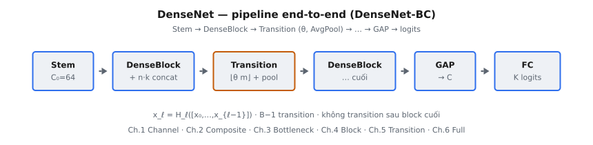

DenseNet (Huang et al., 2017) kết nối mọi lớp với mọi lớp trước đó trong cùng một dense block theo kiểu feed-forward. Khác với ResNet cộng element-wise trên shortcut, DenseNet dùng **concatenation theo channel**: lớp $\ell$ nhận $[x_0, x_1, \ldots, x_{\ell-1}]$ rồi phát đúng $k$ feature map mới — **growth rate**. Kết quả là tái sử dụng đặc trưng mạnh, lớp mỏng, và lịch channel tăng tuyến tính trong block rồi được nén lại ở **transition layer** bằng hệ số $\theta$.

::: {#fig-densenet-pipeline fig-cap="Pipeline DenseNet: Stem → DenseBlock → Transition ($\\theta$, AvgPool) → … → DenseBlock cuối → BN+ReLU → GAP → logits. Trong block: $x_\\ell = H_\\ell([x_0,\\ldots,x_{\\ell-1}])$." fig-alt="Sơ đồ khối ngang: Stem, DenseBlock, Transition, DenseBlock, GAP, FC logits."}
{fig-align="center"}
:::

Biến thể DenseNet-BC (bottleneck $1\times1$ trong block + compression $\theta < 1$ ở transition) là cấu hình dùng cho ImageNet: DenseNet-121, 169, 201, 161. Phần này bám định dạng NCHW $(N, C, H, W)$ kiểu PyTorch.

## Phần này bao gồm những gì

Chuỗi chương này phân rã DenseNet theo từng thành phần:

1. Channel growth và compression $\theta$ — lịch channel xuyên suốt mạng.
2. Composite layer $H_\ell$: BN → ReLU → Conv $3\times3$ (pre-activation).
3. Bottleneck layer DenseNet-B: BN-ReLU-Conv$1\times1$ ($4k$) rồi BN-ReLU-Conv$3\times3$ ($k$).
4. Dense block — connectivity bằng concatenation và đầu ra $C + L\cdot k$.
5. Transition layer — nén channel và downsample không gian giữa các block.
6. Full DenseNet — stem, các block/transition, GAP và classifier.

Mục tiêu là nắm vì sao concatenation + growth rate nhỏ lại hiệu quả tham số hơn cộng residual, và cách theo dõi shape/channel qua từng stage.

## Tại sao DenseNet vẫn quan trọng

DenseNet vẫn đáng học vì nó làm rõ một mẫu thiết kế lặp lại ở nhiều kiến trúc sau:

* tái sử dụng đặc trưng thay vì học lại bản sao dư thừa,
* kiểm soát width bằng growth rate $k$ và compression $\theta$,
* tách feature extraction (dense block) khỏi downsampling (transition),
* và so sánh trực tiếp **concat** với **add** của ResNet trên cùng bài toán sâu.

Ý tưởng concat skip / feature reuse còn xuất hiện ở U-Net, FPN, và một số biến thể hiệu quả sau này (CondenseNet, DLA).

## Kiến thức tiên quyết

* Nền tảng CNN (tích chập, pooling, hệ phân cấp đặc trưng).
* ResNet ở mức khái niệm: residual $y = F(x) + x$ và shortcut.
* Batch Normalization (train vs inference / running statistics).
* Shape tensor NCHW và phép concat theo dim channel.

## Ký hiệu được sử dụng trong phần này

$$
\begin{aligned}
x &:\ \text{tensor kích hoạt (định dạng NCHW)}, \\
H, W, C &:\ \text{chiều cao, chiều rộng và số channel}, \\
k &:\ \text{growth rate — số feature map mỗi lớp thêm}, \\
\theta &:\ \text{compression factor tại transition}, \\
H_\ell &:\ \text{hàm composite tại lớp } \ell \text{ trong dense block}, \\
[\,\cdot\,] &:\ \text{concatenation theo trục channel}, \\
y &:\ \text{logit của mô hình hoặc xác suất lớp được dự đoán}.
\end{aligned}
$$
