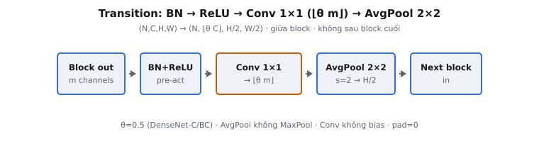

Transition layer là mô đun nối giữa các dense block trong DenseNet (Huang et al., 2017). Nó làm hai việc cùng lúc: nén số feature-map channel bằng convolution $1 \times 1$, và giảm một nửa độ phân giải không gian bằng average pooling $2 \times 2$. Không có nó, số channel do dense connectivity tạo ra sẽ nổ và map không gian không bao giờ co.

## Vì sao cần transition

Trong dense block, mọi lớp nhận concatenation mọi feature map trước. Nếu block có $L$ lớp và mỗi lớp thêm $k$ channel (growth rate), đầu vào block $C_0$ channel tăng thành $C_0 + L \cdot k$ channel ở cuối. Xếp nhiều block liền nhau sẽ cộng dồn tăng trưởng này thành hàng nghìn channel — đắt về bộ nhớ và compute.

Dense connectivity cũng đòi hỏi mọi feature map trong block cùng kích thước không gian, nếu không concatenation theo trục channel không xác định. Nghĩa là downsampling không thể xảy ra trong block. Mạng do đó cần một thành phần riêng, đặt giữa các block, vừa giảm channel vừa giảm độ phân giải không gian. Thành phần đó là transition layer.

Transition layer giải hai bài toán bằng một module:

* **Kiểm soát channel:** convolution $1 \times 1$ ánh xạ số channel đã concat lớn xuống số nhỏ hơn, giữ block kế khả thi.
* **Downsampling không gian:** average pooling $2 \times 2$ stride 2 giảm một nửa chiều cao và chiều rộng, xây hệ phân cấp đa tỷ lệ mà mạng phân loại dựa vào.

::: {#fig-densenet-transition fig-cap="Transition: BN → ReLU → Conv $1\\times1$ ($\\lfloor\\theta m\\rfloor$) → AvgPool $2\\times2$ stride 2; shape $(N,C,H,W)\\to(N,\\lfloor\\theta C\\rfloor,H/2,W/2)$." fig-alt="Chuỗi Block out, BN+ReLU, Conv 1x1, AvgPool, Next block."}
{fig-align="center"}
:::

## Phép toán

Một transition layer áp dụng, theo thứ tự: batch normalization, phi tuyến ReLU, convolution $1 \times 1$, rồi average pooling $2 \times 2$. Với đầu vào $x$ có $C$ channel, tensor đã batch-normalize và activate theo channel là:

$$
\hat{x}_c = \frac{x_c - \mu_c}{\sqrt{\sigma_c^2 + \epsilon}}, \qquad y_c = \text{ReLU}\!\left(\gamma_c \, \hat{x}_c + \beta_c\right)
$$

với $\mu_c$ và $\sigma_c^2$ là running mean và variance cho channel $c$, $\gamma_c$ và $\beta_c$ là scale và shift đã học, và $\epsilon$ là hằng số nhỏ cho ổn định số (thường $10^{-5}$).

Convolution $1 \times 1$ rồi trộn channel tại mỗi vị trí không gian. Với trọng số $W \in \mathbb{R}^{C_{out} \times C \times 1 \times 1}$ và không bias, đầu ra tại vị trí $(h, w)$ cho channel đầu ra $o$ là:

$$
z_{o,h,w} = \sum_{c=1}^{C} W_{o,c} \cdot y_{c,h,w}
$$

Cuối cùng, average pooling $2 \times 2$ không chồng với stride 2 giảm mỗi chiều không gian một nửa:

$$
\text{out}_{o,i,j} = \frac{1}{4}\sum_{a=0}^{1}\sum_{b=0}^{1} z_{o,\,2i+a,\,2j+b}
$$

Với đầu vào shape $(N, C, H, W)$, đầu ra có shape $(N, C_{out}, H/2, W/2)$.

## Compression và hyperparameter theta

Số channel đầu ra $C_{out}$ mà convolution $1 \times 1$ tạo là núm compression. Bài báo giới thiệu hyperparameter $\theta \in (0, 1]$ gọi là **compression factor**. Nếu dense block phát $m$ feature map, transition layer theo sau tạo $\lfloor \theta m \rfloor$ channel đầu ra.

* **$\theta = 1$:** không compression. Transition giữ số channel không đổi. Đây là cấu hình DenseNet thuần.
* **$\theta < 1$:** có compression. Transition thu hẹp số channel — bài báo gọi **DenseNet-C**. Thí nghiệm dùng $\theta = 0.5$, giảm một nửa channel mỗi transition.
* **DenseNet-BC:** khi mạng kết hợp bottleneck trong block với compression tại transition ($\theta < 1$), gọi là DenseNet-BC. Đây là biến thể hiệu quả tham số nhất bài báo báo cáo.

Trong implementation, $\theta$ không được truyền tường minh. Nó được mã hóa bởi shape trọng số convolution: trọng số shape $(C_{out}, C, 1, 1)$ hàm ý $\theta = C_{out} / C$. Forward pass chỉ đọc $C_{out}$ từ tensor trọng số và tạo đúng số channel đầu ra đó.

## Vì sao convolution $1\times1$

Convolution $1 \times 1$ là cách rẻ nhất để đổi số channel trong khi bảo toàn cấu trúc không gian. Nó không có receptive field không gian: mỗi pixel đầu ra chỉ phụ thuộc cùng vị trí không gian qua các channel đầu vào. Điều này làm nó thành chiếu tuyến tính học được áp dụng giống nhau tại mọi pixel.

* **Padding phải bằng không.** Kernel $1 \times 1$ với padding 0 và stride 1 để $H$ và $W$ không đổi. Thêm padding sẽ phình chiều không gian, phá shape đầu ra kỳ vọng.
* **Không dùng bias** trong convolution transition, nhất quán với quy ước gập mọi offset affine vào batch normalization đứng trước.
* **Chỉ trộn channel.** Vì kernel là $1 \times 1$, convolution không bắt được mẫu không gian. Công việc đó để cho các convolution $3 \times 3$ trong dense block. Transition thuần là giai đoạn compression và downsampling.

## Average pooling so với max pooling

DenseNet dùng average pooling trong transition layer, không phải max pooling. Đây là lựa chọn chủ đích khớp dense connectivity.

* **Average pooling bảo toàn thông tin.** Mọi giá trị trong cửa sổ $2 \times 2$ đóng góp vào đầu ra. Vì dense block tái sử dụng đặc trưng qua concatenation, bỏ ba trong bốn kích hoạt (như max pooling làm) sẽ vứt tín hiệu mà lớp downstream có thể muốn tái sử dụng.
* **Downsampling mượt.** Average pooling tạo tóm tắt độ phân giải thấp đã làm mượt thay vì tập thưa các đáp ứng đỉnh. Điều này có xu hướng giữ nhiều hơn phân phối đặc trưng mà các lớp dense sau concat và tinh chỉnh.
* **Max pooling** phổ biến ở VGG và AlexNet, nơi nó nhấn mạnh đáp ứng cục bộ mạnh nhất. DenseNet thấy average pooling hoạt động tốt trong transition, khớp triết lý feature reuse hơn là feature selection.

Dùng max pooling ở đây đổi hoàn toàn đầu ra số (chọn max mỗi cửa sổ thay vì mean), nên đây là một trong những lỗi triển khai phổ biến nhất.

## Transition nằm đâu trong mạng

Một DenseNet là chuỗi dense block ngăn cách bởi transition layer. DenseNet điển hình cho ImageNet có bốn dense block và do đó ba transition layer, một giữa mỗi cặp block liền kề.

* **Giữa các block, không sau block cuối.** Transition chỉ xuất hiện giữa các block. Sau dense block cuối không có transition; thay vào đó mạng áp dụng global average pooling rồi linear classifier.
* **Mỗi transition giảm một nửa độ phân giải.** Với ba transition, feature map $56 \times 56$ sau stem giảm xuống $7 \times 7$ trước classifier, khớp tiến trình receptive field của các mạng tích chập sâu khác.

## So sánh với downsampling ResNet

ResNet (He et al., 2016) xử lý downsampling khác. Nó dùng strided convolution: convolution đầu của một số residual block có stride 2, vừa giảm kích thước không gian vừa đổi channel trong một phép học được, và skip connection dùng projection $1 \times 1$ stride để khớp chiều.

* **ResNet** hợp downsampling vào block qua strided convolution. Đổi channel xảy ra qua convolution của chính block và projection shortcut.
* **DenseNet** tách downsampling thành module transition riêng. Block không downsample; transition làm hết với average pool không học cộng chiếu $1 \times 1$ học được.
* Sự tách này giữ mọi lớp trong DenseNet block ở một độ phân giải, đúng thứ làm concatenation theo channel hợp lệ và mang lại thuộc tính feature-reuse đặc trưng của kiến trúc.

## Chi phí tham số và compute

Transition layer cố ý nhẹ so với các dense block xung quanh. Tham số học duy nhất là hạng tử affine batch-norm ($\gamma$, $\beta$, hai giá trị mỗi channel đầu vào) và trọng số convolution $1 \times 1$.

* **Tham số convolution:** convolution $1 \times 1$ từ $C$ sang $C_{out}$ channel có $C \cdot C_{out}$ trọng số và không bias. Với compression $\theta = 0.5$ và $C = 512$, đó là $512 \cdot 256 = 131072$ trọng số — một phần nhỏ so với convolution $3 \times 3$ ở cùng số channel (lớn gấp chín lần).
* **Tham số pooling:** average pooling không có tham số học. Nó là phép trung bình cố định.
* **Compute:** vì kernel là $1 \times 1$, convolution tốn $H \cdot W \cdot C \cdot C_{out}$ nhân-cộng. Compression trực tiếp giảm cả chi phí này và chi phí mọi lớp trong block kế, vì những lớp đó giờ vận hành trên ít channel đầu vào hơn.

Đây là phần lớn lý do DenseNet-BC đạt độ chính xác mạnh với ít tham số hơn nhiều so với ResNet tương đương: compression mỗi transition giữ số channel mỗi block không phình, và chiếu $1 \times 1$ thì rẻ.

## Ví dụ số ($N=1$, $C=2$, $H=W=4$, $C_{out}=1$, $\epsilon=0$)

Giả sử channel 0 của $x$ toàn một và channel 1 toàn hai, với $\gamma = [1, 1]$, $\beta = [0, 0]$, $\mu = [1, 2]$, $\sigma^2 = [1, 1]$. Map đầu vào là $(1, 2, 4, 4)$, nên sau convolution về một channel và pool $2 \times 2$ ta kỳ vọng đầu ra $(1, 1, 2, 2)$. Đi bộ qua bốn giai đoạn bằng tay xác nhận cả giá trị lẫn shape.

1. **Batch norm:** $\hat{x}_0 = (1 - 1)/\sqrt{1} = 0$ mọi pixel channel 0, và $\hat{x}_1 = (2 - 2)/\sqrt{1} = 0$ cho channel 1. Vậy $\hat{x}$ toàn không.
2. **ReLU:** $\gamma \hat{x} + \beta = 0$, và $\text{ReLU}(0) = 0$. Tensor đã activate $y$ toàn không.
3. **Convolution $1 \times 1$:** với trọng số $W = [[0.5], [0.5]]$ (shape $(1, 2, 1, 1)$), mỗi pixel đầu ra là $0.5 \cdot 0 + 0.5 \cdot 0 = 0$. Map đầu ra $4 \times 4$ toàn không.
4. **Average pool $2 \times 2$ stride 2:** mỗi cửa sổ $2 \times 2$ trung bình thành $0$, cho đầu ra $2 \times 2$ toàn không. Shape cuối là $(1, 1, 2, 2)$.

Giờ đổi channel 0 của $x$ thành toàn hai (mean vẫn 1). Thì $\hat{x}_0 = (2 - 1)/1 = 1$, ReLU giữ ở 1, convolution cho $0.5 \cdot 1 + 0.5 \cdot 0 = 0.5$ mỗi pixel, và average pooling bảo toàn $0.5$. Đầu ra là map $2 \times 2$ đầy $0.5$. Điều này cho thấy mỗi giai đoạn biến đổi giá trị thế nào.

## Bối cảnh hiện đại và biến thể

Mẫu transition gồm chuẩn hóa, chiếu, downsample xuất hiện xuyên nhiều kiến trúc sau, dù thành phần chính xác khác nhau.

* **Strided convolution** thay pooling riêng trong nhiều thiết kế (ResNet, EfficientNet), hợp chiếu và downsampling vào một phép học được. DenseNet giữ chúng tách, làm vai trò mỗi giai đoạn dễ lập luận.
* **Patch-merging** trong hierarchical vision transformer như Swin đóng đúng vai transition: chúng concat token không gian lân cận và áp dụng chiếu tuyến tính để giảm chiều đã merge, giảm một nửa độ phân giải không gian giữa các stage.
* **Compression như regularization.** Giảm channel mỗi transition hoạt động như bottleneck cấu trúc. Nó buộc mạng tóm tắt đặc trưng đã tích lũy trước khi truyền tiếp — bài báo thấy điều này cải thiện cả hiệu quả tham số lẫn khái quát hóa ở $\theta = 0.5$.

Bài học bền từ transition DenseNet là downsampling và kiểm soát channel có thể tách sạch khỏi feature extraction, và average pooling là mặc định hợp lý khi kiến trúc dựa vào tái sử dụng đặc trưng thay vì chọn kích hoạt mạnh nhất.

## Các lỗi thường gặp

* **Dùng max pooling thay vì average pooling.** Transition DenseNet dùng average pooling $2 \times 2$. Đổi sang max pooling chọn kích hoạt lớn nhất mỗi cửa sổ thay vì mean, tạo đầu ra số hoàn toàn khác dù shape giống. Đây là lỗi phổ biến nhất.
* **Quên hoàn toàn bước pooling.** Bỏ pool để chiều không gian ở $H \times W$ thay vì $H/2 \times W/2$. Shape sẽ sai và block downstream nhận feature map gấp đôi độ phân giải kỳ vọng.
* **Thêm padding cho convolution $1 \times 1$.** Kernel $1 \times 1$ cần padding 0 và stride 1. Mọi padding khác không sẽ phình chiều không gian và làm hỏng cả giá trị lẫn shape cuối sau pooling.
* **Bỏ ReLU hoặc áp dụng sai thứ tự.** Transition là batch norm, rồi ReLU, rồi convolution. Bỏ ReLU cho phép pre-activation âm chảy vào convolution, và áp dụng phép toán lệch thứ tự đổi kết quả. Phi tuyến phải cắt âm về không trước chiếu channel.

## Code

```python
import torch
import torch.nn.functional as F

def transition_layer(x, bn_gamma, bn_beta, bn_mean, bn_var, conv_weight, eps=1e-5):
    x = torch.as_tensor(x, dtype=torch.float64)
    gamma = torch.as_tensor(bn_gamma, dtype=torch.float64)
    beta = torch.as_tensor(bn_beta, dtype=torch.float64)
    mean = torch.as_tensor(bn_mean, dtype=torch.float64)
    var = torch.as_tensor(bn_var, dtype=torch.float64)
    weight = torch.as_tensor(conv_weight, dtype=torch.float64)

    x_hat = (x - mean[None, :, None, None]) / torch.sqrt(var[None, :, None, None] + eps)
    y = F.relu(gamma[None, :, None, None] * x_hat + beta[None, :, None, None])
    y = F.conv2d(y, weight, bias=None, stride=1, padding=0)
    return F.avg_pool2d(y, kernel_size=2, stride=2)
```
