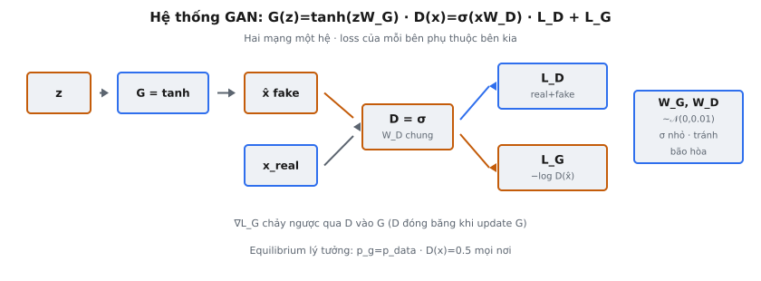
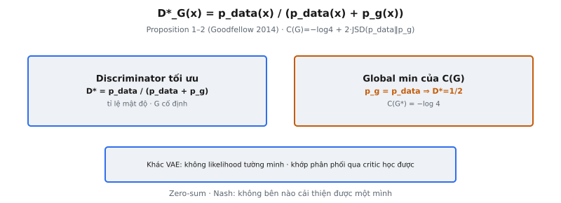

Generative Adversarial Network là hai mạng nơ-ron khóa trong trò chơi minimax: một Generator giả mạo dữ liệu và một Discriminator cố phân biệt thật với giả. Không mạng nào có ý nghĩa nếu tách rời. Generator không có hàm loss nếu thiếu Discriminator để đánh lừa, và Discriminator không có đối thủ nếu thiếu Generator tạo hàng giả. Hệ thống hoàn chỉnh gom cả hai mạng vào một class duy nhất và nối chúng trong một bước huấn luyện.

Đây là GAN đơn giản nhất có thể: mỗi mạng một lớp tuyến tính, không lớp ẩn, không bộ lọc tích chập. Tuy vậy nó chứa mọi thành phần cấu trúc của khung Goodfellow et al. (2014) gốc: lấy mẫu noise, forward pass generator, forward pass discriminator trên cả dữ liệu thật và giả, cùng hai loss adversarial.

## Nó là gì

Complete GAN System đóng gói toàn bộ khung adversarial thành một đối tượng duy nhất. Nó giữ hai ma trận trọng số ($W_G$ và $W_D$), expose generator ánh xạ noise sang dữ liệu giả, discriminator ánh xạ mọi dữ liệu sang xác suất là thật, và train_step nối mọi thứ để tính cả hai loss trong một forward pass.

Generator ánh xạ noise $z$ sang không gian dữ liệu qua tanh: $G(z) = \tanh(z \cdot W_G)$. Tanh giới hạn đầu ra trong $[-1, 1]$, khớp dải điển hình của dữ liệu thực đã chuẩn hóa. Discriminator tạo xác suất qua sigmoid: $D(x) = \sigma(x \cdot W_D)$. Sigmoid nén đầu ra về $(0, 1)$, biểu diễn xác suất $x$ là thật.

Trò chơi adversarial: D muốn xuất 1 với dữ liệu thật và 0 với dữ liệu giả. G muốn D xuất 1 với dữ liệu giả. Hai bên không thể cùng thắng. Căng thẳng này thúc đẩy học sinh.

::: {#fig-gan-complete fig-cap="Hệ thống: $z\\to G=\\tanh(zW_G)\\to\\hat{x}$; $x_{\\mathrm{real}}$ và $\\hat{x}$ qua $D=\\sigma(\\cdot W_D)$ → $L_D$, $L_G$. $W_G,W_D\\sim\\mathcal{N}(0,0.01)$." fig-alt="Pipeline G và D với hai loss."}
{fig-align="center"}
:::

::: {#fig-gan-equilibrium fig-cap="Prop. 1–2: $D^*_G(x)=p_{\\mathrm{data}}/(p_{\\mathrm{data}}+p_g)$; $p_g=p_{\\mathrm{data}}\\Rightarrow D^*=1/2$, $C(G^*)=-\\log 4$. Khác VAE: không likelihood tường minh." fig-alt="Hai panel D star và global minimum."}
{fig-align="center"}
:::

## Các phương trình chính

**Lấy mẫu noise:**

$$
z \sim \mathcal{N}(0, I), \quad z \in \mathbb{R}^{n \times \texttt{noise\_dim}}
$$

**Forward pass generator:**

$$
\hat{x} = \tanh(z \cdot W_G), \quad W_G \in \mathbb{R}^{\texttt{noise\_dim} \times \texttt{data\_dim}}
$$

**Forward pass discriminator (trên mọi đầu vào $x$):**

$$
p = \sigma(x \cdot W_D) = \frac{1}{1 + e^{-x \cdot W_D}}, \quad W_D \in \mathbb{R}^{\texttt{data\_dim} \times 1}
$$

**Loss discriminator:**

$$
\mathcal{L}_D = -\frac{1}{m}\sum_{i=1}^{m}\bigl[\log D(x_{\text{real}}^{(i)}) + \log(1 - D(G(z^{(i)})))\bigr]
$$

**Loss generator (dạng non-saturating):**

$$
\mathcal{L}_G = -\frac{1}{m}\sum_{i=1}^{m}\log D(G(z^{(i)}))
$$

**Khởi tạo trọng số:**

$$
W_G \sim \mathcal{N}(0, 0.01), \quad W_D \sim \mathcal{N}(0, 0.01)
$$

## Hai mạng như một hệ thống

G và D phụ thuộc lẫn nhau. Loss của Generator được định nghĩa hoàn toàn qua đầu ra Discriminator trên dữ liệu giả: $\mathcal{L}_G = -\mathbb{E}[\log D(G(z))]$. Không có D, biểu thức này vô nghĩa. Ngược lại, loss Discriminator cần mẫu giả để đối chiếu với mẫu thật: $\mathcal{L}_D = -\mathbb{E}[\log D(x_{\text{real}})] - \mathbb{E}[\log(1 - D(G(z)))]$. Không có G, hạng thứ hai biến mất và D không bao giờ học từ chối hàng giả.

Sự phụ thuộc này là lý do class giữ cả $W_G$ và $W_D$. Chúng là ma trận trọng số riêng với shape và luồng gradient khác nhau, nhưng phải sống trong cùng hệ thống vì tín hiệu huấn luyện của mỗi mạng phụ thuộc tham số hiện tại của mạng kia.

Động lực adversarial tạo mục tiêu di chuyển. Khi G cải thiện, D phải làm việc cứng hơn để phân biệt hàng giả. Khi D cải thiện, G phải tạo hàng giả tốt hơn. Lý tưởng, cuộc chạy đua vũ trang này hội tụ về cân bằng nơi G tạo mẫu hoàn hảo và D xuất 0.5 mọi nơi. Trong thực tế, hội tụ mong manh và phụ thuộc learning rate, cân bằng kiến trúc, lịch huấn luyện.

## Pipeline forward

Luồng dữ liệu trong một bước huấn luyện có bốn giai đoạn:

* **Giai đoạn 1 — Lấy mẫu noise.** Rút $z \in \mathbb{R}^{m \times \texttt{noise\_dim}}$ từ phân phối chuẩn. Đây là nguyên liệu thô của G.
* **Giai đoạn 2 — Forward generator.** Tính $\hat{x} = \tanh(z \cdot W_G)$, tạo mẫu giả trong $\mathbb{R}^{m \times \texttt{data\_dim}}$.
* **Giai đoạn 3 — Discriminator trên dữ liệu thật.** Tính $p_{\text{real}} = \sigma(x_{\text{real}} \cdot W_D)$. D nên đẩy các giá trị này về 1.
* **Giai đoạn 4 — Discriminator trên dữ liệu giả.** Tính $p_{\text{fake}} = \sigma(\hat{x} \cdot W_D)$. D nên đẩy về 0; G nên đẩy về 1.

D dùng cùng trọng số $W_D$ ở giai đoạn 3 và 4. Khác biệt duy nhất là đầu vào: dữ liệu thật so với đầu ra của G. Đó là điều làm nên tính adversarial: cùng một classifier đánh giá cả hai nguồn, và phản hồi của nó định nghĩa cả hai loss.

Pipeline forward là một DAG. Đầu ra của G đi vào D, nhưng đầu ra của D không quay lại G trong forward pass. Kết nối adversarial xảy ra qua loss: loss của G là hàm đầu ra D trên mẫu của G, nên gradient chảy ngược qua D vào G khi lan truyền ngược.

## Khởi tạo trọng số

Cả hai ma trận trọng số được rút từ $\mathcal{N}(0, 0.01)$. Độ lệch chuẩn nhỏ này rất quan trọng:

**Quá lớn (ví dụ $\sigma = 1.0$):** Pre-activation $z \cdot W_G$ của generator sẽ có độ lớn lớn. Sau tanh, đầu ra bão hòa gần $\pm 1$ và gradient suy biến. Với discriminator, logits lớn đẩy sigmoid về 0 hoặc 1, nơi $\log(0) = -\infty$ và học sụp đổ ngay.

**Quá nhỏ (ví dụ $\sigma = 10^{-6}$):** Cả hai mạng gần như ánh xạ identity. G xuất giá trị gần không bất kể đầu vào. D xuất $\sigma(0) \approx 0.5$ với mọi thứ. Gradient tồn tại nhưng rất nhỏ, huấn luyện mất thời gian phi thực tế để thoát vùng phẳng này.

**Điểm ngọt ($\sigma = 0.01$):** Pre-activation đủ nhỏ để tanh và sigmoid hoạt động trong vùng tuyến tính (gradient chảy tự do) nhưng đủ lớn để mạng tạo đầu ra phân biệt được.

Trong triển khai này, class nhận $W_G$ và $W_D$ qua tham số constructor thay vì lấy mẫu nội bộ. Điều này làm hệ thống xác định và có thể kiểm thử.

## Bước huấn luyện

Phương thức `train_step` thực hiện một forward pass qua toàn hệ thống và trả về cả hai loss:

**1. Sinh dữ liệu giả.** Cho noise $z$, tính $\hat{x} = \tanh(z \cdot W_G)$.

**2. Phân loại dữ liệu thật.** Tính $p_{\text{real}} = \sigma(x_{\text{real}} \cdot W_D)$ và clip về $[\epsilon, 1 - \epsilon]$ với $\epsilon = 10^{-8}$.

**3. Phân loại dữ liệu giả.** Tính $p_{\text{fake}} = \sigma(\hat{x} \cdot W_D)$ và clip tương tự.

**4. Tính loss D.** $\mathcal{L}_D = -\text{mean}[\log(p_{\text{real}}) + \log(1 - p_{\text{fake}})]$. D muốn $p_{\text{real}} \to 1$ và $p_{\text{fake}} \to 0$.

**5. Tính loss G.** $\mathcal{L}_G = -\text{mean}[\log(p_{\text{fake}})]$. G muốn $p_{\text{fake}} \to 1$.

Triển khai này chỉ tính loss forward pass mà không lan truyền ngược hay cập nhật trọng số. Đây là minh họa cấu trúc: nối đúng thành phần, tính đúng loss, xác minh con số. Trong vòng huấn luyện đầy đủ, tính gradient của $\mathcal{L}_D$ theo $W_D$ (cập nhật D), rồi gradient của $\mathcal{L}_G$ theo $W_G$ (cập nhật G).

Loss G non-saturating ($-\log D(G(z))$) khác loss G minimax ($\log(1 - D(G(z)))$). Đầu huấn luyện khi D dễ từ chối hàng giả, $D(G(z)) \approx 0$. Dạng minimax cho $\log(1 - 0) \approx 0$: không gradient cho G. Dạng non-saturating cho $-\log(0) \to \infty$: tín hiệu gradient mạnh thúc G cải thiện. Đây là dạng dùng trong thực tế và trong triển khai này.

## Bối cảnh bài báo

Goodfellow et al. (2014) giới thiệu GAN trong "Generative Adversarial Nets." Bài báo trình bày khung dưới dạng trò chơi minimax:

$$
\min_G \max_D \; \mathbb{E}_{x \sim p_{\text{data}}}[\log D(x)] + \mathbb{E}_{z \sim p_z}[\log(1 - D(G(z)))]
$$

Algorithm 1 mô tả quy trình huấn luyện: mỗi iteration, trước tiên cập nhật D bằng cách leo gradient stochastic trong $k$ bước, rồi cập nhật G bằng cách xuống gradient stochastic một bước. Bài báo chứng minh nếu cả hai mạng đủ dung lượng và D được huấn luyện tới tối ưu mỗi bước, thì $p_G$ hội tụ về $p_{\text{data}}$. Đây là Nash equilibrium: không bên nào cải thiện được một mình.

Đảm bảo lý thuyết dựa trên D luôn tối ưu mỗi bước — điều không bao giờ đúng trong thực tế. Huấn luyện thực luân phiên một bước gradient cho D và G, tạo hệ động có thể dao động, phân kỳ, hoặc mode-collapse. Dù khoảng cách giữa lý thuyết và thực hành, khung cơ bản vẫn bền vững đáng kể và sinh ra cả họ mô hình sinh.

Bài báo cũng ghi nhận heuristic non-saturating: thay vì G minimize $\log(1 - D(G(z)))$, G maximize $\log D(G(z))$. Cung cấp gradient mạnh hơn đầu huấn luyện và được áp dụng rộng rãi. Triển khai này dùng dạng non-saturating.

## Ví dụ số

Truy vết một GAN cụ thể với $\texttt{noise\_dim} = 3$, $\texttt{data\_dim} = 2$.

**Trọng số:**

$$
W_G = \begin{bmatrix} 0.3 & -0.1 \\ 0.2 & 0.4 \\ -0.1 & 0.5 \end{bmatrix} \in \mathbb{R}^{3 \times 2}, \quad W_D = \begin{bmatrix} 0.5 \\ -0.2 \end{bmatrix} \in \mathbb{R}^{2 \times 1}
$$

**Bước 1 — Lấy mẫu noise.** $z = [0.5,\; -0.5,\; 1.0]$ (một mẫu, $\texttt{noise\_dim} = 3$).

**Bước 2 — Forward generator.** Pre-activation: $z \cdot W_G = [0.5(0.3) + (-0.5)(0.2) + 1.0(-0.1),\;\; 0.5(-0.1) + (-0.5)(0.4) + 1.0(0.5)] = [-0.05,\;\; 0.25]$. Áp tanh: $\hat{x} = [\tanh(-0.05),\;\; \tanh(0.25)] = [-0.0500,\;\; 0.2449]$.

**Bước 3 — Discriminator trên dữ liệu giả.** $\hat{x} \cdot W_D = (-0.0500)(0.5) + (0.2449)(-0.2) = -0.0250 - 0.0490 = -0.0740$. $p_{\text{fake}} = \sigma(-0.0740) = 1/(1 + e^{0.0740}) \approx 0.4815$.

**Bước 4 — Discriminator trên dữ liệu thật.** $x_{\text{real}} = [0.8,\; -0.3]$. $x_{\text{real}} \cdot W_D = 0.8(0.5) + (-0.3)(-0.2) = 0.40 + 0.06 = 0.46$. $p_{\text{real}} = \sigma(0.46) \approx 0.6130$.

**Bước 5 — Tính loss.**

$$
\mathcal{L}_D = -[\log(0.6130) + \log(1 - 0.4815)] = -[-0.4894 + (-0.6568)] = 1.1462
$$

$$
\mathcal{L}_G = -\log(0.4815) = 0.7308
$$

**Diễn giải:** D chỉ 61% tin mẫu thật là thật và gán 48% xác suất hàng giả là thật. G muốn $p_{\text{fake}} \to 1$, đẩy $\mathcal{L}_G \to 0$. Khi hội tụ, $p_{\text{fake}} = p_{\text{real}} = 0.5$, cho $\mathcal{L}_D = -2\log(0.5) = 1.3863$ và $\mathcal{L}_G = -\log(0.5) = 0.6931$.

## Hệ sinh thái GAN

Khung cơ bản từ Goodfellow et al. (2014) đã được mở rộng mạnh:

* **DCGAN (Radford et al., 2015):** Thay lớp fully-connected bằng lớp tích chập. Đặt ra hướng dẫn: batch normalization, ReLU trong G, LeakyReLU trong D, không lớp ẩn fully-connected.
* **WGAN (Arjovsky et al., 2017):** Thay JS divergence bằng Wasserstein distance. Gradient mượt hơn và loss tương quan chất lượng mẫu. Discriminator (giờ gọi "critic") xuất điểm không giới hạn, trọng số được clip cho ràng buộc Lipschitz.
* **WGAN-GP (Gulrajani et al., 2017):** Thay weight clipping bằng gradient penalty, giải quyết underuse dung lượng và vấn đề gradient do clip cứng.
* **StyleGAN (Karras et al., 2019):** Giới thiệu mapping network từ noise sang không gian style, và adaptive instance normalization (AdaIN) ở mỗi lớp. Tạo khuôn mặt photorealistic với điều khiển tách rời tư thế, tóc, tuổi.
* **BigGAN (Brock et al., 2019):** Scale GAN lên độ phân giải ImageNet với sinh có điều kiện lớp, orthogonal regularization, và truncation trick.

Dù tiến bộ, mọi biến thể chia sẻ lõi giống nhau: generator biến đổi noise, discriminator phân loại, và loss adversarial liên kết chúng.

## Các lỗi thường gặp

**1. Dùng chung $W_G$ và $W_D$ hoặc một ma trận trọng số duy nhất.**

$W_G$ có shape $(\texttt{noise\_dim}, \texttt{data\_dim})$ và $W_D$ có shape $(\texttt{data\_dim}, 1)$. Chúng phục vụ chức năng khác nhau và shape khác nhau. Dùng một ma trận cho cả hai nghĩa là cập nhật G cũng thay D, phá hủy động lực adversarial.

**2. Thứ tự train_step sai.**

Forward pass phải chạy G trước (để tạo hàng giả), rồi D trên cả thật và giả. Trong huấn luyện đầy đủ, quy ước là: cập nhật D trước, rồi G. Đảo thứ tự nghĩa là G tối ưu chống D đã cũ.

**3. Quên clip xác suất trước khi lấy log.**

Nếu $D(x) = 0$ chính xác, $\log(D(x)) = -\infty$ và loss thành NaN. Clip về $[\epsilon, 1-\epsilon]$ với $\epsilon = 10^{-8}$ ngăn điều này mà không thay đổi đáng kể giá trị loss.

**4. Scale khởi tạo sai.**

Dùng $\mathcal{N}(0, 1)$ thay vì $\mathcal{N}(0, 0.01)$ gây bão hòa ngay ở cả tanh và sigmoid. Huấn luyện không bao giờ bắt đầu vì gradient suy biến ở vùng phẳng của cả hai hàm kích hoạt.

**5. Nhầm đầu ra G với đầu ra D.**

G xuất tensor dạng dữ liệu shape $(\texttt{batch}, \texttt{data\_dim})$ trong $[-1, 1]$. D xuất xác suất shape $(\texttt{batch}, 1)$ trong $(0, 1)$. Coi đầu ra đa chiều của G là xác suất hoặc đưa scalar của D vào sai giai đoạn là lỗi shape phổ biến.

**6. Dùng sai dạng loss G.**

Dạng minimax $\log(1 - D(G(z)))$ và dạng non-saturating $-\log(D(G(z)))$ không tương đương. Triển khai này dùng dạng non-saturating. Dạng minimax tạo gradient suy biến khi D mạnh, khiến G không học được.


## Code
```python
import numpy as np

class GAN:
    def __init__(self, G_W, D_W):
        self.G_W = np.array(G_W, dtype=float)
        self.D_W = np.array(D_W, dtype=float)
    
    def generate(self, z):
        z = np.array(z, dtype=float)
        out = np.tanh(np.dot(z, self.G_W))
        return [[round(float(v), 4) for v in row] for row in out]
    
    def discriminate(self, x):
        x = np.array(x, dtype=float)
        logits = np.dot(x, self.D_W)
        probs = 1 / (1 + np.exp(-logits))
        return [[round(float(v), 4) for v in row] for row in probs]
    
    def train_step(self, real_data, z):
        eps = 1e-8
        fake_data = np.tanh(np.dot(np.array(z, dtype=float), self.G_W))
        real_probs = np.clip(1 / (1 + np.exp(-np.dot(np.array(real_data, dtype=float), self.D_W))), eps, 1-eps)
        fake_probs = np.clip(1 / (1 + np.exp(-np.dot(fake_data, self.D_W))), eps, 1-eps)
        d_loss = -np.mean(np.log(real_probs) + np.log(1 - fake_probs))
        g_loss = -np.mean(np.log(fake_probs))
        return {"d_loss": round(float(d_loss), 4), "g_loss": round(float(g_loss), 4)}

```
