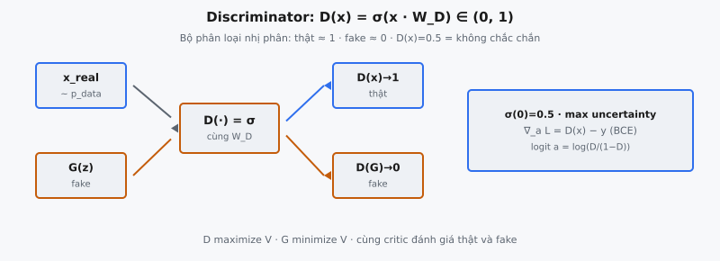

Discriminator là bộ phân loại nhị phân ở trung tâm Generative Adversarial Network. Cho đầu vào $x$, nó xuất xác suất vô hướng $D(x) \in [0, 1]$ ước lượng liệu $x$ đến từ dữ liệu huấn luyện thật hay do generator tạo ra. Giá trị gần 1 nghĩa là "có lẽ thật," gần 0 nghĩa là "có lẽ fake." Xác suất này điều khiển động lực huấn luyện adversarial được giới thiệu trong Goodfellow et al. (2014).

## Nó là gì: bộ phân loại nhị phân

Discriminator phân biệt hai lớp: mẫu thật rút từ $p_{\text{data}}(x)$, và mẫu fake do generator $G(z)$ tạo với $z \sim p_z(z)$ là noise vector latent.

Ở dạng đơn giản nhất, discriminator là mạng feedforward một lớp. Với đầu vào $x \in \mathbb{R}^d$:

$$
D(x) = \sigma(x \cdot W)
$$

với $W \in \mathbb{R}^{d \times 1}$ là ma trận trọng số học được và $\sigma$ là hàm sigmoid. Ma trận trọng số chiếu đầu vào $d$ chiều thành một vô hướng, và sigmoid nén nó thành xác suất.

Trong huấn luyện, discriminator nhận đầu vào từ hai nguồn:

* **Mẫu thật** $x \sim p_{\text{data}}(x)$: rút từ tập huấn luyện. Mục tiêu: $D(x) \approx 1$.
* **Mẫu fake** $\tilde{x} = G(z)$: do generator tạo. Mục tiêu: $D(G(z)) \approx 0$.

Discriminator không biết trước nguồn của một mẫu cho trước. Nó phải học phân biệt thật và fake chỉ từ thuộc tính thống kê của dữ liệu.

::: {#fig-gan-discriminator fig-cap="Discriminator: $D(x)=\\sigma(xW_D)\\in(0,1)$. Cùng $W_D$ trên $x_{\\mathrm{real}}$ ($\\to 1$) và $G(z)$ ($\\to 0$); $\\sigma(0)=0.5$." fig-alt="Hai nguồn real/fake qua D ra xác suất."}
{fig-align="center"}
:::

## Các phương trình chính

### Hàm sigmoid

Sigmoid ánh xạ mọi đầu vào thực sang $(0, 1)$:

$$
\sigma(a) = \frac{1}{1 + e^{-a}}
$$

Các tính chất liên quan đến discriminator:

* **$\sigma(0) = 0.5$:** Ranh giới quyết định. Độ không chắc chắn tối đa.
* **$\sigma(a) \to 1$ khi $a \to +\infty$:** Tin cậy cao đầu vào là thật.
* **$\sigma(a) \to 0$ khi $a \to -\infty$:** Tin cậy cao đầu vào là fake.
* **Đạo hàm:** $\sigma'(a) = \sigma(a)(1 - \sigma(a))$, đạt cực đại tại $a = 0$, biến mất ở cực trị.

### Lan truyền xuôi discriminator

Với đầu vào $x \in \mathbb{R}^d$ và trọng số $W \in \mathbb{R}^{d \times 1}$:

**Bước 1.** Tính logit: $a = x \cdot W$, tạo vô hướng $a \in \mathbb{R}$.

**Bước 2.** Áp dụng sigmoid: $D(x) = \sigma(a) = \frac{1}{1 + e^{-a}}$.

Logit $a$ là tỷ số log-odds: $a = \log \frac{D(x)}{1 - D(x)}$.

### Diễn giải đầu ra

* **$D(x) = 0.95$:** 95% tin $x$ là thật. Logit $a \approx 2.94$.
* **$D(x) = 0.50$:** Độ không chắc chắn tối đa. Logit $a = 0$.
* **$D(x) = 0.05$:** 95% tin $x$ là fake. Logit $a \approx -2.94$.

## Vai trò của discriminator trong trò chơi minimax

Mục tiêu GAN từ Goodfellow et al. (2014) là trò chơi minimax hai người chơi:

$$
\min_G \max_D \; V(D, G) = \mathbb{E}_{x \sim p_{\text{data}}(x)}[\log D(x)] + \mathbb{E}_{z \sim p_z(z)}[\log(1 - D(G(z)))]
$$

Discriminator tối đa hóa $V(D, G)$. Hai số hạng từ góc nhìn discriminator:

* **$\mathbb{E}_{x \sim p_{\text{data}}}[\log D(x)]$:** Với mẫu thật, discriminator muốn $D(x) \to 1$, khiến $\log D(x) \to 0$ (cực đại của nó). $D(x)$ nhỏ gây phạt âm lớn.
* **$\mathbb{E}_{z \sim p_z}[\log(1 - D(G(z)))]$:** Với mẫu fake, discriminator muốn $D(G(z)) \to 0$, khiến $\log(1 - D(G(z))) \to 0$. Bị đánh lừa ($D(G(z))$ lớn) gây phạt âm lớn.

Thực tế, điều này tương đương tối thiểu hóa binary cross-entropy với nhãn 1 cho thật và 0 cho fake:

$$
\mathcal{L}_D = -\frac{1}{m} \sum_{i=1}^{m} \left[ \log D(x^{(i)}) + \log(1 - D(G(z^{(i)}))) \right]
$$

Discriminator thực hiện gradient descent trên $\mathcal{L}_D$, cập nhật trọng số để tách thật và fake tốt hơn. Ngược lại, generator tối thiểu hóa $V$ bằng cách làm $D(G(z))$ lớn (đánh lừa discriminator). Căng thẳng adversarial này thúc đẩy học GAN.

## Tại sao dùng sigmoid

### Đầu ra xác suất

Sigmoid ánh xạ logit thô sang xác suất hợp lệ trong $(0, 1)$. Điều này cần thiết vì hàm giá trị liên quan $\log D(x)$ và $\log(1 - D(G(z)))$, cả hai đều yêu cầu $D(x) \in (0, 1)$ để tránh log của số không dương.

### Liên kết với binary cross-entropy

Cặp chuẩn trong hồi quy logistic là sigmoid + BCE loss. Khi kết hợp, gradient theo logit $a$ đơn giản hóa thành:

$$
\frac{\partial \mathcal{L}}{\partial a} = D(x) - y
$$

với $y \in \{0, 1\}$ là nhãn. Gradient đơn giản là dự đoán trừ mục tiêu, không có hệ số $\sigma'(a)$ có thể gây gradient biến mất trong không gian logit. Gradient sạch này là lý do sigmoid + BCE là chuẩn cho phân loại nhị phân.

### Diễn giải log-likelihood

Hàm giá trị $V(D, G)$ là log-likelihood kỳ vọng của discriminator dưới mô hình Bernoulli: $P(\text{real} \mid x) = D(x)$ và $P(\text{fake} \mid x) = 1 - D(x)$. Sigmoid đảm bảo diễn giải xác suất này hợp lệ.

## Bối cảnh bài báo: Goodfellow et al. (2014)

Trong "Generative Adversarial Nets," discriminator được mô tả: "The discriminative model D estimates the probability that a sample came from the training data rather than G." Bài báo khung GAN qua phép loại tư: generator là kẻ làm tiền giả, discriminator là cảnh sát phát hiện tiền giả, và cả hai cải thiện qua cạnh tranh.

Bài báo dùng multilayer perceptron cho cả $G$ và $D$. Phân tích lý thuyết giả định $D$ đủ dung lượng biểu diễn discriminator tối ưu cho mọi $G$. Goodfellow et al. chứng minh với $G$ cố định, discriminator tối ưu là:

$$
D^*_G(x) = \frac{p_{\text{data}}(x)}{p_{\text{data}}(x) + p_g(x)}
$$

với $p_g(x)$ là phân phối do generator gây ra. Discriminator tối ưu so sánh mật độ dữ liệu với mật độ generator: khi $p_{\text{data}}(x) > p_g(x)$, $D^*(x) > 0.5$; khi $p_g(x) > p_{\text{data}}(x)$, $D^*(x) < 0.5$. Kết quả này nền tảng định lý chính của bài báo: cực tiểu toàn cục của $V(D^*, G)$ đạt được khi và chỉ khi $p_g = p_{\text{data}}$, lúc đó $V = -\log 4$.

## Discriminator tối ưu

### Phác thảo suy diễn

Với $G$ cố định, viết lại $V$ dưới dạng tích phân:

$$
V(D, G) = \int_x \left[ p_{\text{data}}(x) \log D(x) + p_g(x) \log(1 - D(x)) \right] dx
$$

Tại mỗi điểm $x$, đặt $a = p_{\text{data}}(x)$ và $b = p_g(x)$. Ta tối đa hóa $f(D) = a \log D + b \log(1 - D)$:

$$
f'(D) = \frac{a}{D} - \frac{b}{1 - D} = 0 \implies D^* = \frac{a}{a + b} = \frac{p_{\text{data}}(x)}{p_{\text{data}}(x) + p_g(x)}
$$

Đạo hàm bậc hai $f''(D) = -a/D^2 - b/(1-D)^2 < 0$ với $a, b$ dương, xác nhận cực đại.

### Tại cân bằng: $D^* = 0.5$ mọi nơi

Khi generator khớp hoàn hảo phân phối dữ liệu ($p_g = p_{\text{data}}$):

$$
D^*(x) = \frac{p_{\text{data}}(x)}{p_{\text{data}}(x) + p_{\text{data}}(x)} = \frac{1}{2}
$$

Tại điểm cân bằng Nash, discriminator xuất 0.5 cho mọi đầu vào. Nó không phân biệt được thật và fake vì hai phân phối giống hệt. Điều này trái trực giác: huấn luyện GAN hoàn hảo khiến discriminator vô dụng. Mục đích của nó không phải là bộ phân loại tốt khi hội tụ, mà cung cấp tín hiệu huấn luyện hữu ích cho generator trong suốt quá trình.

## Ví dụ số

Xét discriminator một lớp với $d = 3$ và vectơ trọng số $W = [0.8, -1.2, 0.5]^T$.

### Mẫu thật

Đặt $x_{\text{real}} = [2.0, -1.0, 1.5]$ từ dữ liệu huấn luyện.

**Bước 1.** Logit: $a = (2.0)(0.8) + (-1.0)(-1.2) + (1.5)(0.5) = 1.6 + 1.2 + 0.75 = 3.55$

**Bước 2.** Sigmoid: $D(x_{\text{real}}) = \frac{1}{1 + e^{-3.55}} = \frac{1}{1.0287} \approx 0.972$

Đầu ra 0.972: tin cậy rất cao đây là thật. Đúng.

### Mẫu fake

Đặt $x_{\text{fake}} = G(z) = [-0.5, 1.8, -0.3]$ từ generator.

**Bước 1.** Logit: $a = (-0.5)(0.8) + (1.8)(-1.2) + (-0.3)(0.5) = -0.4 - 2.16 - 0.15 = -2.71$

**Bước 2.** Sigmoid: $D(x_{\text{fake}}) = \frac{1}{1 + e^{2.71}} = \frac{1}{16.03} \approx 0.062$

Đầu ra 0.062: tin cậy cao đây là fake. Đúng.

### Tính mất mát

Với mini-batch gồm một mẫu thật và một fake:

$$
\mathcal{L}_D = -\frac{1}{2}\left[\log(0.972) + \log(1 - 0.062)\right] = -\frac{1}{2}\left[-0.0284 + (-0.0640)\right] = 0.0462
$$

Mất mát nhỏ này xác nhận hiệu năng tốt. Discriminator hoàn hảo đạt mất mát 0. Discriminator ngẫu nhiên (xuất 0.5 cho mọi thứ) được $\log 2 \approx 0.693$.

## Tiến hóa discriminator

Kiến trúc discriminator đã phát triển đáng kể kể từ thiết kế MLP gốc.

### Discriminator tuyến tính và MLP (2014)

Bài báo gốc dùng MLP với hàm kích hoạt maxout. Chúng hoạt động trên tập dữ liệu đơn giản (MNIST) nhưng gặp khó với ảnh phức tạp vì lớp fully connected không khai thác cấu trúc không gian và cần quá nhiều tham số cho đầu vào lớn.

### Discriminator CNN: DCGAN (2015)

Radford et al. (2015) thay lớp fully connected bằng strided convolution. Discriminator dùng lớp conv với số channel tăng dần, batch normalization, và LeakyReLU, theo sau bởi sigmoid. Cách này tận dụng tính cục bộ không gian và chia sẻ tham số, cho phép sinh ảnh 64x64 thực tế.

### PatchGAN (2016)

Isola et al. (2016) giới thiệu discriminator xuất lưới xác suất thay vì một vô hướng. Mỗi phần tử phân loại một patch cục bộ là thật hay fake. Cách này tập trung cấu trúc tần số cao (texture, cạnh) thay vì bố cục toàn cục, tạo đầu ra sắc hơn.

### Spectral normalization (2018)

Miyato et al. (2018) ràng buộc hằng số Lipschitz bằng cách chia mỗi ma trận trọng số cho giá trị suy rộng lớn nhất. Điều này ngăn discriminator thay đổi quá nhanh, đảm bảo gradient mượt hơn cho generator và ổn định huấn luyện.

### Critic trong WGAN (2017)

Arjovsky et al. (2017) thay discriminator bằng "critic" xuất số thực không giới hạn (không sigmoid). Critic ước lượng khoảng cách Wasserstein giữa các phân phối. Tính liên tục Lipschitz được ép qua weight clipping hoặc gradient penalty (WGAN-GP, Gulrajani et al., 2017). Cách này giải quyết bất ổn huấn luyện và mode collapse.

## Các lỗi thường gặp

### Discriminator quá mạnh: gradient biến mất

Nếu discriminator trở nên quá mạnh, nó xuất giá trị gần 1.0 cho mọi thật và gần 0.0 cho mọi fake. Khi $D(G(z)) \approx 0$, gradient của generator qua $\log(1 - D(G(z)))$ biến mất vì $\log(1 - D(G(z))) \approx \log(1) = 0$ đã gần cực đại. Generator không nhận tín hiệu học. Đây là chế độ lỗi GAN phổ biến nhất.

Giảm thiểu: huấn luyện generator nhiều bước hơn mỗi bước discriminator, dùng label smoothing (mục tiêu 0.9 thay vì 1.0 cho thật), hoặc chuyển sang non-saturating loss $-\log D(G(z))$ cung cấp gradient mạnh hơn sớm trong huấn luyện.

### Discriminator quá yếu: không có tín hiệu

Nếu discriminator yếu (quá ít tham số, learning rate bất ổn, huấn luyện không đủ), nó cung cấp gradient ngẫu nhiên. Generator không có tín hiệu có nghĩa để cải thiện, tạo đầu ra nhiễu, không mạch lạc. Discriminator phải đủ mạnh để cung cấp landscape có nghĩa nhưng không quá mạnh khiến landscape phẳng.

### Áp dụng sigmoid sai

Lỗi phổ biến là áp dụng sigmoid hai lần: một lần trong lan truyền xuôi và một lần trong loss. Nhiều framework cung cấp `BCEWithLogitsLoss` áp dụng sigmoid nội bộ. Nếu mạng đã có sigmoid mà vẫn dùng `BCEWithLogitsLoss`, sigmoid kép nén đầu ra gần 0.5, làm suy giảm huấn luyện nghiêm trọng. Hoặc dùng `BCELoss` với sigmoid trong mạng, hoặc `BCEWithLogitsLoss` với logits thô. Không bao giờ dùng cả hai.

### Quên rằng $D$ cung cấp tín hiệu huấn luyện cho $G$

Generator không bao giờ thấy dữ liệu thật trực tiếp. Thông tin duy nhất về $p_{\text{data}}$ đến qua gradient qua discriminator. Nếu discriminator có điểm mù (vùng không phân biệt được thật và fake), generator không có động lực cải thiện ở đó. Chất lượng discriminator trực tiếp giới hạn tiềm năng của generator.

## Code
```python
import numpy as np

def discriminator(x, W):
    x = np.array(x, dtype=float)
    W = np.array(W, dtype=float)
    logits = np.dot(x, W)
    probs = 1 / (1 + np.exp(-logits))
    return [[round(float(v), 4) for v in row] for row in probs]

```
