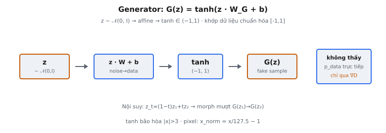

Generator là nửa sáng tạo của Generative Adversarial Network. Nó nhận một noise vector ngẫu nhiên và biến đổi thành mẫu dữ liệu tổng hợp không phân biệt được với dữ liệu thật. Trong Goodfellow et al. (2014), generator là hàm khả vi $G(z; \theta_g)$ được huấn luyện để đánh lừa discriminator đi kèm.

## Nó là gì

Một GAN generator ánh xạ không gian noise chiều thấp sang không gian dữ liệu chiều cao. Bạn đưa vào một vectơ ngẫu nhiên $z$, và nó xuất ra mẫu tổng hợp $G(z)$ trong cùng không gian với dữ liệu huấn luyện. Generator không bao giờ thấy dữ liệu thật trực tiếp; nó nhận tín hiệu huấn luyện hoàn toàn qua gradient của discriminator.

Trong phiên bản đơn giản hóa được trình bày ở đây, generator gồm một lớp tuyến tính duy nhất theo sau bởi tanh:

* **Đầu vào:** Noise vector $z$ có shape $(noise\_dim,)$ được lấy mẫu từ Gaussian chuẩn $\mathcal{N}(0, I)$.
* **Biến đổi:** Chiếu tuyến tính $z \cdot W + b$ với $W$ có shape $(noise\_dim, output\_dim)$ và $b$ khởi tạo bằng 0 với shape $(output\_dim,)$.
* **Đầu ra:** Hàm kích hoạt tanh áp dụng element-wise, tạo giá trị nằm trong $[-1, 1]$.

Kiến trúc này cố ý tối giản. Nó tách riêng khái niệm cốt lõi: ánh xạ noise sang dữ liệu qua biến đổi tuyến tính đã học với phi tuyến bị giới hạn.

::: {#fig-gan-generator fig-cap="Generator: $G(z)=\\tanh(zW_G+b)$, $z\\sim\\mathcal{N}(0,I)$, đầu ra $\\in(-1,1)$. Không thấy $p_{\\mathrm{data}}$ trực tiếp — chỉ học qua $\\nabla D$." fig-alt="z qua affine và tanh ra G(z)."}
{fig-align="center"}
:::

## Các phương trình chính

Hàm generator được định nghĩa như sau:

$$
G(z) = \tanh(z \cdot W + b)
$$

trong đó các thành phần là:

* **Lấy mẫu noise:** $z \sim \mathcal{N}(0, I)$ nghĩa là mỗi thành phần được rút độc lập từ phân phối chuẩn (mean 0, variance 1).
* **Chiếu tuyến tính:** $z \cdot W + b$ nhân $z$ có shape $(1, noise\_dim)$ với $W$ có shape $(noise\_dim, output\_dim)$ và cộng bias $b$.
* **Hàm kích hoạt tanh:** Áp dụng element-wise lên từng thành phần của đầu ra tuyến tính.

Hàm tanh được định nghĩa là:

$$
\tanh(x) = \frac{e^x - e^{-x}}{e^x + e^{-x}}
$$

Cũng có thể viết theo hàm sigmoid $\sigma(x) = \frac{1}{1+e^{-x}}$:

$$
\tanh(x) = 2\sigma(2x) - 1
$$

Các tính chất chính của tanh liên quan đến generator:

* **Miền giá trị:** Đầu ra nghiêm ngặt nằm trong $(-1, 1)$, tiệm cận $\pm 1$.
* **Tâm tại 0:** $\tanh(0) = 0$, và hàm đối xứng quanh gốc tọa độ.
* **Đạo hàm:** $\frac{d}{dx}\tanh(x) = 1 - \tanh^2(x)$. Đạt cực đại tại $x=0$ (bằng 1), tiệm cận 0 khi $|x|$ tăng.
* **Bão hòa:** Với $|x| > 3$, đầu ra gần $\pm 1$ và gradient gần bằng 0.

## Không gian noise

Noise vector $z$ là nguồn ngẫu nhiên duy nhất của generator. Mỗi $z$ duy nhất tạo ra đầu ra $G(z)$ duy nhất, nên không gian noise xác định toàn bộ tập mẫu mà generator có thể tạo.

### Tại sao dùng Gaussian noise

Gaussian chuẩn $\mathcal{N}(0, I)$ được chọn vì nhiều lý do thực tiễn:

* **Hỗ trợ không giới hạn:** Gaussian noise có thể nhận mọi giá trị thực, cho generator truy cập toàn bộ miền đầu vào của lớp tuyến tính.
* **Đối xứng quay:** Gaussian đẳng hướng có mật độ bằng nhau theo mọi hướng từ gốc. Không có hướng nào trong không gian noise được ưu tiên trước khi huấn luyện.
* **Tập trung đo lường:** Ở chiều cao, mẫu Gaussian tập trung trên một lớp mỏng bán kính $\approx \sqrt{d}$, cung cấp đầu vào có cấu trúc tốt.
* **Reparameterization:** Gaussian noise tái tham số hóa tầm thường qua $z = \mu + L\epsilon$ với $\epsilon \sim \mathcal{N}(0, I)$, giữ gradient chảy.

### Các vectơ $z$ khác nhau tạo ra gì

Trước khi huấn luyện, các vectơ $z$ khác nhau tạo ra đầu ra ngẫu nhiên, vô nghĩa vì $W$ được khởi tạo ngẫu nhiên. Sau khi huấn luyện, generator tổ chức không gian noise sao cho:

* **Các $z$ gần nhau tạo ra đầu ra tương tự.** $G$ liên tục (cả lớp tuyến tính và tanh đều liên tục), nên thay đổi nhỏ ở $z$ cho thay đổi nhỏ ở $G(z)$.
* **Nội suy tuyến tính tạo chuyển tiếp mượt.** Đi dọc theo $z_t = (1-t)z_1 + tz_2$ sinh chuỗi morphing mượt giữa $G(z_1)$ và $G(z_2)$.
* **Các hướng mã hóa biến thiên có nghĩa.** Trong generator huấn luyện tốt, các hướng cụ thể tương ứng thuộc tính ngữ nghĩa như độ sáng hoặc hình dạng.

Chiều noise $d$ đóng vai trò nút thắt cổ chai. Quá nhỏ thì generator không biểu diễn đủ biến thiên. Quá lớn thì nhiều chiều trở nên dư thừa. Lựa chọn phổ biến từ 64 đến 512.

## Tại sao dùng tanh

Lựa chọn tanh làm hàm kích hoạt đầu ra của generator có chủ đích và liên kết với cách tiền xử lý dữ liệu cho huấn luyện GAN.

### Giới hạn đầu ra trong $[-1, 1]$

Không có hàm kích hoạt đầu ra, $z \cdot W + b$ có thể tạo mọi giá trị thực. Dữ liệu thật nằm trong miền giới hạn, nên tanh buộc mọi đầu ra vào $(-1, 1)$, khớp với dữ liệu đã tiền xử lý.

### Quy ước chuẩn hóa pixel

Giá trị pixel thô trong $[0, 255]$ được chuẩn hóa về $[-1, 1]$ qua $x_{norm} = \frac{x}{127.5} - 1$. Miền đầu ra của tanh khớp quy ước này. Để chuyển ngược: $x_{pixel} = (G(z) + 1) \times 127.5$.

### So sánh với không dùng hàm kích hoạt

Bỏ tanh hoàn toàn khiến đầu ra generator không giới hạn, tạo ra ba vấn đề:

* **Lệch phân phối:** Dữ liệu thật trong $[-1, 1]$ so với đầu ra generator không giới hạn cho discriminator tín hiệu tầm thường. Nó có thể loại mọi mẫu ngoài $[-1, 1]$ mà không cần học phân phối dữ liệu.
* **Bất ổn huấn luyện:** Đầu ra không giới hạn có thể phát triển tùy ý, gây tràn số và gradient bùng nổ.
* **Không có regularization ngầm:** Bão hòa của tanh cung cấp ràng buộc mềm ngăn đầu ra trôi dạt.

Sigmoid ánh xạ về $(0, 1)$ và hoạt động với dữ liệu chuẩn hóa $[0, 1]$, nhưng tanh được ưu tiên vì đầu ra tâm tại 0 tạo gradient có điều kiện tốt hơn cho discriminator.

## Bối cảnh bài báo

Khái niệm generator xuất phát từ "Generative Adversarial Nets" của Goodfellow et al., xuất bản tại NeurIPS 2014.

### Trò chơi minimax

GAN khung mô hình sinh như trò chơi hai người chơi. Generator $G$ cố tạo mẫu thực tế. Discriminator $D$ cố phân biệt thật với mẫu do generator tạo. Mục tiêu là:

$$
\min_G \max_D \; \mathbb{E}_{x \sim p_{data}}[\log D(x)] + \mathbb{E}_{z \sim p_z}[\log(1 - D(G(z)))]
$$

Từ góc nhìn generator:

* **$D(G(z))$** là ước lượng xác suất của discriminator rằng $G(z)$ là thật. Generator muốn giá trị này gần 1.
* **$\log(1 - D(G(z)))$** là mất mát của generator. Khi $D(G(z)) \to 1$ (bị đánh lừa), giá trị này tiệm cận $-\infty$. Khi $D(G(z)) \to 0$ (bị phát hiện), nó tiệm cận 0.
* **Generator tối thiểu hóa** biểu thức này bằng cách làm $D(G(z))$ càng lớn càng tốt.

### Tín hiệu huấn luyện từ discriminator

Generator không bao giờ thấy dữ liệu thật trực tiếp. Tín hiệu học đến từ lan truyền ngược qua $D$: $G$ tạo $G(z)$, đưa vào $D$, và gradient mất mát của $D$ chảy ngược qua $D$ vào $G$. Cách học gián tiếp này là đặc trưng của GAN, khác autoencoder (mất mát reconstruction) hay VAE (tối đa hóa ELBO).

### Sửa đổi huấn luyện thực tiễn

Goodfellow et al. lưu ý rằng $\log(1 - D(G(z)))$ cung cấp gradient yếu sớm trong huấn luyện khi $D(G(z)) \approx 0$. Họ đề xuất tối đa hóa $\log(D(G(z)))$ thay thế, với $\frac{d}{dx}\log(x)$ tại $x \approx 0$ lớn, cho tín hiệu học mạnh hơn mà không thay đổi điểm cân bằng.

## Ví dụ số

Theo dõi một lượt lan truyền xuôi cụ thể với $noise\_dim = 3$ và $output\_dim = 4$.

### Thiết lập

Noise vector (lấy mẫu từ $\mathcal{N}(0, I)$):

$$
z = [0.5, -1.2, 0.8]
$$

Ma trận trọng số $W$ có shape $(3, 4)$:

$$
W = \begin{bmatrix} 0.3 & -0.5 & 0.7 & 0.1 \\ -0.4 & 0.6 & -0.2 & 0.8 \\ 0.1 & -0.3 & 0.5 & -0.6 \end{bmatrix}
$$

Bias $b = [0, 0, 0, 0]$ (khởi tạo bằng 0).

### Bước 1: Chiếu tuyến tính

Tính $z \cdot W$ bằng tích vô hướng của $z$ với từng cột của $W$:

**Cột 0:** $(0.5)(0.3) + (-1.2)(-0.4) + (0.8)(0.1) = 0.15 + 0.48 + 0.08 = 0.71$

**Cột 1:** $(0.5)(-0.5) + (-1.2)(0.6) + (0.8)(-0.3) = -0.25 - 0.72 - 0.24 = -1.21$

**Cột 2:** $(0.5)(0.7) + (-1.2)(-0.2) + (0.8)(0.5) = 0.35 + 0.24 + 0.40 = 0.99$

**Cột 3:** $(0.5)(0.1) + (-1.2)(0.8) + (0.8)(-0.6) = 0.05 - 0.96 - 0.48 = -1.39$

$$
z \cdot W + b = [0.71, -1.21, 0.99, -1.39]
$$

### Bước 2: Áp dụng tanh element-wise

**Phần tử 0:** $\tanh(0.71) = \frac{e^{0.71} - e^{-0.71}}{e^{0.71} + e^{-0.71}} = \frac{2.034 - 0.492}{2.034 + 0.492} = \frac{1.542}{2.526} = 0.6104$

**Phần tử 1:** $\tanh(-1.21) = -\tanh(1.21) = -\frac{3.353 - 0.298}{3.353 + 0.298} = -\frac{3.055}{3.651} = -0.8368$

**Phần tử 2:** $\tanh(0.99) = \frac{2.691 - 0.372}{2.691 + 0.372} = \frac{2.319}{3.063} = 0.7571$

**Phần tử 3:** $\tanh(-1.39) = -\tanh(1.39) = -\frac{4.015 - 0.249}{4.015 + 0.249} = -\frac{3.766}{4.264} = -0.8832$

### Đầu ra cuối cùng

$$
G(z) = [0.6104, -0.8368, 0.7571, -0.8832]
$$

Mọi giá trị nằm trong $(-1, 1)$. Lưu ý pre-activation có độ lớn vừa phải ($\pm 0.71$ đến $\pm 1.39$) đã tạo đầu ra khá gần biên tanh. Điều này minh họa cách tanh nén miền giá trị mạnh ngoài $\pm 1$.

## Tiến hóa kiến trúc generator

Generator một lớp trong phiên bản đơn giản hóa này là kiến trúc đơn giản nhất có thể. Lĩnh vực đã phát triển qua nhiều đổi mới lớn.

### Generator tuyến tính (2014)

Bài báo GAN gốc dùng multilayer perceptron với lớp ẩn ReLU và đầu ra tanh. Các generator fully connected này có thể tạo mẫu đơn giản (chữ số MNIST) nhưng gặp khó với dữ liệu có cấu trúc vì thiếu inductive bias không gian. Mọi pixel đầu ra phụ thuộc mọi thành phần noise qua kết nối dày đặc.

### DCGAN và transposed convolution (2015)

Radford, Metz, và Chintala giới thiệu DCGAN, thay lớp dense bằng transposed convolution. Các hướng dẫn chính:

* **Transposed convolution** để upsampling, bắt đầu từ feature map không gian nhỏ và dần upsampling đến độ phân giải mục tiêu.
* **Batch normalization** trong cả hai mạng để ổn định huấn luyện.
* **ReLU ở lớp ẩn, tanh ở đầu ra.** Điều này trở thành quy ước chuẩn.

DCGAN cho phép sinh ảnh 64x64 và cho thấy không gian latent hỗ trợ phép toán (ví dụ "man with glasses" trừ "man" cộng "woman" cho "woman with glasses").

### StyleGAN (2018–2020)

Karras et al. giới thiệu mạng mapping biến đổi $z$ thành không gian latent trung gian $w$, rồi tiêm $w$ qua adaptive instance normalization ở mỗi mức độ phân giải. StyleGAN2 thay AdaIN bằng weight demodulation để cải thiện chất lượng. Các kiến trúc này đạt sinh khuôn mặt photorealistic ở 1024x1024.

### Diffusion model thay thế GAN (2020–nay)

Denoising diffusion model phần lớn đã vượt GAN trong sinh ảnh. Thay vì ánh xạ trực tiếp noise sang dữ liệu, chúng học denoising lặp qua nhiều bước. Chúng tránh bất ổn huấn luyện adversarial, tạo mẫu đa dạng hơn, và đạt phủ phân phối tốt hơn. Đánh đổi là tốc độ suy luận: diffusion cần nhiều bước denoising trong khi GAN generator tạo mẫu trong một lượt lan truyền xuôi.

## Các lỗi thường gặp

### Mode collapse

Lỗi GAN phổ biến nhất. Generator ánh xạ mọi noise vector sang tập đầu ra nhỏ đánh lừa được $D$, bỏ qua phần còn lại của phân phối dữ liệu. Mục tiêu minimax không thưởng đa dạng tường minh, nên nếu vài mẫu nguyên mẫu liên tục đánh lừa $D$, không có áp lực khám phá thêm.

Dấu hiệu: mẫu sinh gần như giống hệt, phương sai thấp trên các đầu vào $z$, mất mát $D$ dao động. Giảm thiểu gồm minibatch discrimination, unrolled optimization, và công thức Wasserstein GAN.

### Gradient biến mất khi $D$ quá mạnh

Nếu $D$ trở nên quá mạnh, nó phân loại mọi fake với độ tin cậy cao: $D(G(z)) \approx 0$. Khi đó $\log(1 - D(G(z))) \approx 0$ cung cấp gradient gần bằng 0, và $G$ ngừng học. Tỷ lệ bước discriminator so với generator quan trọng: quá nhiều bước $D$ mỗi bước $G$ tạo mất cân bằng này. Phương án thay thế $\log(D(G(z)))$ giúp nhưng có thể gây bất ổn do độ lớn gradient không giới hạn.

### Khởi tạo trọng số sai

Nếu $W$ quá lớn, pre-activation đẩy tanh vào vùng bão hòa nơi gradient biến mất. Nếu quá nhỏ, mọi đầu ra tụ về gần 0 ($\tanh(x) \approx x$ với $x$ nhỏ) và generator bỏ qua $z$. Khởi tạo Xavier/Glorot đặt $W_{ij} \sim \mathcal{N}(0, \frac{2}{fan\_in + fan\_out})$, giữ phương sai pre-activation ổn định.

### Quên rằng tanh giới hạn đầu ra

Nếu dữ liệu thật trong $[0, 255]$ hoặc $[0, 1]$ nhưng $G$ xuất $(-1, 1)$, $D$ phân biệt thật và fake một cách tầm thường chỉ bằng cách kiểm tra miền giá trị. Luôn khớp chuẩn hóa với hàm kích hoạt đầu ra: tanh với $[-1, 1]$, sigmoid với $[0, 1]$. Tương tự, đảo chuẩn hóa khi hiển thị mẫu sinh, nếu không ảnh sẽ trông nhạt dù $G$ hoạt động tốt.


## Code
```python
import numpy as np

def generator(z, W, b):
    z = np.array(z, dtype=float)
    W = np.array(W, dtype=float)
    b = np.array(b, dtype=float)
    out = np.tanh(np.dot(z, W) + b)
    return [[round(float(v), 4) for v in row] for row in out]

```
