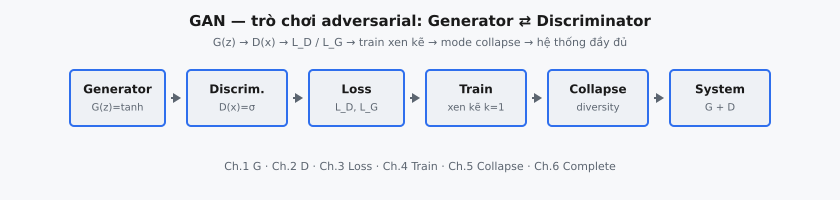

Generative Adversarial Networks (GAN) là mô hình sinh ngầm được huấn luyện qua trò chơi hai người chơi giữa generator và discriminator. Generator ánh xạ noise ngẫu nhiên sang mẫu tổng hợp, trong khi discriminator học phân biệt dữ liệu thật với dữ liệu do generator tạo. Huấn luyện cải thiện cả hai bên đồng thời thông qua phản hồi adversarial.

::: {#fig-gan-pipeline fig-cap="Pipeline GAN: Generator $G(z)$ → Discriminator $D(x)$ → loss $L_D,L_G$ → train xen kẽ → mode collapse → hệ thống đầy đủ." fig-alt="Sơ đồ khối ngang từ Generator tới Complete system."}
{fig-align="center"}
:::

Ý tưởng trung tâm là khớp phân phối mà không ước lượng likelihood tường minh. Thay vì trực tiếp tối đa hóa mô hình xác suất khả giải, GAN học tạo mẫu không phân biệt được với dữ liệu thật dưới một critic đã học. Điều này thường cho đầu ra sắc nét, trung thực cao, nhưng đồng thời gây bất ổn tối ưu hóa và rủi ro mode collapse.

## Phần này bao gồm những gì

Chuỗi chương này tách hệ thống GAN thành các thành phần có thể huấn luyện:

1. Kiến trúc generator và ánh xạ latent sang dữ liệu.
2. Kiến trúc discriminator và chấm điểm real/fake.
3. Hàm mất mát adversarial và các biến thể mục tiêu.
4. Động lực vòng lặp huấn luyện và lịch tối ưu hóa.
5. Phát hiện mode collapse và chẩn đoán thực tiễn.
6. Lắp ráp hệ thống GAN hoàn chỉnh.

Thứ tự kết nối cấu trúc mô hình với hành vi huấn luyện theo lý thuyết trò chơi.

## Tại sao GAN vẫn quan trọng

GAN vẫn quan trọng trong giáo dục và ứng dụng mô hình sinh:

* chúng tiên phong sinh mẫu neural chất lượng cao,
* chúng làm nổi bật thách thức tối ưu hóa đặc trưng của học adversarial,
* và chúng truyền cảm hứng cho nhiều khung sau này (conditional GAN, style-based generator, các lựa chọn thay thế diffusion).

Hiểu GAN tạo tương phản quan trọng với các phương pháp sinh dựa trên likelihood và diffusion.

## Kiến thức tiên quyết

* Vòng lặp huấn luyện mạng neural và tối ưu hóa dựa trên gradient.
* Hàm mất mát phân loại nhị phân (logistic hoặc kiểu BCE).
* Lấy mẫu biến latent từ prior đơn giản (ví dụ noise Gaussian).
* Trực giác cơ bản về khớp phân phối.

## Ký hiệu được sử dụng trong phần này

$$
\begin{aligned}
z &:\ \text{vectơ noise latent ngẫu nhiên}, \\
G(z) &:\ \text{đầu ra của generator}, \\
D(x) &:\ \text{điểm discriminator cho mẫu } x, \\
p_{\mathrm{data}} &:\ \text{phân phối dữ liệu thật}, \\
p_z &:\ \text{phân phối prior latent}.
\end{aligned}
$$
