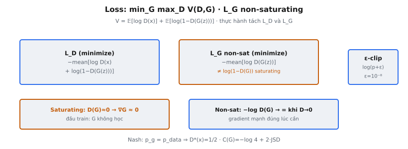

Generative Adversarial Networks đặt hai mạng đối đầu nhau: generator G tổng hợp dữ liệu giả và discriminator D cố phân biệt thật với giả. Các hàm loss thúc đẩy huấn luyện adversarial này là cơ chế cốt lõi của GAN. Hiểu cách $L_D$ và $L_G$ được xây dựng, vì sao generator loss dạng non-saturating được ưa dùng, và nơi bất ổn định số xuất hiện là điều cần thiết để triển khai GAN đúng. Lý thuyết này bám Goodfellow et al. (2014) — bài báo giới thiệu khung GAN.

## Nó là gì

Hàm loss GAN định nghĩa mục tiêu adversarial thúc đẩy huấn luyện GAN. Discriminator $D(x)$ xuất xác suất input $x$ là thật (từ dữ liệu huấn luyện) hay giả (do generator sinh ra). Generator $G(z)$ nhận nhiễu ngẫu nhiên $z$ và tạo mẫu tổng hợp. Hai mạng được huấn luyện với mục tiêu cạnh tranh: D muốn phân loại đúng thật/giả, còn G muốn đánh lừa D coi mẫu giả là thật.

Thiết lập adversarial nghĩa là không mạng nào có target cố định. Target của discriminator phụ thuộc generator hiện tại; target của generator phụ thuộc discriminator hiện tại. Huấn luyện xen kẽ cập nhật D và G, mỗi bên dùng hàm loss riêng. Các hàm loss mã hóa "thắng" nghĩa là gì cho từng người chơi trong trò chơi hai người này.

Mục tiêu adversarial là điều khiến GAN khác căn bản các mô hình sinh khác như VAE. Không có ước lượng mật độ tường minh hay reconstruction loss. Chất lượng mẫu sinh ra chỉ nảy sinh từ động lực cạnh tranh giữa hai mạng.

::: {#fig-gan-loss fig-cap="Loss: $L_D=-\\mathrm{mean}[\\log D(x)+\\log(1-D(G(z)))]$; $L_G=-\\mathrm{mean}[\\log D(G(z))]$ (non-saturating). Saturating $\\log(1-D(G))$ cho $\\nabla G\\approx 0$ đầu train." fig-alt="Hai thẻ L_D và L_G với so sánh saturating."}
{fig-align="center"}
:::

## Các phương trình chính

Hàm giá trị minimax đầy đủ từ Goodfellow et al. (2014):

$$
\min_G \max_D V(G, D) = \mathbb{E}_{x \sim p_{\text{data}}}[\log D(x)] + \mathbb{E}_{z \sim p_z}[\log(1 - D(G(z)))]
$$

Một phương trình này mã hóa toàn bộ trò chơi adversarial. D maximize $V$, G minimize $V$. Trong thực hành, ta tách thành hai loss riêng.

**Discriminator loss:**

$$
L_D = -\frac{1}{m}\sum_{i=1}^{m}\left[\log D(x^{(i)}) + \log(1 - D(G(z^{(i)})))\right]
$$

Dấu âm chuyển maximize thành minimize (vì optimizer minimize). Hai số hạng thưởng D khi gán xác suất cao cho mẫu thật và thấp cho mẫu giả.

**Generator loss (dạng non-saturating):**

$$
L_G = -\frac{1}{m}\sum_{i=1}^{m}\log D(G(z^{(i)}))
$$

Thay vì minimize $\log(1 - D(G(z)))$ từ hàm giá trị gốc, dạng non-saturating maximize $\log D(G(z))$. Đây là công thức dùng trong thực hành và là dạng triển khai phổ biến nhất.

## Trò chơi minimax

Mục tiêu GAN là trò chơi minimax hai người từ lý thuyết trò chơi. Discriminator là người chơi maximize: muốn $V(G, D)$ càng lớn càng tốt. Generator là người chơi minimize: muốn $V(G, D)$ càng nhỏ càng tốt. Đây là trò chơi zero-sum vì mọi lợi của D là thiệt của G và ngược lại.

Khái niệm nghiệm từ lý thuyết trò chơi là Nash equilibrium: cặp $(G^*, D^*)$ mà không người chơi nào cải thiện được bằng cách đổi chiến lược một mình. Goodfellow et al. chứng minh equilibrium này tồn tại và xảy ra khi $p_g = p_{\text{data}}$, nghĩa generator sao chép hoàn hảo phân phối dữ liệu thật. Khi đó discriminator tối ưu xuất $D^*(x) = 1/2$ với mọi $x$, vì thật và giả không phân biệt được.

Trong thực hành, huấn luyện xen kẽ: $k$ bước cập nhật discriminator (thường $k=1$), rồi một bước cập nhật generator. Tối ưu xen kẽ này xấp xỉ trò chơi đồng thời lý thuyết. Discriminator phải dẫn trước generator đủ để cung cấp gradient hữu ích, nhưng không quá xa khiến generator nhận gradient suy biến.

## Tại sao dùng generator loss non-saturating

Công thức minimax gốc nói G nên minimize $\log(1 - D(G(z)))$. Vấn đề là gradient saturation. Đầu huấn luyện, generator tạo mẫu giả rõ ràng, nên D tự tin xuất giá trị gần 0 cho dữ liệu giả. Khi $D(G(z)) \approx 0$:

**Dạng saturating (gốc):** $\log(1 - D(G(z))) \approx \log(1) = 0$. Gradient theo $G$ gần như zero. Generator hầu như không nhận tín hiệu học đúng lúc cần nhất.

**Dạng non-saturating:** $-\log(D(G(z))) \approx -\log(0) \to +\infty$. Gradient lớn và hướng hữu ích. Generator nhận gradient mạnh thúc đẩy tạo mẫu tốt hơn.

Goodfellow et al. khuyến nghị rõ trong Mục 3: "Rather than training G to minimize $\log(1 - D(G(z)))$ we can train G to maximize $\log D(G(z))$. This objective function results in the same fixed point of the dynamics of G and D but provides much stronger gradients early in learning."

Hai dạng chia sẻ cùng fixed point: generator tối ưu khiến $D(G(z)) = 1/2$, lúc đó cả hai dạng cho gradient xác định, khác zero. Khác biệt chỉ ở động lực huấn luyện sớm, nhưng khác biệt đó quyết định thực hành.

## Loss của discriminator

Discriminator loss có hai số hạng, mỗi số hạng một vai trò:

**Số hạng 1: $-\log D(x)$ cho mẫu thật.** Phạt D khi gán xác suất thấp cho dữ liệu thật. Khi D nhận diện đúng mẫu thật với $D(x) \approx 1$, loss là $-\log(1) \approx 0$. Khi D nhầm $D(x) \approx 0$, loss là $-\log(0) \to \infty$. Số hạng này huấn luyện D nhận dữ liệu thật.

**Số hạng 2: $-\log(1 - D(G(z)))$ cho mẫu giả.** Phạt D khi gán xác suất cao cho dữ liệu sinh ra. Khi D từ chối đúng mẫu giả với $D(G(z)) \approx 0$, loss là $-\log(1) \approx 0$. Khi D bị đánh lừa với $D(G(z)) \approx 1$, loss là $-\log(0) \to \infty$. Số hạng này huấn luyện D từ chối mẫu giả.

Cả hai số hạng đều cần. Không có số hạng thật, D có thể minimize bằng cách xuất 0 cho mọi thứ. Không có số hạng giả, D có thể minimize bằng cách xuất 1 cho mọi thứ. Cùng nhau, chúng buộc D học ranh giới quyết định giữa thật và giả. Discriminator loss về bản chất là binary cross-entropy (BCE) với nhãn 1 cho thật và 0 cho giả.

## Ổn định số

Logarit không xác định tại 0 và tiến tới $-\infty$. Trong huấn luyện GAN, đối số của $\log$ là xác suất đầu ra discriminator có thể về mặt số chạm đúng 0.0 hoặc 1.0 do giới hạn floating-point.

**Nơi vấn đề xảy ra:**

- $\log D(x)$: nếu $D(x) = 0$ (discriminator hoàn toàn sai trên mẫu thật).
- $\log(1 - D(G(z)))$: nếu $D(G(z)) = 1$ (discriminator bị đánh lừa hoàn toàn).
- $\log D(G(z))$: nếu $D(G(z)) = 0$ (discriminator từ chối hoàn toàn mẫu giả, dùng trong generator loss).

**Cách sửa: epsilon clipping.** Trước khi lấy logarit, clamp đối số tối thiểu $\epsilon = 10^{-8}$: `torch.log(prob + epsilon)`. Điều này giới hạn loss ở $-\log(10^{-8}) \approx 18.42$ thay vì vô cùng.

**Vì sao xác suất chạm cực trị:** Sigmoid $\sigma(x) = 1/(1+e^{-x})$ bão hòa khi $|x|$ lớn. Logit $+40$ cho đầu ra sigmoid $1 - 4.25 \times 10^{-18}$, làm tròn thành 1.0 trong float32. Logit $-40$ làm tròn thành 0.0. Điều này xảy ra thường xuyên khi D rất tự tin — phổ biến đầu huấn luyện.

## Bối cảnh bài báo

Goodfellow et al. (2014), "Generative Adversarial Nets," thiết lập nền tảng lý thuyết cho huấn luyện adversarial. Các kết quả chính:

**Proposition 1:** Với generator G cố định, discriminator tối ưu là:

$$
D^*_G(x) = \frac{p_{\text{data}}(x)}{p_{\text{data}}(x) + p_g(x)}
$$

Discriminator tối ưu xuất tỉ lệ mật độ dữ liệu thật trên tổng mật độ. Khi $p_g = p_{\text{data}}$, ta có $D^*(x) = 1/2$ mọi nơi.

**Proposition 2 (Theorem 1):** Minimum toàn cục của $C(G) = \max_D V(G, D)$ đạt được khi và chỉ khi $p_g = p_{\text{data}}$, với $C(G) = -\log 4$. Chứng minh cho thấy $C(G) = -\log 4 + 2 \cdot \text{JSD}(p_{\text{data}} \| p_g)$, minimized khi hai phân phối khớp nhau.

Bài báo nêu: "G and D play a two-player minimax game with value function $V(G,D) = \mathbb{E}[\log D(x)] + \mathbb{E}[\log(1 - D(G(z)))]$." Hàm giá trị này là trái tim khung GAN; các hàm loss ta triển khai là phân rã thực hành của nó.

## Ví dụ số

Xét mini-batch kích thước $m = 4$ với $\epsilon = 10^{-8}$.

**Kịch bản: Discriminator khá tốt (đã huấn luyện một phần)**

Mẫu thật: $D(x^{(1)}) = 0.9$, $D(x^{(2)}) = 0.8$, $D(x^{(3)}) = 0.7$, $D(x^{(4)}) = 0.85$

Mẫu giả: $D(G(z^{(1)})) = 0.3$, $D(G(z^{(2)})) = 0.2$, $D(G(z^{(3)})) = 0.4$, $D(G(z^{(4)})) = 0.15$

**Tính $L_D$:**

Số hạng thật: $\log(0.9) + \log(0.8) + \log(0.7) + \log(0.85) = -0.1054 + (-0.2231) + (-0.3567) + (-0.1625) = -0.8477$

Số hạng giả: $\log(0.7) + \log(0.8) + \log(0.6) + \log(0.85) = -0.3567 + (-0.2231) + (-0.5108) + (-0.1625) = -1.2531$

$$
L_D = -\frac{1}{4}[(-0.8477) + (-1.2531)] = -\frac{1}{4}(-2.1008) = 0.5252
$$

**Tính $L_G$ (non-saturating):**

$\log(0.3) + \log(0.2) + \log(0.4) + \log(0.15) = -1.2040 + (-1.6094) + (-0.9163) + (-1.8971) = -5.6268$

$$
L_G = -\frac{1}{4}(-5.6268) = 1.4067
$$

**Diễn giải:** $L_D = 0.5252$ vừa phải — D làm việc hợp lý. $L_G = 1.4067$ cao — D từ chối hầu hết mẫu giả, nên G còn chỗ cải thiện.

**Kịch bản: Discriminator hoàn hảo (không epsilon clipping)**

Nếu $D(x) = 1.0$ cho mọi mẫu thật và $D(G(z)) = 0.0$ cho mọi mẫu giả: $\log(0) = -\infty$. Với $\epsilon = 10^{-8}$: $\log(10^{-8}) = -18.42$, cho $L_G = 18.42$ — lớn nhưng hữu hạn. Đó là lý do epsilon clipping cần thiết.

**Kịch bản: Equilibrium tối ưu**

Khi $D^*(x) = 0.5$ mọi nơi: $L_D = -[\log(0.5) + \log(0.5)] = 1.3863 = \log 4$. Và $L_G = -\log(0.5) = 0.6931 = \log 2$. Đây là giá trị loss tại Nash equilibrium.

## Các biến thể loss

Loss GAN gốc có bất ổn định huấn luyện đã biết. Một số thay thế đã được đề xuất:

### Wasserstein Loss (WGAN)

Arjovsky et al. (2017) thay JS divergence bằng Wasserstein-1 distance. Critic xuất số thực không ràng buộc: $L_D = -\mathbb{E}[D(x)] + \mathbb{E}[D(G(z))]$, $L_G = -\mathbb{E}[D(G(z))]$. Không logarit, không sigmoid, không saturation. Cần weight clipping hoặc gradient penalty (WGAN-GP) để ép ràng buộc Lipschitz.

### Hinge Loss

Dùng trong SNGAN (Miyato et al., 2018) và BigGAN (Brock et al., 2019): $L_D = -\mathbb{E}[\min(0, -1 + D(x))] - \mathbb{E}[\min(0, -1 - D(G(z)))]$, $L_G = -\mathbb{E}[D(G(z))]$. D ngừng được thưởng khi đủ tự tin (margin 1), tránh quá mạnh.

### Least-Squares GAN (LSGAN)

Mao et al. (2017) dùng squared error: $L_D = \mathbb{E}[(D(x) - 1)^2] + \mathbb{E}[D(G(z))^2]$, $L_G = \mathbb{E}[(D(G(z)) - 1)^2]$. Minimize Pearson $\chi^2$ divergence. Cung cấp gradient không suy biến cho mẫu xa ranh giới quyết định.

### Relativistic GAN (RaGAN)

Jolicoeur-Martineau (2019) đề xuất D nên ước lượng xác suất dữ liệu thật thực tế hơn mẫu giả: $\tilde{D}(x, G(z)) = \sigma(C(x) - C(G(z)))$. Cả thật và giả đều đóng góp vào cả hai bước cập nhật, cải thiện ổn định.

## Các lỗi thường gặp

### Dùng generator loss saturating

Triển khai $L_G = \log(1 - D(G(z)))$ thay vì $L_G = -\log(D(G(z)))$ là lỗi GAN phổ biến nhất. Dạng saturating tạo gradient suy biến đầu huấn luyện khi D dễ từ chối đầu ra của G. Huấn luyện có vẻ tiến triển nhưng G hầu như không cải thiện. Luôn dùng dạng non-saturating.

### Quên epsilon clipping

Không có `epsilon = 1e-8` trước log, huấn luyện sinh loss NaN ngay khi D xuất xác suất gần 0 hoặc 1. Có thể xảy ra trong vài trăm iteration đầu. Cả discriminator loss và generator loss đều cần bảo vệ này.

### Sai quy ước dấu

Hàm giá trị $V(G,D)$ được D maximize, nhưng optimizer minimize. Quên dấu âm trong $L_D = -V$ khiến D tệ dần theo thời gian. Tương tự, generator loss non-saturating cần dấu âm: $L_G = -\log D(G(z))$, không phải $+\log D(G(z))$. Sai dấu ở bất kỳ bên nào khiến mạng tối ưu sai hướng.

### Tính generator loss với discriminator bị detach

Khi tính $L_G$, gradient phải chảy qua D về G. Nếu computation graph của D bị detach (ví dụ `D(fake.detach())` hoặc `torch.no_grad()` trên forward pass của D trong bước cập nhật G), không gradient nào tới G. Mẫu đúng: sinh mẫu giả, đưa qua D không detach, tính $L_G$, backpropagate. Detach đúng trong bước cập nhật D, nhưng sai trong bước cập nhật G.

### Không detach mẫu giả khi cập nhật discriminator

Ngược lại: khi tính $L_D$, mẫu giả nên tách khỏi graph của G (`D(fake.detach())`). Nếu không, backward pass của D tính gradient thừa cho G, lãng phí bộ nhớ. Nếu cả hai optimizer đều step, G nhận cập nhật không mong muốn làm bất ổn huấn luyện.


## Code
```python
import numpy as np

def discriminator_loss(real_probs, fake_probs):
    epsilon = 1e-8
    real_probs = np.clip(np.array(real_probs, dtype=float), epsilon, 1 - epsilon)
    fake_probs = np.clip(np.array(fake_probs, dtype=float), epsilon, 1 - epsilon)
    loss = -np.mean(np.log(real_probs) + np.log(1 - fake_probs))
    return round(float(loss), 4)

def generator_loss(fake_probs):
    epsilon = 1e-8
    fake_probs = np.clip(np.array(fake_probs, dtype=float), epsilon, 1 - epsilon)
    loss = -np.mean(np.log(fake_probs))
    return round(float(loss), 4)

```
