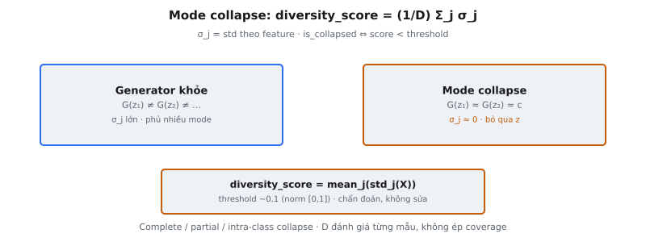

Mode collapse là một trong những failure mode phổ biến nhất trong GAN. Hiện tượng này xảy ra khi generator chỉ tạo ra một số ít biến thể mẫu, ánh xạ các vector noise khác nhau sang đầu ra gần như giống hệt nhau. Thay vì học toàn bộ phân phối dữ liệu, generator "sụp đổ" (collapse) vào một hoặc vài mode.

Cơ chế phát hiện mode collapse dựa trên diversity score: độ lệch chuẩn trung bình theo từng feature của các mẫu được sinh ra. Khi điểm này rơi xuống dưới một ngưỡng, generator được đánh dấu là đã collapse.

## Nó là gì

Phát hiện mode collapse đo mức đa dạng đầu ra để nhận biết generator thất bại. Một generator khỏe mạnh tạo ra các đầu ra đa dạng khi nhận các noise input khác nhau. Lấy 100 vector noise ngẫu nhiên $z_1, \ldots, z_{100}$ và các kết quả $G(z_1), \ldots, G(z_{100})$ tương ứng — chúng phải phủ phân phối dữ liệu. Với generator đã collapse, các đầu ra này tụ lại chặt quanh một hoặc vài điểm bất kể noise đầu vào.

Cơ chế phát hiện tính diversity score từ một batch sinh ra. Mỗi chiều feature được xem xét độc lập về mức biến thiên trong batch. Nếu generator đã collapse, mọi feature đều có phương sai gần bằng không. Diversity score gom biến thiên theo từng feature thành một số duy nhất, so sánh với ngưỡng để tạo tín hiệu boolean is_collapsed.

Đây là công cụ chẩn đoán, không phải mục tiêu huấn luyện. Nó cho biết generator đã thất bại hay chưa nhưng không tự sửa vấn đề. Hãy coi nó như máy báo khói cho GAN.

::: {#fig-gan-collapse fig-cap="Mode collapse: $\\mathrm{diversity\\_score}=(1/D)\\sum_j\\sigma_j$ (std theo feature). Khỏe: $G(z_i)$ đa dạng; collapse: $G(z)\\approx c$, $\\sigma_j\\approx 0$. Chẩn đoán, không sửa." fig-alt="Hai panel generator khỏe vs mode collapse và công thức diversity."}
{fig-align="center"}
:::

## Các phương trình chính

Cho $N$ mẫu sinh ra, mỗi mẫu có $D$ feature, xếp thành $X \in \mathbb{R}^{N \times D}$:

**Trung bình theo từng feature:**

$$
\mu_j = \frac{1}{N} \sum_{i=1}^{N} X_{i,j}
$$

**Độ lệch chuẩn theo từng feature:**

$$
\sigma_j = \sqrt{\frac{1}{N} \sum_{i=1}^{N} (X_{i,j} - \mu_j)^2}
$$

Đây là độ lệch chuẩn population (chia cho $N$, không phải $N-1$).

**Diversity score (trung bình các std theo feature):**

$$
\text{diversity\_score} = \frac{1}{D} \sum_{j=1}^{D} \sigma_j
$$

**Phát hiện collapse:**

$$
\text{is\_collapsed} = \begin{cases} \text{True} & \text{if } \text{diversity\_score} < \text{threshold} \\ \text{False} & \text{otherwise} \end{cases}
$$

Ngưỡng phụ thuộc miền dữ liệu. Với dữ liệu đã chuẩn hóa (feature trong $[0, 1]$), ngưỡng khoảng 0.1 là phổ biến. Với dữ liệu đã standardize, ngưỡng khoảng 0.5 có thể phù hợp.

## Mode Collapse trông như thế nào

**Mọi đầu ra gần như giống hệt dù noise input khác nhau.** Generator học cách bỏ qua $z$ và ánh xạ mọi thứ về gần cùng một đầu ra: $G(z_1) \approx G(z_2) \approx \cdots \approx G(z_N)$ với mọi vector noise. Generator trở thành hàm hằng số. Nếu sinh ảnh, mọi ảnh trông giống nhau. Nếu sinh dữ liệu dạng bảng, mỗi hàng có giá trị gần như trùng khớp.

**Generator bỏ qua $z$.** Một generator hoạt động tốt dùng noise làm nguồn ngẫu nhiên, ánh xạ các vùng latent khác nhau sang các vùng dữ liệu khác nhau. Generator đã collapse phát triển trọng số triệt tiêu ảnh hưởng của $z$. Các lớp ẩn tạo activation tương tự bất kể đầu vào, và nút thắt thông tin loại bỏ đa dạng thay vì mang nó qua.

**Mọi thứ ánh xạ vào một hoặc vài mode.** Phân phối thực là đa mode. Xét chữ số viết tay với 10 mode (chữ số 0–9). Generator collapse hoàn toàn có thể chỉ sinh "1" vì mode đơn lẻ đó tạm thời đánh lừa discriminator. Generator collapse một phần có thể chỉ sinh "1" và "7". Trong cả hai trường hợp, generator không nắm bắt được toàn bộ phân phối.

## Vì sao mode collapse xảy ra

Mode collapse phát sinh từ động lực huấn luyện adversarial giữa generator và discriminator:

* **Generator tìm một đầu ra đánh lừa được D.** Nếu generator khám phá một điểm luôn nhận điểm "real" cao, nó được khuyến khích ánh xạ mọi vector noise về đó. Từ góc nhìn của G, điều này đạt loss thấp mà không cần mô hình hóa toàn bộ phân phối.
* **Khai thác thay vì khám phá.** Generator có thể khám phá không gian dữ liệu để phủ mọi mode (rủi ro, chậm) hoặc khai thác một mode đã biết là tốt (an toàn, nhanh). Hạ gradient ưu tiên khai thác vì gradient chỉ về vùng "trông real" gần nhất, không về các mode chưa được phủ.
* **Discriminator không thể ép mode coverage.** D đánh giá từng mẫu riêng lẻ, không phải phân phối. Nó có thể phán xét một mẫu có trông real không nhưng không có cơ chế nói "bạn đang lặp lại chính mình." Phản hồi theo từng mẫu không thể diễn đạt ràng buộc phân phối.
* **Luân phiên thay vì hội tụ.** Trò chơi minimax có thể luân phiên: G collapse về mode A, D từ chối A, G chuyển sang mode B, D từ chối B, G quay lại. Generator phủ từng mode một, xoay vòng thay vì phủ đồng thời mọi mode.

## Các loại mode collapse

* **Complete collapse (một đầu ra duy nhất).** Generator ánh xạ mọi vector noise về một điểm: $G(z) = c$ với mọi $z$. Diversity score gần bằng không. Dễ phát hiện nhưng hiếm trong thực tế vì ngay cả discriminator yếu cũng có thể từ chối một mẫu lặp lại duy nhất. Thường báo hiệu lỗi huấn luyện.
* **Partial collapse (vài cụm).** Generator tạo mẫu từ $k$ mode với $k$ nhỏ hơn nhiều so với số thực. Với MNIST, có thể chỉ sinh chữ số 1, 4 và 7. Diversity score ở mức trung bình: cao hơn complete collapse nhờ biến thiên giữa các cụm nhưng thấp hơn generator khỏe mạnh. Đây là dạng phổ biến nhất.
* **Intra-class collapse (biến thiên hạn chế trong từng mode).** Generator phủ mọi mode chính nhưng với biến thiên tối thiểu trong mỗi mode. Với MNIST, cả 10 chữ số đều xuất hiện nhưng mỗi chữ số trông gần như giống hệt giữa các mẫu: cùng độ dày nét, độ nghiêng, vị trí. Diversity score có thể trông chấp nhận được vì biến thiên giữa các mode che giấu thiếu biến thiên trong mode. Dạng khó phát hiện nhất với metric đơn giản.

## Bối cảnh bài báo

Goodfellow et al. (2014) giới thiệu GAN với công thức minimax:

$$
\min_G \max_D \; \mathbb{E}_{x \sim p_{\text{data}}}[\log D(x)] + \mathbb{E}_{z \sim p_z}[\log(1 - D(G(z)))]
$$

Bài báo chứng minh mục tiêu này có optimum toàn cục khi $p_G = p_{\text{data}}$. Tuy nhiên, chứng minh giả định dung lượng vô hạn và tối ưu hoàn hảo. Trong thực tế, mạng nơ-ron hữu hạn có thể thiếu dung lượng biểu diễn $p_{\text{data}}$, và tối ưu dựa trên gradient có thể không tìm được optimum toàn cục. Mode collapse là hệ quả trực tiếp của khoảng cách giữa lý thuyết và thực hành.

Bài báo thừa nhận huấn luyện đòi hỏi cân bằng cẩn thận giữa các bước cập nhật G và D. Khi D quá mạnh, G nhận gradient suy biến. Khi D quá yếu, G nhận gradient nhiễu. Cả hai kịch bản đều có thể kích hoạt hoặc làm trầm trọng mode collapse.

Các công trình sau nhắm vào mode collapse gồm minibatch discrimination (Salimans et al., 2016), unrolled GANs (Metz et al., 2017), Wasserstein GANs (Arjovsky et al., 2017), và spectral normalization (Miyato et al., 2018). Mỗi hướng tấn công vấn đề từ góc khác nhau nhưng không loại bỏ hoàn toàn.

## Metric độ lệch chuẩn

Độ lệch chuẩn là proxy cho đa dạng vì nó đo trực tiếp độ phân tán. Std cao theo một feature nghĩa là feature đó nhận dải giá trị rộng trong batch, báo hiệu đa dạng. Std gần bằng không nghĩa là mọi mẫu chia sẻ gần như cùng giá trị, báo hiệu collapse.

**Vì sao tính theo từng feature rồi lấy trung bình?** Các feature khác nhau có thể có scale tự nhiên khác nhau. Một std toàn cục duy nhất sẽ bị chi phối bởi feature có độ lớn cao. Tính std theo từng feature rồi lấy trung bình cho mỗi feature trọng số bằng nhau trong diversity score.

**Std thấp có nghĩa hình học gì.** Mỗi mẫu sinh ra là một điểm trong $\mathbb{R}^D$. Generator khỏe mạnh rải các điểm khắp vùng dữ liệu thực chiếm giữ. Std thấp theo mọi feature nghĩa là mọi điểm tụ trong một hyperrectangle nhỏ. Ở cực đoan ($\sigma_j = 0$ với mọi $j$), mọi điểm chiếm một vị trí duy nhất. Mode collapse thu nhỏ đám mây điểm từ một vùng xuống một điểm hoặc vài cụm cô lập.

**Trung bình so với minimum.** Trung bình các std theo feature cho tín hiệu mượt hơn $\min_j \sigma_j$. Minimum bảo thủ hơn (báo collapse nếu bất kỳ feature nào collapse) nhưng nhạy với nhiễu hơn. Trung bình ít dễ false positive từ các feature nhiễu riêng lẻ.

## Ví dụ số

Generator với $D = 3$ feature, batch $N = 5$ mẫu.

**Đầu ra generator đã collapse:**

| Sample | Feature 1 | Feature 2 | Feature 3 |
|---|---|---|---|
| 1 | 0.51 | 0.82 | 0.34 |
| 2 | 0.50 | 0.81 | 0.35 |
| 3 | 0.52 | 0.83 | 0.33 |
| 4 | 0.50 | 0.82 | 0.34 |
| 5 | 0.51 | 0.82 | 0.34 |

Trung bình theo feature: $\mu_1 = 0.508$, $\mu_2 = 0.820$, $\mu_3 = 0.340$.

Feature 1 — độ lệch: $[0.002, -0.008, 0.012, -0.008, 0.002]$. Bình phương: $[0.000004, 0.000064, 0.000144, 0.000064, 0.000004]$. Trung bình: $0.000056$. $\sigma_1 = \sqrt{0.000056} \approx 0.0075$.

Feature 2: độ lệch $[0.00, -0.01, 0.01, 0.00, 0.00]$. Trung bình bình phương: $0.00004$. $\sigma_2 \approx 0.0063$.

Feature 3: độ lệch $[0.00, 0.01, -0.01, 0.00, 0.00]$. Trung bình bình phương: $0.00004$. $\sigma_3 \approx 0.0063$.

**Diversity score:** $(0.0075 + 0.0063 + 0.0063) / 3 \approx 0.0067$.

Với ngưỡng $= 0.1$: $0.0067 < 0.1 \Rightarrow \text{is\_collapsed} = \text{True}$. Cả năm mẫu gần như giống hệt nhau.

**Đầu ra generator khỏe mạnh:**

| Sample | Feature 1 | Feature 2 | Feature 3 |
|---|---|---|---|
| 1 | 0.23 | 0.91 | 0.67 |
| 2 | 0.78 | 0.15 | 0.42 |
| 3 | 0.45 | 0.63 | 0.89 |
| 4 | 0.12 | 0.47 | 0.31 |
| 5 | 0.89 | 0.72 | 0.55 |

Std theo feature: $\sigma_1 \approx 0.299$, $\sigma_2 \approx 0.253$, $\sigma_3 \approx 0.196$.

**Diversity score:** $(0.299 + 0.253 + 0.196) / 3 \approx 0.249$. Với ngưỡng $= 0.1$: $0.249 > 0.1 \Rightarrow \text{is\_collapsed} = \text{False}$. Generator tạo mẫu đa dạng.

## Các chiến lược giảm thiểu

Sau khi phát hiện mode collapse, một số kỹ thuật có thể xử lý:

* **Minibatch discrimination (Salimans et al., 2016).** Discriminator nhận thông tin tương đồng cặp trong minibatch. Nếu G tạo đầu ra giống hệt, D thấy tương đồng cao và phạt. Điều này khắc phục hạn chế rằng D chuẩn đánh giá mẫu độc lập.
* **Unrolled GANs (Metz et al., 2017).** Loss của G được tính bằng cách unroll vài bước cập nhật D vào tương lai. G tối ưu chống lại discriminator tương lai đã thích nghi với đầu ra của nó, ngăn khai thác điểm yếu tạm thời tại một mode.
* **Wasserstein distance (Arjovsky et al., 2017).** Thay JS divergence bằng Earth Mover's distance, cung cấp gradient có nghĩa ngay cả khi phân phối generator và thực không chồng lấn support. Loss landscape mượt hơn giảm mode collapse.
* **Spectral normalization (Miyato et al., 2018).** Ràng buộc hằng số Lipschitz của D bằng cách chuẩn hóa chuẩn phổ của ma trận trọng số. Ngăn D trở nên quá sắc nét, ổn định huấn luyện và giảm hành vi luân phiên.
* **Loss khuyến khích đa dạng.** Thêm các hạng đa dạng tường minh vào loss của G, ví dụ penalty tỷ lệ với $-\text{diversity\_score}$. Mode regularization phạt khoảng cách cặp nhỏ giữa các mẫu sinh ra, coi đa dạng là mục tiêu hạng nhất.

## Các lỗi thường gặp

**1. Ngưỡng quá cao gây false positive.**

Nếu dữ liệu thực tự nhiên có đa dạng thấp ở một số feature (feature nhị phân, feature phân loại với ít giá trị), diversity score của generator hoàn hảo cũng sẽ thấp. Ngưỡng phải hiệu chuẩn tương đối với đa dạng của dữ liệu thực, không đặt tùy ý.

**2. Ngưỡng quá thấp bỏ sót partial collapse.**

Ngưỡng 0.01 bắt được complete collapse nhưng bỏ sót generator kẹt ở vài mode. Biến thiên giữa các mode có thể phồng std theo feature, khiến generator collapse một phần trông khỏe mạnh.

**3. Std bằng 0 không luôn nghĩa là collapse.**

Nếu dữ liệu thực có feature hằng số (ví dụ cột bias luôn bằng 1.0), thì $\sigma_j = 0$ với feature đó là hành vi đúng. Generator hoàn hảo phải tái tạo chính xác feature hằng số. Diễn giải std bằng không là collapse mà không kiểm tra phân phối thực dẫn đến báo động giả.

**4. Nhầm chất lượng thấp với mode collapse.**

Generator có thể tạo mẫu đa dạng nhưng không thực tế (đa dạng cao, chất lượng thấp) hoặc lặp lại một mẫu rất thực tế (đa dạng thấp, chất lượng cao). Diversity score chỉ đo độ phân tán, không đo độ thực tế. Điểm cao không có nghĩa GAN hoạt động tốt.

**5. Batch quá nhỏ để ước lượng std đáng tin.**

Với $N = 5$ mẫu, ước lượng std có phương sai cao. Generator có thể trông collapse vì batch nhỏ tình cờ tạo đầu ra tương tự. Dùng batch ít nhất 100–500 mẫu để phát hiện đáng tin. Metric này dành cho batch lớn, không phải minibatch huấn luyện cỡ 8 hay 16.


## Code
```python
import numpy as np

def detect_mode_collapse(generated_samples, threshold=0.1):
    samples = np.array(generated_samples, dtype=float)
    std_devs = np.std(samples, axis=0)
    mean_std = np.mean(std_devs)
    is_collapsed = bool(mean_std < threshold)
    return {"diversity_score": round(float(mean_std), 4), "is_collapsed": is_collapsed}

```
