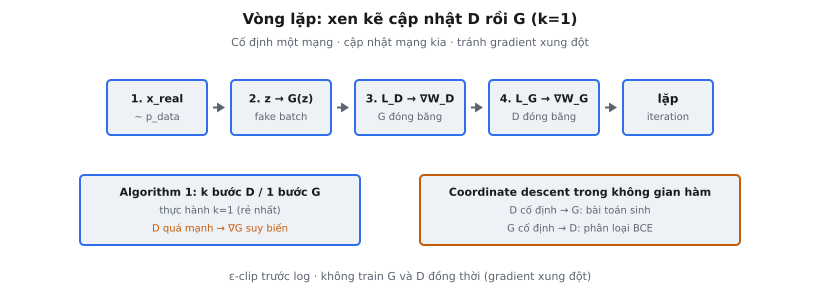

Vòng lặp huấn luyện GAN là quy trình tối ưu xen kẽ ở trung tâm Generative Adversarial Networks (Goodfellow et al., 2014). Mỗi iteration đặt hai mạng — discriminator D và generator G — đối đầu: D được cập nhật để phân tách thật/giả tốt hơn, rồi G được cập nhật để đánh lừa D tốt hơn. Lặp qua nhiều iteration, điều này đẩy cả hai mạng về equilibrium nơi G sinh mẫu không phân biệt được với dữ liệu thật.

## Nó là gì

Một iteration của vòng lặp huấn luyện GAN thực hiện hai bước cập nhật tuần tự. Trước hết, D được huấn luyện để maximize khả năng phân loại dữ liệu thật so với dữ liệu sinh ra. Sau đó, G được huấn luyện để maximize xác suất D phân loại nhầm đầu ra sinh ra là thật. Cấu trúc xen kẽ này là đặc trưng định nghĩa của huấn luyện adversarial.

D và G có mục tiêu đối lập. D muốn gán điểm cao cho dữ liệu thật và thấp cho dữ liệu giả. G muốn D gán điểm cao cho đầu ra của nó. Loss của không mạng nào minimize được độc lập — chiến lược tối ưu của mỗi bên phụ thuộc trạng thái bên kia. Vòng lập giải quyết bằng cách giữ một mạng cố định trong khi cập nhật mạng còn lại.

Discriminator có thể dùng mô hình tuyến tính sigmoid: biến đổi tuyến tính rồi kích hoạt sigmoid cho điểm xác suất. Logic vòng lặp huấn luyện tổng quát hóa sang kiến trúc phức tạp tùy ý.

::: {#fig-gan-train fig-cap="Train xen kẽ: lấy $x_{\\mathrm{real}}$, sinh $G(z)$, cập nhật $W_D$ ($G$ đóng băng), rồi $W_G$ ($D$ đóng băng). Thực hành $k=1$; $\\varepsilon$-clip trước $\\log$." fig-alt="Chuỗi bước 1–4 của vòng lặp huấn luyện GAN."}
{fig-align="center"}
:::

## Các phương trình chính

### Chấm điểm sigmoid

Discriminator chấm input $x$ qua biến đổi tuyến tính và sigmoid:

$$
D(x) = \sigma(W_D \cdot x) = \frac{1}{1 + e^{-W_D \cdot x}}
$$

với $W_D$ là vectơ trọng số discriminator. Đầu ra $D(x) \in (0, 1)$ biểu diễn xác suất $x$ đến từ phân phối dữ liệu thật.

### Discriminator loss

$$
\mathcal{L}_D = -\text{mean}\left[\log(D(x_{\text{real}})) + \log(1 - D(G(z)))\right]
$$

- **$\log(D(x_{\text{real}}))$:** Thưởng D khi gán xác suất cao cho dữ liệu thật. Maximized khi $D(x_{\text{real}}) \to 1$.
- **$\log(1 - D(G(z)))$:** Thưởng D khi gán xác suất thấp cho dữ liệu giả. Maximized khi $D(G(z)) \to 0$.
- **Dấu âm:** Chuyển maximize thành minimize cho gradient descent.

### Generator loss

$$
\mathcal{L}_G = -\text{mean}\left[\log(D(G(z)))\right]
$$

Đây là biến thể "non-saturating" từ Goodfellow et al. Thay vì minimize $\log(1 - D(G(z)))$ (bão hòa khi D tự tin), G maximize $\log(D(G(z)))$, cung cấp gradient mạnh hơn đầu huấn luyện.

### Epsilon clipping

Cả hai loss đều có logarit của giá trị trong $(0, 1)$. Khi $D(x) \approx 0$ hoặc $D(x) \approx 1$, log tiến tới $-\infty$. Epsilon clipping ngăn điều này:

$$
\log(\text{clip}(p, \epsilon, 1 - \epsilon)) \quad \text{where } \epsilon = 10^{-8}
$$

### Công thức minimax

Trò chơi đầy đủ từ bài báo:

$$
\min_G \max_D \; \mathbb{E}_{x \sim p_{\text{data}}}[\log D(x)] + \mathbb{E}_{z \sim p_z}[\log(1 - D(G(z)))]
$$

Vòng lặp huấn luyện giải xấp xỉ bằng xen kẽ: một bước gradient trên D (ascending), rồi một bước trên G (descending, dùng loss non-saturating).

## Tối ưu xen kẽ

Vì sao không huấn luyện D và G đồng thời? Cấu trúc minimax nghĩa là D muốn maximize $V(D, G)$ còn G muốn minimize. Tối ưu chung tạo gradient xung đột triệt tiêu hoặc dao động, ngăn mạng nào học được.

Tối ưu xen kẽ phân rã bài toán thành hai subproblem hợp tác. Cố định G, cập nhật D: bài toán phân loại chuẩn. Cố định D, cập nhật G: bài toán sinh chuẩn. Mỗi subproblem well-posed và giải được bằng gradient descent. Đây là coordinate descent trong không gian hàm — tối ưu một "tọa độ" (mạng) trong khi giữ bên kia cố định.

### $k$ bước D cho 1 bước G

Algorithm 1 trong Goodfellow et al. quy định $k$ bước discriminator cho mỗi một bước generator. D phải là critic đủ chính xác trước khi gradient của G có ý nghĩa. Tuy nhiên, bài báo nêu: "In practice, we use $k = 1$, the least expensive option." Huấn luyện D quá nhiều bước có thể khiến nó quá mạnh, làm gradient của G suy biến. Lựa chọn $k = 1$ nghĩa là xen kẽ nghiêm — mỗi iteration một bước mỗi bên.

## Quy trình huấn luyện từng bước

### Bước 1: Lấy mẫu batch thật

Rút $m$ mẫu $\{x^{(1)}, \ldots, x^{(m)}\}$ từ phân phối dữ liệu thật $p_{\text{data}}$.

### Bước 2: Lấy mẫu nhiễu và sinh batch giả

Rút $m$ vectơ nhiễu từ $p_z(z)$ (thường Gaussian). Đưa qua G để tạo mẫu giả $\{G(z^{(1)}), \ldots, G(z^{(m)})\}$.

### Bước 3: Tính điểm discriminator

Chạy cả hai batch qua D:

- $p_{\text{real}}^{(i)} = D(x^{(i)})$ cho mỗi mẫu thật
- $p_{\text{fake}}^{(i)} = D(G(z^{(i)}))$ cho mỗi mẫu giả

### Bước 4: Tính $\mathcal{L}_D$ và cập nhật D

$$
\mathcal{L}_D = -\frac{1}{m}\sum_{i=1}^{m}\left[\log(p_{\text{real}}^{(i)}) + \log(1 - p_{\text{fake}}^{(i)})\right]
$$

Tính gradient theo tham số của D và áp dụng gradient descent. Tham số của G bị đóng băng.

### Bước 5: Tính $\mathcal{L}_G$ và cập nhật G

$$
\mathcal{L}_G = -\frac{1}{m}\sum_{i=1}^{m}\log(p_{\text{fake}}^{(i)})
$$

Tính gradient theo tham số của G và áp dụng gradient descent. Tham số của D bị đóng băng.

### Bước 6: Trả về loss

Ghi $\mathcal{L}_D$ và $\mathcal{L}_G$ để theo dõi, làm tròn 4 chữ số thập phân.

## Bối cảnh bài báo

Vòng lặp huấn luyện là Algorithm 1 trong "Generative Adversarial Nets" (Goodfellow et al., 2014). Cấu trúc thuật toán:

- **Vòng ngoài:** Với mỗi iteration huấn luyện...
- **Vòng trong (D):** Trong $k$ bước, lấy mẫu batch thật và nhiễu, tính gradient của D, cập nhật D bằng ascending stochastic gradient.
- **Một bước (G):** Lấy mẫu nhiễu, tính gradient của G, cập nhật G bằng descending stochastic gradient.

Bài báo khuyến nghị SGD với momentum ($0.5$ ban đầu, tăng lên $0.7$). Chứng minh rằng nếu D đạt optimum mỗi bước, quy trình minimize Jensen-Shannon divergence giữa phân phối thật và sinh ra. Trong thực hành với $k = 1$, D không đạt tối ưu, nên động lực huấn luyện chỉ xấp xỉ.

Mẫu huấn luyện đặc trưng: đầu tiên, D dễ tách thật/giả. Khi G cải thiện, nhiệm vụ của D khó hơn, điểm hội tụ về $0.5$ cho cả hai — cho thấy D không phân biệt được. $D(x) = 0.5$ với mọi $x$ là equilibrium lý thuyết.

## Tại sao xen kẽ hiệu quả

Mục tiêu GAN là trò chơi zero-sum hai người. Nghiệm là Nash equilibrium: cặp $(D^*, G^*)$ mà không bên nào cải thiện được một mình. Tìm nghiệm này cần điều hướng saddle point — maximize theo D trong khi minimize theo G.

Gradient descent chuẩn không tìm được saddle point; nó đi theo gradient xuống dốc cho mọi tham số, đẩy D và G theo hướng xung đột. Gradient descent/ascent đồng thời được biết có động lực xoay, quay quanh equilibrium thay vì hội tụ.

Tối ưu xen kẽ giải quyết bằng cách tính đầy đủ best response của một người chơi trước khi bên kia di chuyển. Khi D được cập nhật với G cố định, D tiến về best response. Khi G được cập nhật sau, nó phản ứng với D đã cải thiện. Động lực best-response này có tính chất hội tụ tốt hơn cập nhật đồng thời.

Yêu cầu then chốt là cân bằng: không bên nào được vượt quá xa. Nếu D quá mạnh, gradient của G suy biến. Nếu G quá mạnh so với D, tín hiệu huấn luyện trở nên nhiễu và không đáng tin.

## Ổn định huấn luyện

### Cân bằng D/G

Yếu tố quan trọng nhất là duy trì cân bằng giữa D và G. D phải đủ mạnh để cung cấp gradient có ý nghĩa cho G, nhưng không quá mạnh đến mức phân loại hoàn hảo mọi mẫu giả và giết gradient của G.

### Khi D chiếm ưu thế

D gán $D(G(z)) \approx 0$ cho mọi mẫu sinh ra. Sigmoid bão hòa gần zero, nên $\nabla_G \log(D(G(z)))$ suy biến. G không nhận tín hiệu hữu ích và ngừng cải thiện — vấn đề vanishing gradient.

### Khi G chiếm ưu thế

G tạo đầu ra đánh lừa D, nên $D(G(z)) \approx 1$. D không phân biệt được thật/giả, không có gradient định hướng. Tệ hơn, G có thể tìm một mode duy nhất đánh lừa D — mode collapse — sinh đa dạng hạn chế bất kể nhiễu đầu vào.

### Lựa chọn learning rate

Thực hành phổ biến là learning rate thấp hơn cho G so với D, đảm bảo D luôn hơi dẫn trước. Optimizer Adam với $\beta_1 = 0.5$ (không phải mặc định $0.9$) được dùng rộng rãi vì momentum thấp hơn giảm dao động trong bối cảnh adversarial.

### Label smoothing

Thay nhãn cứng (1 thật, 0 giả), one-sided label smoothing dùng nhãn mềm (ví dụ 0.9 cho thật, 0 cho giả). Điều này ngăn D quá tự tin, duy trì dòng gradient. Chỉ nhãn thật được làm mượt — làm mượt nhãn giả khuyến khích D gán xác suất khác zero cho mẫu giả hiển nhiên.

## Ví dụ số

Xét 3 mẫu thật và 3 mẫu giả trong 2D, với trọng số discriminator $W_D = [1.0, -0.5]$.

### Dữ liệu

- **Thật:** $x_1 = [1.5, 0.3]$, $x_2 = [2.0, -0.1]$, $x_3 = [1.8, 0.5]$
- **Giả:** $g_1 = [0.2, 1.0]$, $g_2 = [-0.3, 0.8]$, $g_3 = [0.5, 1.2]$

### Điểm D trên dữ liệu thật

- $W_D \cdot x_1 = 1.5 - 0.15 = 1.35$, $p_{\text{real},1} = \sigma(1.35) \approx 0.7941$
- $W_D \cdot x_2 = 2.0 + 0.05 = 2.05$, $p_{\text{real},2} = \sigma(2.05) \approx 0.8858$
- $W_D \cdot x_3 = 1.8 - 0.25 = 1.55$, $p_{\text{real},3} = \sigma(1.55) \approx 0.8250$

### Điểm D trên dữ liệu giả

- $W_D \cdot g_1 = 0.2 - 0.5 = -0.3$, $p_{\text{fake},1} = \sigma(-0.3) \approx 0.4256$
- $W_D \cdot g_2 = -0.3 - 0.4 = -0.7$, $p_{\text{fake},2} = \sigma(-0.7) \approx 0.3318$
- $W_D \cdot g_3 = 0.5 - 0.6 = -0.1$, $p_{\text{fake},3} = \sigma(-0.1) \approx 0.4750$

### Tính $\mathcal{L}_D$

$$
\mathcal{L}_D = -\frac{1}{3}\left[\log(0.7941) + \log(0.8858) + \log(0.8250) + \log(0.5744) + \log(0.6682) + \log(0.5250)\right]
$$

$$
= -\frac{1}{3}\left[-0.2306 - 0.1214 - 0.1924 - 0.5546 - 0.4035 - 0.6444\right]
$$

$$
= -\frac{1}{3}(-2.1469) = 0.7156
$$

Loss của D dương, cho thấy còn chỗ cải thiện tách thật/giả.

### Tính $\mathcal{L}_G$

$$
\mathcal{L}_G = -\frac{1}{3}\left[\log(0.4256) + \log(0.3318) + \log(0.4750)\right]
$$

$$
= -\frac{1}{3}\left[-0.8544 - 1.1035 - 0.7445\right] = -\frac{1}{3}(-2.7024) = 0.9008
$$

Loss của G cao hơn D, điển hình đầu huấn luyện khi D vượt trội G. G cần điểm giả tiến về 1.0.

## Các lỗi thường gặp

### Huấn luyện G và D trên cùng một forward pass

Tính cả hai loss từ một forward pass rồi backpropagate đồng thời vi phạm tối ưu xen kẽ. Bước optimizer của D phải hoàn tất trước khi tính loss của G. Computation graph phải tách biệt.

### Quên detach mẫu giả khi cập nhật D

Khi tính $\mathcal{L}_D$, mẫu giả $G(z)$ phải được coi như dữ liệu cố định — D không nên backpropagate qua G. Trong PyTorch, gọi `.detach()` trên đầu ra generator trước khi đưa vào D, hoặc bọc forward pass generator trong `torch.no_grad()`. Không detach khiến cập nhật gradient của D làm hỏng computation graph của G.

### Sai thứ tự xen kẽ

Algorithm 1 quy định: cập nhật D trước, rồi G. Đảo thứ tự nghĩa là G tối ưu với discriminator cũ. D luôn phải cập nhật trước để G nhận gradient từ critic mới nhất.

### Huấn luyện mất cân bằng gây mode collapse

Nếu G được cập nhật quá nhiều so với D, nó khai thác điểm yếu ranh giới quyết định của D, sụp về tập đầu ra hẹp đánh lừa D đáng tin. Đó là mode collapse — G bỏ qua đa dạng của phân phối thật. Cách sửa là đảm bảo D được cập nhật ít nhất bằng tần suất G.

### Gradient suy biến từ loss gốc

Công thức gốc có G minimize $\log(1 - D(G(z)))$. Khi D mạnh, $D(G(z)) \approx 0$, nên $\log(1 - D(G(z))) \approx 0$ và gradient suy biến. Thay thế non-saturating $-\log(D(G(z)))$ có gradient tỉ lệ $1/D(G(z))$, tăng khi $D(G(z)) \to 0$, cung cấp tín hiệu mạnh đúng lúc G cần nhất.

### Quên epsilon clipping

Tính $\log(0)$ cho $-\infty$ hoặc NaN, làm hỏng mọi gradient sau. Clip đầu ra discriminator về $[\epsilon, 1 - \epsilon]$ trước khi lấy logarit là cần thiết. Với $\epsilon = 10^{-8}$, ảnh hưởng lên xác suất hợp lệ không đáng kể nhưng ngăn lỗi số thảm họa ở biên.


## Code
```python
import numpy as np

def train_gan_step(real_data, fake_data, D_W):
    real_data = np.array(real_data, dtype=float)
    fake_data = np.array(fake_data, dtype=float)
    D_W = np.array(D_W, dtype=float)
    eps = 1e-8
    
    # Discriminator outputs
    real_probs = 1 / (1 + np.exp(-np.dot(real_data, D_W)))
    fake_probs = 1 / (1 + np.exp(-np.dot(fake_data, D_W)))
    
    real_probs = np.clip(real_probs, eps, 1 - eps)
    fake_probs = np.clip(fake_probs, eps, 1 - eps)
    
    d_loss = -np.mean(np.log(real_probs) + np.log(1 - fake_probs))
    g_loss = -np.mean(np.log(fake_probs))
    
    return {"d_loss": round(float(d_loss), 4), "g_loss": round(float(g_loss), 4)}

```
