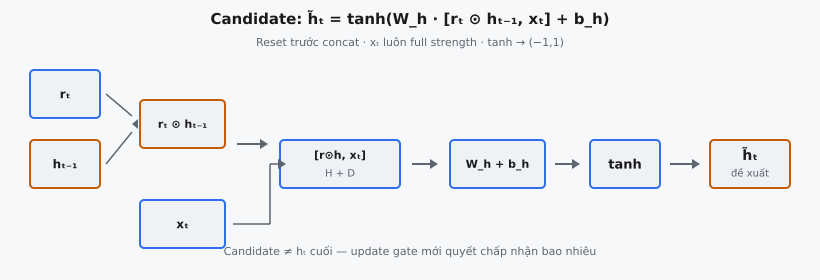

Candidate hidden state $\tilde{h}_t$ là đề xuất của GRU về nội dung mới cần ghi vào bộ nhớ tại mỗi time step. Nó được tính bằng cách áp reset gate element-wise lên hidden state trước, nối kết quả với input hiện tại, đưa qua biến đổi tuyến tính, rồi nén bằng tanh. Update gate sau đó quyết định bao nhiêu phần candidate này thay thế hidden state cũ. Cơ chế do Cho et al. (2014) giới thiệu cho GRU kiểm soát tinh từng phần quá khứ nào liên quan khi tạo biểu diễn mới.

## Nó là gì

Tại mỗi time step $t$, recurrent network phải tính hidden state mới $h_t$. Trong RNN chuẩn, $h_t$ được tính trực tiếp từ toàn bộ hidden state trước $h_{t-1}$ và input hiện tại $x_t$. GRU dùng quy trình hai giai đoạn: trước hết tính **candidate** hidden state $\tilde{h}_t$ biểu diễn trạng thái mới nếu mạng chọn cập nhật hoàn toàn, rồi trộn candidate này với trạng thái cũ $h_{t-1}$ bằng update gate $z_t$.

Candidate là nơi reset gate $r_t$ phát huy tác dụng. Trước khi tính $\tilde{h}_t$, mạng nhân $h_{t-1}$ element-wise với $r_t$. Khi một chiều của $r_t$ gần zero, chiều tương ứng của $h_{t-1}$ bị xóa hiệu quả, khiến candidate bỏ qua phần quá khứ đó. Khi $r_t$ gần one, toàn bộ lịch sử đi qua. Cơ chế xóa chọn lọc này giúp GRU mô hình hóa cả long-range dependency lẫn reset ngắn hạn.

Tên "candidate" có ý nghĩa: $\tilde{h}_t$ không phải hidden state cuối cùng. Nó là đề xuất. Hidden state cuối $h_t$ là nội suy giữa $h_{t-1}$ và $\tilde{h}_t$, do update gate điều khiển. Tách "đề xuất gì" khỏi "chấp nhận bao nhiêu" là nguyên tắc thiết kế cốt lõi của GRU.

::: {#fig-gru-candidate fig-cap="Candidate: $\\tilde{h}_t=\\tanh(W_h\\cdot[r_t\\odot h_{t-1},\\,x_t]+b_h)$. Reset trước concat; $x_t$ luôn full strength; tanh $\\to(-1,1)$." fig-alt="r_t nhân h_t-1, nối x_t, W_h, tanh ra candidate."}
{fig-align="center"}
:::

## Các phương trình chính

### Nối sau khi có reset gate

Bước đầu áp reset gate $r_t$ element-wise lên hidden state trước. Reset gate $r_t \in (0, 1)^H$ cùng chiều với $h_{t-1} \in \mathbb{R}^H$. Tích element-wise là:

$$
r_t \odot h_{t-1}
$$

Kết quả là vectơ trong $\mathbb{R}^H$ mà mỗi chiều hidden state trước được scale bởi giá trị reset gate tương ứng. Vectơ này được nối với $x_t \in \mathbb{R}^D$:

$$
[r_t \odot h_{t-1}, \; x_t] \in \mathbb{R}^{H+D}
$$

### Biến đổi tuyến tính và tanh

Vectơ nối được nhân với ma trận trọng số $W_h \in \mathbb{R}^{H \times (H+D)}$, cộng bias $b_h \in \mathbb{R}^H$, rồi qua tanh:

$$
\tilde{h}_t = \tanh(W_h \cdot [r_t \odot h_{t-1}, \; x_t] + b_h)
$$

Ma trận $W_h$ ánh xạ từ không gian nối $(H+D)$ chiều về không gian hidden $H$ chiều. Có thể tách khái niệm thành hai khối: $W_{hh} \in \mathbb{R}^{H \times H}$ tác lên hidden state có reset gate, và $W_{hx} \in \mathbb{R}^{H \times D}$ tác lên input. Tanh nén mỗi chiều vào $[-1, 1]$.

## Reset gate thay đổi input thế nào

Reset gate $r_t$ là vectơ giá trị trong $(0, 1)^H$, tính cùng time step từ $h_{t-1}$ và $x_t$ bằng kích hoạt sigmoid. Mỗi phần tử $r_t^{(j)}$ điều khiển mức chiều thứ $j$ của hidden state trước tham gia tính candidate.

Khi $r_t^{(j)} \approx 0$, chiều thứ $j$ của $h_{t-1}$ nhân gần zero, xóa hiệu quả chiều đó. Candidate cho chiều đó tính như không có hidden state trước, chỉ dựa vào $x_t$. Khi $r_t^{(j)} \approx 1$, chiều thứ $j$ đi qua không đổi, candidate dùng đủ lịch sử cho chiều đó, tương tự RNN chuẩn.

Các chiều có thể reset độc lập. Trong câu "The cat, which was sitting on the mat, stood up", reset gate có thể zero hóa các chiều mã hóa mệnh đề quan hệ trong khi giữ chiều mã hóa chủ ngữ khi tính candidate tại từ "stood". Tính chọn lọc theo từng chiều khiến GRU biểu đạt hơn cơ chế nhị phân "nhớ hết hay quên hết".

Phép nhân element-wise $r_t \odot h_{t-1}$ xảy ra **trước** khi nối với $x_t$. Thứ tự này quan trọng. Nếu reset gate áp sau khi nối, nó cũng scale input $x_t$, phá mục đích thiết kế. Input luôn đi vào phép tính candidate với cường độ đầy đủ; chỉ quá khứ mới bị gate chọn lọc.

## Tại sao dùng tanh

**Đầu ra bị giới hạn.** Hidden state được mang qua nhiều time step. Nếu candidate không bị giới hạn (như ReLU), tích lũy lặp lại có thể khiến giá trị hidden state tăng không giới hạn. Tanh đảm bảo mọi giá trị đề xuất nằm trong $[-1, 1]$, ngăn bùng nổ.

**Zero-centered.** Khác sigmoid cho đầu ra $(0, 1)$ với mean $0.5$, tanh tâm tại zero. Cập nhật hidden state cuối $h_t = (1 - z_t) \odot h_{t-1} + z_t \odot \tilde{h}_t$ là nội suy. Nếu candidate luôn dương, hidden state phát triển bias dương tích lũy theo thời gian. Giá trị zero-centered cho phép hidden state biểu diễn đặc trưng dương và âm đối xứng.

**Tính chất gradient.** Đạo hàm tanh là $1 - \tanh^2(x)$, đạt cực đại $1.0$ tại $x = 0$ và suy dần về zero khi $|x|$ lớn. Dù điều này gây vanishing gradient trong vanilla RNN, cơ chế gate của GRU tạo đường gradient thay thế qua update gate, giảm bão hòa.

**Quy ước trong gated RNN.** Cả GRU và LSTM đều dùng tanh cho candidate/cell state và sigmoid cho gate. Gate sigmoid cho giá trị $(0, 1)$ hoạt động như bộ điều khiển nhân; tanh cho giá trị $[-1, 1]$ biểu diễn nội dung thực. Nhầm vai trò sẽ phá ngữ nghĩa thiết kế.

## Candidate như "trạng thái mới đề xuất"

Candidate $\tilde{h}_t$ biểu diễn hidden state sẽ trở thành gì nếu mạng quyết ghi đè hoàn toàn trạng thái trước. Update gate $z_t$ điều khiển nội suy:

$$
h_t = (1 - z_t) \odot h_{t-1} + z_t \odot \tilde{h}_t
$$

Khi $z_t^{(j)} = 1$ ở chiều $j$, hidden state cuối lấy hoàn toàn giá trị candidate: $h_t^{(j)} = \tilde{h}_t^{(j)}$. Khi $z_t^{(j)} = 0$, trạng thái trước được sao chép nguyên vẹn: $h_t^{(j)} = h_{t-1}^{(j)}$. Giá trị trung gian cho phép trộn có trọng số.

Điều này tách rõ trách nhiệm. **Reset gate** quyết chiều lịch sử nào liên quan để *tính* candidate. **Candidate** dùng lịch sử đã lọc để tạo đề xuất cụ thể. **Update gate** quyết chấp nhận bao nhiêu đề xuất đó. Mỗi thành phần có vai trò riêng, rõ ràng.

Candidate có thể "mạnh tay". Dù $\tilde{h}_t$ đề xuất lệch mạnh khỏi $h_{t-1}$, update gate có thể làm dịu bằng cách đặt $z_t$ gần zero. Ngược lại, nếu candidate gần $h_{t-1}$, giá trị update gate ít quan trọng hơn. Tương tác này tạo linh hoạt cho GRU.

## Bối cảnh bài báo

GRU được giới thiệu trong "Learning Phrase Representations using RNN Encoder-Decoder for Statistical Machine Translation" (Cho et al., 2014). Đóng góp chính của bài báo là kiến trúc encoder-decoder cho học sequence-to-sequence, và GRU được đề xuất làm đơn vị recurrent bên trong.

Bài báo nêu: "The candidate activation is computed similarly to that of the traditional recurrent unit. However, the previous hidden state is first multiplied (element-wise) by the reset gate." Câu này nắm trọn khác biệt giữa candidate GRU và hidden state vanilla RNN. Ma trận trọng số, bias, tanh và nối vector giống nhau; chỉ reset gating là mới.

Tác giả động viên reset gate vì nó "allows the hidden state to drop any information that is found to be irrelevant later in the future, thus, allowing a more compact representation." Khi reset gate đóng, candidate tính như sequence bắt đầu lại — hữu ích trong machine translation khi ranh giới mệnh đề và chuyển chủ đề báo hiệu ngữ cảnh trước không còn liên quan.

So với LSTM, candidate GRU khác ở điểm quan trọng. Candidate LSTM $\tilde{c}_t = \tanh(W_c \cdot [h_{t-1}, x_t] + b_c)$ không gate $h_{t-1}$ trước khi tính candidate. LSTM thay vào đó dùng forget gate và input gate riêng để điều khiển cập nhật cell state. GRU gộp các vai trò này: reset gate xử lý quên trong phép tính candidate, update gate xử lý cả quên lẫn ghi. Đó là lý do GRU ít tham số hơn LSTM.

## Ví dụ số

Xét GRU với hidden size $H = 3$ và input size $D = 2$. Ta tính $\tilde{h}_t$ từng bước.

### Giá trị cho trước

$$
h_{t-1} = \begin{pmatrix} 0.5 \\ -0.3 \\ 0.8 \end{pmatrix}, \quad r_t = \begin{pmatrix} 0.9 \\ 0.1 \\ 0.7 \end{pmatrix}, \quad x_t = \begin{pmatrix} 1.0 \\ -0.5 \end{pmatrix}
$$

$$
W_h = \begin{pmatrix} 0.2 & -0.1 & 0.3 & 0.5 & 0.1 \\ 0.4 & 0.2 & -0.2 & 0.1 & 0.3 \\ -0.1 & 0.5 & 0.1 & -0.3 & 0.2 \end{pmatrix}, \quad b_h = \begin{pmatrix} 0.1 \\ -0.1 \\ 0.05 \end{pmatrix}
$$

### Bước 1: Áp reset gate

Tính $r_t \odot h_{t-1}$ element-wise:

$$
r_t \odot h_{t-1} = \begin{pmatrix} 0.9 \times 0.5 \\ 0.1 \times (-0.3) \\ 0.7 \times 0.8 \end{pmatrix} = \begin{pmatrix} 0.45 \\ -0.03 \\ 0.56 \end{pmatrix}
$$

Chiều đầu ($0.5$) hầu như không giảm (scale bởi $0.9$). Chiều hai ($-0.3$) gần như bị zero hóa hoàn toàn (scale bởi $0.1$, cho $-0.03$). Chiều ba ($0.8$) giảm vừa phải (scale bởi $0.7$). Reset gate quyết định chiều hai của lịch sử quá khứ phần lớn không liên quan.

### Bước 2: Nối vector

$$
[r_t \odot h_{t-1}, \; x_t] = \begin{pmatrix} 0.45 \\ -0.03 \\ 0.56 \\ 1.0 \\ -0.5 \end{pmatrix}
$$

Ba phần tử đầu là hidden state có reset gate; hai phần tử cuối là input thô. Input không bao giờ bị gate.

### Bước 3: Biến đổi tuyến tính

Tính $W_h \cdot [r_t \odot h_{t-1}, \; x_t] + b_h$ từng hàng:

**Hàng 1:** $(0.2)(0.45) + (-0.1)(-0.03) + (0.3)(0.56) + (0.5)(1.0) + (0.1)(-0.5) + 0.1 = 0.09 + 0.003 + 0.168 + 0.5 - 0.05 + 0.1 = 0.811$

**Hàng 2:** $(0.4)(0.45) + (0.2)(-0.03) + (-0.2)(0.56) + (0.1)(1.0) + (0.3)(-0.5) - 0.1 = 0.18 - 0.006 - 0.112 + 0.1 - 0.15 - 0.1 = -0.088$

**Hàng 3:** $(-0.1)(0.45) + (0.5)(-0.03) + (0.1)(0.56) + (-0.3)(1.0) + (0.2)(-0.5) + 0.05 = -0.045 - 0.015 + 0.056 - 0.3 - 0.1 + 0.05 = -0.354$

$$
W_h \cdot [r_t \odot h_{t-1}, \; x_t] + b_h = \begin{pmatrix} 0.811 \\ -0.088 \\ -0.354 \end{pmatrix}
$$

### Bước 4: Áp tanh

$$
\tilde{h}_t = \tanh\!\begin{pmatrix} 0.811 \\ -0.088 \\ -0.354 \end{pmatrix} = \begin{pmatrix} 0.670 \\ -0.088 \\ -0.340 \end{pmatrix}
$$

Với $|x|$ nhỏ, $\tanh(x) \approx x$, nên hai giá trị sau hầu như không đổi. Giá trị đầu ($0.811$) bị nén vừa phải còn $0.670$. Mọi giá trị giờ nằm trong $[-1, 1]$. Candidate $(0.670, -0.088, -0.340)^T$ là đề xuất của GRU. Update gate $z_t$ sẽ trộn nó với $h_{t-1}$ để tạo $h_t$ cuối cùng.

## So sánh với RNN chuẩn

RNN chuẩn tính hidden state:

$$
h_t = \tanh(W \cdot [h_{t-1}, \; x_t] + b)
$$

Phép tính candidate GRU:

$$
\tilde{h}_t = \tanh(W_h \cdot [r_t \odot h_{t-1}, \; x_t] + b_h)
$$

Khác biệt cấu trúc duy nhất là $r_t \odot$ trước $h_{t-1}$. Phần còn lại giống hệt. Candidate GRU suy về hidden state vanilla RNN khi $r_t = \mathbf{1}$ (toàn one). Khi $r_t = \mathbf{0}$ (toàn zero), candidate thành $\tilde{h}_t = \tanh(W_{hx} \cdot x_t + b_h)$, biến đổi feed-forward đơn giản không có kết nối recurrent. Reset gate nội suy giữa mạng fully recurrent và purely feed-forward.

Trong vanilla RNN, $h_t$ là đầu ra cuối không qua gate thêm, buộc toàn bộ hidden state bị ghi đè mỗi bước. Điều này khó giữ thông tin trên sequence dài vì gradient phải đi qua chuỗi tanh và nhân ma trận, gây vanishing gradient. GRU cho phép update gate sao chép trực tiếp $h_{t-1}$ sang $h_t$, tạo đường tắt gradient tương tự residual connection.

## Các lỗi thường gặp

### Áp reset gate sau khi nối

Lỗi phổ biến là nối trước $[h_{t-1}, x_t]$ rồi áp reset gate lên toàn vectơ. Sai vì reset gate có shape $\mathbb{R}^H$, không phải $\mathbb{R}^{H+D}$, và sẽ gate nhầm input $x_t$. Reset gate phải áp lên $h_{t-1}$ một mình, trước khi nối: gate trước, nối sau.

### Quên phép nhân element-wise

Reset gate áp qua tích element-wise (Hadamard) $r_t \odot h_{t-1}$, không phải nhân ma trận. Cả $r_t$ và $h_{t-1}$ đều shape $\mathbb{R}^H$, nên phép toán nhân từng phần tử tương ứng. Dùng nhân ma trận ($r_t^T h_{t-1}$) cho scalar, sụp mọi chiều và phá tính chọn lọc theo chiều.

### Sai thứ tự nối

Thứ tự nối $[r_t \odot h_{t-1}, \; x_t]$ phải khớp bố cục ma trận trọng số. Nếu $W_h$ có $H$ cột đầu cho hidden state và $D$ cột cuối cho input, đảo thành $[x_t, \; r_t \odot h_{t-1}]$ ghép sai trọng số với sai input. Quy ước Cho et al. (2014) đặt hidden state trước.

### Nhầm tanh và sigmoid

Candidate dùng **tanh** (khoảng $[-1, 1]$), gate dùng **sigmoid** (khoảng $(0, 1)$). Nếu sigmoid cho candidate, $\tilde{h}_t$ luôn dương, tạo bias ngăn biểu diễn đặc trưng âm. Nếu tanh cho gate, giá trị có thể âm, đảo dấu lượng bị gate thay vì scale về zero. Điều này vi phạm ngữ nghĩa gate như bộ điều khiển "cho qua bao nhiêu".

### Nhầm candidate với hidden state cuối

Candidate $\tilde{h}_t$ không phải $h_t$. Lỗi thường gặp là trả $\tilde{h}_t$ làm output GRU mà không nội suy update gate $h_t = (1 - z_t) \odot h_{t-1} + z_t \odot \tilde{h}_t$. Bỏ bước này mất khả năng giữ thông tin qua time step, biến GRU thành vanilla RNN với reset gate thừa.


## Code
```python
import numpy as np

def candidate_hidden(h_prev: np.ndarray, x_t: np.ndarray, r_t: np.ndarray,
                     W_h: np.ndarray, b_h: np.ndarray) -> np.ndarray:
    gated_h = r_t * h_prev
    concat = np.concatenate([gated_h, x_t], axis=-1)
    h_tilde = np.tanh(concat @ W_h.T + b_h)
    return h_tilde

```
