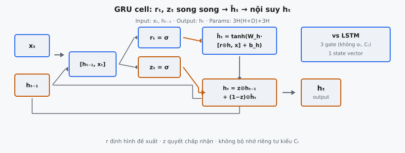

Gated Recurrent Unit (GRU) là mạng nơ-ron lặp do Cho et al. (2014) giới thiệu trong "Learning Phrase Representations using RNN Encoder-Decoder for Statistical Machine Translation." Nó kết hợp reset gate, update gate và candidate hidden state vào một cell duy nhất tạo hidden state mới tại mỗi bước thời gian. GRU đạt hiệu năng tương đương LSTM trong khi dùng ít tham số hơn và không có cell state riêng.

## Nó là gì

GRU cell hoàn chỉnh là đơn vị lặp nhận hai input tại mỗi bước thời gian: vectơ input hiện tại $x_t \in \mathbb{R}^D$ và hidden state trước $h_{t-1} \in \mathbb{R}^H$, rồi tạo hidden state mới $h_t \in \mathbb{R}^H$. Khác LSTM — duy trì cả hidden state và cell state riêng — GRU chỉ dùng một vectơ hidden state duy nhất. Mọi bộ nhớ và gating được góp vào vectơ này.

Cell hoạt động qua ba bước. Trước hết, **reset gate** quyết định bao nhiêu hidden state trước được phơi ra khi tạo candidate. Thứ hai, **candidate hidden state** được tính bằng phiên bản $h_{t-1}$ đã qua reset gate. Thứ ba, **update gate** nội suy giữa hidden state cũ và candidate mới để tạo $h_t$. Ba bước này dùng ba ma trận trọng số và ba vectơ bias, khiến GRU đơn giản hơn kiến trúc bốn gate của LSTM.

Bài báo mô tả đây là kiến trúc nơi "gating units modulate the flow of information inside the unit, without having separate memory cells." GRU được phát triển như một phần của RNN Encoder-Decoder cho dịch máy, nơi encoder đọc câu nguồn và decoder sinh câu đích từng token một.

::: {#fig-gru-complete-cell fig-cap="GRU cell: concat $\\to$ $r_t,z_t$ song song $\\to$ $\\tilde{h}_t=\\tanh(W_h\\cdot[r\\odot h,x]+b_h)$ $\\to$ $h_t=z\\odot h_{t-1}+(1-z)\\odot\\tilde{h}_t$. Params $3H(H+D)+3H$; một state (không $C_t$)." fig-alt="Sơ đồ reset, update, candidate và nội suy trong một GRU cell."}
{fig-align="center"}
:::

## Các phương trình chính

Cho $x_t \in \mathbb{R}^D$ là input tại bước $t$ và $h_{t-1} \in \mathbb{R}^H$ là hidden state trước. Phép nối $[h_{t-1}, x_t] \in \mathbb{R}^{H+D}$ được tạo bằng cách xếp chồng hai vectơ này. Cả bốn phương trình thực thi tuần tự tại mỗi bước thời gian.

**Phương trình 1 — Reset gate.** Xác định bao nhiêu hidden state trước bị quên khi tính candidate:

$$
r_t = \sigma(W_r \cdot [h_{t-1}, x_t] + b_r)
$$

Ở đây $W_r \in \mathbb{R}^{H \times (H+D)}$ và $b_r \in \mathbb{R}^H$. Sigmoid nén mỗi phần tử về $(0, 1)$. Khi $r_t \approx 0$, hidden state trước bị xóa hiệu quả trước khi tạo candidate, cho phép đơn vị hành xử như đọc token đầu của một subsequence mới.

**Phương trình 2 — Update gate.** Kiểm soát bao nhiêu hidden state cũ được mang theo so với thay bằng nội dung mới:

$$
z_t = \sigma(W_z \cdot [h_{t-1}, x_t] + b_z)
$$

Ở đây $W_z \in \mathbb{R}^{H \times (H+D)}$ và $b_z \in \mathbb{R}^H$. Update gate đảm nhiệm vai kép tương ứng cả forget gate và input gate trong LSTM. Khi $z_t \approx 1$, cell sao chép hidden state cũ. Khi $z_t \approx 0$, cell thay toàn bộ state cũ bằng candidate.

**Phương trình 3 — Candidate hidden state.** Đề xuất nội dung mới ghi vào hidden state:

$$
\tilde{h}_t = \tanh(W_h \cdot [r_t \odot h_{t-1}, x_t] + b_h)
$$

Ở đây $W_h \in \mathbb{R}^{H \times (H+D)}$ và $b_h \in \mathbb{R}^H$. Tích theo phần tử $r_t \odot h_{t-1}$ áp dụng reset gate, scale từng chiều hidden độc lập. Hàm kích hoạt tanh giới hạn candidate trong $(-1, 1)$. Đây là phương trình duy nhất reset gate xuất hiện: nó sửa input lặp trước biến đổi tuyến tính.

**Phương trình 4 — Hidden state cuối.** Nội suy giữa cũ và mới:

$$
h_t = z_t \odot h_{t-1} + (1 - z_t) \odot \tilde{h}_t
$$

Nội suy tuyến tính này dùng update gate làm hệ số trộn. Mỗi chiều hidden độc lập quyết định tỷ lệ trộn riêng. Ràng buộc hệ số cộng thành $1$ nghĩa là GRU không thể đồng thời khuếch đại cả thông tin cũ và mới trên cùng một chiều, hoạt động như regularizer ngầm.

## Pipeline ba bước

### Bước 1: Reset và tính candidate

Reset gate $r_t$ được tính từ phép nối đầy đủ $[h_{t-1}, x_t]$, rồi áp dụng theo phần tử lên $h_{t-1}$ để tạo phiên bản "reset" của state trước. State reset này được nối với $x_t$ và đưa qua biến đổi affine có kích hoạt tanh để tạo $\tilde{h}_t$. Reset gate cho mạng học cách bỏ qua có chọn lọc phần lịch sử khi tạo đề xuất mới. Với language modeling, điều này cho phép GRU coi ranh giới câu như reset một phần mà không loại bỏ mọi thứ.

### Bước 2: Update gate kiểm soát độ bền bộ nhớ

Update gate $z_t$ được tính song song với reset gate (cùng phép nối, trọng số khác). Giá trị update gate cao nghĩa là "giữ giá trị cũ," giá trị thấp nghĩa là "chấp nhận candidate mới." Đây là cơ chế bộ nhớ tầm xa của GRU: các chiều có $z_t \approx 1$ tồn tại qua nhiều bước thời gian, vì nội suy rút về $h_t \approx h_{t-1}$ trên các chiều đó.

### Bước 3: Nội suy và luồng dữ liệu

Hidden state cuối $h_t = z_t \odot h_{t-1} + (1 - z_t) \odot \tilde{h}_t$ có tính chất gradient quan trọng. Trong BPTT, gradient theo $h_{t-1}$ gồm đường trực tiếp qua $z_t \odot h_{t-1}$. Khi $z_t$ gần $1$, gradient truyền gần như không đổi, giảm vấn đề vanishing gradient. Cấu trúc cộng này cùng nguyên lý khiến cell state của LSTM hiệu quả bảo toàn gradient qua chuỗi dài.

Luồng dữ liệu đầy đủ: nối $h_{t-1}$ và $x_t$, tính $r_t$ và $z_t$ (hai affine + sigmoid độc lập), áp dụng $r_t$ lên $h_{t-1}$, nối với $x_t$, tính $\tilde{h}_t$ qua affine + tanh, rồi nội suy. Output $h_t$ vừa là output của cell vừa là recurrent state cho bước thời gian sau.

## Vì sao không có cell state riêng

LSTM duy trì hai vectơ state: hidden state $h_t$ (phơi ra bên ngoài) và cell state $c_t$ (bộ nhớ nội bộ). Output gate lọc cell state để tạo $h_t = o_t \odot \tanh(c_t)$, nên LSTM có thể lưu thông tin chưa phản ánh ở output.

GRU gộp hai vai trò này vào một vectơ $h_t$ duy nhất. Mọi thứ GRU nhớ luôn sẵn sàng trực tiếp làm output. Điều này giảm một nửa state mang giữa các bước thời gian, đơn giản hóa gradient flow thành một đường duy nhất, và loại bỏ hoàn toàn output gate. Đổi lại là biểu đạt: LSTM có thể lưu thông tin "riêng tư" trong $c_t$ chỉ hiện ra khi output gate mở. GRU không có bộ nhớ riêng tư như vậy. Theo thực nghiệm, điều này quan trọng trên tác vụ cần theo dõi state phức tạp nhưng không đáng kể trên nhiều benchmark chuẩn.

## Số lượng tham số

GRU có ba ma trận trọng số và ba vectơ bias. Mỗi ma trận trọng số có shape $(H, H + D)$ và mỗi vectơ bias có shape $(H,)$.

- **Reset gate:** $W_r$ có $H \times (H + D)$ trọng số, $b_r$ có $H$ bias
- **Update gate:** $W_z$ có $H \times (H + D)$ trọng số, $b_z$ có $H$ bias
- **Candidate:** $W_h$ có $H \times (H + D)$ trọng số, $b_h$ có $H$ bias

**Tổng tham số GRU:**

$$
3H(H + D) + 3H
$$

LSTM có bốn gate cùng shape, tổng cộng $4H(H + D) + 4H$. GRU dùng đúng $\frac{3}{4}$ số tham số của LSTM. Với $H = 256$ và $D = 128$: GRU có $3 \times 256 \times 384 + 768 = 295{,}680$ tham số, LSTM tương đương có $4 \times 256 \times 384 + 1{,}024 = 394{,}240$. GRU tiết kiệm khoảng 99.000 tham số mỗi lớp.

## Bối cảnh bài báo

Cho et al. (2014) giới thiệu GRU trong "Learning Phrase Representations using RNN Encoder-Decoder for Statistical Machine Translation." Bài báo đề xuất RNN Encoder-Decoder nơi encoder đọc câu nguồn từng token, nén thành vectơ độ dài cố định, và decoder sinh câu đích từ vectơ đó. GRU là đơn vị lặp trong cả hai thành phần.

Bài báo được thúc đẩy bởi thất bại của vanilla RNN trong nắm bắt phụ thuộc tầm xa. Dịch máy cần nhớ agreement chủ–vị và cấu trúc cú pháp qua nhiều token. Vấn đề vanishing gradient khiến điều này gần như không thể với câu dài hơn. Cơ chế gating của GRU được thiết kế như lựa chọn đơn giản hơn LSTM vẫn duy trì thông tin qua khoảng dài.

Đóng góp rộng hơn là chứng minh biểu diễn cụm từ học được từ encoder-decoder có thể cải thiện dịch máy thống kê theo cụm từ. GRU encoder-decoder chấm điểm cặp cụm từ, và các điểm này kết hợp với feature truyền thống cải thiện BLEU trên WMT'14 English-to-French. Chung et al. (2014) sau đó so sánh GRU và LSTM trên nhạc, giọng nói và language modeling, kết luận không bên nào luôn thắng, nhưng ít tham số hơn của GRU mang lợi thế hiệu quả thực tế.

## Ví dụ số

Xét GRU với $H = 2$ và $D = 2$. Tại bước thời gian $t$:

$$
x_t = \begin{pmatrix} 0.5 \\ -0.3 \end{pmatrix}, \quad h_{t-1} = \begin{pmatrix} 0.1 \\ -0.2 \end{pmatrix}
$$

Phép nối là $[h_{t-1}, x_t] = [0.1, -0.2, 0.5, -0.3]$. Ma trận trọng số và bias:

$$
W_r = \begin{pmatrix} 0.3 & -0.1 & 0.2 & 0.4 \\ 0.1 & 0.5 & -0.3 & 0.2 \end{pmatrix}, \quad b_r = \begin{pmatrix} 0.1 \\ -0.1 \end{pmatrix}
$$

$$
W_z = \begin{pmatrix} 0.2 & 0.3 & -0.1 & 0.5 \\ -0.2 & 0.1 & 0.4 & -0.3 \end{pmatrix}, \quad b_z = \begin{pmatrix} 0.0 \\ 0.1 \end{pmatrix}
$$

$$
W_h = \begin{pmatrix} -0.1 & 0.4 & 0.3 & -0.2 \\ 0.2 & -0.3 & 0.1 & 0.5 \end{pmatrix}, \quad b_h = \begin{pmatrix} 0.0 \\ 0.1 \end{pmatrix}
$$

**Bước 1: Reset gate.** $W_r \cdot [h, x] + b_r$:

Hàng 1: $0.3(0.1) + (-0.1)(-0.2) + 0.2(0.5) + 0.4(-0.3) + 0.1 = 0.03 + 0.02 + 0.10 - 0.12 + 0.1 = 0.13$

Hàng 2: $0.1(0.1) + 0.5(-0.2) + (-0.3)(0.5) + 0.2(-0.3) - 0.1 = 0.01 - 0.10 - 0.15 - 0.06 - 0.1 = -0.40$

$r_t = [\sigma(0.13), \sigma(-0.40)] = [0.5324, 0.4013]$

**Bước 2: Update gate.** $W_z \cdot [h, x] + b_z$:

Hàng 1: $0.2(0.1) + 0.3(-0.2) + (-0.1)(0.5) + 0.5(-0.3) + 0.0 = 0.02 - 0.06 - 0.05 - 0.15 = -0.24$

Hàng 2: $(-0.2)(0.1) + 0.1(-0.2) + 0.4(0.5) + (-0.3)(-0.3) + 0.1 = -0.02 - 0.02 + 0.20 + 0.09 + 0.1 = 0.35$

$z_t = [\sigma(-0.24), \sigma(0.35)] = [0.4403, 0.5866]$

**Bước 3: Candidate.** $r_t \odot h_{t-1} = [0.0532, -0.0803]$. Nối với $x_t$: $[0.0532, -0.0803, 0.5, -0.3]$. Tính $W_h \cdot [\cdot] + b_h$:

Hàng 1: $(-0.1)(0.0532) + 0.4(-0.0803) + 0.3(0.5) + (-0.2)(-0.3) + 0.0 = -0.005 - 0.032 + 0.15 + 0.06 = 0.173$

Hàng 2: $0.2(0.0532) + (-0.3)(-0.0803) + 0.1(0.5) + 0.5(-0.3) + 0.1 = 0.011 + 0.024 + 0.05 - 0.15 + 0.1 = 0.035$

$\tilde{h}_t = [\tanh(0.173), \tanh(0.035)] = [0.1714, 0.0350]$

**Bước 4: Nội suy.**

$h_t[0] = 0.4403 \times 0.1 + 0.5597 \times 0.1714 = 0.0440 + 0.0959 = 0.1400$

$h_t[1] = 0.5866 \times (-0.2) + 0.4134 \times 0.0350 = -0.1173 + 0.0145 = -0.1028$

Kết quả: $h_t = [0.1400, -0.1028]$. Chiều 0 ($z_t = 0.44$) hấp thụ nhiều hơn từ candidate, trong khi chiều 1 ($z_t = 0.59$) giữ nhiều hơn state cũ.

## So sánh GRU và LSTM

**Tham số.** GRU: 3 ma trận trọng số shape $(H, H+D)$, 3 bias. LSTM: 4 mỗi loại. Tỷ lệ tham số đúng $3/4$. Với $H = 1024$, $D = 512$, GRU tiết kiệm hơn 1,5 triệu tham số mỗi lớp.

**Gate.** LSTM có bốn gate: forget, input, candidate cell, output. GRU có ba: reset, update, candidate hidden. Update gate đảm nhiệm vai kép của forget gate và input gate LSTM: $z_t$ kiểm soát cả quên ($z_t \odot h_{t-1}$) và chấp nhận ($(1 - z_t) \odot \tilde{h}_t$). LSTM tách hai gate này, cho phép $f_t$ và $i_t$ biến thiên độc lập.

**Cell state.** LSTM duy trì $c_t$ riêng được che bởi output gate. GRU không có cell state. LSTM có thể lưu thông tin nội bộ chưa phản ánh ở output; bộ nhớ GRU luôn phơi ra đầy đủ.

**Hiệu năng.** Trên hầu hết benchmark (language modeling, giọng nói, dịch), GRU và LSTM tương đương. GRU huấn luyện nhanh hơn mỗi epoch nhờ ít tham số. Trên tác vụ cần quản lý state nội bộ chính xác, LSTM đôi khi nhỉnh hơn.

**Khi nào ưu tiên bên nào.** Dùng GRU khi ngân sách tính toán hạn chế hoặc dataset nhỏ (ít tham số giảm overfitting). Dùng LSTM khi tác vụ có chuỗi dài với phụ thuộc phức tạp hoặc cần dung lượng mô hình tối đa.

## Các lỗi thường gặp

- **Áp dụng reset gate lên đối tượng sai.** Reset gate phải áp dụng lên $h_{t-1}$ trước khi nối với $x_t$: candidate dùng $[r_t \odot h_{t-1}, x_t]$. Áp dụng reset sau phép nối ($r_t \odot [h_{t-1}, x_t]$) gate input sai cách. Reset gate chỉ nên kiểm soát bao nhiêu lịch sử được dùng, không phải bao nhiêu input hiện tại được chấp nhận.
- **Đảo hướng nội suy update gate.** Công thức đúng là $h_t = z_t \odot h_{t-1} + (1 - z_t) \odot \tilde{h}_t$. Đảo thành $(1 - z_t) \odot h_{t-1} + z_t \odot \tilde{h}_t$ nghĩa là $z_t$ cao thay state cũ thay vì giữ, đảo hành vi bộ nhớ. Mạng vẫn có thể huấn luyện, nhưng phụ thuộc tầm xa trở nên khó nắm bắt hơn nhiều.
- **Thứ tự nối không nhất quán giữa các gate.** Cả ba biến đổi affine phải dùng cùng thứ tự nối. Nếu reset gate và update gate dùng $[h_{t-1}, x_t]$ nhưng candidate dùng $[x_t, r_t \odot h_{t-1}]$, $W_h$ áp trọng số đã học lên input sai. Không gây lỗi chiều nhưng cho kết quả sai tinh tế.
- **Lệch chiều ma trận trọng số.** Mỗi ma trận trọng số phải có shape $(H, H+D)$, không phải $(H+D, H)$ hay $(H, H)$. Nếu $D \neq H$, dùng ma trận vuông gây lỗi runtime. Xác minh $W \cdot [h, x]$ là $(H, H+D) \times (H+D, 1) = (H, 1)$.
- **Dùng $h_{t-1}$ thô trong candidate thay vì $r_t \odot h_{t-1}$.** Candidate cần hidden state đã qua reset gate. Dùng $h_{t-1}$ thô khiến reset gate vô hiệu, giảm GRU thành kiến trúc hai gate không thể quên lịch sử có chọn lọc.
- **Nhầm tích theo phần tử với nhân ma trận.** Các phép toán $r_t \odot h_{t-1}$ và $z_t \odot h_{t-1}$ là tích theo phần tử (Hadamard), không phải nhân ma trận. Cả hai toán hạng có shape $(H,)$ và tạo shape $(H,)$. Nhân ma trận sẽ cho scalar hoặc thất bại hoàn toàn.


## Code
```python
import numpy as np

def sigmoid(x):
    return 1 / (1 + np.exp(-np.clip(x, -500, 500)))

def gru_cell(x_t: np.ndarray, h_prev: np.ndarray,
             W_r: np.ndarray, W_z: np.ndarray, W_h: np.ndarray,
             b_r: np.ndarray, b_z: np.ndarray, b_h: np.ndarray) -> np.ndarray:
    concat = np.concatenate([h_prev, x_t], axis=-1)
    r_t = sigmoid(concat @ W_r.T + b_r)
    z_t = sigmoid(concat @ W_z.T + b_z)
    gated_h = r_t * h_prev
    concat_h = np.concatenate([gated_h, x_t], axis=-1)
    h_tilde = np.tanh(concat_h @ W_h.T + b_h)
    h_t = z_t * h_prev + (1 - z_t) * h_tilde
    return h_t

```
