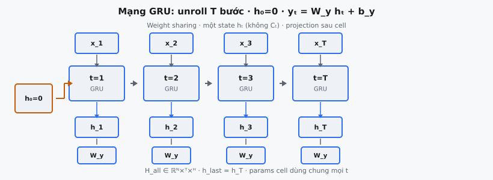
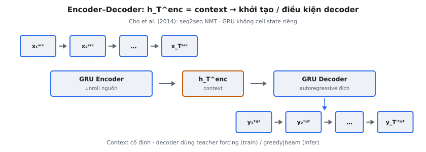

Mạng GRU hoàn chỉnh unroll một Gated Recurrent Unit cell qua mọi bước thời gian của chuỗi input, tích lũy thông tin trong hidden state, và chiếu mỗi hidden state ra output qua ánh xạ tuyến tính học được. Cho et al. (2014) giới thiệu cho encoder-decoder dịch máy; GRU xử lý chuỗi độ dài biến thiên với ít tham số hơn LSTM bằng cách gộp forget gate và input gate thành một update gate và loại bỏ cell state riêng.

## Nó là gì

Mạng GRU hoàn chỉnh là hệ thống xử lý chuỗi đầy đủ xây quanh GRU cell. GRU cell định nghĩa tính toán cho một bước thời gian, nhận $x_t$ và $h_{t-1}$ rồi tạo $h_t$. Mạng hoàn chỉnh xử lý toàn bộ chuỗi: khởi tạo $h_0$, lặp cell $T$ lần, thu mọi hidden state, và áp dụng output projection tại mỗi bước để tạo tensor output cuối.

Kiến trúc có ba thành phần. Trước hết, khởi tạo $h_0$ bằng zero với shape $(N, H)$ trong đó $N$ là batch size và $H$ là chiều hidden. Thứ hai, vòng lặp lặp áp dụng phương trình GRU cell tại mỗi $t = 1, \ldots, T$, tiêu thụ $x_t \in \mathbb{R}^{N \times I}$ và $h_{t-1} \in \mathbb{R}^{N \times H}$ để tạo $h_t \in \mathbb{R}^{N \times H}$. Thứ ba, output projection $y_t = W_y h_t + b_y$ ánh xạ mỗi hidden state từ chiều $H$ sang chiều output $O$.

Điểm khác biệt so với mạng LSTM là đơn giản cấu trúc. LSTM duy trì hai vectơ state mỗi bước ($h_t$ và cell state $c_t$), còn GRU chỉ duy trì $h_t$. Giá trị trả về cuối $h_{\text{last}}$ đơn giản là $h_T$ thay vì tuple $(h_T, c_T)$. Dù vậy, GRU đạt hiệu năng tương đương vì update gate và reset gate cung cấp kiểm soát đủ cho luồng thông tin.

::: {#fig-gru-unroll fig-cap="Mạng GRU: $h_0=\\mathbf{0}$, unroll $T$ bước (weight sharing), $y_t=W_y h_t+b_y$; một state $h_t$ (không $C_t$); $H_{\\mathrm{all}}$, $h_{\\mathrm{last}}=h_T$." fig-alt="Chuỗi cell GRU với x_t trên, h_t và W_y dưới."}
{fig-align="center"}
:::

::: {#fig-gru-encdec fig-cap="Encoder–Decoder (Cho et al. 2014): GRU encoder trên nguồn $\\to$ context $h_T^{\\mathrm{enc}}$ $\\to$ GRU decoder autoregressive sinh đích." fig-alt="Encoder nguồn, context vector, decoder đích."}
{fig-align="center"}
:::

## Các phương trình chính

GRU cell tại mỗi bước $t$ tính update gate $z_t$, reset gate $r_t$ và candidate hidden state $\tilde{h}_t$, rồi kết hợp thành $h_t$.

**Update gate:**

$$
z_t = \sigma(W_z x_t + U_z h_{t-1} + b_z)
$$

**Reset gate:**

$$
r_t = \sigma(W_r x_t + U_r h_{t-1} + b_r)
$$

**Candidate hidden state:**

$$
\tilde{h}_t = \tanh(W_h x_t + U_h (r_t \odot h_{t-1}) + b_h)
$$

**Hidden state mới:**

$$
h_t = (1 - z_t) \odot h_{t-1} + z_t \odot \tilde{h}_t
$$

Ở đây $\sigma$ là sigmoid, $\odot$ là nhân theo phần tử, $W_z, W_r, W_h \in \mathbb{R}^{I \times H}$ là trọng số input-to-hidden, $U_z, U_r, U_h \in \mathbb{R}^{H \times H}$ là trọng số hidden-to-hidden, và $b_z, b_r, b_h \in \mathbb{R}^{H}$ là bias. Update gate kiểm soát bao nhiêu state cũ được giữ so với bao nhiêu candidate được chấp nhận. Reset gate kiểm soát bao nhiêu hidden state trước tham gia tính candidate.

**Output projection (mỗi bước thời gian):**

$$
y_t = W_y h_t + b_y
$$

trong đó $W_y \in \mathbb{R}^{H \times O}$ và $b_y \in \mathbb{R}^{O}$. Mạng có hai nhóm tham số: tham số cell ($W_z, U_z, b_z, W_r, U_r, b_r, W_h, U_h, b_h$) dùng chung mọi bước thời gian, và tham số projection ($W_y, b_y$) cũng dùng chung mọi bước.

**Khởi tạo:**

$$
h_0 = \mathbf{0} \in \mathbb{R}^{N \times H}
$$

## Vòng lặp unroll

Cốt lõi mạng là vòng lặp unroll cell theo thời gian. Cho input $X \in \mathbb{R}^{N \times T \times I}$, vòng lặp trích một slice $x_t \in \mathbb{R}^{N \times I}$ tại mỗi bước, đưa cùng $h_{t-1}$ vào GRU cell, và lưu $h_t$.

- **Bước 0:** Khởi tạo $h_0 = \mathbf{0} \in \mathbb{R}^{N \times H}$.
- **Bước 1 (t=1):** Trích $x_1 = X[:, 0,:]$. Tính $h_1 = \text{GRUCell}(x_1, h_0)$. Lưu $h_1$.
- **Bước 2 (t=2):** Trích $x_2 = X[:, 1,:]$. Tính $h_2 = \text{GRUCell}(x_2, h_1)$. Lưu $h_2$.
- **Bước T:** Trích $x_T = X[:, T{-}1,:]$. Tính $h_T = \text{GRUCell}(x_T, h_{T-1})$. Lưu $h_T$.

Sau vòng lặp, mọi hidden state được xếp chồng thành $H_{\text{all}} \in \mathbb{R}^{N \times T \times H}$. Hidden state cuối $h_{\text{last}} = h_T \in \mathbb{R}^{N \times H}$ được giữ riêng.

Tính chất quan trọng là **weight sharing**: cùng tham số cell được dùng tại mọi bước thời gian. Điều này cho mạng lặp xử lý chuỗi độ dài biến thiên. Mạng huấn luyện trên chuỗi dài 10 có thể xử lý dài 100 khi inference vì cùng cell được áp dụng nhiều lần hơn. Vòng lặp phải xử lý các bước theo thứ tự vì mỗi bước phụ thuộc hidden state trước, cho phép suy luận thời gian nhưng ngăn song song hóa theo thời gian.

## Output projection

Output projection là lớp tuyến tính áp dụng độc lập tại mỗi bước thời gian. Nó ánh xạ $h_t \in \mathbb{R}^{N \times H}$ sang $y_t \in \mathbb{R}^{N \times O}$ qua $y_t = W_y h_t + b_y$. Nó tách khỏi GRU cell và dùng tham số riêng.

Sự tách này quan trọng. GRU cell duy trì hidden state như biểu diễn nén của mọi input đã thấy. Output projection trích thông tin theo tác vụ từ biểu diễn đó. Với language modeling, $O$ có thể bằng vocabulary size. Với gán nhãn chuỗi, $O$ bằng số tag. Cùng GRU cell phục vụ mọi tác vụ bằng cách chỉ đổi projection.

Projection có thể áp dụng trong vòng lặp (tính $y_t$ ngay sau $h_t$) hoặc sau vòng lặp như phép toán theo batch: $Y = H_{\text{all}} \cdot W_y + b_y$, cho $Y \in \mathbb{R}^{N \times T \times O}$. Cả hai cho kết quả giống nhau, nhưng cách theo batch hiệu quả hơn vì thay $T$ phép nhân ma trận nhỏ bằng một phép lớn. Output $Y$ chứa một vectơ mỗi bước thời gian mỗi mẫu, mẫu many-to-many.

## Khởi tạo

Hidden state ban đầu $h_0$ được đặt bằng zero với shape $(N, H)$. Đây là chuẩn trong `nn.GRU` của PyTorch và lớp GRU của TensorFlow.

**Vì sao zero?** Với $h_0 = \mathbf{0}$, bước đầu đơn giản hóa: reset gate tác động lên vectơ zero ($r_1 \odot h_0 = \mathbf{0}$), nên candidate trở thành $\tilde{h}_1 = \tanh(W_h x_1 + b_h)$, chỉ phụ thuộc input đầu. Update gate nội suy giữa $\mathbf{0}$ và $\tilde{h}_1$, nghĩa là hidden state đầu được xác định hoàn toàn bởi input đầu và bias đã học.

**Lựa chọn khác.** Một số kiến trúc học $h_0$ như tham số huấn luyện broadcast qua batch. Số khác khởi tạo $h_0$ từ output encoder, như trong encoder-decoder của Cho et al. nơi hidden state cuối encoder trở thành $h_0$ của decoder. Ở đây, $h_0 = \mathbf{0}$ được dùng vì mạng là bộ xử lý chuỗi độc lập.

## Bối cảnh bài báo

Cho et al. (2014) giới thiệu GRU trong "Learning Phrase Representations using RNN Encoder-Decoder for Statistical Machine Translation." Bài báo đề xuất hai đóng góp: GRU như lựa chọn đơn giản hơn LSTM, và kiến trúc RNN Encoder-Decoder để học biểu diễn cụm từ hữu ích cho dịch.

Trong khung encoder-decoder, GRU encoder xử lý câu nguồn từng token, xây biểu diễn nén trong hidden state. Sau token nguồn cuối, $h_T^{\text{enc}}$ cuối của encoder phục vụ như context vector độ dài cố định. GRU decoder sinh câu đích có điều kiện trên context này và các token đã sinh trước đó.

Bài báo nêu: "The GRU is similar to the LSTM but without a separate memory cell." Trực giác thiết kế là forget gate và input gate của LSTM dư thừa khi gộp lại. Update gate $z_t$ của GRU đồng thời kiểm soát cần quên gì ($1 - z_t$) và chấp nhận gì ($z_t$), giảm tham số bằng cách loại một gate và cell state riêng. Cho et al. đánh giá trên WMT'14 English-to-French, dùng biểu diễn cụm từ học được để rescore giả thuyết dịch, cải thiện BLEU so với baseline.

Mạng hoàn chỉnh trong phần này tương ứng một nửa encoder-decoder. Output projection $y_t = W_y h_t + b_y$ sẽ tạo logits trên vocabulary đích trong dịch. Ở encoder, projection có thể bỏ qua vì chỉ hidden state cuối quan trọng. Phần này bao gồm projection để mạng trở thành bộ ánh xạ chuỗi đa mục đích.

## Xử lý chuỗi

Thông tin chảy về phía trước theo thời gian. Ở bước 1, $h_1$ mã hóa chỉ $x_1$. Ở bước 2, $h_2$ mã hóa cả $x_1$ và $x_2$ vì $h_1$ đi vào cell cùng $x_2$. Đến bước $T$, $h_T$ đã bị ảnh hưởng bởi mọi input $x_1, \ldots, x_T$.

Hidden state là bộ nhớ mạng: vectơ kích thước cố định chiều $H$ bất kể độ dài chuỗi. GRU phải nén mọi thông tin liên quan vào biểu diễn này. Update gate quyết định bao nhiêu bộ nhớ cũ giữ so với ghi đè, và reset gate quyết định phần nào bộ nhớ cũ liên quan để tính candidate mới.

Thực tế, GRU thiên về input gần. Thông tin từ $x_1$ phải sống sót qua $T{-}1$ phép gate để còn trong $h_T$. Dù gating giảm vấn đề vanishing gradient (gradient chảy qua đường $(1 - z_t)$), ảnh hưởng biểu diễn của token sớm vẫn suy giảm trên chuỗi dài. Điều này thúc đẩy cơ chế attention, cho phép truy cập trực tiếp hidden state bất kỳ bước nào mà không phụ thuộc chuỗi lặp.

## Ví dụ số

Truy vết mạng GRU hoàn chỉnh với $N=1$, $T=3$, $I=2$, $H=2$, $O=2$.

**Trọng số GRU cell:**

$$
W_z = \begin{bmatrix} 0.1 & 0.2 \\ 0.3 & 0.4 \end{bmatrix}, \; U_z = \begin{bmatrix} 0.1 & 0.0 \\ 0.0 & 0.1 \end{bmatrix}, \; b_z = \begin{bmatrix} 0 \\ 0 \end{bmatrix}
$$

$$
W_r = \begin{bmatrix} 0.2 & 0.1 \\ 0.4 & 0.3 \end{bmatrix}, \; U_r = \begin{bmatrix} 0.1 & 0.0 \\ 0.0 & 0.1 \end{bmatrix}, \; b_r = \begin{bmatrix} 0 \\ 0 \end{bmatrix}
$$

$$
W_h = \begin{bmatrix} 0.3 & 0.1 \\ 0.1 & 0.3 \end{bmatrix}, \; U_h = \begin{bmatrix} 0.2 & 0.0 \\ 0.0 & 0.2 \end{bmatrix}, \; b_h = \begin{bmatrix} 0 \\ 0 \end{bmatrix}
$$

**Output projection:**

$$
W_y = \begin{bmatrix} 1.0 & 0.5 \\ 0.5 & 1.0 \end{bmatrix}, \quad b_y = \begin{bmatrix} 0.1 \\ 0.1 \end{bmatrix}
$$

**Input:** $X = [[1.0, 0.5],\; [0.5, 1.0],\; [0.0, 0.5]]$ (shape $1 \times 3 \times 2$).

**Bước 0 — Khởi tạo.** $h_0 = [0, 0]$.

**Bước 1 ($x_1 = [1.0, 0.5]$):** $z_1 = \sigma([0.20, 0.50]) = [0.5500, 0.6225]$. $r_1 = \sigma([0.25, 0.55]) = [0.5622, 0.6341]$. Vì $h_0 = \mathbf{0}$, $\tilde{h}_1 = \tanh([0.35, 0.25]) = [0.3364, 0.2449]$. $h_1 = z_1 \odot \tilde{h}_1 = [0.1850, 0.1524]$. $y_1 = W_y h_1 + b_y = [0.3612, 0.3449]$.

**Bước 2 ($x_2 = [0.5, 1.0]$):** $z_2 = \sigma([0.2685, 0.5652]) = [0.5667, 0.6376]$. $r_2 = \sigma([0.2185, 0.5152]) = [0.5544, 0.6260]$. $\tilde{h}_2 = \tanh([0.2705, 0.3691]) = [0.2638, 0.3539]$. $h_2 = (1{-}z_2) \odot h_1 + z_2 \odot \tilde{h}_2 = [0.2297, 0.2809]$. $y_2 = [0.4702, 0.4958]$.

**Bước 3 ($x_3 = [0.0, 0.5]$):** $z_3 = \sigma([0.1230, 0.2281]) = [0.5307, 0.5568]$. $r_3 = \sigma([0.0730, 0.1781]) = [0.5182, 0.5444]$. $\tilde{h}_3 = \tanh([0.0738, 0.1806]) = [0.0737, 0.1787]$. $h_3 = (1{-}z_3) \odot h_2 + z_3 \odot \tilde{h}_3 = [0.1469, 0.2240]$. $y_3 = [0.3589, 0.3975]$.

**Kết quả cuối:** $y = [[[0.3612, 0.3449],\; [0.4702, 0.4958],\; [0.3589, 0.3975]]]$ với shape $(1, 3, 2)$. $h_{\text{last}} = [[0.1469, 0.2240]]$ với shape $(1, 2)$.

Hidden state tiến hóa: $h_1$ phản ánh chỉ $x_1$, $h_2$ trộn $x_1$ và $x_2$, $h_3$ mang cả ba. Giá trị update gate khoảng 0.53–0.64 cho thấy mỗi bước khoảng một nửa state cũ và một nửa candidate mới.

## GRU hai chiều và xếp chồng

**Bidirectional GRU.** Bidirectional GRU chạy hai mạng riêng trên cùng input: một forward ($t = 1$ đến $T$) và một backward ($t = T$ đến $1$), mỗi bên có tham số riêng. Tại mỗi bước, forward state $\overrightarrow{h}_t$ nắm ngữ cảnh quá khứ và backward state $\overleftarrow{h}_t$ nắm ngữ cảnh tương lai. Chúng được nối: $h_t^{\text{bi}} = [\overrightarrow{h}_t; \overleftarrow{h}_t] \in \mathbb{R}^{2H}$, nên $W_y$ phải là $(2H, O)$. Bidirectional GRU là chuẩn cho tác vụ toàn chuỗi có sẵn, như nhận dạng thực thể có tên.

**Stacked GRU.** Xếp chồng dùng hidden state của một lớp GRU làm input lớp sau. Lớp 1 tạo $h_t^{(1)}$, trở thành $x_t^{(2)}$ cho lớp 2. Mỗi lớp có tham số riêng. Output projection áp dụng lên lớp trên cùng: $y_t = W_y h_t^{(L)} + b_y$. Lớp thấp nắm mẫu cục bộ; lớp cao nắm mẫu trừu tượng. Cho et al. (2014) dùng GRU một lớp, nhưng mạng lặp sâu hơn sau đó mạnh hơn trên tác vụ phức tạp.

## Các lỗi thường gặp

**1. Sai hướng vòng lặp.**

Vòng lặp phải duyệt $t = 1, 2, \ldots, T$. Đảo thứ tự khiến $h_T$ chỉ phụ thuộc $x_T$ và $h_1$ phụ thuộc mọi input — đó là backward GRU, không phải forward.

**2. Quên lưu hidden state trung gian.**

Chỉ giữ $h_T$ và bỏ $h_1, \ldots, h_{T-1}$ nghĩa là output projection không thể tính $y_1, \ldots, y_{T-1}$. Append mỗi $h_t$ vào danh sách trong vòng lặp. Không làm vậy, output có shape $(N, 1, O)$ thay vì $(N, T, O)$.

**3. $h_{\text{last}}$ là $h_T$, không phải $h_0$.**

Giá trị trả về $h_{\text{last}}$ là hidden state sau xử lý toàn chuỗi, không phải khởi tạo zero. Dễ nhầm trả tham chiếu cũ trước vòng lặp.

**4. Lệch chiều output projection.**

$W_y$ phải là $(H, O)$, không phải $(I, O)$ hay $(O, H)$. Projection tác động lên hidden state, không phải input. $h_t$ là $(N, H)$ và $W_y$ phải là $(H, O)$ để tạo $(N, O)$.

**5. Không khởi tạo $h_0$.**

Nếu $h_0$ chứa giá trị rác, mọi state sau bị hỏng vì phương trình GRU phụ thuộc $h_{t-1}$. Luôn đặt $h_0 = \mathbf{0}$ với shape $(N, H)$. Dùng shape $(H,)$ không có chiều batch gây lỗi broadcasting.

**6. Áp dụng output projection bên trong GRU cell.**

Projection $y_t = W_y h_t + b_y$ không thuộc cell. Trộn vào cell nghĩa là $y_t$ tham gia recurrence, thay đổi cơ bản kiến trúc. Recurrence tác động lên $h_t$; projection là read-out riêng.

**7. Nhầm $y_T$ với $h_{\text{last}}$.**

$y_T \in \mathbb{R}^{N \times O}$ và $h_T \in \mathbb{R}^{N \times H}$ là tensor khác nhau với chiều có thể khác. Hàm trả về $(Y, h_T)$, không phải $(Y, y_T)$.


## Code
```python
import numpy as np

def sigmoid(x):
    return 1 / (1 + np.exp(-np.clip(x, -500, 500)))

def gru_cell(x_t: np.ndarray, h_prev: np.ndarray,
             W_r: np.ndarray, W_z: np.ndarray, W_h: np.ndarray,
             b_r: np.ndarray, b_z: np.ndarray, b_h: np.ndarray) -> np.ndarray:
    concat = np.concatenate([h_prev, x_t], axis=-1)
    r_t = sigmoid(concat @ W_r.T + b_r)
    z_t = sigmoid(concat @ W_z.T + b_z)
    gated_h = r_t * h_prev
    concat_h = np.concatenate([gated_h, x_t], axis=-1)
    h_tilde = np.tanh(concat_h @ W_h.T + b_h)
    h_t = z_t * h_prev + (1 - z_t) * h_tilde
    return h_t

```
