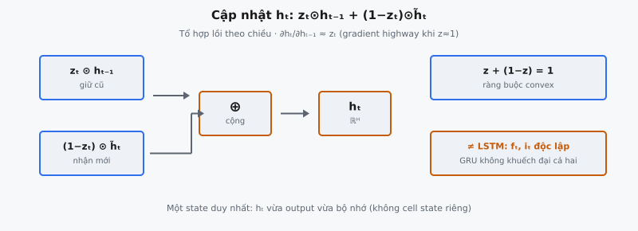

Hidden state update là bước cuối trong GRU cell, nơi hidden state mới $h_t$ được tạo bằng nội suy tuyến tính giữa hidden state trước $h_{t-1}$ và candidate activation $\tilde{h}_t$. Công thức Cho et al. (2014) mô tả cho phép GRU chọn lọc nhớ hoặc ghi đè thông tin tại mỗi time step.

## Nó là gì

Sau khi reset gate tạo candidate activation $\tilde{h}_t$ và update gate tạo hệ số trộn $z_t$, GRU phải kết hợp hidden state cũ với candidate mới thành một output duy nhất. Hidden state update thực hiện kết hợp này qua **nội suy tuyến tính**: trung bình có trọng số mà trọng số tại mỗi chiều cộng đúng bằng một.

Kết quả $h_t$ có vai trò kép. Nó vừa là **output** của GRU cell tại time step $t$ (khác LSTM có cell state và hidden state riêng), vừa là **bộ nhớ** mang sang time step $t+1$. Công thức nội suy đồng thời quyết output gì và nhớ gì.

Bản thân nội suy không cần thêm tham số. Update gate $z_t$ đã được tính bằng ma trận trọng số học được. Hidden state update chỉ là phép số học pointwise: nhân, trừ, nhân, cộng. Dù đơn giản, đây là cách GRU học khi nào duy trì bộ nhớ dài hạn và khi nào tích hợp thông tin mới.

::: {#fig-gru-hidden fig-cap="Cập nhật $h_t=z_t\\odot h_{t-1}+(1-z_t)\\odot\\tilde{h}_t$: tổ hợp lồi ($z+(1-z)=1$). Khác LSTM: $f_t,i_t$ độc lập; GRU không khuếch đại cả cũ và mới trên cùng chiều." fig-alt="Hai nhánh z⊙h_old và (1-z)⊙h̃ cộng thành h_t."}
{fig-align="center"}
:::

## Các phương trình chính

### Công thức nội suy

$$
h_t = z_t \odot h_{t-1} + (1 - z_t) \odot \tilde{h}_t
$$

trong đó:

- $h_t \in \mathbb{R}^H$ là **hidden state mới** (output của time step này)
- $z_t \in (0, 1)^H$ là output **update gate** (tính trước đó trong pipeline)
- $h_{t-1} \in \mathbb{R}^H$ là **hidden state trước** (bộ nhớ từ time step trước)
- $\tilde{h}_t \in (-1, 1)^H$ là **candidate hidden state** (thông tin mới qua reset gate)
- $\odot$ là **phép nhân element-wise (Hadamard)**, không phải nhân ma trận

### Dạng theo từng chiều

Với mỗi chiều hidden $k$ (với $k = 1, 2, \ldots, H$):

$$
h_t^{(k)} = z_t^{(k)} \cdot h_{t-1}^{(k)} + (1 - z_t^{(k)}) \cdot \tilde{h}_t^{(k)}
$$

Mỗi chiều hoạt động độc lập. Chiều $k$ có giá trị gate riêng $z_t^{(k)}$ điều khiển giữ bao nhiêu giá trị cũ so với chấp nhận bao nhiêu candidate mới.

### Ràng buộc bổ sung

$$
z_t^{(k)} + (1 - z_t^{(k)}) = 1 \quad \forall \, k
$$

Vì $z_t$ từ sigmoid có khoảng $(0, 1)$, cả $z_t$ và $(1 - z_t)$ đều dương nghiêm và cộng bằng một. Output $h_t$ là **tổ hợp lồi** của $h_{t-1}$ và $\tilde{h}_t$, luôn nằm trên đoạn thẳng giữa chúng theo từng chiều.

## Tại sao nội suy tuyến tính

### Trộn mượt giữa cũ và mới

Nội suy tuyến tính cho phổ liên tục từ giữ hoàn toàn trạng thái cũ ($z = 1$) đến thay hoàn toàn bằng candidate mới ($z = 0$). Giá trị trung gian tạo trộn mượt. Trong huấn luyện, gradient có thể đẩy $z_t$ từng bước, giúp mạng học chính sách bộ nhớ tinh thay vì công tắc nhị phân cứng.

### Kiểm soát độc lập theo chiều

Mỗi chiều hidden có giá trị gate riêng. Với hidden state size $H = 256$, có 256 quyết định nội suy độc lập mỗi time step. Chiều 12 có thể giữ 95% giá trị cũ (theo dõi chủ đề câu), chiều 47 thay 80% (thích ứng từ hiện tại). Độc lập theo chiều cho phép một vectơ hidden state duy trì nhiều timescale thông tin.

### Tính chất gradient

Số hạng $z_t \odot h_{t-1}$ tạo **đường tuyến tính trực tiếp** từ $h_{t-1}$ đến $h_t$. Khi $z_t \approx 1$, gradient $\partial h_t / \partial h_{t-1} \approx 1$ theo chiều đó. Các chiều cần giữ thông tin qua nhiều time step học giữ $z_t$ gần 1, tạo "gradient highway" tương tự skip connection trong residual network.

## Độc lập theo từng chiều

Hidden state update không phải một quyết định toàn cục mà $H$ quyết định cục bộ độc lập. Xét GRU với $H = 4$:

- $z_t = [0.95, \; 0.10, \; 0.50, \; 0.02]$

Nghĩa là:

- **Chiều 0** ($z = 0.95$): Giữ 95% cũ, lấy 5% mới. Chế độ bộ nhớ.
- **Chiều 1** ($z = 0.10$): Giữ 10% cũ, lấy 90% mới. Chế độ cập nhật.
- **Chiều 2** ($z = 0.50$): Trộn đều. Chuyển tiếp mượt.
- **Chiều 3** ($z = 0.02$): Gần thay hoàn toàn, hiệu quả như reset.

Cả bốn hành vi xảy ra đồng thời. Mạng học chiều nào là kênh bộ nhớ dài hạn, chiều nào phản ứng input mới. Nếu update gate cho một scalar cho cả hidden state, mọi chiều cập nhật cùng tốc độ, hạn chế mạnh biểu đạt.

## Pipeline GRU đầy đủ

### Bước 1: Update gate

$$
z_t = \sigma(W_z x_t + U_z h_{t-1} + b_z)
$$

Quyết theo chiều giữ bao nhiêu trạng thái cũ. Khoảng output: $(0, 1)^H$.

### Bước 2: Reset gate

$$
r_t = \sigma(W_r x_t + U_r h_{t-1} + b_r)
$$

Quyết mức hidden state trước ảnh hưởng candidate. Khi $r_t \approx 0$, candidate bỏ qua hoàn toàn trạng thái trước.

### Bước 3: Candidate hidden state

$$
\tilde{h}_t = \tanh(W_h x_t + U_h (r_t \odot h_{t-1}) + b_h)
$$

"Nội dung mới đề xuất." Reset gate điều chỉnh mức $h_{t-1}$ tham gia. Tanh nén kết quả vào $(-1, 1)$.

### Bước 4: Hidden state update (bài này)

$$
h_t = z_t \odot h_{t-1} + (1 - z_t) \odot \tilde{h}_t
$$

Trộn cũ và mới. **Reset gate** điều khiển gì vào candidate (Bước 3), **update gate** điều khiển bao nhiêu candidate đến trạng thái cuối (Bước 4).

## Bối cảnh bài báo

### Cho et al. (2014)

Trong "Learning Phrase Representations using RNN Encoder-Decoder for Statistical Machine Translation," hidden state update xuất hiện ở Phương trình 5. Tác giả nêu: "The actual activation of the proposed unit $h_j^t$ is then a linear interpolation between the previous activation $h_j^{t-1}$ and the candidate activation $\tilde{h}_j^t$."

### Leaky integration

Hidden state update là dạng **leaky integration** từ xử lý tín hiệu và khoa học thần kinh. Trong leaky integrator, trạng thái hiện tại là tổng có trọng số của trạng thái trước (suy hao bởi hệ số rò) và input mới. $z_t$ của GRU đóng vai hệ số rò, nhưng khác leaky integrator cổ điển có hệ số cố định, GRU học nó động như hàm của input và trạng thái.

### Cho phép bộ nhớ dài hạn

RNN chuẩn tính $h_t = \tanh(W x_t + U h_{t-1})$, ghi đè hoàn toàn hidden state mỗi bước. Công thức nội suy GRU cung cấp cơ chế bảo toàn chọn lọc: đặt $z_t$ gần 1, mạng sao chép thông tin qua nhiều time step với suy giảm tối thiểu, tương tự skip connection trong residual network.

## Ví dụ số

### Thiết lập

GRU với hidden size $H = 4$, một mẫu ($N = 1$):

$$
z_t = [0.8, \; 0.2, \; 0.6, \; 0.1]
$$

$$
h_{t-1} = [1.0, \; -0.5, \; 0.3, \; 2.0]
$$

$$
\tilde{h}_t = [-0.4, \; 0.9, \; 0.7, \; -1.0]
$$

### Bước 1: Tính $z_t \odot h_{t-1}$

- Chiều 0: $0.8 \times 1.0 = 0.80$
- Chiều 1: $0.2 \times (-0.5) = -0.10$
- Chiều 2: $0.6 \times 0.3 = 0.18$
- Chiều 3: $0.1 \times 2.0 = 0.20$

$$
z_t \odot h_{t-1} = [0.80, \; -0.10, \; 0.18, \; 0.20]
$$

### Bước 2: Tính $(1 - z_t)$

$$
(1 - z_t) = [0.2, \; 0.8, \; 0.4, \; 0.9]
$$

### Bước 3: Tính $(1 - z_t) \odot \tilde{h}_t$

- Chiều 0: $0.2 \times (-0.4) = -0.08$
- Chiều 1: $0.8 \times 0.9 = 0.72$
- Chiều 2: $0.4 \times 0.7 = 0.28$
- Chiều 3: $0.9 \times (-1.0) = -0.90$

$$
(1 - z_t) \odot \tilde{h}_t = [-0.08, \; 0.72, \; 0.28, \; -0.90]
$$

### Bước 4: Cộng hai số hạng

- Chiều 0: $0.80 + (-0.08) = 0.72$
- Chiều 1: $-0.10 + 0.72 = 0.62$
- Chiều 2: $0.18 + 0.28 = 0.46$
- Chiều 3: $0.20 + (-0.90) = -0.70$

$$
h_t = [0.72, \; 0.62, \; 0.46, \; -0.70]
$$

### Diễn giải kết quả

- **Chiều 0** ($z = 0.8$): Cũ $= 1.0$, candidate $= -0.4$, kết quả $= 0.72$. $z$ cao giữ phần lớn giá trị cũ.
- **Chiều 1** ($z = 0.2$): Cũ $= -0.5$, candidate $= 0.9$, kết quả $= 0.62$. $z$ thấp nghiêng mạnh về candidate.
- **Chiều 2** ($z = 0.6$): Cũ $= 0.3$, candidate $= 0.7$, kết quả $= 0.46$. $z$ vừa trộn đều.
- **Chiều 3** ($z = 0.1$): Cũ $= 2.0$, candidate $= -1.0$, kết quả $= -0.70$. $z$ rất thấp gần như thay hoàn toàn.

## Liên hệ với LSTM

### Cập nhật cell state LSTM

$$
c_t = f_t \odot c_{t-1} + i_t \odot \tilde{c}_t
$$

LSTM dùng hai gate riêng: $f_t$ (forget gate) và $i_t$ (input gate), tính bởi ma trận trọng số riêng. $f_t + i_t$ không bị ràng buộc bằng 1.

### Thiết kế bổ sung của GRU

$$
h_t = z_t \odot h_{t-1} + (1 - z_t) \odot \tilde{h}_t
$$

GRU dùng một gate $z_t$ thay cả hai. $z_t$ đóng vai forget gate và $(1 - z_t)$ đóng vai input gate, liên kết bởi ràng buộc bổ sung.

### Khác biệt thực tế

- **LSTM**: Có thể $f_t = 0.9$ và $i_t = 0.9$ đồng thời, giữ 90% cũ VÀ thêm 90% mới. Độ lớn cell state có thể tăng.
- **GRU**: Nếu $z_t = 0.9$, thì $(1 - z_t) = 0.1$. Giữ và thay là **trò chơi sum-zero**. Hidden state có giới hạn.
- **LSTM**: Có output gate $o_t$ lọc cell state: $h_t = o_t \odot \tanh(c_t)$. GRU phơi bày $h_t$ trực tiếp.

GRU đổi linh hoạt (gate độc lập, cell/hidden state tách) lấy đơn giản: 3 ma trận gate thay vì 4. Cho et al. (2014) và Chung et al. (2014) cho thấy đánh đổi này thường có lợi, đặc biệt khi dữ liệu huấn luyện hạn chế.

## Gradient flow

### Đạo hàm qua nội suy

$$
\frac{\partial h_t}{\partial h_{t-1}} = \text{diag}(z_t) + \text{diag}(1 - z_t) \cdot \frac{\partial \tilde{h}_t}{\partial h_{t-1}} + \text{terms from } \frac{\partial z_t}{\partial h_{t-1}}
$$

Số hạng đầu, $\text{diag}(z_t)$, tạo **đường cộng trực tiếp** từ $h_{t-1}$ đến $h_t$. Khi $z_t^{(k)} \approx 1$, gradient cho chiều $k$ đi qua với độ lớn gần đơn vị.

### Gradient highway

Với chiều mà $z_\tau^{(k)} \approx 1$ qua các time step $t+1$ đến $T$:

$$
\prod_{\tau=t+1}^{T} z_\tau^{(k)} \approx 1
$$

Khác vanilla RNN nơi gradient đi qua tanh mỗi bước (suy giảm theo cấp số nhân), GRU cung cấp đường tắt tuyến tính. Gradient đi qua nhiều time step không vanish, miễn update gate giữ các chiều đó mở.

### Hai đường gradient

- **Đường trực tiếp** ($z_t \odot h_{t-1}$): Gradient scale bởi $z_t$. "Memory highway" ngăn vanishing gradient.
- **Đường candidate** ($(1 - z_t) \odot \tilde{h}_t$): Gradient chảy qua tanh và reset gate. Bị suy giảm nhưng cần để học biểu diễn mới.

Cả hai đường đóng góp đồng thời. Đường trực tiếp đảm bảo tín hiệu học đến time step sớm hơn dù gradient đường candidate nhỏ, tương tự residual connection trong feedforward network.

## Các lỗi thường gặp

### Hoán $z_t$ và $(1 - z_t)$

Viết $h_t = (1 - z_t) \odot h_{t-1} + z_t \odot \tilde{h}_t$ đảo ngữ nghĩa: $z = 1$ nghĩa là "lấy candidate" thay vì "giữ trạng thái cũ." Công thức đúng có $z_t$ nhân $h_{t-1}$. Gợi nhớ: $z$ là "lazy gate" — $z$ cao nghĩa là đơn vị không cập nhật.

### Dùng nhân ma trận thay element-wise

Ký hiệu $\odot$ nghĩa là nhân element-wise. Cả $z_t$ và $h_{t-1}$ có shape $(N, H)$, kết quả shape $(N, H)$. Dùng `np.matmul` hoặc `@` thay `*` gây lỗi shape hoặc kết quả sai im lặng.

### Nhầm bước này với phép tính candidate

Phép tính candidate dùng **reset gate** $r_t$ và áp tanh. Hidden state update dùng **update gate** $z_t$ và **không có phi tuyến**. Học viên đôi khi áp tanh lên output cuối hoặc dùng $r_t$ thay $z_t$.

### Quên phần bổ sung

Tính $h_t = z_t \odot h_{t-1} + z_t \odot \tilde{h}_t$ (dùng $z_t$ cho cả hai số hạng) phá tổ hợp lồi. Hệ số không còn cộng bằng một, độ lớn hidden state trôi dần. Phần bổ sung $(1 - z_t)$ là thiết yếu.

### Cho rằng $z = 1$ nghĩa là "cập nhật"

Tên "update gate" dễ gây hiểu nhầm. Khi $z_t = 1$: $h_t = 1 \cdot h_{t-1} + 0 \cdot \tilde{h}_t = h_{t-1}$. Đơn vị **không** cập nhật. Khi $z_t = 0$: $h_t = 0 \cdot h_{t-1} + 1 \cdot \tilde{h}_t = \tilde{h}_t$. Cập nhật đầy đủ. Giá trị gate biểu thị mức **giữ**, không phải mức **thay đổi**.

### Bỏ qua chiều batch

Mọi tensor có shape $(N, H)$ với $N$ là batch size. Nội suy chạy độc lập theo mẫu. Reshape sai có thể gây nhiễm chéo giữa mẫu. Phép toán element-wise broadcast đúng qua chiều batch mà không cần xử lý đặc biệt.


## Code
```python
import numpy as np

def hidden_update(h_prev: np.ndarray, h_tilde: np.ndarray,
                  z_t: np.ndarray) -> np.ndarray:
    h_t = z_t * h_prev + (1 - z_t) * h_tilde
    return h_t

```
