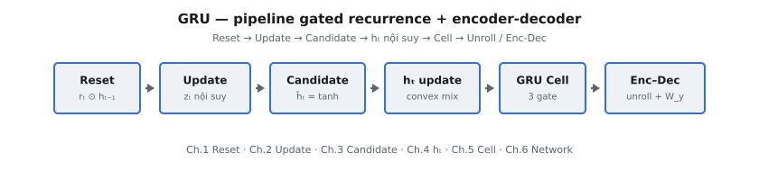

Gated Recurrent Unit (GRU) là kiến trúc recurrent có gate được tinh gọn, đơn giản hóa LSTM trong khi vẫn giữ khả năng mô hình hóa long-range dependency tốt hơn Vanilla RNN. Trong bối cảnh encoder-decoder, GRU được dùng rộng rãi cho ánh xạ sequence-to-sequence, trong đó một sequence (nguồn) được biến đổi thành sequence khác (đích).

::: {#fig-gru-pipeline fig-cap="Pipeline GRU: Reset ($r_t\\odot h_{t-1}$) → Update ($z_t$) → Candidate ($\\tilde{h}_t$) → nội suy $h_t$ → cell → Enc–Dec / unroll + $W_y$." fig-alt="Sơ đồ khối ngang từ Reset gate tới Encoder-Decoder."}
{fig-align="center"}
:::

GRU gộp bộ nhớ và biểu diễn hidden vào một trạng thái duy nhất và dùng hai gate: reset và update. Điều này giảm số tham số và chi phí tính toán so với LSTM, đồng thời vẫn cung cấp điều khiển thích ứng luồng thông tin ngắn hạn so với dài hạn.

## Phần này bao gồm những gì

Chuỗi chương này tổ chức quanh nội tại GRU và hành vi seq2seq đầy đủ:

1. Reset gate và cách dùng có chọn lọc hidden state trước đó — gate điều khiển mức độ từng chiều của $h_{t-1}$ tham gia vào phép tính candidate hidden state.
2. Update gate và điều khiển nội suy trạng thái — gate quyết định giữ bao nhiêu hidden state cũ so với chấp nhận candidate mới tại mỗi time step.
3. Xây dựng candidate hidden state — kết hợp input hiện tại với hidden state đã qua reset gate để tạo đề xuất cập nhật mới qua tanh.
4. Quy tắc cập nhật hidden state cuối cùng — phương trình nội suy convex kết hợp $h_{t-1}$ và $\tilde{h}_t$ theo update gate.
5. GRU cell hoàn chỉnh dưới dạng một đơn vị recurrent — lắp ráp reset gate, update gate, candidate và cập nhật hidden state thành một cell thống nhất.
6. Pipeline mạng GRU encoder-decoder đầy đủ — unroll encoder trên sequence nguồn, truyền context sang decoder và sinh sequence đích theo kiểu autoregressive.

Tiến trình này phản ánh thứ tự phụ thuộc toán học trong các phương trình GRU.

## Tại sao GRU vẫn quan trọng

Họ mô hình này là điểm giữa thực dụng giữa sự đơn giản của Vanilla RNN và tính biểu đạt của LSTM:

* ít tham số hơn LSTM, thường cho hiệu năng tương đương,
* huấn luyện và suy luận hiệu quả trên sequence độ dài trung bình,
* và từng giữ vai trò trung tâm trong neural machine translation trước Transformer.

Nghiên cứu GRU encoder-decoder cũng xây dựng trực giác cho các mô hình sequence dựa trên attention sau này.

## Kiến thức tiên quyết

* Recurrence Vanilla RNN và cập nhật hidden state.
* Cơ bản về học sequence-to-sequence (sequence nguồn so với sequence đích).
* Hàm kích hoạt phi tuyến và trực giác gating.
* Khái niệm teacher forcing và giải mã autoregressive.

## Ký hiệu được sử dụng trong phần này

$$
\begin{aligned}
x_t &:\ \text{input encoder (hoặc decoder) tại time step } t, \\
h_t &:\ \text{hidden state GRU}, \\
r_t, z_t &:\ \text{reset gate và update gate}, \\
\tilde{h}_t &:\ \text{candidate hidden state}, \\
h_t &= (1-z_t)\odot \tilde{h}_t + z_t \odot h_{t-1}.
\end{aligned}
$$

<!-- CROSSLINK_THEORY_GRU -->

::: {.callout-tip}
## Ôn nền tảng
Forward một cell GRU: [Theory AI — Mini GRU Cell](../../theory-ai/09-deep-learning/build-a-mini-gru-cell-forward-pass.qmd).
:::
