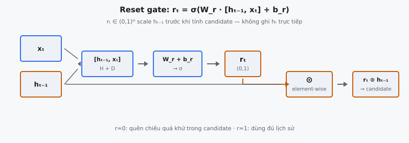

Reset gate là một trong hai cơ chế gating bên trong Gated Recurrent Unit (GRU), được Cho et al. (2014) giới thiệu trong "Learning Phrase Representations using RNN Encoder-Decoder for Statistical Machine Translation." Nó điều khiển mức độ hidden state trước đó chảy vào phép tính candidate activation, cho phép mạng quên có chọn lọc lịch sử không liên quan khi xây dựng đề xuất bộ nhớ mới.

## Nó là gì

Reset gate tạo ra vectơ $\mathbf{r}_t \in (0, 1)^H$ tại mỗi time step $t$, trong đó $H$ là số chiều hidden state. Mỗi phần tử hoạt động như công tắc mềm điều khiển mức độ chiều tương ứng của $\mathbf{h}_{t-1}$ tham gia vào tính candidate hidden state $\tilde{\mathbf{h}}_t$. Giá trị gần 1 cho phép chiều hidden đó đi qua; giá trị gần 0 xóa nó, buộc candidate chủ yếu dựa vào input hiện tại.

Reset gate nằm upstream của phép tính candidate. Nó không trực tiếp quyết định hidden state cuối cùng; nó định hình nguyên liệu thô để xây candidate. Một update gate riêng sau đó quyết định bao nhiêu phần đề xuất này thay thế trạng thái cũ. Reset gate điều khiển mạng đề xuất thông tin mới gì, còn update gate điều khiển mức độ chấp nhận đề xuất đó.

::: {#fig-gru-reset fig-cap="Reset gate: $r_t=\\sigma(W_r\\cdot[h_{t-1},x_t]+b_r)$, rồi $r_t\\odot h_{t-1}$ vào candidate. $r\\approx 0$ quên chiều quá khứ; $r\\approx 1$ dùng đủ lịch sử." fig-alt="Luồng concat, W_r, sigmoid ra r_t, nhân element-wise với h_t-1."}
{fig-align="center"}
:::

## Các phương trình chính

Hidden state trước $\mathbf{h}_{t-1} \in \mathbb{R}^H$ và input hiện tại $\mathbf{x}_t \in \mathbb{R}^D$ trước hết được nối thành một vectơ $[\mathbf{h}_{t-1}, \mathbf{x}_t] \in \mathbb{R}^{H+D}$. Thứ tự nối quan trọng: theo Cho et al. (2014), hidden state đứng trước, input đứng sau, và phải nhất quán với cách $\mathbf{W}_r$ được cấu trúc.

Vectơ nối được nhân với ma trận trọng số học được $\mathbf{W}_r \in \mathbb{R}^{H \times (H+D)}$, cộng bias $\mathbf{b}_r \in \mathbb{R}^H$, rồi đi qua sigmoid element-wise:

$$
\mathbf{r}_t = \sigma(\mathbf{W}_r \cdot [\mathbf{h}_{t-1}, \mathbf{x}_t] + \mathbf{b}_r)
$$

Sigmoid nén từng phần tử độc lập vào $(0, 1)$, tạo ra $H$ giá trị gate. Đầu ra reset gate sau đó được áp dụng qua phép nhân element-wise với $\mathbf{h}_{t-1}$ bên trong phép tính candidate:

$$
\tilde{\mathbf{h}}_t = \tanh(\mathbf{W} \cdot [\mathbf{r}_t \odot \mathbf{h}_{t-1}, \mathbf{x}_t] + \mathbf{b})
$$

Ở đây $\odot$ ký hiệu tích Hadamard (element-wise). Số hạng $\mathbf{r}_t \odot \mathbf{h}_{t-1}$ scale từng chiều của hidden state trước theo giá trị reset gate tương ứng. Khi $r_{t,j} \approx 0$, chiều $j$ của $\mathbf{h}_{t-1}$ bị zero hóa và candidate được tính gần như hoàn toàn từ $\mathbf{x}_t$.

## Tại sao cần reset gate

Vanilla RNN tiêu chuẩn tính hidden state như hàm cố định của trạng thái trước và input hiện tại, không có cơ chế kìm áp có chọn lọc lịch sử không liên quan. Thông tin cũ tồn tại dai dẳng và làm nhiễu các phép tính sau. Khi mạng gặp thay đổi ngữ cảnh đột ngột, nó phải ghi đè trạng thái cũ dần qua nhiều time step thay vì khởi đầu sạch.

Reset gate giải quyết điều này bằng khả năng học được, phụ thuộc input để bỏ qua các chiều trạng thái quá khứ. Xét encoder dịch máy xử lý "The cat sat on the mat. Meanwhile, stock prices surged." Khi encoder đến "Meanwhile," reset gate có thể kích hoạt (giá trị gần 0) để kìm các đặc trưng hidden state mã hóa "cat" và "mat," vì chúng không liên quan đến mệnh đề tài chính.

Không có reset gate, candidate luôn thấy toàn bộ hidden state trước. Mạng vẫn có thể cố học bỏ qua thông tin quá khứ chỉ qua ma trận trọng số candidate, nhưng kém linh hoạt hơn nhiều. Reset gate cung cấp cơ chế tường minh, động để zero hóa các chiều quá khứ — cách trực tiếp và tiết kiệm tham số hơn để đạt quên có chọn lọc.

Reset gate cũng quan trọng cho phụ thuộc ngắn hạn. Khi $\mathbf{r}_t$ gần zero trên mọi chiều, candidate hành xử giống hidden state đầu tiên trong sequence, phản hồi chủ yếu vào input hiện tại.

## Sigmoid như công tắc mềm

Sigmoid $\sigma(x) = \frac{1}{1 + e^{-x}}$ được dùng cho reset gate vì nhiều tính chất khiến nó lý tưởng cho gating.

**Khoảng đầu ra $[0, 1]$.** Sigmoid ánh xạ mọi input thực vào $(0, 1)$, cần thiết cho gate nhân: 0 nghĩa là "chặn hoàn toàn" và 1 nghĩa là "cho đi qua hoàn toàn." ReLU không bị chặn trên, tanh cho $(-1, 1)$ cho phép đảo dấu, và softmax ép tổng bằng một theo các chiều. Không cái nào phù hợp gating độc lập theo từng chiều.

**Mượt và khả vi.** Gradient chảy qua gate trong backpropagation through time. Đạo hàm có dạng đơn giản:

$$
\sigma'(x) = \sigma(x)(1 - \sigma(x))
$$

Đạo hàm đạt cực đại tại $x = 0$ với $\sigma'(0) = 0.25$, nghĩa là gate học hiệu quả nhất khi pre-activation gần vùng chuyển tiếp.

**Hành vi bão hòa.** Khi $x \gg 0$, $\sigma(x) \approx 1$; khi $x \ll 0$, $\sigma(x) \approx 0$. Trong vùng bão hòa, gate gần như công tắc nhị phân cứng. Trong huấn luyện, gate thường bắt đầu gần 0.5 rồi dần tiến về giá trị bão hòa khi mạng học chiều nào giữ, chiều nào bỏ.

**Độc lập element-wise.** Sigmoid được áp dụng độc lập cho từng trong $H$ chiều, nên mạng có thể reset một số chiều trong khi giữ các chiều khác.

## Reset gate khác update gate như thế nào

Cả hai gate chia sẻ cùng dạng hàm (biến đổi tuyến tính + sigmoid) nhưng phục vụ vai trò khác nhau ở các giai đoạn khác nhau:

$$
\tilde{\mathbf{h}}_t = \tanh(\mathbf{W} \cdot [\mathbf{r}_t \odot \mathbf{h}_{t-1}, \mathbf{x}_t] + \mathbf{b}) \quad \text{(reset định hình candidate)}
$$

$$
\mathbf{h}_t = (1 - \mathbf{z}_t) \odot \mathbf{h}_{t-1} + \mathbf{z}_t \odot \tilde{\mathbf{h}}_t \quad \text{(update nội suy)}
$$

Reset gate điều khiển nội dung đề xuất: biểu diễn mới nào được gợi ý. Update gate điều khiển chấp nhận: bao nhiêu phần đề xuất thay thế trạng thái cũ. Trong lúc đổi chủ đề, reset gate kích hoạt (giá trị gần 0) để kìm đặc trưng cũ trong candidate, trong khi update gate nhận giá trị cao (gần 1) để candidate mới ghi đè trạng thái cũ. Nếu update gate thấp, candidate mới sẽ bị bỏ qua bất kể reset gate làm gì.

Mỗi gate có ma trận trọng số và bias riêng: $\mathbf{W}_r, \mathbf{b}_r$ cho reset và $\mathbf{W}_z, \mathbf{b}_z$ cho update. Cả hai đều $\mathbb{R}^{H \times (H+D)}$ nhưng học các pattern khác nhau. Trọng số reset phát hiện khi nào lịch sử nên bị bỏ qua trong xây candidate; trọng số update phát hiện khi nào trạng thái cuối nên thay đổi.

## Bối cảnh bài báo

Reset gate được giới thiệu trong Cho et al. (2014), "Learning Phrase Representations using RNN Encoder-Decoder for Statistical Machine Translation." Bài báo đề xuất GRU như một phần của RNN Encoder-Decoder mới để học biểu diễn độ dài cố định của các cụm từ độ dài biến thiên cho dịch máy.

Cho et al. nêu rõ: "The reset gate $r_j$ allows the model to forget the previously computed information." Khi gần zero, hidden state bỏ qua trạng thái trước và reset chỉ với input hiện tại. Phân rã thành các quyết định độc lập về quên gì (reset) và giữ gì (update) là trung tâm thiết kế GRU.

Phân tích thực nghiệm của họ cho thấy reset gate học được kích hoạt mạnh hơn (gần 0 hơn) tại ranh giới giữa các đơn vị ngữ nghĩa, kích hoạt tại dấu câu, liên từ và chuyển chủ đề — đúng nơi quên ngữ cảnh cũ có động cơ ngôn ngữ học.

GRU được đề xuất như lựa chọn đơn giản hơn LSTM. Bằng cách sửa trực tiếp hidden state trước trước phép tính candidate, reset gate loại bỏ nhu cầu cell state riêng và output gate điều khiển truy cập vào nó, giảm từ ba gate xuống hai.

## Ví dụ số

Xét GRU với hidden size $H = 3$ và input size $D = 2$.

### Giá trị cho trước

Hidden state trước và input hiện tại:

$$
\mathbf{h}_{t-1} = \begin{bmatrix} 0.5 \\ -0.3 \\ 0.8 \end{bmatrix}, \quad \mathbf{x}_t = \begin{bmatrix} 1.0 \\ -0.5 \end{bmatrix}
$$

Ma trận trọng số reset gate $\mathbf{W}_r \in \mathbb{R}^{3 \times 5}$ và bias $\mathbf{b}_r \in \mathbb{R}^3$:

$$
\mathbf{W}_r = \begin{bmatrix} 0.2 & -0.1 & 0.3 & 0.5 & -0.2 \\ -0.4 & 0.6 & 0.1 & -0.3 & 0.4 \\ 0.1 & -0.5 & 0.2 & 0.7 & -0.1 \end{bmatrix}, \quad \mathbf{b}_r = \begin{bmatrix} 0.1 \\ -0.2 \\ 0.0 \end{bmatrix}
$$

### Bước 1: Nối vector

$$
[\mathbf{h}_{t-1}, \mathbf{x}_t] = \begin{bmatrix} 0.5 \\ -0.3 \\ 0.8 \\ 1.0 \\ -0.5 \end{bmatrix}
$$

Ba phần tử đầu đến từ $\mathbf{h}_{t-1}$ và hai phần tử cuối từ $\mathbf{x}_t$, cho chiều $H + D = 5$.

### Bước 2: Biến đổi tuyến tính

Tính từng hàng của $\mathbf{W}_r \cdot [\mathbf{h}_{t-1}, \mathbf{x}_t]$:

**Hàng 1:** $(0.2)(0.5) + (-0.1)(-0.3) + (0.3)(0.8) + (0.5)(1.0) + (-0.2)(-0.5) = 0.10 + 0.03 + 0.24 + 0.50 + 0.10 = 0.97$

**Hàng 2:** $(-0.4)(0.5) + (0.6)(-0.3) + (0.1)(0.8) + (-0.3)(1.0) + (0.4)(-0.5) = -0.20 - 0.18 + 0.08 - 0.30 - 0.20 = -0.80$

**Hàng 3:** $(0.1)(0.5) + (-0.5)(-0.3) + (0.2)(0.8) + (0.7)(1.0) + (-0.1)(-0.5) = 0.05 + 0.15 + 0.16 + 0.70 + 0.05 = 1.11$

Cộng bias $\mathbf{b}_r$:

$$
\mathbf{a}_r = \begin{bmatrix} 0.97 + 0.1 \\ -0.80 - 0.2 \\ 1.11 + 0.0 \end{bmatrix} = \begin{bmatrix} 1.07 \\ -1.00 \\ 1.11 \end{bmatrix}
$$

### Bước 3: Áp dụng sigmoid

Áp dụng $\sigma(x) = \frac{1}{1 + e^{-x}}$ element-wise:

**Phần tử 1:** $\sigma(1.07) = \frac{1}{1 + e^{-1.07}} = \frac{1}{1.3430} = 0.7447$

**Phần tử 2:** $\sigma(-1.00) = \frac{1}{1 + e^{1.00}} = \frac{1}{3.7183} = 0.2689$

**Phần tử 3:** $\sigma(1.11) = \frac{1}{1 + e^{-1.11}} = \frac{1}{1.3296} = 0.7521$

$$
\mathbf{r}_t = \begin{bmatrix} 0.7447 \\ 0.2689 \\ 0.7521 \end{bmatrix}
$$

### Diễn giải kết quả

* **Chiều 1** ($r_1 = 0.7447$): khoảng 74% của $h_{t-1,1} = 0.5$ đi qua. Candidate thấy $0.7447 \times 0.5 = 0.3724$.
* **Chiều 2** ($r_2 = 0.2689$): chỉ 27% của $h_{t-1,2} = -0.3$ đi qua. Candidate thấy $0.2689 \times (-0.3) = -0.0807$. Chiều này bị reset đáng kể.
* **Chiều 3** ($r_3 = 0.7521$): khoảng 75% của $h_{t-1,3} = 0.8$ đi qua. Candidate thấy $0.7521 \times 0.8 = 0.6017$.

Hidden state trước đã qua reset gate $\mathbf{r}_t \odot \mathbf{h}_{t-1} = [0.3724, -0.0807, 0.6017]^T$ cho thấy chiều 2 bị suy giảm mạnh trong khi chiều 1 và 3 được giữ vừa phải. Mạng học được rằng chiều 2 của hidden state ít liên quan hơn khi xây candidate với input cụ thể này.

## Liên hệ với LSTM

Reset gate của GRU thường được so sánh với forget gate LSTM $\mathbf{f}_t$. Cả hai đều loại bỏ thông tin quá khứ, nhưng khác cơ chế. Forget gate LSTM tác động lên cell state riêng $\mathbf{c}_{t-1}$:

$$
\mathbf{c}_t = \mathbf{f}_t \odot \mathbf{c}_{t-1} + \mathbf{i}_t \odot \tilde{\mathbf{c}}_t
$$

Forget gate trực tiếp scale cell state cũ trước khi cộng nội dung mới. Ảnh hưởng của nó lên bộ nhớ cuối cùng, không phải cách candidate được tính. Reset gate GRU hoạt động khác: nó scale $\mathbf{h}_{t-1}$ trước phép tính candidate, nên ảnh hưởng gián tiếp. Nó quyết định mạng đề xuất gì, còn update gate quyết định bao nhiêu được chấp nhận.

LSTM dùng ba gate cộng cell state (bốn ma trận trọng số), còn GRU dùng hai gate không có cell state (ba ma trận trọng số). Reset gate cho phép đơn giản hóa này bằng cách đảm nhiệm trách nhiệm cần cả forget gate và output gate trong LSTM. Dù khác biệt, so sánh thực nghiệm (Chung et al., 2014) cho thấy GRU và LSTM đạt hiệu năng tương tự, với ưu thế GRU là hiệu quả tính toán.

## Các lỗi thường gặp

### Sai thứ tự nối vector

Phép nối phải là $[\mathbf{h}_{t-1}, \mathbf{x}_t]$, không phải $[\mathbf{x}_t, \mathbf{h}_{t-1}]$. Nếu đảo, $D$ cột đầu của $\mathbf{W}_r$ (học cho đặc trưng hidden state) nhân đặc trưng input. Kích thước đầu ra vẫn hợp lệ và sigmoid vẫn cho giá trị trong $(0, 1)$, nên không có lỗi runtime. Kết quả sai một cách im lặng.

### Quên sigmoid

Không có sigmoid, đầu ra "gate" là vectơ thự không bị chặn. Khi nhân element-wise với $\mathbf{h}_{t-1}$, giá trị có thể tùy ý lớn, gây exploding gradient. Toàn bộ mục đích của gate là tạo giá trị trong $[0, 1]$ cho chuyển mạch mềm, và sigmoid là thứ làm điều đó khả thi.

### Sai kích thước ma trận trọng số

$\mathbf{W}_r$ phải là $\mathbb{R}^{H \times (H+D)}$, tạo $H$ đầu ra từ input $(H+D)$ chiều. Lỗi thường gặp: dùng $\mathbb{R}^{H \times H}$ (quên input), $\mathbb{R}^{H \times D}$ (quên hidden state), hoặc $\mathbb{R}^{(H+D) \times H}$ (chuyển vị). Hai lỗi đầu gây lệch kích thước; lỗi cuối tạo đầu ra $(H+D)$ chiều, thất bại khi nhân element-wise với $\mathbf{h}_{t-1} \in \mathbb{R}^H$.

### Nhầm reset gate với update gate

Cả hai gate có cùng dạng hàm nhưng trọng số và vai trò khác nhau. Đầu ra reset gate $\mathbf{r}_t$ dùng bên trong phép tính candidate ($\mathbf{r}_t \odot \mathbf{h}_{t-1}$ đi vào tanh). Đầu ra update gate $\mathbf{z}_t$ dùng cho nội suy cuối cùng. Hoán đổi chúng tạo mô hình vẫn huấn luyện được nhưng học kém, vì đường gradient qua hai gate căn bản khác nhau.

### Áp dụng reset ở giai đoạn sai

Reset gate phải áp dụng lên $\mathbf{h}_{t-1}$ trước biến đổi tuyến tính của candidate. Áp dụng sau tanh ($\mathbf{r}_t \odot \tanh(\ldots)$) đổi ngữ nghĩa: thay vì điều khiển thông tin quá khứ nào vào candidate, nó điều khiển thông tin candidate nào vào cập nhật, trùng vai trò update gate.

### Chia sẻ trọng số giữa các gate

Mỗi gate phải có trọng số độc lập. Chia sẻ $\mathbf{W}$ buộc $\mathbf{r}_t = \mathbf{z}_t$, loại bỏ khả năng GRU điều khiển độc lập nội dung candidate và nội suy trạng thái.


## Code
```python
import numpy as np

def sigmoid(x):
    return 1 / (1 + np.exp(-np.clip(x, -500, 500)))

def reset_gate(h_prev: np.ndarray, x_t: np.ndarray,
               W_r: np.ndarray, b_r: np.ndarray) -> np.ndarray:
    concat = np.concatenate([h_prev, x_t], axis=-1)
    r_t = sigmoid(concat @ W_r.T + b_r)
    return r_t
```
