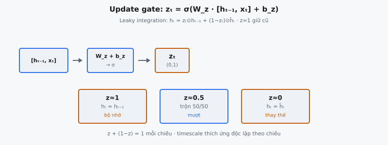

Update gate là một trong hai cơ chế gating bên trong Gated Recurrent Unit (GRU) do Cho et al. (2014) giới thiệu. Nó điều khiển bao nhiêu hidden state trước $h_{t-1}$ được mang forward so với bao nhiêu candidate hidden state $\tilde{h}_t$ mới tính được chấp nhận. Bài báo mô tả nó thực hiện "leaky integration," tạo nội suy mượt, học được giữa ghi nhớ và cập nhật tại mỗi time step.

## Nó là gì

Update gate là vectơ $z_t \in \mathbb{R}^d$ (với $d$ là chiều hidden) có các phần tử nằm trong $[0, 1]$ nhờ kích hoạt sigmoid. Tại mỗi time step $t$, GRU dùng $z_t$ để quyết định, theo từng chiều, giữ hidden state cũ hay thay bằng candidate mới. Khi $z_t^{(j)} = 1$ ở chiều $j$, GRU sao chép $h_{t-1}^{(j)}$ forward không đổi. Khi $z_t^{(j)} = 0$, nó thay hoàn toàn chiều đó bằng candidate $\tilde{h}_t^{(j)}$. Giá trị giữa zero và một tạo pha trộn có trọng số.

Đây là cơ chế cho phép GRU nắm bắt long-range dependency. Không có update gate, hidden state sẽ bị ghi đè mỗi bước. Với nó, mạng có thể học giữ một số chiều không đổi qua hàng trăm bước trong khi tự do cập nhật chiều khác, thích ứng mức giữ bộ nhớ theo từng chiều, từng time step.

::: {#fig-gru-update fig-cap="Update gate: $z_t=\\sigma(W_z\\cdot[h_{t-1},x_t]+b_z)$; leaky integration $h_t=z_t\\odot h_{t-1}+(1-z_t)\\odot\\tilde{h}_t$. $z\\approx 1$ giữ cũ, $z\\approx 0$ thay bằng candidate." fig-alt="Tính z_t từ concat và ba chế độ z≈1, 0.5, 0."}
{fig-align="center"}
:::

## Các phương trình chính

### Nối vector

Update gate hoạt động trên phép nối hidden state trước $h_{t-1} \in \mathbb{R}^d$ và input hiện tại $x_t \in \mathbb{R}^n$:

$$
[h_{t-1}, x_t] \in \mathbb{R}^{d+n}
$$

Cả input hiện tại và hidden state trước cùng quyết định mức cập nhật. Gate có thể học pattern như "khi input báo ranh giới đoạn văn, mở gate để chấp nhận thông tin mới" hay "khi input không mang thông tin, giữ gate đóng để bảo toàn trạng thái hiện có."

### Biến đổi tuyến tính và sigmoid

Vectơ nối được nhân với ma trận trọng số học được $W_z \in \mathbb{R}^{d \times (d+n)}$, cộng bias $b_z \in \mathbb{R}^d$, rồi đi qua sigmoid element-wise:

$$
z_t = \sigma(W_z \cdot [h_{t-1}, x_t] + b_z)
$$

Ma trận trọng số $W_z$ có thể phân rã thành hai khối: $W_{zh} \in \mathbb{R}^{d \times d}$ tác động lên $h_{t-1}$ và $W_{zx} \in \mathbb{R}^{d \times n}$ tác động lên $x_t$. Một số triển khai viết $W_z x_t + U_z h_{t-1} + b_z$, trong đó $U_z$ là khối trọng số hidden-to-hidden. Hai cách viết toán học tương đương. Sigmoid $\sigma(a) = 1/(1 + e^{-a})$ nén từng phần tử vào $(0, 1)$, tạo hệ số nội suy hợp lệ.

## Cơ chế nội suy

Sau khi tính $z_t$, GRU tạo hidden state cuối bằng cách nội suy tuyến tính giữa trạng thái trước $h_{t-1}$ và candidate $\tilde{h}_t$:

$$
h_t = z_t \odot h_{t-1} + (1 - z_t) \odot \tilde{h}_t
$$

Ở đây $\odot$ ký hiệu phép nhân element-wise (Hadamard). Đây là tổ hợp convex: với mỗi chiều $j$, $h_t^{(j)} = z_t^{(j)} \cdot h_{t-1}^{(j)} + (1 - z_t^{(j)}) \cdot \tilde{h}_t^{(j)}$. Các hệ số $z_t^{(j)}$ và $1 - z_t^{(j)}$ luôn cộng bằng một.

### Khi $z_t = 1$: Bộ nhớ hoàn hảo

Nếu $z_t^{(j)} = 1$, thì $h_t^{(j)} = h_{t-1}^{(j)}$. Trạng thái trước được sao chép forward không sửa đổi. Candidate vẫn được tính nhưng hoàn toàn bị bỏ qua. Chiều có $z_t \approx 1$ ở mọi bước mang giá trị qua có thể hàng trăm time step không đổi.

### Khi $z_t = 0$: Thay thế hoàn toàn

Nếu $z_t^{(j)} = 0$, thì $h_t^{(j)} = \tilde{h}_t^{(j)}$. Trạng thái cũ bị loại bỏ hoàn toàn. Điều này cho phép GRU thích ứng nhanh khi input cần biểu diễn mới, ví dụ tại ranh giới câu hay chuyển chủ đề.

### Giá trị trung gian: Pha trộn mềm

Với $z_t^{(j)} = 0.7$, GRU giữ $70\%$ trạng thái cũ và trộn $30\%$ candidate. Pha trộn dần này khả vi và huấn luyện được qua backpropagation through time. Mạng không cần quyết định nhị phân cứng; nó có thể học chuyển tiếp mượt cân bằng ổn định với plasticity.

## Tại sao leaky integration

Cho et al. (2014) mô tả cụ thể update gate thực hiện "leaky integration." Leaky integrator là hệ có trạng thái suy giảm theo cấp số nhân trừ khi được làm mới bởi input mới. Dạng chuẩn là $s_t = \alpha \cdot s_{t-1} + (1 - \alpha) \cdot x_t$, với $\alpha \in [0, 1]$ là hằng số suy giảm cố định. Phương trình cập nhật GRU khớp cấu trúc này, với hai tổng quát hóa quan trọng: tốc độ rò $z_t$ là vectơ học được, phụ thuộc input, thay đổi mỗi time step, và "input" là candidate $\tilde{h}_t$ thay vì $x_t$ thô.

### Liên hệ với trung bình trượt hàm mũ

Trung bình trượt hàm mũ (EMA) với hệ số làm mượt $\alpha$ tuân theo $s_t = \alpha \cdot s_{t-1} + (1 - \alpha) \cdot x_t$. Khi $z_t$ gần như hằng (ví dụ $z_t \approx 0.9$), hidden state hành xử như EMA với $\alpha = 0.9$: cửa sổ bộ nhớ hiệu dụng kéo dài khoảng $1/(1 - 0.9) = 10$ time step. Khác biệt là $z_t$ của GRU thay đổi động, cho phép cửa sổ bộ nhớ hiệu dụng mở rộng hoặc thu hẹp theo nội dung input.

### Hằng số thời gian thích ứng theo từng chiều

Vì $z_t$ là vectơ, mỗi chiều hidden có hằng số thời gian riêng. Một số chiều có thể duy trì $z_t^{(j)} \approx 0.99$, cho hằng số thời gian khoảng 100 bước. Chiều khác có $z_t^{(j)} \approx 0.1$, phản hồi nhanh với hằng số thời gian khoảng 1.1 bước. Khả năng thích ứng theo chiều này cho phép GRU đồng thời theo dõi ngữ cảnh chậm (chủ đề tài liệu) và đặc trưng thay đổi nhanh (cú pháp cục bộ) trong cùng vectơ hidden state.

## Update gate khác reset gate như thế nào

GRU có hai gate: update gate $z_t$ và reset gate $r_t$. Chúng phục vụ vai trò căn bản khác nhau, và nhầm lẫn chúng là nguồn lỗi triển khai phổ biến.

### Reset gate: Chuẩn bị candidate

Reset gate $r_t$ hoạt động sớm hơn trong tính toán. Nó điều khiển mức độ $h_{t-1}$ hiển thị khi tính candidate:

$$
\tilde{h}_t = \tanh(W \cdot [r_t \odot h_{t-1}, x_t] + b)
$$

Khi $r_t \approx 0$, hidden state trước bị che, buộc candidate chủ yếu phụ thuộc $x_t$. Khi $r_t \approx 1$, toàn bộ lịch sử có sẵn và candidate có thể là phiên bản tinh chỉnh của trạng thái hiện có.

### Update gate: Pha trộn cuối cùng

Update gate hoạt động sau khi candidate đã được tính. Nó quyết định candidate được trộn vào hidden state thực tế như thế nào. Dù reset gate tạo candidate khác biệt mạnh, update gate có thể từ chối bằng cách đặt $z_t \approx 1$. Hai gate tạo quyết định hai giai đoạn: reset gate hỏi "candidate nên trông như thế nào?" còn update gate hỏi "bao nhiêu phần candidate đó thực sự nên dùng?"

## Bối cảnh bài báo

### Cho et al. (2014)

GRU được giới thiệu trong "Learning Phrase Representations using RNN Encoder-Decoder for Statistical Machine Translation." Đóng góp chính của bài báo là kiến trúc encoder-decoder cho mô hình hóa sequence-to-sequence, và GRU được đề xuất làm đơn vị recurrent bên trong. Tác giả động cơ hóa cơ chế gating bởi nhu cầu nắm bắt long-range dependency trong dịch máy, nơi nghĩa từ có thể phụ thuộc ngữ cảnh cách nhiều token.

Bài báo nêu rõ: "The update gate $z_j$ selects whether the hidden state is to be updated with a new hidden state. This acts like a leaky integration." Điều này đặt update gate làm cơ chế trung tâm điều khiển bộ nhớ thời gian, với tốc độ rò quyết định thang thời gian hiệu dụng mạng vận hành.

### Đơn giản hơn LSTM

LSTM dùng ba gate (forget, input, output) cộng cell state riêng. GRU đạt gating tương tự chỉ với hai gate và không có cell state riêng. Update gate đảm nhiệm vai trò kết hợp của forget gate và input gate LSTM: $z_t$ đồng thời điều khiển quên bao nhiêu ($z_t$ nhân $h_{t-1}$) và nhận bao nhiêu thông tin mới ($1 - z_t$ nhân $\tilde{h}_t$). Liên kết này nghĩa là ba ma trận trọng số thay vì bốn và huấn luyện nhanh hơn, với cái giá là giảm nhẹ linh hoạt.

## Ví dụ số

Xét GRU với chiều hidden $d = 3$ và chiều input $n = 2$.

### Giá trị cho trước

Hidden state trước và input hiện tại:

$$
h_{t-1} = [0.8, -0.3, 0.5], \quad x_t = [1.0, -0.5]
$$

Candidate hidden state (đã tính qua nhánh reset gate):

$$
\tilde{h}_t = [0.2, 0.9, -0.4]
$$

Trọng số update gate $W_z \in \mathbb{R}^{3 \times 5}$ và bias $b_z \in \mathbb{R}^3$:

$$
W_z = \begin{pmatrix} 0.3 & -0.1 & 0.4 & 0.2 & -0.3 \\ 0.1 & 0.5 & -0.2 & 0.3 & 0.1 \\ -0.2 & 0.3 & 0.6 & -0.1 & 0.4 \end{pmatrix}, \quad b_z = [0.1, -0.1, 0.0]
$$

### Bước 1: Nối vector

$$
[h_{t-1}, x_t] = [0.8, -0.3, 0.5, 1.0, -0.5]
$$

### Bước 2: Biến đổi tuyến tính

Chiều 1: $a_z^{(1)} = 0.3(0.8) + (-0.1)(-0.3) + 0.4(0.5) + 0.2(1.0) + (-0.3)(-0.5) + 0.1 = 0.24 + 0.03 + 0.20 + 0.20 + 0.15 + 0.1 = 0.92$

Chiều 2: $a_z^{(2)} = 0.1(0.8) + 0.5(-0.3) + (-0.2)(0.5) + 0.3(1.0) + 0.1(-0.5) + (-0.1) = 0.08 - 0.15 - 0.10 + 0.30 - 0.05 - 0.1 = -0.02$

Chiều 3: $a_z^{(3)} = (-0.2)(0.8) + 0.3(-0.3) + 0.6(0.5) + (-0.1)(1.0) + 0.4(-0.5) + 0.0 = -0.16 - 0.09 + 0.30 - 0.10 - 0.20 + 0.0 = -0.25$

$$
a_z = [0.92, -0.02, -0.25]
$$

### Bước 3: Sigmoid

$z_t^{(1)} = \sigma(0.92) = 1/(1 + e^{-0.92}) = 1/1.3985 = 0.7153$

$z_t^{(2)} = \sigma(-0.02) = 1/(1 + e^{0.02}) = 1/2.0202 = 0.4950$

$z_t^{(3)} = \sigma(-0.25) = 1/(1 + e^{0.25}) = 1/2.2840 = 0.4378$

$$
z_t = [0.7153, 0.4950, 0.4378]
$$

### Bước 4: Nội suy

$h_t^{(1)} = 0.7153 \cdot 0.8 + 0.2847 \cdot 0.2 = 0.5722 + 0.0569 = 0.6292$

$h_t^{(2)} = 0.4950 \cdot (-0.3) + 0.5050 \cdot 0.9 = -0.1485 + 0.4545 = 0.3060$

$h_t^{(3)} = 0.4378 \cdot 0.5 + 0.5622 \cdot (-0.4) = 0.2189 - 0.2249 = -0.0060$

$$
h_t = [0.6292, 0.3060, -0.0060]
$$

### Diễn giải kết quả

Chiều 1 có $z_t^{(1)} = 0.72$, nên giữ phần lớn $h_{t-1}^{(1)} = 0.8$, cho $0.63$ — gần giá trị gốc. Chiều 2 có $z_t^{(2)} = 0.50$, tạo pha trộn bằng nhau giữa $-0.3$ và $0.9$, cho $0.31$. Chiều 3 có giá trị gate thấp nhất ($0.44$), nghiêng về candidate $-0.4$ và kéo kết quả gần zero. Mỗi chiều đưa ra quyết định giữ hay thay độc lập riêng.

## Liên hệ với LSTM

Cập nhật cell state LSTM dùng hai gate riêng:

$$
c_t = f_t \odot c_{t-1} + i_t \odot \tilde{c}_t
$$

Ở đây $f_t$ là forget gate và $i_t$ là input gate. Quan trọng, $f_t$ và $i_t$ được tính độc lập, nên không có ràng buộc $f_t + i_t = 1$. LSTM có thể đồng thời quên mọi thứ ($f_t \approx 0$) và không nhận gì ($i_t \approx 0$), hoặc giữ mọi thứ ($f_t \approx 1$) và cũng thêm thông tin mới ($i_t \approx 1$).

Update gate GRU ép $z_t + (1 - z_t) = 1$, tổ hợp convex nghiêm ngặt. Nếu GRU muốn giữ nhiều trạng thái cũ hơn, nó phải tỷ lệ chấp nhận ít candidate hơn. Một gate ($z_t$) thay cả $f_t$ và $i_t$, giảm số tham số tương đương một gate đầy đủ. LSTM còn có output gate $o_t$ mà GRU không có; GRU phơi bày toàn bộ hidden state làm đầu ra ở mỗi bước. Đổi lại, các gate độc lập LSTM cung cấp linh hoạt biểu diễn nghiêm ngặt hơn, dù thực tế hiếm khi chuyển thành lợi thế hiệu năng đáng kể.

## Các lỗi thường gặp

* **Hoán đổi $z_t$ và $(1 - z_t)$ trong nội suy.** Công thức đúng là $h_t = z_t \odot h_{t-1} + (1 - z_t) \odot \tilde{h}_t$. Viết $h_t = (1 - z_t) \odot h_{t-1} + z_t \odot \tilde{h}_t$ đảo ngữ nghĩa: $z_t = 1$ giờ nghĩa là "lấy candidate" thay vì "giữ trạng thái cũ." Mạng có thể bù bằng cách học bias đảo, nhưng diễn giải giá trị gate bị đảo, gây khó debug.
* **Nhầm $z_t = 1$ với "cập nhật" thay vì "giữ".** Tên "update gate" dễ gây hiểu nhầm. Khi $z_t = 1$, hiệu ứng là giữ trạng thái cũ, không phải cập nhật. Việc cập nhật (thay bằng $\tilde{h}_t$) xảy ra khi $z_t = 0$. Gợi ý nhớ: $z_t$ đo mức trạng thái cũ "sống sót," không phải mức thông tin mới vào.
* **Dùng sai gate cho sai phương trình.** Update gate $z_t$ điều khiển nội suy cuối. Reset gate $r_t$ điều khiển chuẩn bị candidate. Dùng $z_t$ chỗ $r_t$ nên xuất hiện (bên trong $\tilde{h}_t$) hoặc ngược lại tạo mô hình vẫn huấn luyện được nhưng kém hiệu năng, vì hai gate có vai trò học khác nhau.
* **Coi $z_t$ là scalar thay vì vectơ.** Update gate là vectơ, không phải scalar. Mỗi chiều hidden có giá trị gate riêng. Broadcast một scalar duy nhất trên mọi chiều buộc mọi chiều cập nhật cùng mức, sụp tính thích ứng theo chiều — thứ cho GRU sức biểu đạt. Phép nhân $z_t \odot h_{t-1}$ phải element-wise.
* **Bỏ qua khởi tạo bias.** Nếu $b_z$ khởi tạo zero, giá trị gate ban đầu là $\sigma(0) = 0.5$, nghĩa là GRU bắt đầu bằng cách trung bình trạng thái cũ và mới bằng nhau. Khởi tạo $b_z$ dương (ví dụ 1.0) đẩy $z_t$ gần 1, thiên mạng về bảo toàn trạng thái sớm trong huấn luyện. Điều này tương tự thực hành LSTM khởi tạo bias forget gate bằng 1.0 và có thể cải thiện học long-range dependency.
* **Quên gradient chảy qua cả hai nhánh.** Trong backpropagation through time, gradient tới $h_{t-1}$ qua hai đường: trực tiếp qua $z_t \odot h_{t-1}$ và gián tiếp qua $(1 - z_t) \odot \tilde{h}_t$ (vì $\tilde{h}_t$ phụ thuộc $h_{t-1}$). Nhánh trực tiếp cung cấp đường gradient không cản trở khi $z_t \approx 1$, tương tự luồng gradient cell state LSTM. Đây là cách gated RNN giảm bớt vanishing gradient.


## Code

```python
import numpy as np

def sigmoid(x):
    return 1 / (1 + np.exp(-np.clip(x, -500, 500)))

def update_gate(h_prev: np.ndarray, x_t: np.ndarray,
                W_z: np.ndarray, b_z: np.ndarray) -> np.ndarray:
    concat = np.concatenate([h_prev, x_t], axis=-1)
    z_t = sigmoid(concat @ W_z.T + b_z)
    return z_t
```
