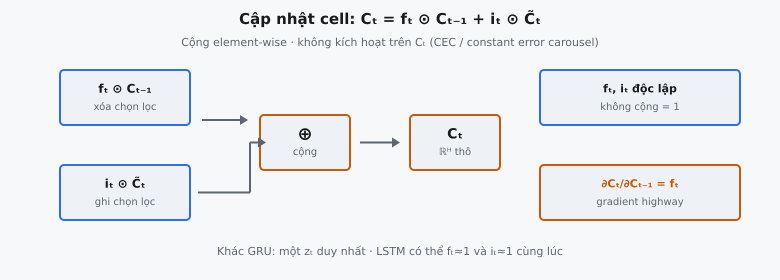
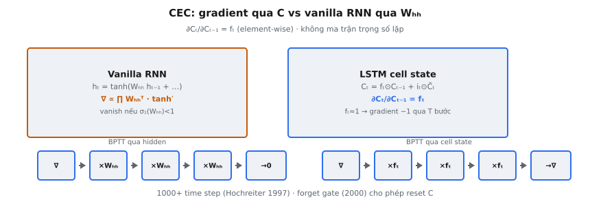

Cập nhật cell state là cơ chế bộ nhớ cốt lõi của mạng Long Short-Term Memory (LSTM), do Hochreiter & Schmidhuber (1997) giới thiệu trong bài "Long Short-Term Memory." Ở mỗi time step, cell state $C_t$ được tính bằng cách kết hợp xóa chọn lọc cell state trước $C_{t-1}$ với ghi chọn lọc nội dung ứng viên mới. Forget gate $f_t$ điều khiển việc xóa; input gate $i_t$ điều khiển việc ghi. Không có hàm kích hoạt nào được áp dụng lên chính $C_t$, khiến cell state trở thành một vòng lặp tự tham chiếu tuyến tính bảo toàn luồng gradient qua vô số time step.

Đây là phương trình khiến LSTM hoạt động. Không có nó, mạng recurrent gặp vanishing gradient và không thể học phụ thuộc dài hạn. Cập nhật cell state giải quyết vấn đề này bằng cách tạo ra thứ bài báo gốc gọi là "constant error carousel" — một đường mà tín hiệu lỗi lan truyền ngược mà không bị nén hay khuếch đại.

## Nó là gì

**Cell state** $C_t$ là vectơ bộ nhớ nội bộ của LSTM. Ở mỗi time step $t$, nó được cập nhật bởi hai phép toán độc lập áp dụng element-wise: cell state trước $C_{t-1}$ được nhân với forget gate $f_t$ để xóa chọn lọc từng chiều, và input gate $i_t$ nhân với candidate cell state $\tilde{C}_t$ để thêm thông tin mới. Kết quả là $C_t$.

Cell state khác với hidden state $h_t$. Hidden state là thứ LSTM phơi bày ra bên ngoài. Cell state là nội bộ — chỉ được đọc ra qua output gate, tính $h_t = o_t \odot \tanh(C_t)$. Sự tách biệt này có nghĩa cell state có thể lưu thông tin chưa cần cho đầu ra, giữ dự trữ cho đến khi output gate mở.

Mọi phép toán trên cell state đều element-wise. Mỗi chiều của $C_t$ được cập nhật độc lập: chiều $j$ có thể bị xóa hoàn toàn trong khi chiều $k$ được giữ nguyên, và chiều $m$ có thể nhận nội dung mới mạnh trong khi chiều $n$ không nhận gì. Sự độc lập theo từng chiều cho LSTM kiểm soát tinh vi việc nhớ gì và ghi gì.

::: {#fig-lstm-cell fig-cap="Cập nhật cell: $C_t=f_t\\odot C_{t-1}+i_t\\odot\\tilde{C}_t$ (cộng element-wise, không kích hoạt trên $C_t$). $f_t$ và $i_t$ độc lập; $\\partial C_t/\\partial C_{t-1}=f_t$ (CEC)." fig-alt="Hai nhánh f_t⊙C_t-1 và i_t⊙C_tilde cộng thành C_t, kèm gradient highway."}
{fig-align="center"}
:::

## Các phương trình chính

Cập nhật cell state phụ thuộc bốn đại lượng đã tính trước đó trong pipeline LSTM. Gọi $x_t \in \mathbb{R}^D$ là input và $h_{t-1} \in \mathbb{R}^H$ là hidden state trước.

**Forget gate** (xóa gì):

$$
f_t = \sigma(W_f \cdot [h_{t-1}, x_t] + b_f) \in (0, 1)^H
$$

**Input gate** (ghi bao nhiêu):

$$
i_t = \sigma(W_i \cdot [h_{t-1}, x_t] + b_i) \in (0, 1)^H
$$

**Candidate cell state** (ghi gì):

$$
\tilde{C}_t = \tanh(W_C \cdot [h_{t-1}, x_t] + b_C) \in (-1, 1)^H
$$

**Cell state update** (phương trình trung tâm):

$$
C_t = f_t \odot C_{t-1} + i_t \odot \tilde{C}_t
$$

Ở đây $\odot$ ký hiệu nhân element-wise (Hadamard). Giá trị forget gate nằm trong $(0, 1)$, nên $f_t \odot C_{t-1}$ co giãn từng chiều của $C_{t-1}$ giữa xóa hoàn toàn ($f_t[j] \approx 0$) và giữ nguyên ($f_t[j] \approx 1$). Input gate tương tự co giãn candidate. Không có hàm kích hoạt sau phép cộng — $C_t$ thô, không bị chặn, và tuyến tính.

## Constant Error Carousel

::: {#fig-lstm-cec fig-cap="CEC: vanilla RNN gradient $\\propto\\prod W_{hh}^\\top\\tanh'$ (vanish); LSTM $\\partial C_t/\\partial C_{t-1}=f_t$ — khi $f_t\\approx 1$, gradient qua $T$ bước gần không suy giảm." fig-alt="Hai panel so sánh BPTT qua W_hh vs qua cell state với f_t."}
{fig-align="center"}
:::

Constant error carousel (CEC) là insight then chốt của bài báo 1997. Nó chỉ vòng lặp tự tham chiếu tuyến tính của cell state: $C_t = f_t \odot C_{t-1} + \ldots$. Khi forget gate gần 1, điều này rút gọn thành xấp xỉ $C_t \approx C_{t-1}$. Cell state sao chép chính nó qua thời gian với sửa đổi tối thiểu.

Trong vanilla RNN, $h_t = \tanh(W_h h_{t-1} + W_x x_t + b)$. Trong backpropagation through time, gradient qua $k$ bước liên quan $\prod_{s=1}^{k} W_h^T \cdot \text{diag}(\tanh'(\cdot))$. Vì $|\tanh'(x)| \leq 1$ và ma trận trọng số tích lũy ở mỗi bước, gradient suy biến theo cấp số nhân. Hochreiter (1991) chứng minh gradient trong vanilla RNN suy biến theo cấp số nhân, khiến không thể học phụ thuộc vượt quá khoảng 10–20 bước.

CEC phá vỡ điều này. Đạo hàm riêng của $C_t$ theo $C_{t-1}$ đơn giản là $f_t$ (element-wise). Không có ma trận trọng số, không có đạo hàm hàm kích hoạt. Nếu $f_t \approx 1$, gradient đi qua không đổi. Qua $k$ time step, gradient là $\prod_{s=1}^{k} f_{t-s+1}$. Khi forget gate liên tục gần 1, tích này vẫn gần 1 kể cả với $k$ lớn.

Bài báo phát biểu: "The constant error carousel: the cell's linear self-connection ensures that error can flow back through arbitrary time steps without vanishing or exploding." Một quyết định thiết kế duy nhất — vòng lặp tự tham chiếu tuyến tính với hệ số gating học được — là thứ khiến LSTM trở thành mô hình chuỗi thống trị trong hai thập kỷ.

## Tại sao không có hàm kích hoạt trên $C_t$

Cập nhật cell state cố ý tránh áp dụng bất kỳ hàm kích hoạt nào lên $C_t$ sau phép cộng. Đây không phải sơ suất — đó là toàn bộ ý đồ kiến trúc.

Nếu ta áp dụng tanh lên $C_t$, cập nhật trở thành $C_t = \tanh(f_t \odot C_{t-1} + i_t \odot \tilde{C}_t)$. Đạo hàm của tanh là $1 - \tanh^2(x)$, nằm trong $(0, 1]$. Trong lan truyền ngược, mỗi time step nhân gradient với đạo hàm này, tái đưa vanishing gradient mà LSTM được thiết kế để giải quyết. CEC yêu cầu recurrence cell state tuyến tính theo $C_{t-1}$.

Ngoài ra, tanh sẽ chặn $C_t$ trong $(-1, 1)$. Không có hàm kích hoạt, $C_t$ không bị chặn — có thể tăng đến giá trị dương hoặc âm lớn. Đây là thiết kế có chủ ý. Cell state được đọc ra qua $h_t = o_t \odot \tanh(C_t)$, nơi tanh nén $C_t$ cho đầu ra. Biểu diễn nội bộ không bị chặn cho phép cell tích lũy thông tin (đếm, tổng chạy) mà không bão hòa, trong khi đường đầu ra đảm bảo $h_t$ vẫn bị chặn.

## Cập nhật hai phần

Cập nhật cell state $C_t = f_t \odot C_{t-1} + i_t \odot \tilde{C}_t$ có hai thành phần cộng, mỗi phần phục vụ vai trò riêng. Chúng độc lập: forget gate và input gate được tính từ ma trận trọng số riêng và có thể nhận mọi tổ hợp giá trị.

**Phần 1 — Xóa chọn lọc: $f_t \odot C_{t-1}$.** Forget gate $f_t \in (0, 1)^H$ nhân từng chiều của $C_{t-1}$ độc lập. Khi $f_t[j] \approx 0$, chiều $j$ bị xóa. Khi $f_t[j] \approx 1$, chiều $j$ được giữ. Ví dụ, khi xử lý ngôn ngữ và gặp ranh giới câu, forget gate có thể xóa các chiều lưu chủ ngữ của câu trước.

**Phần 2 — Ghi chọn lọc: $i_t \odot \tilde{C}_t$.** Input gate $i_t \in (0, 1)^H$ co giãn candidate $\tilde{C}_t \in (-1, 1)^H$ theo từng chiều. Khi $i_t[j] \approx 0$, không ghi gì. Khi $i_t[j] \approx 1$, toàn bộ giá trị candidate được cộng. Candidate đề xuất ghi gì; input gate quyết định bao nhiêu thực sự được ghi.

Sự độc lập của forget gate và input gate phân biệt LSTM với GRU. Trong GRU, một update gate $z_t$ duy nhất điều khiển cả hai: $h_t = z_t \odot h_{t-1} + (1 - z_t) \odot \tilde{h}_t$. Hệ số phải cộng bằng 1. LSTM không có ràng buộc đó: $f_t$ và $i_t$ có thể cùng gần 1 (cell tăng), cùng gần 0 (cell co về zero), hoặc bất kỳ tổ hợp nào khác.

## Bối cảnh bài báo

Hochreiter & Schmidhuber xuất bản "Long Short-Term Memory" trên Neural Computation năm 1997. Bài báo giải quyết vấn đề cơ bản được xác định trong luận văn 1991 của Hochreiter và phân tích của Bengio et al. (1994): tín hiệu gradient trong mạng recurrent suy biến hoặc bùng nổ theo cấp số nhân với độ dài chuỗi.

Đóng góp cốt lõi là constant error carousel — ý tưởng rằng một đơn vị recurrent nên có vòng lặp tự tham chiếu tuyến tính để lỗi lan truyền ngược qua thời gian mà không suy giảm. Kiến trúc 1997 gốc có input gate và output gate; forget gate được Gers, Schmidhuber & Cummins bổ sung năm 2000. Phương trình cập nhật cell state là triển khai trực tiếp ý tưởng CEC.

Bài báo chứng minh LSTM có thể học tác vụ cần bộ nhớ qua 1000+ time step, nơi vanilla RNN thất bại ở độ trễ vượt 10–20 bước. Điều này mang tính cách mạng. LSTM trở thành kiến trúc chuỗi thống trị từ khoảng 2013 đến 2017, thúc đẩy đột phá trong dịch máy (Sutskever et al. 2014), nhận dạng giọng nói (Graves et al. 2013), và language modeling.

## Ví dụ số

Xét LSTM với hidden size $H = 4$. Ở time step $t$, các gate và candidate đã được tính. Ta tập trung vào cập nhật cell state: $C_t = f_t \odot C_{t-1} + i_t \odot \tilde{C}_t$.

**Giá trị cho trước:**

$$
C_{t-1} = \begin{pmatrix} 1.5 \\ -0.8 \\ 0.3 \\ 2.1 \end{pmatrix}, \quad f_t = \begin{pmatrix} 0.9 \\ 0.1 \\ 0.95 \\ 0.7 \end{pmatrix}, \quad \tilde{C}_t = \begin{pmatrix} 0.4 \\ 0.7 \\ -0.5 \\ 0.2 \end{pmatrix}, \quad i_t = \begin{pmatrix} 0.2 \\ 0.85 \\ 0.1 \\ 0.6 \end{pmatrix}
$$

**Bước 1: Xóa chọn lọc.** $f_t \odot C_{t-1}$, element by element:

Dim 0: $0.9 \times 1.5 = 1.35$ ($f$ cao, giá trị cũ phần lớn được giữ)

Dim 1: $0.1 \times (-0.8) = -0.08$ ($f$ thấp, giá trị cũ gần như bị xóa)

Dim 2: $0.95 \times 0.3 = 0.285$ ($f$ rất cao, gần như giữ nguyên)

Dim 3: $0.7 \times 2.1 = 1.47$ ($f$ vừa, giữ một phần)

**Bước 2: Ghi chọn lọc.** $i_t \odot \tilde{C}_t$, element by element:

Dim 0: $0.2 \times 0.4 = 0.08$ ($i$ thấp, ít nội dung mới)

Dim 1: $0.85 \times 0.7 = 0.595$ ($i$ cao, ghi mạnh)

Dim 2: $0.1 \times (-0.5) = -0.05$ ($i$ thấp, ghi tối thiểu)

Dim 3: $0.6 \times 0.2 = 0.12$ ($i$ vừa, ghi một phần)

**Bước 3: Cộng.** $C_t = f_t \odot C_{t-1} + i_t \odot \tilde{C}_t$:

Dim 0: $1.35 + 0.08 = 1.43$ (giữ bộ nhớ cũ, hầu như không đổi)

Dim 1: $-0.08 + 0.595 = 0.515$ (xóa cũ, ghi mới — dấu đảo từ $-0.8$ sang $+0.515$)

Dim 2: $0.285 - 0.05 = 0.235$ (giữ cũ, ghi mới không đáng kể)

Dim 3: $1.47 + 0.12 = 1.59$ (giữ một phần cộng thêm vừa phải)

**Diễn giải.** Dim 0 là chiều "remember" ($f$ cao, $i$ thấp): $1.5 \to 1.43$. Dim 1 là chiều "replace" ($f$ thấp, $i$ cao): $-0.8 \to 0.515$. Dim 2 là giữ thuần túy ($f$ cao, $i$ thấp): $0.3 \to 0.235$. Dim 3 thể hiện tính cộng: nội dung cũ co bởi $f = 0.7$, rồi nội dung mới chồng lên. Lưu ý giá trị $C_t$ như 1.43 và 1.59 vượt $[-1, 1]$ — điều này là mong đợi vì không có hàm kích hoạt chặn cell state.

## Phân tích luồng gradient

Từ $C_t = f_t \odot C_{t-1} + i_t \odot \tilde{C}_t$, đạo hàm riêng theo $C_{t-1}$ là:

$$
\frac{\partial C_t}{\partial C_{t-1}} = \text{diag}(f_t)
$$

Đây là ma trận đường chéo với các phần tử là giá trị forget gate. Không có ma trận trọng số, không có đạo hàm hàm kích hoạt — chỉ có gate. Qua $k$ time step:

$$
\frac{\partial C_t}{\partial C_{t-k}} = \prod_{s=1}^{k} \text{diag}(f_{t-s+1}) = \text{diag}\left(\prod_{s=1}^{k} f_{t-s+1}\right)
$$

Với mỗi chiều $j$, độ lớn gradient là $\prod_{s=1}^{k} f_{t-s+1}[j]$:

- **$f[j] \approx 1$ ở mọi bước:** Tích vẫn gần 1. Gradient được bảo toàn. Đây là CEC.
- **$f[j] \approx 0.9$ ở mọi bước:** Sau 10 bước, $0.9^{10} \approx 0.349$. Sau 50 bước, $0.9^{50} \approx 0.005$. Suy giảm chậm hơn vanilla RNN, nhưng vẫn suy giảm.
- **$f[j] \approx 0$ ở một bước nào đó:** Gradient cho chiều $j$ bị cắt. Đây là có chủ ý — khi forget gate xóa một chiều, nó cũng chặn luồng gradient qua chiều đó.

So với vanilla RNN nơi gradient qua $k$ bước là $\prod_{s=1}^{k} W_h^T \cdot \text{diag}(\tanh'(\cdot))$ — nhân lặp lại bởi ma trận trọng số đầy đủ gây tăng hoặc suy giảm theo cấp số nhân. LSTM thay thế bằng nhân ma trận đường chéo các giá trị gate, ổn định hơn nhiều.

Có một tinh tế: gradient LSTM đầy đủ phức tạp hơn vì $f_t$ phụ thuộc $h_{t-1}$, vốn phụ thuộc $C_{t-1}$ qua output gate. Nhưng đường trực tiếp qua $\text{diag}(f_t)$ là đường gradient chi phối và là thứ ngăn vanishing gradient.

## Các lỗi thường gặp

- **Áp dụng tanh hoặc sigmoid lên $C_t$.** Viết $C_t = \tanh(f_t \odot C_{t-1} + i_t \odot \tilde{C}_t)$ phá hủy constant error carousel. Gradient giờ gồm $\tanh'(\cdot)$ ở mỗi bước, tái đưa vanishing gradient. Cell state phải không có hàm kích hoạt.
- **Dùng nhân ma trận thay vì tích element-wise.** Phép toán $f_t \odot C_{t-1}$ là tích Hadamard, không phải tích vô hướng hay nhân ma trận. Cả $f_t$ và $C_{t-1}$ có shape $(H,)$ và cho shape $(H,)$. Tích vô hướng sẽ co về một scalar.
- **Nhầm $C_t$ với $h_t$.** Cell state là bộ nhớ nội bộ; hidden state $h_t = o_t \odot \tanh(C_t)$ là đầu ra. Trả $C_t$ làm đầu ra LSTM hoặc dùng $h_t$ thay $C_t$ trong recurrence ($C_t = f_t \odot h_{t-1} + \ldots$) phá kiến trúc vì $h_t$ đã bị tanh nén và bị gate bởi $o_t$.
- **Quên rằng $C_t$ có thể vượt $[-1, 1]$.** Vì không có hàm kích hoạt, giá trị $C_t$ có thể lớn dần. Clip $C_t$ về $[-1, 1]$ hoặc giả định giá trị bị chặn gây hành vi sai. Cell state cố ý không bị chặn.
- **Sai thứ tự phép toán.** Thứ tự đúng: (1) nhân $f_t$ với $C_{t-1}$, (2) nhân $i_t$ với $\tilde{C}_t$, (3) cộng. Tính $f_t + i_t$ trước rồi nhân với một trạng thái kết hợp khác biệt đại số và sai.
- **Giả định $f_t + i_t = 1$.** Khác với update gate GRU nơi hệ số cộng bằng 1, forget gate và input gate LSTM là đầu ra sigmoid độc lập. Chúng có thể cùng gần 1, cùng gần 0, hoặc bất kỳ tổ hợp nào. Không có ràng buộc cộng.


## Code
```python
import numpy as np

def update_cell_state(C_prev: np.ndarray, f_t: np.ndarray,
                      i_t: np.ndarray, c_tilde: np.ndarray) -> np.ndarray:
    C_t = f_t * C_prev + i_t * c_tilde
    return C_t

```
