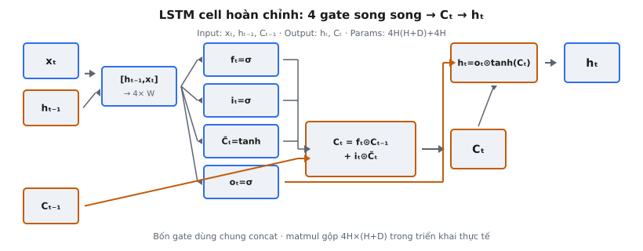

Long Short-Term Memory (LSTM) cell là đơn vị mạng nơ-ron lặp được Hochreiter và Schmidhuber (1997) giới thiệu trong "Long Short-Term Memory." Nó xử lý vectơ input và hidden state trước qua bốn gate song song để cập nhật cell state và tạo hidden state mới. LSTM được thiết kế để giải quyết vấn đề vanishing gradient khiến RNN chuẩn không học được phụ thuộc dài hạn.

## Nó là gì

LSTM cell hoàn chỉnh nhận ba input tại mỗi bước thời gian: input hiện tại $x_t \in \mathbb{R}^D$, hidden state trước $h_{t-1} \in \mathbb{R}^H$, và cell state trước $C_{t-1} \in \mathbb{R}^H$. Nó tạo hai output: hidden state mới $h_t \in \mathbb{R}^H$ và cell state mới $C_t \in \mathbb{R}^H$. Hidden state là output nhìn thấy bên ngoài dùng cho các lớp downstream, còn cell state là bộ nhớ nội bộ chảy qua các bước thời gian với biến đổi tối thiểu.

Cell hoạt động qua bốn gate học được. **Forget gate** quyết định phần nào của cell state cũ bị loại bỏ. **Input gate** quyết định phần nào được cập nhật. **Candidate cell state** đề xuất nội dung mới. **Output gate** quyết định phần nào của cell state đã cập nhật được phơi ra thành hidden state. Bốn gate dùng bốn ma trận trọng số và bốn vectơ bias.

Như bài báo gốc nêu, "the memory cell is the central component of the LSTM architecture." Cell state hoạt động như băng chuyền: thông tin chảy dọc theo nó không đổi qua nhiều bước thời gian, với các gate kiểm soát phần được thêm hay bớt. Điều này tạo đường gradient trực tiếp theo thời gian, tránh suy giảm theo mũ ám ảnh vanilla RNN.

::: {#fig-lstm-complete-cell fig-cap="LSTM cell hoàn chỉnh: concat $[h_{t-1},x_t]$ → 4 gate song song → $C_t=f_t\\odot C_{t-1}+i_t\\odot\\tilde{C}_t$ → $h_t=o_t\\odot\\tanh(C_t)$. Params $4H(H+D)+4H$." fig-alt="Sơ đồ bốn gate, cập nhật cell và hidden state trong một cell."}
{fig-align="center"}
:::

## Các phương trình chính

Cho $x_t \in \mathbb{R}^D$ là input, $h_{t-1} \in \mathbb{R}^H$ là hidden state trước, và $C_{t-1} \in \mathbb{R}^H$ là cell state trước. Phép nối $[h_{t-1}, x_t] \in \mathbb{R}^{H+D}$ được dùng chung cho cả bốn phép tính gate.

**Phương trình 1 — Forget gate.** Xác định thành phần nào của cell state cũ được giữ:

$$
f_t = \sigma(W_f \cdot [h_{t-1}, x_t] + b_f)
$$

Ở đây $W_f \in \mathbb{R}^{H \times (H+D)}$ và $b_f \in \mathbb{R}^H$. Sigmoid nén mỗi phần tử về $(0, 1)$. Khi $f_t \approx 1$, chiều đó được giữ; khi $f_t \approx 0$, nó bị xóa.

**Phương trình 2 — Input gate.** Kiểm soát mức candidate được ghi vào bộ nhớ:

$$
i_t = \sigma(W_i \cdot [h_{t-1}, x_t] + b_i)
$$

Ở đây $W_i \in \mathbb{R}^{H \times (H+D)}$ và $b_i \in \mathbb{R}^H$. Khác với update gate của GRU, forget gate và input gate độc lập và không cộng thành $1$.

**Phương trình 3 — Candidate cell state.** Đề xuất nội dung mới cần ghi:

$$
\tilde{C}_t = \tanh(W_C \cdot [h_{t-1}, x_t] + b_C)
$$

Ở đây $W_C \in \mathbb{R}^{H \times (H+D)}$ và $b_C \in \mathbb{R}^H$. Tanh giới hạn candidate trong $(-1, 1)$. Input gate scale candidate theo từng phần tử để kiểm soát phần được ghi.

**Phương trình 4 — Output gate.** Kiểm soát phần nào của cell state được phơi ra:

$$
o_t = \sigma(W_o \cdot [h_{t-1}, x_t] + b_o)
$$

Ở đây $W_o \in \mathbb{R}^{H \times (H+D)}$ và $b_o \in \mathbb{R}^H$. Gate này cho phép LSTM lưu thông tin trong $C_t$ mà chưa phản ánh ở output.

**Phương trình 5 — Cập nhật cell state.** Kết hợp quên và ghi:

$$
C_t = f_t \odot C_{t-1} + i_t \odot \tilde{C}_t
$$

Tích Hadamard $f_t \odot C_{t-1}$ xóa nội dung cũ, và $i_t \odot \tilde{C}_t$ ghi nội dung mới. Cập nhật cộng này là cốt lõi bảo toàn gradient: trong lan truyền ngược, gradient chảy với nhân tố $f_t$, có thể gần $1$.

**Phương trình 6 — Hidden state.** Lọc cell state qua output gate:

$$
h_t = o_t \odot \tanh(C_t)
$$

Tanh nén $C_t$ về $(-1, 1)$ trước khi output gate lọc theo phần tử. Lưu ý $C_t$ ở đây từ Phương trình 5, không phải $C_{t-1}$. Hidden state $h_t$ vừa là output của cell vừa là input lặp cho bước sau.

## Bốn gate

**Forget gate ($f_t$).** Output giá trị trong $(0, 1)$ mỗi chiều, quyết định giữ bao nhiêu $C_{t-1}$.

**Input gate ($i_t$).** Output giá trị trong $(0, 1)$ mỗi chiều, quyết định ghi bao nhiêu $\tilde{C}_t$.

**Candidate ($\tilde{C}_t$).** Đề xuất giá trị mới trong $(-1, 1)$ qua biến đổi tanh trên $[h_{t-1}, x_t]$.

**Output gate ($o_t$).** Output giá trị trong $(0, 1)$ mỗi chiều, quyết định phần nào của $C_t$ được phơi ra thành $h_t$.

## Luồng dữ liệu

### Bước 1: Nối và tính gate song song

Input $x_t$ và hidden state trước $h_{t-1}$ được nối thành chiều $H + D$. Vector này dùng chung cho cả bốn phép tính gate. Triển khai thường xếp chồng bốn ma trận trọng số thành một ma trận $(4H, H+D)$, tính một matmul, tách thành bốn khối, rồi áp sigmoid cho ba gate và tanh cho candidate.

### Bước 2: Cập nhật cell state

Forget gate $f_t$ nhân theo phần tử với $C_{t-1}$, xóa các chiều được chọn. Input gate $i_t$ nhân theo phần tử với $\tilde{C}_t$, scale nội dung mới. Hai phần được cộng để có $C_t$. Cập nhật thuần theo phần tử, không có nhân ma trận hay kích hoạt. Đường tuyến tính này là điều Hochreiter và Schmidhuber gọi "constant error carousel."

### Bước 3: Trích hidden state

$C_t$ đã cập nhật đi qua tanh, rồi output gate lọc theo phần tử để tạo $h_t$. $h_t$ có hai vai trò: output của cell cho lớp downstream và input lặp cho bước thời gian tiếp theo.

## Vì sao tách cell state và hidden state

Cell state $C_t$ là bộ nhớ dài hạn với động học gần tuyến tính. Vì $C_t = f_t \odot C_{t-1} + i_t \odot \tilde{C}_t$ là cộng, gradient lan ngược với suy giảm tối thiểu khi forget gate gần $1$. Đây là constant error carousel: cell state mang thông tin qua hàng trăm bước thời gian mà không suy giảm gradient theo mũ như vanilla RNN.

Hidden state $h_t = o_t \odot \tanh(C_t)$ là view đã lọc cho dùng ngay. Output gate cho phép LSTM lưu thông tin riêng trong $C_t$ cho đến khi cần. Trong language modeling, cell có thể lưu agreement chủ–vị trong $C_t$ trong khi ẩn nó cho đến khi động từ liên quan xuất hiện nhiều token sau.

GRU gộp cell state và hidden state thành một vectơ, nên mọi thứ nó nhớ luôn nhìn thấy. Thiết kế hai state của LSTM cho capacity biểu diễn lớn hơn với chi phí thêm tham số.

## Số tham số

LSTM có bốn ma trận trọng số shape $(H, H + D)$ và bốn vectơ bias shape $(H,)$.

- **Forget gate:** $W_f$ có $H(H + D)$ trọng số, $b_f$ có $H$ bias
- **Input gate:** $W_i$ có $H(H + D)$ trọng số, $b_i$ có $H$ bias
- **Candidate:** $W_C$ có $H(H + D)$ trọng số, $b_C$ có $H$ bias
- **Output gate:** $W_o$ có $H(H + D)$ trọng số, $b_o$ có $H$ bias

**Tổng tham số LSTM:**

$$
4H(H + D) + 4H
$$

GRU có ba gate, tổng $3H(H + D) + 3H$. LSTM dùng $\frac{4}{3}$ tham số của GRU. Với $H = 256$, $D = 128$: LSTM có $4 \times 256 \times 384 + 1{,}024 = 394{,}240$; GRU có $3 \times 256 \times 384 + 768 = 295{,}680$. LSTM cần khoảng 98,500 tham số thêm mỗi lớp, đổi lấy output gate và cell state riêng.

## Bối cảnh bài báo

Hochreiter và Schmidhuber (1997) xuất bản "Long Short-Term Memory" trên Neural Computation. Bài báo giải quyết vấn đề vanishing gradient mà Hochreiter phân tích trong luận văn 1991 và Bengio et al. (1994) ghi nhận độc lập. RNN chuẩn nhân gradient với ma trận trọng số lặp mỗi bước trong BPTT. Khi singular value lớn nhất dưới $1$, gradient suy giảm theo mũ; trên $1$, chúng bùng nổ.

Giải pháp là constant error carousel: vòng tự với trọng số $1.0$ trên cell state. Gradient chảy qua đường này nhân với $f_t$ thay vì ma trận trọng số học được. Input gate và output gate bảo vệ carousel khỏi input không liên quan và ngăn thông tin lưu trữ làm nhiễu tính toán không liên quan.

LSTM gốc 1997 thiếu forget gate, được Gers, Schmidhuber, và Cummins (2000) bổ sung. Peephole connections đến từ Gers và Schmidhuber (2000). Greff et al. (2017) thấy forget gate và output activation là thành phần quan trọng nhất, còn peephole connections ít lợi trên hầu hết tác vụ.

## Ví dụ số

LSTM với $H = 2$, $D = 2$ tại bước thời gian $t$:

$$
x_t = \begin{pmatrix} 0.5 \\ -0.3 \end{pmatrix}, \quad h_{t-1} = \begin{pmatrix} 0.1 \\ -0.2 \end{pmatrix}, \quad C_{t-1} = \begin{pmatrix} 0.4 \\ -0.6 \end{pmatrix}
$$

Nối: $[h_{t-1}, x_t] = [0.1, -0.2, 0.5, -0.3]$. Trọng số:

$$
W_f = \begin{pmatrix} 0.3 & -0.1 & 0.2 & 0.4 \\ 0.1 & 0.5 & -0.3 & 0.2 \end{pmatrix}, \quad b_f = \begin{pmatrix} 0.1 \\ -0.1 \end{pmatrix}
$$

$$
W_i = \begin{pmatrix} 0.2 & 0.3 & -0.1 & 0.5 \\ -0.2 & 0.1 & 0.4 & -0.3 \end{pmatrix}, \quad b_i = \begin{pmatrix} 0.0 \\ 0.1 \end{pmatrix}
$$

$$
W_C = \begin{pmatrix} -0.1 & 0.4 & 0.3 & -0.2 \\ 0.2 & -0.3 & 0.1 & 0.5 \end{pmatrix}, \quad b_C = \begin{pmatrix} 0.0 \\ 0.1 \end{pmatrix}
$$

$$
W_o = \begin{pmatrix} 0.4 & -0.2 & 0.1 & 0.3 \\ -0.1 & 0.3 & 0.2 & -0.4 \end{pmatrix}, \quad b_o = \begin{pmatrix} 0.05 \\ -0.05 \end{pmatrix}
$$

**Bước 1: Forget gate.** $W_f [h,x] + b_f$: Hàng 1 = $0.03 + 0.02 + 0.10 - 0.12 + 0.10 = 0.13$. Hàng 2 = $0.01 - 0.10 - 0.15 - 0.06 - 0.10 = -0.40$. $f_t = [\sigma(0.13), \sigma(-0.40)] = [0.5325, 0.4013]$.

**Bước 2: Input gate.** $W_i [h,x] + b_i$: Hàng 1 = $0.02 - 0.06 - 0.05 - 0.15 = -0.24$. Hàng 2 = $-0.02 - 0.02 + 0.20 + 0.09 + 0.10 = 0.35$. $i_t = [\sigma(-0.24), \sigma(0.35)] = [0.4403, 0.5866]$.

**Bước 3: Candidate.** $W_C [h,x] + b_C$: Hàng 1 = $-0.01 - 0.08 + 0.15 + 0.06 = 0.12$. Hàng 2 = $0.02 + 0.06 + 0.05 - 0.15 + 0.10 = 0.08$. $\tilde{C}_t = [\tanh(0.12), \tanh(0.08)] = [0.1194, 0.0798]$.

**Bước 4: Output gate.** $W_o [h,x] + b_o$: Hàng 1 = $0.04 + 0.04 + 0.05 - 0.09 + 0.05 = 0.09$. Hàng 2 = $-0.01 - 0.06 + 0.10 + 0.12 - 0.05 = 0.10$. $o_t = [\sigma(0.09), \sigma(0.10)] = [0.5225, 0.5250]$.

**Bước 5: Cập nhật cell.** $C_t = f_t \odot C_{t-1} + i_t \odot \tilde{C}_t$: $C_t[0] = 0.5325 \times 0.4 + 0.4403 \times 0.1194 = 0.2130 + 0.0526 = 0.2656$. $C_t[1] = 0.4013 \times (-0.6) + 0.5866 \times 0.0798 = -0.2408 + 0.0468 = -0.1940$.

**Bước 6: Hidden state.** $\tanh(C_t) = [0.2595, -0.1916]$. $h_t = o_t \odot \tanh(C_t) = [0.5225 \times 0.2595, \ 0.5250 \times (-0.1916)] = [0.1356, -0.1006]$.

Kết quả: $h_t = [0.1356, -0.1006]$, $C_t = [0.2656, -0.1940]$. Chiều cell 0 co từ $0.4$ xuống $0.27$ (forget gate $0.53$ xóa một phần, input gate $0.44$ ghi candidate nhỏ). Chiều 1 dịch từ $-0.6$ về gần zero (forget gate $0.40$ xóa hầu hết giá trị cũ). Cả hai output gate gần $0.52$ truyền khoảng nửa cell state đã tanh sang $h_t$.

## LSTM so với GRU

**Gate.** LSTM có bốn (forget, input, candidate, output); GRU có ba (reset, update, candidate). Update gate của GRU ghép quên và ghi qua $z_t + (1 - z_t) = 1$. Forget gate và input gate của LSTM độc lập, nên $f_t + i_t$ có thể vượt $1$, cho phép cell vừa giữ vừa thêm thông tin.

**Cell state.** LSTM duy trì $C_t$ riêng được che bởi output gate, cho phép state nội bộ riêng. GRU phơi hidden state trực tiếp.

**Tham số.** LSTM: $4H(H + D) + 4H$. GRU: $3H(H + D) + 3H$. Tỷ lệ $\frac{4}{3}$. Với $H = 512$, $D = 256$: khoảng 786K so với 589K mỗi lớp.

**Hiệu năng.** Tương đương trên hầu hết benchmark. LSTM hơi mạnh hơn trên tác vụ cần theo dõi state dài hạn chính xác. GRU huấn luyện nhanh hơn và khái quát hóa tốt hơn trên dataset nhỏ.

## Các lỗi thường gặp

- **Sai thứ tự gate trong cập nhật cell.** Công thức đúng là $C_t = f_t \odot C_{t-1} + i_t \odot \tilde{C}_t$. Đổi thành $i_t \odot C_{t-1} + f_t \odot \tilde{C}_t$ đảo ngữ nghĩa gate. Mạng có thể hội tụ nhưng trọng số học được sẽ có nghĩa ngược.
- **Áp tanh lên cập nhật cell state.** Cập nhật phải là $C_t = f_t \odot C_{t-1} + i_t \odot \tilde{C}_t$ không có tanh. Tanh chỉ áp ở $h_t = o_t \odot \tanh(C_t)$. Bọc cập nhật cell bằng tanh phá động học tuyến tính của constant error carousel và tái giới thiệu vanishing gradient.
- **Quên trả cả $h_t$ và $C_t$.** LSTM phải trả $(h_t, C_t)$ vì cả hai cần ở bước sau. Chỉ trả $h_t$ mất cell state và LSTM suy biến thành mạng có gate không có bộ nhớ dài hạn.
- **Dùng $C_{t-1}$ thay vì $C_t$ cho output.** Hidden state dùng cell state đã cập nhật: $h_t = o_t \odot \tanh(C_t)$. Dùng $C_{t-1}$ khiến hidden state bỏ lỡ thông tin vừa ghi bởi input gate — lỗi off-by-one tinh vi làm suy hiệu năng im lặng.
- **Thứ tự nối không nhất quán.** Cả bốn biến đổi affine phải dùng $[h_{t-1}, x_t]$. Nếu một gate dùng $[x_t, h_{t-1}]$, ma trận trọng số nhân sai input. Không lỗi shape nhưng kết quả sai.
- **Nhầm nhân theo phần tử với nhân ma trận.** Các phép $f_t \odot C_{t-1}$, $i_t \odot \tilde{C}_t$, và $o_t \odot \tanh(C_t)$ là tích Hadamard, không phải matmul. Cả hai toán hạng shape $(H,)$ và cho $(H,)$.


## Code
```python
import numpy as np

def sigmoid(x):
    return 1 / (1 + np.exp(-np.clip(x, -500, 500)))

def lstm_cell(x_t, h_prev, C_prev, W_f, W_i, W_c, W_o, b_f, b_i, b_c, b_o):
    concat = np.concatenate([h_prev, x_t], axis=-1)
    f_t = sigmoid(concat @ W_f.T + b_f)
    i_t = sigmoid(concat @ W_i.T + b_i)
    c_tilde = np.tanh(concat @ W_c.T + b_c)
    o_t = sigmoid(concat @ W_o.T + b_o)
    C_t = f_t * C_prev + i_t * c_tilde
    h_t = o_t * np.tanh(C_t)
    return h_t, C_t

```
