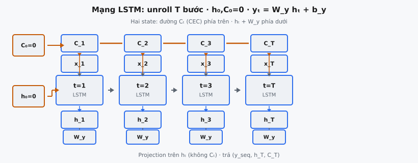

Mạng Long Short-Term Memory (LSTM), do Hochreiter và Schmidhuber giới thiệu trong "Long Short-Term Memory" (1997), xử lý dữ liệu tuần tự bằng cách unroll một LSTM cell qua $T$ bước thời gian. Mỗi bước, cell nhận input hiện tại $x_t$, hidden state trước $h_{t-1}$, và cell state trước $C_{t-1}$, tạo state cập nhật $(h_t, C_t)$. Sau khi lặp hết chuỗi, output projection tuyến tính ánh xạ mỗi hidden state sang không gian đầu ra. Bài báo cho thấy kiến trúc này "can learn to bridge minimal time lags in excess of 1000 discrete time steps."

## Nó là gì

Mạng LSTM hoàn chỉnh bọc một LSTM cell trong vòng lặp duyệt chuỗi độ dài $T$. Cell chứa bốn gate (forget, input, candidate, output) điều tiết luồng thông tin. Mạng thêm hai thành phần trên cell thô: khởi tạo cả hai vectơ state $h_0$ và $C_0$ bằng zero, và lớp output projection ánh xạ mỗi hidden state $h_t \in \mathbb{R}^H$ sang output $y_t \in \mathbb{R}^{O}$ qua biến đổi affine học được.

Phân biệt giữa một LSTM cell và mạng LSTM hoàn chỉnh: cell định nghĩa một bước recurrence, còn mạng điều phối toàn bộ chuỗi. Cell không state: cho $(x_t, h_{t-1}, C_{t-1})$, nó tạo $(h_t, C_t)$. Mạng quản lý khởi tạo state, vòng lặp, thu output mỗi bước, và projection cuối.

Hai vectơ state lan truyền theo thời gian. Hidden state $h_t$ là output của cell và nhìn thấy bởi lớp downstream. Cell state $C_t$ là bộ nhớ nội bộ, được che bởi output gate, không bao giờ phơi trực tiếp ra ngoài cell. Cả hai phải mang từ bước này sang bước sau; quên lan truyền một trong hai phá recurrence.

::: {#fig-lstm-unroll fig-cap="Mạng LSTM: $h_0,C_0=\\mathbf{0}$, unroll $T$ bước (weight sharing), đường $C_t$ (CEC) phía trên, $h_t$ + $W_y$ phía dưới; projection trên $h_t$ không phải $C_t$." fig-alt="Chuỗi cell LSTM với highway C_t, hidden h_t và W_y mỗi bước."}
{fig-align="center"}
:::

## Các phương trình chính

Cho $x_t \in \mathbb{R}^D$ là input tại bước $t$, $h_{t-1} \in \mathbb{R}^H$ là hidden state trước, và $C_{t-1} \in \mathbb{R}^H$ là cell state trước. LSTM cell tính bốn gate, rồi output projection theo sau.

**Phương trình 1 — Forget gate.** Quyết định phần nào của cell state bị xóa:

$$
f_t = \sigma(W_f \cdot [h_{t-1}, x_t] + b_f)
$$

**Phương trình 2 — Input gate.** Quyết định thông tin mới nào được lưu:

$$
i_t = \sigma(W_i \cdot [h_{t-1}, x_t] + b_i)
$$

**Phương trình 3 — Candidate cell state.** Đề xuất giá trị mới cần thêm:

$$
\tilde{C}_t = \tanh(W_c \cdot [h_{t-1}, x_t] + b_c)
$$

**Phương trình 4 — Cập nhật cell state.** Kết hợp quên cũ và ghi mới:

$$
C_t = f_t \odot C_{t-1} + i_t \odot \tilde{C}_t
$$

**Phương trình 5 — Output gate.** Kiểm soát phần cell phơi ra:

$$
o_t = \sigma(W_o \cdot [h_{t-1}, x_t] + b_o)
$$

**Phương trình 6 — Hidden state.** Lọc cell state qua output gate:

$$
h_t = o_t \odot \tanh(C_t)
$$

**Phương trình 7 — Output projection.** Ánh xạ hidden state sang chiều output:

$$
y_t = W_y \cdot h_t + b_y
$$

Ở đây $W_f, W_i, W_c, W_o \in \mathbb{R}^{H \times (H+D)}$ là ma trận trọng số gate, $b_f, b_i, b_c, b_o \in \mathbb{R}^H$ là bias gate, $W_y \in \mathbb{R}^{O \times H}$ là trọng số projection, và $b_y \in \mathbb{R}^{O}$ là bias projection. Phương trình 1–6 chạy trong cell mỗi bước thời gian. Phương trình 7 áp dụng sau cell, mỗi bước một lần.

## Vòng lặp unroll

Cốt lõi mạng là vòng lặp lặp $T$ lần, mỗi bước thời gian một lần. Trước vòng lặp, cả hai vectơ state được khởi tạo: $h_0 = \mathbf{0} \in \mathbb{R}^H$ và $C_0 = \mathbf{0} \in \mathbb{R}^H$. Input là tensor $X \in \mathbb{R}^{T \times D}$ (một mẫu) hoặc $X \in \mathbb{R}^{B \times T \times D}$ (batch $B$ mẫu).

Mỗi lần lặp $t = 1, 2, \ldots, T$, vòng lặp trích $x_t$, đưa cùng $h_{t-1}$ và $C_{t-1}$ vào LSTM cell, nhận $h_t$ và $C_t$. Hidden state $h_t$ được thêm vào danh sách. Sau vòng lặp, danh sách $[h_1, h_2, \ldots, h_T]$ được xếp chồng thành tensor shape $(T, H)$ hoặc $(B, T, H)$.

Pseudocode:

1. Khởi tạo $h = \mathbf{0}^H$, $C = \mathbf{0}^H$
2. Với $t = 1$ đến $T$: tính $(h, C) = \text{LSTMCell}(x_t, h, C)$, thêm $h$ vào outputs
3. Xếp chồng outputs, áp $y_t = W_y \cdot h_t + b_y$ cho mỗi phần tử
4. Trả (outputs, $h_T$, $C_T$)

Sau vòng lặp, $h$ giữ $h_T$ (hidden state cuối) và $C$ giữ $C_T$ (cell state cuối). Hàm trả cả hai cùng outputs đã projection, vì tác vụ downstream thường cần state cuối. Trong mô hình sequence-to-sequence, $(h_T, C_T)$ cuối của encoder khởi tạo decoder.

## Output projection

Output projection biến đổi mỗi hidden state $h_t \in \mathbb{R}^H$ sang $y_t \in \mathbb{R}^O$ qua $y_t = W_y \cdot h_t + b_y$. Điều này tách chiều hidden $H$ khỏi chiều output $O$. Không có nó, chiều output mạng bị khóa bằng hidden size.

Trong language modeling, $O$ bằng vocabulary size và $y_t$ tạo logits cho softmax. Trong hồi quy, $O$ có thể là 1. Trong gán nhãn chuỗi, $O$ bằng số tag. Projection dùng chung $W_y$ và $b_y$ mọi bước thời gian.

Điểm then chốt: projection áp lên $h_t$, không phải $C_t$. Cell state không bị chặn và biểu diễn bộ nhớ nội bộ thô. Hidden state $h_t = o_t \odot \tanh(C_t)$ là phiên bản đã gate, đã chặn mà cell chọn phơi ra. Projection trực tiếp $C_t$ sẽ bỏ qua output gate, phá cơ chế gate của LSTM.

## Duy trì hai state

Đặc trưng định nghĩa LSTM là kiến trúc hai state. Cả $h_t$ và $C_t$ lan truyền theo thời gian nhưng vai trò khác nhau.

**Cell state $C_t$** là bộ nhớ dài hạn. Nó chảy theo thời gian chỉ với sửa đổi theo phần tử: forget gate scale nó ($f_t \odot C_{t-1}$) và input gate cộng thêm ($i_t \odot \tilde{C}_t$). Cập nhật cộng này tạo "constant error carousel": trong backpropagation through time, gradient của $C_t$ theo $C_{t-1}$ là $f_t$, và khi $f_t \approx 1$, gradient truyền qua không suy giảm. Đây là cách LSTM nối khoảng trễ thời gian 1,000+ bước.

**Hidden state $h_t$** là output ngắn hạn. Nó suy ra qua $h_t = o_t \odot \tanh(C_t)$, tức view đã lọc, đã chặn của bộ nhớ. Output gate kiểm soát chiều nào được phơi. Điều này cho phép cell lưu thông tin trong $C_t$ chưa liên quan output. Trong language modeling, danh từ chủ lưu trong cell state có thể chưa cần ảnh hưởng output cho đến khi động từ xuất hiện nhiều bước sau.

Cả hai state phải khởi tạo trước vòng lặp. Lựa chọn chuẩn là $h_0 = \mathbf{0}$ và $C_0 = \mathbf{0}$. Khởi tạo zero cho $C_0$ nghĩa là không có bộ nhớ ban đầu. Khởi tạo zero cho $h_0$ nghĩa là gate bước đầu chỉ phụ thuộc $x_1$. Một số triển khai cho phép initial state học được, nhưng zero là mặc định.

## Bối cảnh bài báo

Hochreiter và Schmidhuber xuất bản "Long Short-Term Memory" trên Neural Computation năm 1997. Bài báo xuất phát từ vấn đề vanishing gradient: khi gradient lan truyền ngược qua nhiều bước thời gian, chúng co về zero hoặc bùng nổ vô hạn. Điều này khiến RNN chuẩn không học được phụ thuộc dài hơn khoảng 10–20 bước.

Đổi mới then chốt là constant error carousel (CEC). Bằng cách thiết kế cập nhật cell state là $C_t = f_t \odot C_{t-1} + i_t \odot \tilde{C}_t$, dòng gradient qua $C$ có thể giữ độ lớn 1 khi forget gate gần 1. Bài báo chứng minh LSTM học được tác vụ mà input liên quan và điểm dùng cách nhau hơn 1,000 bước thời gian.

LSTM trở thành mô hình chuỗi thống trị hai thập kỷ. Trong nhận dạng giọng nói, nó vận hành tìm kiếm giọng nói Google từ 2012. Trong dịch máy, mô hình sequence-to-sequence LSTM có attention (Bahdanau et al., 2014; Sutskever et al., 2014) là state of the art trước Transformer. Trong dự báo chuỗi thời gian, LSTM vẫn cạnh tranh. Mạng LSTM hoàn chỉnh, với cell unroll và output projection, là dạng chuẩn dùng trong mọi hệ thống trên.

## Ví dụ số

Xét LSTM với $D = 2$, $H = 2$, $O = 2$, xử lý $T = 3$ bước. Khởi tạo $h_0 = [0, 0]$, $C_0 = [0, 0]$.

**Input:**

$$
x_1 = \begin{pmatrix} 1.0 \\ 0.5 \end{pmatrix}, \quad x_2 = \begin{pmatrix} -0.3 \\ 0.8 \end{pmatrix}, \quad x_3 = \begin{pmatrix} 0.2 \\ -0.4 \end{pmatrix}
$$

**Trọng số** (mọi gate dùng chung trọng số cho gọn):

$$
W = \begin{pmatrix} 0.1 & 0.2 & 0.3 & -0.1 \\ -0.2 & 0.1 & 0.1 & 0.4 \end{pmatrix}, \quad b = \begin{pmatrix} 0 \\ 0 \end{pmatrix}, \quad W_y = \begin{pmatrix} 0.5 & -0.3 \\ 0.2 & 0.7 \end{pmatrix}, \quad b_y = \begin{pmatrix} 0.1 \\ -0.1 \end{pmatrix}
$$

**Bước 1 ($t = 1$).** $[h_0, x_1] = [0, 0, 1.0, 0.5]$. Pre-activation: $[0.25, 0.30]$.

$f_1 = i_1 = o_1 = \sigma([0.25, 0.30]) = [0.5622, 0.5744]$, $\tilde{C}_1 = \tanh([0.25, 0.30]) = [0.2449, 0.2913]$.

$C_1 = [0, 0] + [0.5622 \times 0.2449, 0.5744 \times 0.2913] = [0.1377, 0.1674]$.

$h_1 = [0.5622 \times \tanh(0.1377), 0.5744 \times \tanh(0.1674)] = [0.0770, 0.0954]$.

$y_1 = [0.5(0.0770) - 0.3(0.0954) + 0.1, 0.2(0.0770) + 0.7(0.0954) - 0.1] = [0.1099, -0.0174]$.

**Bước 2 ($t = 2$).** $[h_1, x_2] = [0.0770, 0.0954, -0.3, 0.8]$. Pre-activation: $[-0.1432, 0.2841]$.

$f_2 = i_2 = o_2 = [0.4643, 0.5706]$, $\tilde{C}_2 = [-0.1424, 0.2768]$.

$C_2 = [0.4643(0.1377) + 0.4643(-0.1424), 0.5706(0.1674) + 0.5706(0.2768)] = [-0.0022, 0.2536]$.

$h_2 = [0.4643(-0.0022), 0.5706(0.2487)] = [-0.0010, 0.1419]$.

$y_2 = [0.5(-0.0010) - 0.3(0.1419) + 0.1, 0.2(-0.0010) + 0.7(0.1419) - 0.1] = [0.0562, -0.0009]$.

**Bước 3 ($t = 3$).** $[h_2, x_3] = [-0.0010, 0.1419, 0.2, -0.4]$. Pre-activation: $[0.1283, -0.1256]$.

$f_3 = i_3 = o_3 = [0.5320, 0.4686]$, $\tilde{C}_3 = [0.1277, -0.1250]$.

$C_3 = [0.5320(-0.0022) + 0.5320(0.1277), 0.4686(0.2536) + 0.4686(-0.1250)] = [0.0668, 0.0603]$.

$h_3 = [0.5320(0.0667), 0.4686(0.0603)] = [0.0355, 0.0283]$.

$y_3 = [0.5(0.0355) - 0.3(0.0283) + 0.1, 0.2(0.0355) + 0.7(0.0283) - 0.1] = [0.1093, -0.0727]$.

**Trả về cuối:** outputs $= [[0.1099, -0.0174], [0.0562, -0.0009], [0.1093, -0.0727]]$, $h_{\text{last}} = [0.0355, 0.0283]$, $C_{\text{last}} = [0.0668, 0.0603]$. Hidden state và cell state là vectơ khác nhau với độ lớn khác nhau, xác nhận chúng mang thông tin riêng.

## LSTM bidirectional và stacked

LSTM một chiều, một lớp ở trên là khối xây dựng cơ bản. Hai mở rộng chuẩn.

**Bidirectional LSTM.** Hai LSTM riêng xử lý cùng chuỗi: một forward ($t = 1$ đến $T$) và một backward ($t = T$ đến $1$). Mỗi bên có trọng số độc lập. Mỗi bước, hidden state được nối: $h_t^{\text{bi}} = [h_t^{\text{fwd}}, h_t^{\text{bwd}}] \in \mathbb{R}^{2H}$. Output projection phải dùng $W_y \in \mathbb{R}^{O \times 2H}$. Bidirectional LSTM áp dụng khi toàn bộ chuỗi có sẵn lúc inference, như nhận dạng thực thể có tên. Không dùng được trong sinh autoregressive khi token tương lai chưa biết.

**Stacked LSTM.** Nhiều lớp LSTM xếp chồng theo chiều dọc. Output $[h_1^{(l)}, \ldots, h_T^{(l)}]$ của lớp $l$ thành input lớp $l+1$. Mỗi lớp có trọng số gate riêng. Chiều input lớp $l+1$ bằng $H^{(l)}$. Xếp 2–4 lớp là phổ biến. Output projection chỉ áp sau lớp cuối. Dropout giữa các lớp (không trong recurrence) regularize stack sâu.

## Các lỗi thường gặp

- **Quên lan truyền $C$ cùng $h$.** Lỗi phổ biến nhất là cập nhật $h$ mỗi bước nhưng không mang $C$ forward. Cả hai state phải truyền từ bước $t$ sang $t+1$. Nếu $C$ không cập nhật, forget gate và input gate tác động lên cell state cũ hoặc zero, phá cơ chế bộ nhớ dài hạn. Constant error carousel cần chuỗi liên tục giá trị $C$.
- **Khởi tạo sai.** Cả $h_0$ và $C_0$ phải được khởi tạo. Để không khởi tạo tạo output không xác định. Chuẩn là vectơ zero shape $(H,)$ hoặc $(B, H)$ cho input batched. Dùng one hoặc giá trị khác zero thay đổi activation gate bước đầu không dự đoán được.
- **Nhầm $h_{\text{last}}$ với $C_{\text{last}}$.** Hàm trả cả hai. $h_T$ là output đã lọc ở bước cuối. $C_T$ là bộ nhớ nội bộ thô. Đây là vectơ khác nhau với độ lớn và nghĩa khác nhau. Hoán đổi khi khởi tạo decoder làm hỏng pipeline sequence-to-sequence.
- **Áp output projection lên $C_t$ thay vì $h_t$.** Projection $y_t = W_y \cdot h_t + b_y$ phải dùng hidden state. Cell state không bị chặn và chưa lọc. Hidden state đã được gate bởi $o_t$ và nén bởi $\tanh$, là biểu diễn phù hợp cho downstream.
- **Lệch chiều trong output projection.** $W_y$ phải shape $(O, H)$, không phải $(O, H+D)$ hay $(H, O)$. Input projection là $h_t \in \mathbb{R}^H$, không phải nối $[h_t, x_t]$. Sai shape hoặc crash hoặc im lặng cho output sai.
- **Không thu output mỗi bước.** Mạng phải trả output đã projection cho mọi bước thời gian, không chỉ bước cuối. Chỉ trả $y_T$ bỏ output trung gian và vô dụng cho gán nhãn chuỗi cần dự đoán mỗi vị trí.


## Code
```python
import numpy as np

def sigmoid(x):
    return 1 / (1 + np.exp(-np.clip(x, -500, 500)))

class LSTM:
    def __init__(self, input_dim, hidden_dim, output_dim):
        self.hidden_dim = hidden_dim
        scale = np.sqrt(2.0 / (input_dim + hidden_dim))
        self.W_f = np.random.randn(hidden_dim, hidden_dim + input_dim) * scale
        self.W_i = np.random.randn(hidden_dim, hidden_dim + input_dim) * scale
        self.W_c = np.random.randn(hidden_dim, hidden_dim + input_dim) * scale
        self.W_o = np.random.randn(hidden_dim, hidden_dim + input_dim) * scale
        self.b_f = np.zeros(hidden_dim)
        self.b_i = np.zeros(hidden_dim)
        self.b_c = np.zeros(hidden_dim)
        self.b_o = np.zeros(hidden_dim)
        self.W_y = np.random.randn(output_dim, hidden_dim) * np.sqrt(2.0 / (hidden_dim + output_dim))
        self.b_y = np.zeros(output_dim)

    def forward(self, X):
        N, T, _ = X.shape
        h = np.zeros((N, self.hidden_dim))
        C = np.zeros((N, self.hidden_dim))
        h_states = []
        for t in range(T):
            x_t = X[:, t, :]
            concat = np.concatenate([h, x_t], axis=-1)
            f_t = sigmoid(concat @ self.W_f.T + self.b_f)
            i_t = sigmoid(concat @ self.W_i.T + self.b_i)
            c_tilde = np.tanh(concat @ self.W_c.T + self.b_c)
            o_t = sigmoid(concat @ self.W_o.T + self.b_o)
            C = f_t * C + i_t * c_tilde
            h = o_t * np.tanh(C)
            h_states.append(h)
        all_h = np.stack(h_states, axis=1)
        y = all_h.reshape(-1, self.hidden_dim) @ self.W_y.T + self.b_y
        y = y.reshape(N, T, -1)
        return y, h, C

```
