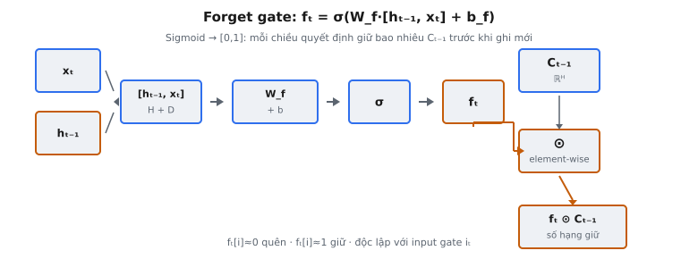

Forget gate là cơ chế gating bên trong LSTM cell quyết định, với từng chiều của cell state, nên giữ lại bao nhiêu giá trị trước đó so với loại bỏ. Gers, Schmidhuber và Cummins (2000) giới thiệu gate này như một mở rộng cho kiến trúc LSTM gốc của Hochreiter và Schmidhuber (1997); forget gate hiện là thành phần chuẩn trong mọi triển khai LSTM hiện đại.

## Nó là gì

Forget gate là bộ lọc element-wise học được, áp dụng lên cell state $c_{t-1}$ trước khi cập nhật cell state tại time step $t$. Nó tạo ra vectơ $f_t \in \mathbb{R}^H$ với mỗi phần tử nằm trong $[0, 1]$. Giá trị $0$ nghĩa là "quên hoàn toàn chiều này của cell state," còn giá trị $1$ nghĩa là "giữ nguyên chiều này." Các giá trị giữa $0$ và $1$ biểu diễn mức giữ lại một phần.

Gate xem xét hai input: hidden state trước $h_{t-1}$ và input hiện tại $x_t$. Chúng được nối (concatenate), nhân với ma trận trọng số học được $W_f$, cộng bias $b_f$, rồi đi qua sigmoid. Kết quả là mặt nạ giữ lại theo từng chiều, áp dụng lên cell state qua phép nhân element-wise.

Trong toàn bộ LSTM cell, forget gate là phép toán đầu tiên chạm vào cell state tại mỗi time step. Cập nhật cell state đầy đủ là $c_t = f_t \odot c_{t-1} + i_t \odot \tilde{c}_t$, trong đó forget gate điều khiển số hạng đầu (giữ gì từ quá khứ) còn input gate $i_t$ cùng candidate $\tilde{c}_t$ điều khiển số hạng thứ hai (ghi thông tin mới). Forget gate và input gate hoạt động độc lập: cell có thể đồng thời quên nội dung cũ ở một số chiều và ghi nội dung mới ở các chiều khác.

::: {#fig-lstm-forget fig-cap="Forget gate: $f_t=\\sigma(W_f\\cdot[h_{t-1},x_t]+b_f)$, rồi $f_t\\odot C_{t-1}$ (sigmoid $\\in(0,1)$, element-wise). Mỗi chiều quyết định giữ bao nhiêu trước khi ghi mới." fig-alt="Luồng concat, W_f, sigmoid ra f_t, nhân element-wise với C_t-1."}
{fig-align="center"}
:::

## Các phương trình chính

Gọi $x_t \in \mathbb{R}^D$ là input tại time step $t$ và $h_{t-1} \in \mathbb{R}^H$ là hidden state trước đó. Tính forget gate gồm ba giai đoạn.

**Giai đoạn 1 — Nối vector.** Hidden state trước và input hiện tại được xếp thành một vectơ:

$$
[h_{t-1}, x_t] \in \mathbb{R}^{H+D}
$$

Thứ tự nối đặt $h_{t-1}$ trước, rồi $x_t$. Thứ tự này phải nhất quán với cách $W_f$ được định nghĩa: $H$ cột đầu của $W_f$ nhân $h_{t-1}$, $D$ cột cuối nhân $x_t$.

**Giai đoạn 2 — Biến đổi affine.** Vectơ nối được biến đổi bởi ma trận trọng số và bias:

$$
z_f = W_f \cdot [h_{t-1}, x_t] + b_f
$$

Ở đây $W_f \in \mathbb{R}^{H \times (H+D)}$ và $b_f \in \mathbb{R}^H$. Tích ma trận–vectơ cho $z_f \in \mathbb{R}^H$, vectơ logit pre-activation. Mỗi phần tử $z_f[i]$ là tổ hợp có trọng số của mọi phần tử từ $h_{t-1}$ và $x_t$, cộng thêm một số hạng bias.

**Giai đoạn 3 — Kích hoạt sigmoid.** Các logit được nén về $[0, 1]$:

$$
f_t = \sigma(z_f) = \sigma(W_f \cdot [h_{t-1}, x_t] + b_f)
$$

Sigmoid $\sigma(x) = \frac{1}{1 + e^{-x}}$ ánh xạ từng phần tử độc lập vào $(0, 1)$. Điều này đặt tên cho forget gate: mỗi chiều đầu ra độc lập "quyết định" phần trăm tương ứng của chiều cell state nên quên.

Đầu ra forget gate $f_t$ sau đó áp dụng lên cell state qua phép nhân element-wise:

$$
c_t = f_t \odot c_{t-1} + i_t \odot \tilde{c}_t
$$

Số hạng $f_t \odot c_{t-1}$ là nơi forget gate phát huy tác dụng. Nếu $f_t[i] = 0.1$, thì $c_t[i]$ chỉ giữ $10\%$ giá trị trước đó ở chiều $i$ trước khi input gate ghi nội dung mới.

## Tại sao cần forget gate

LSTM gốc do Hochreiter và Schmidhuber đề xuất năm 1997 không có forget gate. Cập nhật cell state trong công thức gốc thuần cộng: $c_t = c_{t-1} + i_t \odot \tilde{c}_t$. Input gate điều khiển thông tin mới vào cell state, nhưng không có cơ chế loại bỏ thông tin cũ. Một khi giá trị được ghi vào cell state, nó tồn tại vô hạn.

Thiết kế này tạo ra vấn đề cơ bản. Trong các tác vụ ngữ cảnh thay đổi — như language modeling khi chủ đề câu chuyển hướng, hay dự báo time-series khi chế độ nền thay đổi — cell state tích lũy thông tin lỗi thời. Không có cách reset hay suy giảm giá trị cũ, cell state có thể tăng không giới hạn, dẫn đến bất ổn định số (activation bão hòa, exploding gradient) và không thích ứng được với ngữ cảnh mới.

Gers, Schmidhuber và Cummins giải quyết điều này trong bài báo 2000 "Learning to Forget: Continual Prediction with LSTM." Họ quan sát rằng "the forget gate learns to reset memory cells when their contents are out of date." Phép bổ sung đơn giản — nhân cell state với vectơ gating học được trước khi cộng nội dung mới — nhưng thay đổi căn bản hành vi LSTM. Cập nhật cell state chuyển từ $c_t = c_{t-1} + i_t \odot \tilde{c}_t$ sang $c_t = f_t \odot c_{t-1} + i_t \odot \tilde{c}_t$.

Forget gate hiệu quả đến mức trở thành vĩnh viễn. Mọi triển khai LSTM hiện đại — PyTorch, TensorFlow, JAX — đều có forget gate mặc định. "LSTM" như hiểu ngày nay luôn chỉ phiên bản có forget gate.

## Sigmoid như công tắc mềm

Việc chọn sigmoid cho kích hoạt forget gate là có chủ đích và phục vụ nhiều mục đích.

**Khoảng $[0, 1]$ mượt.** Sigmoid ánh xạ mọi số thực vào khoảng mở $(0, 1)$. Điều này khiến nó phù hợp cho gate biểu diễn "phần trăm giữ lại." Ngưỡng cứng (hàm bước) chỉ cho quyết định nhị phân — giữ hoàn toàn hay quên hoàn toàn — mà không có gradient chảy qua. Sigmoid cung cấp chuyển tiếp mượt, khả vi cho phép mạng học mức giữ lại tinh tế qua gradient descent.

**Độc lập theo từng chiều.** Sigmoid được áp dụng element-wise. Mỗi trong $H$ chiều đầu ra forget gate được tính độc lập. Chiều 3 có thể cho $f_t[3] = 0.95$ (giữ gần như mọi thứ) trong khi chiều 7 cho $f_t[7] = 0.02$ (gần như quên mọi thứ), tất cả trong cùng một time step. Các chiều khác nhau của cell state có thể mã hóa loại thông tin khác nhau với yêu cầu duy trì khác nhau.

**Tính chất gradient.** Đạo hàm sigmoid là $\sigma'(x) = \sigma(x)(1 - \sigma(x))$, với giá trị lớn nhất $0.25$ tại $x = 0$. Khi gate bão hòa (gần $0$ hoặc $1$), gradient tiến về zero. Điều này nghĩa là mạng có thể "cam kết" giữ hay quên một chiều — một khi bão hòa, gate ngừng thay đổi, ổn định huấn luyện. Nó cũng nghĩa là gate có thể kẹt nếu khởi tạo trong vùng bão hòa, động lực khởi tạo bias cẩn thận.

**So sánh với tanh.** Candidate cell state dùng tanh, ánh xạ vào $[-1, 1]$, vì giá trị cell state cần vừa dương vừa âm. Forget gate dùng sigmoid vì phần trăm giữ lại vốn không âm — không có ý nghĩa "giữ $-30\%$" của một chiều cell state.

## Bối cảnh bài báo

Hochreiter và Schmidhuber xuất bản "Long Short-Term Memory" năm 1997, giới thiệu kiến trúc LSTM để giải quyết vanishing gradient trong recurrent neural network. Kiến trúc gốc có input gate và output gate nhưng không có forget gate. Cell state là "constant error carousel" — thông tin vào qua input gate và tồn tại mãi mãi, được bảo vệ khỏi suy giảm gradient nhờ cơ chế gating.

Việc thiếu forget gate là có chủ đích. Hochreiter và Schmidhuber ưu tiên ngăn vanishing gradient, và cập nhật cell state dạng cộng đảm bảo gradient chảy qua cell state không bị suy giảm. Cái giá là cell không bao giờ "quên được": một khi pattern được ghi vào cell state, nó ở đó mãi.

Ba năm sau, Gers, Schmidhuber và Cummins (2000) xuất bản "Learning to Forget: Continual Prediction with LSTM," giới thiệu forget gate. Họ chứng minh trên các tác vụ continual prediction — mô hình phải theo dõi môi trường thay đổi — forget gate cải thiện đáng kể hiệu năng bằng cách cho LSTM reset trạng thái nội bộ khi ngữ cảnh đổi.

Greff et al. (2017) nghiên cứu quy mô lớn các biến thể LSTM ("LSTM: A Search Space Odyssey") và phát hiện forget gate là thành phần quan trọng nhất. Loại bỏ forget gate gây suy giảm hiệu năng lớn nhất trên mọi tác vụ thử nghiệm, hơn cả loại bỏ bất kỳ gate đơn lẻ nào khác. Điều này xác nhận tầm quan trọng thực tiễn của khả năng xóa bộ nhớ có chọn lọc.

Forget gate cũng đưa vào một chi tiết triển khai quan trọng: **khởi tạo bias**. Jozefowicz, Zaremba và Sutskever (2015) chỉ ra rằng khởi tạo bias forget gate bằng giá trị dương lớn (thường $1.0$ hoặc $2.0$) là thiết yếu. Điều này đảm bảo forget gate bắt đầu gần $1$ (giữ mọi thứ), ngăn mạng quên thông tin trước khi học được điều gì đáng nhớ. PyTorch mặc định theo thực hành này.

## Ví dụ số

Xét LSTM tối giản với hidden size $H = 2$ và input size $D = 2$. Tại time step $t$, các input là:

$$
h_{t-1} = \begin{pmatrix} 0.4 \\ -0.1 \end{pmatrix}, \quad x_t = \begin{pmatrix} 0.7 \\ 0.2 \end{pmatrix}
$$

Ma trận trọng số và bias forget gate:

$$
W_f = \begin{pmatrix} 0.5 & -0.3 & 0.2 & 0.1 \\ -0.1 & 0.4 & 0.3 & -0.2 \end{pmatrix}, \quad b_f = \begin{pmatrix} 1.0 \\ 1.0 \end{pmatrix}
$$

Lưu ý bias được khởi tạo bằng $1.0$, theo khuyến nghị Jozefowicz et al. (2015).

**Bước 1: Nối vector.** Xếp $h_{t-1}$ và $x_t$:

$$
[h_{t-1}, x_t] = [0.4, -0.1, 0.7, 0.2]
$$

**Bước 2: Biến đổi tuyến tính.** Tính $W_f \cdot [h_{t-1}, x_t] + b_f$:

Hàng 1: $0.5(0.4) + (-0.3)(-0.1) + 0.2(0.7) + 0.1(0.2) + 1.0 = 0.20 + 0.03 + 0.14 + 0.02 + 1.0 = 1.39$

Hàng 2: $(-0.1)(0.4) + 0.4(-0.1) + 0.3(0.7) + (-0.2)(0.2) + 1.0 = -0.04 - 0.04 + 0.21 - 0.04 + 1.0 = 1.09$

$$
z_f = \begin{pmatrix} 1.39 \\ 1.09 \end{pmatrix}
$$

**Bước 3: Sigmoid.** Áp dụng $\sigma$ element-wise:

$f_t[0] = \sigma(1.39) = \frac{1}{1 + e^{-1.39}} = \frac{1}{1 + 0.2491} = \frac{1}{1.2491} = 0.8006$

$f_t[1] = \sigma(1.09) = \frac{1}{1 + e^{-1.09}} = \frac{1}{1 + 0.3362} = \frac{1}{1.3362} = 0.7484$

$$
f_t = \begin{pmatrix} 0.8006 \\ 0.7484 \end{pmatrix}
$$

**Diễn giải.** Cả hai giá trị đều cao hơn $0.5$, như kỳ vọng với khởi tạo bias dương. Chiều 0 giữ khoảng $80\%$ cell state trước, chiều 1 giữ khoảng $75\%$. Nếu cell state trước là $c_{t-1} = [1.5, -0.8]$, phần giữ lại sau forget gate sẽ là $f_t \odot c_{t-1} = [0.8006 \times 1.5, \, 0.7484 \times (-0.8)] = [1.2009, -0.5987]$. Input gate và candidate sau đó cộng thêm nội dung mới lên nền giữ lại này.

## Liên hệ với GRU

Gated Recurrent Unit (Cho et al., 2014) dùng cách tiếp cận khác cho quyết định quên hay giữ. Thay vì forget gate và input gate riêng, GRU dùng một **update gate** $z_t$ điều khiển cả hai thao tác đồng thời:

$$
h_t = z_t \odot h_{t-1} + (1 - z_t) \odot \tilde{h}_t
$$

Khi $z_t = 1$ trong GRU, hidden state cũ được giữ hoàn toàn và không ghi nội dung mới. Điều này tương tự $f_t = 1$ và $i_t = 0$ trong LSTM. Khi $z_t = 0$, trạng thái cũ được thay hoàn toàn bởi candidate, tương tự $f_t = 0$ và $i_t = 1$.

Khác biệt then chốt là forget gate và input gate của LSTM **độc lập**. LSTM có thể có $f_t = 1$ và $i_t = 1$ đồng thời (giữ mọi thứ và cũng thêm nội dung mới), hoặc $f_t = 0$ và $i_t = 0$ (quên mọi thứ và không thêm gì). GRU ràng buộc chúng cộng thành $1$: giữ càng nhiều thì ghi càng ít, và ngược lại. Ràng buộc này giảm tham số nhưng hạn chế biểu đạt. Thêm nữa, GRU không có cell state riêng — forget gate LSTM tác động lên $c_t$ (bộ nhớ nội bộ được che bởi output gate), còn update gate GRU tác động trực tiếp lên $h_{t-1}$ (hidden state được phơi bày).

## Các lỗi thường gặp

* **Sai thứ tự nối vector.** Ma trận trọng số $W_f$ được định nghĩa theo thứ tự nối cụ thể. Nếu $W_f$ kỳ vọng $[h_{t-1}, x_t]$ nhưng triển khai nối $[x_t, h_{t-1}]$, $H$ cột đầu của $W_f$ sẽ nhân $x_t$ thay vì $h_{t-1}$, và $D$ cột cuối nhân $h_{t-1}$ thay vì $x_t$. Không lỗi chiều vì $H + D$ giống nhau, nhưng gate cho giá trị sai. Đây là bug im lặng làm suy hiệu năng mà không crash.
* **Quên sigmoid.** Bỏ sigmoid và dùng đầu ra affine thô làm giá trị gate nghĩa là gate không giới hạn: có thể âm (đảo dấu cell state) hoặc lớn hơn $1$ (khuếch đại cell state). Cell state nhanh chóng phân kỳ, sinh NaN sau vài time step. Mọi gate LSTM — forget, input và output — phải đi qua sigmoid.
* **Khởi tạo bias forget gate bằng zero.** Với bias zero, forget gate bắt đầu ở $\sigma(0) = 0.5$ cho mọi chiều, nghĩa là cell ngay lập tức quên một nửa trạng thái mỗi time step. Qua $T$ bước, thông tin suy giảm như $0.5^T$: sau chỉ 10 bước, chỉ còn $0.1\%$ thông tin gốc. Jozefowicz et al. (2015) chỉ ra khởi tạo $b_f = 1.0$ (gate bắt đầu gần $\sigma(1) \approx 0.73$) cải thiện huấn luyện đáng kể. Một số framework dùng $b_f = 2.0$ để giữ lại ban đầu mạnh hơn.
* **Nhầm forget gate với input gate.** Forget gate điều khiển **loại bỏ** gì từ cell state trước; input gate điều khiển **ghi** thông tin mới nào. Trong $c_t = f_t \odot c_{t-1} + i_t \odot \tilde{c}_t$, hoán đổi $f_t$ và $i_t$ nghĩa là gate điều khiển giữ lại lại điều khiển ghi mới. Mạng vẫn có thể huấn luyện, nhưng hội tụ chậm hơn vì vai trò bị đảo ngữ nghĩa.
* **Áp forget gate lên hidden state thay vì cell state.** Forget gate điều chế $c_{t-1}$ (cell state), không phải $h_{t-1}$ (hidden state). Hidden state là input cho phép tính gate, nhưng đầu ra gate nhân với cell state. Viết $f_t \odot h_{t-1}$ thay vì $f_t \odot c_{t-1}$ bỏ qua cell state hoàn toàn, và cell state tích lũy không suy giảm — quay về vấn đề 1997 mà forget gate được thiết kế để giải quyết.
* **Dùng tanh thay sigmoid cho gate.** Kích hoạt tanh ánh xạ vào $[-1, 1]$, cho phép gate đảo dấu chiều cell state khi đầu ra âm. Giá trị gate $-1$ sẽ phủ định cell state thay vì quên nó. Forget gate phải cho giá trị không âm để hoạt động như phần trăm giữ lại, nên sigmoid (ánh xạ vào $(0, 1)$) là kích hoạt đúng. Candidate $\tilde{c}_t$ dùng tanh vì giá trị cell state cần vừa dương vừa âm, nhưng các gate luôn phải dùng sigmoid.


## Code
```python
import numpy as np

def sigmoid(x):
    return 1 / (1 + np.exp(-np.clip(x, -500, 500)))

def forget_gate(h_prev: np.ndarray, x_t: np.ndarray,
                W_f: np.ndarray, b_f: np.ndarray) -> np.ndarray:
    concat = np.concatenate([h_prev, x_t], axis=-1)
    f_t = sigmoid(concat @ W_f.T + b_f)
    return f_t

```
