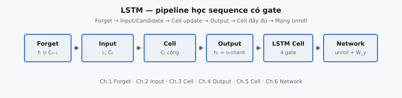

Long Short-Term Memory (LSTM) là kiến trúc recurrent có gate, được thiết kế để vượt qua giới hạn long-range dependency của Vanilla RNN. Kiến trúc này giới thiệu một cell state bền vững và các gate nhân tích điều khiển thông tin nào nên bị quên, cập nhật hay phơi bày tại mỗi time step.

::: {#fig-lstm-pipeline fig-cap="Pipeline LSTM: Forget ($f_t\\odot C_{t-1}$) → Input/Candidate ($i_t,\\tilde{C}_t$) → cập nhật cell cộng → Output ($h_t=o_t\\odot\\tanh(C_t)$) → cell đầy đủ → mạng unroll + $W_y$." fig-alt="Sơ đồ khối ngang từ Forget gate tới Network unroll."}
{fig-align="center"}
:::

Ý tưởng cốt lõi là luồng bộ nhớ được kiểm soát. Thay vì liên tục nén mọi thứ vào một chuyển trạng thái hidden state duy nhất, LSTM tách vận chuyển bộ nhớ (cell state) khỏi biểu diễn đầu ra (hidden state). Thiết kế này cải thiện lan truyền gradient trên sequence dài và cho phép học sequence ổn định trong các tác vụ như language modeling, speech và forecasting.

## Phần này bao gồm những gì

Chuỗi chương này phân rã LSTM cell từng bước:

1. Forget gate và cơ chế giữ lại bộ nhớ có chọn lọc — quyết định chiều nào của cell state nên giữ lại hay loại bỏ trước khi ghi mới.
2. Input gate cùng candidate memory — cơ chế ghi hai phần quyết định *gì* và *bao nhiêu* thông tin mới được thêm vào cell state.
3. Phương trình cập nhật cell state và hợp nhất thông tin — kết hợp phần giữ lại từ quá khứ với phần ghi mới sau forget gate và input gate.
4. Output gate và xây dựng hidden state — lọc cell state nội bộ thành hidden state được phơi bày ra ngoài tại mỗi time step.
5. LSTM cell hoàn chỉnh dưới dạng đồ thị tính toán thống nhất — lắp ráp toàn bộ gate và cell state thành một đơn vị recurrent duy nhất.
6. Hành vi mạng LSTM đa bước hoàn chỉnh — unroll qua nhiều time step, forward pass và luồng gradient end-to-end.

Đọc theo thứ tự này giúp vai trò từng gate trở nên rõ ràng trước khi tích hợp vào hệ recurrent đầy đủ.

## Tại sao LSTM vẫn quan trọng

LSTM vẫn quan trọng cho cả lý thuyết lẫn thực hành:

* nó là mô hình recurrent có gate mang tính chuẩn mực,
* nó cung cấp baseline mạnh trên các tác vụ sequence độ dài trung bình,
* và các nguyên lý gating của nó ảnh hưởng đến nhiều kiến trúc sau này.

Hiểu LSTM tạo cầu nối sạch từ recurrence đơn giản sang các cơ chế bộ nhớ có cấu trúc.

## Kiến thức tiên quyết

* Phương trình cập nhật Vanilla RNN và cơ bản về BPTT.
* Hành vi hàm kích hoạt sigmoid/tanh.
* Thuật ngữ sequence modeling (time step, hidden state).
* Thách thức ổn định gradient trong đồ thị unroll sâu hoặc dài.

## Ký hiệu được sử dụng trong phần này

$$
\begin{aligned}
x_t &:\ \text{input tại time step } t, \\
h_t &:\ \text{hidden state đầu ra}, \\
c_t &:\ \text{cell state (đường bộ nhớ dài hạn)}, \\
f_t, i_t, o_t &:\ \text{forget gate, input gate và output gate}, \\
\tilde{c}_t &:\ \text{candidate cập nhật cell state}.
\end{aligned}
$$
