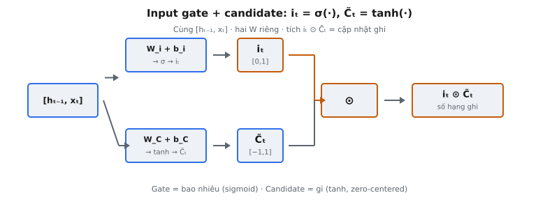

Input gate và candidate memory tạo thành cơ chế "ghi" của LSTM cell. Trong khi forget gate quyết định xóa gì khỏi bộ nhớ, input gate và candidate cùng quyết định thông tin mới nào được lưu. Đây là hai phép tính tách biệt: input gate tạo vectơ trong $[0, 1]$ điều khiển **bao nhiêu** được ghi, còn candidate tạo vectơ trong $[-1, 1]$ đề xuất **gì** được ghi. Tích element-wise của chúng quyết định cập nhật thực sự cộng vào cell state.

## Nó là gì

Input gate và candidate memory là **cơ chế hai phần** cùng quyết định thông tin mới ghi vào cell state LSTM tại mỗi time step. Cơ chế tách thành hai thành phần vì "ghi gì" và "ghi bao nhiêu" cần tính chất toán học khác nhau:

* **Input gate $i_t$:** Vectơ kích hoạt sigmoid trong $[0, 1]$. Mỗi phần tử hoạt động như van điều khiển độ lớn cập nhật cho chiều cell state tương ứng. Giá trị gần 1 nghĩa là "ghi đầy đủ," gần 0 nghĩa là "chặn cập nhật này."
* **Candidate memory $\tilde{C}_t$:** Vectơ kích hoạt tanh trong $[-1, 1]$. Mỗi phần tử đề xuất giá trị mới cộng vào cell state. Giá trị dương đẩy cell state lên, giá trị âm đẩy xuống.

Cả hai thành phần nhận **cùng input nối** $[h_{t-1}, x_t]$ nhưng dùng ma trận trọng số và bias riêng. Gate học phát hiện **khi nào** thông tin liên quan, còn candidate học mã hóa **thông tin đó là gì**. Tích element-wise $i_t \odot \tilde{C}_t$ tạo vectơ cập nhật cộng vào cell state sau khi forget gate hoàn tất.

::: {#fig-lstm-input fig-cap="Input gate + candidate: $i_t=\\sigma(W_i\\cdot[h_{t-1},x_t]+b_i)$, $\\tilde{C}_t=\\tanh(W_C\\cdot[h_{t-1},x_t]+b_C)$; ghi thực sự là $i_t\\odot\\tilde{C}_t$ (gate scale, candidate nội dung)." fig-alt="Hai nhánh từ concat chung: sigmoid i_t và tanh C_tilde, rồi nhân element-wise."}
{fig-align="center"}
:::

## Các phương trình chính

**Bước 1 — Nối input.** Hidden state trước $h_{t-1} \in \mathbb{R}^{h}$ và input hiện tại $x_t \in \mathbb{R}^{d}$ được nối:

$$
[h_{t-1}, x_t] \in \mathbb{R}^{h + d}
$$

Phép nối này dùng chung cho mọi gate LSTM. Vectơ kết hợp mang cả ngữ cảnh recurrent và thông tin input mới.

**Bước 2 — Input gate.** Vectơ nối được biến đổi bởi ma trận trọng số và bias học được, rồi đi qua sigmoid:

$$
i_t = \sigma(W_i \cdot [h_{t-1}, x_t] + b_i)
$$

với $W_i \in \mathbb{R}^{h \times (h+d)}$ và $b_i \in \mathbb{R}^{h}$. Sigmoid $\sigma(z) = \frac{1}{1 + e^{-z}}$ nén từng phần tử vào $(0, 1)$, khiến đầu ra diễn giải được như các điều khiển "cường độ ghi" độc lập.

**Bước 3 — Candidate memory.** Cùng vectơ nối được biến đổi bởi ma trận trọng số và bias khác, rồi đi qua tanh:

$$
\tilde{C}_t = \tanh(W_C \cdot [h_{t-1}, x_t] + b_C)
$$

với $W_C \in \mathbb{R}^{h \times (h+d)}$ và $b_C \in \mathbb{R}^{h}$. Tanh ánh xạ từng phần tử vào $(-1, 1)$, nghĩa là candidate có thể đề xuất cả tăng và giảm cell state.

**Bước 4 — Cập nhật có gate.** Input gate và candidate kết hợp qua phép nhân element-wise:

$$
i_t \odot \tilde{C}_t \in \mathbb{R}^{h}
$$

Mỗi chiều candidate được scale độc lập bởi giá trị gate tương ứng. Tích này được cộng vào cell state trong phương trình cập nhật đầy đủ $C_t = f_t \odot C_{t-1} + i_t \odot \tilde{C}_t$.

## Tại sao cần hai thành phần riêng

Câu hỏi tự nhiên: tại sao không dùng một phép tính duy nhất cho cập nhật cell state? Sự tách biệt tồn tại vì **điều khiển độ lớn và sinh nội dung là hai tác vụ căn bản khác nhau**, hưởng lợi từ kích hoạt và biểu diễn học được khác nhau.

**Gate điều khiển độ lớn.** Input gate $i_t$ hoạt động trong $[0, 1]$ và quyết định **scale** cập nhật theo từng chiều. Nó trả lời "nên sửa chiều bộ nhớ này bao nhiêu ngay bây giờ?" Trong huấn luyện, gate học nhận diện ngữ cảnh nên cập nhật bộ nhớ (gate gần 1) so với ngữ cảnh nên giữ nguyên cell state (gate gần 0).

**Candidate điều khiển nội dung.** Candidate $\tilde{C}_t$ hoạt động trong $[-1, 1]$ và quyết định **hướng và nội dung** cập nhật. Nó mã hóa thông tin ngữ nghĩa thực từ input và ngữ cảnh hiện tại thành dạng phù hợp lưu trữ dài hạn.

**Tích element-wise kết hợp cả hai.** Tích $i_t \odot \tilde{C}_t$ cho phép kiểm soát tinh: một chiều có thể có candidate mạnh $0.95$ nhưng gate chỉ $0.1$, nghĩa là mô hình đã mã hóa thông tin hữu ích nhưng quyết định chưa phải lúc ghi. Chiều khác có candidate vừa $0.4$ nhưng gate mở hoàn toàn $0.98$.

Nếu một phép tính duy nhất tạo cập nhật trực tiếp (ví dụ một lớp tanh), mô hình không có cơ chế ức chế chọn lọc từng chiều. Nó chỉ học cho giá trị nhỏ, lẫn lộn "thông tin này chưa liên quan" với "thông tin này có độ lớn nhỏ." Tách gate–candidate tách rời mức độ liên quan khỏi nội dung.

## Tại sao candidate dùng tanh

**Đầu ra bị giới hạn trong $[-1, 1]$.** Hàm tanh ngăn candidate đề xuất cập nhật không giới hạn có thể khiến cell state bùng nổ. Kết hợp với khoảng $[0, 1]$ của gate, cập nhật tối đa có thể cho bất kỳ chiều cell state nào mỗi time step bị giới hạn giữa $-1$ và $+1$.

**Đầu ra zero-centered.** Khác sigmoid cho đầu ra $(0, 1)$ với mean khoảng $0.5$, tanh tâm tại zero. Điều này thiết yếu vì candidate cần vừa **tăng** vừa **giảm** cell state. Nếu candidate dùng sigmoid (luôn dương), cell state chỉ có thể tăng theo thời gian. Đầu ra zero-centered cho phép mô hình tự nhiên đẩy các chiều cell state theo cả hai hướng.

**Gradient mạnh hơn gần zero.** Đạo hàm tanh tại zero bằng 1 (so với $0.25$ cho sigmoid). Vì nhiều giá trị pre-activation tập trung quanh zero trong huấn luyện, tanh cung cấp tín hiệu gradient mạnh hơn cho cập nhật trọng số candidate, giúp mô hình học biểu diễn hữu ích nhanh hơn.

**Đối chiếu với sigmoid cho gate.** Gate dùng sigmoid vì cần nằm trong $[0, 1]$ để hoạt động như công tắc nhân. Giá trị gate 0 nghĩa là "chặn hoàn toàn" và 1 nghĩa là "cho qua hoàn toàn." Giá trị tanh $-1$ và $+1$ không có diễn giải tương tự cho gate. Hàm được chọn khớp vai trò toán học: sigmoid cho gating (scale), tanh cho nội dung (biểu diễn).

## Bối cảnh bài báo: Hochreiter và Schmidhuber (1997)

Input gate được giới thiệu trong bài báo LSTM gốc, "Long Short-Term Memory" của Sepp Hochreiter và Jurgen Schmidhuber (1997). Bài báo mô tả vai trò input gate với khung cụ thể: **"The input gate protects the memory contents from perturbation by irrelevant inputs."** Khung này đặt gate như **cơ chế bảo vệ**, không chỉ bộ điều khiển ghi.

Vấn đề cốt lõi được giải quyết là **vanishing gradient problem** trong recurrent neural network. RNN chuẩn không học được long-range dependency vì tín hiệu gradient suy giảm theo cấp số nhân qua thời gian. Giải pháp LSTM là **constant error carousel (CEC)**: cell state cập nhật dạng cộng thay vì nhân, cho phép gradient chảy không đổi qua nhiều time step.

Input gate thiết yếu để CEC hoạt động. Không có nó, mọi input tại mọi time step sẽ làm nhiễu cell state, át thông tin dài hạn đã lưu. Gate hoạt động như người gác: học input nào đáng lưu và chặn phần còn lại. Cách dùng "protection" trong bài báo nhấn mạnh hành vi mặc định nên là **không ghi**. Cell state quý giá, và input gate phải chủ động quyết mở trước khi có sửa đổi.

Candidate memory (gọi là "cell input" trong bài gốc) biểu diễn biến đổi input hiện tại thành dạng phù hợp lưu trữ. Bài gốc dùng hàm nén $g$ cho vai trò này; triển khai hiện đại thường dùng tanh.

Đáng chú ý, LSTM 1997 **không** có forget gate. Cell state chỉ có thể được ghi (qua input gate) và đọc (qua output gate), nhưng thông tin cũ không bao giờ bị xóa tường minh. Forget gate được Gers et al. (2000) bổ sung. Trong kiến trúc gốc, input gate còn quan trọng hơn: một khi thông tin vào cell state, nó ở đó vô hạn, nên gate phải rất chọn lọc vì không có cơ chế hoàn tác ghi sai.

## Ví dụ số

Xét LSTM với hidden size $h = 2$ và input size $d = 2$.

**Giá trị cho trước:**

$$
h_{t-1} = \begin{pmatrix} 0.5 \\ -0.3 \end{pmatrix}, \quad x_t = \begin{pmatrix} 0.8 \\ 0.1 \end{pmatrix}
$$

$$
W_i = \begin{pmatrix} 0.4 & -0.2 & 0.3 & 0.1 \\ 0.1 & 0.5 & -0.1 & 0.6 \end{pmatrix}, \quad b_i = \begin{pmatrix} 0.1 \\ -0.2 \end{pmatrix}
$$

$$
W_C = \begin{pmatrix} -0.3 & 0.7 & 0.2 & -0.4 \\ 0.6 & -0.1 & 0.5 & 0.3 \end{pmatrix}, \quad b_C = \begin{pmatrix} 0.0 \\ 0.1 \end{pmatrix}
$$

**Bước 1 — Nối vector:** $[h_{t-1}, x_t] = (0.5, -0.3, 0.8, 0.1)^T$

**Bước 2 — Pre-activation input gate:**

Chiều 1: $(0.4)(0.5) + (-0.2)(-0.3) + (0.3)(0.8) + (0.1)(0.1) + 0.1 = 0.2 + 0.06 + 0.24 + 0.01 + 0.1 = 0.61$

Chiều 2: $(0.1)(0.5) + (0.5)(-0.3) + (-0.1)(0.8) + (0.6)(0.1) + (-0.2) = 0.05 - 0.15 - 0.08 + 0.06 - 0.2 = -0.32$

**Bước 3 — Áp dụng sigmoid:**

$$
i_t = \begin{pmatrix} \sigma(0.61) \\ \sigma(-0.32) \end{pmatrix} = \begin{pmatrix} 0.648 \\ 0.421 \end{pmatrix}
$$

Chiều 1 cho khoảng 65% candidate đi qua. Chiều 2 cho khoảng 42%.

**Bước 4 — Pre-activation candidate:**

Chiều 1: $(-0.3)(0.5) + (0.7)(-0.3) + (0.2)(0.8) + (-0.4)(0.1) + 0.0 = -0.15 - 0.21 + 0.16 - 0.04 = -0.24$

Chiều 2: $(0.6)(0.5) + (-0.1)(-0.3) + (0.5)(0.8) + (0.3)(0.1) + 0.1 = 0.3 + 0.03 + 0.4 + 0.03 + 0.1 = 0.86$

**Bước 5 — Áp dụng tanh:**

$$
\tilde{C}_t = \begin{pmatrix} \tanh(-0.24) \\ \tanh(0.86) \end{pmatrix} = \begin{pmatrix} -0.235 \\ 0.697 \end{pmatrix}
$$

Candidate đề xuất cập nhật **âm** cho chiều 1 và **dương** cho chiều 2. Điều này minh họa cách đầu ra zero-centered của tanh tự nhiên cho phép cả hai hướng.

**Bước 6 — Tích element-wise $i_t \odot \tilde{C}_t$:**

$$
i_t \odot \tilde{C}_t = \begin{pmatrix} 0.648 \times (-0.235) \\ 0.421 \times 0.697 \end{pmatrix} = \begin{pmatrix} -0.152 \\ 0.293 \end{pmatrix}
$$

**Quan sát chính:**

* **Chiều 1:** Candidate đề xuất $-0.235$ nhưng gate cho 65% đi qua, kết quả $-0.152$. Cell state sẽ giảm bấy nhiêu.
* **Chiều 2:** Candidate đề xuất $0.697$ nhưng gate chỉ cho 42% đi qua, kết quả $0.293$. Dù candidate mạnh hơn, gate thấp hơn làm giảm đáng kể cập nhật.
* **Độc lập:** Gate và candidate độc lập. Chiều 2 có candidate mạnh nhưng gate yếu; chiều 1 có candidate yếu hơn nhưng gate mạnh hơn. Nội dung và mức độ liên quan là các phán đoán tách biệt.

## Liên hệ với GRU

Gated Recurrent Unit (GRU), do Cho et al. (2014) giới thiệu, có phép tính candidate riêng khác candidate LSTM ở điểm quan trọng.

**Candidate LSTM** dùng hidden state **thô**:

$$
\tilde{C}_t = \tanh(W_C \cdot [h_{t-1}, x_t] + b_C)
$$

**Candidate GRU** dùng hidden state **có reset gate**:

$$
\tilde{h}_t = \tanh(W \cdot [r_t \odot h_{t-1}, x_t] + b)
$$

với $r_t = \sigma(W_r \cdot [h_{t-1}, x_t] + b_r)$ là reset gate. Trước khi hidden state vào phép tính candidate, mỗi chiều được scale bởi reset gate. Khi $r_t$ gần 0, candidate bỏ qua trạng thái trước và tính thuần từ input hiện tại, cho GRU "bắt đầu lại."

* **LSTM:** Dựa vào forget gate quản lý thông tin cũ và input gate điều khiển ghi. Candidate luôn thấy toàn bộ hidden state.
* **GRU:** Dùng reset gate lọc hidden state trước khi vào candidate. Điều này khiến candidate có điều kiện độc lập với lịch sử — điều candidate LSTM không làm được.

GRU cũng gộp forget gate và input gate thành một update gate $z_t$, dùng quan hệ bổ sung $z_t$ và $(1 - z_t)$: phần trăm trạng thái cũ được giữ thì phần bù dùng cho candidate mới. LSTM xử lý quên và ghi như quyết định độc lập với gate riêng, biểu đạt hơn nhưng nhiều tham số hơn.

## Các lỗi thường gặp

* **Dùng sigmoid thay tanh cho candidate.** Nếu candidate dùng sigmoid, đầu ra nằm trong $(0, 1)$ và không bao giờ tạo cập nhật âm. Cell state chỉ có thể tăng, phá khả năng đẩy chiều xuống. Khoảng $(-1, 1)$ của tanh thiết yếu cho cập nhật hai chiều.
* **Chia sẻ ma trận trọng số giữa $i_t$ và $\tilde{C}_t$.** Input gate và candidate phải có ma trận trọng số **riêng** ($W_i$ và $W_C$). Chia sẻ khiến gate và candidate thành hàm xác định của nhau, loại bỏ kiểm soát độc lập. Mô hình mất khả năng nói "tôi thấy nội dung quan trọng nhưng chưa phải lúc ghi."
* **Quên đây là HAI phép tính tách biệt trả về tuple.** Lỗi phổ biến là coi input gate như một phép toán đơn. Phải tính **cả** $i_t$ và $\tilde{C}_t$ thành hai tensor riêng, rồi kết hợp bằng phép nhân element-wise. Nếu triển khai gộp thành một lớp tuyến tính rồi một kích hoạt, cơ chế bị hỏng.
* **Sai thứ tự nối vector.** Quy ước $[h_{t-1}, x_t]$ nghĩa là hidden state trước, rồi input. Nếu $W_i$ có shape $h \times (h + d)$, $h$ cột đầu nhân $h_{t-1}$ và $d$ cột cuối nhân $x_t$. Đảo thứ tự nối mà không chuyển vị ma trận trọng số cho kết quả sai.
* **Nhầm $\tilde{C}_t$ với $C_t$.** Candidate $\tilde{C}_t$ (có dấu ngã) là cập nhật **đề xuất**. Cell state thực $C_t$ (không dấu ngã) là kết quả $C_t = f_t \odot C_{t-1} + i_t \odot \tilde{C}_t$. Đây là hai tensor ở các giai đoạn khác nhau. Phần input gate chỉ yêu cầu tính $i_t$ và $\tilde{C}_t$, không phải $C_t$ cuối cùng.
* **Áp gate trước kích hoạt.** Thứ tự đúng là: biến đổi tuyến tính, rồi kích hoạt, cho từng thành phần riêng. Nếu áp gate lên giá trị pre-activation hoặc tính $\sigma(\tanh(W \cdot [h, x]))$, toán học hoàn toàn khác và cơ chế bị phá.

## Code
```python
import numpy as np

def sigmoid(x):
    return 1 / (1 + np.exp(-np.clip(x, -500, 500)))

def input_gate(h_prev: np.ndarray, x_t: np.ndarray,
               W_i: np.ndarray, b_i: np.ndarray,
               W_c: np.ndarray, b_c: np.ndarray) -> tuple:
    concat = np.concatenate([h_prev, x_t], axis=-1)
    i_t = sigmoid(concat @ W_i.T + b_i)
    c_tilde = np.tanh(concat @ W_c.T + b_c)
    return i_t, c_tilde

```
