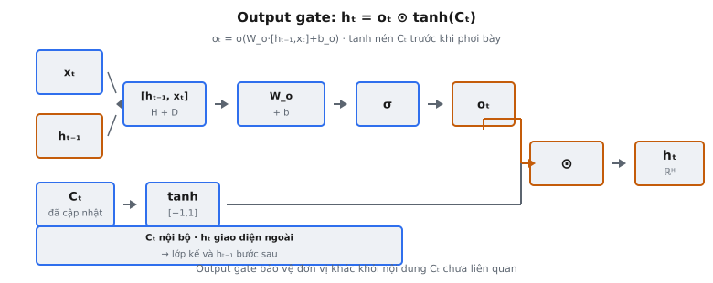

Output gate là cơ chế gating cuối cùng trong ô LSTM, giới thiệu trong "Long Short-Term Memory" (Hochreiter & Schmidhuber, 1997). Nó điều khiển phần nào của cell state $C_t$ đã cập nhật được phơi bày thành hidden state $h_t$, vectơ mà phần còn lại của mạng thực sự nhìn thấy. Không có output gate, mọi mẩu thông tin lưu trong cell state sẽ được phát đi tới các lớp downstream và tính toán gate ở time step kế, bất kể có liên quan ngay lúc này hay không.

## Nó là gì

Tính toán output gate và hidden state là giai đoạn cuối của forward pass ô LSTM. Đến lúc này, forget gate đã quyết định xóa gì khỏi cell state trước $C_{t-1}$, input gate đã quyết định ghi thông tin mới gì, và cell state đã được cập nhật thành $C_t$. Output gate giờ quyết định phần nào của $C_t$ được tiết lộ thành hidden state $h_t$.

Hidden state $h_t$ phục vụ hai vai trò đồng thời. Thứ nhất, nó được truyền tới lớp nằm trên LSTM — classification head, lớp dense, hoặc lớp recurrent khác trong kiến trúc stacked. Thứ hai, nó được đưa ngược vào LSTM ở time step kế làm $h_{t-1}$, tham gia tính cả bốn gate. Output gate hoạt động như bộ lọc chọn lọc giữa bộ nhớ nội bộ của cell và mọi thứ bên ngoài cell.

Hochreiter và Schmidhuber mô tả điều này là "protecting other units from currently irrelevant memory contents stored in the cell." Cell state có thể lưu thông tin sẽ quan trọng mười time step sau nhưng không hữu ích cho dự đoán hiện tại. Output gate học giữ thông tin đó ẩn bên trong $C_t$ cho đến khi trở nên liên quan.

::: {#fig-lstm-output fig-cap="Output gate: $o_t=\\sigma(W_o\\cdot[h_{t-1},x_t]+b_o)$, $h_t=o_t\\odot\\tanh(C_t)$. Tanh nén $C_t$ trước gating; $h_t$ là giao diện ngoài (lớp kế + $h_{t-1}$)." fig-alt="Nhánh o_t từ concat và nhánh C_t qua tanh, nhân element-wise ra h_t."}
{fig-align="center"}
:::

## Các phương trình chính

Gọi $x_t \in \mathbb{R}^D$ là input ở time step $t$, $h_{t-1} \in \mathbb{R}^H$ là hidden state trước, và $C_t \in \mathbb{R}^H$ là cell state đã cập nhật. Concatenation $[h_{t-1}, x_t] \in \mathbb{R}^{H+D}$ được tạo bằng cách xếp chồng hai vectơ.

**Phương trình 1 — Output gate.** Quyết định chiều nào của cell state được phơi bày:

$$
o_t = \sigma(W_o \cdot [h_{t-1}, x_t] + b_o)
$$

Ở đây $W_o \in \mathbb{R}^{H \times (H+D)}$ là ma trận trọng số output gate và $b_o \in \mathbb{R}^H$ là bias. Sigmoid $\sigma$ nén từng phần tử về $(0, 1)$. Giá trị gần $1$ nghĩa là "phơi bày chiều này," gần $0$ nghĩa là "giữ chiều này riêng tư bên trong cell."

**Phương trình 2 — Hidden state.** Kết hợp gate với cell state đã nén:

$$
h_t = o_t \odot \tanh(C_t)
$$

Ký hiệu $\odot$ là nhân element-wise (Hadamard). Tanh nén $C_t$ từ miền có thể không bị chặn về $[-1, 1]$, và $o_t$ co giãn từng chiều độc lập. $h_t \in \mathbb{R}^H$ thu được bị chặn trong $[-1, 1]$ vì cả hai nhân tố đều bị chặn: $o_t \in (0, 1)$ và $\tanh(C_t) \in (-1, 1)$.

## Tại sao gate đầu ra

Cell state $C_t$ là bộ nhớ dài hạn của LSTM. Nó có thể tích lũy thông tin qua nhiều time step vì forget gate cho phép giá trị tồn tại với sửa đổi tối thiểu. Nhưng không phải mọi thứ lưu trong bộ nhớ dài hạn đều liên quan ở mỗi time step. Output gate cung cấp cơ chế phơi bày chọn lọc chỉ phần $C_t$ quan trọng ngay lúc này.

Xét language model xử lý "The cat, which had been sleeping on the mat for several hours, finally woke up and stretched." Cell state có thể lưu chủ ngữ "cat" suốt mệnh đề phụ. Trong "which had been sleeping on the mat for several hours," thông tin chủ ngữ được lưu nhưng chưa cần ngay cho dự đoán từ kế. Output gate giữ các chiều đó bị nén. Khi "finally" xuất hiện và mô hình cần dự đoán "woke," output gate mở các chiều đó để phơi bày chủ ngữ đã lưu.

Không có output gate, hidden state luôn là hàm trực tiếp của toàn bộ cell state. Tính toán gate ở time step kế sẽ bị ảnh hưởng bởi mọi thông tin đã lưu, không chỉ tập con liên quan. Điều này tạo nhiễu trong tín hiệu recurrent và khiến mạng khó học pattern cần chú ý. Output gate thêm một nút thắt học được lọc tín hiệu này.

## Tại sao dùng tanh trên cell state

Cell state $C_t$ không có hàm kích hoạt chặn giá trị. Nó được cập nhật qua quy trình cộng: $C_t = f_t \odot C_{t-1} + i_t \odot \tilde{C}_t$, nơi forget gate $f_t$ co giãn trạng thái cũ và input gate $i_t$ thêm nội dung mới. Vì đây là tổng có trọng số thay vì hàm kích hoạt nén, $C_t$ có thể tăng đến độ lớn tùy ý qua nhiều time step. Điều này có chủ ý — đó là thứ cho phép LSTM duy trì gradient ổn định qua chuỗi dài.

Tuy nhiên, phơi bày giá trị không bị chặn làm hidden state sẽ gây vấn đề. Các lớp downstream nhận $h_t$ sẽ đối mặt input có scale không dự đoán được. Độ lớn gradient thay đổi mạnh tùy $C_t$ đã lớn đến đâu. Tanh ánh xạ $C_t$ vào $[-1, 1]$ trước khi gating, đảm bảo $h_t$ ổn định bất kể đã qua bao nhiêu time step hay tích lũy bao nhiêu thông tin.

Tanh cũng đưa vào tính phi tuyến hữu ích. Hai giá trị cell state đều rất lớn và dương — ví dụ $C_t = 5$ và $C_t = 50$ — đều ánh xạ tới giá trị $\tanh$ gần $1$. Mạng coi chúng là "mạnh dương" mà không phân biệt độ lớn chính xác. Bão hòa này hoạt động như soft clipping ngăn giá trị cực đoan ở một chiều chi phối hidden state.

## Hidden state vs Cell state

LSTM duy trì hai vectơ trạng thái ở mỗi time step, và hiểu vai trò riêng của chúng là thiết yếu.

**Cell state** $C_t \in \mathbb{R}^H$ là bộ nhớ nội bộ. Nó chảy qua thời gian với cập nhật cộng, được bảo vệ bởi forget gate và input gate. Giá trị trong $C_t$ có thể tồn tại nhiều time step với suy giảm tối thiểu vì forget gate có thể truyền chúng gần như không đổi ($f_t \approx 1$). Cell state không bao giờ được lớp nào bên ngoài ô LSTM nhìn trực tiếp.

**Hidden state** $h_t \in \mathbb{R}^H$ là giao diện bên ngoài. Đây là vectơ duy nhất rời khỏi ô LSTM. Nó phục vụ hai mục đích: (1) truyền tới lớp kế cho dự đoán hoặc tính toán thêm, và (2) đưa ngược vào cùng ô ở time step kế làm $h_{t-1}$, tham gia cả bốn tính toán gate. Hidden state là phiên bản cell state đã lọc và bị chặn: $h_t = o_t \odot \tanh(C_t)$.

Sự tách biệt này là một trong những đổi mới kiến trúc then chốt của LSTM. Trong vanilla RNN, chỉ có một vectơ trạng thái $h_t$ phải đồng thời làm bộ nhớ dài hạn và đầu ra ngắn hạn. LSTM tách trách nhiệm: $C_t$ xử lý lưu trữ dài hạn với cập nhật cộng cho ổn định gradient, còn $h_t$ xử lý giao tiếp ngắn hạn với giá trị bị chặn cho ổn định số học. Output gate là cầu nối giữa chúng.

## Bối cảnh bài báo

Hochreiter và Schmidhuber giới thiệu LSTM trong bài 1997 "Long Short-Term Memory," xuất bản trên Neural Computation. Vấn đề trung tâm bài báo giải quyết là **vanishing gradient problem**: trong RNN chuẩn, tín hiệu lỗi lan truyền ngược qua thời gian hoặc suy biến theo cấp số nhân (vanishing) hoặc bùng nổ theo cấp số nhân (exploding), khiến không thể học phụ thuộc dài hạn.

Giải pháp bài báo là **Constant Error Carousel (CEC)** — cơ chế cập nhật cộng của cell state cho phép gradient chảy không đổi qua thời gian. Các gate (forget, input, output) là bộ điều khiển học được điều tiết cái gì vào, tồn tại trong, và thoát khỏi carousel này. Output gate được thiết kế giải quyết thứ tác giả gọi là "output weight conflict": không có nó, kết nối đầu ra của cell phải đồng thời phục vụ dự đoán hiện tại và tính toán gate tương lai.

Kiến trúc 1997 gốc không có forget gate — được Gers, Schmidhuber, và Cummins bổ sung năm 2000. Cập nhật cell state gốc thuần cộng: $C_t = C_{t-1} + i_t \odot \tilde{C}_t$. Output gate, tuy nhiên, là phần thiết kế gốc từ đầu, phản ánh tầm quan trọng cơ bản. Bài báo phát biểu output gate "protects other units from currently irrelevant memory contents stored in the cell," thiết lập nguyên tắc bộ nhớ nội bộ và giao tiếp bên ngoài nên tách rời.

## Ví dụ số

Xét LSTM với $H = 3$ (hidden size) và $D = 2$ (input size). Giả sử forget gate, input gate, và candidate đã thực thi, tạo cell state $C_t$ đã cập nhật. Output gate giờ tính $o_t$ và $h_t$.

**Giá trị cho trước:**

$$
h_{t-1} = \begin{pmatrix} 0.2 \\ -0.5 \\ 0.1 \end{pmatrix}, \quad x_t = \begin{pmatrix} 0.8 \\ -0.3 \end{pmatrix}, \quad C_t = \begin{pmatrix} 1.5 \\ -0.7 \\ 3.2 \end{pmatrix}
$$

**Trọng số và bias:**

$$
W_o = \begin{pmatrix} 0.3 & -0.1 & 0.4 & 0.2 & -0.5 \\ 0.1 & 0.6 & -0.2 & 0.3 & 0.1 \\ -0.4 & 0.2 & 0.5 & -0.1 & 0.3 \end{pmatrix}, \quad b_o = \begin{pmatrix} 0.1 \\ -0.2 \\ 0.0 \end{pmatrix}
$$

**Bước 1: Concatenate.** $[h_{t-1}, x_t] = [0.2, -0.5, 0.1, 0.8, -0.3]$

**Bước 2: Tính pre-activation.** $W_o \cdot [h_{t-1}, x_t] + b_o$:

Row 1: $0.3(0.2) + (-0.1)(-0.5) + 0.4(0.1) + 0.2(0.8) + (-0.5)(-0.3) + 0.1$

$= 0.06 + 0.05 + 0.04 + 0.16 + 0.15 + 0.1 = 0.56$

Row 2: $0.1(0.2) + 0.6(-0.5) + (-0.2)(0.1) + 0.3(0.8) + 0.1(-0.3) + (-0.2)$

$= 0.02 - 0.30 - 0.02 + 0.24 - 0.03 - 0.2 = -0.29$

Row 3: $(-0.4)(0.2) + 0.2(-0.5) + 0.5(0.1) + (-0.1)(0.8) + 0.3(-0.3) + 0.0$

$= -0.08 - 0.10 + 0.05 - 0.08 - 0.09 + 0.0 = -0.30$

**Bước 3: Áp dụng sigmoid để có $o_t$.**

$o_t = [\sigma(0.56), \sigma(-0.29), \sigma(-0.30)] = [0.6365, 0.4280, 0.4256]$

**Bước 4: Áp dụng tanh lên $C_t$.**

$\tanh(C_t) = [\tanh(1.5), \tanh(-0.7), \tanh(3.2)] = [0.9051, -0.6044, 0.9967]$

Lưu ý $C_t[2] = 3.2$ ánh xạ tới $0.9967$ — gần bão hòa tại $1$. Điều này minh họa hiệu ứng nén: giá trị cell state lớn bị nén vào miền bị chặn.

**Bước 5: Nhân element-wise để có $h_t$.**

$h_t[0] = 0.6365 \times 0.9051 = 0.5762$

$h_t[1] = 0.4280 \times (-0.6044) = -0.2587$

$h_t[2] = 0.4256 \times 0.9967 = 0.4242$

**Kết quả cuối:** $h_t = [0.5762, -0.2587, 0.4242]$

Chiều 0 có output gate cao ($0.64$) và cell state dương lớn ($1.5$), nên hidden state phản ánh mạnh bộ nhớ đó. Chiều 2 có output gate thấp hơn ($0.43$) dù cell state còn lớn hơn ($3.2$) — gate nén phần lớn thông tin đã lưu. Cell "biết" điều gì đó ở chiều 2 nhưng chọn không tiết lộ ở time step này.

## Liên hệ với GRU

Gated Recurrent Unit (Cho et al., 2014) là kiến trúc recurrent đơn giản hóa loại bỏ hoàn toàn output gate. Trong GRU, không có cell state riêng — hidden state $h_t$ chính là bộ nhớ. Hidden state cuối được tính bằng nội suy tuyến tính giữa $h_{t-1}$ và candidate $\tilde{h}_t$, không có gating sau nội suy.

Điều này có nghĩa GRU không có cơ chế lưu thông tin riêng tư. Bất cứ gì GRU nhớ luôn được phơi bày đầy đủ làm đầu ra. Trong LSTM, cell state có thể giữ thông tin mà output gate nén trong nhiều time step, chỉ tiết lộ khi liên quan. GRU không làm được — bộ nhớ luôn trong suốt.

Đơn giản hóa này giảm GRU từ bốn tính toán gate (forget, input, candidate, output) xuống ba (reset, update, candidate). Tiết kiệm tham số đúng $\frac{1}{4}$: một ma trận trọng số ít hơn shape $(H, H+D)$ và một bias ít hơn shape $(H,)$. Theo thực nghiệm, đánh đổi quan trọng nhất ở tác vụ cần theo dõi trạng thái nội bộ phức tạp, nơi khả năng ẩn thông tin sau output gate của LSTM tạo lợi thế. Ở tác vụ chuỗi đơn giản hơn, GRU có hiệu năng tương đương với ít tham số hơn.

## Các lỗi thường gặp

- **Dùng $C_{t-1}$ thay $C_t$ trong phương trình hidden state.** Hidden state là $h_t = o_t \odot \tanh(C_t)$, nơi $C_t$ là cell state đã cập nhật gồm đóng góp từ cả forget gate và input gate ở bước hiện tại. Dùng $C_{t-1}$ nghĩa là hidden state không phản ánh thông tin mới ghi ở bước này. Lỗi tinh tế vì $o_t$ tính từ $h_{t-1}$ và $x_t$ — không phụ thuộc $C_t$ — nên giá trị gate đúng kể cả khi dùng sai cell state.
- **Quên áp dụng tanh lên cell state.** Viết $h_t = o_t \odot C_t$ thay vì $h_t = o_t \odot \tanh(C_t)$ bỏ tính phi tuyến nén. Vì $o_t \in (0, 1)$ nhưng $C_t$ có thể tùy ý lớn, hidden state trở thành không bị chặn. Các lớp downstream nhận input scale không dự đoán được, gradient mất ổn định, và huấn luyện phân kỳ.
- **Nhầm output gate với đầu ra mạng.** Output gate $o_t$ không phải dự đoán LSTM hay đầu ra cuối của mạng. Nó là cơ chế gating nội bộ tạo $h_t$. Đầu ra thực (xác suất lớp, logit token kế) được tính bằng cách truyền $h_t$ qua các lớp thêm. Đặt tên biến cẩu thả gây nhầm lẫn LSTM trả về gì.
- **Tính output gate từ hidden state mới.** Output gate phải tính từ $h_{t-1}$ (hidden state trước), không từ $h_t$ (chưa tồn tại). Viết $o_t = \sigma(W_o \cdot [h_t, x_t] + b_o)$ tạo phụ thuộc vòng: $h_t$ phụ thuộc $o_t$, $o_t$ phụ thuộc $h_t$. Cả bốn gate LSTM nhận $[h_{t-1}, x_t]$ làm input, không bao giờ hidden state hiện tại.
- **Dùng nhân ma trận thay vì tích element-wise.** Phép toán $o_t \odot \tanh(C_t)$ là tích element-wise (Hadamard), không phải nhân ma trận. Cả hai toán hạng có shape $(H,)$ cho một mẫu hoặc $(N, H)$ cho batch. Nhân element-wise cho cùng shape. Nhân ma trận co kết quả về scalar, phá mọi thông tin chiều.
- **Giả định output gate luôn gần 1.** Quan niệm sai phổ biến là output gate "hầu hết cho đi qua" và kém quan trọng hơn forget gate hay input gate. Thực tế, LSTM đã huấn luyện dùng output gate mạnh. Trong language modeling, các chiều thường có $o_t < 0.1$ ở time step thông tin lưu chưa cần. Output gate quan trọng ngang các gate khác trong quản lý luồng thông tin.


## Code
```python
import numpy as np

def sigmoid(x):
    return 1 / (1 + np.exp(-np.clip(x, -500, 500)))

def output_gate(h_prev: np.ndarray, x_t: np.ndarray, C_t: np.ndarray,
                W_o: np.ndarray, b_o: np.ndarray) -> tuple:
    concat = np.concatenate([h_prev, x_t], axis=-1)
    o_t = sigmoid(concat @ W_o.T + b_o)
    h_t = o_t * np.tanh(C_t)
    return o_t, h_t

```
