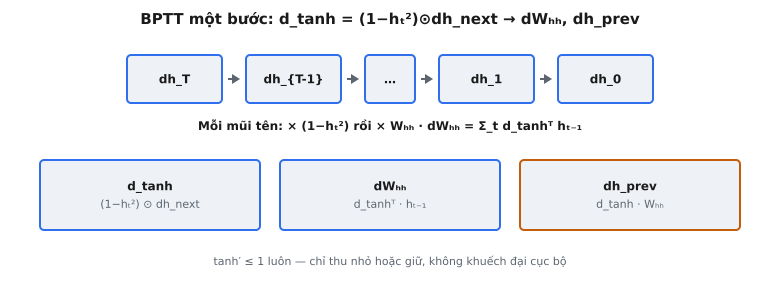

Backpropagation Through Time (BPTT) là thuật toán dùng để tính gradient trong mạng nơ-ron recurrent. Được Werbos (1990) hình thức hóa lần đầu trong "Backpropagation Through Time: What It Does and How to Do It," BPTT unroll recurrence qua các time step và áp dụng **chain rule** chuẩn ngược qua **computational graph** thu được. Đây là nền tảng huấn luyện mọi biến thể RNN, từ vanilla RNN tới LSTM và GRU.

## Nó là gì

Trong vanilla RNN, forward pass ở mỗi time step $t$ tính hidden state mới $h_t$ từ hidden state trước $h_{t-1}$ và input hiện tại $x_t$:

$$
h_t = \tanh(W_{hh} \cdot h_{t-1} + W_{xh} \cdot x_t + b)
$$

Backward pass phải tính gradient của loss theo mọi tham số ($W_{hh}$, $W_{xh}$, $b$) và lan truyền tín hiệu lỗi về các time step trước. BPTT làm điều này bằng cách khái niệm unroll RNN thành mạng feed-forward với $T$ lớp (một lớp mỗi time step), rồi chạy lan truyền ngược chuẩn trên graph đã unroll. Mỗi "lớp" chia sẻ cùng trọng số, nên gradient trọng số được tích lũy qua mọi time step.

Bài toán này tập trung vào backward pass một bước: cho hidden state $h_t$, hidden state trước $h_{t-1}$, ma trận trọng số recurrent $W_{hh}$, và gradient đến từ tương lai $dh_{\text{next}}$, tính gradient chảy ngược về $h_{t-1}$ và gradient của loss theo $W_{hh}$. Phép tính một bước này là khối xây dựng nguyên tử; khi lặp từ bước $T$ về bước $0$ sẽ tạo thành full BPTT.

::: {#fig-rnn-bptt fig-cap="BPTT: $dh_T\\to\\cdots\\to dh_0$; mỗi bước $d_{\\tanh}=(1-h_t^2)\\odot dh_{\\mathrm{next}}$, $dW_{hh}=d_{\\tanh}^{\\top}h_{t-1}$, $dh_{\\mathrm{prev}}=d_{\\tanh}W_{hh}$. $\\tanh'\\le 1$." fig-alt="Chuỗi gradient ngược và ba thẻ công thức một bước."}
{fig-align="center"}
:::

## Các phương trình chính

Forward pass ở một time step tính pre-activation $z_t$ rồi áp dụng phi tuyến tanh:

$$
z_t = W_{hh} \cdot h_{t-1} + W_{xh} \cdot x_t + b
$$

$$
h_t = \tanh(z_t)
$$

Backward pass qua bước này, cho gradient của loss theo $h_t$ (ký hiệu $dh_{\text{next}}$), tiến hành như sau:

**Phương trình 1 — Gradient pre-activation.** Gradient qua phi tuyến tanh:

$$
d_{\tanh} = (1 - h_t^2) \odot dh_{\text{next}}
$$

Ở đây $\odot$ là nhân element-wise. Số hạng $(1 - h_t^2)$ là đạo hàm tanh tại $z_t$, biểu diễn trực tiếp qua output $h_t$. Mỗi phần tử của $d_{\tanh}$ cho biết loss thay đổi bao nhiêu theo phần tử tương ứng của pre-activation $z_t$.

**Phương trình 2 — Gradient trọng số cho $W_{hh}$.** Gradient của loss theo ma trận trọng số recurrent tại time step này:

$$
dW_{hh} = d_{\tanh}^T \cdot h_{t-1}
$$

Đây là tích ngoài: $d_{\tanh}$ có shape $(H,)$ và $h_{t-1}$ có shape $(H,)$, tạo $dW_{hh}$ shape $(H, H)$. Mỗi phần tử $dW_{hh}[i, j]$ đo loss thay đổi bao nhiêu khi $W_{hh}[i, j]$ thay đổi, chỉ xét đóng góp tại time step $t$.

**Phương trình 3 — Gradient hidden state trước.** Gradient chảy ngược về time step trước:

$$
dh_{\text{prev}} = d_{\tanh} \cdot W_{hh}
$$

Ở đây $d_{\tanh}$ có shape $(1, H)$ và $W_{hh}$ có shape $(H, H)$, nên $dh_{\text{prev}}$ có shape $(1, H)$. Gradient này trở thành $dh_{\text{next}}$ cho time step $t - 1$, tạo thành chuỗi backward.

## Đạo hàm tanh

Hàm kích hoạt tanh ánh xạ mọi số thực sang $(-1, 1)$. Đạo hàm của nó trung tâm cho BPTT của vanilla RNN:

$$
\frac{d}{dz}\tanh(z) = 1 - \tanh^2(z)
$$

Vì $h_t = \tanh(z_t)$, thay trực tiếp: $\frac{d}{dz_t}\tanh(z_t) = 1 - h_t^2$. Đây là shortcut tính toán then chốt. Không cần lưu hay tính lại $z_t$ trong backward pass — forward pass đã tính $h_t$, nên đạo hàm có ngay là $1 - h_t^2$. Tiết kiệm cả bộ nhớ lẫn tính toán.

Đạo hàm có tính chất số học quan trọng. Tại $h_t = 0$ (gốc tọa độ), $1 - 0^2 = 1$, gradient đi qua với cường độ đầy đủ. Khi $|h_t|$ tiến tới $1$ (vùng bão hòa), $1 - h_t^2$ tiến tới $0$, về cơ bản triệt tiêu gradient. Hidden state $h_t = 0.99$ tạo đạo hàm cục bộ $1 - 0.99^2 = 0.0199$, suy giảm gradient khoảng $50$ lần.

Giá trị đạo hàm lớn nhất đúng bằng $1$, xảy ra tại $h_t = 0$. Đạo hàm tanh không bao giờ khuếch đại gradient — chỉ truyền nguyên hoặc thu nhỏ. Bất đối xứng giữa suy giảm và khuếch đại là một trong những lý do cơ bản vanilla RNN gặp khó với phụ thuộc tầm xa.

## Chain rule qua thời gian

Thuật toán full BPTT áp dụng backward pass một bước lặp lại, bắt đầu từ time step cuối $T$ và lùi về $t = 0$. Ở mỗi bước, gradient theo $h_t$ có hai thành phần: gradient từ loss tại time $t$ và gradient lan truyền ngược từ time step $t + 1$.

Chuỗi backward:

$$
dh_T \rightarrow dh_{T-1} \rightarrow dh_{T-2} \rightarrow \ldots \rightarrow dh_1 \rightarrow dh_0
$$

Ở mỗi mũi tên, hai phép toán xảy ra: nhân với đạo hàm tanh $(1 - h_t^2)$ và nhân với $W_{hh}$. Mở rộng gradient chảy từ bước $T$ tới bước $k$:

$$
\frac{\partial h_T}{\partial h_k} = \prod_{t=k+1}^{T} \text{diag}(1 - h_t^2) \cdot W_{hh}
$$

Đây là tích của $T - k$ ma trận Jacobian. Mỗi Jacobian tại bước $t$ là $\text{diag}(1 - h_t^2) \cdot W_{hh}$, trong đó $\text{diag}(1 - h_t^2)$ là ma trận đường chéo với đạo hàm tanh trên đường chéo. Gradient tại bước $k$ phụ thuộc toàn bộ chuỗi tích này.

Tổng gradient trọng số là tổng qua mọi time step: $\nabla_{W_{hh}} L = \sum_{t=1}^{T} dW_{hh}^{(t)}$. Giá trị $d_{\tanh}$ ở mỗi bước phụ thuộc mọi gradient lan truyền từ các bước tương lai, nên tích lũy này phản ánh ảnh hưởng của $W_{hh}$ lên mọi time step trong chuỗi.

## Vì sao dẫn tới vanishing gradient

Tích $\prod_{t=k+1}^{T} \text{diag}(1 - h_t^2) \cdot W_{hh}$ tăng hoặc giảm theo cấp số nhân với số time step $T - k$. Vì mọi phần tử của $(1 - h_t^2)$ nằm trong $(0, 1]$, ma trận đường chéo chỉ có thể thu nhỏ vectơ hoặc giữ nguyên. Nếu giá trị suy lớn nhất của $W_{hh}$ nhỏ hơn $1$, mỗi Jacobian là một contraction, và tích của $T - k$ contraction suy giảm theo cấp số nhân về zero.

Xét một kịch bản cụ thể. Giả sử đạo hàm tanh trung bình khoảng $0.5$ và $W_{hh}$ có bán kính phổ $0.9$. Suy giảm hiệu dụng mỗi bước xấp xỉ $0.5 \times 0.9 = 0.45$. Sau $20$ time step, gradient đã được nhân với $0.45^{20} \approx 1.2 \times 10^{-7}$. Tín hiệu lỗi từ bước $T$ tới bước $T - 20$ về cơ bản bằng zero. Học phụ thuộc tầm xa trở nên không thể.

Bengio et al. (1994) cung cấp phân tích nền tảng trong "Learning Long-Term Dependencies with Gradient Descent is Difficult." Họ chứng minh với vanilla RNN, gradient hoặc vanish hoặc explode theo cấp số nhân khi khoảng cách thời gian tăng. Trường hợp vanishing phổ biến hơn nhiều vì cận trên $1$ của đạo hàm tanh nghiêng hệ thống về contraction. Gradient clipping xử lý trường hợp exploding, nhưng không có biện pháp đối xứng cho vanishing — thông tin đơn giản bị mất. Phân tích này trực tiếp thúc đẩy kiến trúc có gate như LSTM và GRU.

## Bối cảnh bài báo

Werbos (1990) giới thiệu BPTT trong "Backpropagation Through Time: What It Does and How to Do It," xuất bản trên Proceedings of the IEEE. Bài mô tả cách áp dụng lan truyền ngược lên hệ động bằng cách unroll quan hệ recurrence thành computational graph tĩnh. Werbos khung insight then chốt: "Learning in recurrent networks requires the propagation of error back through time." Để huấn luyện hệ có bộ nhớ, tín hiệu lỗi phải đi qua mọi bước nơi bộ nhớ đó được dùng.

Bài phân biệt hai chế độ. **Full BPTT** unroll toàn bộ chuỗi từ $t = 0$ tới $t = T$ trước khi tính gradient nào, cần lưu mọi hidden state. **Truncated BPTT** giới hạn backward pass ở số bước cố định $k$, đánh đổi độ chính xác gradient để giảm bộ nhớ. Truncated BPTT với $k$ bước nghĩa là phụ thuộc dài hơn $k$ bước không học được hề gì, nhưng khiến huấn luyện chuỗi rất dài khả thi. Framework hiện đại như PyTorch mặc định full BPTT trong mỗi mini-batch chuỗi.

Bengio et al. (1994) xây trên nền tảng này, cung cấp phân tích nghiêm ngặt vì sao BPTT thất bại nắm bắt phụ thuộc tầm xa trong vanilla RNN. Họ cho thấy độ lớn gradient giảm theo cấp số nhân với độ dài phụ thuộc, khiến hạ gradient chuẩn về mặt toán học không thể gán credit cho sự kiện xa trong quá khứ. Bài thiết lập cơ sở lý thuyết cho kiến trúc có cơ chế bộ nhớ tường minh.

## Ví dụ số

Xét một bước backward với hidden size $H = 2$:

$$
h_t = \begin{pmatrix} 0.8 & -0.6 \end{pmatrix}, \quad h_{t-1} = \begin{pmatrix} 0.3 & 0.7 \end{pmatrix}
$$

$$
W_{hh} = \begin{pmatrix} 0.5 & -0.3 \\ 0.2 & 0.8 \end{pmatrix}, \quad dh_{\text{next}} = \begin{pmatrix} 1.0 & -0.5 \end{pmatrix}
$$

**Bước 1: Đạo hàm tanh.** $(1 - h_t^2)$:

Phần tử 0: $1 - (0.8)^2 = 1 - 0.64 = 0.36$

Phần tử 1: $1 - (-0.6)^2 = 1 - 0.36 = 0.64$

$$
(1 - h_t^2) = \begin{pmatrix} 0.36 & 0.64 \end{pmatrix}
$$

**Bước 2: Gradient pre-activation.** $d_{\tanh} = (1 - h_t^2) \odot dh_{\text{next}}$:

Phần tử 0: $0.36 \times 1.0 = 0.36$

Phần tử 1: $0.64 \times (-0.5) = -0.32$

$$
d_{\tanh} = \begin{pmatrix} 0.36 & -0.32 \end{pmatrix}
$$

**Bước 3: Gradient trọng số.** $dW_{hh} = d_{\tanh}^T \cdot h_{t-1}$:

$dW_{hh}[0, 0] = 0.36 \times 0.3 = 0.108$

$dW_{hh}[0, 1] = 0.36 \times 0.7 = 0.252$

$dW_{hh}[1, 0] = (-0.32) \times 0.3 = -0.096$

$dW_{hh}[1, 1] = (-0.32) \times 0.7 = -0.224$

$$
dW_{hh} = \begin{pmatrix} 0.108 & 0.252 \\ -0.096 & -0.224 \end{pmatrix}
$$

**Bước 4: Gradient hidden state trước.** $dh_{\text{prev}} = d_{\tanh} \cdot W_{hh}$:

$dh_{\text{prev}}[0] = 0.36 \times 0.5 + (-0.32) \times 0.2 = 0.18 - 0.064 = 0.116$

$dh_{\text{prev}}[1] = 0.36 \times (-0.3) + (-0.32) \times 0.8 = -0.108 - 0.256 = -0.364$

$$
dh_{\text{prev}} = \begin{pmatrix} 0.116 & -0.364 \end{pmatrix}
$$

Tuple trả về là $(dh_{\text{prev}}, dW_{hh}) = ([0.116, -0.364], [[0.108, 0.252], [-0.096, -0.224]])$. Chú ý sự suy giảm: $dh_{\text{next}}$ có độ lớn $\sqrt{1.0^2 + 0.5^2} = 1.118$, trong khi $dh_{\text{prev}}$ có độ lớn $\sqrt{0.116^2 + 0.364^2} = 0.382$. Chỉ một bước, độ lớn gradient giảm khoảng $3$ lần.

## Liên hệ với LSTM và GRU

Vấn đề vanishing gradient trong vanilla RNN BPTT trực tiếp thúc đẩy LSTM (Hochreiter và Schmidhuber, 1997). LSTM giới thiệu **cell state** $c_t$ cập nhật qua phép cộng: $c_t = f_t \odot c_{t-1} + i_t \odot \tilde{c}_t$. Khi $f_t \approx 1$ và $i_t \approx 0$, cell state đi qua không đổi: $c_t \approx c_{t-1}$. Điều này tạo đường gradient highway nơi $\partial c_t / \partial c_{t-1} \approx 1$, bất kể bao nhiêu time step tách tín hiệu khỏi loss.

Hochreiter và Schmidhuber gọi đây là **constant error carousel (CEC)**: cell state có thể mang thông tin và gradient qua chuỗi tùy ý dài mà không suy giảm theo cấp số nhân. Forget gate, input gate, và output gate điều khiển cái gì vào, tồn tại trong, và ra khỏi carousel. Điều này khác căn bản với vanilla RNN, nơi mỗi bước backward buộc gradient qua đạo hàm tanh và nhân ma trận, đảm bảo suy giảm dần.

GRU (Cho et al., 2014) đạt hiệu ứng tương tự với ít tham số hơn. Update gate $z_t$ nội suy giữa hidden state cũ và mới: $h_t = z_t \odot h_{t-1} + (1 - z_t) \odot \tilde{h}_t$. Khi $z_t \approx 1$, gradient đi qua đường $z_t \odot h_{t-1}$ gần như không đổi. Cả hai kiến trúc thay chuỗi nhân có vấn đề bằng shortcut cộng cho gradient chảy qua nhiều time step với suy giảm tối thiểu.

## Các lỗi thường gặp

- **Dùng $\tanh(z_t)$ thay vì $h_t$ cho đạo hàm.** Đạo hàm $1 - \tanh^2(z_t)$ về mặt toán học giống hệt $1 - h_t^2$, nhưng triển khai nên dùng $h_t$ trực tiếp. Tính lại $\tanh(z_t)$ cần lưu hay tính lại $z_t$, lãng phí bộ nhớ. Nếu $z_t$ dựng lại sai, lỗi gradient cực khó debug.
- **Transpose ma trận sai trong $dh_{\text{prev}}$.** Gradient $dh_{\text{prev}} = d_{\tanh} \cdot W_{hh}$ dùng $W_{hh}$ trực tiếp khi $d_{\tanh}$ là vectơ hàng shape $(1, H)$. Transpose $W_{hh}$ ở đây tạo gradient sai. Quy tắc đúng phụ thuộc cách viết forward pass: nếu forward là $z = W_{hh} \cdot h_{t-1}$ (ma trận nhân vectơ cột), thì $dh_{t-1} = W_{hh}^T \cdot d_{\tanh}^T$, tương đương $d_{\tanh} \cdot W_{hh}$ ở dạng vectơ hàng. Lệch quy ước là nguồn lỗi im lặng phổ biến.
- **Nhầm $dW_{hh}$ mỗi bước với gradient tổng.** Mỗi time step tạo $dW_{hh}^{(t)} = d_{\tanh}^T \cdot h_{t-1}$ riêng. Gradient tổng là $\nabla_{W_{hh}} L = \sum_{t=1}^{T} dW_{hh}^{(t)}$. Quên tích lũy (chỉ dùng gradient bước cuối) nghĩa là cập nhật bỏ qua ảnh hưởng của $W_{hh}$ lên mọi time step trước. Mạng vẫn có thể huấn luyện chậm, che lỗi, nhưng học tầm xa hoàn toàn hỏng.
- **Quên nhân element-wise cho $d_{\tanh}$.** Gradient pre-activation $d_{\tanh} = (1 - h_t^2) \odot dh_{\text{next}}$ là tích Hadamard element-wise, không phải tích vô hướng hay nhân ma trận. Dùng tích vô hướng sẽ thu vectơ thành scalar. Cả $(1 - h_t^2)$ và $dh_{\text{next}}$ có shape $(H,)$ hoặc $(1, H)$, kết quả phải cùng shape.
- **Bỏ qua gradient clipping cho trường hợp exploding.** Dù vanishing gradient phổ biến hơn, điều ngược lại xảy ra khi $W_{hh}$ có giá trị suy lớn. Độ lớn gradient tăng theo cấp số nhân, khiến cập nhật tham số vượt quá mức thảm họa. Gradient clipping (scale gradient khi norm vượt ngưỡng) là biện pháp chuẩn.
- **Giả định $dh_{\text{next}}$ chỉ đến từ time step kế.** Ở mỗi time step $t$, tổng gradient theo $h_t$ có thể gồm đóng góp từ loss tại time $t$ cộng gradient lan truyền từ bước $t + 1$. Hai nguồn phải được cộng. Bỏ qua gradient loss cục bộ nghĩa là mạng chỉ học từ loss ở time step cuối.


## Code
```python
import numpy as np

def bptt_single_step(dh_next: np.ndarray, h_t: np.ndarray, h_prev: np.ndarray,
                     x_t: np.ndarray, W_hh: np.ndarray) -> tuple:
    dtanh = (1 - h_t**2) * dh_next
    dW_hh = np.dot(dtanh.T, h_prev)
    dh_prev = np.dot(dtanh, W_hh)
    return dh_prev, dW_hh

```
